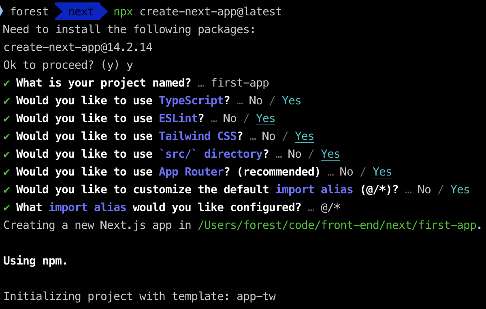
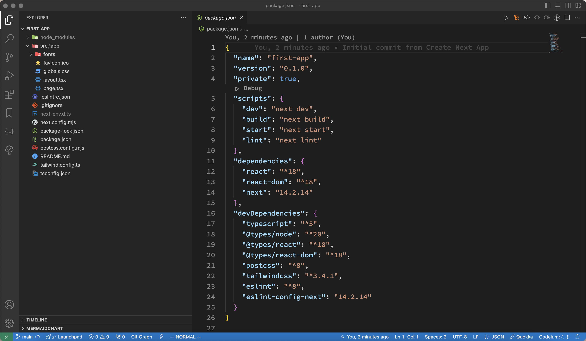
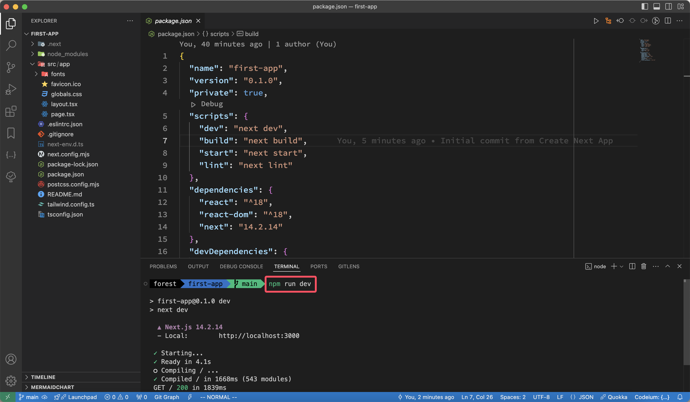
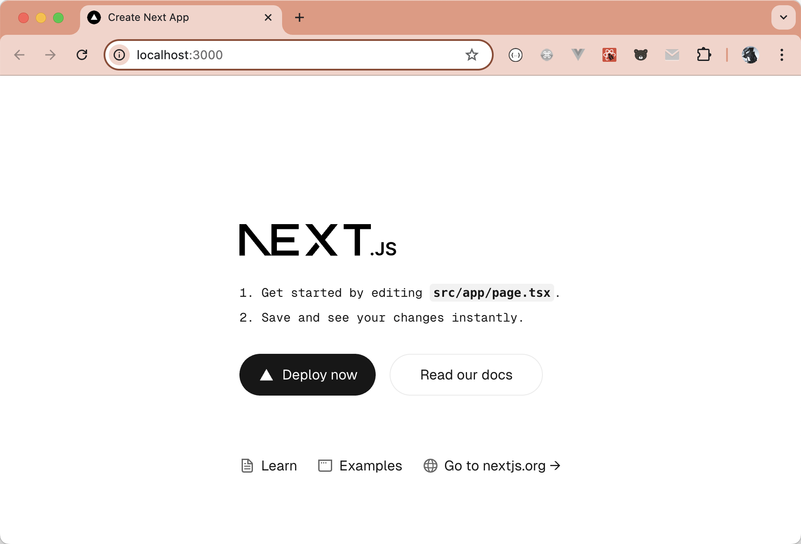
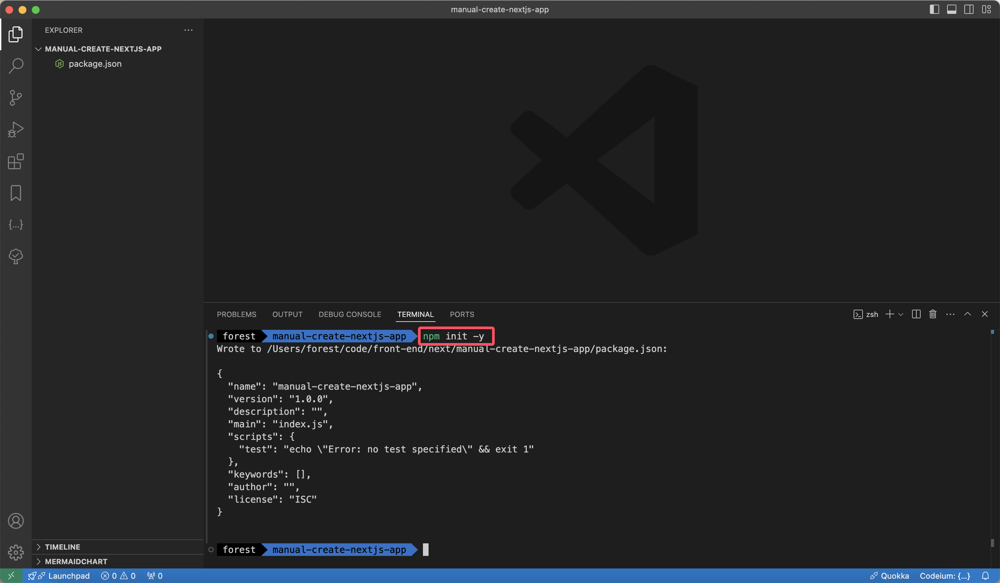
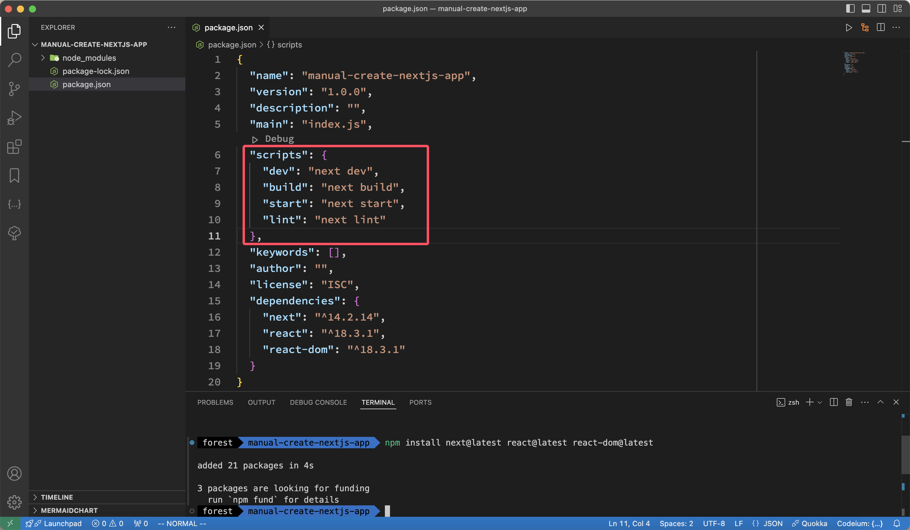
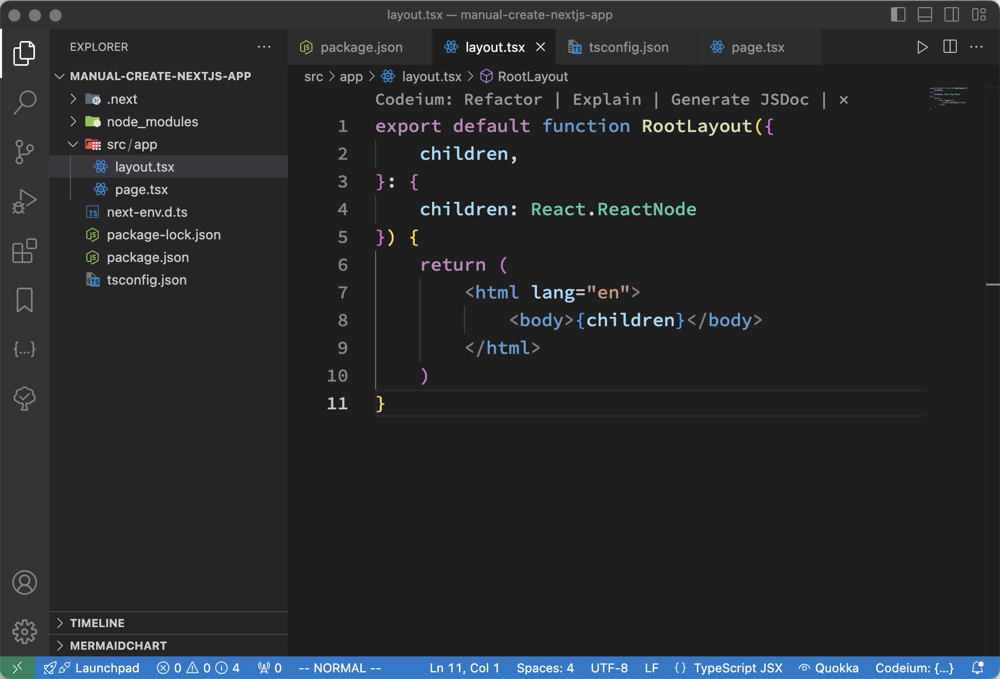
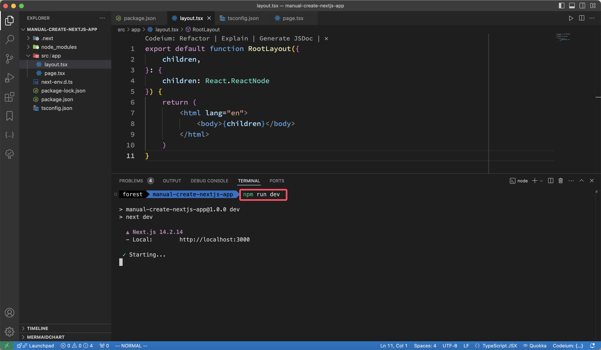
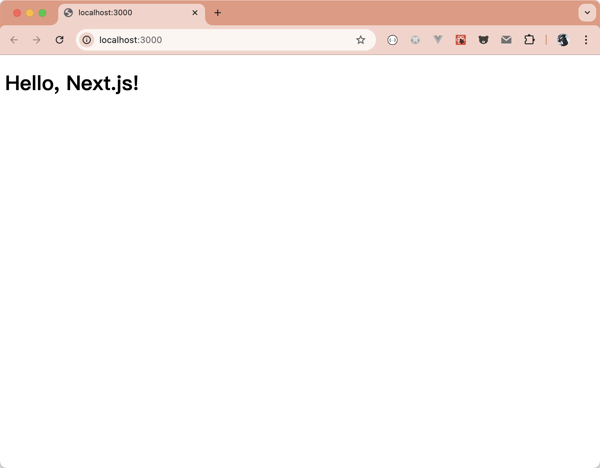

大家好，我是长林啊！一个爱好 JavaScript、Go、Rust 的全栈开发者；致力于终身学习和技术分享。

前面一系列文章，分别从 react 的环境搭建到项目的路由、状态管理等内容；接下我们进入一个新篇章，react 生态的的全栈框架之 Next.js。

经过前面一系列文章的深入分享，我们已经从 React 环境的搭建到项目的路由、状态管理等内容进行了详细介绍。接下来，我们将开启一个新的篇章，聚焦于 React 生态中的全栈框架——Next.js，如果还不熟悉 React，没关系，还可以回顾一下：

- [走进 React：打造交互式用户界面的第一步](https://mp.weixin.qq.com/s/s5moMIyYdCSe820C4yWQSw)
- [深入学习 React：组件、状态与事件处理的完整指南](https://mp.weixin.qq.com/s/PFnnK9SoYURwuxMUwAlZqA)
- [掌握 React Hooks：现代 React 开发的必备技能](https://mp.weixin.qq.com/s/6MFp1VnTQRxiX38Pm9ZZ_Q)
- [打造高效React应用：CSS方案深度解析](https://mp.weixin.qq.com/s/d_OxeFG6x8OAeHo7MMdKZQ)
- [掌控 React 表单：详解受控组件和非受控组件](https://mp.weixin.qq.com/s/gYEh7gekJxubrDEKhu_5Og)
- [掌握 React Router：为你的 React 应用导航](https://mp.weixin.qq.com/s/Fs9gtc4r1K7dx7-jGSpI5A)
- [React 调试不求人：VS Code 与 Chrome 的终极指南](https://mp.weixin.qq.com/s/Ec1d11rc-HhsNQtJlRlnIA)
- [提升 React 应用性能：从状态管理开始](https://mp.weixin.qq.com/s/i1JzvX2HJSm0wWm4sBhbXQ)
- [掌握Zustand：React状态管理的高效之道](https://mp.weixin.qq.com/s/jnWVwxVxv6DIqLF-tsP3Ow)
- [深入zustand：状态管理库的源码解读](https://mp.weixin.qq.com/s/kLwB4tkaLF1ZKhz7ab9rNQ)

Next.js 是一个基于 React 的开源 Web 框架，旨在简化现代 Web 应用的开发。由 Vercel 团队开发和维护，它提供了服务器端渲染（SSR）、静态站点生成（SSG）等功能，使开发者能够轻松构建高性能、可扩展的应用。Next.js 强调“全栈能力”，不仅可以处理前端页面的展示，还支持 API 路由、数据获取、以及动态内容渲染等功能，特别适合构建 SEO 友好型应用。它的零配置理念和强大的工具链，如 CLI 、路由系统和 Server Component，极大地提高了开发效率。

## Next.js CLI 介绍及使用

> 在进入正题之前，我们先来统一一下我们的环境，本文包括后面的文章，都是基于一下环境中的操作结果：
>
> - Node.js **v20.9.0**
> - pnpm **v8.10.5**
> - vs code **v1.94.0**
> - npx v10.2.5
>
> 如果这些环境还没有搭建好，可以去相关的官网下载并安装！

本系列文章都是基于 Next.js 14 的版本，要求 Node.js v18.18 及更高的版本，支持 macOS、Windows、Linux 系统。创建项目可以通过命令的方式自动创建和在原有的项目的基础上手动集成 Next.js。

### 自动创建

我们先从自动创建项目开始，Next.js 官方也提供了 `create-next-app` 脚手架工具创建项目，下面我们来创建一个项目看看：

#### 使用脚手架工具创建项目

```sh
npx create-next-app@latest
```

> 如果你不想使用 `npx` 也可以使用 `pnpm` 或者 `yarn`，使用 `bun` 也可以！
>
> - pnpm：`pnpm create next-app`
> - yarn：`yarn create next-app`
> - bun：`bunx create-next-app`
>   运行命令后如下图：



按照提示，[`create-next-app`](https://nextjs.org/docs/app/api-reference/cli/create-next-app) 工具会创建一个以你的项目名称命名的文件夹，并安装所需的依赖项。

项目创建完成后，在 vs code 中打开如下图：



上图中也打开了 `package.json` 文件，能够看到 `scripts` 中分别有 `dev`、`build`、`start`、`lint`等配置；我们就用 `npm run  dev` 来启动项目，运行后如下图：

> 这些脚本涉及开发应用程序的不同阶段：
>
> - `dev`：运行 `next dev` 以在开发模式下启动 Next.js。
> - `build`：运行 `next build` 以构建用于生产用途的应用程序。
> - `start`：运行 `next start` 以启动 Next.js 生产服务器。
> - `lint`：运行 `next lint` 以设置 Next.js 的内置 ESLint 配置。





上面就是使用脚手架工具创建项目的全过程，当然 Next.js 的代码库里还有很多不同类型的模版，我们上面只是选择一种最基本的方式创建项目，如果需要创建其他模板可以参考 [Next.js Examples](https://github.com/vercel/next.js/tree/canary/examples)

### 手动创建

上面演示了自动创建项目的全过程，下面我们来看看怎么手动创建一个 Next.js 项目！

#### 创建项目目录并安装依赖

先创建一个项目，项目名叫 `manual-create-nextjs-app`，然后再初始化一个 `package.json` 文件：



安装依赖：

```sh
npm install next@latest react@latest react-dom@latest
```

#### 配置 package.json

打开 `package.json` 文件并添加以下内容 `scripts`

```json
"scripts": {
    "dev": "next dev",
    "build": "next build",
    "start": "next start",
    "lint": "next lint"
},
```



上面有过解释这些脚本的概念，这里就不再赘述了。

#### 配置 TypeScript 环境

1. 安装 TypeScript

    ```sh
    npm install --save-dev typescript @types/react @types/node
    ```

2. 初始化 TypeScript 配置

    ```sh
    npx tsx --init
    ```

    

3. 修改 `tsconfig.json` 文件
    - 将 `"jsx": "preserve",` 的注释取消掉
    - 在 `tsconfig.json` 文件中，与 `compilerOptions` 属性同级添加如下配置：

        ```json
        "include": [
          "**/*.ts",
          "**/*.tsx"
        ],
        "exclude": [
          "node_modules"
        ]
        ```

#### 创建路由

Next.js 使用文件系统路由，也就是应用程序中的路由由文件的结构决定。Next.js 在 v13 版本之前一直是 [Pages Router](https://nextjs.org/docs/pages)，在 v13 版本开始，引入了一个新的结构 [App Router](https://nextjs.org/docs/app)，这一块的概念，后面再详细介绍，我们就先使用官方推荐的 App Router 来构建应用。

1. 在项目的根目录创建一个 `src`，然后再 `src` 目录下创建 `app` 目录，然后在 `app` 目录下分别创建 `page.tsx` 和 `layout.tsx`；项目启动后，首先看到的就是这个 `page.tsx` 文件中的内容。

    

2. 在里面创建一个根布局，`app/layout.tsx` 并添加所需的 `<html>` 和 `<body>` 标签：

    ```jsx
    export default function RootLayout({
        children,
    }: {
        children: React.ReactNode
    }) {
        return (
            <html lang="en">
                <body>{children}</body>
            </html>
        )
    }
    ```

3. 在 `src/app/page.tsx` 中添加如下内容：

    ```jsx
    export default function Page() {
        return <h1>Hello, Next.js!</h1>
    }
    ```

整体的目录结构如下：



#### 启动项目

1. 使用 `npm run dev` 运行项目

    

2. 在浏览器中访问上图中显示的 `http://localhost:3000`：

    

## 总结

在这个新篇章中，介绍了如何使用 Next.js 官方脚手架工具 [`create-next-app`](https://nextjs.org/docs/app/api-reference/cli/create-next-app) 快速搭建一个全栈应用，并详细演示了如何手动创建和配置一个 Next.js 项目，包括安装依赖、配置 TypeScript 环境，以及创建基本的文件系统路由。

Next.js 提供了强大的功能如服务器端渲染（SSR）、静态站点生成（SSG）和内置 API 路由，帮助开发者简化现代 Web 应用的开发过程。无论是自动化的脚手架创建，还是手动配置项目，Next.js 都能让开发者快速启动并高效开发，成为构建高性能、可扩展应用的有力工具。
