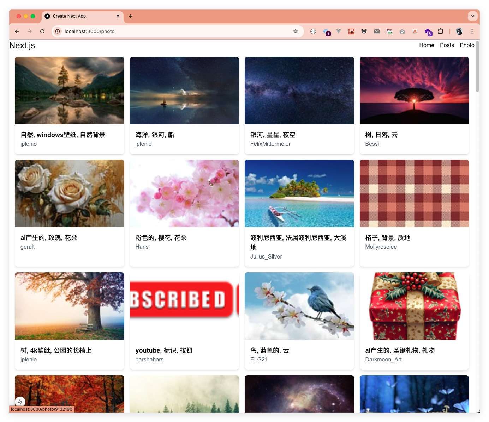

大家好，我是长林啊！一个爱好 JavaScript、Go、Rust 的全栈开发者；致力于终生学习和技术分享。

本文首发在我的微信公众号【长林啊】，欢迎大家关注、分享、点赞！

上一篇文章《Next.js 全栈框架入门：一文搞懂路由》，介绍了如何使用 Next.js 基于文件系统的路由，还分别对 Pages Router 和 App Router 做介绍，对 App Router 的动态路由、路由组、平行路由、路由拦截以及 Next.js 中的核心文件都有详细的案例演示。本篇将开启 Next.js 中的导航、路由跳转和重定向相关的内容；本文基于 Next.js 15 进行开发演示！

在 Next.js 应用中，路由和导航是用户体验的核心部分，直接影响用户如何浏览页面、找到内容，以及在页面之间流畅地过渡。流畅的导航让用户可以轻松地在页面间切换，提高了应用的易用性和满意度。而基于文件系统的路由机制让开发者只需通过创建页面文件即可定义路径，极大地简化了开发流程，提升了效率。同时，Next.js 的服务端渲染（SSR）和静态生成（SSG）支持也有助于提升 SEO，使搜索引擎更有效地抓取和索引页面内容。

在开始正文之前，我们先创建 Next.js 项目用来演示下面的内容。

- 创建项目
```sh
$ npx create-next-app@latest nextjs-navigate --use-pnpm
```
选用配置如下图：


依赖的版本信息如下：


运行 `pnpm dev` 运行后，访问 `http://localhost:3000/` 效果如下：


## 实现导航的几种方式
在 Next.js 中，有 4 种方式可以实现路由导航：

- 使用 `<Link>` 组件
- 使用 `useRouter`（客户端组件）
- 重定向（服务端组件）
- 使用浏览器原生 History API

### 最简洁的导航方式 —— `<Link />` 组件
`<Link>` 是一个内置组件，它扩展了 HTML 中 `<a>` 标签，用于路由之间的预获取（prefetching）和客户端导航。它是 Next.js 中路由之间导航的主要和推荐方式。

#### 基础使用

在 app 目录下先创建一个 layout 的导航栏，然后分别创建 `posts/page.tsx` 和 `photo/page.tsx`：
- layout.tsx
  ```jsx
  import type { Metadata } from "next";
  import localFont from "next/font/local";
  import "./globals.css";
  import Link from 'next/link';
  
  const geistSans = localFont({
      src: "./fonts/GeistVF.woff",
      variable: "--font-geist-sans",
      weight: "100 900",
  });
  const geistMono = localFont({
      src: "./fonts/GeistMonoVF.woff",
      variable: "--font-geist-mono",
      weight: "100 900",
  });
  
  export const metadata: Metadata = {
      title: "Create Next App",
      description: "Generated by create next app",
  };
  
  const nav: { title: string; href: string; description: string }[] = [
      {
          title: "Home",
          href: "/",
          description: "",
      },
      {
          title: "Posts",
          href: "/posts",
          description: "",
      },
      {
          title: "Photo",
          href: "/photo",
          description: "",
      },
  ]
  
  export default function RootLayout({
      children,
  }: Readonly<{
      children: React.ReactNode;
  }>) {
      return (
          <html lang="en">
              <body
                  className={`${geistSans.variable} ${geistMono.variable} antialiased`}
              >
                  <header className="flex justify-between items-center mx-auto px-4 lg:px-0 max-w-[1440px]">
                      <h1 className="text-2xl">Next.js</h1>
                      <nav>
                          <ul className="flex gap-4">
                              {nav.map((item) => (
                                  <li key={item.title}>
                                      <Link href={item.href}>{item.title}</Link>
                                  </li>
                              ))}
                          </ul>
                      </nav>
                  </header>
                  {children}
              </body>
          </html>
      );
  }
  ```
- posts 页面
  ```jsx
  // src/app/posts/page.tsx
  import React from 'react'
  
  const page = () => {
      return (
          <div>posts page</div>
      )
  }
  
  export default page
  ```

- photo 页面
  ```jsx
  // src/app/photo/page.tsx
  import React from 'react'
  
  const page = () => {
      return (
          <div>photo page</div>
      )
  }
  
  export default page
  ```
  效果如下：


#### 支持动态渲染
上一篇《Next.js 全栈框架入门：一文搞懂路由》中介绍了动态路由，我们也来看看链接的动态渲染是怎么回事。依然基于上面项目结构的基础上，使用 pixabay 接口来做 Photo 的内容源，在 photo 下创建 `[slug]/page.tsx`，用于承载文章的详情。
> Pixabay 上面有很多图片，并且提供了免费的 RESTful API 接口，用起来也很简单，只需要你注册一下，然后就可以获取到一个 key，[Pixabay API 文档](https://pixabay.com/api/docs/)。

- photo 页面的代码如下：
```jsx
import React from 'react'
import { PhotoHit, PhotoResponse } from '../types/photo'
import Link from 'next/link'

const page = async () => {
    // 请将 your_key 替换你真实的可以
    const result = await fetch(`https://pixabay.com/api/?key=your_key&per_page=100&lang=zh&orientation=horizontal`)
    if (!result.ok) return <p></p>
    const data = await result.json() as unknown as PhotoResponse
    const list = data.hits;
    return (
        <div>
            <section className='max-w-[1440px] mx-auto'>
                <ul className='grid grid-cols-4 gap-4 p-4'>
                    {list.map((item: PhotoHit) => {
                        return (
                            <li key={item.id} className='bg-white rounded-lg shadow-md overflow-hidden hover:shadow-lg transition-shadow duration-300'>
                                <Link href={`/photo/${item.id}`} className='block'>
                                    
                                    <div className='p-4'>
                                        <p className='text-lg font-semibold'>{item.tags}</p>
                                        <p className='text-gray-600'>{item.user}</p>
                                    </div>
                                </Link>
                            </li>
                        );
                    })}
                </ul>
            </section>
        </div>
    )
}

export default page
```
效果如下：



上面的核心跳转代码就是 `/photo/${item.id}` 对应文件是 `/photo/[slug]/page.tsx`；关于 `[slug]` 这里就不再赘述了。

#### 获取当前路径名
如果需要对当前链接进行判断，你可以使用 `usePathname()` ，它会读取当前 URL 的路径名（pathname）。示例代码如下：
```jsx
'use client'

import { usePathname } from 'next/navigation'
import Link from 'next/link'

export function Links() {
    const pathname = usePathname()

    return (
        <nav>
            <Link className={`link ${pathname === '/' ? 'active' : ''}`} href="/">
                Home
            </Link>

            <Link
                className={`link ${pathname === '/about' ? 'active' : ''}`}
                href="/about"
            >
                About
            </Link>
        </nav>
    )
}
```

#### 跳转到某个滚动的锚链接
如果想在导航时滚动到某个特定锚链接处，可以在 URL 中添加 `#` ，或者直接在 `href` 中传递一个带锚链接的链接。
```jsx
<Link href="/dashboard#settings">Settings</Link>
 
// Output
<a href="/dashboard#settings">Settings</a>
```
#### 在 Link 组件嵌套子组件
如果 `Link` 的子元素是一个自定义组件，它包裹了一个 `<a>` 标签，那么你必须在 `Link` 上添加 `passHref` 属性。`<a>` 标签就不会有 `href` 属性，这会损害你的网站的可访问性，并可能影响 SEO。如果你使用的是 ESLint，有一个内置规则 `next/link-passhref` 来确保正确使用 `passHref`。

```jsx
import Link from 'next/link'
import styled from 'styled-components'

// This creates a custom component that wraps an <a> tag
const RedLink = styled.a`
  color: red;
`

function NavLink({ href, name }) {
    return (
        <Link href={href} passHref legacyBehavior>
            <RedLink>{name}</RedLink>
        </Link>
    )
}

export default NavLink
```
#### 禁用滚动到页面顶部
Next.js 中 `<Link>` 的默认行为是滚动到新路由的顶部，或者在前进后退导航时维持之前的滚动距离。如果你想禁用这种行为，如果你想要禁用这个行为，你可以给 `<Link>` 组件传递一个 `scroll={false}` 属性，或者在使用 `router.push` 和 `router.replace` 的时候，设置 `scroll: false`：
```jsx
import Link from 'next/link'

export default function Page() {
    return (
        <Link href="/#hashid" scroll={false}>
            Disables scrolling to the top
        </Link>
    )
}
```

#### 预获取（prefetch）
预获取（Prefetching）发生在 `<Link />` 组件进入用户视口时。Next.js 在后台预获取和加载链接路由及其数据，以改善客户端导航的性能。如果预取的数据在用户悬停在 `<Link />` 上时已经过期，Next.js 将尝试再次预取它。

> 只在生产环境中才会启用此功能！

prefetch 有三种取值：
 - `null`（默认）：预取行为取决于路由是静态的还是动态的。对于静态路由，将预取完整路由（包括其所有数据）。对于动态路由，`loading.js` 将预取到最近有边界的段的部分路由。
- `true`：静态路由和动态路由都将预取完整路由。
- `false`：进入视口和悬停时都不会发生预取。

```jsx
import Link from 'next/link'

export default function Page() {
    return (
        <Link href="/dashboard" prefetch={false}>
            Dashboard
        </Link>
    )
}
```

### `useRouter`：编程式导航
这种方式是最简单的，但它只能在客户端组件使用（[Client Component](https://nextjs.org/docs/app/building-your-application/rendering/client-components)）；下面是他的使用示例：
```jsx
'use client'

import { useRouter } from 'next/navigation'

export default function Page() {
    const router = useRouter()

    return (
        <button type="button" onClick={() => router.push('/dashboard')}>
            Dashboard
        </button>
    )
}
```
> 官方还是推荐使用 `<Link />` 组件导航，除非有特定的使用要求时就用 `useRouter`。

useRouter 的常用方法：
- `push`：在客户端将新地址添加到浏览器历史栈中。

- `replace`：在客户端导航时，将现在的访问地址替换成目标地址。

- `refresh`：刷新当前路由。

- `prefetch`：预获取提供的路由，加快客户端导航速度。

- `back`：向后导航到浏览器历史栈中的上一页。

- `forward`：向前导航到浏览器历史栈中的下一页。

> Tips:
> - `<Link>` 当路由在视口中可见时，组件会自动预加载路由。
> - `refresh()` 如果缓存了获取请求，则可以重新产生相同的结果。

默认情况下，Next.js 在导航到新路由时会滚动到页面顶部。可以在 `router.push()` 或 `router.replace()` 中传递 `scroll: false` 来禁用该行为：

```jsx
'use client'

import { useRouter } from 'next/navigation'

export default function Page() {
    const router = useRouter()

    return (
        <button
            type="button"
            onClick={() => router.push('/dashboard', { scroll: false })}
        >
            Dashboard
        </button>
    )
}
```

### 重定向
页面重定向有两种类型：**永久重定**向和**临时重定向**。

每种类型都有不同的目的和行为，以及各自的 [HTTP 状态代码](https://developer.mozilla.org/zh-CN/docs/Web/HTTP/Status)：
- 永久重定向：HTTP 状态代码为 `301` 或 `308`，表示页面已永久移动。此重定向由 Web 浏览器缓存，以便将来用户立即被发送到重定向页面。

- 临时重定向：这些重定向的 HTTP 状态代码为 `302` 或 `307`，表示页面已移动，但将来会返回到当前 URL。页面已重定向，但未缓存在浏览器中，因此可以快速恢复。


`307` 和 `308` 状态码与 `301` 和 `302` 状态码的[区别](https://www.seerinteractive.com/insights/307-and-308-response-codes)在于**它们保留了初始请求的原始 HTTP 方法**。Next.js 的重定向默认情况下会返回 `307` 或 `308` 响应。

下面我们一起看看在 Next.js 中有哪些创建永久和临时重定向的方法！

#### 使用 next.config.ts 文件重定向

在项目根目录的 next.config.ts 文件配置作用于整个应用程序及访问它的所有用户；配置方法也很简单，就是配置 `redirects()` 方法，它返回一个数组。比如：
```js
import type { NextConfig } from "next";

const nextConfig: NextConfig = {
    async redirects() {
        return [
            // 访问 /old_page 永久重定向为 /new_page
            {
                source: '/old_page',
                destination: '/new_page',
                permanent: true,
            },
            // 使用通配符匹配路径，访问 /old_blog/123 永久重定向为 /new_blog/123
            {
                source: '/old_blog/:post_id',
                destination: '/new_blog/:post_id',
                permanent: true,
            },
            // 使用正则表达式进行临时重定向匹配，访问 /old_blog/123 临时重定向为 /new_blog/123
            {
                source: '/old_blog/:post_id(\\d{1,})', // 正则表达式匹配 /old_blog/123，但不匹配 /old_blog/xyz:
                destination: '/new_blog/:post_id',
                permanent: false,
            },
        ]
    }
};

export default nextConfig;
```
上面的代码示例展示了几种不同的重定向方式：
- 第一种是从一个页面重定向到另一个页面。
- 第二种是将所有位于 `/old_blog` 路径下的内容重定向到 `/new_blog`。
- 第三种使用正则表达式来实现同样的功能，但只在 `post_id` 为**数字**时才重定向。

将永久重定向添加到配置文件中是使用永久重定向的最佳方式，特别是在服务器端需要通知搜索引擎 URL 已经改变的情况下。

这样做的好处是：

- 可以将所有静态（不变的）重定向放在一个地方。
- 如果你有一个在开发早期创建的页面，后来发现 URL 中有拼写错误，还可以纠正 URL 中的拼写错误，并创建永久重定向，以便旧的错误 URL 仍然有效。


#### 在 App Router 中使用 `redirect/permanentRedirect` 函数

服务端组件中除了使用 Link 组件来做导航的跳转外，还可以使用重定向（`redirect()`）来做导航；使用也很简单：
```jsx
import { permanentRedirect } from 'next/navigation'

async function fetchTeam(id) {
    const res = await fetch('https://...')
    if (!res.ok) return undefined
    return res.json()
}

export default async function Profile({ params }) {
    const team = await fetchTeam(params.id)
    if (!team) {
        permanentRedirect('/login') // redirect('/login')
    }

    // ...
}
```
在服务端组件中使用只是它们的使用场景之一，它还可以在[路由处理程序（Route Handlers）](https://nextjs.org/docs/app/building-your-application/routing/route-handlers)、[Server Actions](https://nextjs.org/docs/app/building-your-application/routing/route-handlers)、[Streaming](https://nextjs.org/docs/app/building-your-application/routing/loading-ui-and-streaming#what-is-streaming) 中使用；如果资源不存在则可以使用 [`notFound()`](https://nextjs.org/docs/app/api-reference/functions/not-found) 函数。

`redirect(path, type)` 和 `permanentRedirect(path, type)` 函数都接受两个参数，而且没有返回值：
- `path`：重定向的 URL；可以是相对路径也可以是结对路径。
- `type`：重定向的类型；默认值是 `replace`，在 Server Actions 中默认为 `push`。在服务端组件中使用 `type` 参数没有任何效果。

#### 使用中间件中的 NextResponse 重定向方法重定向
Next.js中间件是在每个传入服务器的请求完成之前运行的逻辑代码。重定向可以作为中间件逻辑的一部分执行，比如在执行与身份验证、授权、语言、时间或位置相关的重定向时非常有用，因为这些重定向无法使用基本的 URL 模式匹配来完成。

使用 `NextResponse` 调用 `redirect` 方法来更改接下来要加载的页面，实现为 `307` 临时重定向：
```jsx
import { NextResponse, NextRequest } from 'next/server'

export function middleware(request: NextRequest) {

    const isAfter9AM = new Date().getHours() >= 9;

    if (!isAfter9AM) {
        return NextResponse.redirect(new URL('/dashboard', request.url)) // 如果不是上午9点后，则重定向到 /dashboard
    } else {
        return NextResponse.next()
    }
}
```

#### 重定向中 SEO 和使用体验的最佳实践
- 应用中的页面应具有唯一的 URL，而不是在不更新当前页面地址的情况下动态加载内容。
- 不要让用户过多地跳转，每次重定向都需要重新加载内容，这会破坏用户体验。

### 使用原生 History API 导航
在 Next.js 中，也允许你使用原生 `window.history.pushState` 和 `window.history.replaceState` 无需重新加载页面即可更新浏览器历史记录堆栈的方法。一般情况下 `usePathname`（获取路径名的 hook）和 `useSearchParams`（获取页面参数的 hook）一起使用。

- `window.history.pushState` 将其添加到浏览器的历史记录栈中；用户可以通过“后退”按钮返回到之前的状态。比如对产品列表进行排序：
  ```jsx
  'use client'
  
  import { useSearchParams } from 'next/navigation'
  
  export default function SortProducts() {
      const searchParams = useSearchParams()
  
      function updateSorting(sortOrder: string) {
          const params = new URLSearchParams(searchParams.toString())
          params.set('sort', sortOrder)
          window.history.pushState(null, '', `?${params.toString()}`)
      }
  
      return (
          <>
              <button className='px-4 py-2 mx-4 text-cyan-500 border border-dashed border-cyan-300 rounded-full' onClick={() => updateSorting('asc')}>Sort Ascending</button>
              <button className='px-4 py-2 text-purple-500 border border-dashed border-purple-700 rounded-full' onClick={() => updateSorting('desc')}>Sort Descending</button>
          </>
      )
  }
  ```
  效果如下：
  
  

- `window.history.replaceState` 将其替换为浏览器历史记录栈中的当前条目。用户无法通过“后退”按钮返回到之前的状态。比如做国际化多语言的时候：
  ```jsx
  'use client'
  
  import { usePathname } from 'next/navigation'
  
  export function LocaleSwitcher() {
      const pathname = usePathname()
  
      function switchLocale(locale: string) {
          // e.g. '/en/about' or '/fr/contact'
          const newPath = `/${locale}${pathname}`
          window.history.replaceState(null, '', newPath)
      }
  
      return (
          <>
              <button onClick={() => switchLocale('en')}>English</button>
              <button onClick={() => switchLocale('fr')}>French</button>
          </>
      )
  }
  ```
  
## 总结

自此，你对 Next.js 的路由导航、链接和重定向至少有了一个基本的认知，我们来回顾一下这四种方式：

- `Link` 组件：这是最简单的一种导航方式，也是 Next.js 最推荐的一种方式。

- `useRouter`：编程式导航，在客户端中用得最多的一种导航方式。
- 重定向：重定向又分为永久重定向和临时重定向，文中也介绍了三种重定向的方法和最佳实践。
- History API：最原始的导航方式，通过 `pushState` 或者 `replaceState` 的方式来实现导航。


「本文参考资源」：
- [Linking and Navigating](https://nextjs.org/docs/app/building-your-application/routing/linking-and-navigating)：https://nextjs.org/docs/app/building-your-application/routing/linking-and-navigating
- [use-router](https://nextjs.org/docs/app/api-reference/functions/use-router)：https://nextjs.org/docs/app/api-reference/functions/use-router
- [redirect](https://nextjs.org/docs/app/api-reference/functions/redirect)：https://nextjs.org/docs/app/api-reference/functions/redirect
- [redirects](https://nextjs.org/docs/pages/api-reference/next-config-js/redirects)：https://nextjs.org/docs/pages/api-reference/next-config-js/redirects