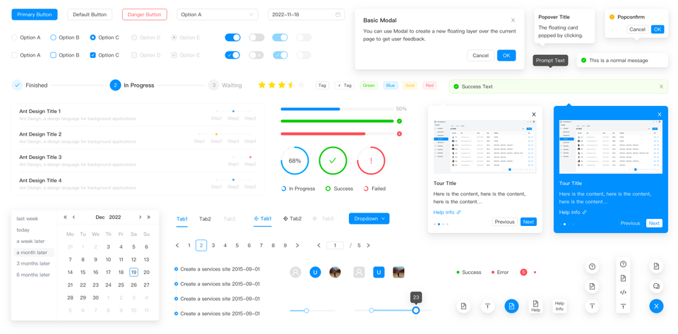

大家好，我是长林啊！一个爱好 JavaScript、Go、Rust 的全栈开发者；致力于终生学习和技术分享。

本文首发在我的微信公众号【长林啊】，欢迎大家关注、分享、点赞！

在之前，我也写过一篇《[打造高效React应用：CSS方案深度解析](https://mp.weixin.qq.com/s/d_OxeFG6x8OAeHo7MMdKZQ)》，里面介绍到**内联样式、CSS 类、CSS Modules 和 CSS-in-JS 技术**，在 Next.js 中也同样是适用，如果有不熟悉的，可以到公众号 「长林啊」中去看！

我们这里就不在做同样的赘述，而是看看 Next.js 生态中有哪些好用的 UI 库。

## 1. tailwindcss

[Tailwind CSS](https://tailwindcss.com/) 改变了传统的 CSS 编写方式，使得开发者能够以更高效和灵活的方式构建用户界面，适合各种规模的项目。

### 主要特点

- 实用优先的设计：Tailwind 提供了大量的低级 CSS 工具类，使开发者可以直接在 HTML 中组合使用这些类来构建设计，而无需离开标记。
- 高度可定制：用户可以通过配置文件自定义颜色、间距、字体、断点等，以满足特定项目需求。
- 响应式设计：Tailwind 支持响应式设计，允许开发者使用不同的类为不同设备和屏幕尺寸配置样式。
- 内置的状态变体：Tailwind 提供了伪类变体（如 hover、focus），使得在同一类中应用不同状态的样式变得简单。
- 插件系统：Tailwind 的插件机制允许开发者扩展框架的功能，添加自定义工具类或组件。

## 2. shadcn ui

[shadcn/ui](https://ui.shadcn.com/) 是 2023 年在 GitHub 上星星数量增长最多的项目，总共获得了 39.5k 的 star，而且在 2023 年 1 月的时候才在 GitHub 发布，到目前为止（2024年11月4日）已经增长到 73.6K star；它是开源 UI 组件库；可以复制和粘贴到你的应用程序中的可访问且可自定义的组件。

### 主要特点

- 可访问性：Shadcn UI 注重可访问性，确保组件符合 WAI-ARIA 标准，便于所有用户使用。
- 无样式设计：组件本身不附带样式，允许开发者根据项目需求自由定制外观，确保与整体设计一致。
- 可组合性：组件设计为高度可组合，开发者可以轻松地将多个组件结合使用，构建复杂的用户界面。
- 与 Tailwind CSS 集成：Shadcn UI 可以与 Tailwind CSS 配合使用，使得样式定制更加灵活和高效。
- 响应式设计：组件支持响应式布局，适应不同设备和屏幕尺寸，提供良好的用户体验。

## 3. chakra ui

[Chakra UI](https://www.chakra-ui.com/docs/get-started/installation) 是一个全面的可访问、可重用和可组合的 React 组件库，可简化现代网络应用程序和网站的开发。目前已经迭代到 v3 版本（2024年10月22日发布)，可轻松构建复杂的用户界面，同时遵循可访问性最佳实践。

### 主要特点

- 易用性：Chakra UI 提供了直观的 API，开发者可以通过简单的组件和属性快速构建界面。
- 可访问性：所有组件都遵循无障碍设计原则，确保应用对所有用户（包括残障人士）友好。
- 主题定制：提供内置的主题系统，开发者可以轻松创建和定制主题，以满足品牌需求。
- 响应式设计：支持响应式样式，允许开发者为不同屏幕尺寸定义不同的样式。
- 灵活的组件：包含大量预构建的组件（如按钮、表单、模态框等），支持组合和扩展，满足各种设计需求。

## 4. MUI（material-ui）

[Material UI](https://mui.com/) 是一个开源的 React 组件库，基于 Google 的 Material Design 规范实现。它包含一个全面的预构建组件集合，开箱即可在生产中使用，并具有一套自定义选项，可以轻松地在我们的组件之上实现你自己的自定义设计系统。

## 主要特点

- 快速构建应用：开源社区贡献的组件，节省开发时间。
- UI 美观：严格遵循 Material Design 规范，提供美观的 UI 组件。
- 可定制性：提供大量可定制性选项，满足不同需求。
- 低门槛协作：降低开发门槛，促进团队协作。
- 社区支持：MUI 拥有活跃的社区和丰富的文档，开发者可以轻松找到示例、教程和解决方案。

## 5. NextUI

[NextUI](https://nextui.org/) 是基于 tailwindcss 和 react aria 的一个 React 组件库，旨在提供快速、简洁和美观的用户界面组件，特别适合与 Next.js 应用程序一起使用。

### 主要特点

- TS 支持：完全由 TypeScript 编写的组件。
- 动画：复杂场景的动画基于 Framer Motion 实现。
- 现代设计：NextUI 提供了一套美观且现代的 UI 组件，符合当今设计趋势，能够提升应用的视觉吸引力。
- 高性能：组件经过优化，确保在性能上表现出色，适合构建需要快速响应的应用。
- 易于使用：组件库提供了简单易用的 API，开发者可以快速上手，减少学习曲线。
- 主题定制：支持主题定制，开发者可以根据项目需求创建独特的视觉风格。
- 响应式设计：内置响应式组件，确保在各种设备和屏幕尺寸下都能提供良好的用户体验。

## 6. Ant Design

[Ant Design](https://ant-design.antgroup.com/index-cn) 是基于 Ant Design 设计体系的 React UI 组件库，适合企业级中后台产品与前台桌面网站。

### 主要特点

- 提炼自企业级中后台产品的交互语言和视觉风格。
- 开箱即用的高质量 React 组件。
- 使用 TypeScript 开发，提供完整的类型定义文件。
- 全链路开发和设计工具体系。
- 数十个国际化语言支持。
- 深入每个细节的主题定制能力。

## 7. Flowbite

[Flowbite](https://flowbite.com/) 是一个开源组件库，使用 Tailwind CSS 实用程序类来创建组件。它提供 600 多个组件和交互元素，以及暗黑模式支持和 Figma 设计系统。它支持多种现代前端开发框架，包括 React、Vue、Svelte、Laravel 和 Rails。Flowbite 的专业版现已推出，其中包含基于 Tailwind CSS 实用程序类的 Figma 设计系统以及数百个开发的页面和组件，例如应用程序 UI、营销 UI 和电子商务布局。

Flowbite 还可与 React、Vue、Angular 和 Svelte 配合使用。它还包括 Next.js、Nuxt、Gatsby、Astro、SolidJS、Remix 和 Meteor.js 等等的安装指南。

### 主要特点

- 支持的组件多。
- 支持的框架多。
- 提供设计师使用的 Figma 支援。
- 提供了开源免费的 SVG 图标库（Flowbite SVG）。

## 总结

Next.js 内置了对 CSS 模块的支持。使用 CSS 模块，你只需要使用 `.module.css` 作为文件后缀名，Next.js 就会自动进行处理。而在 Next.js 生态中，大多都是基于 tailwindcss 和 CSS-in-JS 的方案实现，实现 CSS-in-JS 的库有很多，每个库的实现、使用方式、语法也不尽相同。目前 Next.js 客户端组件中支持使用的库有：

- kuma-ui
- @mui/material
- pandacss
- styled-jsx
- styled-components
- style9
- tamagui
- tss-react
- vanilla-extract

上面没有深入对某一个 CSS-in-JS 库做剖析，而是以目前 Next.js 生态中知名度（star 数）最高的一些库抛砖引玉。
