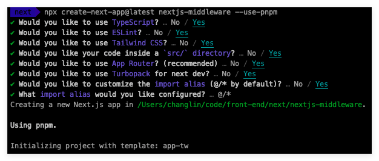
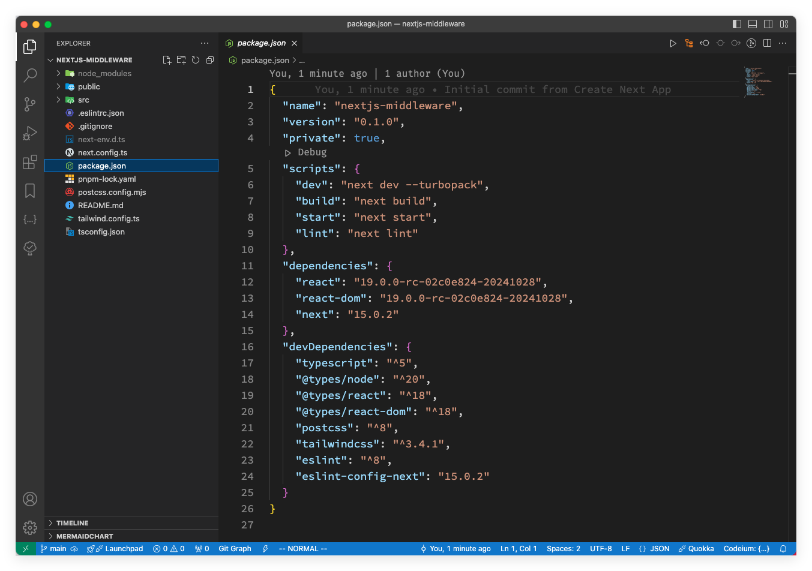
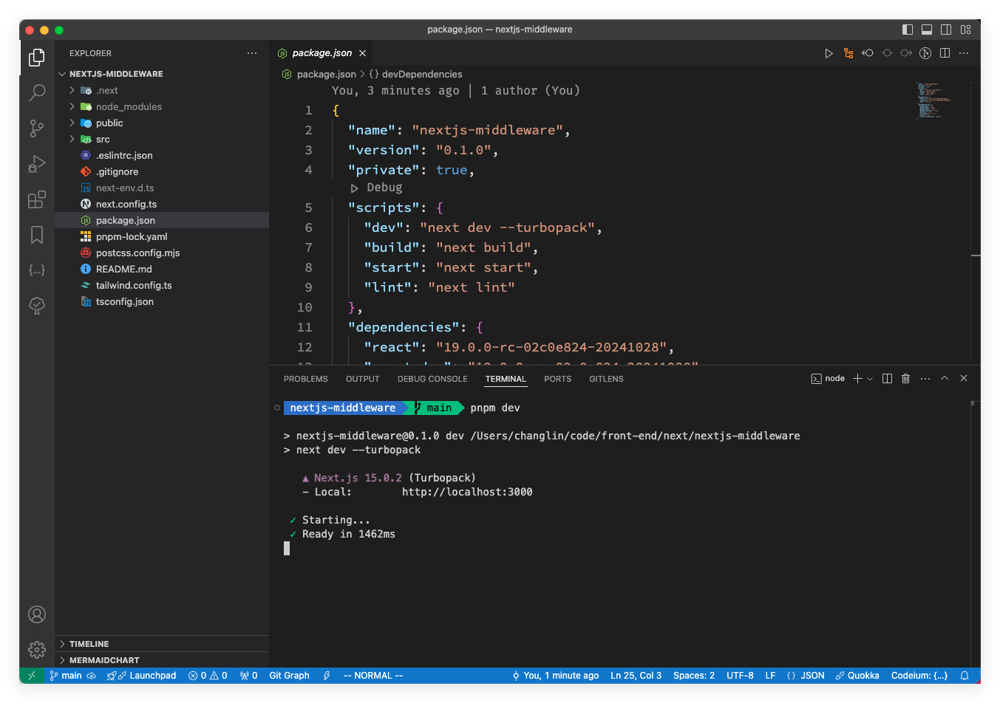
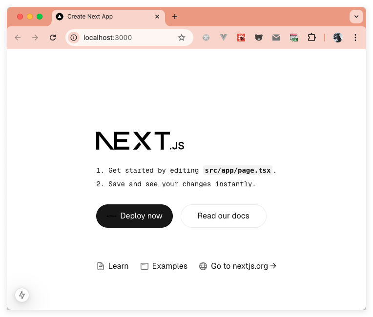
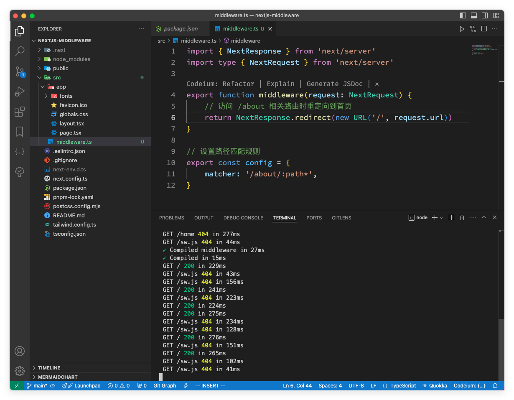
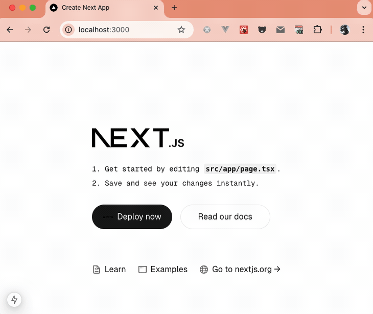
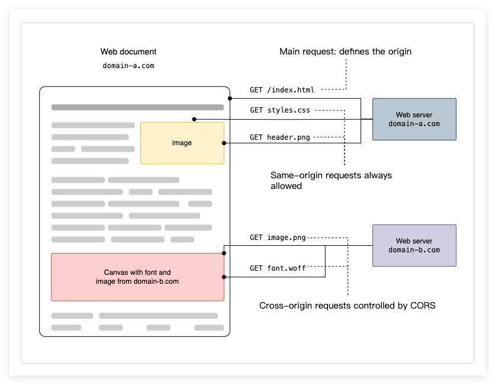
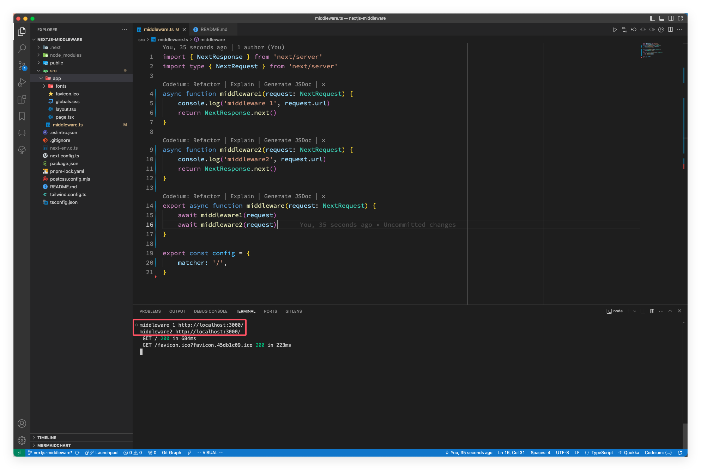
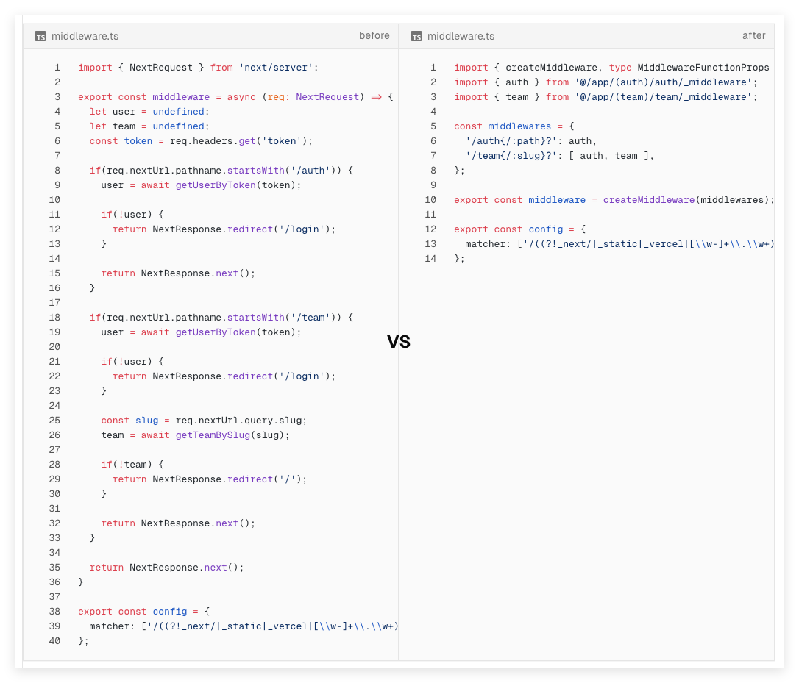

在现代 web 开发中，性能和用户体验是至关重要的因素。Next.js，作为一个强大的 React 框架，不仅提供了高效的服务器端渲染和静态网站生成能力，还引入了中间件这一概念，使得开发者能够在请求处理流程中插入自定义逻辑。

中间件（middleware）允许你在请求完成之前执行一段逻辑代码。甚至可以根据传入的请求，去重写、重定向、修改请求体或者响应体。比如：身份验证和授权、服务器端重定向、路径重写、日志和分析等等场景。

本文将深入探讨 Next.js 中间件的应用场景、实现方法以及最佳实践，帮助你更好地利用这一功能，提升应用的性能和安全性。

## 什么是中间件
Next.js 中的中间件是在请求完成之前执行的函数。它允许你在服务器端渲染过程的请求阶段运行代码，使你能够检查和修改传入请求和传出响应。比如：
- **身份验证和授权**：在授予对特定页面或 API 路由的访问权限之前，确保用户身份并检查会话 cookie。
- **服务器端重定向**：根据某些条件（例如，语言环境、用户角色）在服务器级别重定向用户。
- **路径重写**：根据请求属性动态重写 API 路由或页面的路径，支持 A/B 测试、功能推出或遗留路径。
- **机器人检测**：通过检测和阻止机器人流量来保护您的资源。
- **日志和分析**：在页面或 API 处理之前捕获并分析请求数据以获取见解。
- **功能标记**：动态启用或禁用功能，以实现无缝的功能推出或测试。

在 Next.js 中中间件函数是在项目根目录中名为 `middleware.ts`（或 `middleware.js`）的文件中；与 `/app` 或者 `/pages` 在同级。

## Next.js 中中间件的工作原理

当向 Next.js 应用程序发出请求时，中间件函数会在请求到达路由处理程序之前被调用。中间件函数可以执行身份验证、日志记录、重定向等任务。它们可以允许请求继续，将其重定向到其他路由或终止它。

以下是中间件工作原理的简化流程：

1. **请求拦截**：客户端向的 Next.js 应用发出请求；中间件在 Next.js 应用中充当请求和响应之间的拦截器；当用户访问页面或 API 路由时，请求会首先经过中间件。
2. **中间件执行**：中间件函数拦截请求，执行你编写的自定义逻辑处理请求。比如身份验证、权限检查、请求重定向、数据处理等。中间件可以根据请求的属性（如 URL、请求方法、请求头等）做出不同的响应。
3. **请求处理**：根据中间件中的逻辑，可以修改、重定向或终止请求。
4. **响应**：中间件可以选择继续处理请求，或在某些条件下终止请求处理。根据中间件的逻辑，最终的请求将被转发到相应的页面或 API 路由，或被中断。

## 环境准备

创建项目为后续的演示做准备！我们依然使用最新发布的 Next.js 15 来创建项目！

### 创建项目

使用命令 `npx creact-next-app@latest nextjs-middleware --use-pnpm`；选择的配置如下：



用自己熟悉的编辑器打开创建的项目，如下图：



### 启动项目

1. 在终端中输入 `pnpm dev` 运行项目

  

2. 在浏览器中访问 `http://localhost:3000`，效果如下：

  


## 基本使用

用起来也比较简单，在与 `/app` 或者 `/pages` 同级目录下创建一个 `middleware.ts` 的文件，然后写入下面这段代码：
```js
// /nextjs-middleware/src/middleware.ts
import { NextResponse } from 'next/server'
import type { NextRequest } from 'next/server'

export function middleware(request: NextRequest) {
    // 访问 /about 相关路由时重定向到首页
    return NextResponse.redirect(new URL('/', request.url))
}

// 设置路径匹配规则
export const config = {
    matcher: '/about/:path*',
}
```

注意文件结构：



这个中间件的逻辑用途，就是将所有与 `/about` 相关的路由都重定向到 `/` 的路由页面；它的匹配规则是根据 `config` 的 `matcher` 属性来设置的。

下图就是访问的 `/about`、`/about/111`、`/about/1/1/1` 的路由，全部都重定向到了 `/`路由；效果如下：



## 中间件中的匹配路径

基于上面的示例对中间件的用途有了大致了解，下面我们来看看 `matcher` 的路径匹配还有那些使用姿势！先看看如何设置匹配路径；Next.js 官方提供了有两种方式来指定中间件匹配的路径——。

### matcher 配置
第一种也就是上面示例中的那样：
```js
// 设置路径匹配规则
export const config = {
    matcher: '/about/:path*',
}
```
上面这种是基于单个路径进行匹配，但 `matcher` 不仅支持字符串的形式，还支持数组的形式来匹配多个路径：
```js
// 设置路径匹配规则
export const config = {
    matcher: ['/about/:path*', '/dashboard/:path*'],
}
```
> `:path*` 这种用法是将路径字符串（例如 `/user/:name`、`/about/:path*`）转换为正则表达式，Node.js 社区有一个比较有名的 [path-to-regexp](https://github.com/pillarjs/path-to-regexp) 库来处理，如果感兴趣可以访问 [https://github.com/pillarjs/path-to-regexp](https://github.com/pillarjs/path-to-regexp) 去了解！

`matcher` 配置支持完整的正则表达式，因此支持像断言或字符匹配这样的高级匹配功能。下面是一个例子，展示如何使用负向前瞻来匹配除特定路径以外的所有路径：
```js
export const config = {
    matcher: [
        /*
         * 匹配所有的路径除了以这些作为开头的：
         * - api (API routes)
         * - _next/static (static files)
         * - _next/image (image optimization files)
         * - favicon.ico (favicon file)
         */
        '/((?!api|_next/static|_next/image|favicon.ico).*)',
    ],
}
```
> 负向前瞻（[Negative Lookahead](https://developer.mozilla.org/en-US/docs/Web/JavaScript/Reference/Regular_expressions/Lookahead_assertion)）是一种正则表达式的技术，用于匹配某个模式，但不包括某些特定的内容。

这个正则表达式匹配除以 `api`、`_next/static`、`_next/image` 和 `favicon.ico` 开头的 URL 路径以外的所有路径。

除此之外，还要注意，**路径必须以 `/` 开头；`matcher` 的值必须是常量，这样可以在构建的时候被静态分析；使用变量之类的动态值会被忽略。**

还可以通过使用 `missing` 或 `has` 数组，或者两者的组合来跳过某些请求的中间件处理：

```js
export const config = {
    matcher: [
        /*
         * Match all request paths except for the ones starting with:
         * - api (API routes)
         * - _next/static (static files)
         * - _next/image (image optimization files)
         * - favicon.ico, sitemap.xml, robots.txt (metadata files)
         */
        {
            source:
                '/((?!api|_next/static|_next/image|favicon.ico|sitemap.xml|robots.txt).*)',
            missing: [
                { type: 'header', key: 'next-router-prefetch' },
                { type: 'header', key: 'purpose', value: 'prefetch' },
            ],
        },

        {
            source:
                '/((?!api|_next/static|_next/image|favicon.ico|sitemap.xml|robots.txt).*)',
            has: [
                { type: 'header', key: 'next-router-prefetch' },
                { type: 'header', key: 'purpose', value: 'prefetch' },
            ],
        },

        {
            source:
                '/((?!api|_next/static|_next/image|favicon.ico|sitemap.xml|robots.txt).*)',
            has: [{ type: 'header', key: 'x-present' }],
            missing: [{ type: 'header', key: 'x-missing', value: 'prefetch' }],
        },
    ],
}
```

配置匹配器（Configured matchers）解析规则：
- 必须以 `/` 开头
- 可以包含命名参数： `/about/:path` 匹配 `/about/a` 和 `/about/b` 但不匹配 `/about/a/c`
- 命名参数可以有修饰符（以 `:` 开头）： `/about/:path*` 匹配 `/about/a/b/c` 
  - `*` 表示零个或多个。 
  - `?` 表示零个或一个。
  - `+` 表示一个或多个。
- 可以使用括号内的正则表达式： `/about/(.*)` 与 `/about/:path* `相同

>注意：
>
>命名参数可以使用修饰符来控制匹配的次数，例如 `*`、`?`、`+` 正则表达式可以用括号内的形式来匹配任意字符，例如 `(.*)` 匹配任意字符（包括空字符串）。

### 条件语句

条件语句就没有匹配器那么复杂了，就是根据不同逻辑判断去做不同的响应！
```jsx
import { NextResponse } from 'next/server'
import type { NextRequest } from 'next/server'

export function middleware(request: NextRequest) {
    // 如果 URL 是以 '/about' 开头,重写到 '/about-2'
    if (request.nextUrl.pathname.startsWith('/about')) {
        return NextResponse.rewrite(new URL('/about-2', request.url))
    }

    // 如果 URL 是以 '/dashboard' 开头,重写到 '/dashboard/user'
    if (request.nextUrl.pathname.startsWith('/dashboard')) {
        return NextResponse.rewrite(new URL('/dashboard/user', request.url))
    }
}
```

## 中间件用法

### 跨域（CORS）
简单说下跨域，跨域是浏览器出于安全性，对不同的**域名**、**协议**或**端口**的请求做的安全限制。这种情况下，由于浏览器的同源策略（Same-Origin Policy），通常会限制这种访问，以保护用户的安全和隐私。

跨源 HTTP 请求的一个例子：运行在 https://domain-a.com 的 JavaScript 代码使用 XMLHttpRequest 来发起一个到 https://domain-b.com/data.json 的请求。

出于安全性，浏览器限制脚本内发起的跨源 HTTP 请求。例如，XMLHttpRequest 和 Fetch API 遵循同源策略。这意味着使用这些 API 的 Web 应用程序只能从加载应用程序的同一个域请求 HTTP 资源，除非响应报文包含了正确 CORS 响应头。如下图：


在 Next.js 中，如何通过中间件配置 CORS？
```js
import { NextRequest, NextResponse } from 'next/server'

// 定义允许跨域的源
const allowedOrigins = ['https://acme.com', 'https://my-app.org']

const corsOptions = {
    // 允许的 HTTP 方法
    'Access-Control-Allow-Methods': 'GET, POST, PUT, DELETE, OPTIONS',
    // 允许跨域的请求头
    'Access-Control-Allow-Headers': 'Content-Type, Authorization',
}

export function middleware(request: NextRequest) {
    // 获取请求源
    const origin = request.headers.get('origin') ?? ''

    // 检查请求源是否在允许的源中
    const isAllowedOrigin = allowedOrigins.includes(origin)

    // 检查是否为预检请求
    const isPreflight = request.method === 'OPTIONS'

    if (isPreflight) {
        // 如果是预检请求，返回 CORS 预检响应
        const preflightHeaders = {
            ...(isAllowedOrigin && { 'Access-Control-Allow-Origin': origin }),
            ...corsOptions,
        }
        return NextResponse.json({}, { headers: preflightHeaders })
    }

    // 处理简单请求
    const response = NextResponse.next()

    if (isAllowedOrigin) {
        // 如果是允许的域名，则设置 Access-Control-Allow-Origin 头
        response.headers.set('Access-Control-Allow-Origin', origin)
    }

    Object.entries(corsOptions).forEach(([key, value]) => {
        response.headers.set(key, value)
    })

    // 返回响应
    return response
}

// 配置中间件匹配规则
export const config = {
    matcher: '/api/:path*',
}
```

### 设置 header 头
与路由处理器的用法相同，使用 `NextRequest` 和 `NextResponse` 可以方便地读取和设置 HTTP 头部。
```js
import { NextResponse } from 'next/server'
import type { NextRequest } from 'next/server'


export function middleware(request: NextRequest) {
    // 复制请求头并设置一个新的头部 `x-hello-from-middleware1`
    const requestHeaders = new Headers(request.headers)
    requestHeaders.set('x-hello-from-middleware1', 'hello')


    // 也可以在 NextResponse.next 中设置请求头
    const response = NextResponse.next({
        request: {
            // 新的请求头
            headers: requestHeaders,
        },
    })


    // 设置一个新的响应头 `x-hello-from-middleware2`
    response.headers.set('x-hello-from-middleware2', 'hello')
    return response
}
```

> 设置请求头或者响应头的时候，要避免设置的值过大；头部总体体积过大就会响应 [431](https://developer.mozilla.org/zh-CN/docs/Web/HTTP/Status/431) 状态！

### 设置 cookies
在 Next.js 中，可以通过中间件来设置 cookies。中间件允许你在请求到达 API 路由或页面之前进行操作，可以使用 `NextRequest` 和 `NextResponse` 读取和设置 cookies。

- 对于传入的请求，`NextRequest` 提供了 `get`、`getAll`、`set` 和 `delete` 方法处理 cookies，你也可以用 `has` 检查 cookie 或者 `clear` 删除所有的 cookies。

- 对于返回的响应，`NextResponse` 同样提供了 `get`、`getAll`、`set` 和 `delete` 方法处理 cookies。

```js
import { NextResponse } from 'next/server'
import type { NextRequest } from 'next/server'


export function middleware(request: NextRequest) {
    // 假设请求头中有一个 "Cookie:nextjs=fast" 的头部
    // 使用 `RequestCookies` API 从请求中获取 cookie
    let cookie = request.cookies.get('nextjs')
    console.log(cookie) // => { name: 'nextjs', value: 'fast', Path: '/' }
    const allCookies = request.cookies.getAll()
    console.log(allCookies) // => [{ name: 'nextjs', value: 'fast' }]


    request.cookies.has('nextjs') // => true
    request.cookies.delete('nextjs')
    request.cookies.has('nextjs') // => false


    // 使用 `ResponseCookies` API 在响应中设置 cookie
    const response = NextResponse.next()
    response.cookies.set('vercel', 'fast')
    response.cookies.set({
        name: 'vercel',
        value: 'fast',
        path: '/',
    })
    cookie = response.cookies.get('vercel')
    console.log(cookie) // => { name: 'vercel', value: 'fast', Path: '/' }
    // 响应头中将包含一个 `Set-Cookie:vercel=fast;path=/` 的头部。


    return response
}
```

## 中间件配置的执行顺序

中间件（Middleware）会被作用于项目中的每个路由，而且有很多地方可以设置路由的响应，因此，使用匹配器（Matchers）来精确地目标或排除特定的路由是非常重要的。以下是执行顺序：

- next.config.ts 中的 `headers`。
- next.config.ts 中的 `redirects`。
- 中间件 (`rewrites`, `redirects` 等)。
- next.config.ts 中 `rewrites` 下的 `beforeFiles`。
- 基于文件系统的路由 (`public/`、`_next/static/`、`pages/`、`app/` 等)。
- next.config.ts 中 `rewrites` 下的 `afterFiles`。
- 动态路由 (`/blog/[slug]`)。
- next.config.ts 中的 `rewrites` 下的 `fallback`。

> 注意： 
> - `beforeFiles` 在基于文件系统的路由之前。
> - `afterFiles` 在基于文件系统的路由之后。
> - `fallback` 最后执行（兜底）。


## 中间件的管理策略

对于小型项目而言，将中间件代码全部集中在一起，并不会带来太大的问题。但是，当项目规模扩大，中间件需要处理的任务变得复杂，比如需要进行*权限验证*、*请求控制*以及*国际化*等，这些功能如果全部写在一起，中间件的维护难度大大增加。面对这种情况，我们应该如何有效地将中间件中的代码进行合理拆分呢？

- 小规模应用的处理方式
```js
import { NextResponse } from 'next/server'
import type { NextRequest } from 'next/server'

async function middleware1(request: NextRequest) {
    console.log('middleware 1', request.url)
    return NextResponse.next()
}

async function middleware2(request: NextRequest) {
    console.log('middleware2', request.url)
    return NextResponse.next()
}

export async function middleware(request: NextRequest) {
    await middleware1(request)
    await middleware2(request)
}

export const config = {
    matcher: '/',
}
```
然后再浏览器中访问，执行后的打印结果也如我们写的顺序的一样：



这样写没什么问题，但是项目的规模一旦扩大，这么写的维护难度就会上升，怎么处理呢？其实很简单，要么自己造轮子，要么用别人造好的轮子！我在 GitHub 上一番折腾，发现一个还不错的库——[@rescale/nemo](https://github.com/z4nr34l/nemo)，它有以下特点：
- 基于配置。
- 单个中间件能在动态匹配路由或接口生效。
- 共享上下文对象

### 中间件管理

nemo 中间件可以很方便、清晰的管理各个中间件，及各个中间件的作用范围，如下图：



定义方式：
```js
import { createMiddleware } from '@rescale/nemo';
import { type NextRequest, NextResponse } from 'next/server';


const middlewares = {
    // 在这里定义你的中间件...
};

export const middleware = createMiddleware(middlewares);


export const config = {
    /*
     * 匹配所有路径，除了：
     * 1. /api/ 路由
     * 2. /_next/ (Next.js 内部)
     * 3. /_static (位于 /public 内部)
     * 4. /_vercel (Vercel 内部)
     * 5. 静态文件 (例如 /favicon.ico、/sitemap.xml、/robots.txt 等)
     */
    matcher: ['/((?!api/|_next/|_static|_vercel|[\\w-]+\\.\\w+).*)'],
};
```

`middlewares` 是一个对象，这个对象的 key 是中间件生效的路由，一个路由上面也可以有多个中间件，路由的声明支持具名路由、动态路由和正则匹配路由，这三种模式基本上能覆盖所有的场景的使用。定义如下：
```js
const middlewares = {
    '/blog': blogMiddleware,
    '/blog/[slug]/view': blogViewMiddleware,
    '/about{/:path}?': aboutMiddleware,
    'regex:^/posts/\\d+$': regexMiddleware,
    '/dashboard': [authMiddleware, dashboardMiddleware], // 按照数组的顺序执行
}
```

定义完中间件配置后，怎么把它们串联起来呢？没错！就是 `createMiddlewaere`：
```js
export const middleware = createMiddleware(middlewares);
```

`createMiddleware` 也可以传入多个配置项，比如全局中间件的注册：
```js
const globalMiddlewares = {
    before: authMiddleware,
    after: analyticsMiddleware,
};

const middlewares = {};

export const middleware = createMiddleware(middlewares, globalMiddlewares);
```

在使用之前先安装 nemo：
```sh
pnpm add @rescale/nemo
```

下面我们来对这个做一个实践应用。对 `/about` 和 `/blog` 两个路由一些不同的操作：
- 在 `/about` 的一个中间件中设置 `cookies` 和 `header`；在另一个中间件中获取上一个中间件设置的 `cookies` 和 `header`。

- 在 `/blog` 路由的一个中间中设置 `cookies` 和 `header`；在另一个中间件中执行重定向操作，并将重定向前的 `header` 带到 `/about` 路由的 `header` 中。

下面就是完整的代码实现：
```js
import {
    createMiddleware,
    type MiddlewareConfig,
    type MiddlewareFunctionProps,
} from '@rescale/nemo';
import { NextResponse } from 'next/server';

const middlewares = {
    '/about{/:path}?': [
        async ({ request }: MiddlewareFunctionProps) => {
            const response = NextResponse.next();
            console.log('middleware for /about', request.nextUrl.pathname);
            // 在 cookie 中设置 passed-cookie
            response.cookies.set('passed-cookie', 'cookie-value');
            // 在 header 中设置 x-custom-header
            response.headers.set('x-custom-header', 'header-value');
            return response;
        },
        async ({ request, response }: MiddlewareFunctionProps) => {
            console.log('Chained middleware for /about', request.nextUrl.pathname);
            // 在 cookie 中获取 passed-cookie
            console.log('Passed cookie value:', request.cookies.get('passed-cookie'));
            // 在 header 中获取 x-custom-header
            console.log(
                'Passed header value:',
                request.headers.get('x-custom-header'),
            );
            return response;
        },
    ],
    '/blog': [
        async ({ request }: MiddlewareFunctionProps) => {
            const response = NextResponse.next();
            console.log('Middleware for /blog', request.nextUrl.pathname);
            // 设置 cookies 和 header
            response.cookies.set('passed-cookie', 'cookie-value');
            response.headers.set('x-custom-header', 'header-value');
            return response;
        },
        async ({ request }: MiddlewareFunctionProps) => {
            const redirectUrl = new URL('/about', request.url);
            // 重定向到 /about
            return NextResponse.redirect(redirectUrl, {
                // 将原始请求头传递到重定向响应中
                headers: request.headers,
            });
        },
        async ({ request, response }: MiddlewareFunctionProps) => {
            console.log('Chained middleware for /blog', request.nextUrl.pathname);
            console.log('Passed cookie value:', request.cookies.get('passed-cookie'));
            console.log(
                'Passed header value:',
                request.headers.get('x-custom-header'),
            );
            return response;
        },
    ],
} satisfies MiddlewareConfig;

export const middleware = createMiddleware(middlewares);

export const config = {
    matcher: ['/blog', '/about/:path*'],
};
```

> 目前 Middleware 只支持 Edge runtime，并不支持 Node.js runtime

## 总结
从开始的什么是中间件到中间件的工作原理，接着介绍了中间件是怎么使用的。

中间件的使用看起来比较简单，需要注意目前执行的环境支持 Edge runtime，还有匹配器的使用。

结合 Next.js 自身特性，在中间件中做跨域、设置 header 和 cookies，以及重写页面的应用。

接着了解中间件在 Next.js 各个配置的执行顺序。

最后介绍了在开发中，各种中间件管理的最佳实践。

「参考资源」：
- [middleware](https://nextjs.org/docs/app/building-your-application/routing/middleware)：https://nextjs.org/docs/app/building-your-application/routing/middleware
- [nemo](https://github.com/z4nr34l/nemo)：https://github.com/z4nr34l/nemo