大家好，我是长林啊！一个爱好 JavaScript、Go、Rust 的全栈开发者；致力于终生学习和技术分享。

本文首发在我的微信公众号【长林啊】，欢迎大家关注、分享、点赞！

Web 开发领域，选择合适的渲染策略对于提供出色的用户体验和实现业务目标至关重要。主要方法包括客户端渲染 (CSR)、服务器端渲染 (SSR)、静态站点生成 (SSG) 和增量静态再生 (ISR)，每种方法都有独特的优势和注意事项。此外，探索混合方法和新兴趋势可以进一步增强现代 Web 应用程序的多功能性和性能。

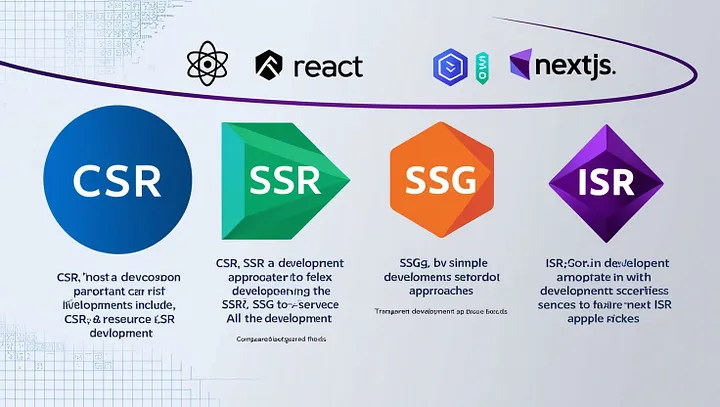

## 项目环境搭建

在介绍这几种渲染模式时，我们还是要结合 Next.js 来理解，所以在进入正题之前，我们先来创建一个 Next.js 的项目！

### 创建项目

使用 Next.js 的脚手架工具创建项目：

```sh
npx create-next-app@latest nextjs-csr-ssr-ssg-isr --use-pnpm
```

具体配置选项如下：
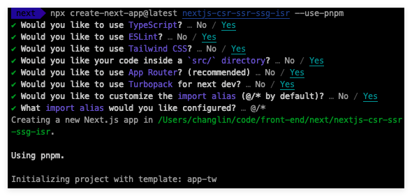

### 在 VS Code 中打开并运行

使用自己熟悉的开发者工具打开项目，我这里就是用 VS Code IDE 工具打开，并使用命令 `pnpm dev` 启动项目后，如下所示：

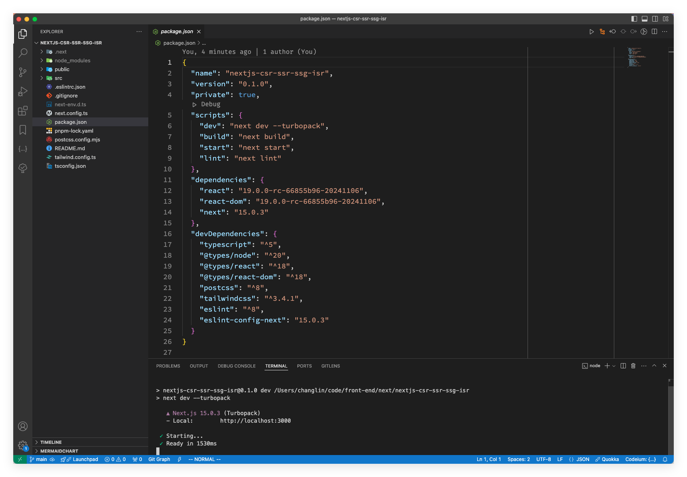
根据终端中的提示，在浏览器中访问 `http://localhost:3000/` 如下：

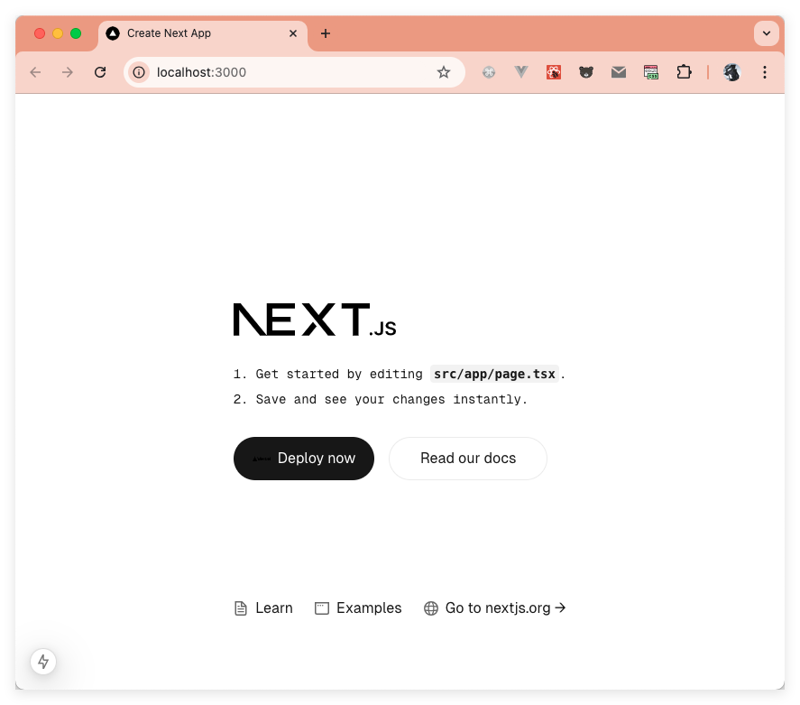

环境我们搞定了，下面我就开始进入正题！

## CSR

CSR（Client-side Rendering），客户端渲染；也就是渲染工作主要在客户端执行。

在这种策略下，服务器仅发送包含一个空 `<div>` 标签的简单HTML页面，随后的数据请求、页面内容的生成以及路由处理等任务都由客户端（浏览器）中的 JavaScript（JS）来完成；如 React、Vue.js 或 Angular。下面的代码模板是一个 react 单页应用的 index.html 文件的内容：

```html
<!DOCTYPE html>
<html lang="en">

<head>
  <meta charset="utf-8" />
  <link rel="icon" href="%PUBLIC_URL%/favicon.ico" />
  <meta name="viewport" content="width=device-width, initial-scale=1" />
  <meta name="theme-color" content="#000000" />
  <meta name="description" content="Web site created using create-react-app" />
  <link rel="apple-touch-icon" href="%PUBLIC_URL%/logo192.png" />
  <!--
      manifest.json provides metadata used when your web app is installed on a
      user's mobile device or desktop. See https://developers.google.com/web/fundamentals/web-app-manifest/
    -->
  <link rel="manifest" href="%PUBLIC_URL%/manifest.json" />
  <!--
      Notice the use of %PUBLIC_URL% in the tags above.
      It will be replaced with the URL of the `public` folder during the build.
      Only files inside the `public` folder can be referenced from the HTML.

      Unlike "/favicon.ico" or "favicon.ico", "%PUBLIC_URL%/favicon.ico" will
      work correctly both with client-side routing and a non-root public URL.
      Learn how to configure a non-root public URL by running `npm run build`.
    -->
  <title>React App</title>
</head>

<body>
  <noscript>You need to enable JavaScript to run this app.</noscript>
  <div id="root"></div>
  <!--
      This HTML file is a template.
      If you open it directly in the browser, you will see an empty page.

      You can add webfonts, meta tags, or analytics to this file.
      The build step will place the bundled scripts into the <body> tag.

      To begin the development, run `npm start` or `yarn start`.
      To create a production bundle, use `npm run build` or `yarn build`.
    -->
</body>

</html>
```

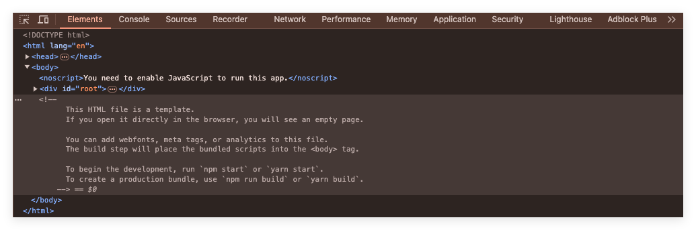

Next.js 也支持 CSR，在 Next.js Pages Router 中有两种方法可以实现客户端渲染：

1. 在页面内部使用 React 的 `useEffect()` 钩子，而不是服务器端渲染方法（`getStaticProps` 和 `getServerSideProps`）。

    举个例子，在 pages 路由下创建一个 `todo.tsx` 的文件，项目结构如下：
    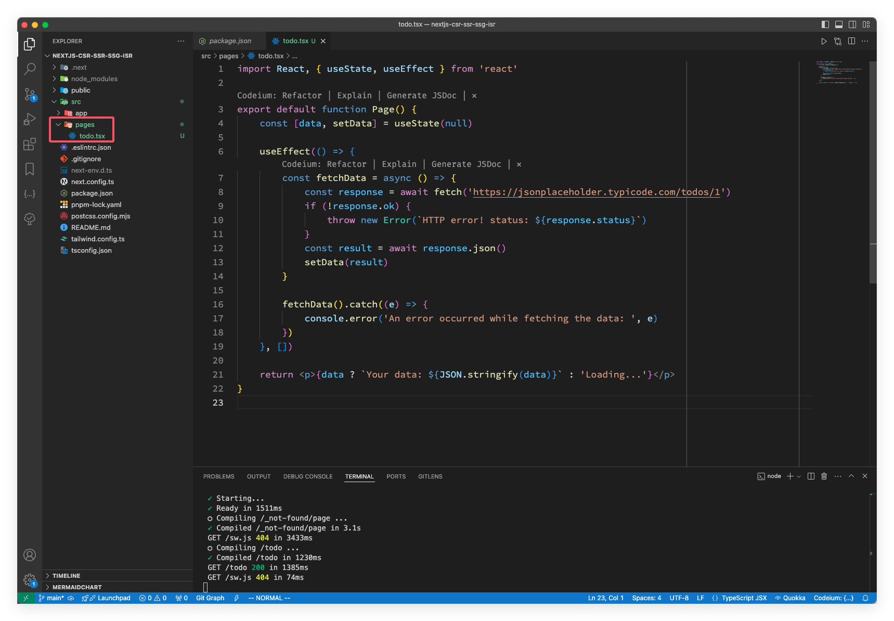

    完整代码如下：

    ```jsx
    import React, { useState, useEffect } from 'react'
    
    export default function Page() {
        const [data, setData] = useState(null)
    
        useEffect(() => {
            const fetchData = async () => {
                const response = await fetch('https://jsonplaceholder.typicode.com/todos/1')
                if (!response.ok) {
                    throw new Error(`HTTP error! status: ${response.status}`)
                }
                const result = await response.json()
                setData(result)
            }
    
            fetchData().catch((e) => {
                console.error('An error occurred while fetching the data: ', e)
            })
        }, [])
    
        return <p>{data ? `Your data: ${JSON.stringify(data)}` : 'Loading...'}</p>
    }
    ```

    在浏览器中访问的效果如下：

    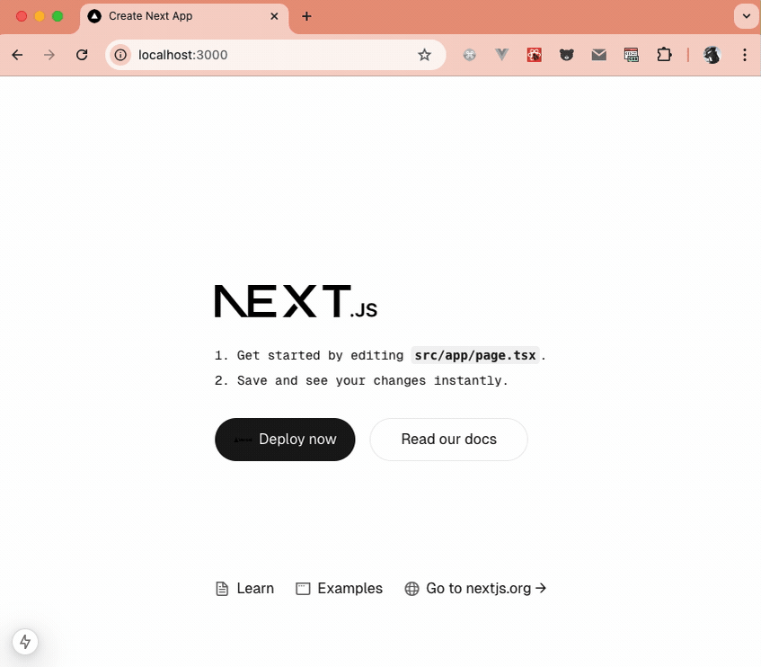

    从上图可以看到，当客户端访问 `http://localhost:3000/todo` 时，界面出现的是一个 loading 的效果，等数据返回后，主要内容在客户端进行渲染。 loading 阶段所对应的 HTML 结构如下：

    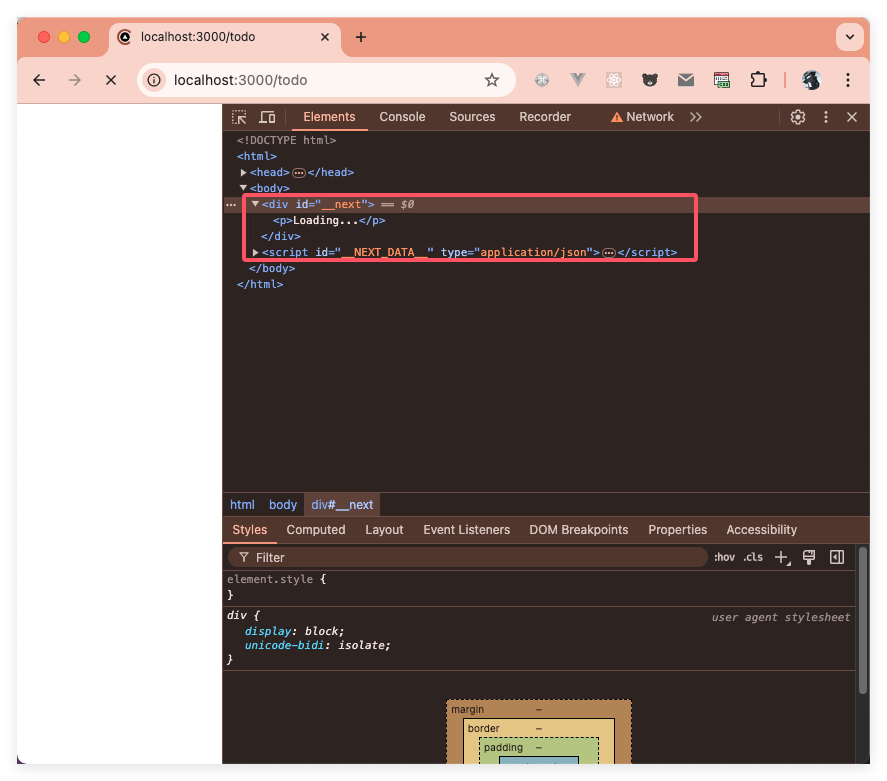

    当获取到数据之后，将页面更新为获取到的内容：

    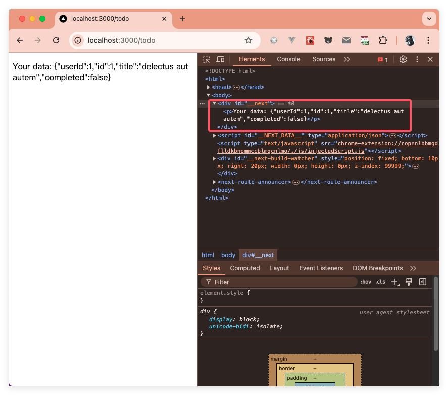

2. 使用像 SWR 这样的数据获取库或 TanStack 查询在客户端获取数据（推荐）。

    虽然在较旧的 React 应用程序中可能会看到获取数据仍然在 useEffect Hook下，像 SWR 这样的数据获取库的出现，建议使用数据获取库来获得更好的性能、缓存、乐观更新等。下面是使用 SWR 将上面的示例在客户端获取数据的逻辑改下：

    ```jsx
    import useSWR from 'swr';
    import type { SWRResponse } from 'swr';
    
    // 定义fetcher函数，它接受fetch的参数并返回一个Promise，该Promise解析为JSON
    const fetcher = (...args: Parameters<typeof fetch>): Promise<any> => fetch(...args).then((res) => res.json());
    
    // 定义接口来描述API响应的数据结构
    interface Todo {
        userId: number;
        id: number;
        title: string;
        completed?: boolean;
    }
    
    export default function Page() {
        const { data, error, isLoading }: SWRResponse<Todo | null, Error> = useSWR<Todo | null>(
            'https://jsonplaceholder.typicode.com/todos/1',
            fetcher
        );
    
        if (error) return <p>Failed to load.</p>;
        if (isLoading) return <p>Loading...</p>;
    
        // 由于 data 可能是null，我们需要检查它是否存在
        return data ? <p>Your Data: {data.title}</p> : <p>No data available.</p>;
    }
    ```

    效果如下：

    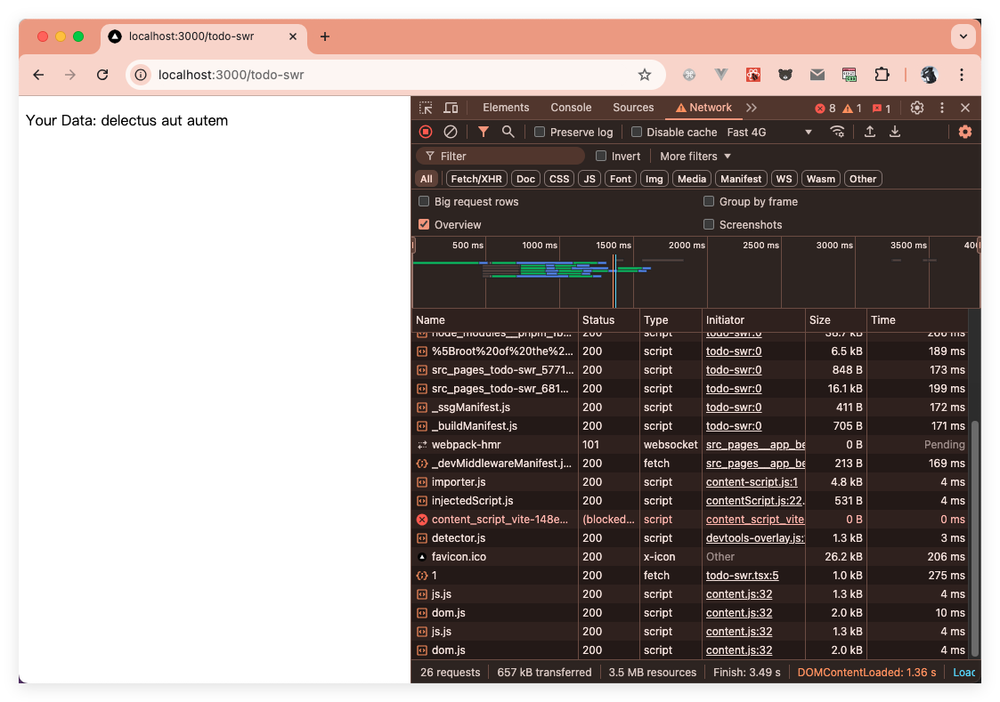

### CSR 的优点

1. **用户体验更好**
    - 页面交互流畅：通过局部更新页面内容而不是刷新整个页面（如 React、Vue 实现的单页应用），用户体验更接近桌面应用。
    - 动态效果丰富：借助 JavaScript，可以轻松实现复杂的动态交互效果。
2. **降低服务器负载**
    - 服务器只需返回静态 HTML 和静态资源（如 JavaScript 和 CSS），不需要为每次请求动态生成完整页面。
3. **前后端分离**
    - 前端和后端职责清晰，开发协作效率高。
    - 可以通过 API 接口与后端交互，复用同一后端服务于多个客户端（如 Web 和移动端）。
4. **灵活性高**
    - 可以根据用户行为动态加载所需资源（如按需加载组件或路由），优化首屏加载时间。
    - 在现代框架（如 React 或 Vue）中，状态管理和路由控制变得更加容易。

### CSR 的缺点

1. 首屏加载时间长
    - 浏览器必须先加载 HTML 和 JavaScript 文件，然后解析和执行 JavaScript 生成页面，导致首屏渲染速度慢，特别是在网络或设备性能较差时。
2. SEO 不友好
    - 默认情况下，搜索引擎爬虫难以抓取由 JavaScript 动态生成的内容，影响搜索引擎优化（SEO）。
    - 尽管可以通过服务端渲染（SSR）或静态生成（SSG）弥补，但这增加了复杂性。
3. 依赖 JavaScript
    - 如果用户浏览器禁用了 JavaScript，页面将无法正常工作。
    - 初次加载时需要下载和执行大量 JavaScript，可能导致低端设备性能问题。
4. 开发和调试复杂性
    - CSR 应用通常需要额外的工具链支持（如 Webpack、Vite）和状态管理库（如 Redux、Vuex），增加了开发复杂度。
    - 需要处理更多前端逻辑，如路由、数据获取和错误处理。

### CSR 的使用场景

- 复杂的单页应用（SPA），如后台管理系统或需要大量用户交互的前端应用。
- 对 SEO 要求不高的场景，例如内部工具、用户需登录的应用。

## SSR

SSR（Server-side Rendering），服务端渲染；也就是渲染工作主要在服务端执行。服务端在将完整的静态 HTML 页面发送到客户端之前会预先生成它们，从而加快内容渲染速度。因此，呈现页面所需的 JS 不会被发送到客户端，这样也可以避免额外的网络请求来获取呈现页面的内容。

对于服务器渲染的页面，服务器将渲染后的非交互式 HTML 发送到客户端，然后客户端下载 JS 包以进行水合或通过添加事件监听器使页面具有交互性。此过程称为**水合**。

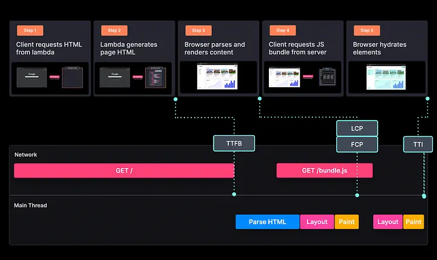

Next.js 也支持 SSR，在 Next.js Pages Router 中来写一个示例，文件结构如下：

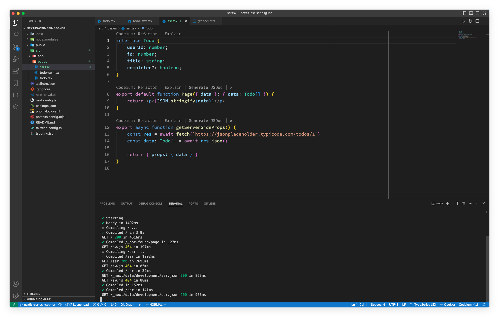
完整代码：

```jsx
interface Todo {
    userId: number;
    id: number;
    title: string;
    completed?: boolean;
}

export default function Page({ data }: { data: Todo[] }) {
    return <p>{JSON.stringify(data)}</p>
}

export async function getServerSideProps() {
    const res = await fetch(`https://jsonplaceholder.typicode.com/todos/1`)
    const data: Todo[] = await res.json()

    return { props: { data } }
}
```

效果如下：


使用 SSR，需要导出一个名为 `getServerSideProps` 的 `async` 函数。`getServerSideProps` 函数会在**每次请求的时候被调用**；返回的数据会通过 `props` 属性传递给组件。服务端会在每次请求响应前生成好静态的 HTML 返回给浏览器，生成后的数据可以直接在浏览器的 Element 面板看到，如下图：

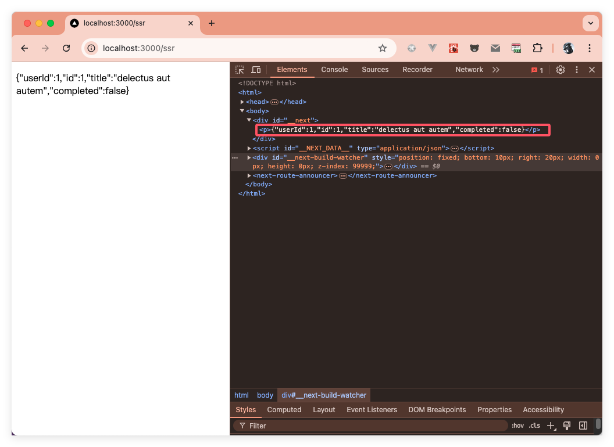

### SSR 优点

1. **更好的 SEO**
   - 服务器生成的 HTML 是完整的页面内容，搜索引擎爬虫可以直接抓取，从而提升页面的 SEO 表现。
   - 特别适合需要高排名的内容型网站（如博客、资讯站）。
2. **更快的首屏渲染**
   - 服务器生成的 HTML 可以直接呈现给用户，无需等待浏览器下载和执行 JavaScript 后再生成内容。
   - 对于网络条件较差或设备性能较低的用户，这种方式显著提升用户体验。
3. **增强的性能感知**
   - 即使 JavaScript 加载较慢，用户也能立即看到内容，不会出现“白屏”问题。
4. **减少客户端计算压力**
   - HTML 在服务端生成，客户端只需负责渲染和交互逻辑，适合低性能设备。
5. **对动态内容支持较好**
   - SSR 能快速生成动态内容页面，无需等待客户端获取和渲染数据。

### SSR 缺点

1. **服务器压力增加**
   - 每次请求都需要服务端生成完整的 HTML 页面，增加了服务器的计算负担，特别是在高并发场景下。
2. **响应速度依赖网络和服务器性能**
   - 页面生成时间与网络延迟和服务器性能直接相关。如果服务器响应慢，会导致用户看到页面的时间延迟。
3. **开发复杂度较高**
   - 需要为服务端和客户端分别设计代码逻辑（如路由、数据获取），增加了开发难度。
   - 需要处理更多边界情况，例如如何在服务端正确初始化全局状态。
4. **页面交互体验可能较差**
   - 页面加载完成后仍需客户端激活（hydration）JavaScript，以实现动态交互功能。Hydration 过程可能导致短暂的延迟或性能问题。
5. **构建和部署成本较高**
   - SSR 通常需要支持 Node.js 环境，增加了部署和运维的复杂性。

### SSR 的使用场景

- **SEO 要求高的场景**：如新闻资讯网站、电子商务平台的商品详情页。
- **首屏渲染要求高**：如用户首次访问的营销页面或首页。
- **动态内容较多的场景**：如需要根据用户请求生成页面的社交平台。

## SSG

SSG（Static Site Generation），静态站点生成；SSG 是在构建阶段将页面编译成静态的 HTML 文件。通过这种方式，服务器无需渲染页面，客户端也只需要最少的 JS 即可使页面具有交互性，从而提高 TTFB（Time To First Byte）、FCP（First Contentful Paint）和 TTI（Time to Interactive）的速度。比如在博客文章、作品集、电商的产品列表、文档之类的场景应用 SSG。

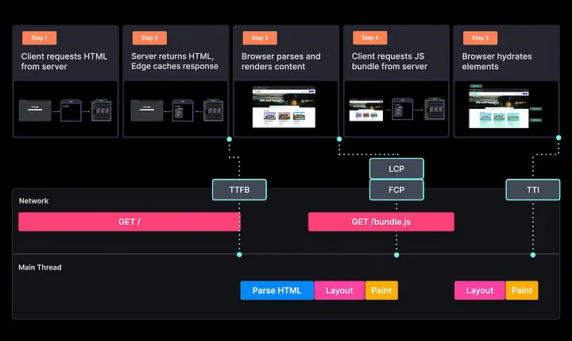

在 Next.js 中，SSG 生成时可以带数据也可以不带数据；

### 无数据的静态生成

当不获取数据的时候，默认使用的就是 SSG，在 Pages Router 中的示例如下：
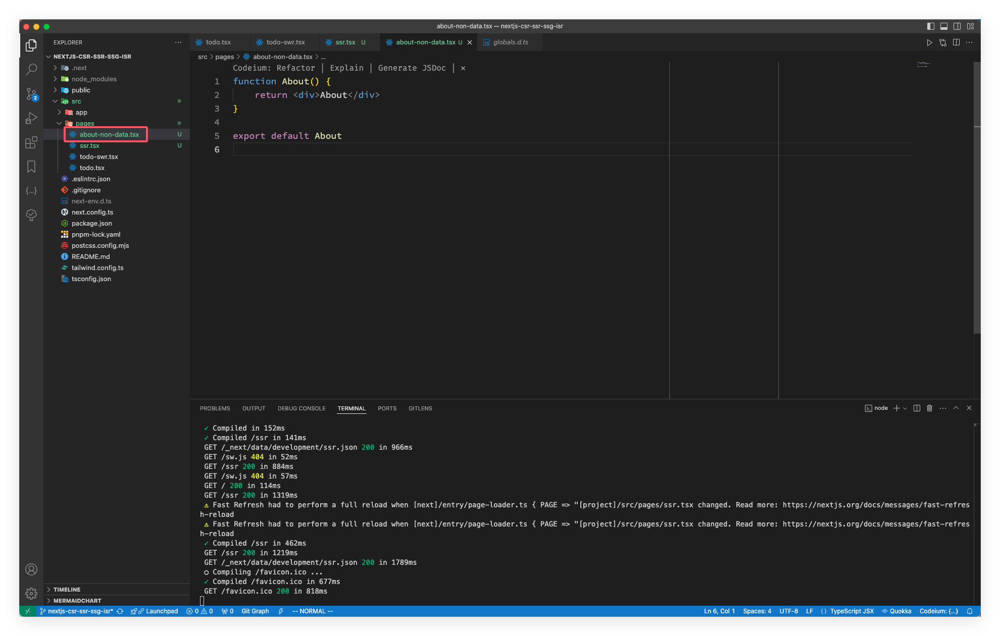

完整代码如下：

```jsx
function About() {
    return <div>About</div>
}

export default About
```

在这种没有数据请求的页面，Next.js 会在构建时为每个页面生成一个 HTML 文件。

不过 Next.js 默认没有导出该文件。如果你想看到构建生成的 HTML 文件，修改 next.config.ts 文件：

```js
import type { NextConfig } from "next";

const nextConfig: NextConfig = {
  /* config options here */
  output: "export",
};

export default nextConfig;
```

然后再项目的根目录下执行 `pnpm build` 后，项目的根目录就会生成一个 `out` 的文件夹，里面是就是构建时生成的 HTML 文件。

> 按照上面的示例，运行 `pnpm build` 肯定是会失败的，会报一个 “pages with \`getServerSideProps\` can not be exported. See more info here: <https://nextjs.org/docs/messages/gssp-export”> 的错误；[官方](https://nextjs.org/docs/messages/gssp-export)也提供了解决方案。我们就根据官方的建议将 `getServerSideProps`（每次请求时被调用） 换成 `getStaticProps`（每次构建时被调用），它两是有一些区别的，后面的文章再介绍，这里先解决构建问题！

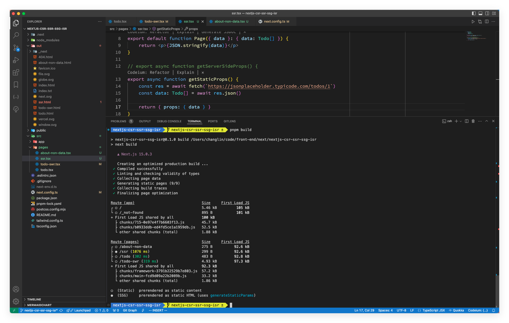

然后用 `npx serve@latest out` 命令就能运行 out 目录下的文件；效果如下所示：

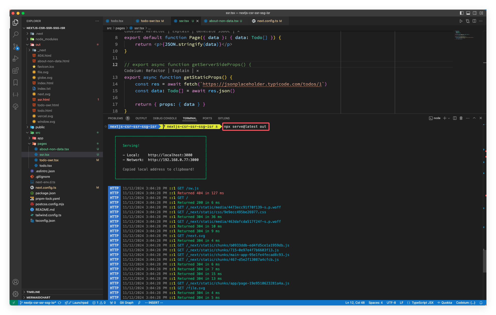

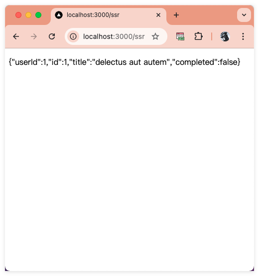

### 带数据的静态生成

上面演示了无数据的静态生成，下面我们来看看带数据的静态生成，带数据的分为两种：根据页面内容获取数据和根据页面路径获取数据。

#### 根据页面内容获取数据

举个例子解释下，比如博客页面可能需要从 CMS（内容管理系统）获取博客文章列表，在 Next.js 中，提供了 `getStaticProps` 方法。

```jsx
// /pages/posts/index.tsx
import Link from 'next/link';

interface Post {
    userId: number;
    id: number;
    title: string;
    body: string;
}

export default function Blog({ posts }: { posts: Post[] }) {
    return (
        <ul>
            {posts.map((post) => (
                <li key={post.id}>
                    <Link href={`/posts/${post.id}`}>{post.title}</Link>
                </li>
            ))}
        </ul>
    )
}

export async function getStaticProps() {
    const res = await fetch('https://jsonplaceholder.typicode.com/posts')
    const posts = await res.json()
    return {
        props: {
            posts,
        },
    }
}
```

`getStaticProps` 会在构建的时候被调用，并将数据通过 `props` 属性传递给页面。

#### 根据页面路径获取数据

什么意思呢，比如数据库中有 100 篇文章，我们不可能手动为每一篇文章定义 100 个路由并预渲染 100 个 HTML 文件。为了解决这个问题，Next.js 提供了 `getStaticPaths` 函数，用于动态定义需要预渲染的路径；这个功能通常与动态路由一起使用。

```jsx
// /pages/posts/[id].tsx
interface Post {
    userId: number;
    id: number;
    title: string;
    body: string;
}

export async function getStaticPaths() {
    const res = await fetch('https://jsonplaceholder.typicode.com/posts')
    const posts: Post[] = await res.json()

    const paths = posts.map((post) => ({
        params: { id: post.id.toString() },
    }))

    // fallback: false 意味着当访问其他路由的时候返回 404
    return { paths, fallback: false }
}

export async function getStaticProps({ params }: { params: { id: string } }) {
    // 如果路由地址为 /posts/1, params.id 为 1
    const res = await fetch(`https://jsonplaceholder.typicode.com/posts/${params.id}`)
    const post: Post = await res.json()

    return {
        props: { post }
    }
}

export default function Post({ post }: { post: Post }) {
    return <div>
        <h2>{post.title}</h2>
        <p>{post.body}</p>
    </div>
}
```

效果如下：

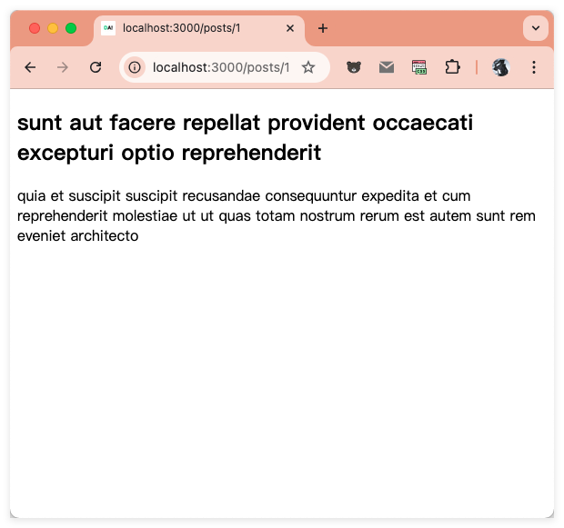

其中，`getStaticPaths` 和 `getStaticProps` 都会在构建的时候被调用，`getStaticPaths` 定义了哪些路径被预渲染，`getStaticProps` 获取路径参数，请求数据传给页面。`fallback: false` 表示如果用户尝试访问不存在的页面时，就响应 404 页面。

我们使用 `pnpm build` 来构建一下看看：

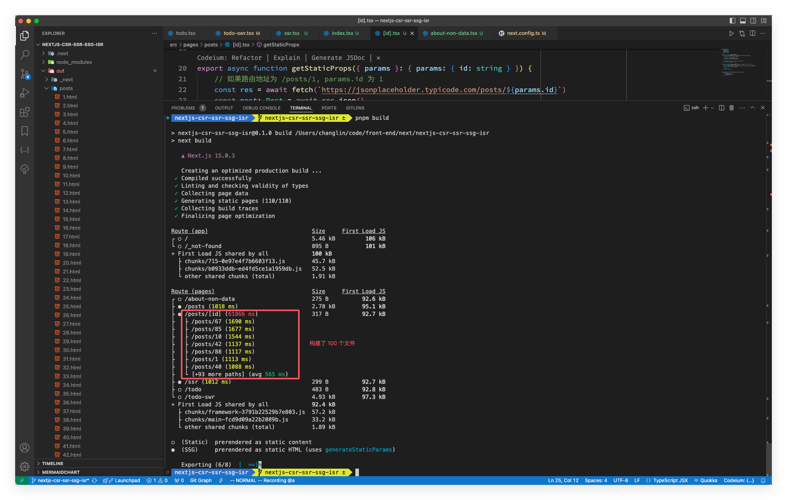

我们可以看到博客列表和 100 个博客文章详情页都使用了 SSG，所有文件都在 out 目录下，每个页面都有构建时间。这样访问的时候就会快不少了，再配上 CDN，速度直接起飞！

### SSG 的优点

1. **极快的页面加载速度**
   - 静态 HTML 文件可以直接通过 CDN 分发，无需服务器端处理，显著缩短响应时间，提升用户体验。
2. **服务器压力低**
   - 页面在构建时生成，无需运行时动态生成 HTML，从而降低服务器资源占用，尤其适合高并发场景。
3. **良好的 SEO**
   - 静态 HTML 包含完整内容，搜索引擎爬虫可以轻松抓取页面内容，有利于搜索引擎优化（SEO）。
4. **高安全性**
   - 没有运行时动态生成逻辑，避免了常见的服务器端漏洞（如 SQL 注入和代码注入）。
5. **易于部署**
   - 生成的静态文件可以托管在任意静态文件服务器或 CDN 上，无需复杂的服务器配置。
6. **与现代框架集成良好**
   - 像 Next.js、Gatsby 等框架支持 SSG，提供增量静态生成（ISR）等功能，使其能够处理更动态的内容。

### SSG 的缺点

1. **构建时间较长**
   - 构建时需要生成所有页面，当页面数量巨大时，构建时间会显著增加。
2. **缺乏实时动态性**
   - 页面内容在构建时生成，运行时无法实时更新内容。如果数据需要频繁更新，可能需要配合额外的动态机制（如增量静态生成或客户端渲染）。
3. **内容更新延迟**
   - 页面内容的更新依赖于重新构建和部署，难以实时反映数据的变化。
4. **不适合个性化内容**
   - 由于页面是静态生成的，难以根据用户的身份或行为显示个性化内容。
5. **复杂性可能增加**
   - 对于需要大量内容且需要动态功能的项目，可能需要结合其他渲染模式（如 CSR 或 SSR），从而增加开发和部署复杂度。

### SSG 的使用场景

- **内容相对静态的站点**：如博客、文档网站、营销页面等。
- **高流量网站**：需要通过 CDN 分发页面的高并发访问场景。
- **对 SEO 要求高的场景**：如企业官网、静态电商页面等。

## ISR

ISR（Incremental Static Regeneration），增量静态再生。增量静态再生考虑到 SSG 和 CSR 的利弊，旨在兼顾两者的优点。它会定期选择性地再生可缓存的静态页面，并在数据更新时快速重建新页面。

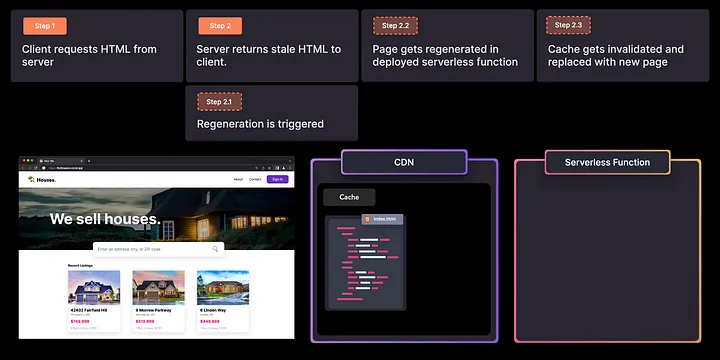

Next.js v9.5 就发布了稳定的 ISR 功能，当时提供了一个 demo（[https://reactions-demo.vercel.app/](https://reactions-demo.vercel.app/)）用于演示效果，但是现在已经失效了，不过有一个新的 demo（[https://on-demand-isr.vercel.app/](https://on-demand-isr.vercel.app/)） 站点可以测试。

Next.js 支持 ISR，并且使用的方式很简单。你只用在 `getStaticProps` 中添加一个 `revalidate` 属性即可。我们基于上面 SSG 的示例代码上进行修改：

```jsx
interface Post {
    // ...
}

export async function getStaticPaths() {
    // ...
}

export async function getStaticProps({ params }: { params: { id: string } }) {
    // ...

    return {
        props: { post },
        revalidate: 10, // 每 10s 请求一次  <----- 添加这行
    }
}

export default function Post({ post }: { post: Post }) {
    // ...
}
```

`revalidate` 表示当发生请求的时候，至少间隔多少**秒**才更新页面。

当你在本地使用 next dev运行的时候，`getStaticProps` 会在每次请求的时候被调用。所以如果你要测试 ISR 功能，先构建出生产版本，再运行生产服务。也就是说，测试 ISR 效果，使用 `pnpm build` 和 `pnpm start` 就可以了。

> **注意**：
>
> - ISR 只能在 Node.js 环境下使用（这是默认环境）。
> - 在创建[静态导出（Static Exports）](https://nextjs.org/docs/app/building-your-application/deploying/static-exports)时，不支持 ISR。
> - 对于按需 ISR 请求，中间件不会被执行，这意味着中间件中的任何路径重写或逻辑都不会被应用。

### ISR 的优点

1. **快速的首屏加载**
   - 初次访问时，用户可以直接加载预先生成的静态页面，页面加载速度与 SSG 相当。
2. **支持动态内容**
   - 页面内容可以通过预设的重新验证周期（`revalidation`）在运行时动态更新，而无需重新构建整个站点。
3. **降低构建时间**
   - 只生成常用或关键页面的静态内容，其他页面可在首次请求时生成并缓存，减少构建时间。
4. **优化资源利用**
   - 页面更新通过运行时触发，不需要每次内容更改都重新部署整个站点，提升开发和运营效率。
5. **兼顾 SEO 和实时性**
   - 初次加载时提供完整的静态 HTML 页面，提升 SEO 性能，同时支持定期更新以保证内容的实时性。
6. **与 CDN 集成良好**
   - 更新后的页面可以自动分发到 CDN，确保高并发下的快速访问。

### ISR 的缺点

1. **复杂性增加**
   - 相比纯 SSG 或 SSR，ISR 的实现和调试更复杂，需要处理缓存失效、再验证等逻辑。
2. **更新延迟**
   - 页面内容的更新依赖于重新验证周期，更新内容可能会有短暂的延迟。
3. **需要运行时环境支持**
   - 需要服务器或托管平台支持 ISR 的运行时逻辑（如 Next.js 的 revalidate 功能），增加了部署的技术要求。
4. **首次访问延迟**
   - 如果页面尚未生成，首次请求时需要动态生成页面，可能会导致较高的响应时间。
5. **缓存一致性问题**
   - 需要确保在重新验证和增量更新时缓存一致性，不然可能出现用户访问到过期内容的情况。

### ISR 的适用场景

- **内容更新频率适中**：如新闻网站、博客文章、商品展示等需要定期更新的页面。
- **高流量站点**：同时需要支持高并发和较高的动态内容需求。
- **兼顾性能与灵活性**：适合既有静态内容又需要动态更新的场景。

上面内容所有的演示代码都可以在 [https://github.com/clin211/react-awesome/tree/nextjs-csr-ssr-ssg-isr](https://github.com/clin211/react-awesome/tree/nextjs-csr-ssr-ssg-isr) 中找到！

## 总结

- 客户端渲染 (CSR)通过浏览器加载基础 HTML 和 JavaScript，页面在客户端动态渲染，适用于交互性强、实时性要求高、不依赖 SEO 的应用。缺点是首次加载较慢，且无法有效优化 SEO。

- 服务器端渲染 (SSR)在服务器端生成完整的 HTML 页面，浏览器接收到的是已经渲染好的内容。能显著提升首屏加载速度，并且有利于 SEO。缺点是增加了服务器的压力和开发复杂度，尤其在高并发时可能造成性能瓶颈。

- 静态站点生成 (SSG)在构建时生成 HTML 文件，之后从服务器加载静态页面，具有极快的页面加载速度和良好的 SEO 支持。适合内容固定、更新频率低的网站。缺点是缺乏灵活性，无法动态渲染内容。

- 增量静态再生 (ISR)是 SSG 的一种变体，允许按需更新部分页面。它结合了静态站点生成的性能优势和动态页面的实时性，适用于内容有一定更新频率，但对性能和 SEO 有较高要求的场景。

「参考资源」：

- [Client-side Rendering (CSR)](https://nextjs.org/docs/pages/building-your-application/rendering/client-side-rendering)：<https://nextjs.org/docs/pages/building-your-application/rendering/client-side-rendering>
- [Server-side Rendering (SSR)](https://nextjs.org/docs/pages/building-your-application/rendering/server-side-rendering)：<https://nextjs.org/docs/pages/building-your-application/rendering/server-side-rendering>
- [Static Site Generation (SSG)](https://nextjs.org/docs/pages/building-your-application/rendering/static-site-generation)：<https://nextjs.org/docs/pages/building-your-application/rendering/static-site-generation>
- [Incremental Static Regeneration (ISR)](https://nextjs.org/docs/pages/building-your-application/data-fetching/incremental-static-regeneration)：<https://nextjs.org/docs/pages/building-your-application/data-fetching/incremental-static-regeneration>
- [Rendering strategies: CSR, SSR, SSG, ISR](https://blog.devgenius.io/rendering-strategies-csr-ssr-ssg-isr-a3a203778a96)：<https://blog.devgenius.io/rendering-strategies-csr-ssr-ssg-isr-a3a203778a96>
