在项目开发中，技术选型是项目管理中一个至关重要的环节，它不仅决定了项目的可行性和成本效益，还直接影响到开发周期、产品质量、以及项目的长期可维护性和扩展性。一个明智的技术选型能够确保团队发挥最大的潜力，满足市场需求，同时保持竞争力。它涉及到对团队技能、市场趋势、业务需求和潜在风险的全面考量，以确保项目能够顺利实施并达到预期目标。下面我们来看看 Next.js 生态中有哪些可供我们选择的技术方案！

## Next.js 学习资源推荐

[next-learn](https://nextjs.org/learn 'next-learn') 是 Next.js 官方出的一个快速上手的学习项目。

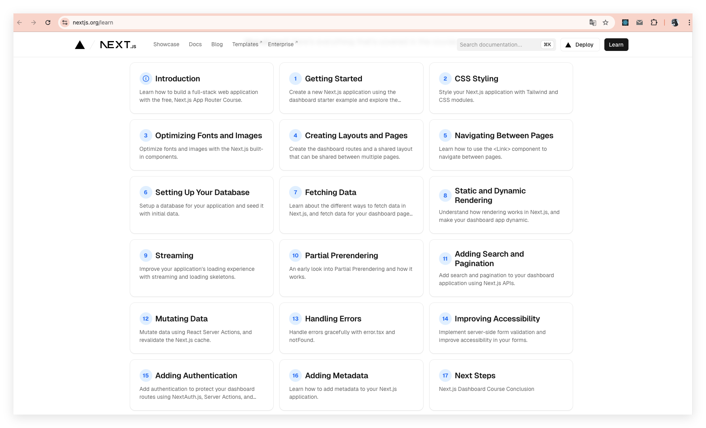
包含的 Next.js 技术有：

- **CSS 样式**：在 Next.js 中使用 [tailwindcss](https://tailwindcss.com/ 'tailwindcss')。
- **静态资源的使用与优化**：如何优化图像、链接和字体，以及如何在 Vercel 上设置数据库并实现数据流。
- **路由**：基于文件系统的 App Router 创建嵌套布局和页面。
- **数据获取**：如何设置数据库并使用 URL 搜索参数实现搜索和分页。
- **数据变更**：如何使用 React Server Actions 变更数据，并重新验证 Next.js 缓存。
- **错误处理**：如何处理常规错误和 404 未找到错误。
- **表单验证和可访问性**：如何在服务器端进行表单验证，并提供可访问性提示。
- **身份验证**：如何使用 NextAuth.js 和中间件添加身份验证。
- **元数据**：如何添加元数据以便于社交共享。

开发一个简化版本的财务仪表板：

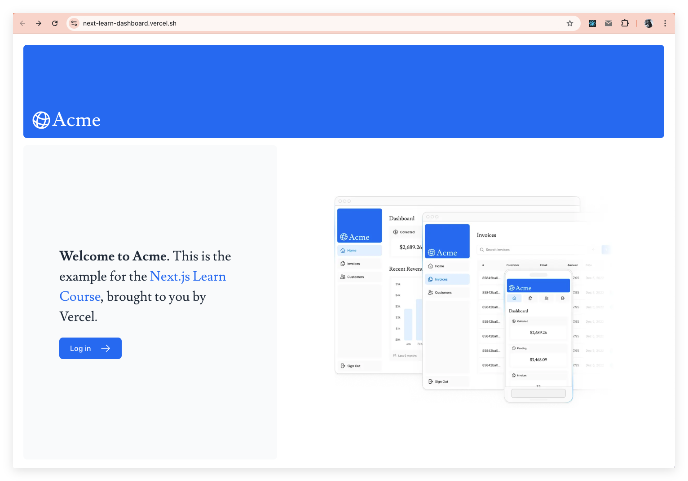

其功能包括：

- 首页。
- 登录页面。
- 受身份验证保护的仪表板页面。
- 用户可以添加、编辑和删除发票。

> - 文档：<https://nextjs.org/learn>
> - 在线体验：<https://next-learn-dashboard.vercel.sh/>
> - GitHub 仓库：<https://github.com/vercel/next-learn>

从 Next.js App Router 项目的搭建到最后的项目开发完成，提供一系列的内容可供初学者实操！每个小节学习结束都有相应的检测。

除了使用官方的内容学习外，还可以关注「长林啊」公众号，更新了一系列关于 React 和 Next.js 的内容，每篇都有大量的案例、动图演示和源码，还会继续更新相关内容。下面是相关文章！

React 系列：

- [走进 React：打造交互式用户界面的第一步](https://mp.weixin.qq.com/s/s5moMIyYdCSe820C4yWQSw)
- [深入学习 React：组件、状态与事件处理的完整指南](https://mp.weixin.qq.com/s/PFnnK9SoYURwuxMUwAlZqA)
- [掌握 React Hooks：现代 React 开发的必备技能](https://mp.weixin.qq.com/s/6MFp1VnTQRxiX38Pm9ZZ_Q)
- [打造高效React应用：CSS方案深度解析](https://mp.weixin.qq.com/s/d_OxeFG6x8OAeHo7MMdKZQ)
- [掌控 React 表单：详解受控组件和非受控组件](https://mp.weixin.qq.com/s/gYEh7gekJxubrDEKhu_5Og)
- [掌握 React Router：为你的 React 应用导航](https://mp.weixin.qq.com/s/Fs9gtc4r1K7dx7-jGSpI5A)
- [React 调试不求人：VS Code 与 Chrome 的终极指南](https://mp.weixin.qq.com/s/Ec1d11rc-HhsNQtJlRlnIA)
- [提升 React 应用性能：从状态管理开始](https://mp.weixin.qq.com/s/i1JzvX2HJSm0wWm4sBhbXQ)
- [掌握Zustand：React状态管理的高效之道](https://mp.weixin.qq.com/s/jnWVwxVxv6DIqLF-tsP3Ow)
- [深入zustand：状态管理库的源码解读](https://mp.weixin.qq.com/s/kLwB4tkaLF1ZKhz7ab9rNQ)

Next.js 系列：

- [Next.js 全栈框架入门：从零搭建你的首个项目](https://mp.weixin.qq.com/s/10Z2i3lCuAD9T-lZeagHGw)
- [Next.js全栈框架快速入门：手把手教你搞定路由](https://mp.weixin.qq.com/s/F0coJcYFN34eXNwEMZk7jA)
- [Next.js 导航、链接和重定向：你必须知道的秘密！](https://mp.weixin.qq.com/s/oSzvBscvXg_El3DFI0PLqg)
- [Next.js 开发者必看：最受欢迎的 UI 组件库](https://mp.weixin.qq.com/s/ceRRam3i3zrDpolfpm7nqQ)
- [解锁 Next.js 中间件的全新姿势](https://mp.weixin.qq.com/s/wgn_8Ulr5z91pI65cagDIw)
- [掌握 Next.js 渲染机制：如何在 CSR、SSR、SSG 和 ISR 中做出最佳选择](https://mp.weixin.qq.com/s/V3FadXse_MIXOZqSBaHAMg)
- [构建高效 Web 应用：深入理解 Next.js 服务端与客户端组件](https://mp.weixin.qq.com/s/N-yNvDGymELqNUeMxC98LA)
- [提升用户体验：Next.js 中的 Loading UI 和流式渲染](https://mp.weixin.qq.com/s/lSl4EzVaj97mz4LSOEJVZg)

罗列的这些内容只是目前已经更新的文章，后续还会继续更新 React 和 Next.js 相关的内容和项目实战！

## Next.js 生态

在实际的开发中，Next.js 通常会搭配多种技术选型一起使用，比如 Tailwind CSS、TypeScript、Prisma、Drizzle、NextAuth.js、tRPC、ESLint、Prettier、Husky、Lint-Staged、Commitlint、CI/CD 等等。

### UI

选择合适的 UI 框架，在开发中不仅能提高开发效率，在一定程度上还可以保证产品在界面上风格的一致性，之前的《[Next.js 开发者必看：最受欢迎的 UI 组件库](https://mp.weixin.qq.com/s/ceRRam3i3zrDpolfpm7nqQ)》文章中单独介绍 Next.js 生态中的 UI，这里就不再赘述！如果有不熟悉的，欢迎关注「长林啊」公众号查阅。

《Next.js 开发者必看：最受欢迎的 UI 组件库》文章中只是介绍了 UI 库，还有个 UI 组件开发时会用于展示的工具——[Stroybook](https://storybook.js.org/ 'Stroybook')！它允许您创建可交互的组件并将其独立于应用程序进行开发和测试。

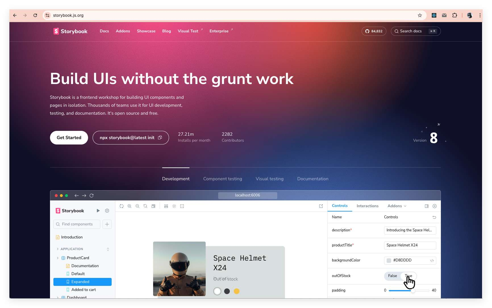

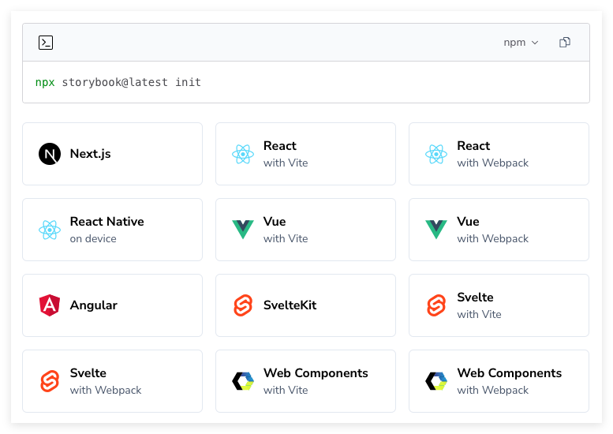

Storybook 支持多种框架，包括 React、Vue、Angular 等。

### CSS 样式

Next.js 自身支持多种 CSS 方案，其中有：

- **内联样式**：在 HTML 标签中写样式，比如： `
...
`
- **CSS 模块（CSS Modules）**：创建局部 CSS 避免命名冲突，提升可维护性。
- **全局 CSS（Global CSS）**：一处书写，全局使用，对于熟悉传统 CSS 的人来说很熟悉，但会导致 CSS 包变大，随着应用程序的增长难以管理，不建议。
- **Tailwind CSS**：一个 CSS 框架，通过组合的方式声明样式。
- **Sass**：一个流行的 CSS 预处理器，扩展了 CSS 的功能，包括变量、嵌套规则和混合。
- **CSS-in-JS**：将 CSS 直接嵌入到 JSX 组件中，实现动态插入和局部样式。

在之前更文的 react 系列内容的时候，有专门介绍 CSS 方案——《[打造高效React应用：CSS方案深度解析](https://mp.weixin.qq.com/s/d_OxeFG6x8OAeHo7MMdKZQ)》，这里就不再赘述！如果有不熟悉的，欢迎关注「长林啊」公众号查阅。

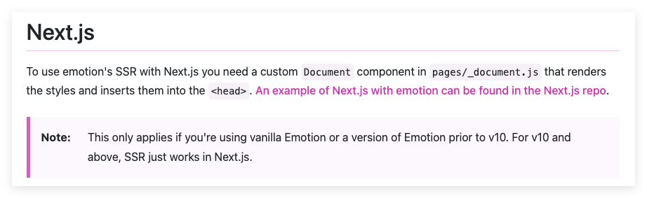

CSS-in-JS 方案中的 [emotion](https://emotion.sh/docs/introduction 'emotion') 目前还不支持服务端组件和 Streaming 架构，如果你希望设置服务端组件的样式，推荐使用 CSS 模块或者其他输出 CSS 文件的解决方案，比如：PostCSS 或者 Tailwind CSS。

社区中用得最多的还是 tailwindcss 和 shadcn/ui 搭配使用，shadcn/ui 是 2023 年 GitHub Stars 增长最快的 JavaScript 开源项目。Next.js 官方脚手架也提供了集成 tailwindcss 的选项，由此来看，官方也是比较推荐使用 tailwindcss 来构建界面。

### 代码质量

关于这个话题，千人千面，在前端工程化中，在工具层面约束开发者编码规范一般是：
Husky + Prettier + ESLint + Lint-Staged + Commitlint + Commitizen + EditorConfig + semantic-release；这里也单独说解释解释相关工具：

- [Husky](https://typicode.github.io/husky/ 'Husky')：是一个 Git Hook 的管理工具，**允许你触发在特定 Git 生命周期事件（如 pre-commit、pre-push 等）执行的脚本**。可以用来在代码提交前自动运行测试、格式化代码或执行其他检查。

- [Prettier](https://prettier.io/ 'Prettier')：是一个流行的代码格式化工具，它可以**根据配置的规则自动格式化代码，以保持代码风格的一致性**。它可以与编辑器集成，自动格式化保存的文件，或者通过命令行工具在构建过程中运行。

- [ESLint](https://eslint.org/ 'Eslint')：是一个插件化的工具，用于识别和报告JavaScript代码中的错误，以及潜在的代码问题。它也可以用来**强制执行代码风格的一致性**。通过自定义规则，ESLint可以帮助团队遵守编码标准。

- [Lint-Staged](https://github.com/lint-staged/lint-staged 'lint-staged')：它会根据你所选择的 linters（如 ESLint、Prettier）对 husky 的pre-commit 钩子中暂存的文件进行操作。这就是**只有被暂存的文件会被检查和格式化，而不是整个项目**。
- [Commitlint](https://commitlint.js.org/ 'Commitlint')：是一个**检查 Git 提交信息是否符合特定规则的工具**。它通常与 Husky 的 commit-msg 钩子一起使用，以确保提交信息符合预定义的格式，比如 [Conventional Commits](https://www.conventionalcommits.org/en/v1.0.0-beta.4/ 'Conventional Commits')。

- [Commitizen](https://commitizen-tools.github.io/commitizen/ 'Commitizen')：是一个命令行工具，它提供了一个交互式的界面来生成符合特定约定的提交信息。它可以与 Commitlint 配合使用，以确保提交信息的一致性和正确性。

- [EditorConfig](https://editorconfig.org/ 'EditorConfig')：是一个**帮助开发者在不同的编辑器和IDE之间保持一致的编码风格的工具**。它通过一个名为 `.editorconfig` 的文件来定义项目的编码规范，比如文件的字符集、缩进风格（空格或制表符）、缩进大小、换行符等。这样，无论开发者使用哪种编辑器，只要编辑器支持 EditorConfig，就能自动遵循这些编码规范，从而保持代码风格的一致性。

- [semantic-release](https://semantic-release.gitbook.io/semantic-release 'semantic-release')：是一个**自动化的版本管理和包发布工具**。它可以根据代码中的 commit 信息自动确定版本号，并执行发布流程，包括生成 CHANGELOG、打标签和发布到 npm 等。

### 状态管理

react 社区的状态管理层出不穷，从经典老牌的 Redux 到到轻量级新星 [Zustand](https://zustand.docs.pmnd.rs/ 'Zustand') 等，截止今日(2024-12-10)各主流库的 [trends](https://npmtrends.com/jotai-vs-mobx-vs-react-query-vs-recoil-vs-redux-vs-swr-vs-valtio-vs-xstate-vs-zustand 'npm trends') 数据如下：

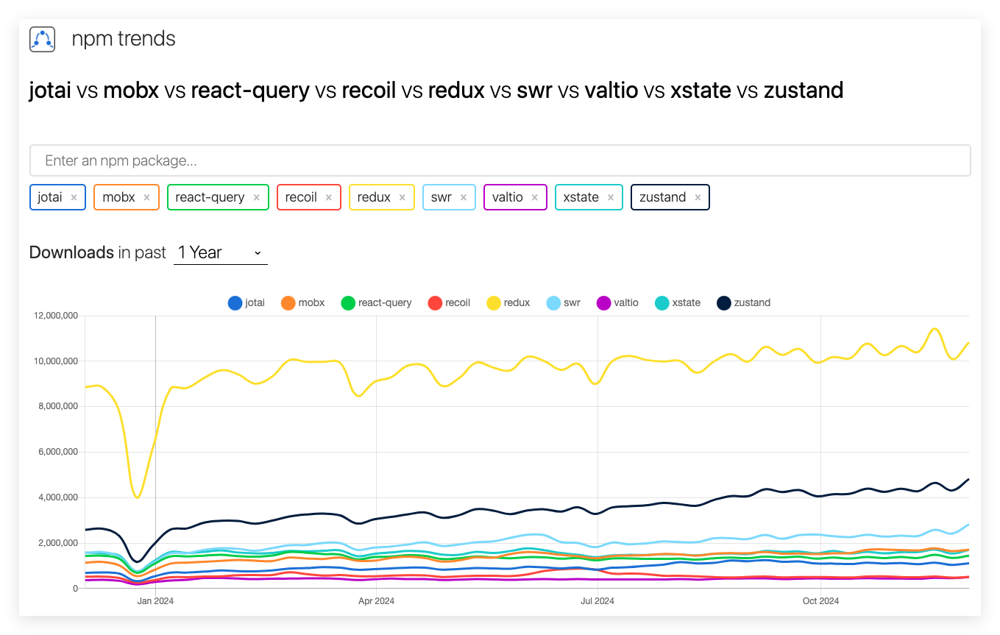

关于 Redux 和 Redux Toolkit 在React系列的《[提升 React 应用性能：从状态管理开始](https://mp.weixin.qq.com/s/i1JzvX2HJSm0wWm4sBhbXQ)》篇中有详细的介绍和实操案例，这里就不在赘述！在新项目开发中还是推荐使用 Zustand，它是 2021 年 Star 增长最快的 React 状态管理库，也是最近这三年呼声最高的一个状态管理库，设计理念函数式，全面拥抱 hooks，API 设计简洁、优雅，对业务的侵入小，是一个现代化、高效且易于使用的状态管理解决方案，它正逐渐成为React 开发者的新宠儿。主要是学习的成本也不是很高，维护的心智负担也比较小。如果感兴趣也可以看看之前写的《[掌握Zustand：React状态管理的高效之道](https://mp.weixin.qq.com/s/jnWVwxVxv6DIqLF-tsP3Ow)》和《[深入zustand：状态管理库的源码解读](https://mp.weixin.qq.com/s/kLwB4tkaLF1ZKhz7ab9rNQ)》。

### 环境变量

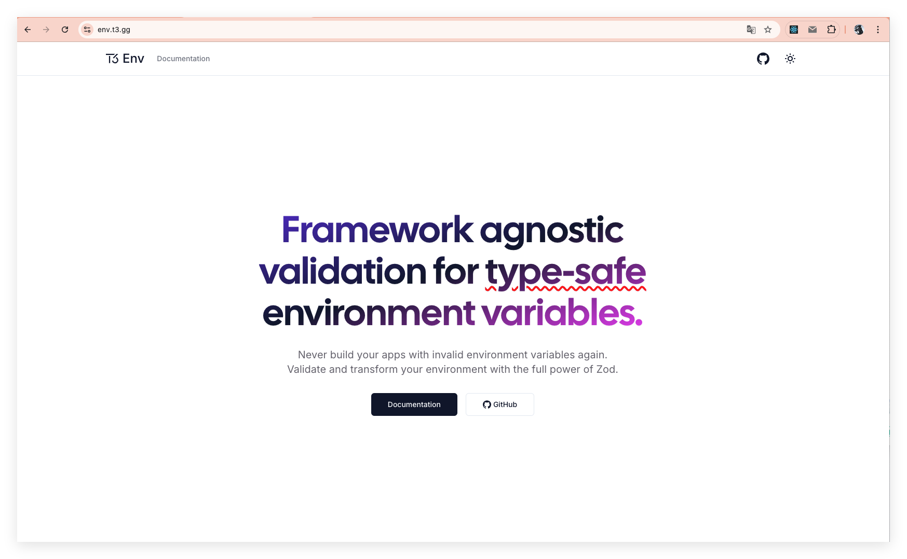

相比之下，[T3 Env](https://env.t3.gg/docs/introduction 'T3 Env') 的呼声最高，基于 [zod](https://zod.dev/ 'zod') 验证结果并将其类型推断到对象上，它支持变换、默认值和多种环境。

### 国际化

Next.js 项目实现国际化，目前已有的技术选型：[next-i18next](https://next.i18next.com/ 'next-i18next')、[next-intl](https://next-intl-docs.vercel.app/ 'next-intl')、[next-translate](https://github.com/aralroca/next-translate)、[next-international](https://next-international.vercel.app/ 'next-international')等。

- react-i18next 配置繁琐，但更为灵活自由。
- next-intl 配置简单，相对限制较多，部分配置无法自定义。
- Next.js 文档中 [Internationalization](https://nextjs.org/docs/app/building-your-application/routing/internationalization) 的 `@formatjs/intl-localematcher` 和 `negotiator` 的方案。

### 数据校验

在 Next.js 中使用 [Zod](https://zod.dev/) 可以帮助你进行表单验证和类型安全检查。

Zod 是一个 TypeScript-first 的验证库，能很好地与 TypeScript 和 Next.js 配合使用，提升开发体验。

### 表单

Web开发领域，表单处理无疑是一项既复杂又重要的话题。随着 Next.js 13 版本带来的 Server Actions 特性，以及 react-hook-form 和 zod 等库的广泛流行，更多强大的工具来构建既高效又类型安全的表单供我们选择，同时还能提供不错的用户体验。

- [Next.js Server Actions](https://nextjs.org/docs/app/building-your-application/data-fetching/server-actions-and-mutations)：允许直接在组件中定义服务器端函数，简化了客户端和服务器之间的通信。
- FormData：Web API提供的接口，用于构造表单数据集合。
- [react-hook-form](https://react-hook-form.com/)：用于构建灵活和高效的表单的 React 库。
- zod：TypeScript优先的模式声明和验证库。

### 数据库

对于 Next.js 项目，你可以选择多种数据库解决方案。根据[2023年数据库统计](https://stateofdb.com/databases '2023年数据库统计')，常用的数据库是 Postgresql、MongoDB、MySQL 和 Redis：

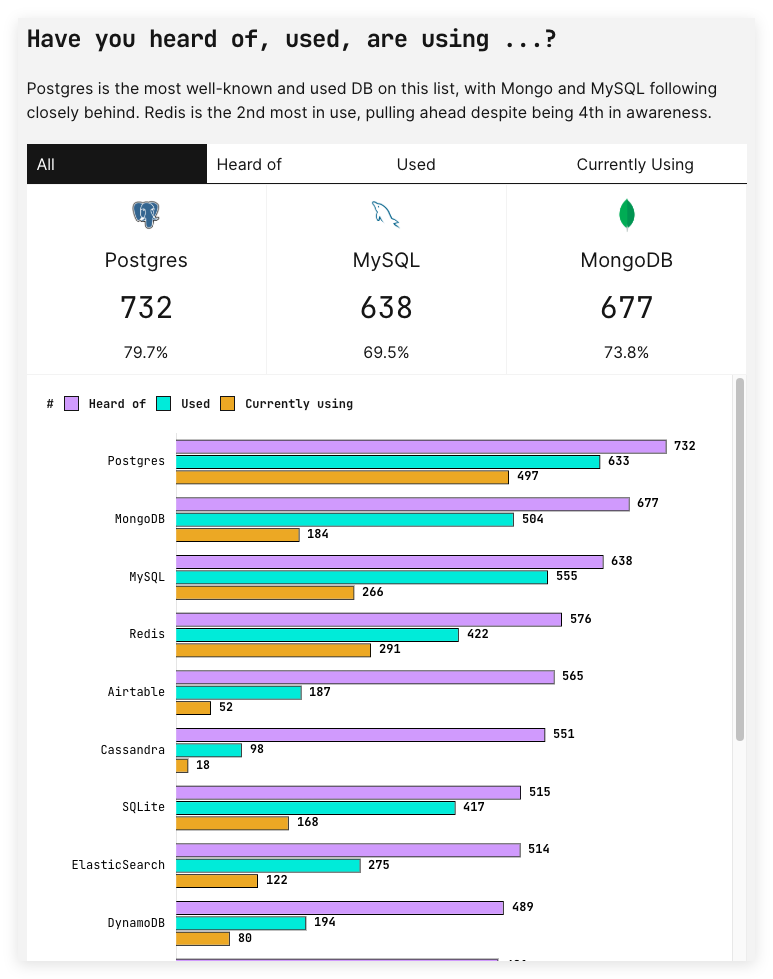

以下是一些流行的选择：

- **PostgreSQL（简称Postgres）**：是一个功能强大的开源对象关系数据库系统（ORDBMS）。它以其可靠性、强大的功能和符合标准的特性而著称。
- **MongoDB**：一个高性能、高可用性和易扩展的 NoSQL 数据库，适合处理大量的非结构化数据。
- **MySQL**：是一个开源的关系型数据库管理系统（RDBMS），由瑞典MySQL AB公司开发，现在由 Oracle 公司维护。
- **Redis**： 是一个开源的内存数据库，提供了高性能的键值存储系统，支持多种数据类型、原子性操作、持久化、发布/订阅等特性。

关系型数据库，适合需要复杂查询和事务支持的场景。非关系型数据库不依赖于表格模型来存储数据，而是使用其他形式如键值对、文档、宽列存储或图形数据库模型。它们通常提供更高的灵活性和可扩展性。

### ORM

上面提到数据库，在项目开发过程中，对相关数据库的操作就要借助 ORM 工具，当然也可以直接写原生 SQL，如果对 SQL 不是很熟悉，建议还是直接使用 ORM 库，在 Node.js 下，常用的 ORM 库有 [Prisma](https://www.prisma.io/docs/orm 'Prisma')、[Sequelize](https://sequelize.org/ 'Sequelize')、[TypeORM](https://typeorm.io/ 'TypeORM')、[Drizzle](https://orm.drizzle.team/ 'Drizzle')。[Mongoose](https://mongoosejs.com/ 'Mongoose') 也是一种 ORM，但它是基于 Node.js 和 MongoDB 的 ORM 库。

根据 [npm trends](https://npmtrends.com/drizzle-orm-vs-mongoose-vs-prisma-vs-sequelize-vs-typeorm) 的对比：

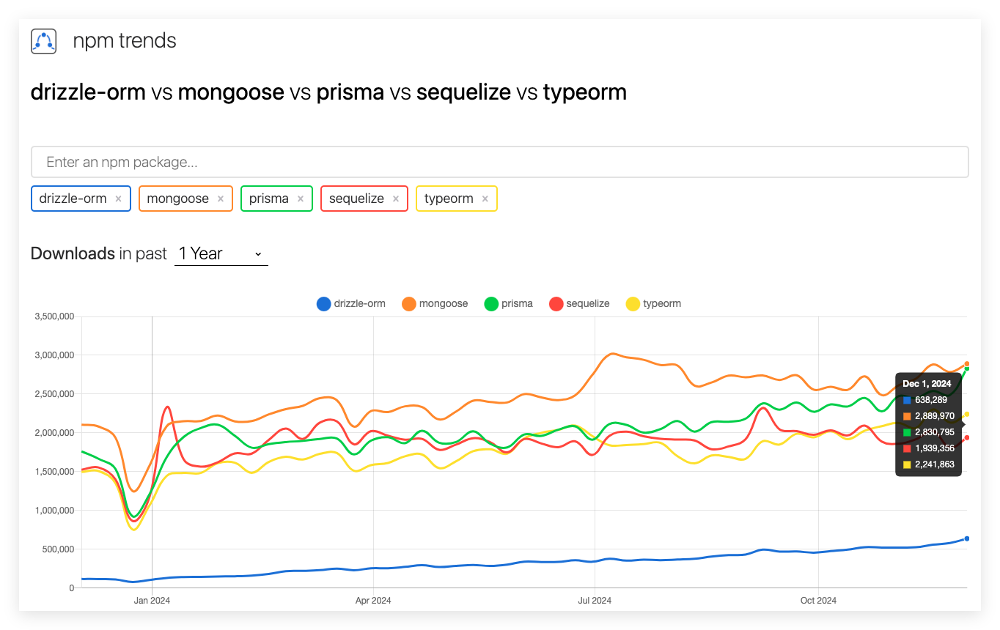

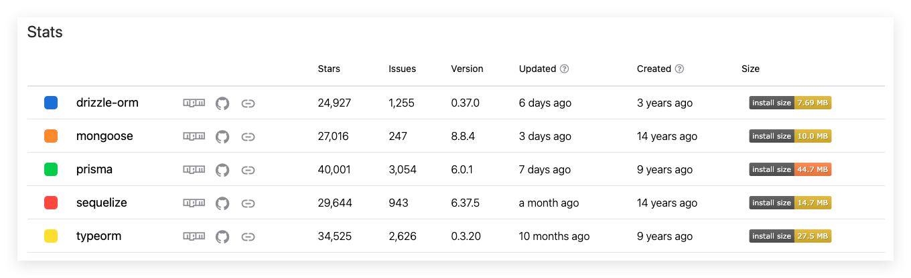

从上面的图中可以看出 Sequelize 是老牌的 ORM 库，但是对 TypeScript 支持不佳，后来有了 TypeORM，对 TypeScript 支持更好，但是 TypeORM 更新维护比较慢，后被对 TypeScript 支持更佳、开发体验更好的 Prisma 超越。

Mongoose 也是老牌的 ORM 库，专注于 MongoDB 数据库。Drizzle 是这一两年才发布的小鲜肉，正在茁壮成长，目前版本还在 0.29.1。

在实际的项目开发中，理论上应该选择使用度更高、版本相对稳定的库。简单来说，初学者推荐用 Prisma。如果你用 MongoDB，可以选择 Mongoose。新项目尝鲜可以使用 Drizzle。

### 身份认证

关于身份认证，除了自己开发外，还可以使用一些平台或者第三方库来快速搭建，其中 [Clerk](https://clerk.com/ 'Clerk') 和 [Supabase](https://supabase.com/ 'Supabase') 两个平台的接入成本最低，但免费版本有限制。

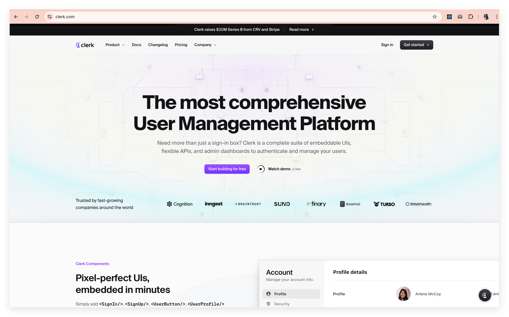

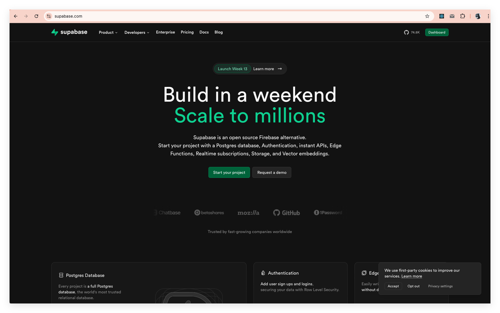

除了上面两个平台外，还有一个第三方库可供我们快速实现登录注册等功能——[Auth.js](https://authjs.dev/)

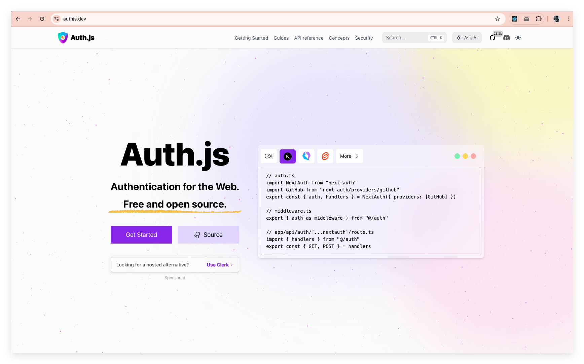

### CI/CD

在 Next.js 中，实施 CI/CD（持续集成/持续部署）是提高开发效率、保证代码质量和加快部署速度的关键实践。对于 Next.js 项目，以下是一些常用的 CI/CD 工具：

- [GitHub Actions](https://github.com/features/actions 'GitHub Actions')：GitHub提供的原生持续集成/持续交付工具，允许在 GitHub 托管的项目或组织中自动执行测试、构建和部署。

- [Jenkins](https://www.jenkins.io/ 'Jenkins')：一个开源自动化服务器，允许更多的配置和更容易的自动化过程扩展。
- [CircleCI](https://circleci.com/ 'CircleCI')：一个在云中运行的CI/CD工具，与 GitHub 和 Bitbucket 有效协作。
- [Travis CI](https://www.travis-ci.com/ 'Travis CI')：一个用于构建和测试托管在 GitHub 上的项目的持续集成工具。
- [GitLab CI](https://docs.gitlab.com/ee/ci/ 'GitLab CI')：GitLab提供的集成CI/CD解决方案，允许直接在GitLab中执行测试和部署。

通过 CI/CD，在开发过程中可以减少手动操作，提高代码质量和部署的可靠性，从而更专注于功能开发。

### 测试相关

单元测试、集成测试和端到端测试是应用的质量和稳定性的一大保障，但是在国内的一些开发团队中，疲于业务功能的开发，很少写测试，除了写一些开源项目或者团队有硬性要求外。

- [Jest](https://jestjs.io/zh-Hans/ 'Jest') 是一个老牌的单元测试框架，[React Testing Library](https://testing-library.com/docs/react-testing-library/intro/ 'React Testing Library') 是一款用于 React 组件的 DOM Testing Library。它们可以帮助你测试 React 组件的行为和输出。除了 Jest 外还有 [Vitest](https://cn.vitest.dev/ 'Vitest')，也可以搭配 React Testing Library 一起使用，新项目中建议使用 Vitest + React Testing Library

- [Cypress](https://www.cypress.io/ 'Cypress') 是一个用于端到端（E2E）和集成测试的测试运行器。它提供了一个快速、易于设置、并拥有丰富功能和命令的测试环境。

- [Playwright](https://playwright.dev/ 'Playwright') 是一个由 Microsoft 开发的用于浏览器测试和网页抓取的开源自动化库。

- [Codecov](https://about.codecov.io/ 'Codecov') 是一个用于代码覆盖率分析的工具，它可以帮助开发人员了解他们的代码被测试的程度。Codecov 支持多种编程语言，并提供多种功能，例如可视化覆盖率报告、代码审查集成和与其他工具的集成

### 数据分析

项目上线后，基本上都需要对项目进行监控，其中有以下方案：

- Next.js 官方也提供了 [@next/bundle-analyzer](https://www.npmjs.com/package/@next/bundle-analyzer) 插件，它会生成每个模块大小及其依赖的可视化报告。

- [Sentry](https://sentry.io/welcome/ 'Sentry')：常见的用于监控错误和性能的解决方案。

- [Better Stack](https://betterstack.com/) 是一个日志管理与分析协作平台，通过将监控、日志记录、事件管理和状态页面整合到一个平台中，为开发人员提供实时协作服务。

### 日志

应用上线后监控除了上面数据分析中提到的几个方法外，还可以通过记录日志来定位问题。

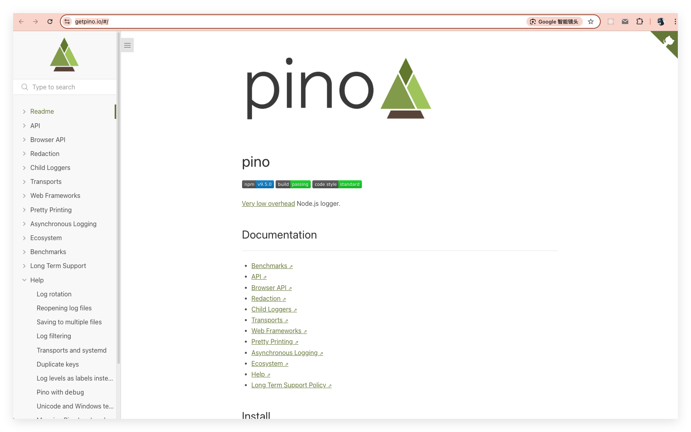

在 Node.js 生态中，[Pino](https://getpino.io/#/ 'Pino') 是一个非常快速且简洁日志库，其设计宗旨在于提供最小的开销以及高性能的日志记录功能。

## 社区的集成模板

看到这里，相信你对与一个成熟的 Next.js 项目可能包含的相关技术选型有了基本的认知，如果要我们从零开始配置，属实要花不少功夫，好在业界也有不少现成的项目模板和 CLI 脚手架供我们使用，下面按照 star 数（2024年12月10日）排列：

### Payload（29.5k）

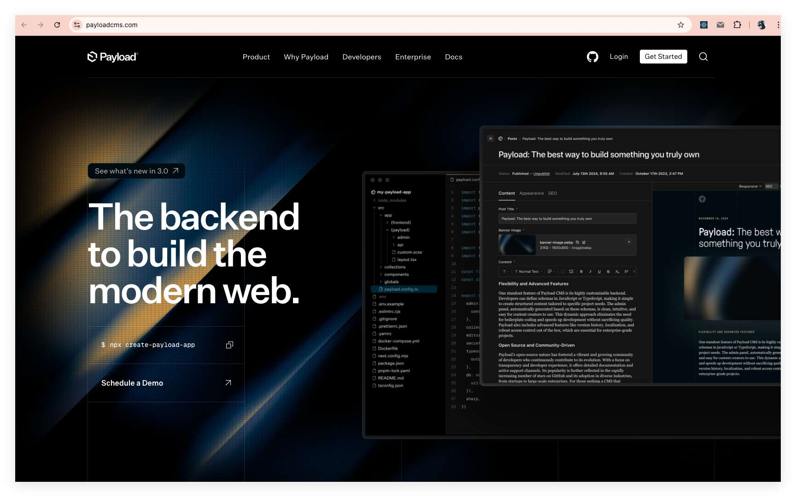

[Payload](https://github.com/payloadcms/payload) 是一个开源的全栈 Next.js 框架，通过 Payload，你可以快速搭建一个完整的 TypeScript 后端，并配备一个功能强大的管理面板。你可以将 Payload 用作无头内容管理系统（handless CMS），或者用于构建各种类型的应用程序，包括但不限于网站、电商平台和社交媒体等

### create-t3-app（25.7k）

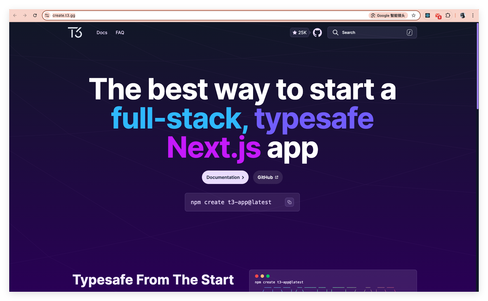

[create-t3-app](https://create.t3.gg/ 'create-t3-app') 是一个交互式的 Cli 用于启动一个全栈、类型安全的 Next.js 应用程序；整合了 Next.js、tRPC、Tailwind CSS、TypeScript 和 Prisma 等技术，提供了一个现代化的全栈开发体验。

### Blitz（13.7k）

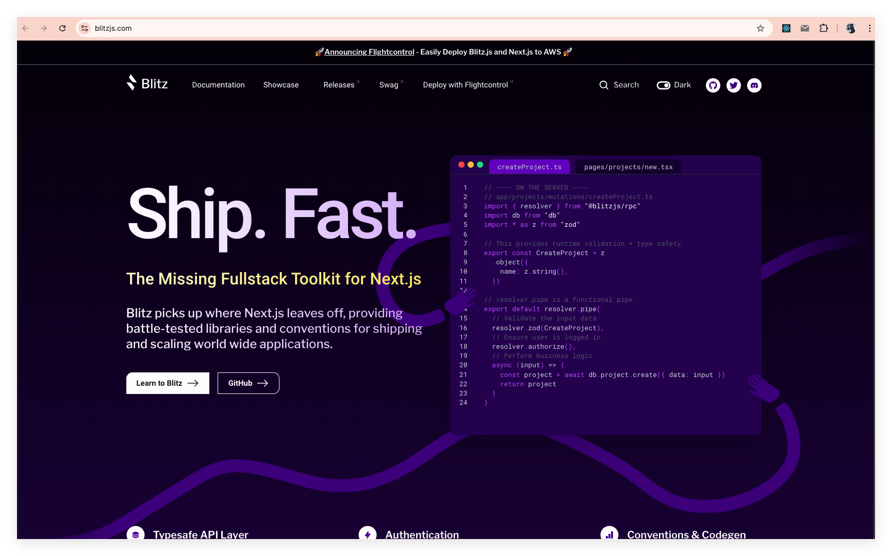

[Blitz](https://github.com/blitz-js/blitz 'Blitz') 致力于添补 Next.js 缺失的全栈工具，比如类型安全的内容层（RPC）、Authentication、各种预配置（eslint、prettier、husky git hooks 等）、丰富的脚手架用于创建各种技术选型方案。

### Next-js-Boilerplate（9.6k）

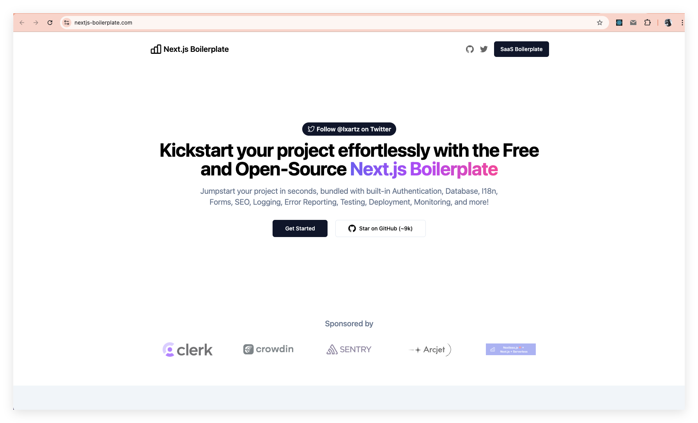

[Next-js-Boilerplate](https://github.com/ixartz/Next-js-Boilerplate 'Next-js-Boilerplate') 是 Next.js 15 的项目模板，支持 App Router 和 Page Router、Tailwind CSS 3.4 和 TypeScript。

以开发者体验为先的技术栈：Next.js + TypeScript + ESLint + Prettier + Drizzle ORM + Husky + Lint-Staged + Vitest + Testing Library + Playwright + Storybook + Commitlint + VSCode + Netlify + PostCSS + Tailwind CSS

### SaaS-Boilerplate（4.2k）

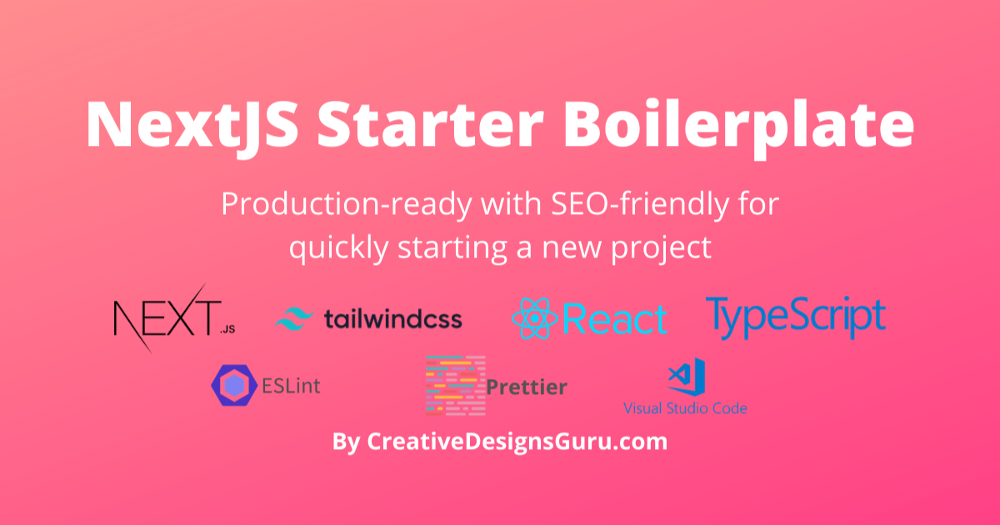

[SaaS-Boilerplate](https://github.com/ixartz/SaaS-Boilerplate 'SaaS-Boilerplate') 是一个 SaaS 模板，基于 Next.js、Tailwind CSS、Shadcn UI 和 TypeScript 的全栈 React 应用程序，提供了一个完整的框架，包括身份验证、多租户、角色和权限、国际化、登陆页面、数据库、日志记录和测试等功能，帮助开发者快速构建自己的 SaaS 产品。

### next-starter（0.6k）

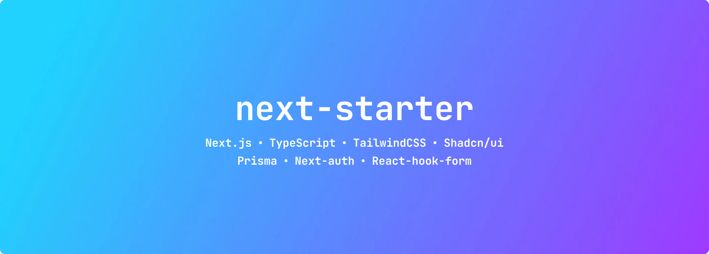

[next-starter](https://github.com/Skolaczk/next-starter 'next-starter') 项目模板是一个基于 Next.js 15（App Router）和 React 18 的全栈应用程序开发框架，使用 TypeScript 作为类型检查语言。它集成了多种技术和工具，包括 TailwindCSS、Shadcn/ui、Stripe、Next-auth、Prisma、React-hook-form、Zod、Jest、Playwright、Prettier、Eslint、Husky、Lucide、next-themes、Commitlint、Github actions、T3-env、Sitemap 和 Paraglide 等，提供了一个完整的开发环境，帮助开发者快速构建自己的应用程序。

## 总结

在 Next.js 生态中，技术选型至关重要，它不仅影响开发效率和项目质量，还决定了团队的长期维护和扩展能力。从 CSS 方案（如 Tailwind CSS、CSS Modules）到状态管理工具（如 Zustand、Redux Toolkit），再到代码质量保障工具（如 ESLint、Prettier、Husky），以及国际化、数据校验和表单处理的优化方案（如 Zod、react-hook-form），每个环节都有多种成熟的技术支持。此外，官方资源如 next-learn 提供了系统的学习路径，结合社区工具（如 shadcn/ui、T3 Env），开发者可以快速构建高效的 Web 应用。通过合理的技术选型，能更好地满足业务需求，同时降低开发和维护成本。
