在现代 Web 开发领域，性能优化始终是一个核心话题。Next.js 引入[缓存](https://nextjs.org/docs/app/building-your-application/caching "Caching in Next.js")策略成为了提升性能的另一大利器。缓存技术通过存储数据的重复副本来减少数据检索时间，提高响应速度，并减轻服务器负载。在 Next.js中，合理地利用缓存不仅可以显著减少服务器的响应时间，降低资源消耗，还能最终提升用户体验。本文将深入探讨 Next.js 中的缓存机制，包括其工作原理、不同类型的缓存策略等内容。

> **文中示例的开发环境：**
>
> - node.js v20.10.0
> - pnpm v8.12.1
> - vs vode v1.95.3
> - chrome v131.0.6778.140
> - next.js v15.1.0
> - react.js v19.0.0

在 Next.js 中有四种缓存机制：

| 机制                             | 缓存内容            | 存储地方 | 目的                      | 期间               |
| -------------------------------- | ------------------- | -------- | ------------------------- | ------------------ |
| 请求记忆（Request Memoization）  | 函数的返回值        | 服务端   | 在 React 组件树中复用数据 | 每个请求的生命周期 |
| 数据缓存（Data Cache ）          | 数据                | 服务端   | 跨用户请求和部署复用数据  | 持久（可重新验证） |
| 完整路由缓存（Full Route Cache） | HTML 和 RSC payload | 服务端   | 降低渲染成本、提高性能    | 持久（可重新验证） |
| 路由缓存（Router Cache）         | RSC payload         | 客户端   | 减少导航时的服务端请求    | 用户会话或基于时间 |

默认情况下，Next.js 会尽可能多的使用缓存以提高性能和降低成本。像路由默认会采用静态渲染，数据请求的结果默认会被缓存。

构建时静态路由渲染以及首次访问静态路由的原理图如下：


打包构建路由 `/a` 时，因为路由中的请求是首次触发，所以都会 MISS（缓存未命中），从数据源获取数据后，将数据在[请求记忆](https://nextjs.org/docs/app/building-your-application/caching#request-memoization "请求记忆")和[数据缓存](https://nextjs.org/docs/app/building-your-application/caching#data-cache "数据缓存")中都保存了一份（也就是 SET 操作），最后将生成的 RSC Payload 和 HTML 也在服务端保存了一份（完整路由缓存）。

当客户端访问 `/a` 的时候，命中（HIT）服务端缓存的 RSC Payload 和 HTML，并将 RSC Payload 在客户端保存一份（路由缓存）。

**缓存行为会根据多种因素发生变化**，比如：

- 路由是动态渲染还是静态渲染。
- 数据是缓存还是未缓存。
- 请求是在初始化访问中还是后续导航中。

接下来我们来看看上面的四种缓存策略！

## 请求记忆（Request Memoization）

### 工作原理

React 扩展了 [fetch](https://nextjs.org/docs/app/api-reference/functions/fetch) API，以自动记住具有相同 URL 和选项的请求。这意味着你可以在 React 组件树中的多个位置调用相同数据的获取函数，而只需执行一次。

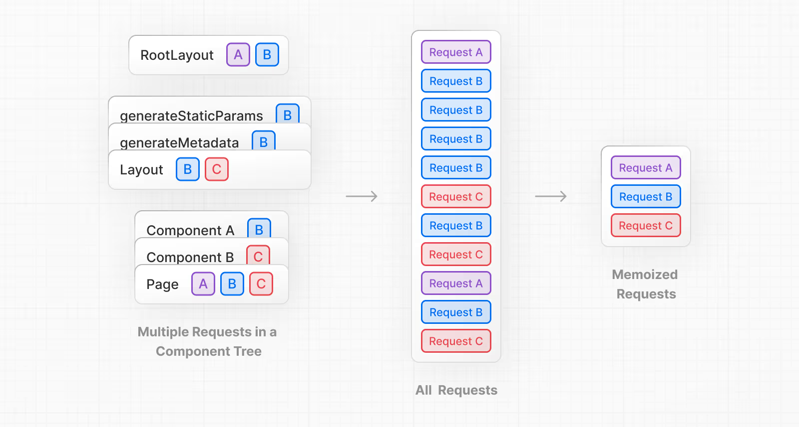

比如，如果你需要跨路由（例如在布局、页面和多个组件中）使用相同的数据，则不必在树的顶部获取数据，并在组件之间转发 props。相反，你可以在需要的组件中获取数据，而不必担心通过网络对同一数据发出多个请求对性能的影响。

```jsx
async function getItem() {
  // `fetch` 函数会自动被缓存，结果会被存储
  const res = await fetch('https://.../item/1')
  return res.json()
}

// 这个函数被调用了两次，但只在第一次执行
const item = await getItem() // 缓存未命中

// 第二次调用可能在路由的任何地方
const item = await getItem() // 缓存命中
```

请求记忆的工作原理图：

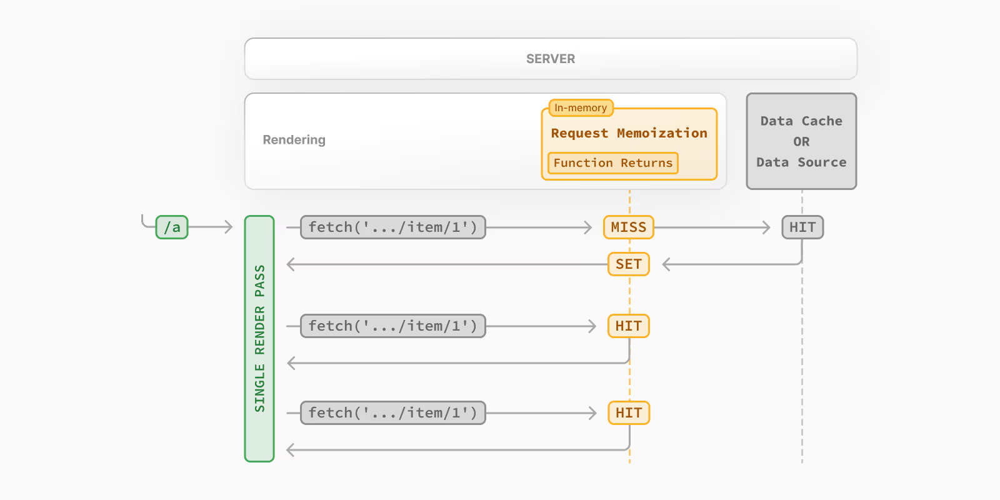

在上面的图中，可以看出，当渲染路由 `/a` 的时候，因为是第一次请求，会触发缓存 MISS，请求结果会被存储到内存中（SET In-memory 操作），当下次相同的请求时，就会触发缓存 HIT，直接从缓存中取数据并返回；当路由 `/a` 的 React 组件树完全渲染结束，内存中的缓存会被清空！

> **注意**：
>
> - 请求记忆是 React 的特性，而不是 Next.js 的特性。
> - 请求记忆仅适用于 GET 方法的 fetch 请求。
> - 请求记忆仅适用于 React 组件树，也就是在 `generateMetadata`、`generateStaticParams`、布局、页面和其他服务器组件中的 fetch 会触发请求记忆。但路由处理程序中的 fetch 请求不会触发请求记忆，因为它们不是 React 组件树的一部分。

### 持续时长（Duration）

缓存在服务器请求的生命周期内一直持续，直到 React 组件树完成渲染。

### 重新验证（Revalidating）

请求记忆只在渲染过程中使用，因此无需重新验证。

### 选择退出（Opting out）

记忆仅适用于 fetch 请求中的 `GET` 方法，其他方法（例如 `POST` 和 `DELETE`）不会被记忆。此默认行为是 React 优化，不建议选择退出。

如果不希望某个 fetch 请求被记忆，可以使用 [AbortController](https://developer.mozilla.org/zh-CN/docs/Web/API/AbortController "AbortController") 中的 `signal` 属性。使用方式如下：

```js
const { signal } = new AbortController()
fetch(url, { signal })
```

> 如果对这个 API 不熟悉，可以查看 [AbortController](https://developer.mozilla.org/zh-CN/docs/Web/API/AbortController) 文档，体验地址：[https://mdn.github.io/dom-examples/abort-api/](https://mdn.github.io/dom-examples/abort-api/ "abort api")

### React 的 cache 函数

如果你不能使用 fetch 请求，但是又想实现记忆，可以借助 React 的 [cache](https://react.dev/reference/react/cache#noun-labs-1201738-(2)) 函数：

```js
import { cache } from 'react'
import db from '@/lib/db'

export const getItem = cache(async (id: string) => {
    const item = await db.item.findUnique({ id })
    return item
})
```

cache 还是一个实验性 API，生产环境慎用！
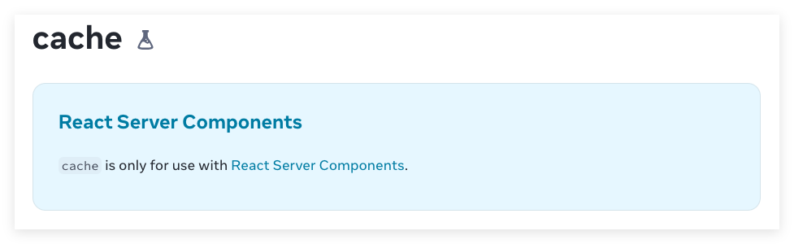

让我们通过一个实际案例来深入理解请求记忆（Request Memoization）的工作原理和应用场景。

### 案例：获取随机狗狗图片

我这里就采用公共接口 `https://dog.ceo/api/breeds/image/random` 来演示多次触发请求后，为了演示多次触发请求，我们就在生成 Metadata、页面加载和 Dog 的详情页分别请求一次，看看是否达到预期？

> 在需求确认之后，我们先使用命令 `npx create-next-app@latest --use-pnpm` 来创建下 Next.js 项目，具体配置选项如下：
>
> 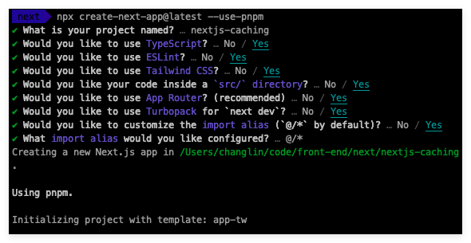
>
> 项目的依赖信息如下：
>
> ```json
> {
> "dependencies": {
>  "react": "^19.0.0",
>  "react-dom": "^19.0.0",
>  "next": "15.1.0"
> },
> "devDependencies": {
>  "typescript": "^5",
>  "@types/node": "^20",
>  "@types/react": "^19",
>  "@types/react-dom": "^19",
>  "postcss": "^8",
>  "tailwindcss": "^3.4.1",
>  "eslint": "^9",
>  "eslint-config-next": "15.1.0",
>  "@eslint/eslintrc": "^3"
> }
> }
> ```

在 `src/app` 创建 `/dog` 路由，代码如下：

```jsx
import React from 'react'

interface Dog {
    message: string
    status: string
}
async function getData() {
    const res = await fetch('https://dog.ceo/api/breed/appenzeller/images/random')
    return res.json() as Promise<Dog>
}

export async function generateMetadata() {
    const data = await getData()
    return {
        title: data.message
    }
}

export default async function page() {
    const data = await getData()
    return (
        <div>
            
            <DogDetail />
        </div>
    )
}

const DogDetail = async () => {
    const data = await getData()
    return (
        <div>
            <p>dog detail</p>
            
        </div>
    )
}
```

这段代码也不复杂，访问 `/dog` 路由的时候，会在 generateMetadata函数、页面和 `<DogDetail />` 组件中调用三次接口，接口每次都返回一张随机的狗狗图片的数据，数据格式如下：

```json
{
    "message": "https://images.dog.ceo/breeds/sheepdog-indian/Himalayan_Sheepdog.jpg",
    "status": "success"
}
```

上面我们写完代码，来看看具体效果：

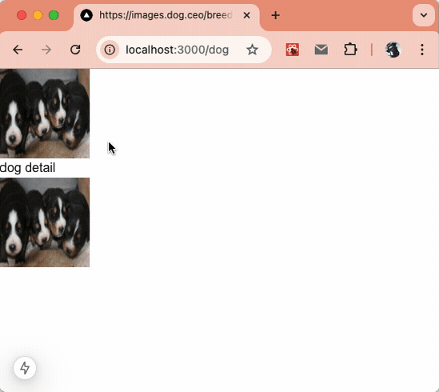

从上面的动图中可以看出，每次刷新都是页面的数据都是一样的，无论怎么刷新，页面的数据都是一样的。原因也很简单，首先是静态渲染，页面在构建的时候进行渲染，其次虽然调用了 3 次接口，但因为有请求记忆、数据缓存，3 次调用接口数据返回一致。

怎么让它每次请求都不一样呢？根据上面的内容也能很容易的想到解决方案，那就是使用 `AbortController` 的 `signal`，只需要修改 `getData` 方法，调整后的代码如下：

```ts
async function getData() {
    const { signal } = new AbortController()
    const res = await fetch('https://dog.ceo/api/breed/appenzeller/images/random', { signal })
    return res.json() as Promise<Dog>
}
```

在浏览器中的效果如下：

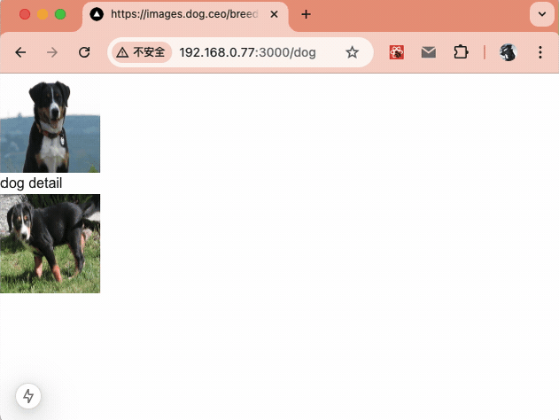

请求记忆是 React 的数据缓存方案，它只持续在组件树渲染期间，目的是为了避免组件树渲染的时候多次请求同一数据造成的性能影响。介绍完请求记忆后我们继续看看数据缓存是怎么回事！

## 数据缓存

Next.js 有自己的数据缓存方案，可以跨服务端请求和构建部署存储数据；因为 Next.js 扩展了原生 fetch API，允许服务器上的每个请求设置自己的缓存方式。
> 在浏览器中，fetch 的 `cache` 选项指示请求如何与浏览器的 HTTP 缓存交互，在 Next.js 中，`cache` 选项指示服务器端请求如何与服务器的数据缓存交互。

### 工作原理

默认情况下，Next.js 14 使用 fetch 的数据请求都会被缓存，这个缓存是持久的，它不会自动被重置。你可以使用 `fetch` 的 `cache` 和 `next.revalidate` 选项来配置缓存行为：

```js
fetch(`https://...`, { cache: 'force-cache' | 'no-store' })

fetch(`https://...`, { next: { revalidate: 3600 } })
```

后面再详细介绍它们的具体使用和区别！

下面 Next.js 数据缓存的工作原理图：

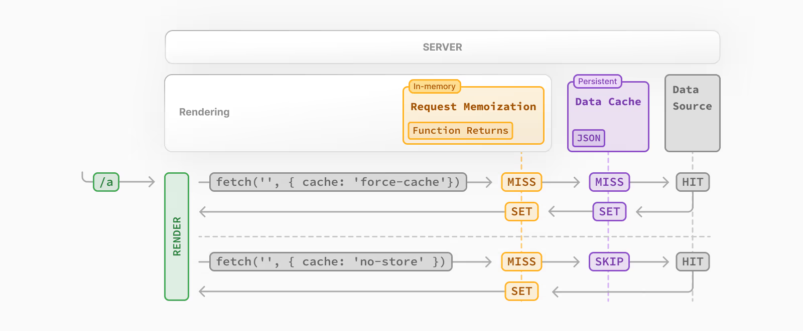
使用 `force-cache` 选项：

- **检查缓存**：Next.js会首先检查数据缓存中是否有对应的缓存响应。
- **返回缓存响应**：如果找到缓存响应，Next.js会立即返回这个响应，并将其记忆化，以便在后续的渲染过程中直接使用，无需再次请求。
- **请求并缓存数据**：如果没有找到缓存响应，Next.js会向数据源发起请求，获取数据后将其存储在数据缓存中，并同样进行记忆化。

使用 `no-store` 或无缓存选项：

- **直接请求数据源**：对于没有定义缓存选项或明确指定{ cache: 'no-store' }的请求，Next.js会直接从数据源获取数据。
- **记忆化**：尽管数据不会被缓存，Next.js仍然会记忆化这些请求的结果，以避免在同一React渲染周期内对同一数据发起重复请求。

简单来说，`force-cache` 策略会尝试使用缓存数据，而 `no-store` 策略则总是直接从数据源获取数据，但两者都会进行记忆化处理，以优化渲染性能和减少不必要的网络请求。

> 数据缓存（Data Cache）和请求记忆（Request Memoization）之间的区别
>
> - 都是通过复用缓存数据来提高应用性能。
> - 数据缓存是持久的，跨越多个请求和部署，而请求记忆只在请求的生命周期内有效。
> - 数据缓存可以在多个请求之间共享数据，而请求记忆只在单个请求内共享数据。

### 持续时长（Duration）

数据缓存在不同的请求和部署之间是持久的，除非你选择重新验证或选择退出。

### 重新验证（Revalidating）

Next.js 提供了两种方式更新缓存：

1. **基于时间的重新验证**；也就是经过一定时间并有新请求产生后重新验证数据，使用与实时性要求不高的场景。
2. **按需重新验证**；基于某个事件（例如表单提交）重新验证数据。按需重新验证可以使用基于标签或路径的方法，一次性重新验证一组数据；适用于实时性要求高的场景。

#### 基于时间的重新验证

基于时间的重新验证，需要使用 `fetch` 的 `next.revalidate` 选项设置缓存的时间（注意它是以秒为单位）。

```js
fetch('https://...', { next: { revalidate: 3600 } }); // 3600s ==> 每小时验证一次
```

还可以借助[路由段配置项](https://nextjs.org/docs/app/api-reference/file-conventions/route-segment-config#revalidate "Route Segment Config")来配置该路由所有的 fetch 请求：

```ts
export const revalidate = 3600; // 在 layout.tsx | page.tsx | route.ts 文件添加都行，不能重复定义
```

这个配置我们后面详细讲解！基于时间的重新验证原理图如下：

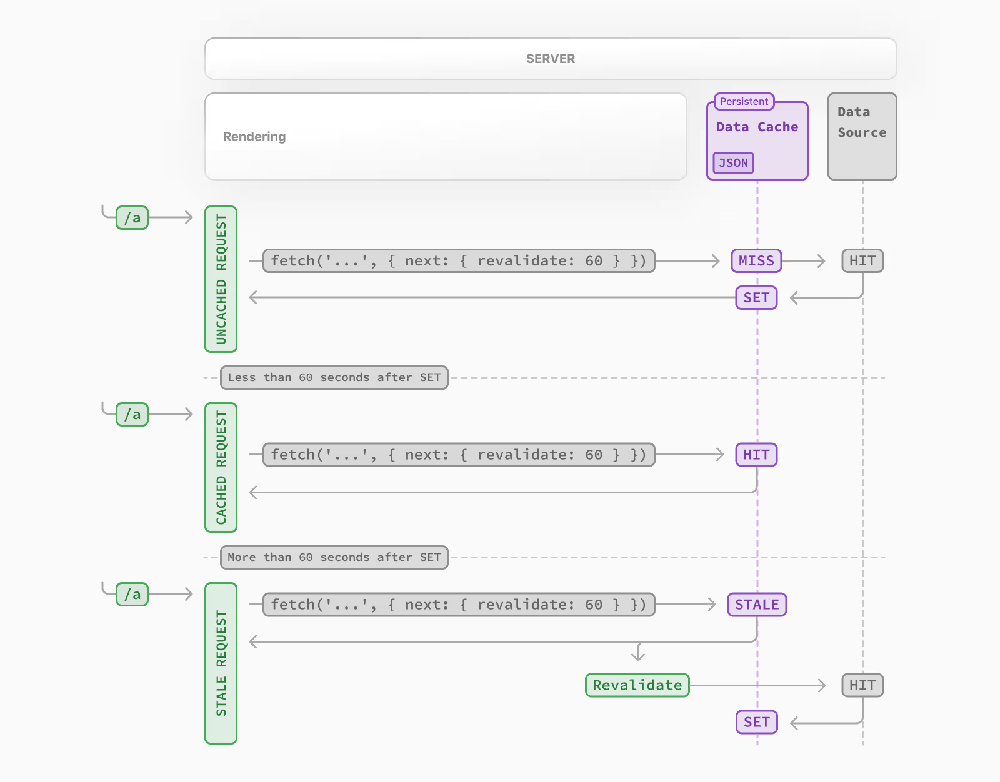

通过上图不难发现，并不是 60s 后该请求会自动更新，而是 60s 后再有请求的时候，会进行重新验证，60s 后的第一次请求依然会返回之前的缓存值，但 Next.js 将使用新数据更新缓存。60s 后的第二次请求会使用新的数据。

#### 按需重新验证

使用按需重新验证，数据可以根据路径（`revalidatePath`）和缓存标签（`revalidateTag`）按需更新。

按需更新的原理图如下：

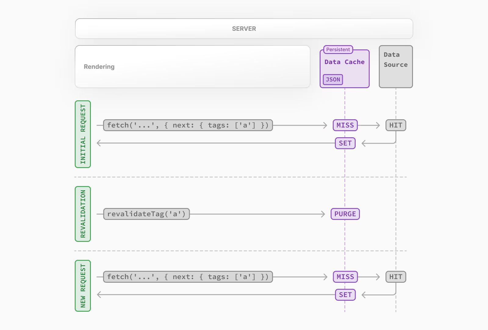

从图中可以发现：

1. 第一次调用请求的时候，获取数据并正常缓存数据，然后返回数据。
2. 当触发按需重新验证的时候，将会从缓存中删除相应的缓存条目，然后返回数据。
3. 下次请求的时候，又相当于第一次调用请求，获取数据并正常缓存数据，然后返回数据。

### 选择退出（Opting out）

如果你想要退出数据缓存，有两种方式：

- 是将 fetch 的 `cache` 选项设置为 `no-store`，**每次调用的时候都会重新获取数据**；示例如下：

  ```jsx
  let data = await fetch('https://api.vercel.app/blog', { cache: 'no-store' }); // 每次调用的时候都会重新获取数据
  ```
  
- 一种是使用[路由段配置项](https://nextjs.org/docs/app/api-reference/file-conventions/route-segment-config#dynamic)，它会**影响该路由段中的所有数据请求**：

  ```jsx
  export const dynamic = 'force-dynamic'; // 强制动态渲染
  ```

### 案例：基于时间和按需的重新验证

写一个实际案例来辅助我们理解数据缓存到底是怎么回事，为了后续演示，我们先来写一个简单的 GET API。主要是返回当前时间，供我们后面在页面中使用。逻辑比较简单。在 `/app/api/time/route.ts` 写如下逻辑：

```ts
export async function GET() {
    const data = {
        timezone: Intl.DateTimeFormat().resolvedOptions().timeZone,
        date: new Date().toLocaleDateString(),
        time: new Date().toLocaleTimeString()
    }
    return Response.json(data)
}
```

返回的结果：

```json
{
    "timezone": "Asia/Shanghai",
    "date": "12/12/2024",
    "time": "4:45:10 PM"
}
```

- 基于时间的重新验证

  演示的场景是一个静态渲染页面，每 5 秒重新构建一次获取 time API 的最新数据。在 `app/` 下，创建 `static-rendering-revalidate-5s/page.tsx`，写入内容如下：

  ```jsx
  import React from 'react'

  export default async function page() {
      const port = process.env.PORT;
      const res = await fetch(`http://localhost:${port}/api/time`, { next: { revalidate: 5 } })
      const data = await res.json()
      return (
          <div>
              <p> 本次渲染时的时间:{new Date().toString()} </p>
              <p> 服务端获取的数据:{JSON.stringify(data)}</p>
          </div>
      )
  }
  ```

  在浏览器中访问 `http://localhost:3000/static-rendering-revalidate-5s` 后效果如下：

  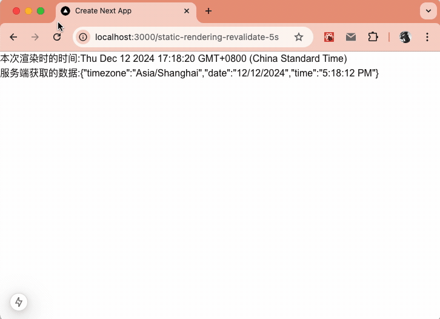

  从如中可以看出，服务端的数据不是浏览器每次刷新都获取，而是每 5s 获取一次然后更新。上面源码在 [https://github.com/clin211/next-awesome/commit/93b0380b0e314586db86838b14ba71dea3dd2c07](https://github.com/clin211/next-awesome/commit/93b0380b0e314586db86838b14ba71dea3dd2c07) 中可以找到！

- 按需重新验证

  上面说完了基于时间的重新验证，也看看按需重新验证，按需重新验证要么路径（`revalidatePath`），要么基于缓存标签（`revalidateTag`），为了更直观的演示，通过在客户端的按钮来触发更新：
  - 一个基于路径
  - 一个基于标签
  
  目标清楚之后，我们就来写代码！
  1. 在 `app/revalidate-functions/page.tsx` 中写入如下代码：
  
      ```jsx
      import React from 'react'
      import { RevalidatePathButton } from './revalidate-path-button'
      import { RevalidateTagButton } from './revalidate-tag-button'
      
      const port = process.env.PORT;
      export default async function page() {
          const dataA = await fetch(`http://localhost:${port}/api/time?a`, {
              cache: "force-cache",
              next: {
                  tags: ["a"],
              },
          })
              .then((res) => res.json())
              .then((res) => res);
      
          const dataB = await fetch(`http://localhost:${port}/api/time?b`, {
              cache: "force-cache",
              next: {
                  tags: ["b"],
              },
          })
              .then((res) => res.json())
              .then((res) => res);
      
          return (
              <div className="flex justify-center">
                  <div className="p-8 space-y-4">
                      <h1 className="text-4xl font-semibold text-center">按需重新验证</h1>
                      <div className="flex flex-col">
                          <RevalidatePathButton label="基于路径 Revalidate" />
                      </div>
                      <div className="flex flex-col gap-2">
                          <p className="font-[family-name:var(--font-geist-mono)]">
                              基于标签 Revalidate A：
                              <code className="bg-black/[.05] px-1 py-0.5 rounded font-semibold">
                                  {JSON.stringify(dataA)}
                              </code>
                          </p>
                          <RevalidateTagButton tag="a" label="基于标签 Revalidate A" />
                      </div>
                      <div className="flex flex-col gap-2">
                          <p className="font-[family-name:var(--font-geist-mono)]">
                              基于标签 Revalidate B：
                              <code className="bg-black/[.05] px-1 py-0.5 rounded font-semibold">
                                  {JSON.stringify(dataB)}
                              </code>
                          </p>
                          <RevalidateTagButton tag="b" label="基于标签 Revalidate B" />
                      </div>
                  </div>
              </div>
          )
      }
      ```

  2. 定义两个客户端组件 `/app/revalidate-functions/revalidate-path-button.tsx` 和 `/app/revalidate-functions/revalidate-tag-button.tsx`，代码如下：

      ```jsx
      // /app/revalidate-functions/revalidate-path-button.tsx
      "use client";
      
      import { revalidatePath } from "./actions";
      interface RevalidatePathButtonProps {
          label: string;
      }
      
      export function RevalidatePathButton({ label }: RevalidatePathButtonProps) {
          return (
              <button
                  className="py-1 border hover:bg-gray-50"
                  onClick={() => revalidatePath()}
              >
                  {label}
              </button>
          );
      }
      ```

      ```jsx
      // /app/revalidate-functions/revalidate-tag-button.tsx
      "use client";
      
      import { revalidateTag } from "./actions";
      interface RevalidateTagButtonProps {
          tag: string;
          label: string;
      }
      
      export function RevalidateTagButton({ tag, label }: RevalidateTagButtonProps) {
          return (
              <button
                  className="py-1 border hover:bg-gray-50"
                  onClick={() => revalidateTag(tag)}
              >
                  {label}
              </button>
          );
      }
      ```

  3. 在基于路径更新的组件本质上用了 `next/cache` 包的 `revalidatePath`，而基于标签的组件则是用了 `next/cache` 包的 `revalidateTag`，封装后的代码如下：

      ```jsx
      "use server";
      
      import {
          revalidateTag as nextRevalidateTag,
          revalidatePath as nextRevalidatePath,
      } from "next/cache";
      
      export async function revalidatePath() {
          nextRevalidatePath("/revalidate-functions");
      }
      
      export async function revalidateTag(tag: string) {
          nextRevalidateTag(tag);
      }
      ```

    写了这么多代码，我们再浏览器中访问 `http://localhost:3000/revalidate-functions` 看看具体效果：
  - 基于路径的效果
  
    
  
    从图中可以看出，每点击一次“基于路径 Revalidate”，都会导致页面的信息更新。
  - 基于标签的效果
  
    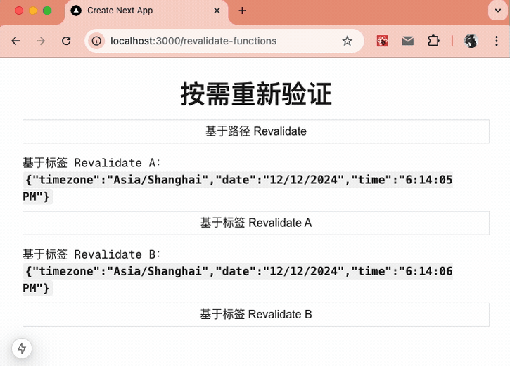
    基于标签的则只更新“自己标签”的信息。

## 完整路由缓存

Next.js 在构建时会自动渲染并缓存路由，这样可以直接返回缓存的页面，而不用每次请求都重新渲染，从而提高页面加载速度。

### 服务器端 React 渲染

在服务器上，Next.js 使用 React 的 API 来协调渲染。渲染工作会根据路由和 `<Suspense>` 拆分成多个 chunk，每个 chunk 分为两步进行渲染：

1. React 将服务器组件渲染为一种特殊的数据格式，也就是 React Server Component Payload，该格式经过优化，适合流式传输。
2. Next.js 利用 React 服务器组件有效负载和客户端组件 JavaScript 指令在服务器上渲染 HTML。

这样的好处就是：**可以边渲染边传输响应，而不用等所有内容渲染完成后再缓存或发送响应**。

完整路由缓存在服务端执行过程的原理图：

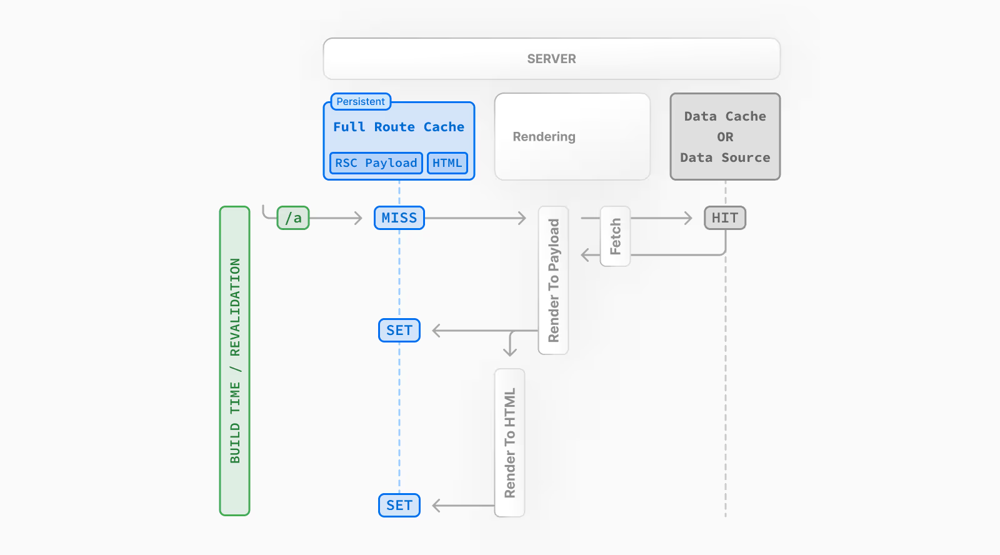

从图中可以看出，Next.js 默认会在服务器上缓存路由渲染结果中包含的 RSC Payload 和 HTML。这一机制适用于两种场景：在构建时静态渲染的路由，以及重新验证期间的路由。

### 静态渲染与动态渲染

路由在构建时是否缓存取决于它是静态还是动态渲染。静态路由默认缓存，而动态路由在请求时渲染，不缓存。

该图表展示了静态渲染路由和动态渲染路由之间的区别，包括缓存数据和非缓存数据的对比：

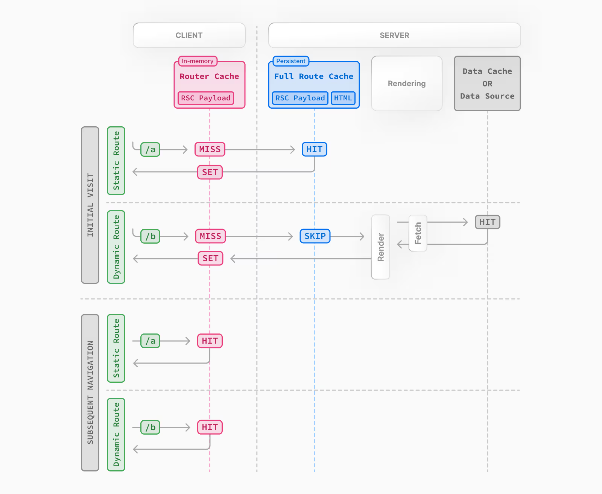

在这张图中，静态路由 `/a`， 因为有完整路由缓存，所以不会重新渲染一遍。动态路由 `/b` 没有完整路由缓存，所以会重新执行一遍渲染。但这并不影响客户端的路由缓存，所以在后续的请求中都命中了路由缓存。

### 持续时长（Duration）

默认情况下，完整路由缓存（Full Route Cache）是持久性的，这意味着可以跨用户请求复用。

### 失效方式（Invalidation）

有两种方式可以使完整路由缓存（Full Route Cache）失效：

- **重新验证数据**：重新验证数据缓存将导致路由缓存失效，因为服务器会重新渲染组件并缓存新的渲染输出。
- **重新部署**：数据缓存是可以跨部署的，但完整路由缓存会在重新部署中被清除。

### 选择退出（Opting out）

退出完整路由缓存的方式就是将其改为动态渲染：

1. **使用动态 API**：这将使路由退出完整路由缓存，并在请求时动态渲染，此时的数据缓存仍然可以使用。
2. **使用动态路由配置选项**：使用 `dynamic = 'force-dynamic'` 或 `revalidate = 0` 路由配置选项，将跳过完整路由缓存和数据缓存。也就是说组件将在每次请求时重新渲染，并且数据将在每次请求时重新获取。路由缓存依然可以使用，因为它是客户端缓存。
3. **退出数据缓存**：如果路由有一个未缓存的 `fetch` 请求，则将使路由退出完整路由缓存。特定 `fetch` 请求的数据将在每次请求时重新获取。其他 `fetch` 请求仍将被缓存在数据缓存中。这允许混合使用缓存和非缓存数据。

简单来说，完整路由缓存只适用于静态渲染，在服务端保留静态渲染的产物 RSC Payload 和 HTML。

## 路由缓存

Next.js 有一个存放在内存中的客户端缓存，它会在用户会话期间按路由段存储 RSC Payload。这就是路由缓存。

当用户在路线之间导航时，Next.js 会缓存已访问的路线段并预获取用户可能导航到的路由（基于视口内的 `<Link>` 组件）。这样可以实现即时的后退(前进)导航，导航之间无需重新加载整个页面，并保留 React 状态和浏览器状态。

使用路由缓存（Router Cache）后，以下效果会出现：

- 布局（Layouts）会被缓存并在导航时复用（部分渲染）。
- 加载状态（Loading states）会被缓存并在导航时复用，实现快速导航跳转。
- 页面（Pages）默认情况下不会被缓存，但在浏览器的后退和前进导航时会被复用。如果你想为页面段（page segments）启用缓存，可以使用实验性的 staleTimes 配置选项。

> 这个缓存特指 Next.js 和 Server Components，跟浏览器的 （后向缓存）是不同的，尽管它们的效果相似。

> 需要注意的是，这个缓存专门用于 Next.js 和 Server Components，与浏览器的[bfcache（back/forward cache）](https://developer.mozilla.org/zh-CN/docs/Glossary/bfcache "back/forward cache")不同，尽管它们具有类似的效果。

### 持续时长（Duration）

**缓存存储在浏览器的临时内存中**。两个因素决定了路由缓存的持续时间：

- **会话（Session）**：缓存在导航过程中持续存在。但它在页面刷新时会被清除。
- **自动失效周期（Automatic Invalidation Period）**：单个路由段会在特定时长后自动失效：
  - 默认预取（`prefetch={null}` 或未指定）：动态页面不缓存，静态页面缓存 5 分钟。
  - 全预取（`prefetch={true}` 或 `router.prefetch`）：静态和动态页面均缓存 5 分钟。
  
虽然页面刷新会清除所有缓存段，但自动失效周期只影响从预获取时间开始的单个路由段。

> 可以使用实验性的 [staleTimes](https://nextjs.org/docs/app/api-reference/config/next-config-js/staleTimes "staleTimes") 配置选项来调整自动失效时间。

### 失效方式（Invalidation）

有两种方法可以使路由缓存失效：

1. **在服务器操作中**：
   - 通过路径（`revalidatePath`）或缓存标签（`revalidateTag`）按需重新验证数据。

   - 使用 `cookies.set` 或 `cookies.delete` 可以使得路由器缓存失效，以防止使用 `cookies` 的路由变得过时（例如认证）。

2. **通过调用路由器方法**：
   - 调用 `router.refresh` 将使路由器缓存失效，并为当前路由向服务器发起新的请求。

### 退出方式（Opting out）

从 Next.js 15 开始，默认情况下页面路由段不再被启用缓存。
> 在 Next.js 14 中，路由缓存是无法退出的，但两种方式可以处理：
>
> - 通过调用 `router.refresh`、`revalidatePath` 或 `revalidateTag` 使其失效。这将清除缓存并向服务器发送新的请求，以确保显示最新的数据。
> - 可以通过给 `<Link>` 组件的 `prefetch` 传递 `false` 来退出预获取，但依然会临时存储路由段 30s，这是为了实现嵌套路由段之间的即时导航。另外访问过的路由也会被缓存。

我在 GitHub 中找到一个关于 Next.js 15 版本缓存示例的库，可以结合本文查看他的代码：[https://github.com/neoki07/nextjs15-cache-playground.git](https://github.com/neoki07/nextjs15-cache-playground.git)；虽然他用的不是正式版，但辅助我们理解理论还是不错的。拉取下来跑起来效果如下：

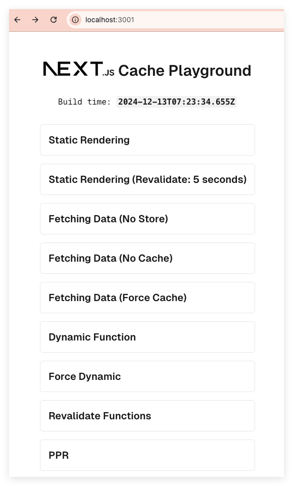
