在现代 Web 项目开发中，环境变量的使用贯穿项目的全生命周期，从本地开发环境的配置到生产环境的部署，无一例外。尤其是在使用 Next.js 这样的全栈框架时，环境变量的管理显得尤为重要——不仅需要满足服务端的复杂需求，还需兼顾客户端的安全性与灵活性。本文将从项目实际应用的角度出发，详细探讨如何在 Next.js 中高效管理和使用环境变量、src 目录和自定义服务。

## 环境变量
本文就不过多的介绍什么是环境变量，如果不太了解也可以看看 「[环境变量：熟悉的陌生人](https://juejin.cn/post/7336812458646437951)」文章。

### Node.js 加载环境变量
Node.js 的核心 `process` 模块提供了属性 `env`，它提供进程启动时设置的所有环境变量。所以获取也很简单，如下图（红色框中的代码）：

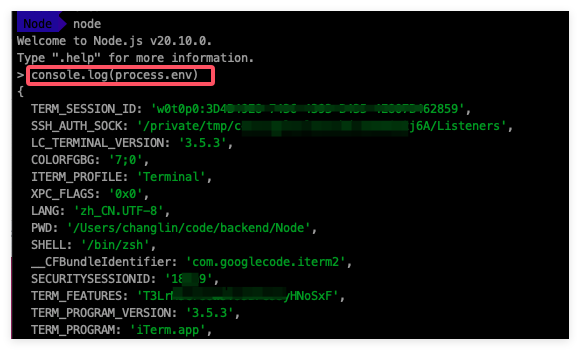

还可以在运行项目或单个文件的时候，设置单独的环境变量，比如：
- 在当前目录下创建一个 `main.js` 的文件，文件中就只是打印 `ENV` 这个环境变量。
  ```js
  console.log(process.env.ENV);
  ```

- 运行时根据不同的值获取到的结果如下：

  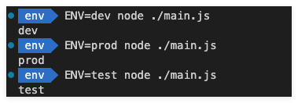


### Next.js 中使用环境变量

Next.js 内置了对环境变量的支持，因为 Next.js 是一个全栈框架，所以就区分了服务端环境变量和客户端环境变量；使用环境变量有两种方式：

- 通过 `.env` 文件加载环境变量
- 通过 `NEXT_PUBLIC_` 前缀在浏览器中获取环境变量

在进入正式的内容之前，我们先来准备一下相关的环境，创建一个项目便于演示后面的内容。使用命令 `npx create-next-app@latest --use-pnpm` 创建一个新的项目；具体的项目配置选项如下：

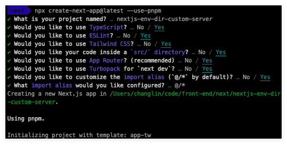

然后使用自己熟悉的开发者工具打开项目，这里我就使用 VS Code 打开，如下：
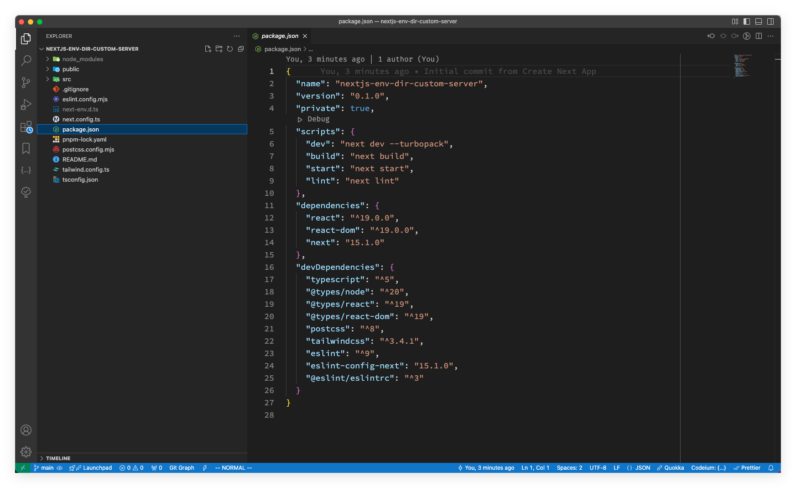

#### `.env` 文件中加载环境变量

Next.js 内置支持从 `.env` 文件加载环境变量到 `process.env` 中的这个过程。我们在项目根目录下建立一个 `.env` 文件（注意是根目录，不是 `/src` 目录）
```txt
DB_HOST=localhost
DB_USER=myuser
DB_PASS=mypassword
```

现在就可以在服务端组件或者路由处理程序中通过 `process.env` 获取到该值：
- 路由处理程序
  ```js
  // src/app/api/route.js
  export async function GET () {
      const dbConfig = {
          host: process.env.DB_HOST,
          username: process.env.DB_USER,
          password: process.env.DB_PASS,
      }
  
      console.log('db config:', dbConfig);
  }
  ```
  在浏览器中请求 `http://localhost:3000/api` 后，效果如下图：
  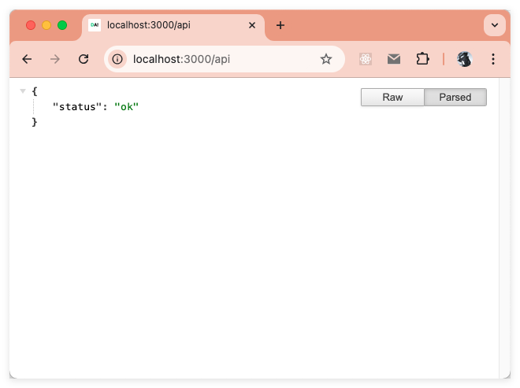
  请求后就能看到终端打印的环境变量的结果（终端中的第一行）：
  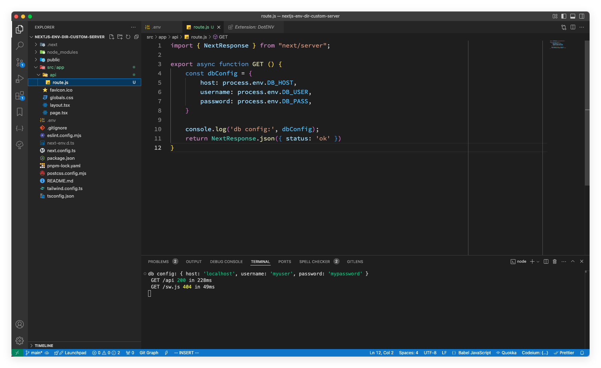

- 服务端组件

  这里就直接在 `/app` 目录下的 `page.tsx` 中来演示，代码如下：
  ```ts
  console.log('process.env.DB_HOST', process.env.DB_HOST);
  console.log('process.env.DB_USER', process.env.DB_USER);
  console.log('process.env.DB_PASS', process.env.DB_PASS);
  ```
  在浏览器访问 `http://localhost:3000/` 后，终端打印效果如下：

  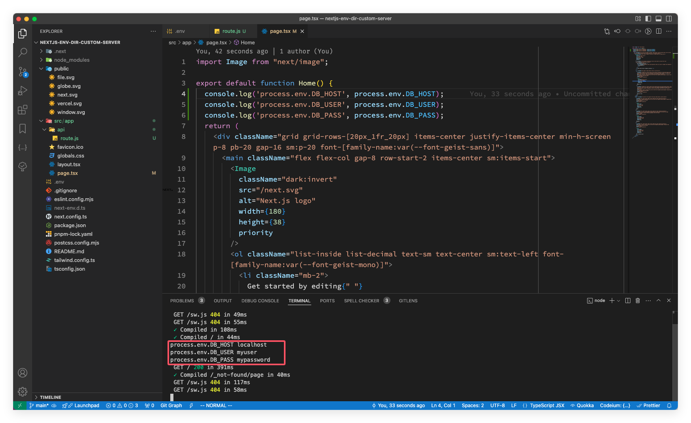

> 如果 `.env` 文件不足以满足你的要求，Next.js 为了兼容其各场景的灵活性，提供了 [@next/env](https://www.npmjs.com/package/@next/env) 包来扩展！

### 引用其他环境变量

Next.js 会自动展开在 `.env*` 文件中使用 `$` 引用的变量。例如， `$VARIABLE` 可以引用其他变量的值。比如下面：
```env
// .env
USERNAME=myuser
DB_HOST=localhost
DB_USER=$USERNAME
DB_PASS=mypassword
TWITTER_USER=$USERNAME
TWITTER_URL=https://x.com/$USERNAME
```
> 如果你将上面的 `USERNAME` 换成 `USER`，可能会发现程序中拿到的并不是 `.env` 文件中定义的，原因后面再说！

在路由处理程序中测试一下读取的内容：
```ts
import { NextResponse } from "next/server";

export async function GET () {
    const dbConfig = {
        host: process.env.DB_HOST,
        username: process.env.DB_USER,
        password: process.env.DB_PASS,
        twitter: process.env.TWITTER_URL
    }

    console.log('db config:', dbConfig);
    return NextResponse.json({ status: 'ok' })
}
```
请求 `http://localhost:3000/api` 后读取到的内容如下：
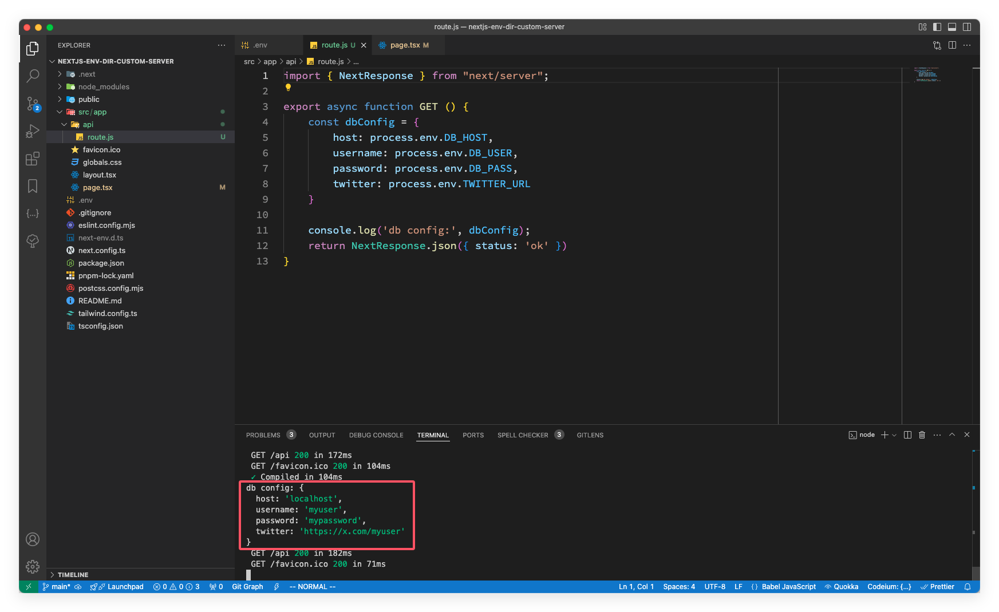

### 浏览器中获取环境变量
Next.js 是一个全栈框架，自然也考虑到了浏览器环境的时候如何获取环境变量，也没有过多的文件配置，就是使用 `NEXT_PUBLIC_` 为前缀的环境变量就是浏览器环境中可以使用的。

>  **为什么要加前缀呢？**
>
>  是因为 Next.js 为了让浏览器可以获取环境变量中的值，在构建的时候，将值内联到客户端的 js bundle 中，替换掉所有硬编码使用 `process.env.[variable]` 的地方。

实操一下；在 `.env` 文件中添加 `NEXT_PUBLIC_ANALYTICS_ID=abcdefghijk` 然后在客户端组件中使用，客户端代码如下：
```jsx
// src/app/components/client.tsx
'use client'

import React from 'react'

export default function Client() {
    console.log('NEXT_PUBLIC_ANALYTICS_ID: ', process.env.NEXT_PUBLIC_ANALYTICS_ID);
    return (
        <div>this is Client Component</div>
    )
}
```
在 `/app/page.tsx` 中引入 `<Client />` 组件，接着就运行 `pnpm build` 构建项目，构建完成之后使用命令 `pnpm start` 启动构建后的产物，如下：

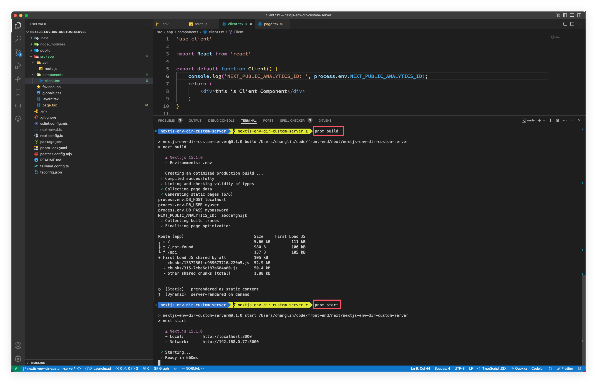

启动之后，根据终端的信息，在浏览器中访问，看看是否打印了我们想要的环境变量：

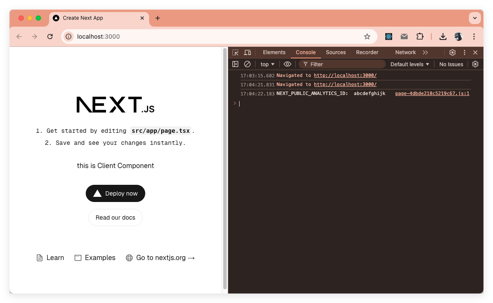

从上面的图中可以看出，是打印出我们在客户端组件中获取的环境变量。但要注意！**动态查找的值是不会被内联**，比如：
```js
// 使用了变量，不会被内联，不会生效
const varName = 'NEXT_PUBLIC_ANALYTICS_ID'
setupAnalyticsService(process.env[varName])
 
// 使用了变量，不会被内联，不会生效
const env = process.env
setupAnalyticsService(env.NEXT_PUBLIC_ANALYTICS_ID)
```

### 默认环境变量

在开发过程中，通常一个 `.env` 文件就够用了。但有时候你可能还需要针对不同的环境去加载不同的配置，比如：开发环境（`.env.development`）、生产环境（`.env.production`）、所有环境（`.env`）

如果均未在 `.env` 相关文件中配置环境变量，当执行 `next dev` 的时候，Next.js 会自动给 `NODE_DEV` 赋值 `development`，其他命令则会赋值 `production`。

> 需要注意的是 NODE_ENV 的值：只允许值为 `production`、`development` 和 `test`。

在项目开发过程中一定要谨慎 `.env` 的相关文件，尽可能将 `.env` 相关文件添加到 `.gitignore` 文件中，因为这些都是机密信息。

### 测试环境的环境变量

有了开发环境和生产环境外，Next.js还第三个选项——**测试环境**；测试环境用于在使用测试工具如 Jest 或 Cypress 时，设置特定的环境变量。要配置测试环境，只需创建一个名为 `.env.test` 的文件，该文件中的值将在测试环境中使用。

需要注意的是，测试环境不会加载 `.env.local` 中的值。这是为了确保每个人都能产生相同的测试结果。这些默认值将在 `NODE_ENV` 设置为 `test` 时使用。

### 环境变量加载顺序
按顺序在以下位置查找环境变量，一旦找到变量就停止。

- `process.env`

- `.env.$(NODE_ENV).local`
- `.env.local`（当 `NODE_ENV` 是 `test` 的时候不会查找）
- `.env.$(NODE_ENV)`
- `.env`

举个例子来辅助理解，如果你在 `.env.development.local` 和 `.env` 中设置了 `NODE_ENV` 为 `development`，按照这个顺序，最终会使用 `.env.development.local` 中的值

## src 目录

本系列的文章中所使用的演示案例基本上都是基于 src 目录去做的，如果没有用 `src/` 目录应该怎么将其改造成 `src/` 目录的结构呢？将 `app/` 下或者 `pages/` 下的文件移动到 `src/app` 或 `src/pages` 即可，比如下图：


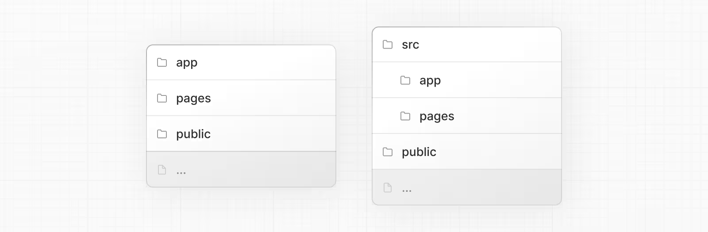

调整的时候注意：
- `/public` 目录继续放在项目根目录

- 配置文件（如 `package.json`、`next.config.js`、`tsconfig.json`）继续放在项目根目录
- 环境变量文件（如 `.env.*`）继续放在项目根目录
- 如果根目录下存在 `app` 或 `pages` 目录，则 `src/app` 或 `src/pages` 会被忽略
- 如果使用 `src` 目录，则可能需要移动其他应用文件夹，如 `/components` 或 `/lib`
- 如果使用中间件，确保将其放在 `src` 目录下
- 如果使用 Tailwind CSS，请修改 `tailwind.config.js` 中的 `content` 配置项，添加 `./src/` 前缀

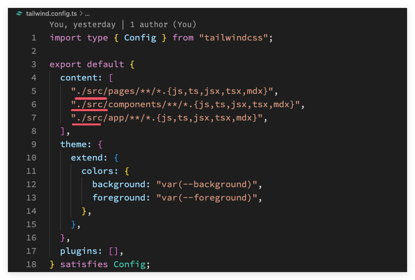

## 自定义服务

Next.js 默认包含自己的服务，当你运行 `next start` 命令时就会启动这个服务。在大部分情况下，也不需要我们自定义服务，Next.js 官方在文档中说了，只有当 Next.js 内置的路由器无法满足你的应用需求时，才应该使用自定义服务器。自定义服务器会移除一些重要的性能优化，比如：[自动静态优化](https://nextjs.org/docs/pages/building-your-application/rendering/automatic-static-optimization)、自定义服务器不能部署在 Vercel 上。

### 那些情况下才会自定义服务？

- 不需要 export 的场景。
- Next.js 集成路由器不能满足情况时。
- 需要对 Next.js 服务实现更多的控制。
- 需要为开发和生产版本进行更复杂的设置。
- 需要在启动 Node.js 服务的时候进行性能监控时。

### 改造上面的示例

这里改造可以使用读者熟悉的 Node.js 中的方案，这里就直接使用标准库的 http 包来改造！现在项目的根目录（是根目录不是 src 目录）创建一个 server.ts 的文件，然后写下如下代码：
```ts
import { createServer } from 'http'
import { parse } from 'url'
import next from 'next'

const port = parseInt(process.env.PORT || '3000', 10)
const dev = process.env.NODE_ENV !== 'production'
const env = dev ? 'development' : process.env.NODE_ENV
const app = next({ dev })
const handle = app.getRequestHandler()

app.prepare().then(() => {
    createServer((req, res) => {
        const parsedUrl = parse(req.url!, true)
        handle(req, res, parsedUrl)
    }).listen(port)

    console.log(`> Server listening at http://localhost:${port} as ${env}`)
})
```
> server.js 文件不会经过 Next.js 编译器或打包。因此，要注意使用的语法宿 Node.js 版本的兼容。

#### 开发阶段的配置调整

既然是自定义服务，那启动服务的脚本肯定也要调整，Next.js 的服务默认是自带热加载的，我们调整之后总不能每修改一点代码就重新运行一下命令重启服务吧！那我们就要自己实现热加载，可以使用 [nodemon](https://www.npmjs.com/package/nodemon) 来解决这个问题，首先安装 nodemon ：
```sh
pnpm add -D nodemon
```
安装完 nodemon 之后，就在项目的根目录创建一个 nodemon.json 文件，这个配置文件告诉 nodemon 监视 server.ts 文件，当它发生变化时，使用 `ts-node` 来执行这个文件，并使用 `tsconfig.server.json` 作为 TypeScript 配置文件。写入如下内容：
```json
{
    "watch": [
        "server.ts"
    ],
    "exec": "ts-node --project tsconfig.server.json server.ts",
    "ext": "js ts"
}
```
在项目根目录创建 `tsconfig.server.json` 文件，具体配置如下：
```json
{
    "extends": "./tsconfig.json",
    "compilerOptions": {
        "module": "commonjs",
        "outDir": "dist",
        "lib": [
            "es2019"
        ],
        "target": "es2019",
        "isolatedModules": false,
        "noEmit": false
    },
    "include": [
        "./server.ts"
    ]
}
```
最后就来调整启动命令：
```json
// ...other config

"dev": "nodemon",

// ...other config
```
我们来看看最后的效果：

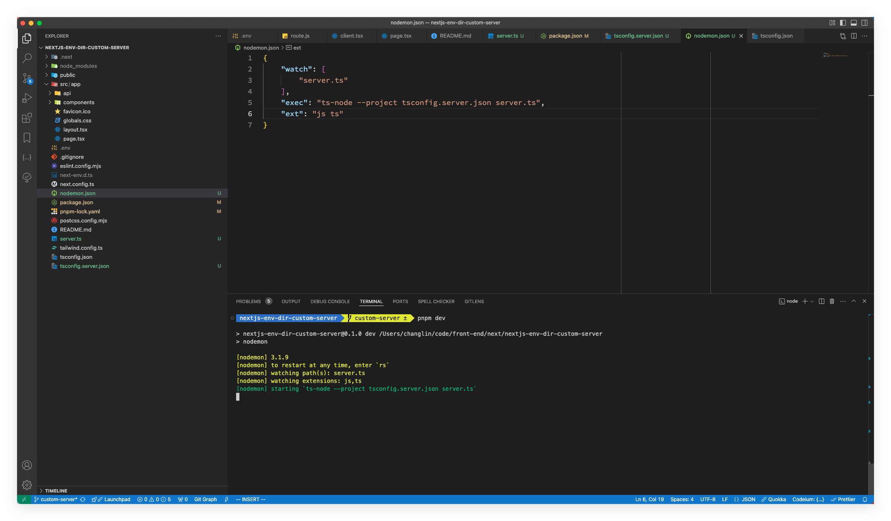

浏览器访问 `http://localhost:3000` ：

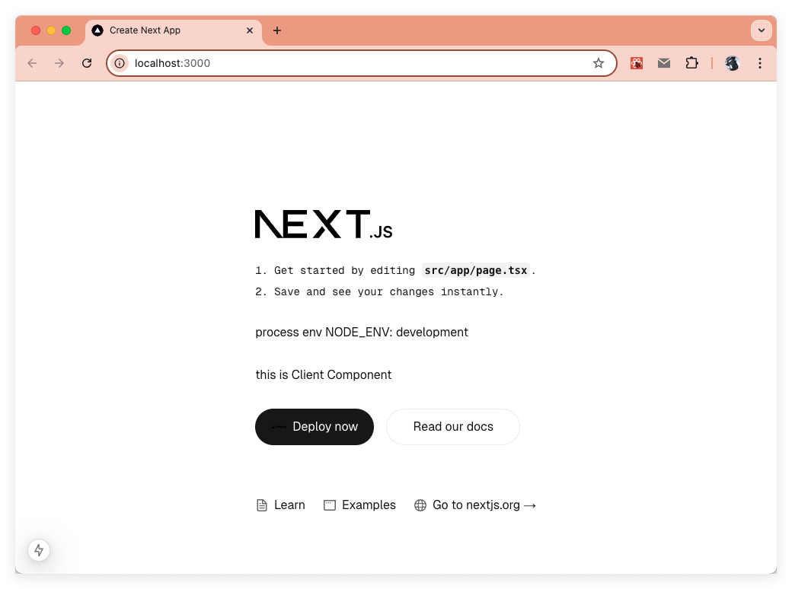

#### 构建阶段的配置调整
开发环境的配置构建好了，但是构建阶段的配置还没有调整，我们开发最后肯定是要上线项目的，有不是只在本地开发着玩的，接下来看看怎么配置？

在开发阶段已经把 tsconfig 配置好了，构建阶段也是一样的，所以我们接下来调整一下 package.json 中原来的构建命令和启动生产服务的 start 命令，在启动生产服务的时候需要设置环境变量，为了兼容各个系统的兼容性，这里使用 `cross-env` 库来处理；既然实在生产阶段用，那就先安装 cross-env：
```sh
pnpm add cross-env
```
安装完成之后，我们就来设置 package.json 中的 `scripts` ：
```json
"build": "next build && tsc --project tsconfig.server.json",
"start": "cross-env NODE_ENV=production node dist/server.js"
```
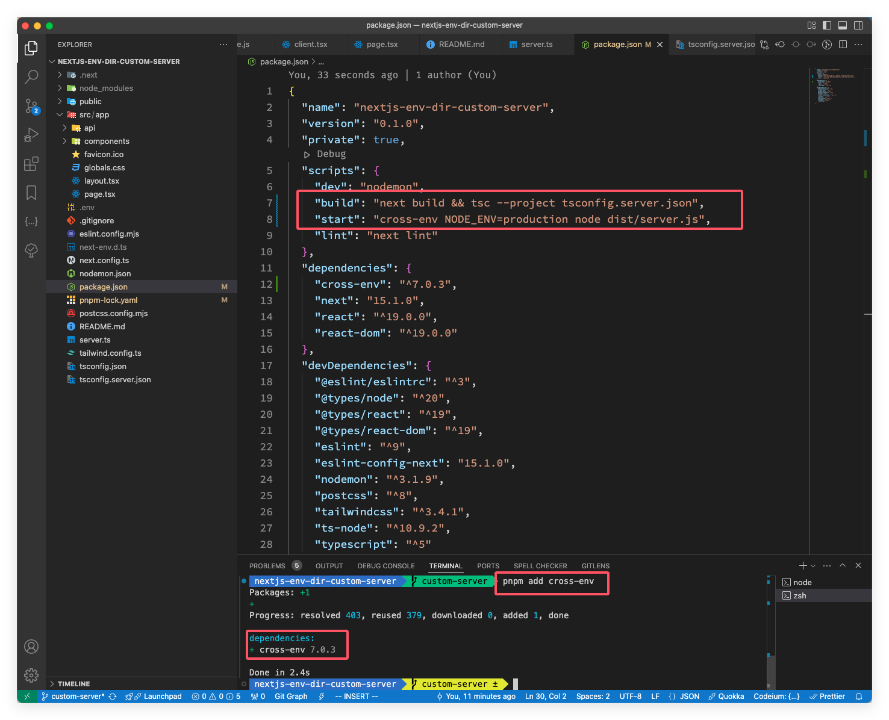

修改完命令之后，使用 `pnpm build` 命令看看构建效果，感觉一切都很顺利，结果：

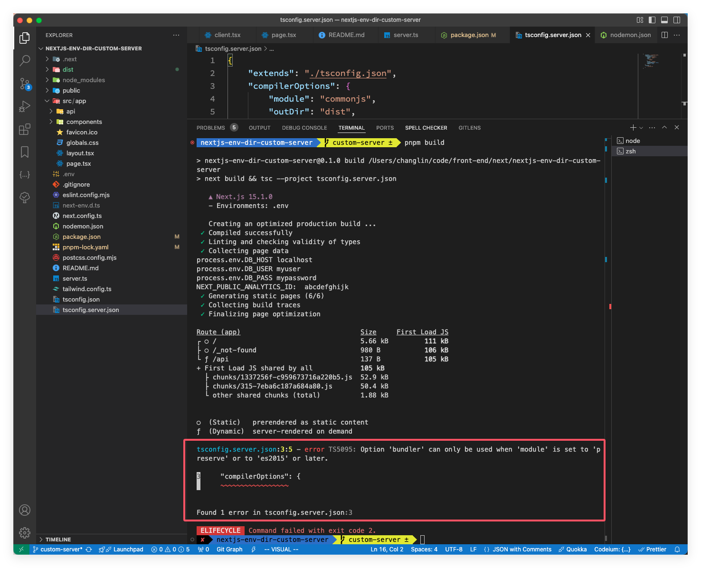

从上图的报错信息可以看出是 tsconfig.server.json 文件出了问题，根据提示信息可以看出是 `moduleResolution` 配置的问题，但是在 tsconfig.server.json 文件并没有配置，而是直接继承的 tsconfig.json 文件的配置，尝试将 `moduleResolution` 改为 "node" 后再次运行构建命令 `pnpm build`：

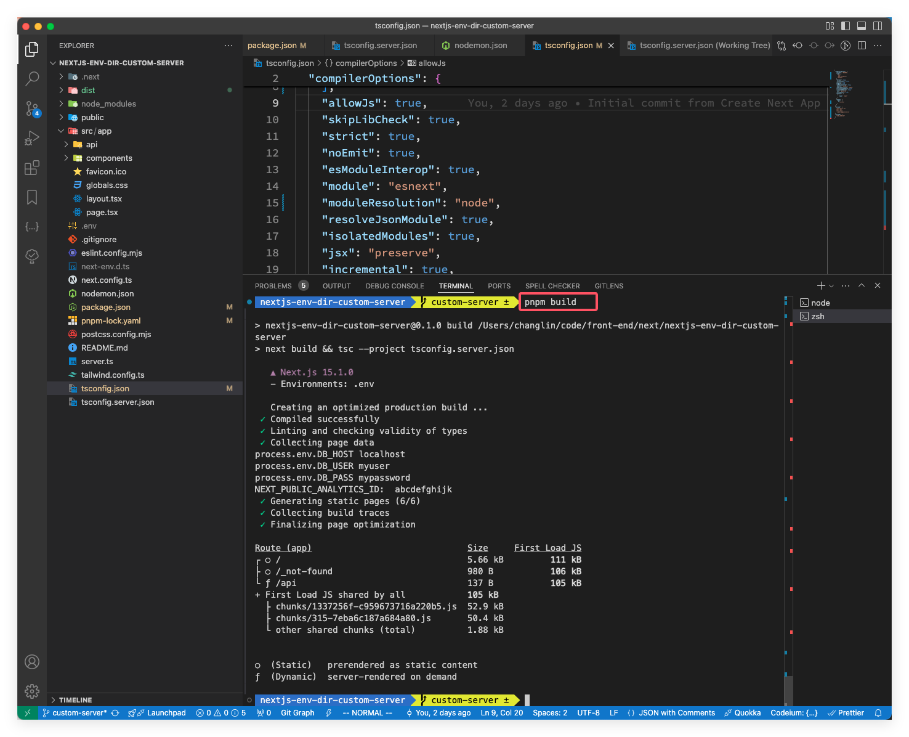

然后在终端中启动生产服务后浏览器访问：

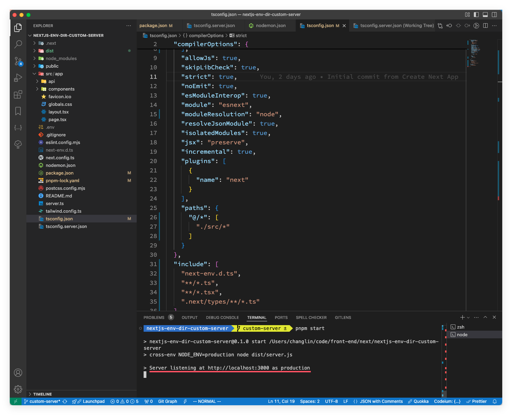

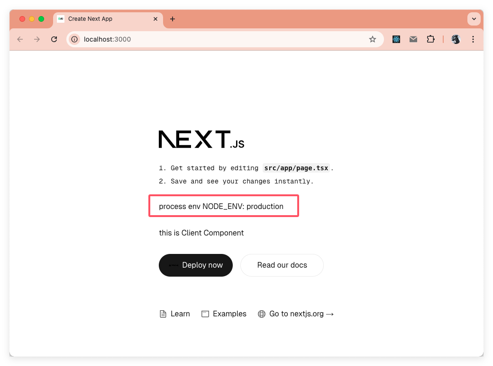

至此，开发阶段和构建阶段的配置都好了。本模块的代码可以 [https://github.com/clin211/next-awesome/tree/custom-server](https://github.com/clin211/next-awesome/tree/custom-server) 中找到。

## 总结

本文一共演示了三大块内容—— 环境变量、src 目录的迁移和自定义服务，除了 src 目录的迁移外，都有相关的代码及演示图片，代码也上传到 GitHub 中了，文中有表达或者逻辑上的问题，欢迎大家留言讨论，谢谢！

**「参考资源」**
- [Environment Variables](https://nextjs.org/docs/app/building-your-application/configuring/environment-variables#bundling-environment-variables-for-the-browser)：https://nextjs.org/docs/app/building-your-application/configuring/environment-variables#bundling-environment-variables-for-the-browser
- [src Directory](https://nextjs.org/docs/app/building-your-application/configuring/src-directory)：https://nextjs.org/docs/app/building-your-application/configuring/src-directory
- [Project structure and organization](https://nextjs.org/docs/app/getting-started/project-structure)：https://nextjs.org/docs/app/getting-started/project-structure
- [Custom Server](https://nextjs.org/docs/app/building-your-application/configuring/custom-server)：https://nextjs.org/docs/app/building-your-application/configuring/custom-server