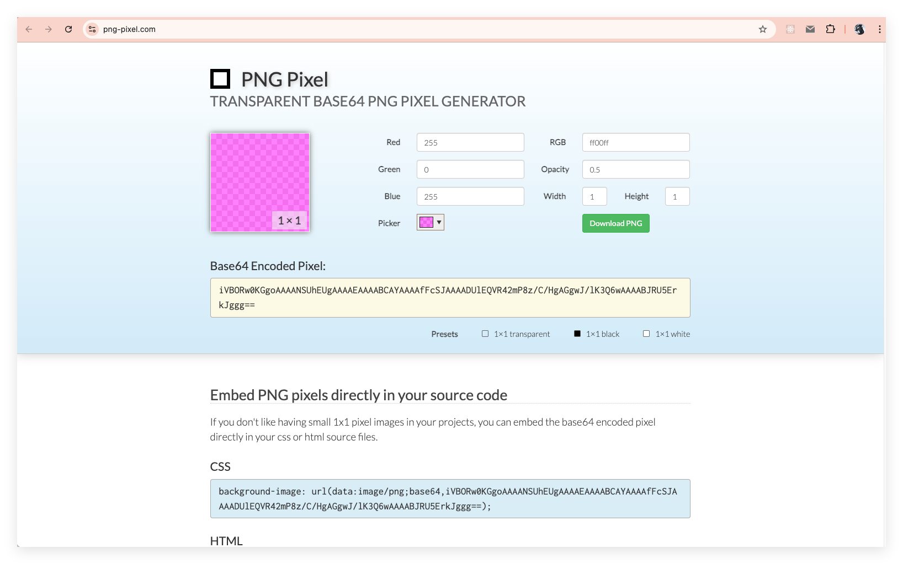
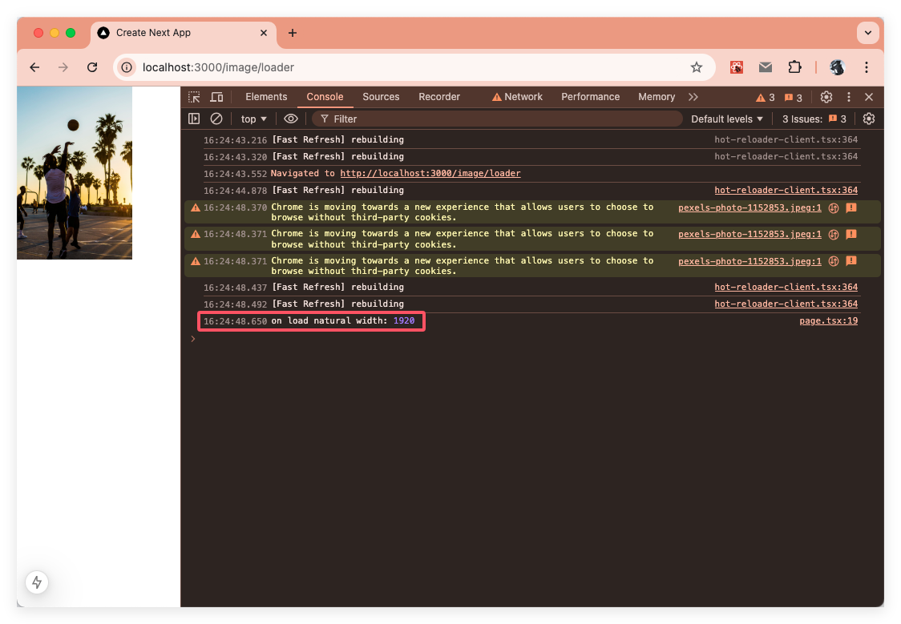
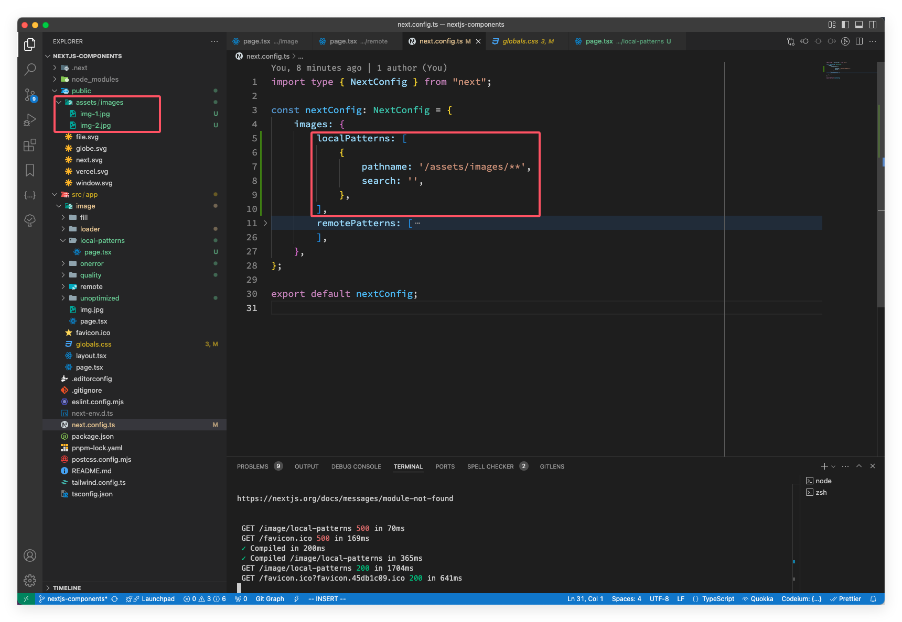

在现代开发中，组件是构建任何应用的基石；灵活的构建模块不仅定义了用户界面的各个部分，还负责管理状态、处理业务逻辑，并与外部数据源交互。组件在 Next.js 中扮演着至关重要的角色，它们是 React 哲学的直接体现——将复杂的 UI 分解成更小、更易于管理的部分。

在 Next.js 中，有五个基础组件——`<Form>`、`<Image>`、`<Link>`、`<Script>` 和 `Font`。它们都是 Next.js 基于原生 HTML 标签做了诸多优化后封装的组件，在开发的时候尽可能的使用这些组件。本篇文章就重点看看 `<Image>` 组件。

在进入正式的内容之前，我们先来准备一下相关的环境，创建一个项目便于演示后面的内容。
> **文中示例的开发环境：**
> - node.js v20.10.0
> - pnpm v8.12.1
> - vs vode v1.96.2
> - chrome v131.0.6778.140
> - next.js v15.1.2
> - react.js v19.0.0

使用命令 `npx create-next-app@latest --use-pnpm` 创建一个新的项目；具体的项目配置选项如下：


在 VS Code 打开后运行 `pnpm dev` 后，在浏览器中效果如下：


`<Image>` 组件是 Next.js 基于原生 HTML `` 元素做了一些优化实现的：
- 尺寸优化: 自动为每个设备提供正确尺寸的图片，使用现代图片格式如 WebP 和 AVIF。
- 视觉稳定性: 自动防止图片加载时的布局偏移。
- 更快的页面加载: 图片仅在进入视口时加载，使用原生浏览器懒加载，带有可选的模糊占位符。
- 静态资源配置灵活性: 按需图片缩放，即使是远程服务器上的图片。

> 官方也 [YouTube](https://youtu.be/IU_qq_c_lKA) 上提供了相应的视频介绍，如果网络允许的话可以看看。

## 基础使用
Image 组件的使用姿势跟原生 HTML img 元素的使用差不多，如下：

```jsx
import Image from 'next/image'

export default function Page() {
    return (
        <Image
            src="/profile.png"
            width={500}
            height={500}
            alt="Picture of the author"
        />
    )
}
```

### 所有的 Props

Next.js 的 Image 组件是对原生 HTML 的 img 元素做了很多优化，也扩展了不少属性，下面就是所有的属性：

| Prop            | 示例                             | 类型            | 是否必须 |
| --------------- | -------------------------------- | --------------- | -------- |
| **src**         | src="/profile.png"               | String          | 是       |
| **width**       | width={500}                      | Integer (px)    | 是       |
| **height**      | height={500}                     | Integer (px)    | 是       |
| **alt**         | alt="Picture of the author"      | String          | 是       |
| **loader**      | loader={imageLoader}             | Function        | -        |
| **fill**        | fill={true}                      | Boolean         | -        |
| **sizes**       | sizes="(max-width: 768px) 100vw" | String          | -        |
| **quality**     | quality={80}                     | Integer (1-100) | -        |
| **priority**    | priority={true}                  | Boolean         | -        |
| **placeholder** | placeholder="blur"               | String          | -        |
| **style**       | style={{objectFit: "contain"}}   | Object          | -        |
| **onLoad**      | onLoad={event => done())}        | Function        | -        |
| **onError**     | onError(event => fail()}         | Function        | -        |
| **loading**     | loading="lazy"                   | String          | -        |
| **blurDataURL** | blurDataURL="data:image/jpeg..." | String          | -        |
| **overrideSrc** | overrideSrc="/seo.png"           | String          | -        |

下面我们就来一一看看这些组件！
### src 属性
src 属性是 `<Image>` 组件必须传入的一个属性，它支持一个静态导入的图片文件（本地文件）或者一个路径字符串（远程文件路径）。

本地导入如下：


```jsx
import Image from "next/image";
import img from "./img.jpg"

export default function page() {
    return (
        <div>
            <Image
                src={img}
                alt="Picture of the author"
                // width={500} automatically provided
                // height={500} automatically provided
                // blurDataURL="data:..." automatically provided
                // placeholder="blur" // Optional blur-up while loading
            />
        </div>
    );
}
```
要使用本地图像，就需要使用 `import` 关键字导入 `.jpg`、`.png` 或 `.webp` 的图像文件。Next.js 将根据导入的文件自动确定图像的固有宽度和高度。

如果是一个远程路径字符串，就需要提供 `width`、`height` 和可选的 `blurDataUrl` 属性，因为 Next.js 在构建时无法获取远程文件。使用方式如下：
```jsx
import Image from "next/image";

export default function page() {
    return (
        <div>
            <Image
                width={200}
                height={200}
                src="https://images.unsplash.com/photo-1733860532456-3e83dd0b1174"
                alt="Pars Sahin"
            />
        </div>
    );
}


```
当你根据写好上面这段代码后，去浏览器查看效果时，应该会惊奇的发现报错，如下图：


问题在报错信息中也有所提及，Next.js 要求在 `next.config.ts` 文件中定义支持的远程图片地址，这是为了防止一些恶意使用。配置方法如下：


```ts
images: {
    remotePatterns: [
        {
            protocol: 'https', // 协议
            hostname: 'images.unsplash.com', // 域名
            port: '', // 端口
            pathname: '/**', // 路径
            search: '', // 配置参数
        },
    ],
},
```
然后刷新浏览器就可以看到对应的效果啦！


> 如果还是有问题，可以重新运行下 Next.js 服务。关于静态资源的远程配置在后面的 `remotePatterns` 属性的时候在详细演示。

### width 属性
对于非静态导入图片或者图片有 `fill` 属性外的 `<Image>` 中，都必须有此属性；`width` 属性表示图片渲染的宽度，单位是 `px`。此属性用于推断图像的正确纵横比，避免加载期间布局偏移。它不会确定图像的渲染大小，渲染大小由 CSS 控制。

### height 属性
`height` 属性跟 `width` 属性差不多，也是对于非静态导入图片或者图片有 `fill` 属性外的 `<Image>` 中，都必须有此属性；`height` 属性表示图片渲染的高度，单位也是 `px`。此属性仍然用于推断图像的正确纵横比，避免加载期间布局偏移。它不会确定图像的渲染大小，渲染大小由 CSS 控制。

### alt 属性
`alt` 属性用于描述图片，提供给屏幕阅读器和搜索引擎使用。如果图片被禁用或者加载图片时出现错误，它会作为文本显示。

`alt` 属性应该使用在不改变页面含义的情况下替代图片的文本描述，不应该重复图片上方或下方标题中提供的信息。

如果图片纯粹是装饰或者不是给用户使用，那 alt 属性应该用一个空字符串表示（alt=""）。

### loader 属性
`loader` 属性是用于解析 `URL` 的自定义函数。函数接受 `src`、`width`、`quality` 三个参数，返回图片的 URL 字符串。使用姿势如下：
```jsx
'use client'

import Image, { ImageLoaderProps } from 'next/image'

const imageLoader = ({ src, width, quality }: ImageLoaderProps) => {
    return `https://images.pexels.com/photos/1152853/${src}?w=${width}&q=${quality || 75}`
}

export default function Page() {
    return (
        <Image
            loader={imageLoader}
            src="pexels-photo-1152853.jpeg"
            alt="Picture of the author"
            width={1260}
            height={750}
            className='w-36'
        />
    )
}
```
效果如下：


> 由于 `loader` 属性传入的是一个函数，所以需要使用客户端组件，在这个例子中，顶部也是用的 `'use client'`。

可能你也发现了，如果项目中使用图片的地方都添加一个 loader 属性，工程量肯定很大，Next.js 也意识到了这个这个，可以在 `next.config.js` 文件中的 `loaderFile` 配置项来配置项目中的 `next/image` 示例。
```js
module.exports = {
    images: {
        loader: 'custom',
        loaderFile: './my/image/loader.js',
    },
}
```
关于这个配置，后面我们再介绍 `loaderFile` 属性的配置时再详细介绍！

### fill 属性
`fill` 属性表示是否将图片填充父元素。默认值为 `false`。当图片的 `width` 和 `height` 未知的时候很有用。

注意：使用 `fill` 时，父元素必须指定为 `position: "relative"` 或 `position: "fixed"` 或 `position: "absolute"`。而 `img` 元素会默认自动指定为 `position: "absolute"`。

默认情况下，`img` 元素将自动被分配该 `position: "absolute"` 样式。如果图片没有应用其他样式，图片会被拉伸以填充容器。

如果未对图片应用任何样式，图片将拉伸以适合容器。可设置 `object-fit: "contain"` 以适合容器并保留纵横比。或者 `object-fit: "cover"` 将导致图像填满整个容器并被裁剪以保持纵横比。

下面我们来看看这几个的区别：
```jsx
import Image from "next/image";

import img from "../img.jpg"

export default function page() {
    return (
        <main className='flex flex-wrap gap-4'>
            {/* 正常显示 */}
            <section>
                <div className='w-[200px] h-[200px] relative bg-gray-400'>
                    <Image src={img} alt="Picture of the author" />
                </div>
            </section>

            {/* 添加 fill属性后，自适应容器导致图片变形 */}
            <section>
                <div className='w-[200px] h-[200px] relative bg-gray-400'>
                    <Image fill src={img} alt="Picture of the author" />
                </div>
            </section>

            {/* 添加 fill属性后，自适应容器导致图片变形， 使用 CSS object-fit 的 contain 属性，图片在保持其宽高比的同时填充元素的整个内容框 */}
            <section>
                <div className='w-[200px] h-[200px] relative bg-gray-400'>
                    <Image fill src={img} alt="Picture of the author" className='object-contain' />
                </div>
            </section>

            {/* 添加 fill属性后，自适应容器导致图片变形， 使用 CSS object-fit 的 cover 属性，图片在保持其宽高比的同时填充元素的整个内容框。如果对象的宽高比与内容框超出，该对象将被剪裁以适应内容框 */}
            <section>
                <div className='w-[200px] h-[200px] relative bg-gray-400'>
                    <Image fill src={img} alt="Picture of the author" className='object-cover' />
                </div>
            </section>
        </main>
    )
}
```
效果：


### sizes 属性

在 HTML 5.1 新增加了 img 元素的 [srcset](https://developer.mozilla.org/zh-CN/docs/Web/HTML/Element/img#srcset)、[sizes](https://developer.mozilla.org/zh-CN/docs/Web/HTML/Element/img#sizes) 属性，用于设置响应式图像。

`sizes` 属性就是一组媒体查询条件，告诉浏览器，什么样的条件使用什么样的图片。一个使用示例如下：

sizes 属性对于图片性能有两个重要的作用：

`sizes`属性与图像性能相关，具有两个重要用途：
- `sizes` 的值被浏览器用来确定从 `next/image` 自动生成的 `srcset` 中下载哪个尺寸的图像。当浏览器进行选择时，它还不知道页面上图像的大小，因此它会选取一个与视口大小相同或更大的图像。`sizes` 属性允许你告诉浏览器，实际的图像会比全屏小。如果你没有在具有 `fill` 属性的图像中指定 `sizes` 值，那么会使用默认值 100vw（全屏宽度）。

- `sizes` 属性改变了自动生成的 `srcset` 值的行为。如果没有 `sizes` 值，会生成一个小的 `srcset`，适合固定尺寸的图像（1x/2x/等）。如果定义了 `sizes`，会生成一个大的 `srcset`，适合响应式图像（640w/750w/等）。如果 `sizes` 属性包括像50vw这样的尺寸，代表视口宽度的百分比，那么 `srcset` 会被修剪，不包括任何太小而永远不必要的值。

### quality 属性

`quality` 属性表示优化图片的质量，值为 1 到 100 之间的整数，100 表示最好的品质，也是最大的文件大小。默认是 75。使用也很简单，比如：

```jsx
import Image from "next/image";

export default function page() {
    return (
        <div>
            <Image
                width={200}
                height={200}
                quality={75}
                src="https://images.unsplash.com/photo-1733860532456-3e83dd0b1174"
                alt="Pars Sahin"
            />
        </div>
    );
}
```

### priority 属性
`priority` 表示图片加载优先级，布尔类型，默认值为 `false`。当值为 `true` 时表示高优先级并预加载。使用 `priority` 的图片会自动禁用懒加载。
```js
priority={false} // {false} | {true}
```
如果同时使用了 `loading` 属性并设置为 `lazy`，则不能使用 `priority` 属性。`loading` 属性仅适用于高级用例。当需要优先级时，应移除 `loading` 属性。

是这个 `priority` 属性有两个建议：
1. 在首屏第一屏展示的图片上使用。
2. 在 [最大内容绘制（Largest Contentful Paint，LCP）](https://nextjs.org/learn-pages-router/seo/web-performance/lcp) 图片元素上使用。

运行 `next dev` 的时候，如果 LCP 元素是一个图片，且没有设置 `priority` 属性，控制台里会有警告：


处理方式也很简单，就是在 Image 组件上添加 `priority` 属性，如下：
```jsx
import Image from "next/image";

export default function page() {
    return (
        <div>
            <Image
                priority
                width={500}
                height={500}
                quality={75}
                src="https://images.unsplash.com/photo-1733860532456-3e83dd0b1174"
                alt="Pars Sahin"
            />
        </div>
    );
}
```

### placeholder 属性

`placeholder` 属性表示加载图片时的占位符。可选值为 `blur`、`empty`、 `data:image/...` ，默认值是 `empty`。

```jsx
placeholder = 'empty' // "empty" | "blur" | "data:image/..."
```
当 `placeholder` 属性的值为 `empty` 的时候，加载不会有占位符，只有空白区域。

当 `placeholder` 属性的值为 `data:image/...` 的时候，使用 `Data URL` 作为图片加载时的占位图片。`Data URL`，即前缀为 `data:` 协议的 `URL`，允许内容创建者向文档中嵌入小文件。比如 `base64` 图片就是 `Data URL`。

当值为 `blur` 的时候，`blurDataURL` 属性的值会被用于作为占位符图片。如果图片是静态导入的，并且导入的图片为 `.jpg`、`.png`、`.webp` 或 `.avif` ，`blurDataURL` 会自动生成，但动态图片除外。如果是动态图片，必须提供 `blurDataURL` 属性。

> Next.js 官方提供了一个 [placeholder](https://image-component.nextjs.gallery/placeholder) 的示例，可以前去体验一下，如果你的网络很好可能感受不到，可以将 network 调为 `3G` 或者 `Slow 4G`。

### blurDataURL

因为这个属性跟 placeholder 强相关，所以就挨着介绍。`blurDataURL` 只有在设置了 `placeholder="blur"` 的时候， `blurDataURL` 才会生效；而且必须是 base64 编码的图片。图片会被放大并模糊，建议使用一个非常小的图片（10px 或者更小，太大可能存在性能问题）。可以访问 Next.js 官方提供的 [blurDataURL](https://image-component.nextjs.gallery/placeholder) 演示示例。源码可以访问 [https://github.com/vercel/next.js/blob/canary/examples/image-component](https://github.com/vercel/next.js/blob/canary/examples/image-component)!

还可以可以借助 [https://png-pixel.com](https://png-pixel.com) 快速获得一个纯色图片的 Data URL。如下：



### style 属性

这个属性，我们肯定很熟悉，是用来设置图片样式的属性。

```jsx
import Image from "next/image";

const imageStyle: React.CSSProperties = {
    borderRadius: '50%',
    border: '1px solid #fff',
}

export default function ProfileImage() {
    return <Image src="..." style={imageStyle} />
}
```
> 注意！！！`<Image>` 的 `width`（宽度）和 `height`（高度）属性可能会与你的样式设置相互作用。如果你使用样式来修改图像的宽度，也应该将其高度设置为自动（`auto`）以保持其固有的纵横比，否则图像的最终效果将会被扭曲变形。

### onLoad 属性

> `onLoadingComplete` 从 Next.js 14 就被 `onLoad` 替代！

`onLoad` 属性是图片加载完成时执行的的一个回调，该回调函数可能会在占位符被删除以及图片被完全解码前执行。这个回调函数只会调用一次，并且会带有一个 Event 参数，该事件有一个指向底层 `` 元素的目标（target）。

```jsx
'use client'

import Image, { ImageLoaderProps } from 'next/image'

const imageLoader = ({ src, width, quality }: ImageLoaderProps) => {
    return `https://images.pexels.com/photos/1152853/${src}?w=${width}&q=${quality || 75}`
}

export default function Page() {
    return (
        <Image
            loader={imageLoader}
            src="pexels-photo-1152853.jpeg"
            alt="Picture of the author"
            width={1260}
            height={750}
            className='w-36'
            priority
            onLoad={e => console.log('on load natural width:', e.currentTarget.naturalWidth)}
        />
    )
}
```

效果如下：



> 注意：因为组件接收一个函数作为参数，需要使用客户端组件。

### onError 属性

顾名思义，onError 属性就是图片加载失败时执行的回调函数。我们也来尝试一下，将上面示例代码的 `src` 修改成一个不存在的资源，然后再看下 onError 中回调的内容：
```jsx
'use client'

import Image, { ImageLoaderProps } from 'next/image'

const imageLoader = ({ src, width, quality }: ImageLoaderProps) => {
    return `https://images.pexels.com/photos/1152853/${src}?w=${width}&q=${quality || 75}`
}

export default function Page() {
    return (
        <Image
            loader={imageLoader}
            src="pexels-photo-115285311.jpeg" // 有效地址 pexels-photo-1152853.jpeg
            alt="Picture of the author"
            width={1260}
            height={750}
            className='w-36'
            priority
            onError={e => console.log('on error event:', e)}
        />
    )
}
```
效果如下：


### loading 属性

`loading` 是用来设置图片的加载行为的，默认值是 `lazy`，也就是图片会延迟加载，直到图片接近视口时；它的有效值除了 `lazy` 外，还有 `eager`，也就是立即加载，但是使用 `eager` 会导致一些性能问题。Next.js 更推荐 `priority` 属性来代替 `eager`。使用姿势如下：
```jsx
loading = 'lazy' // lazy or eager
```

### unoptimized 属性
这个属性是用来取消 Next.js 对图片的优化。如果设置 `unoptimized={true}` 时，将使用源图片，不会更改质量、大小和格式。默认值是 `false`。

> 这对于无法从优化中受益的图像（例如小图像（小于 1KB）、矢量图像（SVG）或动画图像（GIF））很有用。

```jsx
import Image, { ImageProps } from 'next/image'

export default function UnoptimizedImage(props: ImageProps) {
    return <Image {...props} unoptimized />
}
```

从 Next.js 12.3.0 开始，可以通过 `next.config.ts` 设置所有的图片取消优化：
```ts
import type { NextConfig } from "next";

const nextConfig: NextConfig = {
    images: {
        unoptimized: true,
    },
};

export default nextConfig;
```

### overrideSrc 属性

当向 `<Image>` 组件提供 `src` 属性时，会自动为生成的 `` 元素生成 `srcset` 和 `src` 属性。比如：
```jsx
<Image src="/me.jpg" />
```
Next.js 实际产出的结构：
```html

```

如果你不想使用 `srcset` 属性的值，这个时候就可以使用 `overrideSrc` 属性来覆盖它。比如：
```jsx
<Image src="/me.jpg" overrideSrc="/override.jpg" />
```
输出后的结构：
```html

```
此属性的使用情况一般出于 SEO 的考虑。

###  decoding 属性
这是一个向浏览器提供的提示，表明是否应该在呈现其他内容更新之前等待图像解码完成。默认值为 `async`。

允许的值有：
- `async` 异步解码图像，并允许在图像完全解码之前渲染其他内容。
- `sync` 同步解码图像，实现与其他内容互斥的原子渲染。
- `auto` 不指定解码方式，由浏览器决定哪一种对用户来说是最合适的。

## 配置选项

除了属性（props）之外，还可以配置 `next.config.ts` 中的 `<Image>` 组件。以下是可用的配置选项：

### localPatterns

可以选择在 `next.config.ts` 文件中配置 `localPatterns`，以允许优化特定路径并阻止所有其他路径。



配置项如下：
```ts
localPatterns: [
    {
        pathname: '/assets/images/**',
        search: '',
    },
],
```

使用路径也必须是配置时的路径为前缀：


在浏览器中的效果如下：


### remotePatterns

这个属性在前面我们已经用过了，其主要目的是为了保护应用程序免受恶意用户的攻击，使用外部图像需要进行配置。这样可以确保只有来自你账户的外部图像才能通过 Next.js 图像优化API提供服务。这些外部图像可以在你的 `next.config.js` 文件中使用 `remotePatterns` 属性进行配置，如下所示：


配置之后，在项目中所有的 `<Image>` 组件的 `src` 属性的值必须是 `https://images.pexels.com/photos/` 或者 `https://images.unsplash.com` 为开头，如果出现其他的协议、主机名、端口或者不匹配的路径都会返回 400 错误。

当然如果是在一个主域名下的不同子域名上访问静态资源，也可以使用通配符的方式来配置，这样就避免每使用一个资源就要配置一次的情况，比如：
```js
remotePatterns: [
    {
        protocol: 'https',
        hostname: '**.example.com',
        port: '',
        search: '',
    },
],
```

根据这个配置示例，就是所有的 `<Image>` 组件的 `src` 属性的值必须是以 `https://xxx.example.com`、`https://xxx.xxx.example.com`、`https://xxx.xxx.xxx.example.com`等等的开头。

> `pathname` 和 `hostname` 都可以使用通配符，其中：
>
> - `*` 表示匹配单个路由段或者子域
> - `**` 表示匹配任意数量的路由段或者子域。

### domains
自 Next.js 14 起因为使用了更为严格的 `remotePatterns` 而废弃。仅当所有的内容都来自你所能控制的域的时候你再使用。

它的作用跟 `remotePatterns` 类似，`domains` 配置项提供了一个用于外部图片的 `hostname` 列表，比如：
```ts
images: {
    domains: ['assets.acme.com'],
},
```
但是注意 `domains` 不支持通配符，并且无法限制协议、端口或者路径名。Next.js 更推荐使用 `remotePatterns`。

### loaderFile

`loaderFile` 跟我们前面介绍的 `loader` 属性有关系，如果需要对 `<Image>` 的内置优化有特殊的要求或者不想使用 Next.js 内置的图片优化时，就可以在 `next.config.ts` 中使用 `loaderFile` 来配置。

配置项如下：
```ts
import type { NextConfig } from "next";

const nextConfig: NextConfig = {
    images: {
        loader: 'custom',
        loaderFile: './loader.ts',
    },
};

export default nextConfig;
```
`loaderFile` 必须指向相对于 Next.js 应用**根目录**的文件。该文件必须导出一个默认函数，该函数返回一个字符串。举个例子：

```ts
'use client'

import { ImageLoaderProps } from 'next/image'

export default function imageLoader({ src, width, quality }: ImageLoaderProps) {
    return `https://images.pexels.com/photos/1152853/${src}?w=${width}&q=${quality || 75}`
}
```
这会应用到所有的 `<Image>` 组件，如果你要修改个别图片，使用 `loader` 属性。如果你想使用云提供商来优化图片，而不是使用 Next.js 内置的图片优化 API，可以通过以下方式配置 next.config.js 来处理，具体可以参考 [example-loader-configuration
](https://nextjs.org/docs/app/api-reference/config/next-config-js/images#example-loader-configuration)

### deviceSizes

这个属性是在知道用户的设备宽度，就可以在 `next.config.ts` 中使用 `deviceSizes` 属性指定一系列设备宽度断点。这些宽度在 `next/image` 组件使用 `sizes` 属性时使用，以确保为用户的设备提供正确的图像。

如果没有配置，则默认值是：
```ts
import type { NextConfig } from "next";

const nextConfig: NextConfig = {
    images: {
        deviceSizes: [640, 750, 828, 1080, 1200, 1920, 2048, 3840],
    },
};

export default nextConfig;
```

### imageSizes

您可以在 `next.config.js` 文件中使用 `images.imageSizes` 属性指定一组图像宽度。这些宽度将与设备大小数组合并，形成用于生成图像 `srcset` 的完整大小数组。

如果没有配置，则默认值是：
```ts
import type { NextConfig } from "next";

const nextConfig: NextConfig = {
    images: {
        imageSizes: [16, 32, 48, 64, 96, 128, 256, 384],
    },
};

export default nextConfig;
```
`imageSize` 和 `deviceSizes` 两个属性都会影响图片生成最终的 `srcset` 尺寸：
如下图代码中使用 `sizes` 属性的配置：


浏览器中的查看最后生成的 scrset 就包含了 `deviceSizes` 和 `imageSizes` 配置的所有尺寸：


当你使用了 `sizes` 属性的时候，说明图片的宽度是小于全屏宽度的。`imagesSizes` 的中的所有值应该都小于 `deviceSizes` 中的最小值。

### formats

默认的图像优化 API 将通过请求中的 `Accept` 头部检测浏览器支持的图像格式，以确定最佳的输出格式。

如果 `Accept` 匹配多个配置的格式，将使用数组中的**第一个匹配项**。因此，数组的顺序很重要。如果没有匹配项（或源图像是动画），图像优化 API 将使用原始图像的格式。


如果没有配置，则默认值是：
```ts
import type { NextConfig } from "next";

const nextConfig: NextConfig = {
    images: {
        formats: ['image/webp'],
    },
};

export default nextConfig;
```
当然，你也可以配置其它格式的支持；比如 avif：
```js
import type { NextConfig } from "next";

const nextConfig: NextConfig = {
    images: {
        formats: ['image/avif', 'image/webp'],
    },
};

export default nextConfig;
```
> 需要注意的是：
> - AVIF 通常需要比 WebP 多 50% 的编码时间，但压缩率却比 WebP 小 20%。这意味着第一次请求图像时，速度可能会较慢，但随后的缓存请求会更快。
> - 如果您使用代理/CDN 在 Next.js 前端自托管，必须配置代理转发 Accept 头部。

### minimumCacheTTL
图片会根据请求动态优化并存储在 `<distDir>/cache/images` 目录。优化后的图像文件会被用于后续请求，直到缓存过期。当匹配到过期的文件时，过期图片会立刻失效，同时图片会在后台重新优化并使用新的失效日期储存在缓存中。

通过读取响应头中的 `x-nextjs-cache` 标头确定图片的缓存状态：
- `MISS` 路径不在缓存中（最多发生一次，在第一次访问时）
- `STALE` 路径在缓存中，但超过了重新验证时间，因此将在后台更新
- `HIT` 路径在缓存中，并且没有超过重新验证时间

过期时间可以通过两种方式定义：
- 一种是通过 `minimumCacheTTL` 配置项。
- 一种通过 `Cache-Control` 标头。

具体使用而言，使用 `Cache-Control` 标头的 `max-age` 字段。如果 `s-maxage` 和 `max-age` 都有，`s-maxage` 优先。两种方法如果同时设置，以较大者为准。

`minimumCacheTTL` 配置项用来设置**缓存优化图片的过期时间，它以秒为单位**。当上游图像不包含 `Cache-Control` 头部或值很低时。 还可以配置 `deviceSizes` 和 `imageSizes` 来减少可能生成的图像数量。 使用示例如下：
```js
import type { NextConfig } from "next";

const nextConfig: NextConfig = {
    images: {
        minimumCacheTTL: 60,
    },
};

export default nextConfig;
```
如果你需要更改每张图片的缓存行为，你可以通过 `headers` 配置图片资源的 `Cache-Control`标头。

大部分时候，建议使用静态图片导入，它会自动对文件内容进行哈希处理，并使用 `immutable` 的 `Cache-Control` 标头。

目前还没有重新验证缓存的机制，所以最好将 `minimumCacheTTL` 的值设低一点、否则你可能需要手动修改 `src` 属性或者删除 `<distDir>/cache/images` 来更新缓存。

### disableStaticImages

默认行为允许您导入静态文件，如 `import icon from './icon.png'`，然后将其传递给 `src` 属性。但在某些情况下，如果它与其他插件冲突，希望禁用此功能。则可以在 `next.config.ts` 中配置 `disableStaticImages`：
```js
import type { NextConfig } from "next";

const nextConfig: NextConfig = {
    images: {
        disableStaticImages: true,
    },
};

export default nextConfig;
```

当开启上面的配置后，你会发现项目中会有一些报错：


### dangerouslyAllowSVG
默认 `loader` 不会优化 SVG 图片。首先，SVG 是一种矢量格式，这意味着它可以无损地调整大小。其次，SVG 具有许多与 HTML/CSS 相同的功能，如果没有适当的内容安全策略，这些功能可能会导致漏洞。除非使用了正确的内容安全策略（CSP）头部。

如果你需要使用默认的图像优化 API 来提供 SVG 图像，设置 `next.config.ts` 的 `dangerouslyAllowSVG` 值：
```js
import type { NextConfig } from "next";

const nextConfig: NextConfig = {
    images: {
        dangerouslyAllowSVG: true,
        contentDispositionType: 'attachment',
        contentSecurityPolicy: "default-src 'self'; script-src 'none'; sandbox;",
    },
};

export default nextConfig;
```
Next.js 强烈推荐设置 `contentDispositionType` 强制浏览器下载图片，以及 `contentSecurityPolicy` 阻止执行图片中嵌入的脚本

### contentDispositionType

默认加载器将 `Content-Disposition` 头部设置为 `attachment`，以提供额外的保护，因为 API 可以服务任意远程图像。默认值为 `attachment`，这将强制浏览器在直接访问图像时下载图像。

也可以选择配置 `inline`，以允许浏览器在直接访问图像时渲染图像，而不下载它。
```js
import type { NextConfig } from "next";

const nextConfig: NextConfig = {
    images: {
        dangerouslyAllowSVG: true,
        contentDispositionType: 'inline',
        contentSecurityPolicy: "default-src 'self'; script-src 'none'; sandbox;",
    },
};

export default nextConfig;
```

## 带动画的图片
默认加载器将自动绕过图像优化功能，对动画图像直接提供服务，不进行优化。

自动检测动画文件的功能是尽力而为的，支持 GIF、APNG 和 WebP 格式。如果你想显式地绕过图像优化功能，对特定的动画图像使用 `unoptimized` 属性。

## 响应式图片
Next.js 默认生成的 `srcset` 包含 `1x` 和 `2x` 图像，以支持不同的设备像素比例。你可能希望渲染一个可以随着视口大小变化的响应式图像。在这种情况下就需要设置 `sizes` 属性以及 `style`（或 `className`）。可以使用以下系列方法渲染响应式图像：

### 使用静态导入的响应式图片
如果源图片不是动态的，你可以通过静态导入创建一个响应式图片：
```jsx
import Image from 'next/image'
import me from '../photos/me.jpg'
 
export default function Author() {
    return (
        <Image
            src={me}
            alt="Picture of the author"
            sizes="100vw"
            style={{
              width: '100%',
              height: 'auto',
            }}
        />
    )
}
```
官方也提供了对应的演示案例！[https://image-component.nextjs.gallery/responsive](https://image-component.nextjs.gallery/responsive)


### 保持宽高比的响应式图片
如果源图像是动态的或是一个远程 `URL`，您还需要提供 `width` 和 `height` 来设置响应式图像的正确宽高比：
```jsx
import Image from 'next/image'

export default function Page({ photoUrl }) {
    return (
        <Image
            src={photoUrl}
            alt="Picture of the author"
            sizes="100vw"
            style={{
                width: '100%',
                height: 'auto',
            }}
            width={500}
            height={300}
        />
    )
}
```
官方也提供了对应的演示案例！[https://image-component.nextjs.gallery/responsive](https://image-component.nextjs.gallery/responsive)

### 使用 fill 属性的响应式图片

如果你不知道图片宽高比，那可以考虑使用 `fill` 属性，注意设置父元素为 `postion:relative` 当然不用这种方式。也可以使用 `object-fit` 样式来控制拉伸或裁剪行为 ，具体看你想要什么样的效果，比如：
```jsx
import Image from 'next/image'

export default function Page({ photoUrl }) {
    return (
        <div style={{ position: 'relative', width: '300px', height: '500px' }}>
            <Image
                src={photoUrl}
                alt="Picture of the author"
                sizes="300px"
                fill
                style={{
                    objectFit: 'contain',
                }}
            />
        </div>
    )
}
```
可以在线那体验：[https://image-component.nextjs.gallery/fill](https://image-component.nextjs.gallery/fill)

## 主题检测
如果您想在浅色模式和暗色模式下显示不同的图像，可以创建一个新的组件，该组件包裹两个 `<Image>` 组件，并根据 CSS 媒体查询显示正确的图像。比如：
```css
/* src/app/components/theme-images/style.module.css */
.imgDark {
    display: none;
}

@media (prefers-color-scheme: dark) {
    .imgLight {
        display: none;
    }
    .imgDark {
        display: unset;
    }
}
```
```jsx
// src/app/components/theme-images/index.tsx
import styles from './theme-image.module.css'
import Image, { ImageProps } from 'next/image'

type Props = Omit<ImageProps, 'src' | 'priority' | 'loading'> & {
    srcLight: string
    srcDark: string
}

export default function ThemeImage(props: Props) {
    const { srcLight, srcDark, ...rest } = props

    return (
        <>
            <Image {...rest} src={srcLight} className={styles.imgLight} alt={rest.alt || ''} />
            <Image {...rest} src={srcDark} className={styles.imgDark} alt={rest.alt || ''} />
        </>
    )
}
```
实际案例可在线体验：[https://image-component.nextjs.gallery/theme](https://image-component.nextjs.gallery/theme)

### getImageProps
如果你想获取更多关于 `img` 元素的属性，可以使用 `getImageProps` 方法来获取。他不能跟 `placeholder` 一起使用，因为 `placeholder` 永远不会被移除。

#### 根据主题显示图片
如果你想在浅色模式和深色模式下显示不同的图像，可以使用 `<picture>` 元素根据用户的首选颜色方案显示不同的图像。比如：

```jsx
import { getImageProps } from 'next/image'

export default function Page() {
    const common = { alt: 'Theme Example', width: 800, height: 400 }
    const {
        props: { srcSet: dark },
    } = getImageProps({ ...common, src: '/dark.png' })
    const {
        props: { srcSet: light, ...rest },
    } = getImageProps({ ...common, src: '/light.png' })

    return (
        <picture>
            <source media="(prefers-color-scheme: dark)" srcSet={dark} />
            <source media="(prefers-color-scheme: light)" srcSet={light} />
            
        </picture>
    )
}
```

#### 根据设备显示不同的图片
在移动端和桌面端显示不同的图像，可以为 `getImageProps()` 提供不同的 `src`、`width`、`height` 和 `quality` 等属性，以实现根据设备不同显示不同图像的效果。比如：
```jsx
import { getImageProps } from 'next/image'

export default function Home() {
    const common = { alt: 'Art Direction Example', sizes: '100vw' }
    const {
        props: { srcSet: desktop },
    } = getImageProps({
        ...common,
        width: 1440,
        height: 875,
        quality: 80,
        src: '/desktop.jpg',
    })
    const {
        props: { srcSet: mobile, ...rest },
    } = getImageProps({
        ...common,
        width: 750,
        height: 1334,
        quality: 70,
        src: '/mobile.jpg',
    })

    return (
        <picture>
            <source media="(min-width: 1000px)" srcSet={desktop} />
            <source media="(min-width: 500px)" srcSet={mobile} />
            
        </picture>
    )
}
```

### 通过 CSS 优化背景图
将 `srcSet` 字符串转换为 [image-set()](https://developer.mozilla.org/en-US/docs/Web/CSS/image/image-set) CSS 函数，以优化背景图像。主流浏览器基本上都支持：


```jsx
import { getImageProps } from 'next/image'

function getBackgroundImage(srcSet = '') {
    const imageSet = srcSet
        .split(', ')
        .map((str) => {
            const [url, dpi] = str.split(' ')
            return `url("${url}") ${dpi}`
        })
        .join(', ')
    return `image-set(${imageSet})`
}

export default function Home() {
    const {
        props: { srcSet },
    } = getImageProps({ alt: '', width: 128, height: 128, src: '/assets/images/img-1.jpg' })
    const backgroundImage = getBackgroundImage(srcSet)
    const style: React.CSSProperties = { height: '100vh', width: '100vw', backgroundImage, backgroundRepeat: 'no-repeat', backgroundSize: 'cover' }

    return (
        <main style={style}>
            <h1>Hello World</h1>
        </main>
    )
}
```

效果如下：


### 已知的浏览器 Bug

`next/image` 组件使用浏览器原生的懒加载功能，这可能会在 Safari 15.4 之前的旧版浏览器中回退到立即加载（eager loading）。当使用占位符（blur-up placeholder）时，Safari 12 之前的旧版浏览器将回退到空占位符。当使用具有宽度/高度为自动的样式时，可能会在 Safari 15 之前的旧版浏览器中导致布局偏移（[Cumulative Layout Shift](https://web.dev/cls/)），这些浏览器不保留宽高比。

Safari 15 - 16.3 在加载时显示灰色边框。Safari 16.4 修复了这个问题。可能的解决方案：

* 使用 CSS `@supports (font: -apple-system-body) and (-webkit-appearance: none) { img[loading="lazy"] { clip-path: inset(0.6px) } }`
* 如果图像位于折叠线上方，请使用优先级
* Firefox 67+ 在加载时显示白色背景。可能的解决方案：
 + 启用 AVIF 格式
 + 使用占位符（placeholder）

本篇内容所有的演示代码都可以在 [https://github.com/clin211/next-awesome/tree/nextjs-components](https://github.com/clin211/next-awesome/tree/nextjs-components) 中！

**「参考资源」**
- [Image Optimization](https://nextjs.org/docs/app/building-your-application/optimizing/images)：https://nextjs.org/docs/app/building-your-application/optimizing/images
- [Image](https://nextjs.org/docs/app/api-reference/components/image)：https://nextjs.org/docs/app/api-reference/components/image
- [Next.js placeholder example](https://image-component.nextjs.gallery/placeholder): https://image-component.nextjs.gallery/placeholder
- [Next.js blurDataURL example](https://image-component.nextjs.gallery/placeholder)：https://image-component.nextjs.gallery/placeholder
- [example-loader-configuration](https://nextjs.org/docs/app/api-reference/config/next-config-js/images#example-loader-configuration)：https://nextjs.org/docs/app/api-reference/config/next-config-js/images#example-loader-configuration
- [Cumulative Layout Shift (CLS)](https://web.dev/articles/cls?hl=zh-cn)：https://web.dev/articles/cls?hl=zh-cn