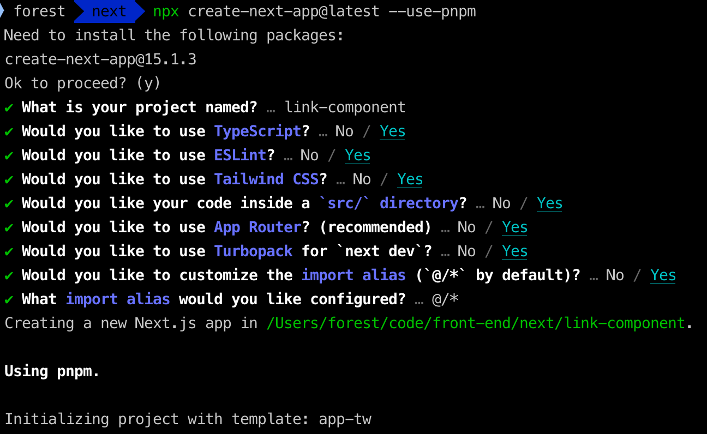
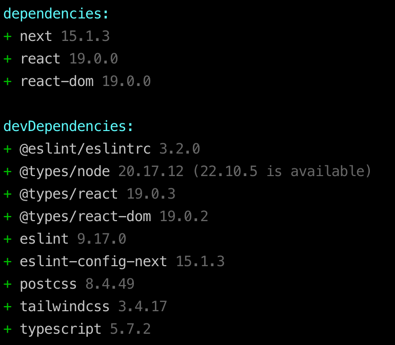
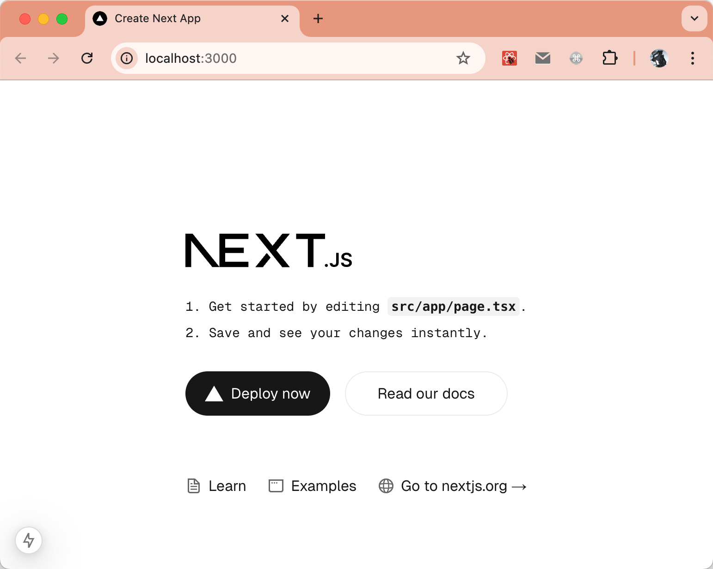
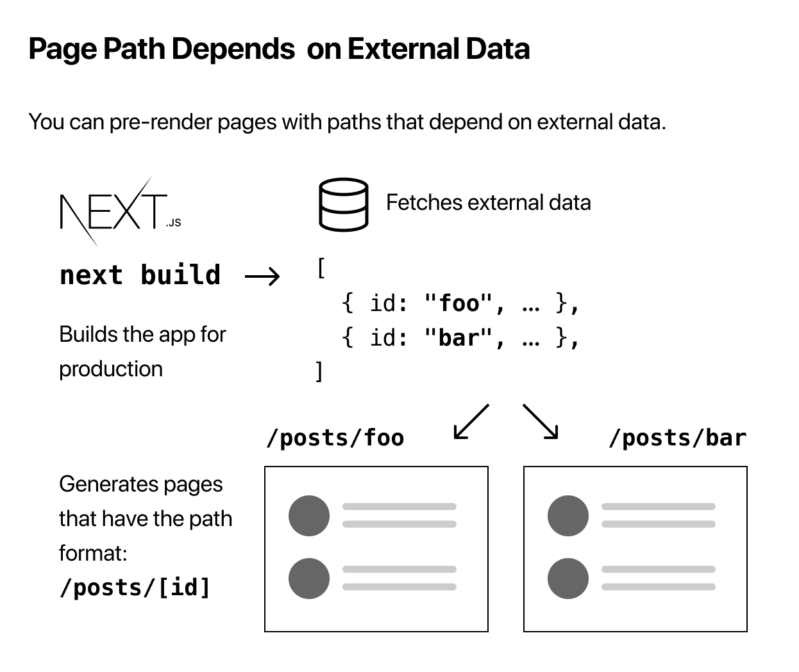
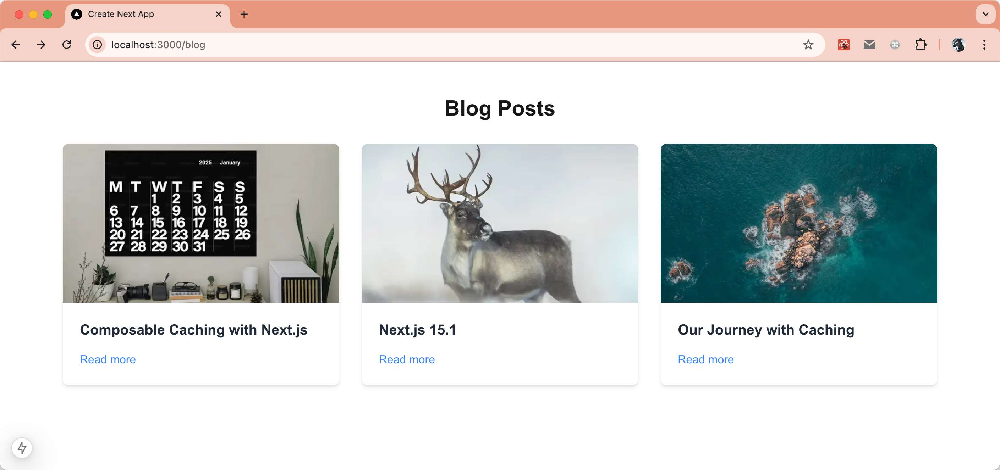
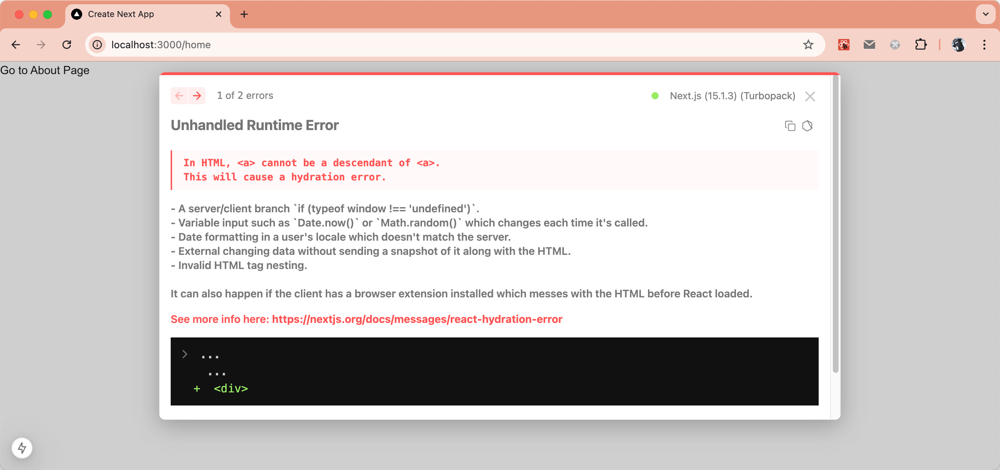

在 Next.js 中，导航是构建现代 Web 应用的核心功能，而 `<Link>` 组件正是实现高效、无缝导航的关键工具之一。本文将带你深入了解 `<Link>` 组件的使用方法及其强大功能，包括动态路由、预加载优化等特性，让你在开发过程中更加得心应手。

## 介绍

在 Next.js 中 `<Link>` 是一个内置组件，扩展了 HTML 的 `<a>` 标签，提供了预加载功能和客户端路由导航。它是 Next.js 路由导航的主要方式。

### 基础使用

使用起来也很简单，从 `next/link` 中导入它，并向组件传递一个 `href` 属性；比如：
```jsx
import Link from 'next/link'
 
export default function Page() {
    return <Link href="/dashboard">Dashboard</Link>
}
```

它的属性有：
| 属性       | 示例                | 类型           | 是否必须 |
| ---------- | ------------------- | -------------- | -------- |
| `href`     | `href="/dashboard"` | 字符串或者对象 | 是       |
| `replace`  | `replace={false}`   | 布尔           | -        |
| `scroll`   | `scroll={false}`    | 布尔           | -        |
| `prefetch` | `prefetch={false}`  | 布尔或者 NULL  | -        |

> **注意**：像 `className` 或` target="_blank"` 这样的 `<a>` 标签属性可以作为 `props` 添加到 `<Link>` 中，并会传递给底层的 `<a>` 元素。


## 属性介绍

### **href**
使用 `Link` 组件时，必须传入这个属性，作用是导航跳转，所以传入就是跳转的路径或者 URL：
#### 路径的方式
```jsx
import Link from 'next/link'
 
export default function Page() {
    return <Link href="/dashboard">Dashboard</Link>
}
```
#### 对象的方式
```jsx
import Link from 'next/link'
 
// 导航到 /about?name=test
export default function Page() {
    return (
        <Link
            href={{
                pathname: '/about',
                query: { name: 'test' },
            }}
        >
        About
        </Link>
    )
}
```
同时在 URL 中附加查询参数 `?name=test`。在目标页面中，可以通过 `useRouter` 钩子来访问这些查询参数：
```jsx
import { useRouter } from 'next/router';

export default function AboutPage() {
    const router = useRouter();
    const { name } = router.query; // 获取 query 参数中的 name

    return <p>Name: {name}</p>;
}
```

### **replace**
默认为 `false`。当设置为 `true` 时，`next/link` 将替换当前的历史记录状态，而不是在浏览器的历史记录堆栈中添加一个新的 URL。

```jsx
import Link from 'next/link'
 
export default function Page() {
    return (
        <Link href="/dashboard" replace>
            Dashboard
        </Link>
    )
}
```
当用户点击 Dashboard 链接时，浏览器会导航到 `/dashboard` 页面，但不会将这个新的 `URL` 添加到浏览器的历史记录堆栈中。相反，`replace` 属性会替换当前的历史记录状态，因此用户点击浏览器的“后退”按钮时不会返回到当前页面，而是直接跳到替换后的页面。

这个特性这个特性常用于避免用户在某些情况下回退到不需要的页面，例如在用户完成某个操作后导航到新的页面时。，例如在用户完成某个操作后导航到新的页面时。

### **scroll**

**默认为 `true`。在 Next.js 中，`<Link>` 的默认滚动行为是保持滚动位置，类似于浏览器处理前进和后退导航的方式。** 当你导航到一个新页面时，只要页面在视口内可见，滚动位置将保持不变。然而，如果页面不在视口内可见，Next.js 会滚动到页面的顶部。

```jsx
import Link from 'next/link'
 
export default function Page() {
    return (
        <Link href="/dashboard" scroll={false}>
            Dashboard
        </Link>
    )
}
```
> 注意：Next.js 在管理滚动行为之前会检查 `scroll: false`。如果启用了滚动，它会识别导航相关的 DOM 节点，并检查每个顶级元素。所有不可滚动的元素以及没有渲染的 HTML 元素都会被跳过，这包括固定定位或粘性定位的元素，以及通过 `getBoundingClientRect` 计算出的不可见元素。接下来，Next.js 会继续检查兄弟元素，直到找到一个在视口中可见的可滚动元素。

### **prefetch**

预获取（Prefetching）发生在 `<Link />` 组件进入用户的视口时（无论是初次加载还是通过滚动）。Next.js 会在后台预获取并加载链接的路由（由 `href` 表示）及其数据，以提高客户端导航的性能。如果用户悬停在 `<Link />` 上时，预获取的数据已经过期，Next.js 会再次尝试预取它。预获取功能仅在生产环境中启用。

可以传递给 `prefetch` 属性的值有：

- `null`（默认值）：预取行为取决于路由是静态的还是动态的。对于静态路由，整个路由（包括所有数据）将被预取。对于动态路由，将预取到最近的带有 `loading.js` 边界的部分路由。
- `true`：无论是静态路由还是动态路由，整个路由都会被预取。
- `false`：无论是进入视口时还是悬停时，预取都不会发生。

```jsx
import Link from 'next/link'
 
export default function Page() {
    return (
        <Link href="/dashboard" prefetch={false}>
            Dashboard
        </Link>
    )
}
```

## 示例

`<Link>` 组件的属性没有 `<Image>` 组件的属性多，我们也来做一些示例加深对这几个属性的理解！

在进入正式的内容之前，我们先来准备一下相关的环境，创建一个项目便于演示后面的内容。

使用命令 `npx create-next-app@latest --use-pnpm` 创建一个新的项目；具体的项目配置选项如下：


依赖项：


在 VS Code 打开后运行 `pnpm dev` 后，在浏览器中效果如下：




### 链接到动态路由段

在 Next.js 中，动态路由允许你根据 URL 中的变化加载不同的内容。你可以使用动态路由段来匹配 URL 中的特定部分，然后在 `<Link>` 组件中使用它来实现链接到动态页面。

当链接到动态路由段时，可以使用模板字面量和插值来生成一系列链接。例如，生成一系列博客文章链接。如下图：



```jsx
// src/app/blog/page.tsx
import Image from 'next/image';
import Link from 'next/link';
import React from "react";

// 博客数据
const data = [
    {
        id: 1,
        title: "Composable Caching with Next.js",
        excerpt: "",
        description: `We’re working on a simple and powerful caching model for Next.js. In a previous post, we talked about our journey with caching and how we’ve arrived at the 'use cache' directive.`,
    },
    {
        id: 2,
        title: 'Next.js 15.1',
        excerpt: '',
        description: `Next.js 15.1 introduces core upgrades, new APIs, and improvements to the developer experience including: 1. React 19 (stable). 2.Improved Error Debugging. 3.after (stable). 4.forbidden / unauthorized (experimental)`
    },
    {
        id: 3,
        title: 'Our Journey with Caching',
        excerpt: '',
        description: `Frontend performance can be hard to get right. Even in highly optimized apps, the most common culprit by far is client-server waterfalls. When introducing Next.js App Router, we knew we wanted to solve this issue. To do that, we needed to move client-server REST fetches to the server using React Server Components in a single roundtrip. This meant the server had to sometimes be dynamic, sacrificing the great initial loading performance of Jamstack. We built partial prerendering to solve this tradeoff and have the best of both worlds.`
    }
];
export default function page() {
    return <div>
        <div className="max-w-7xl mx-auto px-6 py-12">
            <h1 className="text-3xl font-bold text-center mb-8">Blog Posts</h1>
            <div className="grid grid-cols-1 sm:grid-cols-2 lg:grid-cols-3 gap-8">
                {data.map((post) => (
                    <div key={post.id} className="bg-white shadow-md rounded-lg overflow-hidden">
                        <Image src={`/assets/${post.id}.png`} width={200} height={200} alt={post.title} className="w-full h-56 object-cover" />
                        <div className="p-6">
                            <h2 className="text-xl font-semibold text-gray-800 mb-4">{post.title}</h2>
                            <p className="text-gray-600 mb-4">{post.excerpt}</p>
                            <Link href={`/blog/${post.id}?title=${post.title}`} className="text-blue-500 hover:text-blue-700 font-medium">
                                Read more
                            </Link>
                        </div>
                    </div>
                ))}
            </div>
        </div>
    </div>;
}
```
效果如下：



点击 Read more 则跳转到 详情页！

### 检查被激活的链接

这个只能在客户端组件中使用，通过 `usePathname` Hook 来判断是否为被激活的链接。
```jsx
'use client'

import { usePathname } from 'next/navigation'
import Link from 'next/link'

export function Links() {
    const pathname = usePathname()

    return (
        <nav>
            <Link className={`link ${pathname === '/' ? 'active' : ''}`} href="/">
                Home
            </Link>

            <Link
                className={`link ${pathname === '/about' ? 'active' : ''}`}
                href="/about"
            >
                About
            </Link>
        </nav>
    )
}
```

### 滚动到指定的元素
可以在 URL 后附加一个 `#` 哈希链接，或者直接将哈希链接传递给 `href` 属性便可滚动到指定的元素位置。
```jsx
<Link href="/dashboard#settings">Settings</Link>
 
// Output
<a href="/dashboard#settings">Settings</a>
```

### 包裹 `<a>` 标签

如果子组件是一个自定义组件，它包裹了一个 `<a>` 标签，那么在 Next.js 中使用 `<Link>` 时，你需要确保 `<a>` 标签是渲染的最底层 HTML 元素。否则，`<Link>` 的导航功能将无法正常工作，因为它依赖于 `<a>` 标签来进行客户端导航。

假设你有一个自定义组件，它包裹了一个 `<a>` 标签：

```jsx
import React from 'react'

const CustomLink = ({ href, children }: { href?: string; children: React.ReactNode }) => {
    return (
        <div>
            <a href={href}>{children}</a>
        </div>
    );
};

export default CustomLink
```

如果你使用 `<Link>` 来包装这个 `CustomLink` 组件时，你应该确保 `href` 被正确传递给 `<a>` 标签。

#### 错误示范（不符合 Next.js 要求）

```jsx
import Link from 'next/link';
import CustomLink from '@/components/CustomLink';

const HomePage = () => (
    <Link href="/about">
        <CustomLink>Go to About Page</CustomLink>
    </Link>
);

export default HomePage;
```

结果如下：




这种做法不正确，因为 `CustomLink` 是一个自定义组件，它的 `href` 并没有被传递到 `<a>` 标签。因此，`<Link>` 组件无法正常处理客户端路由导航。

#### 正确示范（符合 Next.js 要求）

你应该直接在 `CustomLink` 内部传递 `<a>` 标签的 `href` 属性，而不是让 `CustomLink` 组件自行处理。

```jsx
import Link from 'next/link';
import CustomLink from '@/components/CustomLink';

const HomePage = () => (
    <Link href="/about" passHref legacyBehavior>
        <CustomLink>Go to About Page</CustomLink>
    </Link>
);

export default HomePage;
```

### 在中间件中预取链接并处理重写路由

在中间件中进行身份验证或其他需要重写用户到不同页面的操作时很常见。为了让 `<Link />` 组件通过中间件正确地预取带有重写的链接，你需要告诉 Next.js 显示的 URL 和预取的 URL。这是为了避免不必要地向中间件发起请求，以确定正确的路由进行预取。

举个例子，当你访问 `/dashboard` 这个路由的时候，需要进行身份验证，如果身份验证通过，跳转到 `/auth/dashboard` 路由，如果没有通过，则跳转到公共访问的 `/public/dashboard` 路由，中间件实现代码如下：
```ts
import { NextRequest, NextResponse } from 'next/server'

export function middleware(request: NextRequest) {
    const nextUrl = request.nextUrl
    if (nextUrl.pathname === '/dashboard') {
        if (request.cookies.get('authToken')) {
            return NextResponse.rewrite(new URL('/auth/dashboard', request.url))
        } else {
            return NextResponse.rewrite(new URL('/public/dashboard', request.url))
        }
    }
}
```

在这种情况下，你需要在 `<Link />` 组件中使用以下代码：

```jsx
'use client'

import Link from 'next/link'
import useIsAuthed from './hooks/useIsAuthed' // Your auth hook

export default function Page() {
    const isAuthed = useIsAuthed()
    const path = isAuthed ? '/auth/dashboard' : '/public/dashboard'
    return (
        <Link as= "/dashboard" href={ path }>
            Dashboard
        </Link>
  )
}
```
这段代码中用到了 `as` 属性，这个属性是因为之前设计 href 属性在运行时不能被改变，跳转地址只能是 `"/post/[pid]"` 这种形式使用，但为了让浏览器显示正确的地址就增加了 `as` 属性，它是浏览器 URL 地址栏中展示的地址。

在这个例子中，使用 `as` 属性是因为 `prefetch` 是基于 `href` 地址进行预获取的。为了确保正确地预获取资源，我们首先通过 `isAuthed` 判断来确定路径。然而，最终跳转的地址应该是 `/dashboard`，并且具体的认证判断将在中间件中处理。因此，使用 `as` 属性来确保预取的地址正确，同时保持最终的跳转地址一致。


## 总结

在 Next.js 中，`<Link>` 组件是构建现代 Web 应用导航的核心工具，支持多种强大功能，如动态路由、预加载和客户端路由优化。本文详细介绍了 `<Link>` 组件的使用方法，包括基础用法、常用属性（如 `href`、`replace`、`scroll` 和 `prefetch`）以及一些高级特性，比如动态路由、滚动位置控制、与自定义组件的配合使用等。

- **动态路由和预获取**：利用 `href` 属性和动态路由段，能够高效地处理路由变化，并通过 `prefetch` 提升用户体验。
- **属性深度解析**：通过分析 `replace`、`scroll`、`prefetch` 等属性的作用，能帮助开发者优化用户导航体验。
- **自定义组件和 `<a>` 标签的结合使用**：需要确保自定义组件正确传递 `href` 属性，以保证客户端路由的正常工作。
- **中间件处理预取和重写**：通过中间件功能，可以动态判断用户的认证状态，并在 `<Link>` 组件中使用 `as` 属性确保预取和跳转的正确性。

结合这些知识点，开发者可以更加灵活、高效地构建和优化基于 Next.js 的应用程序导航。

**「参考资源」**

- `<Link>` Component: [https://nextjs.org/docs/app/building-your-application/routing/linking-and-navigating#link-component](https://nextjs.org/docs/app/building-your-application/routing/linking-and-navigating#link-component)

