在互联网打破地理边界的今天，一个仅支持单一语言的网站或应用，就像一家只开在街角的商店——无论商品多么优质，触达的用户始终有限。**国际化（Internationalization，简称 i18n）** 正是为了打破这种局限而生。它不仅是技术问题，更是全球化时代产品设计的核心策略。

**国际化（Internationalization，简称 i18n）是指将产品、服务或应用程序设计为能够适应不同语言、文化、地域需求的过程。** 它是全球化战略中的一部分，**旨在确保软件可以在全球不同市场中有效运行，支持多种语言和文化。** i18n 主要处理的是支持多语言、日期格式、货币符号等区域性差异的功能。比如：

- 日期格式（`2023-09-15` vs `15/09/2023`）
- 货币符号（`¥100` vs `$100`）

国际化的目标是使产品具备跨地域适应能力，以便进行**本地化（L10n）** 处理时不需要对应用程序的核心代码进行大的修改。
以下是优化后的表述：

- **i18n**：代表 **Internationalization**，由首字符 **i** 和尾字符 **n** 组成，中间有 **18** 个字符。
- **L10n**：代表 **Localization**，由首字符 **L** 和尾字符 **n** 组成，中间有 **10** 个字符。

本地化（Localization，简称 L10n）是指在国际化（i18n）的基础上，针对特定地区、语言和文化对软件、应用程序或产品进行定制化的过程。L10n 主要涉及根据目标市场的需求，将内容、功能、设计等方面进行适配和翻译。本地化就是为每个地区“量身定制”用户体验的关键一步。

**与本地化（L10n）的区别**：

- **国际化（i18n）**：确保应用程序架构可以支持不同的语言、文化和地区。它并不直接涉及内容翻译或区域特定内容，而是为本地化打下基础。
- **本地化（L10n）**：在国际化的基础上，实际将应用程序的内容翻译成特定语言，并进行适当的区域性调整，如日期格式、货币符号、文本方向等。

## 国际化的难点

国际化的难点主要体现在以下几个方面：

### 1. 语言差异与翻译

- **多样化的语言结构**：不同语言有不同的语法、词序、句式结构。例如，英语和中文的表达方式差异较大，同一句话在翻译时可能需要改变整个句子的结构。
- **词汇不完全匹配**：一些词语在不同语言中没有直接的对应翻译，可能需要额外的解释或描述，这可能导致翻译时的意义丧失或歧义。
- **多义词问题**：某些词在不同的上下文中有不同的含义，翻译时可能需要根据上下文来确定正确的翻译方式。

### 2. 文化差异

- **习惯与偏好差异**：不同国家和地区的人们对颜色、图像、符号等有不同的文化解读。例如，某些颜色在西方可能是象征幸运，但在其他地方却可能有负面的文化含义。
- **日期和时间格式**：日期和时间的格式在不同文化中有所不同，比如美国使用“月/日/年”格式，而大部分欧洲和亚洲国家则使用“日/月/年”格式。需要处理这些差异，以免让用户产生混淆。
- **货币与度量单位**：不同地区使用不同的货币和度量单位（如英制与公制）。在进行国际化时，必须根据用户所在地区正确显示价格、重量、长度等。

### 3. 文本长度与排版问题

- **文本长度变化**：不同语言的文本长度差异较大，比如英语的单词较短，而德语的单词往往更长。这可能导致UI组件的布局问题，特别是在处理响应式设计时。
- **字符集支持**：有些语言使用特殊字符或是非拉丁字母（如中文、阿拉伯文、日文、韩文等）。这要求系统支持多种字符集编码，避免显示乱码。
- **从右到左的语言**：如阿拉伯语和希伯来语等语言是从右到左书写的，UI设计需要考虑文字方向的变化。

### 4. 翻译管理

- **多语言文件管理**：随着支持的语言增多，翻译文件会变得非常庞大，如何有效地管理这些文件、更新和同步翻译版本是一个挑战。
- **翻译一致性**：在不同语言版本之间，确保术语的一致性是非常重要的。翻译不一致可能影响用户体验或造成混乱。
- **自动翻译与人工翻译**：虽然自动翻译工具（如Google Translate）可以加速翻译过程，但它们并不总是准确。许多时候，人工翻译仍然是必不可少的。

### 5. SEO与URL管理

- **搜索引擎优化（SEO）**：对于多语言网站，确保每个语言版本都能被搜索引擎正确索引是至关重要的。通常需要使用`hreflang`标签来指定每种语言的页面版本，但这也带来了复杂性。
- **多语言URL结构**：不同语言版本的URL结构设计也是一个难题。是选择将语言作为路径（如`/en/`、`/zh/`）还是使用子域名（如`en.example.com`）或其他形式？

### 6. 国际化的性能

- **动态加载翻译文件**：在需要根据用户选择的语言动态加载翻译资源时，如何保证性能不会受到影响？加载过多的翻译文件可能导致页面加载缓慢，影响用户体验。
- **缓存与优化**：如何管理多语言页面的缓存，避免每次都重新加载翻译文件？需要优化资源的加载和缓存策略，以提高性能。

### 7. 合规性与法律问题

- **地区性法规**：不同国家和地区有不同的数据隐私、广告规范和法律要求。例如，欧洲有严格的GDPR要求，某些内容可能需要根据地区来进行内容调整。
- **语言与地区的敏感问题**：某些国家和地区对政治、宗教等方面有特别敏感的要求，发布的内容需要避免引起争议。

### 8. 测试与质量保证

- **多语言测试**：需要对所有语言版本进行全面的测试，确保翻译准确，UI排版合理，功能正常工作。这在实际开发中往往是一个非常耗时的过程。
- **跨文化用户测试**：不仅要测试技术实现是否符合要求，还要进行跨文化的用户体验测试，确保不同文化背景的用户能够顺利使用。

这些难点使得国际化工作变得非常复杂，但解决这些问题能够为全球用户提供更好的体验，扩大产品的市场范围。

## Next.js 中的国际化方案

在 Next.js 中实现国际化（i18n）有多种方案可供选择。根据项目的需求、团队的技术栈熟悉度以及对功能和性能的要求，选择合适的国际化方案非常重要。以下是对几种主要方案的技术调研、分析和比较：

### 1. Next.js 内建的国际化支持

从 Next.js 10 开始，Next.js 提供了内建的国际化路由支持。通过在 `next.config.js` 中配置 `i18n`，可以实现多语言路由和语言切换功能。

**优点**：

- **简洁易用**：配置简单，适合需要基本国际化功能的项目。
- **无外部依赖**：不需要引入额外的库，减少了项目的复杂性。

**缺点**：

- **功能有限**：仅提供路由层面的国际化支持，缺乏翻译内容管理和高级功能。
- **缺乏翻译管理**：需要手动管理翻译文件和内容，可能导致维护困难。

**适用场景**：适合需要基本国际化路由功能且翻译内容较少的项目。

### 2. next-i18next

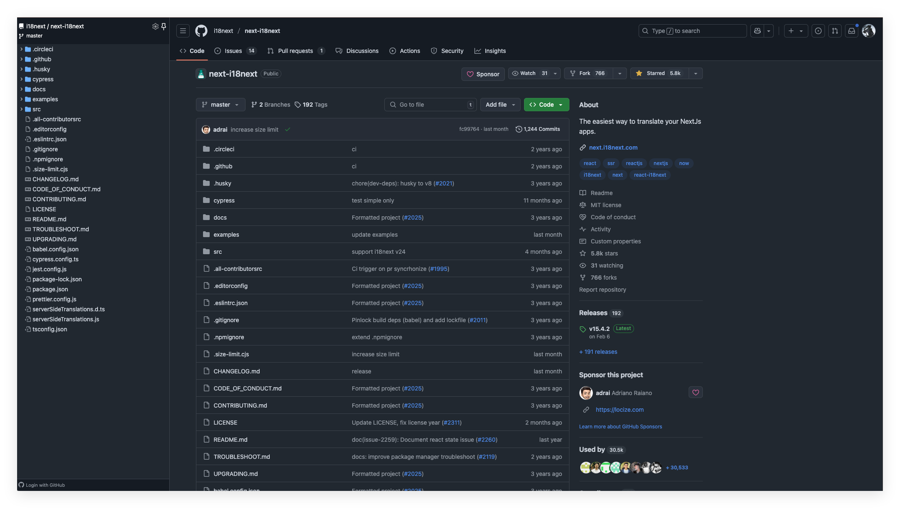

`next-i18next` 是一个为 Next.js 优化的国际化库，基于 `i18next` 和 `react-i18next`。它提供了翻译内容管理、组件和钩子，支持服务端渲染（SSR）和静态生成（SSG）。

**优点**：

- **功能全面**：支持翻译内容管理、命名空间、代码分割等高级功能。
- **SSR/SSG 支持**：与 Next.js 的服务端渲染和静态生成兼容，提升性能。
- **活跃社区**：拥有广泛的用户基础和活跃的维护团队，文档和支持资源丰富。

**缺点**：

- **配置复杂**：相对于 Next.js 内建的国际化支持，配置和使用可能更复杂，需要学习和适应。
- **依赖较多**：引入了多个依赖（如 `i18next`、`react-i18next`），可能增加项目的复杂性。

**适用场景**：适合需要全面国际化功能、支持 SSR/SSG，且团队对 `i18next` 生态有一定了解的项目。

### 3. next-intl

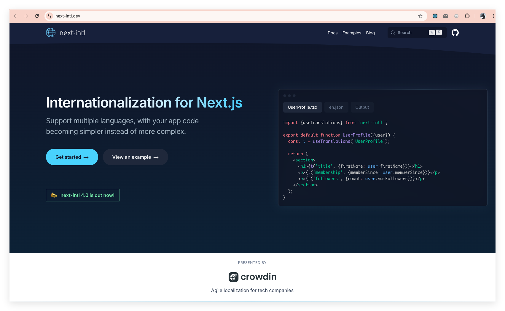

`next-intl` 是专为 Next.js 设计的国际化库，支持 ICU 消息语法、日期、时间和数字的本地化格式化，具备类型安全特性，并提供基于 hooks 的 API。它与 Next.js 原生集成，兼容 App Router、服务器组件和静态渲染，同时支持国际化路由。

**优点**：

- **类型安全**：利用 TypeScript 提供类型安全，减少运行时错误。
- **功能丰富**：支持 ICU 消息语法、日期和数字格式化等高级本地化功能。
- **与 Next.js 深度集成**：兼容 App Router、服务器组件和静态渲染，提供一致的开发体验。

**缺点**：

- **学习成本**：需要学习新的 API 和概念，可能增加上手难度。
- **社区支持较少**：相比 `next-i18next`，社区规模较小，可能在遇到问题时获得的支持和资源较少。

**适用场景**：适合使用 Next.js App Router、需要类型安全和丰富本地化功能的项目，且团队愿意投入时间学习新工具的情况。

### 4. next-international

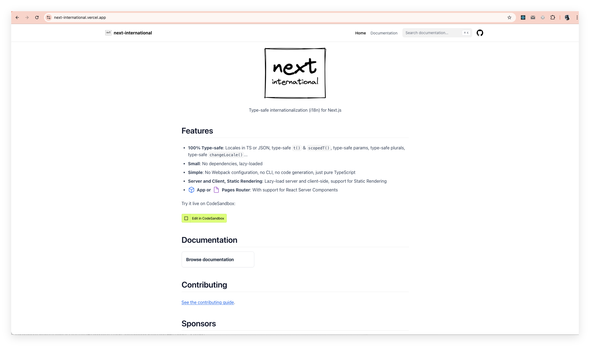

`next-international` 是一个为 Next.js 提供类型安全的国际化（i18n）解决方案的库。它旨在简化国际化过程，同时确保开发体验的流畅性和代码的可维护性。

**主要特点**：

- **类型安全**：提供 TypeScript 类型声明，确保翻译键、参数和复数形式的类型安全，减少运行时错误。
- **轻量级**：无外部依赖，支持按需加载，优化性能。
- **简单易用**：无需复杂的 Webpack 配置、CLI 工具或代码生成，纯粹的 TypeScript 实现，降低学习成本。
- **全方位支持**：兼容服务器端和客户端渲染，支持静态生成（SSG），并与 Next.js 的 App Router 和页面路由器兼容。

**适用场景**：

`next-international` 适用于希望在 Next.js 项目中实现类型安全、简洁且高性能的国际化功能的开发者。如果追求简单的集成和易于维护的代码库，`next-international` 可能是一个合适的选择。

### 5. Intlayer

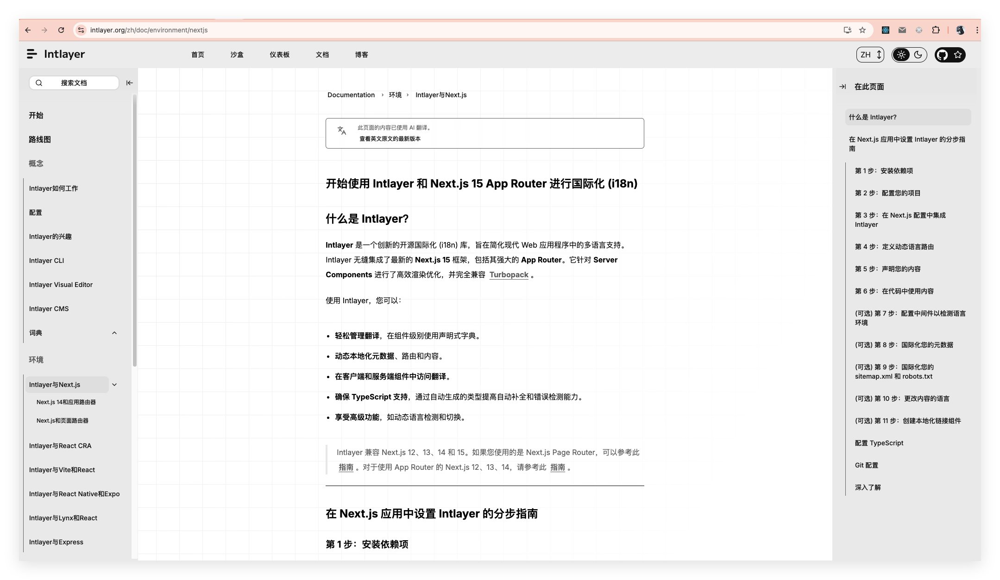

[`Intlayer`](https://intlayer.org/doc/environment/nextjs) 是一个现代的开源国际化库，专为 Next.js 的 App Router 设计，内置支持服务器组件和 Turbopack。它提供了组件级别的内容声明、类型安全、缺失翻译管理和可视化编辑器等功能。

**优点**：

- **组件级内容声明**：将翻译紧密放置于组件旁边，提高代码的可维护性。
- **类型安全**：提供类型安全的消息定义，减少了运行时错误。
- **缺失翻译管理**：构建期间检测缺失的翻译键，确保发布时翻译完整。
- **服务器组件支持**：完全支持 Next.js 的 App Router 和服务器组件，优化渲染性能。
- **可视化编辑器**：提供可视化编辑器，简化内容管理和编辑过程。

**缺点**：

- **新兴工具**：作为新兴工具，社区支持和成熟度可能不如其他方案。
- **学习曲线**：需要学习 Intlayer 的特定概念和 API，可能增加初期的学习成本。

**适用场景**：适合使用 Next.js App Router、需要类型安全和丰富本地化功能的项目，且团队愿意投入时间学习新工具的情况。

### 6. next-i18n-router

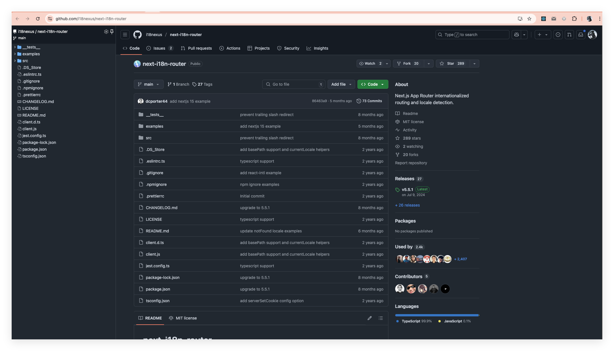

`next-i18n-router` 为 Next.js 的 App Router 提供了国际化路由和语言检测功能。它允许在应用中轻松实现基于路径的语言切换，并支持自动检测用户的首选语言。

**优点**：

- **与 App Router 兼容**：专为 Next.js 的 App Router 设计，提供无缝的国际化路由支持。
- **语言检测**：自动检测用户的首选语言，提升用户体验。
- **与其他 i18n 库兼容**：可以与现有的 i18n 库一起使用，方便集成。

**缺点**：

- **需要手动配置**：需要在项目中设置动态路由和中间件，配置过程相对复杂。
- **社区支持有限**：相比其他成熟的国际化解决方案，社区支持和文档可能较少。

**适用场景**：适用于使用 Next.js App Router，需要自定义国际化路由和语言检测功能的项目。

### 7. paraglide-next

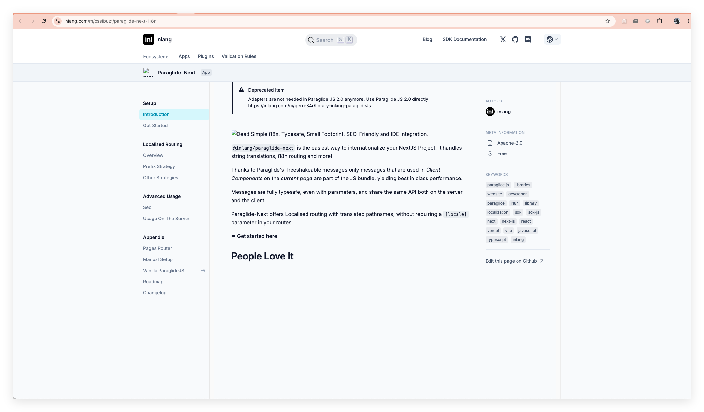

`paraglide-next` 是一个为 Next.js 提供国际化支持的库，旨在简化翻译字符串的管理、i18n 路由和其他相关功能。它支持树摇优化，确保仅将当前页面所需的翻译包含在 JS 包中，从而提高性能。

**优点**：

- **简化的 API**：提供易于使用的 API，降低了国际化的复杂性。
- **树摇优化**：确保仅包含当前页面所需的翻译，优化性能。
- **类型安全**：提供类型安全的消息定义，减少了运行时错误。

**缺点**：

- **新兴工具**：作为新兴工具，可能缺乏广泛的社区支持和成熟度。
- **学习曲线**：需要学习新的 API 和概念，可能增加上手难度。

**适用场景**：适用于希望简化国际化过程，并关注性能和类型安全的 Next.js 项目。

### 8. `@formatjs/intl-localematcher`

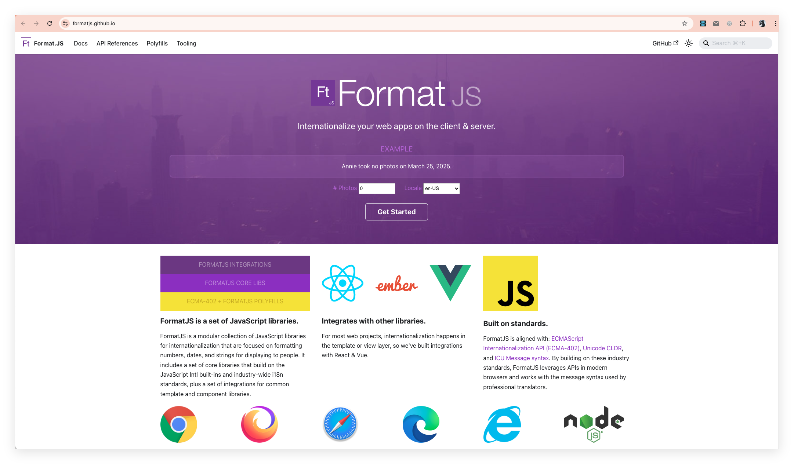

`@formatjs/intl-localematcher` 是一个用于在服务器端根据请求的 `Accept-Language` 头部进行语言匹配的工具。它帮助确定用户首选的语言，以便在应用中提供适当的本地化内容。

**优点**：

- **标准化**：遵循国际标准，确保语言匹配的一致性。
- **易于集成**：可以与现有的国际化解决方案一起使用，增强语言匹配功能。

**缺点**：

- **功能单一**：主要关注语言匹配，不提供翻译管理或路由功能。
- **需要其他工具配合**：通常需要与其他国际化工具一起使用，才能实现完整的国际化功能。

**适用场景**：适用于需要精确控制语言匹配逻辑，并希望与其他国际化工具配合使用的项目。

> 官方文档中就使用了 `@formatjs/intl-localematcher` 和 `negotiator` 配合实现国际化的功能

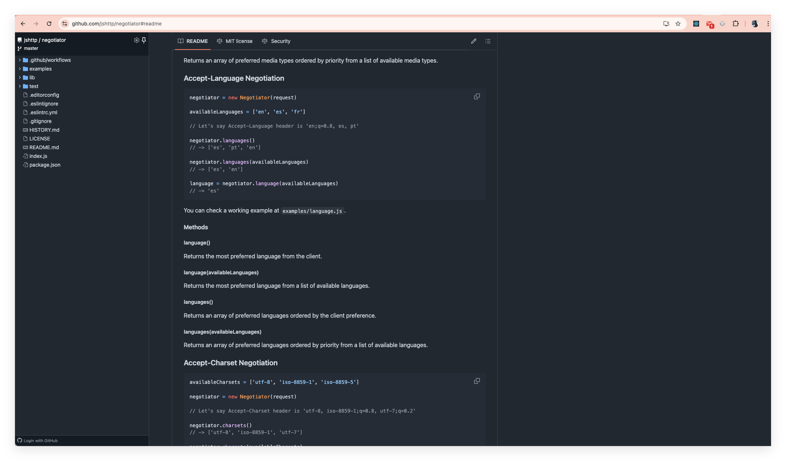

`negotiator` 是一个用于在服务器端解析和匹配 HTTP 请求头部（如 `Accept-Language`）的库。它帮助确定客户端首选的语言、编码、类型等，以便在服务器端做出相应的处理。

**优点**：

- **功能强大**：支持解析多种 HTTP 请求头部，提供灵活的匹配功能。
- **广泛使用**：在 Node.js 社区中广泛使用，拥有良好的稳定性和支持。

**缺点**：

- **需要手动处理**：需要在服务器端手动解析请求头部，并根据匹配结果进行处理。
- **与 Next.js 的集成**：在 Next.js 中使用时，可能需要额外的配置和集成工作。

**适用场景**：适用于需要在服务器端处理复杂请求头部解析的项目，特别是当处理多种内容协商时。

## next-international

上面介绍八种国际化的方案，由于每种方案各有特色，深入探讨每一种都能输出一篇文章来；我们以 `next-international` 为例，探讨其在国际化中的应用。

这里为什么选择 [next-international](https://next-international.vercel.app/docs) 呢？

- **100% 类型安全**：支持使用 TypeScript 或 JSON 格式的文件，提供类型安全的 `t()` 和 `scopedT()` 函数，确保翻译键、参数、复数形式和 `changeLocale()` 方法的类型安全。
- **体积小巧**：无外部依赖，支持按需加载。
- **简单易用**：无需复杂的 Webpack 配置、CLI 工具或代码生成，纯 TypeScript 实现，降低了使用门槛。
- **支持服务端和客户端渲染**：支持服务端和客户端的按需加载，并兼容静态渲染。
- **兼容 App Router 或 Pages Router**：支持 React 服务器组件，适用于不同的路由配置。

### 搭建环境

按照本系列文章的惯例，在进入正题之前，我们先来准备一下相关的环境，创建一个项目便于演示后面的内容。

> - Node.js：v20.10.0
> - pnpm：10.4.1
> - OS：MacBook Pro
> - IDE：VS Code 1.98.2

使用命令 `npx create-next-app@latest --use-pnpm` 创建一个新的项目；具体的项目配置选项如下：

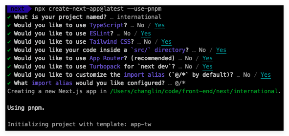

在 VS Code 打开以后，项目的依赖如下图，然后在终端里运行 `pnpm dev` 启动服务：

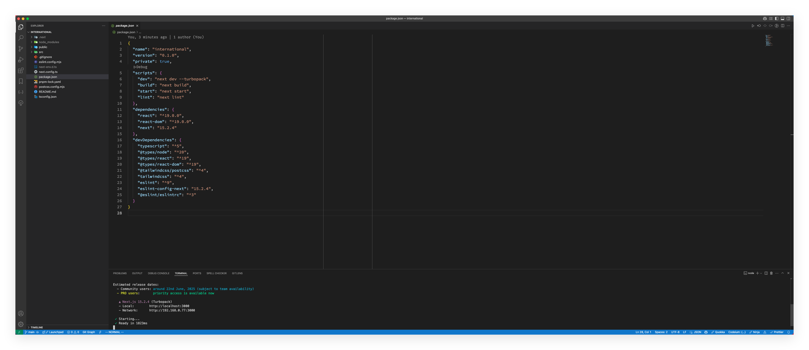

在浏览器里访问如下：

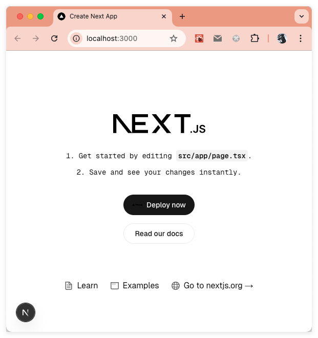

### 集成 next-international

上面把环境准备好之后，我们就来集成 next-international！并在 App Router 中来演示国际化功能。

> [Pages Router](https://next-international.vercel.app/docs/pages-setup) 的集成方式可以参考官方文档！

使用 `pnpm` 安装 `next-international`

```sh
pnpm install next-international
```

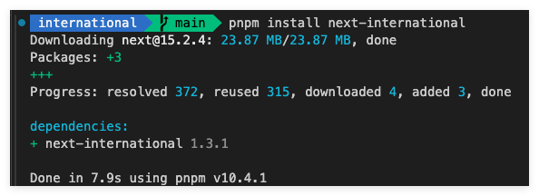

> 官方建议在 tsconfig.json 中将 `strict` 设置为 `true` 以确保提供最佳的开发体验！如果没有改动的话，next 脚手架初始化时是将其 `strict` 属性设置为 `true` 的。

### 添加语言文件并配置

创建语言文件可以是 JSON 文件也可以是 TypeScript 文件，我们这里就以 TypeScript 文件为例；在 `src` 目录下创建 locales 目录，然后分别创建 `client.ts`、`server.ts` 和 `config.ts` 三个文件：

```ts
// src/locales/client.ts
'use client'
import { createI18nClient } from 'next-international/client'
import { locales } from './config'

export const { useI18n, useScopedI18n, I18nProviderClient, useCurrentLocale, useChangeLocale } = createI18nClient(locales)

// /src/locales/translations/en.ts
import { createI18nServer } from 'next-international/server'
import { locales } from './config'

export const { getI18n, getScopedI18n, getStaticParams, getCurrentLocale } = createI18nServer(locales)

// src/locales/config.ts
import { createI18nMiddleware } from 'next-international/middleware'

// 定义支持的语言配置
// 使用动态导入方式加载不同语言的翻译文件
export const locales = {
    en: () => import('./translations/en'),
    cn: () => import('./translations/cn')
}

// 定义语言类型，从 locales 对象中提取键名作为类型
export type LocalesType = keyof typeof locales
// 获取所有支持的语言代码数组
export const localeKeys: LocalesType[] = Object.keys(locales) as LocalesType[]

// 获取 createI18nMiddleware 函数的参数类型
type CreateI18nMiddlewareParams = Parameters<typeof createI18nMiddleware>
// 定义中间件配置类型，继承自 createI18nMiddleware 的参数类型
// 但重写了 locales 字段的类型定义
type I18nMiddlewareConfig<T extends CreateI18nMiddlewareParams[0]['locales']> = Omit<CreateI18nMiddlewareParams[0], 'locales'> & { locales: T }

// 导出国际化配置对象
export const i18n: I18nMiddlewareConfig<(LocalesType | string)[]> = {
    // 设置默认语言为中文
    defaultLocale: 'cn',
    // 设置支持的语言列表
    locales: localeKeys,
    // 设置 URL 映射策略为重写模式
    urlMappingStrategy: 'rewrite'
}
```

在 `locales` 下创建 `translations` 目录，然后创建 `en.ts` 和 `cn.ts` 两个语言文件：

```ts
// src/locales/translations/en.ts
export default {
    hello: 'Hello',
    'hello.world': 'Hello world!',
    welcome: 'Hello {name}!',
    'hello.welcome': 'Hello {name}!'
} as const

// src/locales/translations/cn.ts
export default {
    hello: '你好',
    'hello.world': '你好，世界！',
    welcome: '你好 {name}！',
    'hello.welcome': 'Hello {name}!'
} as const
```

上面只是以英文和中文两个语言做示例，实际上你可以根据产品的需要做语言的扩展。

### 移动文件

将所有的路由移到 `app/[locale]/` 文件夹中。移动后 src 目录结构如下：

```txt
.
├── app
│   └── [locale]
│       ├── favicon.ico
│       ├── globals.css
│       ├── layout.tsx
│       └── page.tsx
├── components
│   └── header
│       └── index.tsx
├── locales
│   ├── client.ts
│   ├── config.ts
│   ├── server.ts
│   └── translations
│       ├── cn.ts
│       └── en.ts
```

### 中间件

在 app 目录的同级目录中添加一个 `middleware.ts` 文件，用于将用户重定向到正确的语言环境。你也可以重写 URL 以隐藏语言环境部分。

```ts
import { NextRequest } from 'next/server'
import { createI18nMiddleware } from 'next-international/middleware'
import { i18n } from '@/locales/config'

const I18nMiddleware = createI18nMiddleware(i18n)

export function middleware(request: NextRequest) {
    return I18nMiddleware(request)
}

export const config = {
    matcher: ['/((?!api|static|.*\\..*|_next|favicon.ico|robots.txt).*)']
}
```

### 在页面中展示

- 在 header 中来写一个简单的语言切换

    ```jsx
    // src/components/header/index.tsx
    'use client'

    import { useChangeLocale, useCurrentLocale } from '@/locales/client'
    import { localeKeys } from '@/locales/config'

    export default function Header() {
        // 获取当前语言
        const currentLocale = useCurrentLocale()
        // 获取切换语言的函数
        const changeLocale = useChangeLocale()

        return (
            <header className="w-full bg-white shadow-sm">
                <div className="max-w-7xl mx-auto px-4 sm:px-6 lg:px-8">
                    <div className="flex items-center justify-between h-16">
                        <div className="flex items-center">
                            <p className="text-gray-700 font-medium">
                                当前语言: <span className="text-blue-600">{currentLocale.toUpperCase()}</span>
                            </p>
                        </div>

                        <div className="flex items-center space-x-2">
                            {localeKeys.map((item) => (
                                <button
                                    key={item}
                                    type="button"
                                    onClick={() => changeLocale(item)}
                                    className={`px-4 py-2 rounded-md text-sm font-medium transition-colors duration-200
                      ${currentLocale === item ? 'bg-blue-600 text-white' : 'bg-gray-100 text-gray-700 hover:bg-gray-200'}`}
                                >
                                    {item.toUpperCase()}
                                </button>
                            ))}
                        </div>
                    </div>
                </div>
            </header>
        )
    }
    ```

- 在 app 下的 layout.tsx 中引入 `Header` 组件：

    ```jsx
    // src/app/[locale]/layout.tsx
    import type { Metadata } from "next";
    import { Geist, Geist_Mono } from "next/font/google";
    import "./globals.css";
    import Header from "@/components/header";

    const geistSans = Geist({
      variable: "--font-geist-sans",
      subsets: ["latin"],
    });

    const geistMono = Geist_Mono({
      variable: "--font-geist-mono",
      subsets: ["latin"],
    });

    export const metadata: Metadata = {
      title: "Create Next App",
      description: "Generated by create next app",
    };

    export default async function RootLayout({
      children,
    }: Readonly<{
      children: React.ReactNode;
    }>) {
      return (
        <html lang="en">
          <body
            className={`${geistSans.variable} ${geistMono.variable} antialiased`}
          >
            <Header /> {/* add this */}
            {children}
          </body>
        </html>
      );
    }
    ```

- 在页面中来使用

    ```jsx
    // src/app/[locale]/page.tsx
    import Image from 'next/image'
    import { getCurrentLocale, getI18n, getScopedI18n } from '@/locales/server'

    export default async function Home() {
        // 获取全局翻译函数
        const t = await getI18n()
        // 获取指定命名空间（hello）的翻译函数
        const scopedT = await getScopedI18n('hello')
        // 获取当前语言
        const currentLocale = await getCurrentLocale()

        return (
            <main className="flex flex-col gap-[32px] row-start-2 items-center sm:items-start">
                <div>
                    {/* 显示当前语言 */}
                    <p>当前语言为：{currentLocale}</p>
                    {/* 使用全局翻译函数 */}
                    <p>{t('hello')}</p>

                    {/* 两种等效的翻译方式示例 */}
                    {/* 1. 使用全局翻译函数，通过点号访问嵌套翻译 */}
                    <p>{t('hello.world')}</p>
                    {/* 2. 使用作用域翻译函数，直接访问指定命名空间的翻译 */}
                    <p>{scopedT('world')}</p>

                    {/* 带参数的翻译示例 */}
                    {/* 使用作用域翻译函数，传入 name 参数 */}
                    <p>{`scopedT("welcome", { name: '长林啊' }): ${scopedT('welcome', { name: '长林啊' })}`}</p>

                    {/* 使用全局翻译函数，传入 name 参数 */}
                    <p>{t('welcome', { name: '长林啊' })}</p>
                    {/* 使用全局翻译函数，传入 React 元素作为参数 */}
                    <p>{t('welcome', { name: <strong>长林啊</strong> })}</p>
                </div>
            </main>
        )
    }
    ```

    效果如下：

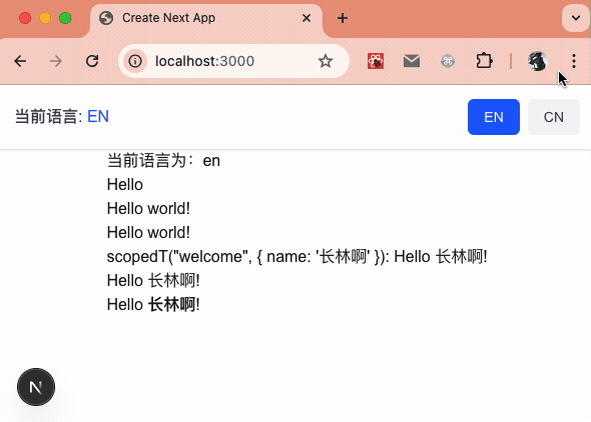

## next-international 高阶使用

### 复数翻译

复数翻译无需任何外部依赖即可开箱即用，它使用了浏览器和 Node.js 中都支持的 [`Intl.PluralRules API`](https://developer.mozilla.org/zh-CN/docs/Web/JavaScript/Reference/Global_Objects/Intl/PluralRules)。兼容性如下：

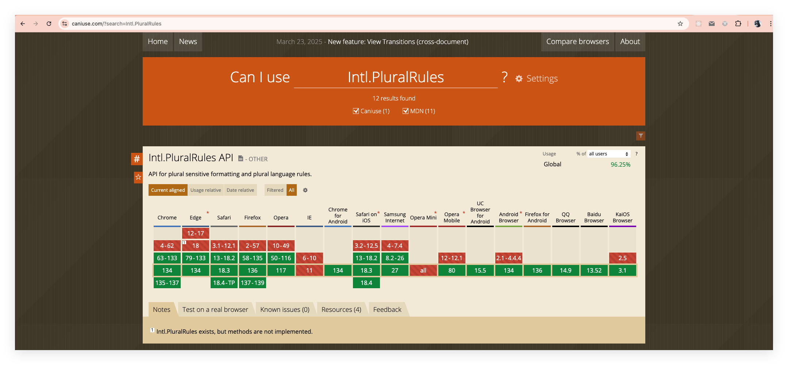

要声明复数翻译，在键名后添加 # 并跟上 `zero`、`one`、`two`、`few`、`many` 或 `other`：

```js
export default {
  'cows#zero': 'No cows',
  'cows#one': 'A cow',
  'cows#other': '{count} cows'
} as const
```

然后通过传入必需的 `count` 参数，系统会自动确定正确的翻译。`count` 的值由所有后缀的并集决定，这确保了类型安全：

- `zero` 允许 0
- `one` 自动补全 1, 21, 31, 41... 但允许任何数字。
- `two` 自动补全 2, 22, 32, 42... 但允许任何数字。
- `few`、`many` 和 `other` 允许任何数字。
  这个功能在客户端组件和服务器端组件中都可以使用，并且支持作用域翻译：

```jsx
'use client'
export default function Page() {
    const t = useI18n() // 在服务器端组件中则使用 getI18n()

    return (
        <div>
            {/* Output: No cows */}
            <p>{t('cows', { count: 0 })}</p>
            {/* Output: A cow */}
            <p>{t('cows', { count: 1 })}</p>
            {/* Output: 3 cows */}
            <p>{t('cows', { count: 3 })}</p>
        </div>
    )
}
```

这个功能的主要特点是：

- 无需额外依赖，使用浏览器原生的 `Intl.PluralRules API`。
- 支持多种复数形式（`zero`、`one`、`two`、`few`、`many`、`other`）。
- 类型安全，通过 TypeScript 确保正确使用。
- 在客户端和服务器端组件中都可以使用。
- 支持作用域翻译。
- 使用简单，只需在键名后添加 `#` 和对应的复数形式。

这个功能对于需要处理不同语言中数字复数形式的应用特别有用，比如显示物品数量、时间单位等场景。

### 作用域翻译

这个功能我们前面的示例中有用过，就是当你有很多翻译键时，你可能会注意到在同一个文件中经常重复使用相同的作用域：

```js
// 重复使用 `pages.settings`
t('pages.settings.title')
t('pages.settings.description', { identifier })
t('pages.settings.cta')
```

可以客户端中使用 `useScopedI18n` hook 或者在服务端组件中使用 `getScopedI18n` 方法来避免这种重复书写。当然，作用域键、后续键和参数仍然保持 **100%** 的类型安全。

从 `createI18nClient` 导出 `useScopedI18n`，从 `createI18nServer` 导出 `getScopedI18n`：

```js
// 客户端组件的引入
export const {
    useScopedI18n
    // ...
} = createI18nClient({
    /* ... */
})

// 服务端组件的引入方式
export const {
    getScopedI18n
    // ...
} = createI18nServer({
    /* ... */
})
```

在组件中的使用如下：

```jsx
// 客户端组件
'use client'
import { useScopedI18n } from '/path/to/locales/client'

export default function Page() {
  const t = useScopedI18n('pages.settings')

  return (
    <div>
      <p>{t('title')}</p>
      <p>{t('description', { identifier })}</p>
      <p>{t('cta')}</p>
    </div>
  )
}

// 服务器端组件
import { getScopedI18n } from '/path/to/locales/server'

export default async function Page() {
  const t = await getScopedI18n('pages.settings')

  return (
    <div>
      <p>{t('title')}</p>
      <p>{t('description', { identifier })}</p>
      <p>{t('cta')}</p>
    </div>
  )
}
```

这个功能的主要优点是：

- 减少重复代码，提高代码可维护性。
- 保持类型安全，避免拼写错误。
- 支持客户端和服务器端组件。
- 使用简单，只需指定一次作用域。
- 支持带参数的翻译。

作用域翻译特别适合处理大型应用中的翻译，可以让代码更加简洁和易于维护。

### 获取和更改语言

**只能在客户端组件中更改当前语言**。从 `createI18nClient` 导出 `useChangeLocale` 和 `useCurrentLocale`，从 `createI18nServer` 导出 `getCurrentLocale`：

```typescript
// path/to/client.ts
export const {
    useChangeLocale,
    useCurrentLocale
    // ...
} = createI18nClient({
    /* ... */
})

// path/to/server.ts
export const {
    getCurrentLocale
    // ...
} = createI18nServer({
    /* ... */
})
```

然后使用这些 hooks：

```typescript
// 客户端组件
'use client'
import { useChangeLocale, useCurrentLocale } from 'path/to/locales/client'

export default function Page() {
  const changeLocale = useChangeLocale()
  const locale = useCurrentLocale()

  return (
    <>
      <p>当前语言: {locale}</p>
      <button onClick={() => changeLocale('en')}>English</button>
      <button onClick={() => changeLocale('fr')}>French</button>
    </>
  )
}

// 服务器端组件
import { getCurrentLocale } from 'path/to/locales/server'

export default async function Page() {
  // 如果你使用的是 Next.js < 15 版本，不需要 await getCurrentLocale：
  // const locale = getCurrentLocale()
  const locale = await getCurrentLocale()

  return (
    <p>当前语言: {locale}</p>
  )
}
```

- **保留搜索参数**

    默认情况下，`next-international` 在更改语言时不会保留搜索参数。这是因为如果你没有将组件包装在 `Suspense` 边界中，`useSearchParams()` 会使页面退出静态渲染。

    如果你想保留搜索参数，可以在 `useChangeLocale` 中手动使用 `preserveSearchParams` 选项：

    ```typescript
    // 客户端组件
    'use client'
    import { useChangeLocale } from 'path/to/locales/client'

    export function ChangeLocaleButton() {
        const changeLocale = useChangeLocale({ preserveSearchParams: true })

        // ...
    }
    ```

    然后，别忘了将组件包装在 `Suspense` 边界中，以避免整个页面退出静态渲染：

    ```typescript
    // 客户端或服务器端组件
    import { ChangeLocaleButton } from './change-locale-button'

    export default function Page() {
      return (
        <Suspense>
          <ChangeLocaleButton />
        </Suspense>
      )
    }
    ```

- **`basePath` 支持**

    如果你在 `next.config.ts` 中设置了 `basePath` 选项，你还需要在 `createI18nClient` 中设置它：

    ```typescript
    // path/to/client.ts
    export const {
        // ...
    } = createI18nClient(
        {
            /* ... */
        },
        {
            basePath: '/base'
        }
    )
    ```

这个功能的主要特点是：

- 语言切换只能在客户端组件中进行。
- 提供了客户端和服务器端两种获取当前语言的方式。
- 支持保留 URL 搜索参数（需要额外配置）。
- 支持 Next.js 的 `basePath` 配置。
- 与 Next.js 的静态渲染功能完全兼容。

这些功能使得 next-international 能够很好地集成到 Next.js 应用中，同时保持了良好的性能和用户体验。

我会帮你翻译这个关于 next-international 中间件配置的文档页面。

### 中间件配置

- **重写 URL 以隐藏语言代码**

    你可能已经注意到，默认情况下，next-international 会在 URL 中重定向并显示语言代码（例如 `/en/products`）。可以无感地重写 URL 来隐藏语言代码（例如 `/products`）。

    导航到 `middleware.ts` 文件，将 `urlMappingStrategy` 设置为 `rewrite`（默认为 `redirect`）：

    ```typescript
    // middleware.ts
    const I18nMiddleware = createI18nMiddleware({
        locales: ['en', 'fr'],
        defaultLocale: 'en',
        urlMappingStrategy: 'rewrite'
    })
    ```

    你也可以选择只重写默认语言的 URL，而保留其他语言的 URL（例如使用 `/products` 而不是 `/en/products`，但保留 `/fr/products`），使用 `rewriteDefault` 策略：

    ```typescript
    // middleware.ts
    const I18nMiddleware = createI18nMiddleware({
        locales: ['en', 'fr'],
        defaultLocale: 'en',
        urlMappingStrategy: 'rewriteDefault'
    })
    ```

- **覆盖用户语言解析**

    如果需要，你可以覆盖从 `Request` 中解析语言的逻辑，默认情况下它会尝试从 `Accept-Language` 头部提取语言。这对于强制使用特定语言而不管 `Accept-Language` 头部很有用。请注意，只有在用户没有 `Next-Locale` cookie 的情况下才会调用此函数。

    导航到 `middleware.ts` 文件并实现新的 `resolveLocaleFromRequest` 函数：

    ```typescript
    // middleware.ts
    const I18nMiddleware = createI18nMiddleware({
        locales: ['en', 'fr'],
        defaultLocale: 'en',
        resolveLocaleFromRequest: (request) => {
            // 在这里实现你的语言解析逻辑
            return 'fr'
        }
    })
    ```

**这个功能的主要特点是**：

1. **URL 映射策略**：
    - `redirect`：默认策略，在 URL 中显示语言代码
    - `rewrite`：隐藏所有语言代码
    - `rewriteDefault`：只隐藏默认语言的代码

2. **语言解析**：
    - 默认从 `Accept-Language` 头部解析
    - 可以通过 `resolveLocaleFromRequest` 自定义解析逻辑
    - 只在没有 `Next-Locale` cookie 时生效

3. **配置灵活性**：
    - 可以根据需求选择不同的 URL 映射策略
    - 可以自定义语言解析逻辑
    - 支持多语言配置

这些配置选项使得 next-international 能够适应不同的国际化需求，同时保持良好的用户体验和 SEO 效果。

我会帮你翻译这个关于 next-international 静态渲染的文档页面。

### 静态渲染

Next.js App Router 支持[静态渲染（Static Rendering）](https://nextjs.org/docs/app/building-your-application/rendering#static-rendering)，也就是你的页面将在构建时渲染，然后可以从 CDN 静态提供服务，从而实现更快的 TTFB（首字节时间）。

- **静态渲染**

    从 `createI18nServer` 导出 `getStaticParams`：

    ```typescript
    // path/to/server.ts
    export const {
      getStaticParams,
      // ...
    } = createI18nServer({
      ...
    })
    ```

    在所有你想要静态渲染的页面中，通过传入 `locale` 页面参数来调用 `setStaticParamsLocale` 函数：

    ```typescript
    // app/[locale]/page.tsx 和其他任何页面
    import { setStaticParamsLocale } from 'next-international/server'

    // 如果你使用的是 Next.js < 15 版本，不需要 await params：
    // export default function Page({ params: { locale } }: { params: { locale: string } }) {
    export default function Page({ params }: { params: Promise<{ locale: string }> }) {
      const { locale } = await params
      setStaticParamsLocale(locale)

      return (
        // ...
      )
    }
    ```

    然后导出一个新的 `generateStaticParams` 函数。如果你希望所有页面都静态渲染，你也可以将这个函数移到根布局中：

    ```typescript
    // app/[locale]/page.tsx 和其他任何页面，或者在根布局中
    import { getStaticParams } from 'path/to/locales/server'

    export function generateStaticParams() {
        return getStaticParams()
    }
    ```

- **使用 `output: 'export'` 进行静态导出**

    你也可以通过在 `next.config.js` 中设置 `output: 'export'` 来将 Next.js 应用导出为完全静态的网站。请注意，这将禁用 Next.js 的[许多功能](https://nextjs.org/docs/app/building-your-application/exporting#limitations)。

这个功能的主要特点是：

1. **静态渲染支持**：
    - 在构建时渲染页面
    - 支持从 CDN 静态提供服务
    - 提高页面加载速度
2. **配置步骤**：
    - 导出 `getStaticParams` 函数
    - 在页面中设置静态参数语言
    - 配置 `generateStaticParams` 函数
3. **静态导出选项**：
    - 支持完全静态导出
    - 需要注意功能限制
    - 适合纯静态网站部署
4. **性能优化**：
    - 减少服务器负载
    - 提高页面加载速度
    - 改善用户体验

## 总结

在全球化时代，国际化（i18n）和本地化（L10n）已成为产品设计的核心策略，用于打破地理边界限制。文中对 8 种 Next.js 国际化方案做了个简单的家烧，然后重点使用了 next-international 方案做了个演示。 next-international 凭借其类型安全、轻量级和易用性成为 Next.js 项目国际化方案，它提供完整的服务端和客户端渲染支持，以及类型安全的翻译 API，包括复数翻译和作用域翻译。

通过环境配置、语言文件设置、中间件配置和组件集成四个步骤，开发者可以快速实现国际化功能。该方案支持灵活的 URL 映射策略、自定义语言解析和静态渲染，能够满足不同场景的需求。

在实现过程中，next-international 特别注重性能优化、代码组织和类型安全，通过提供完整的类型定义和优化的渲染策略，确保国际化实现的可靠性和可维护性。无论是简单的多语言切换，还是复杂的本地化需求，next-international 都能提供优雅的解决方案。
