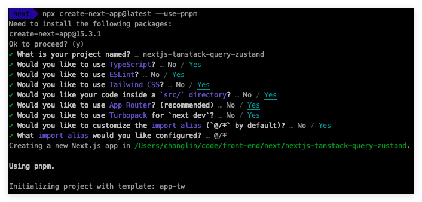
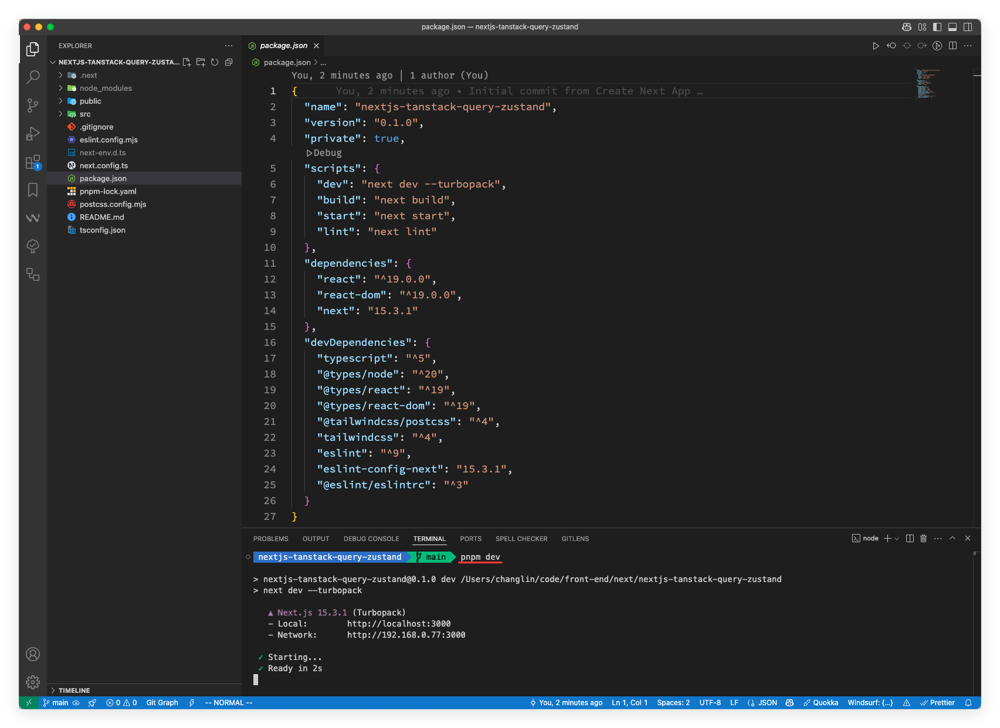
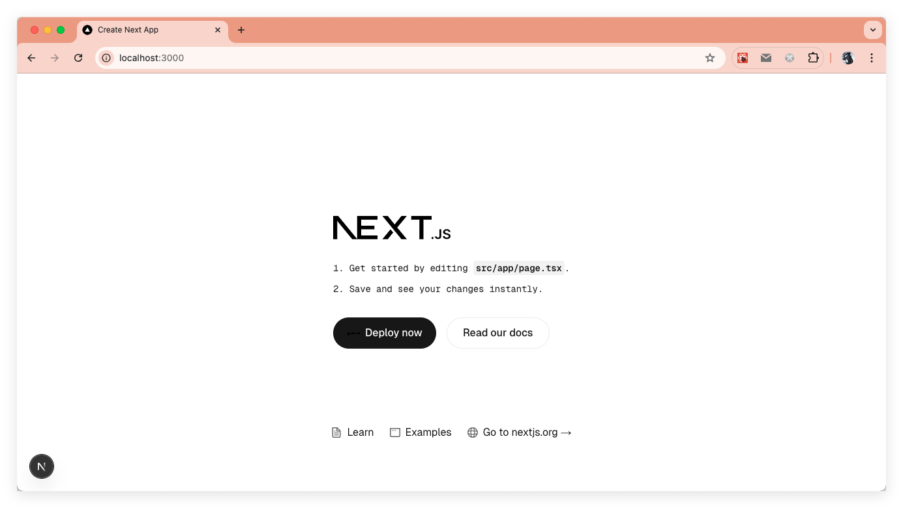
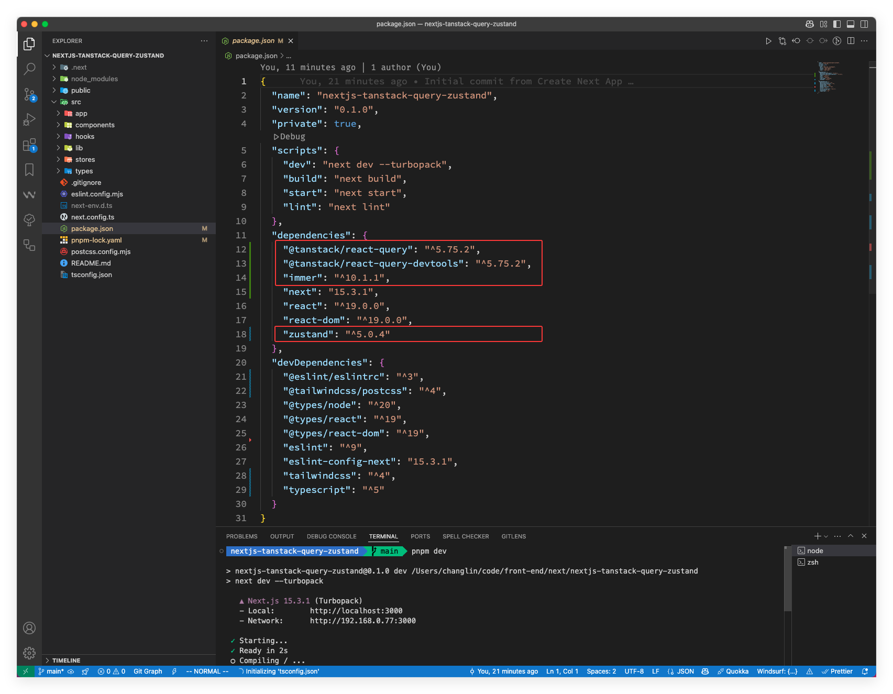
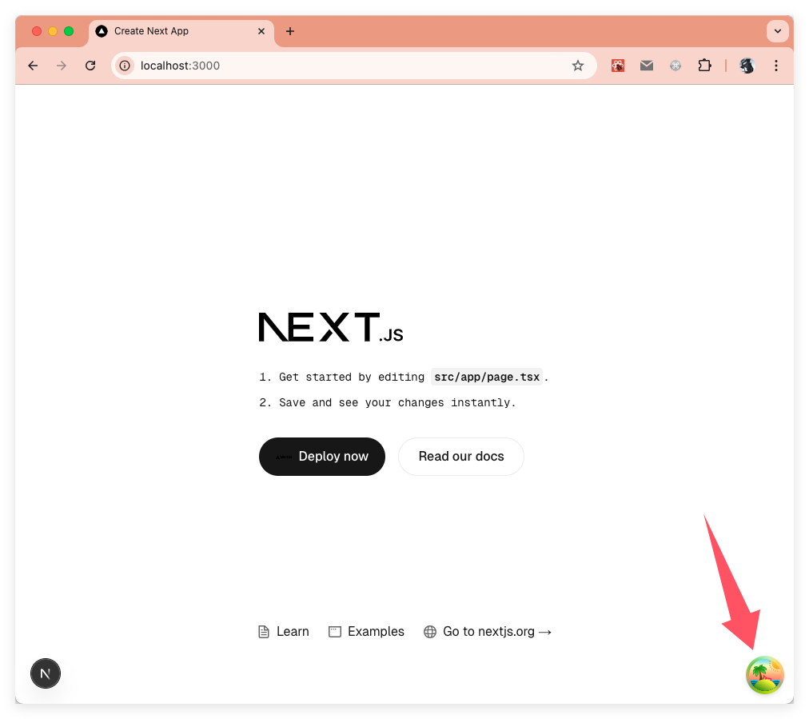
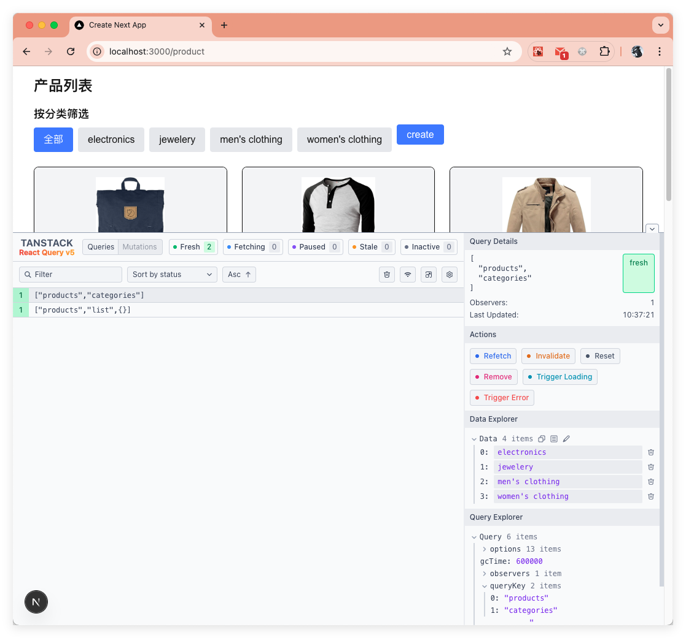

# Next.js 项目中使用 TanStack Query 和 Zustand 的完整指南

## 一、为什么选择 TanStack Query 和 Zustand

选择合适的状态管理工具对于构建高效、可维护的 Next.js 应用尤为重要。本节将从开发体验、维护成本和社区生态三个维度，详细分析为什么 TanStack Query 和 Zustand 的组合是现代 React 应用的最佳选择。我们首先探讨传统状态管理方案的局限性，然后阐述这两个库如何协同工作，为其提供更简洁、高效的状态管理解决方案。

### 传统状态管理的痛点

- **开发体验差**：Redux 等传统方案需要编写大量样板代码（`actions`、`reducers`、`dispatch`）
- **异步处理复杂**：需要引入中间件（如 `redux-thunk`、`redux-saga`）处理异步流程，额外的学习成本
- **缓存管理缺失**：需要手动实现数据缓存、失效和重新获取逻辑
- **重渲染问题**：状态更新常导致不必要的组件重渲染，需要手动优化
- **类型支持不足**：早期状态管理解决方案对 TypeScript 支持有限，需要额外配置
- **模块化障碍**：全局状态树随应用增长变得臃肿，难以拆分和维护

### TanStack Query 的开发体验优势

- **直观的 API 设计**：接近于自然语言的 API（`useQuery`、`useMutation`）降低学习门槛
- **内置异步处理**：零配置支持异步操作，无需引入额外中间件
- **自动请求状态**：内置加载、错误、成功等状态管理，减少手动状态跟踪
- **声明式数据获取**：以声明数据需求取代命令式数据获取，代码更易读
- **开箱即用的缓存**：自动处理数据缓存、重复请求去重、后台刷新等复杂逻辑
- **TypeScript 友好**：一流的类型定义和推断，自动类型安全

### Zustand 的开发体验优势

- **极简 API**：整个核心 API 仅几个函数，10分钟即可上手
- **无模板代码**：相比 Redux 减少约 80% 的样板代码
- **使用灵活**：既可用于全局状态，也适用于局部复杂状态
- **直观的状态更新**：不需要 `reducers` 和 `actions`，直接修改状态
- **原生 React Hooks**：与 React 生态无缝集成，符合现代 React 开发范式
- **渐进式采用**：可以逐步引入，而不需要全盘重构应用

### 维护成本比较

#### TanStack Query 降低维护成本方面

- **自动化数据同步**：减少手动同步服务器和 UI 状态的代码
- **内置乐观更新**：简化用户操作的即时反馈实现
- **多级缓存机制**：内置缓存策略减少不必要的数据管理代码
- **调试工具丰富**：ReactQueryDevtools 提供可视化状态观察，快速定位问题
- **清晰的数据来源**：每个查询有明确的数据来源，避免数据从哪来的混淆
- **测试友好**：组件测试更简单，可以轻松模拟查询结果

#### Zustand 降低维护成本方面

- **扁平状态结构**：避免 Redux 深层嵌套导致的维护难题
- **模块化设计**：支持状态分割和组合，可以按功能领域拆分状态
- **中间件可插拔**：按需引入功能，避免过度工程化
- **直观的调试**：可以与 Redux DevTools 集成，获得时间旅行调试能力
- **最小依赖**：核心库非常小巧（~1KB），减少依赖维护负担
- **渐进式重构**：可以与现有状态管理共存，允许逐步迁移

### 社区生态对比

#### TanStack Query 社区优势

- **活跃维护**：由 Tanner Linsley 领导的团队持续迭代，版本更新频繁
- **广泛采用**：GitHub 超过 45K+ stars（2025/05/06 统计），被众多企业级项目使用
- **丰富文档**：详尽的官方文档、示例和教程
- **框架无关**：支持 React、Vue、Svelte 等多种框架
- **社区贡献**：大量第三方插件和工具

#### Zustand 社区优势

- **快速增长**：GitHub 52K+ stars（2025/05/06 统计），增长势头强劲
- **精简文档**：简洁但覆盖全面的官方文档
- **活跃社区**：Reddit、Discord 和 Stack Overflow 上有活跃讨论
- **稳定 API**：API 相对稳定，减少版本升级带来的破坏性变更
- **良好整合**：与 React 生态系统其他库无缝配合

### 两者结合的协同优势

- **职责明确分离**：TanStack Query 专注服务器状态，Zustand 管理客户端状态
- **优势互补**：结合 TanStack Query 的数据获取能力和 Zustand 的简洁状态管理
- **减少重复逻辑**：避免在多个组件中重复实现相同的数据获取和处理逻辑
- **统一状态更新**：在服务器状态变化时一致地更新 UI
- **降低认知负担**：开发者可以清晰理解数据流向，提高团队协作效率
- **满足不同规模需求**：从小型应用到大型企业级项目都适用的解决方案

### 与 Next.js 的契合度

- **客户端组件友好**：在 Next.js 客户端组件中无缝使用两者
- **服务器端渲染兼容**：TanStack Query 对 SSR 有良好支持
- **App Router 适配**：适应 Next.js 的最新路由模式
- **零配置缓存协同**：TanStack Query 的缓存与 Next.js 数据获取机制协同工作
- **代码分割友好**：两者都是基于 hooks 的 API，与 Next.js 的动态导入兼容性好
- **渐进式增强**：可以在特定页面或组件中引入，不影响整体架构

## 二、项目设置与环境配置

按照本系列文章的惯例，在进入正题之前，我们先来准备一下相关的环境，创建一个项目便于演示后面的内容。

> - Node.js：v20.10.0
> - pnpm：10.4.1
> - OS：MacBook Pro
> - IDE：VS Code 1.99.3

使用命令 `npx create-next-app@latest --use-pnpm` 创建一个新的项目；具体的项目配置选项如下：


在 VS Code 中打开后，并运行：


上图可以看到，服务运行在 3000 端口，然后再浏览器中访问 `http://localhost:3000`:


### 依赖安装

```sh
pnpm add @tanstack/react-query zustand immer @tanstack/react-query-devtools
```

版本信息如下：


> 可能有小伙伴会疑惑，`@tanstack/react-query-devtools` 为什么不是安装开发环境依赖呢？原因是官方已经把这一块逻辑处理了，即使你安装成开发环境依赖也没问题！原文如下：  
> By default, React Query Devtools are only included in bundles when `process.env.NODE_ENV === 'development'`, so you don't need to worry about excluding them during a production build.

### 最终项目结构

```text
.
├── README.md
├── eslint.config.mjs
├── next-env.d.ts
├── next.config.ts
├── package.json
├── pnpm-lock.yaml
├── postcss.config.mjs
├── public
├── src
│   ├── app
│   ├── components
│   ├── hooks
│   ├── lib
│   ├── stores
│   ├── types
│   └── utils
└── tsconfig.json
```

最终项目地址：<https://github.com/clin211/react-next-hub/tree/main/nextjs-tanstack-query-zustand>

## 三、TanStack Query 基础使用

QueryClient 是 TanStack Query 的核心，它负责管理所有查询的缓存、状态和生命周期。以下是一个完整的配置示例：

```jsx
// src/lib/query-client.ts
import { cache } from 'react'
import { QueryClient } from '@tanstack/react-query'

export const queryClient = new QueryClient({
    defaultOptions: {
        queries: {
            // 数据保鲜时间：在这段时间内，数据被认为是"新鲜"的，不会重新获取
            staleTime: 1000 * 60 * 5, // 5分钟

            // 缓存时间：数据在缓存中保留的时间，超过后将被垃圾回收
            gcTime: 1000 * 60 * 10, // 10分钟

            // 重试次数：请求失败时自动重试的次数
            retry: 3,

            // 重试延迟：每次重试之间的延迟时间（毫秒）
            retryDelay: (attemptIndex) => Math.min(1000 * 2 ** attemptIndex, 30000),

            // 网络恢复时自动重新获取数据
            refetchOnReconnect: true,

            // 窗口重新获得焦点时重新获取数据
            refetchOnWindowFocus: 'always',

            // 组件挂载时是否重新获取数据（即使数据是新鲜的）
            refetchOnMount: false
        },
        mutations: {
            // 失败时重试次数
            retry: 2,

            // 当页面离开后是否继续进行变更操作
            throwOnError: true
        }
    }
})

// 为特定类型的查询定义默认行为
export const configureQueryClient = () => {
    // 为所有用户相关查询设置特殊缓存策略
    queryClient.setQueryDefaults(['users'], {
        staleTime: 1000 * 60 * 30, // 30分钟
        gcTime: 1000 * 60 * 60 // 1小时
    })

    // 为实时性要求高的数据配置更短的保鲜时间
    queryClient.setQueryDefaults(['notifications'], {
        staleTime: 1000 * 30, // 30秒
        refetchInterval: 1000 * 60 // 每分钟自动刷新
    })

    return queryClient
}

// 使用 React 的 cache 函数确保在 RSC 中创建单例
export const getQueryClient = cache(
    () =>
        new QueryClient({
            defaultOptions: {
                queries: {
                    // SSR友好的配置
                    staleTime: 5 * 1000, // 5秒
                    gcTime: 10 * 60 * 1000, // 10分钟

                    // 在服务器端渲染时，我们通常不希望重试，因为它会延迟页面渲染
                    retry: process.env.NODE_ENV === 'production' ? 3 : 0,

                    // 对于 SSR 和 SSG，通常需要禁用这些自动刷新选项
                    refetchOnWindowFocus: false,
                    refetchOnReconnect: false
                }
            }
        })
)

// 添加自定义请求去重逻辑
const originalFetch = window.fetch
window.fetch = async (...args) => {
    const [url, config] = args

    // 对于特定接口实现自定义缓存策略
    if (url.toString().includes('/api/frequently-accessed')) {
        const cacheKey = `${url}${config?.method || 'GET'}`
        const cachedResponse = sessionStorage.getItem(cacheKey)

        if (cachedResponse) {
            return new Response(cachedResponse, {
                status: 200,
                headers: { 'Content-Type': 'application/json' }
            })
        }

        const response = await originalFetch(...args)
        const responseClone = response.clone()
        const responseBody = await responseClone.text()

        sessionStorage.setItem(cacheKey, responseBody)
        return response
    }

    return originalFetch(...args)
}
```

下面是对其代码做解释！

### 缓存策略说明

- **staleTime vs gcTime**：
    - `staleTime`：控制数据何时被认为是过时的。新鲜数据不会自动重新获取。
    - `gcTime`：控制未使用的数据何时从缓存中移除。通常设置为比 `staleTime` 长。

- **重试策略**：
    - 默认重试 3 次，使用指数退避算法（exponential backoff）增加重试间隔。
    - 最长延迟时间设为 30 秒，防止无限增长。

### Next.js 特定考虑

在 Next.js 应用中，QueryClient 配置需要考虑服务端渲染（SSR）和客户端导航的情况：

```js
// src/lib/query-client.ts
import { cache } from 'react'
// ...其他代码

// 使用 React 的 cache 函数确保在 RSC 中创建单例
export const getQueryClient = cache(
    () =>
        new QueryClient({
            defaultOptions: {
                queries: {
                    // SSR友好的配置
                    staleTime: 5 * 1000, // 5秒
                    gcTime: 10 * 60 * 1000, // 10分钟

                    // 在服务器端渲染时，我们通常不希望重试，因为它会延迟页面渲染
                    retry: process.env.NODE_ENV === 'production' ? 3 : 0,

                    // 对于 SSR 和 SSG，通常需要禁用这些自动刷新选项
                    refetchOnWindowFocus: false,
                    refetchOnReconnect: false
                }
            }
        })
)
```

#### **处理并发和请求重复**

TanStack Query 自动处理请求重复，但有时我们需要更精细的控制：

```jsx
// src/lib/query-client.ts
export const queryClient = new QueryClient({
    defaultOptions: {
        queries: {
            // ... 其他选项 ...

            // 数据获取函数被调用前的去抖时间
            refetchInterval: false,

            // 启用查询重复数据消除
            // 当多个组件请求相同数据时，只发送一个网络请求
            networkMode: 'offlineFirst'
        }
    }
})

// 添加自定义请求去重逻辑
const originalFetch = window.fetch
window.fetch = async (...args) => {
    const [url, config] = args

    // 对于特定接口实现自定义缓存策略
    if (url.toString().includes('/api/xxx')) {
        const cacheKey = `${url}${config?.method || 'GET'}`
        const cachedResponse = sessionStorage.getItem(cacheKey)

        if (cachedResponse) {
            return new Response(cachedResponse, {
                status: 200,
                headers: { 'Content-Type': 'application/json' }
            })
        }

        const response = await originalFetch(...args)
        const responseClone = response.clone()
        const responseBody = await responseClone.text()

        sessionStorage.setItem(cacheKey, responseBody)
        return response
    }

    return originalFetch(...args)
}
```

> 更多 DevTools 的配置，可以查看 <https://tanstack.com/query/v4/docs/framework/react/devtools>！

#### 查询客户端与开发工具集成

在开发环境中，集成 ReactQueryDevtools 可以帮助调试和监控查询状态：

```jsx
// src/app/providers.tsx
'use client';

import { useState } from 'react';
import { QueryClientProvider } from '@tanstack/react-query';
import { ReactQueryDevtools } from '@tanstack/react-query-devtools';
import { queryClient } from '@/lib/query-client';

export default function Providers({ children }: { children: React.ReactNode }) {
    // 在客户端组件中创建 QueryClient 实例
    const [client] = useState(() => queryClient);

    return (
        <QueryClientProvider client={client}>
            {children}
            <ReactQueryDevtools initialIsOpen={false} />
        </QueryClientProvider>
    );
}
```

#### 在项目的根目录下引入 Provider

```jsx
// src/app/layout.tsx
import "./globals.css";
import type { Metadata } from "next";
import { Geist, Geist_Mono } from "next/font/google";
import Providers from './providers';

const geistSans = Geist({
    variable: "--font-geist-sans",
    subsets: ["latin"],
});

const geistMono = Geist_Mono({
    variable: "--font-geist-mono",
    subsets: ["latin"],
});

export const metadata: Metadata = {
    title: "Create Next App",
    description: "Generated by create next app",
};

export default async function RootLayout({
    children,
}: Readonly<{
    children: React.ReactNode;
}>) {

    return (
        <html lang="zh">
            <body
                className={`${geistSans.variable} ${geistMono.variable} antialiased`}
            >
                <Providers>{children}</Providers>
            </body>
        </html>
    );
}
```

配置完成后如下效果：


展开之后的样子(以后文的 /product 路由为例)：


### 查询提供者配置 (src/app/providers.tsx)

在使用 TanStack Query 时，我们需要在应用的顶层配置 `QueryClientProvider`，以确保所有组件都能访问查询客户端。下面是一个完整的提供者配置示例：

```jsx
// src/app/providers.tsx
'use client';

import { useState } from 'react';
import { QueryClientProvider } from '@tanstack/react-query';
import { ReactQueryDevtools } from '@tanstack/react-query-devtools';
import { queryClient } from '@/lib/query-client';

export default function Providers({ children }: { children: React.ReactNode }) {
    // 在客户端组件中创建 QueryClient 实例
    const [client] = useState(() => queryClient);

    return (
        <QueryClientProvider client={client}>
            {/* 这里可以嵌套其他提供者，如 Zustand 的上下文提供者等 */}
            {children}
            <ReactQueryDevtools initialIsOpen={false} />
        </QueryClientProvider>
    );
}
```

#### 客户端组件与服务器组件的集成

在 Next.js 的 App Router 架构中，我们需要特别注意服务器组件与客户端组件的边界：

```jsx
// src/app/with-hydration.tsx
import { dehydrate, HydrationBoundary } from '@tanstack/react-query';
import { getQueryClient } from '@/lib/query-client';
import Providers from './providers';

// 这是一个服务器组件，用于预取数据并将状态传递给客户端组件
export default async function WithHydration({
    children,
}: {
    children: React.ReactNode;
}) {
    const queryClient = getQueryClient();

    // 在服务器端预取数据 - 使用 Fake Store API
    await queryClient.prefetchQuery({
        queryKey: ['global-config'],
        queryFn: () => fetch('https://fakestoreapi.com/products/categories').then(res => res.json()),
    });

    // 序列化缓存状态
    const dehydratedState = dehydrate(queryClient);

    return (
        <HydrationBoundary state={dehydratedState}>
            <Providers>{children}</Providers>
        </HydrationBoundary>
    );
}
```

在这种配置下，服务器组件可以预取数据，然后将数据的状态传递给客户端组件，避免客户端重新获取已有数据。

### 基础查询钩子使用

现在我们开始使用 TanStack Query 的核心功能——**数据查询**。我们将使用 [Fake Store API](https://fakestoreapi.com/docs) 作为示例 API 来演示各种查询场景。

#### 封装客户端请求

首先，我们创建一个简单的 API 客户端请求，封装所有与 Fake Store API 的交互：

> 在写下面代码之前，注意先安装 axios 库！命令：`pnpm add axios`

```ts
// src/utils/fetch.ts
import axios from 'axios'

// 创建 axios 实例
export const apiClient = axios.create({
    baseURL: 'https://fakestoreapi.com',
    headers: {
        'Content-Type': 'application/json'
    }
})

// 产品相关 API
export const productsApi = {
    // 获取所有产品
    getAll: async () => {
        const { data } = await apiClient.get('/products')
        return data
    },

    // 获取单个产品
    getById: async (id: number) => {
        const { data } = await apiClient.get(`/products/${id}`)
        return data
    },

    // 获取产品分类
    getCategories: async () => {
        const { data } = await apiClient.get('/products/categories')
        return data
    },

    // 获取特定分类的产品
    getByCategory: async (category: string) => {
        const { data } = await apiClient.get(`/products/category/${category}`)
        return data
    },

    // 添加新产品
    create: async (product: any) => {
        const { data } = await apiClient.post('/products', product)
        return data
    },

    // 更新产品
    update: async (id: number, product: any) => {
        const { data } = await apiClient.put(`/products/${id}`, product)
        return data
    },

    // 删除产品
    delete: async (id: number) => {
        const { data } = await apiClient.delete(`/products/${id}`)
        return data
    }
}

// 购物车相关 API
export const cartApi = {
    // 获取用户购物车
    getUserCart: async (userId: number) => {
        const { data } = await apiClient.get(`/carts/user/${userId}`)
        return data
    },

    // 添加商品到购物车
    addToCart: async (cartItem: any) => {
        const { data } = await apiClient.post('/carts', cartItem)
        return data
    },

    // 更新购物车
    updateCart: async (id: number, cart: any) => {
        const { data } = await apiClient.put(`/carts/${id}`, cart)
        return data
    }
}

// 用户相关 API
export const userApi = {
    // 获取所有用户
    getAll: async () => {
        const { data } = await apiClient.get('/users')
        return data
    },

    // 获取单个用户
    getById: async (id: number) => {
        const { data } = await apiClient.get(`/users/${id}`)
        return data
    },

    // 用户登录
    login: async (credentials: { username: string; password: string }) => {
        const { data } = await apiClient.post('/auth/login', credentials)
        return data
    }
}

// 导出所有 API
export const api = {
    products: productsApi,
    cart: cartApi,
    user: userApi
}
```

#### **使用 useQuery 获取数据**

现在我们可以创建自定义钩子来封装查询逻辑：

```jsx
// src/hooks/queries/useProducts.ts
import { useQuery } from '@tanstack/react-query';
import { api } from '@/utils/fetch';

// 产品类型定义
export interface Product {
    id: number;
    title: string;
    price: number;
    description: string;
    category: string;
    image: string;
    rating: {
        rate: number;
        count: number;
    };
}

// 查询键设计
export const productKeys = {
    all: ['products'] as const,
    lists: () => [...productKeys.all, 'list'] as const,
    list: (filters: Record<string, any>) => [...productKeys.lists(), filters] as const,
    details: () => [...productKeys.all, 'detail'] as const,
    detail: (id: number) => [...productKeys.details(), id] as const,
    categories: () => [...productKeys.all, 'categories'] as const,
    category: (name: string) => [...productKeys.all, 'category', name] as const,
};

// 获取所有产品
export function useProducts(filters?: Record<string, any>) {
    return useQuery<Product[]>({
        queryKey: productKeys.list(filters || {}),
        queryFn: () => api.products.getAll(),
    });
}

// 获取单个产品详情
export function useProduct(id: number) {
    return useQuery<Product>({
        queryKey: productKeys.detail(id),
        queryFn: () => api.products.getById(id),
        enabled: !!id, // 只有在 id 存在时才执行查询
    });
}

// 获取产品分类
export function useProductCategories() {
    return useQuery<string[]>({
        queryKey: productKeys.categories(),
        queryFn: () => api.products.getCategories(),
        staleTime: 1000 * 60 * 60, // 分类数据一小时内保持新鲜
    });
}

// 获取特定分类的产品
export function useProductsByCategory(category: string) {
    return useQuery<Product[]>({
        queryKey: productKeys.category(category),
        queryFn: () => api.products.getByCategory(category),
        enabled: !!category, // 只有在分类名存在时才执行查询
    });
}
```

#### **在组件中使用查询钩子**

现在让我们创建一个产品列表组件，展示如何在实际组件中使用这些查询钩子：

```jsx
// src/components/ProductList.tsx
'use client'

import { useState } from 'react'
import { useProducts, useProductCategories, useProductsByCategory } from '@/hooks/queries/useProducts'

export default function ProductList() {
    const [selectedCategory, setSelectedCategory] = useState < string > ''

    // 获取产品分类
    const { data: categories, isLoading: isCategoriesLoading, error: categoriesError } = useProductCategories()

    // 根据是否选择分类决定使用哪个查询
    const { data: products, isLoading: isProductsLoading, error: productsError, isRefetching } = selectedCategory ? useProductsByCategory(selectedCategory) : useProducts()

    // 加载状态处理
    if (isCategoriesLoading || isProductsLoading) {
        return <div className="p-4">正在加载产品数据...</div>
    }

    // 错误状态处理
    if (categoriesError || productsError) {
        return (
            <div className="p-4 text-red-500">
                加载数据时出错：
                {categoriesError?.message || productsError?.message}
            </div>
        )
    }

    return (
        <div className="container mx-auto p-4">
            <h1 className="text-2xl font-bold mb-4">产品列表</h1>

            {/* 分类筛选 */}
            <div className="mb-6">
                <h2 className="text-lg font-semibold mb-2">按分类筛选</h2>
                <div className="flex flex-wrap gap-2">
                    <button className={`px-4 py-2 rounded ${!selectedCategory ? 'bg-blue-500 text-white' : 'bg-gray-200'}`} onClick={() => setSelectedCategory('')}>
                        全部
                    </button>
                    {categories?.map((category) => (
                        <button key={category} className={`px-4 py-2 rounded ${selectedCategory === category ? 'bg-blue-500 text-white' : 'bg-gray-200'}`} onClick={() => setSelectedCategory(category)}>
                            {category}
                        </button>
                    ))}
                </div>
            </div>

            {/* 正在刷新的指示器 */}
            {isRefetching && <div className="mb-4 text-blue-500">正在更新数据...</div>}

            {/* 产品网格 */}
            <div className="grid grid-cols-1 md:grid-cols-2 lg:grid-cols-3 xl:grid-cols-4 gap-6">
                {products?.map((product) => (
                    <div key={product.id} className="border rounded-lg overflow-hidden shadow-sm hover:shadow-md transition-shadow">
                        <div className="h-48 overflow-hidden bg-gray-100 flex items-center justify-center">
                            
                        </div>
                        <div className="p-4">
                            <h3 className="font-semibold text-lg mb-1 line-clamp-2" title={product.title}>
                                {product.title}
                            </h3>
                            <p className="text-gray-700 mb-2 line-clamp-3" title={product.description}>
                                {product.description}
                            </p>
                            <div className="flex justify-between items-center">
                                <span className="text-lg font-bold text-blue-600">${product.price}</span>
                                <div className="flex items-center">
                                    <span className="text-yellow-500">★</span>
                                    <span className="ml-1">{product.rating.rate}</span>
                                    <span className="ml-1 text-gray-500">({product.rating.count})</span>
                                </div>
                            </div>
                        </div>
                    </div>
                ))}
            </div>

            {/* 无数据状态 */}
            {products?.length === 0 && <div className="text-center py-8 text-gray-500">没有找到相关产品</div>}
        </div>
    )
}
```

每个 tab 下的数据都有缓存，效果如下：


整个功能块包括以下内容：

- 获取产品分类数据
- 根据是否选择分类决定使用哪个查询来获取产品数据
- 处理加载状态、错误状态和无数据状态
- 渲染产品分类筛选按钮
- 渲染产品网格，包括产品图片、标题、描述、价格和评分
- 提供正在更新数据的指示器
- useQuery 基础用法
- 查询键设计策略
- 处理加载和错误状态
- 依赖查询和条件查询

### 数据变更与提交

除了数据获取外，TanStack Query 还提供了强大的数据变更能力。使用 `useMutation` 钩子可以实现添加、更新和删除产品等操作。

#### useMutation 基本用法

创建一个自定义的变更钩子，用于添加新产品：

```jsx
// src/hooks/mutations/useProductMutations.ts
import { useMutation, useQueryClient } from '@tanstack/react-query';
import { api } from '@/utils/fetch';
import { Product, productKeys } from '@/hooks/queries/useProducts';

// 添加新产品
export function useAddProduct() {
    const queryClient = useQueryClient();

    return useMutation({
        // 变更函数
        mutationFn: (newProduct: Omit<Product, 'id'>) => {
            return api.products.create(newProduct);
        },
        // 变更成功后的回调
        onSuccess: (data) => {
            // 让包含产品列表的查询失效，触发重新获取
            queryClient.invalidateQueries({ queryKey: productKeys.lists() });
            // 可以显示成功通知或执行其他操作
            console.log('产品添加成功:', data);
        },
        // 变更失败后的回调
        onError: (error) => {
            // 可以显示错误通知
            console.error('添加产品时出错:', error);
        }
    });
}

// 更新产品
export function useUpdateProduct() {
    const queryClient = useQueryClient();

    return useMutation({
        mutationFn: ({ id, product }: { id: number, product: Partial<Product> }) => {
            return api.products.update(id, product);
        },
        onSuccess: (data, variables) => {
            // 更新产品详情缓存
            queryClient.invalidateQueries({
                queryKey: productKeys.detail(variables.id)
            });
            // 更新可能包含此产品的列表
            queryClient.invalidateQueries({
                queryKey: productKeys.lists()
            });
        }
    });
}

// 删除产品
export function useDeleteProduct() {
    const queryClient = useQueryClient();

    return useMutation({
        mutationFn: (id: number) => {
            return api.products.delete(id);
        },
        onSuccess: (_, id) => {
            // 从缓存中移除此产品
            queryClient.removeQueries({ queryKey: productKeys.detail(id) });
            // 让产品列表重新获取
            queryClient.invalidateQueries({ queryKey: productKeys.lists() });
        }
    });
}
```

在组件中使用变更钩子：

```jsx
// src/components/ProductForm.tsx
'use client';

import { useState } from 'react';
import { useAddProduct } from '@/hooks/mutations/useProductMutations';

export default function ProductForm() {
    const [title, setTitle] = useState('');
    const [price, setPrice] = useState('');
    const [description, setDescription] = useState('');
    const [category, setCategory] = useState('');
    const [image, setImage] = useState('');

    // 使用变更钩子
    const addProductMutation = useAddProduct();

    const handleSubmit = (e: React.FormEvent) => {
        e.preventDefault();

        // 创建新产品对象
        const newProduct = {
            title,
            price: parseFloat(price),
            description,
            category,
            image,
            rating: { rate: 0, count: 0 }
        };

        // 调用变更函数
        addProductMutation.mutate(newProduct, {
            onSuccess: () => {
                // 重置表单
                setTitle('');
                setPrice('');
                setDescription('');
                setCategory('');
                setImage('');
            }
        });
    };

    return (
        <div className="max-w-2xl mx-auto p-4">
            <h2 className="text-2xl font-bold mb-4">添加新产品</h2>

            {/* 显示变更状态 */}
            {addProductMutation.isPending && (
                <div className="mb-4 text-blue-500">
                    正在添加产品...
                </div>
            )}

            {addProductMutation.isError && (
                <div className="mb-4 text-red-500">
                    添加失败: {addProductMutation.error.message}
                </div>
            )}

            {addProductMutation.isSuccess && (
                <div className="mb-4 text-green-500">
                    产品添加成功!
                </div>
            )}

            <form onSubmit={handleSubmit} className="space-y-4">
                <div>
                    <label className="block text-sm font-medium mb-1">产品名称</label>
                    <input
                        type="text"
                        value={title}
                        onChange={(e) => setTitle(e.target.value)}
                        required
                        className="w-full p-2 border rounded"
                    />
                </div>

                <div>
                    <label className="block text-sm font-medium mb-1">价格</label>
                    <input
                        type="number"
                        value={price}
                        onChange={(e) => setPrice(e.target.value)}
                        step="0.01"
                        min="0"
                        required
                        className="w-full p-2 border rounded"
                    />
                </div>

                <div>
                    <label className="block text-sm font-medium mb-1">描述</label>
                    <textarea
                        value={description}
                        onChange={(e) => setDescription(e.target.value)}
                        required
                        className="w-full p-2 border rounded"
                        rows={3}
                    />
                </div>

                <div>
                    <label className="block text-sm font-medium mb-1">分类</label>
                    <input
                        type="text"
                        value={category}
                        onChange={(e) => setCategory(e.target.value)}
                        required
                        className="w-full p-2 border rounded"
                    />
                </div>

                <div>
                    <label className="block text-sm font-medium mb-1">图片 URL</label>
                    <input
                        type="url"
                        value={image}
                        onChange={(e) => setImage(e.target.value)}
                        required
                        className="w-full p-2 border rounded"
                    />
                </div>

                <div>
                    <button
                        type="submit"
                        className="px-4 py-2 bg-blue-500 text-white rounded hover:bg-blue-600 disabled:bg-blue-300"
                        disabled={addProductMutation.isPending}
                    >
                        {addProductMutation.isPending ? '提交中...' : '添加产品'}
                    </button>
                </div>
            </form>
        </div>
    );
}
```

#### 乐观更新实现

乐观更新是一种提高用户体验的技术，它在服务器响应之前就假设操作会成功并更新 UI。以下是一个使用乐观更新实现购物车功能的示例：

```jsx
// src/hooks/mutations/useCartMutations.ts
import { useMutation, useQueryClient } from '@tanstack/react-query';
import { api } from '@/utils/fetch';

// 购物车项类型
export interface CartItem {
    productId: number;
    quantity: number;
}

// 购物车类型
export interface Cart {
    id?: number;
    userId: number;
    date: string;
    products: CartItem[];
}

// 查询键
export const cartKeys = {
    all: ['carts'] as const,
    user: (userId: number) => [...cartKeys.all, 'user', userId] as const,
    detail: (cartId: number) => [...cartKeys.all, 'detail', cartId] as const,
};

// 添加商品到购物车
export function useAddToCart(userId: number) {
    const queryClient = useQueryClient();

    return useMutation({
        mutationFn: (item: CartItem) => {
            const cartData: Cart = {
                userId,
                date: new Date().toISOString(),
                products: [item],
            };
            return api.cart.addToCart(cartData);
        },

        // 乐观更新
        onMutate: async (newItem) => {
            // 取消正在进行的重新获取
            await queryClient.cancelQueries({ queryKey: cartKeys.user(userId) });

            // 获取当前数据的快照
            const previousCarts = queryClient.getQueryData<Cart[]>(cartKeys.user(userId));

            // 乐观地更新缓存
            if (previousCarts) {
                queryClient.setQueryData<Cart[]>(cartKeys.user(userId), (old = []) => {
                    // 检查是否存在购物车
                    if (old.length === 0) {
                        // 如果不存在，创建一个新的购物车
                        return [{
                            id: Date.now(), // 临时 ID
                            userId,
                            date: new Date().toISOString(),
                            products: [newItem],
                        }];
                    }

                    // 如果存在，更新最新的购物车
                    const latestCart = { ...old[0] };

                    // 检查商品是否已经在购物车中
                    const existingProductIndex = latestCart.products.findIndex(
                        p => p.productId === newItem.productId
                    );

                    if (existingProductIndex >= 0) {
                        // 如果已存在，更新数量
                        latestCart.products[existingProductIndex].quantity += newItem.quantity;
                    } else {
                        // 如果不存在，添加新商品
                        latestCart.products.push(newItem);
                    }

                    return [latestCart, ...old.slice(1)];
                });
            }

            // 返回上下文对象，用于错误回滚
            return { previousCarts };
        },

        // 错误回滚
        onError: (_, __, context) => {
            if (context?.previousCarts) {
                queryClient.setQueryData(cartKeys.user(userId), context.previousCarts);
            }
        },

        // 操作完成后
        onSettled: () => {
            // 无论成功还是失败，都重新获取购物车数据
            queryClient.invalidateQueries({ queryKey: cartKeys.user(userId) });
        },
    });
}
```

在产品详情页中使用乐观更新的购物车功能：

```jsx
// src/components/AddToCart.tsx
'use client';

import { useState } from 'react';
import { useAddToCart } from '@/hooks/mutations/useCartMutations';
import { Product } from '@/hooks/queries/useProducts';

interface AddToCartProps {
    product: Product;
    userId: number;
}

export default function AddToCart({ product, userId }: AddToCartProps) {
    const [quantity, setQuantity] = useState(1);
    const addToCartMutation = useAddToCart(userId);

    const handleAddToCart = () => {
        addToCartMutation.mutate({
            productId: product.id,
            quantity,
        });
    };

    return (
        <div className="mt-4">
            <div className="flex items-center space-x-2 mb-2">
                <button
                    className="px-2 py-1 border rounded"
                    onClick={() => setQuantity(prev => Math.max(1, prev - 1))}
                >
                    -
                </button>
                <span className="w-8 text-center">{quantity}</span>
                <button
                    className="px-2 py-1 border rounded"
                    onClick={() => setQuantity(prev => prev + 1)}
                >
                    +
                </button>
            </div>

            <button
                className="w-full py-2 bg-blue-500 text-white rounded hover:bg-blue-600 disabled:bg-blue-300"
                onClick={handleAddToCart}
                disabled={addToCartMutation.isPending}
            >
                {addToCartMutation.isPending ? '添加中...' : '加入购物车'}
            </button>

            {/* 操作状态提示 */}
            {addToCartMutation.isSuccess && (
                <div className="mt-2 text-green-500 text-sm">
                    成功添加到购物车！
                </div>
            )}

            {addToCartMutation.isError && (
                <div className="mt-2 text-red-500 text-sm">
                    添加失败: {addToCartMutation.error.message}
                </div>
            )}
        </div>
    );
}
```

#### **错误回滚处理**

错误回滚是乐观更新的重要组成部分。当操作失败时，我们需要将状态恢复到之前的状态。以下是一个更复杂的示例，展示如何在删除产品时实现错误回滚(src/hooks/mutations/useProductMutations.ts 中的增强版 `useDeleteProduct`)：

```js
// src/hooks/mutations/useProductMutations.ts
// 删除产品
export function useDeleteProduct() {
    const queryClient = useQueryClient();

    return useMutation({
        mutationFn: (id: number) => {
            return api.products.delete(id);
        },

        // 乐观更新
        onMutate: async (id) => {
            // 取消正在进行的查询
            await queryClient.cancelQueries({ queryKey: productKeys.detail(id) });
            await queryClient.cancelQueries({ queryKey: productKeys.lists() });

            // 保存当前产品详情
            const previousProduct = queryClient.getQueryData<Product>(
                productKeys.detail(id)
            );

            // 保存当前产品列表
            const previousProducts = queryClient.getQueryData<Product[]>(
                productKeys.list({})
            );

            // 从产品详情缓存中移除产品
            queryClient.setQueryData(productKeys.detail(id), null);

            // 从产品列表缓存中移除产品
            if (previousProducts) {
                queryClient.setQueryData<Product[]>(
                    productKeys.list({}),
                    previousProducts.filter(product => product.id !== id)
                );
            }

            // 返回上下文对象，包含之前的状态
            return { previousProduct, previousProducts };
        },

        // 错误回滚
        onError: (_, id, context) => {
            // 恢复产品详情
            if (context?.previousProduct) {
                queryClient.setQueryData(
                    productKeys.detail(id),
                    context.previousProduct
                );
            }

            // 恢复产品列表
            if (context?.previousProducts) {
                queryClient.setQueryData(
                    productKeys.list({}),
                    context.previousProducts
                );
            }
        },

        // 操作完成后
        onSettled: (_, __, id) => {
            // 无论成功还是失败，都重新验证查询
            queryClient.invalidateQueries({ queryKey: productKeys.detail(id) });
            queryClient.invalidateQueries({ queryKey: productKeys.lists() });
        }
    });
}
```

#### 成功后的缓存更新

除了让查询失效外，我们还可以在变更成功后直接更新缓存，避免额外的网络请求。以下是一个更新产品评分的例子：

```jsx
// src/hooks/mutations/useRateProduct.ts
import { useMutation, useQueryClient } from '@tanstack/react-query';
import { Product, productKeys } from '@/hooks/queries/useProducts';

interface RatingData {
    productId: number;
    rating: number;
}

// 模拟 API 调用
const rateProductApi = async (data: RatingData) => {
    // 在实际应用中，这里会是一个真实的 API 调用
    await new Promise(resolve => setTimeout(resolve, 500));
    return { success: true, productId: data.productId, rating: data.rating };
};

export function useRateProduct() {
    const queryClient = useQueryClient();

    return useMutation({
        mutationFn: (data: RatingData) => rateProductApi(data),

        onSuccess: (result, variables) => {
            // 获取当前产品数据
            const currentProduct = queryClient.getQueryData<Product>(
                productKeys.detail(variables.productId)
            );

            if (currentProduct) {
                // 直接更新缓存中的产品评分
                const updatedProduct = {
                    ...currentProduct,
                    rating: {
                        ...currentProduct.rating,
                        rate: (currentProduct.rating.rate * currentProduct.rating.count + variables.rating) /
                            (currentProduct.rating.count + 1),
                        count: currentProduct.rating.count + 1
                    }
                };

                // 设置更新后的产品详情
                queryClient.setQueryData(
                    productKeys.detail(variables.productId),
                    updatedProduct
                );

                // 更新产品列表中的对应产品
                queryClient.setQueriesData<Product[]>(
                    { queryKey: productKeys.lists(), exact: false },
                    (oldData) => {
                        if (!oldData) return undefined;

                        return oldData.map(product =>
                            product.id === variables.productId ? updatedProduct : product
                        );
                    }
                );
            }
        }
    });
}
```

产品评分组件示例：

```jsx
// src/components/RateProduct.tsx
'use client';

import { useState } from 'react';
import { useRateProduct } from '@/hooks/mutations/useRateProduct';

interface RateProductProps {
    productId: number;
    currentRating: number;
}

export default function RateProduct({ productId, currentRating }: RateProductProps) {
    const [rating, setRating] = useState(0);
    const [hover, setHover] = useState(0);
    const rateProductMutation = useRateProduct();

    const handleRating = () => {
        if (rating === 0) return;

        rateProductMutation.mutate({
            productId,
            rating
        });
    };

    return (
        <div className="mt-4">
            <p className="text-sm font-medium mb-1">为这个产品评分:</p>

            <div className="flex items-center mb-2">
                {[1, 2, 3, 4, 5].map((star) => (
                    <button
                        key={star}
                        type="button"
                        className="text-2xl focus:outline-none"
                        onClick={() => setRating(star)}
                        onMouseEnter={() => setHover(star)}
                        onMouseLeave={() => setHover(0)}
                    >
                        <span className={
                            (hover || rating) >= star
                                ? "text-yellow-400"
                                : "text-gray-300"
                        }>
                            ★
                        </span>
                    </button>
                ))}
                <span className="ml-2 text-sm text-gray-600">
                    {rating > 0 ? `${rating} 星` : "请选择评分"}
                </span>
            </div>

            <button
                className="px-4 py-1 bg-blue-500 text-white rounded text-sm disabled:bg-blue-300"
                onClick={handleRating}
                disabled={rating === 0 || rateProductMutation.isPending}
            >
                {rateProductMutation.isPending ? '提交中...' : '提交评分'}
            </button>

            {rateProductMutation.isSuccess && (
                <div className="mt-2 text-green-500 text-sm">
                    感谢您的评分！
                </div>
            )}
        </div>
    );
}
```

通过以上示例，我们展示了 TanStack Query 的 `useMutation` 钩子在不同场景下的使用方法，包括基本用法、乐观更新、错误回滚和缓存更新。这些技术可以极大地提升用户体验，让应用响应更加迅速，同时保持数据的一致性。

## 四、Zustand 基础使用

Zustand 是一个轻量级的状态管理库，专为 React 应用设计，以其简单的 API 和高性能而闻名。与 Redux 等传统状态管理方案相比，Zustand 几乎没有样板代码，同时保持了强大的功能和灵活性。

### 创建基础存储 (src/stores/useStore.ts)

Zustand 的核心是创建一个状态存储，它包含状态和修改状态的方法。以下是一个基础存储的完整示例：

```js
// src/stores/useCounterStore.ts
import { create } from 'zustand';

// 1. 定义状态结构
interface CounterState {
    count: number;
}

// 2. 定义操作方法
interface CounterAction {
    increment: () => void;
    decrement: () => void;
    reset: () => void;
    incrementBy: (value: number) => void;

}

// 3. 创建存储
const useCounterStore = create<CounterState & CounterAction>((set) => ({
    // 初始状态
    count: 0,

    // 状态操作方法
    increment: () => set((state) => ({ count: state.count + 1 })),
    decrement: () => set((state) => ({ count: state.count - 1 })),
    reset: () => set({ count: 0 }),
    incrementBy: (value) => set((state) => ({ count: state.count + value })),
}));

export default useCounterStore;
```

> 上面的 State 和 Action 也可以定义在一起，这里分开定义便于后期管理！

#### 状态结构设计原则

在设计 Zustand 存储时，应遵循以下原则：

1. **保持扁平结构**：避免过深的嵌套，这有助于简化状态更新逻辑
2. **状态与行为共存**：在同一个存储中定义状态和操作方法
3. **单一职责**：每个存储应专注于应用的一个特定方面

#### TypeScript 类型安全

Zustand 对 TypeScript 提供了一流的支持，使用泛型来确保类型安全：

```jsx
// src/stores/useUserStore.ts
import { create } from 'zustand';

// 用户类型定义
interface User {
    id: string;
    name: string;
    email: string;
    role: 'admin' | 'user';
    preferences: {
        theme: 'light' | 'dark';
        notifications: boolean;
    };
}

// 用户存储状态类型
interface UserState {
    user: User | null;
    isLoading: boolean;
    error: string | null;
}

interface UserAction {
    // 操作方法
    setUser: (user: User | null) => void;
    updatePreferences: (preferences: Partial<User['preferences']>) => void;
    setLoading: (isLoading: boolean) => void;
    setError: (error: string | null) => void;
    logout: () => void;
}

// 创建用户存储
const useUserStore = create<UserState & UserAction>((set) => ({
    user: null,
    isLoading: false,
    error: null,

    setUser: (user) => set({ user, error: null }),
    updatePreferences: (preferences) =>
        set((state) => ({
            user: state.user
                ? {
                    ...state.user,
                    preferences: { ...state.user.preferences, ...preferences }
                }
                : null
        })),
    setLoading: (isLoading) => set({ isLoading }),
    setError: (error) => set({ error }),
    logout: () => set({ user: null }),
}));

export default useUserStore;
```

#### 高级状态初始化

有时我们需要以更复杂的方式初始化状态，例如基于环境变量或浏览器存储：

```jsx
// src/stores/useSettingsStore.ts
import { create } from 'zustand';

interface SettingsState {
    apiUrl: string;
    timeout: number;
    debug: boolean;

    updateSettings: (settings: Partial<Omit<SettingsState, 'updateSettings'>>) => void;
}

// 环境特定初始化逻辑
const getInitialSettings = () => {
    const isProd = process.env.NODE_ENV === 'production';

    return {
        apiUrl: isProd
            ? 'https://api.example.com/v1'
            : 'http://localhost:3001/api',
        timeout: isProd ? 10000 : 3000,
        debug: !isProd,
    };
};

export const useSettingsStore = create<SettingsState>((set) => {
    const initialSettings = getInitialSettings();

    return {
        ...initialSettings,
        updateSettings: (newSettings) => set((state) => ({
            ...state,
            ...newSettings,
        })),
    };
});
```

### 状态切片与组合

随着应用规模增长，将所有状态放在单一存储中会导致维护困难。Zustand 提供了优雅的方式来拆分和组合状态。

#### 模块化状态设计

将状态按功能领域分割成独立的"切片"：

```jsx
// src/stores/slices/authSlice.ts
import { StateCreator } from 'zustand';

// 认证状态切片
export interface AuthSlice {
    token: string | null;
    isAuthenticated: boolean;
    login: (token: string) => void;
    logout: () => void;
}

export const createAuthSlice: StateCreator<AuthSlice> = (set) => ({
    token: null,
    isAuthenticated: false,

    login: (token) => set({ token, isAuthenticated: true }),
    logout: () => set({ token: null, isAuthenticated: false }),
});
```

```jsx
// src/stores/slices/themeSlice.ts
import { StateCreator } from 'zustand';

// 主题状态切片
export interface ThemeSlice {
    theme: 'light' | 'dark';
    toggleTheme: () => void;
    setTheme: (theme: 'light' | 'dark') => void;
}

export const createThemeSlice: StateCreator<ThemeSlice> = (set) => ({
    theme: 'light',

    toggleTheme: () => set((state) => ({
        theme: state.theme === 'light' ? 'dark' : 'light'
    })),

    setTheme: (theme) => set({ theme }),
});
```

#### 状态组合策略

然后将这些切片组合成一个完整的存储：

```jsx
// src/stores/useAppStore.ts
import { create } from 'zustand';
import { AuthSlice, createAuthSlice } from './slices/authSlice';
import { ThemeSlice, createThemeSlice } from './slices/themeSlice';

// 组合多个切片的类型
interface AppState extends AuthSlice, ThemeSlice { }

// 创建组合存储
export const useAppStore = create<AppState>((...a) => ({
    ...createAuthSlice(...a),
    ...createThemeSlice(...a),
}));
```

使用这种模式的优势：

- 将相关状态和逻辑组织在一起
- 根据需要组合不同的切片
- 独立测试各个切片
- 在大型团队中并行开发不同状态域

#### 避免状态耦合

当不同切片需要交互时，应避免直接依赖，而是通过设计良好的接口通信：

```jsx
// src/stores/slices/userPreferencesSlice.ts
import { StateCreator } from 'zustand';
import { ThemeSlice } from './themeSlice';

// 用户偏好切片（依赖主题切片）
export interface UserPreferencesSlice {
    fontSize: 'small' | 'medium' | 'large';
    useSystemTheme: boolean;
    toggleSystemTheme: () => void;
    setFontSize: (size: 'small' | 'medium' | 'large') => void;
}

// 使用 StateCreator 的函数式组合能力
export const createUserPreferencesSlice: StateCreator<
    UserPreferencesSlice & ThemeSlice,
    [],
    [],
    UserPreferencesSlice
> = (set, get) => ({
    fontSize: 'medium',
    useSystemTheme: false,

    toggleSystemTheme: () => {
        const useSystemTheme = !get().useSystemTheme;
        set({ useSystemTheme });

        // 如果启用系统主题，则设置主题（通过访问 ThemeSlice）
        if (useSystemTheme) {
            const systemTheme = window.matchMedia('(prefers-color-scheme: dark)').matches
                ? 'dark'
                : 'light';
            get().setTheme(systemTheme);
        }
    },

    setFontSize: (fontSize) => set({ fontSize }),
});
```

这种方式使得切片间的关系更加明确，同时保持了各自的独立性。

### 在组件中使用状态

Zustand 的使用非常简单，但有几种模式可以优化性能和可维护性。

#### 基本状态访问

最简单的使用方式是直接调用 hook 并解构所需状态：

```jsx
// src/components/Counter.tsx
'use client'

import useCounterStore from '@/stores/useCounterStore'

export default function Counter() {
    // 直接从存储中获取状态和方法
    const { count, increment, decrement, reset } = useCounterStore()

    return (
        <div className="p-4 border rounded-lg">
            <h2 className="text-xl font-bold mb-4">计数器</h2>
            <p className="text-3xl text-center mb-4">{count}</p>
            <div className="flex gap-2 justify-center">
                <button onClick={decrement} className="px-4 py-2 bg-red-500 text-white rounded">
                    减少
                </button>
                <button onClick={reset} className="px-4 py-2 bg-gray-500 text-white rounded">
                    重置
                </button>
                <button onClick={increment} className="px-4 py-2 bg-green-500 text-white rounded">
                    增加
                </button>
            </div>
        </div>
    )
}
```

#### 选择器函数优化

直接解构整个存储可能导致不必要的重渲染。使用选择器函数可以只订阅特定状态：

```jsx
// src/components/UserProfile.tsx
'use client'

import useUserStore from '@/stores/useUserStore'

export default function UserProfile() {
    // 使用选择器只获取需要的状态，避免不必要的重渲染
    const user = useUserStore((state) => state.user)
    const isLoading = useUserStore((state) => state.isLoading)
    const error = useUserStore((state) => state.error)
    const logout = useUserStore((state) => state.logout)
    const updatePreferences = useUserStore((state) => state.updatePreferences)

    if (isLoading) return <div>加载中...</div>
    if (error) return <div className="text-red-500">错误: {error}</div>
    if (!user) return <div>未登录</div>

    return (
        <div className="p-4 border rounded-lg">
            <h2 className="text-xl font-bold mb-4">用户资料</h2>
            <div className="mb-4">
                <p>
                    <strong>名称:</strong> {user.name}
                </p>
                <p>
                    <strong>邮箱:</strong> {user.email}
                </p>
                <p>
                    <strong>角色:</strong> {user.role}
                </p>
            </div>

            <h3 className="text-lg font-semibold mb-2">偏好设置</h3>
            <div className="mb-4">
                <div className="flex items-center mb-2">
                    <label className="mr-2">深色模式:</label>
                    <input
                        type="checkbox"
                        checked={user.preferences.theme === 'dark'}
                        onChange={(e) =>
                            updatePreferences({
                                theme: e.target.checked ? 'dark' : 'light'
                            })
                        }
                    />
                </div>
                <div className="flex items-center">
                    <label className="mr-2">通知:</label>
                    <input
                        type="checkbox"
                        checked={user.preferences.notifications}
                        onChange={(e) =>
                            updatePreferences({
                                notifications: e.target.checked
                            })
                        }
                    />
                </div>
            </div>

            <button onClick={logout} className="px-4 py-2 bg-red-500 text-white rounded">
                退出登录
            </button>
        </div>
    )
}
```

#### 多选择器合并

当需要使用多个状态值时，可以使用一个选择器合并它们，以减少组件重渲染：

```jsx
// src/components/ThemeSettings.tsx
import { create } from 'zustand';
import { AuthSlice, createAuthSlice } from '@/stores/slices/authSlice';
import { ThemeSlice, createThemeSlice } from '@/stores/slices/themeSlice';

// 组合多个切片的类型
interface AppState extends AuthSlice, ThemeSlice { }

// 创建组合存储
const useAppStore = create<AppState>((...a) => ({
    ...createAuthSlice(...a),
    ...createThemeSlice(...a),
}));

export default useAppStore;
```

#### 状态更新模式

Zustand 提供了几种更新状态的模式：

1. **直接替换**：最简单的方式，适用于简单状态

    ```jsx
    set({ count: 0 })
    ```

2. **基于当前状态更新**：使用函数形式，可以访问当前状态

    ```jsx
    set((state) => ({ count: state.count + 1 }))
    ```

3. **部分更新**：只更新特定字段，保留其他字段

    ```jsx
    set((state) => ({ ...state, onlyThisFieldChanges: true }))
    ```

4. **深层嵌套更新**：使用展开语法更新嵌套状态

    ```jsx
    set((state) => ({
        user: {
            ...state.user,
            preferences: {
                ...state.user?.preferences,
                theme: 'dark'
            }
        }
    }))
    ```

#### 避免不必要渲染的高级技巧

1. **使用自定义 hooks 封装状态访问**：

    ```jsx
    // src/hooks/useTheme.ts
    import useAppStore from '@/stores/useAppStore'

    export function useTheme() {
        const theme = useAppStore((state) => state.theme)
        const toggleTheme = useAppStore((state) => state.toggleTheme)
        const setTheme = useAppStore((state) => state.setTheme)

        return { theme, toggleTheme, setTheme }
    }
    ```

2. **使用 `useCallback` 进一步优化选择器**：

    ```jsx
    // src/components/OptimizedComponent.tsx
    'use client';

    import { useCallback } from 'react';
    import { useAppStore } from '@/stores/useAppStore';

    export default function OptimizedComponent() {
        // 使用 useCallback 创建稳定的选择器
        const selectUser = useCallback((state: any) => state.user, []);
        const user = useAppStore(selectUser);

        // 组件内容...
    }
    ```

### 使用中间件增强功能

Zustand 中间件系统允许扩展存储功能，添加持久化、日志、不可变更新等功能。

#### **immer 中间件简化状态更新**

当处理嵌套状态时，Immer 可以极大简化更新逻辑：

```ts
// src/stores/useTaskStore.ts
import { create } from 'zustand'
import { immer } from 'zustand/middleware/immer'

interface Task {
    id: string
    title: string
    completed: boolean
    tags: string[]
    subtasks: {
        id: string
        title: string
        completed: boolean
    }[]
}

interface TaskState {
    tasks: Task[]
    addTask: (task: Omit<Task, 'id'>) => void
    removeTask: (id: string) => void
    toggleTaskCompleted: (id: string) => void
    addSubtask: (taskId: string, subtaskTitle: string) => void
    toggleSubtaskCompleted: (taskId: string, subtaskId: string) => void
    addTagToTask: (taskId: string, tag: string) => void
}

export const useTaskStore = create<TaskState>()(
    immer((set) => ({
        tasks: [],

        addTask: (taskData) =>
            set((state) => {
                state.tasks.push({
                    ...taskData,
                    id: Date.now().toString()
                })
            }),

        removeTask: (id) =>
            set((state) => {
                const index = state.tasks.findIndex((task) => task.id === id)
                if (index !== -1) {
                    state.tasks.splice(index, 1)
                }
            }),

        toggleTaskCompleted: (id) =>
            set((state) => {
                const task = state.tasks.find((t) => t.id === id)
                if (task) {
                    task.completed = !task.completed
                }
            }),

        addSubtask: (taskId, subtaskTitle) =>
            set((state) => {
                const task = state.tasks.find((t) => t.id === taskId)
                if (task) {
                    task.subtasks.push({
                        id: Date.now().toString(),
                        title: subtaskTitle,
                        completed: false
                    })
                }
            }),

        toggleSubtaskCompleted: (taskId, subtaskId) =>
            set((state) => {
                const task = state.tasks.find((t) => t.id === taskId)
                if (task) {
                    const subtask = task.subtasks.find((st) => st.id === subtaskId)
                    if (subtask) {
                        subtask.completed = !subtask.completed
                    }
                }
            }),

        addTagToTask: (taskId, tag) =>
            set((state) => {
                const task = state.tasks.find((t) => t.id === taskId)
                if (task && !task.tags.includes(tag)) {
                    task.tags.push(tag)
                }
            })
    }))
)
```

使用 Immer，我们可以直接修改状态，而不需要手动处理不可变更新。这使得代码更简洁、更直观，特别是对于深层嵌套的状态对象。

#### persist 中间件实现持久化

persist 中间件可以将状态保存到浏览器存储（localStorage、sessionStorage）或其他存储系统：

```ts
// src/stores/useCartStore.ts
import { create } from 'zustand'
import { persist, createJSONStorage } from 'zustand/middleware'

interface CartItem {
    id: number
    name: string
    price: number
    quantity: number
}

interface CartState {
    items: CartItem[]

    addItem: (item: Omit<CartItem, 'quantity'>) => void
    removeItem: (id: number) => void
    updateQuantity: (id: number, quantity: number) => void
    clearCart: () => void

    // 计算值
    totalItems: () => number
    totalPrice: () => number
}

export const useCartStore = create<CartState>()(
    persist(
        (set, get) => ({
            items: [],

            addItem: (newItem) =>
                set((state) => {
                    const existingItem = state.items.find((item) => item.id === newItem.id)

                    if (existingItem) {
                        return {
                            items: state.items.map((item) => (item.id === newItem.id ? { ...item, quantity: item.quantity + 1 } : item))
                        }
                    }

                    return {
                        items: [...state.items, { ...newItem, quantity: 1 }]
                    }
                }),

            removeItem: (id) =>
                set((state) => ({
                    items: state.items.filter((item) => item.id !== id)
                })),

            updateQuantity: (id, quantity) =>
                set((state) => ({
                    items: state.items.map((item) => (item.id === id ? { ...item, quantity } : item))
                })),

            clearCart: () => set({ items: [] }),

            totalItems: () => get().items.reduce((sum, item) => sum + item.quantity, 0),

            totalPrice: () => get().items.reduce((sum, item) => sum + item.price * item.quantity, 0)
        }),
        {
            name: 'shopping-cart', // 存储键名
            storage: createJSONStorage(() => localStorage), // 使用 localStorage
            partialize: (state) => ({ items: state.items }), // 只持久化某些字段

            // 版本控制和迁移
            version: 1,
            onRehydrateStorage: (state) => {
                console.log('状态已从存储还原', state)
                return (state, error) => {
                    if (error) {
                        console.error('恢复状态时出错:', error)
                    }
                }
            }
        }
    )
)
```

## 五、总结

小总结一下，我们深入探讨了在 Next.js 项目中使用 TanStack Query 和 Zustand 的完整实践方案。通过详细的示例和最佳实践，知道了这两个强大的工具如何协同工作，为现代 React 应用提供高效的状态管理解决方案。

### 核心优势回顾

1. **TanStack Query 的价值**
    - 简化了服务器状态管理，自动处理缓存、重试和同步
    - 提供了直观的 API，降低了异步数据获取的复杂度
    - 内置的乐观更新和错误处理机制提升了用户体验
    - 强大的开发工具支持，便于调试和监控

2. **Zustand 的独特优势**
    - 极简的 API 设计，几乎没有样板代码
    - 灵活的状态组织方式，支持模块化和组合
    - 优秀的性能表现，避免不必要的重渲染
    - 丰富的中间件生态系统，满足各种扩展需求

### 最佳实践要点

1. **状态管理策略**
    - 清晰区分服务器状态和客户端状态
    - 合理设计状态结构，避免过度嵌套
    - 使用选择器优化性能，减少不必要的重渲染
    - 实现适当的缓存策略，平衡数据新鲜度和性能

2. **开发体验优化**
    - 利用 TypeScript 提供类型安全
    - 采用模块化设计，提高代码可维护性
    - 使用中间件增强功能，如持久化和不可变更新
    - 实现优雅的错误处理和加载状态管理

3. **性能考虑**
    - 合理使用查询缓存和失效策略
    - 优化组件重渲染逻辑
    - 实现高效的乐观更新
    - 注意内存管理和垃圾回收

### 应用场景

1. **适合使用 TanStack Query 的场景**
    - 需要频繁与后端 API 交互的应用
    - 需要复杂缓存策略的数据密集型应用
    - 需要实时数据同步的场景
    - 需要处理复杂异步状态的应用

2. **适合使用 Zustand 的场景**
    - 需要简单全局状态管理的应用
    - 需要模块化状态组织的复杂应用
    - 需要高性能状态更新的场景
    - 需要持久化状态的应用

### 未来展望

随着 React 和 Next.js 生态系统的不断发展，TanStack Query 和 Zustand 的组合将继续为开发者提供强大的状态管理解决方案。建议：

1. 持续关注这两个库的更新和新特性
2. 探索更多高级使用场景和优化方案
3. 参与社区讨论，分享实践经验
4. 根据项目需求灵活调整使用策略

合理使用这两个工具，可以构建出高性能、可维护、用户体验优秀的现代 Web 应用。它们不仅简化了开发流程，还提供了强大的功能和灵活性，是构建复杂 React 应用的理想选择。
