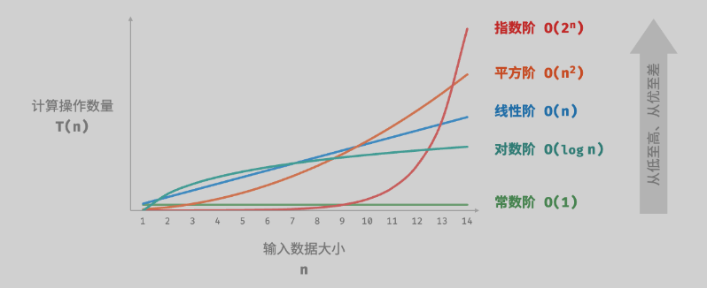

# 复杂度分析

数据结构和算法本身解决的是“快”和“省”的问题，即如何让代码运行得更快，如何让代码更省存储空间；因此需从执行时间和占用空间两个维度来评估数据结构和算法的性能；复杂度分为时间复杂度和空间复杂度，二者统称为复杂度；复杂度描述的是算法执行时间（或占用空间）与数据规模的增长关系。

## 为什么要做复杂度分析

因为复杂度分析是评估算法性能的基本方法之一，包括但不限于以下几个方面的好处：

- 与性能测试相比，复杂度分析有不依赖执行环境、成本低、效率高、易操作、指导性强。 
- 通过复杂度分析可以了解算法在最坏情况下的性能表现，从而评估其效率。
- 通过分析算法的时间复杂度和空间复杂度可以预测算法执行时对计算资源的需求。
- 面对多个解决方案时，复杂度分析可以帮助我们在特定情况下选择表现最佳的算法。

## 大O表示法

```js
function sum(n) {
  let total = 0;
  for(let i = 0; i < n; i++){
    total += i;
  }
  return total;
}

```

上面是一个累加求和的方法，假设每条语句执行的时间为 time，这个方法对于 n 来说总执行的时间为多少？

- 第 2 行的`let total = 0;` 执行一次，时间为 time。

- 第 3，4 行执行 n 次，时间为 `time * n * 2`。

- 第 6 行执行一次，时间为 time。

- 总的执行时间为 $time + time + time \times n \times 2 = (2n + 2) \times time=T(n)$。

- 使用 `f(n)` 来表示代码的执行行数和数据规模的关系，也就是 $f(n)=2n+2$。

  > 当 n 趋近于无穷大的时候，`f(n)`的常数项对于整个数据规模的影响可以忽略不计，系数相比于数据规模 n 也可以忽略不计，最后变为 `f(n)=n`。

- 使用大 O 表示法为`O(n)`。

虽然不知道具体的 time 值是多少，但是可以推导出，所有代码的执行时间`T(n)`与每行代码的执行次数 `f(n)` 成正比。把这规律总结成一个公式，也就是 `T(n)=O(f(n))`：

- `T(n)`就是代码执行的时间。
- `n` 表示数据规模的大小。
- `f(n)`表示每行代码执行的次数总和。
- `O`表示代码的执行时间`T(n)`与`f(n)`表达式成正比。

## 时间复杂度

### 什么是时间复杂度

时间复杂度不是一段代码真正的执行时间，而是一个算法执行效率与数据规模增长的变化趋势。

### 时间复杂度分析技巧

- 只关注循环次数最多的一段代码。
- 只保留最高阶项，总复杂度等于量级最大的那段代码的复杂度。
- 嵌套代码的复杂度等于嵌套内外代码复杂度的乘积。

它的作用就是用来定义描述算法的运行时间。

- 常数阶 `O(1)`：常数阶的操作数量与输入数据大小 n 无关，即不随着 n 的变化而变化。

  > 一般情况下，只要算法中不存在循环语句、递归语句，即使有成千上万行的代码，其时间复杂度也是`Ο(1)`。

  ```javascript
  const i = 22;
  i += 1;
  ```

  在以下函数中，尽管操作数量 `size` 可能很大，但由于其与输入数据大小 `n` 无关，因此时间复杂度仍为 ` O(1)`：

  ````js
  function constant(n) {
      let count = 0;
      const size = 100000;
      for (let i = 0; i < size; i++) count++;
      return count;
  }
  ````

- 线性阶 `O(n)`：如果是`O(1) + O(n)` 则还是 `O(n)`，当 `n` 无限大的时候常量就可忽略不计。

  ```javascript
  function linear() {
      let sum = 0;
      for (let p = 0; p < 100; p++) { // 时间复杂度为100
          sum += p;
      }
      let sum2 = 0;
      for (let q = 0; q <= n; q++) { // 时间复杂度为n
          sum2 += q;
      }
  }
  ```

- 平方阶 $O(n^2)$：$O(n) \times O(n)$， 也就是双层循环，自此类推：$O(n^3)$、$O(n^4)$ ...... $O(n^n)$。

  ```javascript
  for(let i = 0; i < n; i += 1) {
      for(let j = 0; j < n; j += 1) {
          console.log(i, j);
      }
  }
  ```

- 指数阶 $O(2^n)$：运行时间随着输入规模的增加而以指数方式增长。这意味着算法的运行时间可以用 $O(b^n)$ 来表示，其中 n 是输入数据的大小，b 是某个常数大于 1。

  ```js
  /* 指数阶（循环实现） */
  function exponential(n) {
      let count = 0;
      let base = 1;
      // 形成数列 1, 2, 4, 8, ..., 2^(n-1)
      for (let i = 0; i < n; i++) {
          for (let j = 0; j < base; j++) {
              count++;
          }
          base *= 2;
      }
      // count = 1 + 2 + 4 + 8 + .. + 2^(n-1) = 2^n - 1
      return count;
  }
  ```

  

- 对数阶 $O(\log_{2}n)$： 表示以 2 为底 n 的对数。对数函数是一种增长非常缓慢的函数，随着 n 的增大，$\log_{2}n$ 的增长速度远远慢于 n 本身。

  ```javascript
  // 求2的多少次方会大于i，然后就会结束循环。 这就是一个典型的 O(logn)
  let i = 1;
  while(i < n) {
      console.log(i);
      i *= 2;
  }
  ```

- $O(m+n)$ 或 $O(m\times n)$：代码的复杂度由两个数据的规模来决定。

  ```js
  // 时间复杂度O(m + n)
  function calculus(m, n) {
      let sum1 = 0;
      for (let i = 1; i < m; i++) {
      	sum1 += i;
      }
  
      let sum2 = 0;
      for (let j = 1; j < n; j++) {
      	sum2 += j;
      }
  
      return sum1 + sum2;
  }
  ```

  ```js
  // 时间复杂度为O(m × n)
  function calculus(m, n) {
      let sum = 0;
      for (let i = 0; i < m; i += 1) {
          for (let j = 0; j < n; j += 1) {
              sum = i * j;
          }
      }
  
      return sum;
  }
  ```


- 阶乘阶$O(n!)$：运行时间随着输入规模的增加而以阶乘函数增长。。例如，5!=5×4×3×2×1=1205!=5×4×3×2×1=120。因此，具有阶乘时间复杂度的算法在实际应用中很少使用，因为它们对于即使是相对较小的输入规模也会变得非常慢。

  ```js
  /* 阶乘阶（递归实现） */
  function factorial(n) {
      if (n === 0) return 1;
      let count = 0;
      // 从 1 个分裂出 n 个
      for (let i = 0; i < n; i++) {
          count += factorialRecur(n - 1);
      }
      return count;
  }
  ```

  

设输入数据大小为 n ，常见的时间复杂度类型，按照从低到高的顺序排列：

$O(1)<O(logn)<O(n)<O(n log n)<O(n^2)<O(2^n)<O(n!)$



### 最好、最坏和平均时间复杂度

顾名思义，最好情况时间复杂度就是，在最理想的情况下，执行这段代码的时间复杂度。同理，最坏情况时间复杂度就是，在最糟糕的情况下，执行这段代码的时间复杂度。

通过下面的搜索乱序数组中的一个元素的例子来看看这三是怎么回事：

```js
function find(array, element) {
    for (let i = 0; i < array.length; i++) {
        if (array[i] === element) {
            return i;
        }
    }
    return -1;
}
```

在最好的情况下，元素可能在数组的第一个位置，时间复杂度为 O(1)，因为我们只比较一次就找到了元素。

最坏时间复杂度通常发生在最不利的情况下，例如搜索一个没有排序的数组中的元素，如果元素位于数组的末尾或根本不存在，因为我们可能需要遍历整个数组，时间复杂度为 O(n)。

平均情况复杂度，并不是简单的（最好情况+最坏情况）/2得到的。而是需要判断出 n 的某个取值的概率，然后乘以此时的时间复杂度。得出来的就是平均情况的时间复杂度。要查找的元素 element 在数组中的位置，有 `n+1` 种情况：在数组的 `0～n-1` 位置中和不在数组中。我们把每种情况下，查找需要遍历的元素个数累加起来，然后再除以 `n+1`，就可以得到需要遍历的元素个数的平均值，即：

$\frac{1+2+3+4+...+n+n}{n+1}=\frac{n(n+3)}{2(n+1)}$

实际上很少使用到最好时间复杂度，因为只有在很小的概率下才能达到，而最坏时间复杂度更为实用，因为它给出了一个效率安全值，让我们可以放心地使用算法。

## 空间复杂度

空间复杂度是衡量算法在执行过程中所需的存储空间与数据规模之间的增长关系。

### 算法相关空间

算法在运行过程中使用的内存空间主要包括以下几种。

- **输入空间**：用于存储算法的输入数据。
- **暂存空间**：用于存储算法在运行过程中的变量、对象、函数上下文等数据。
- **输出空间**：用于存储算法的输出数据。

一般情况下，**空间复杂度的统计范围是“暂存空间”加上“输出空间”**。

暂存空间可以进一步划分为三个部分。

- **暂存数据**：用于保存算法运行过程中的各种常量、变量、对象等。
- **栈帧空间**：用于保存调用函数的上下文数据。系统在每次调用函数时都会在栈顶部创建一个栈帧，函数返回后，栈帧空间会被释放。
- **指令空间**：用于保存编译后的程序指令，在实际统计中通常忽略不计。

在分析一段程序的空间复杂度时，**我们通常统计暂存数据、栈帧空间和输出数据三部分**。

`````js
// 类
class Node {
    val;
    next;
    constructor(val) {
        this.val = !!val ? 0 : val; // 节点值
        this.next = null;           // 指向下一节点的引用
    }
}

// 函数
function calculate() {
    // 计算逻辑...
    return 0;
}

function algorithm(n) {       // 输入数据
    const a = 0;              // 暂存数据（常量）
    let b = 0;                // 暂存数据（变量）
    const node = new Node(0); // 暂存数据（对象）
    const c = calculate();    // 栈帧空间（调用函数）
    return a + b + c;         // 输出数据
}
`````

### 推算方法

空间复杂度的推算过程跟时间复杂度差不多，时间复杂是统计“操作数量”，而空间复杂度则是要统计“使用空间”。时间复杂度考虑的是最代码执行过程中“操作数量”最大的情况，空间复杂度考虑的是代码执行过程中需要最大存储空间的情况。

```js
function func(n) {
    const a = 0;                   // O(1)
    const b = new Array(10000);    // O(1)
    if (n > 10) {
        const nums = new Array(n); // O(n)
    }
}
```

上面这段代码中的空间复杂度就是$O(n)$；

```js
function loop(n) {
    for (let i = 0; i < n; i++) {
        console.log(i);
    }
}
```

让我们分别分析这段代码的时间复杂度和空间复杂度。

**时间复杂度**：

- 这个函数包含一个循环，它将从 0 迭代到 `n-1`，执行 `n` 次。
- 每次迭代中，它执行一个简单的操作：打印当前的迭代变量 `i`。
- 因此，时间复杂度是线性的，表示为 O(n)*O*(*n*)。

**空间复杂度**：

- 函数 `loop` 只使用了一个变量 `i` 来存储循环的当前迭代值，这个变量在每次迭代中被重用。
- 除此之外，没有使用任何额外的存储结构，如数组或对象。
- 因此，空间复杂度是常数的，表示为 O(1)*O*(1)。

下面是一个递归函数，在分析空间复杂度的时候，要注意调用栈的栈帧空间。

```js
function recursive(n) {
    if (n === 1) return;
    return recursive(n - 1);
}
```

**时间复杂度**：

- 这个递归函数将一直调用自身，直到 `n` 减少到 1。
- 每次调用都对应一个 `n` 的减少，直到递归调用结束的条件（n===1）。
- 因此，这个递归函数将执行 `n` 次，时间复杂度是线性的，表示为 O(n)。

**空间复杂度**：

- 每次递归调用都会在调用栈上添加一层，直到调用结束。
- 如果 `n` 是一个非常大的数，调用栈将增长到 `n` 层深。
- 每次递归调用都需要存储当前函数的局部变量和返回地址，因此**空间复杂度与 `n` 成正比**。
- 因此，空间复杂度是线性的，表示为 O(n)。


本文也是学习算法过程中的思考和记录，理解复杂度分析并学会如何分析和预测算法的性能，并在实际编程中应用这些知识来优化代码。

## 总结

1. **复杂度分析的重要性**：复杂度分析是评估算法性能的关键方法，它帮助我们理解算法在不同情况下的效率，预测资源需求，并在多个解决方案中做出选择。
2. **大O表示法**：介绍了大O表示法的基本概念，它用于描述算法执行时间或占用空间与数据规模的关系，并提供了一个累加求和函数的示例来说明如何使用大O表示法。
3. **时间复杂度**：解释了时间复杂度的概念，并提供了多种时间复杂度类型（如常数阶O(1)、线性阶O(n)、平方阶O(n^2)、指数阶O(2^n)、对数阶O(log n)等）的示例和特点。
4. **最好、最坏和平均时间复杂度**：讨论了在不同情况下分析时间复杂度的意义，并提供了搜索算法的示例来说明这三种情况。
5. **空间复杂度**：介绍了空间复杂度的概念，包括输入空间、暂存空间和输出空间，并讨论了算法相关空间的分类。
6. **空间复杂度推算方法**：提供了空间复杂度的推算方法，包括统计暂存数据、栈帧空间和输出数据，并给出了代码示例来展示如何确定空间复杂度。
7. **时间复杂度和空间复杂度的示例分析**：通过具体的代码示例，分析了循环和递归函数的时间复杂度和空间复杂度。
8. **常见时间复杂度类型排序**：文章最后列出了从低到高的常见时间复杂度类型排序，帮助读者直观地理解不同复杂度类型之间的关系。

