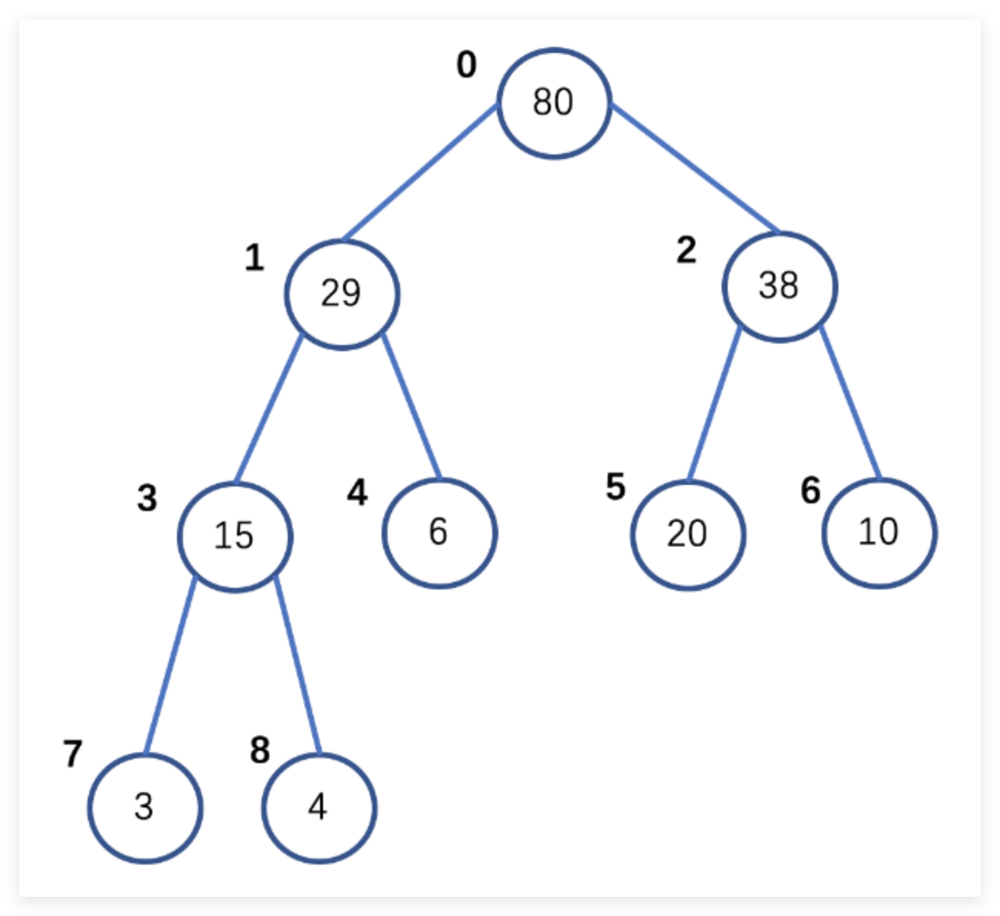

前面两篇文章的介绍让我们对数据解与算法有了初步的认识，数据结构为程序提供了**组织和存储数据的有效方式**。不同的数据结构，如数组、链表、堆栈、队列等，适用于不同的数据管理场景，使得数据的插入、删除、搜索等操作更加高效。**数据结构是算法的基础**。很多经典算法的实现都依赖于特定的数据结构，如排序算法、搜索算法、图算法等。理解数据结构能够使我们更好地理解和设计复杂的算法。**选择合适的数据结构可以显著提升程序的性能**。比如，在需要频繁插入和删除元素的场景中，链表比数组更高效；在需要快速查找的场景中，哈希表比线性表更合适。

在计算机科学的世界中，数据结构是构建高效算法和程序的基石。堆、栈和队列作为三种核心数据结构，各自展现了独特的组织方式和应用场景。

坦白说，在之前的开发过程中，我一直对堆（heap）和栈（stack）分不清，只是大学学Java和C#书中看到值类型（原始类型）存储在栈上，引用类型存储在堆上；

## 堆(heap)

### 定义

堆通常是一个可以被看做一棵完全二叉树的数组对象，是非线性数据结构 。

**堆通常有最大堆和最小堆两个分类：**

- **最大堆**：每个根节点的值都大于子节点。

- **最小堆**：每个根节点的值都小于子节点。



### 堆的结构与性质

1. #### 堆在本质上是一种二叉树，但是使用的是数组的形式

    上图中，由上至下，每个行按照序号进行排序，形成一个数组为：

    ```js
    [80, 29, 38, 15, 6, 20, 10, 3, 4]
    ```

2. #### 按照二叉树的每一排依次进行序号的排序；如上图中的从上到下索引

3. #### 如果一个节点不是最后一个子节点，那么这个节点必须包含左右两个子节点

    以 38 这个节点为例，此节点不是最后一个节点，如果少了右节点10，则会导致序号的连续性和正确性出现问题。

节点的索引计算

**对于序号为k的节点，它的左节点序号为 `2k + 1` 。右节点序号为 `2k + 2`。父节点序号为 `(k - 1) / 2`。**

以 15 这个节点为例

- 15 这个节点的序号为 3

- 左子节点序号为 2 \* 3 + 1 = 7 对应节点值为 3

- 右子节点序号为 2 + 3 + 2 = 8 对应节点值为 4

- 父节点序号为 (3 - 1) / 2 = 1 对应节点值为 29

### 堆的基本操作

### 堆的实现

### 应用场景

## 栈(stack)

## 队列
