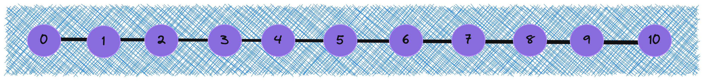

> 数据结构与算法是自己一直在逃避的一个方向，不想去面对它。以前自己也买过一系列的学习资料，可是由于自己的懒惰没能坚持学习下去，导致最近在重构项目和做服务端项目的时候发现成了自己的短板，所以自己决定好好补习一下。

谈论计算机科学和编程时，数据结构和算法是两个基本概念。数据结构是为算法服务的，算法要作用在特定的数据结构之上。它们共同构成了解决问题和处理数据的核心，所以学习也从这里开始。

## 什么是数据结构？

从广义上讲，**数据结构就是指一组数据的存储结构。**

它是**计算机中用于存储、组织和管理数据的方式和技术**。数据结构可以看作是将数据按照特定的方式进行组织，以便于操作、检索和修改数据。不同的数据结构适用于不同类型的问题和操作，选择合适的数据结构可以影响程序的性能和效率。

展开来讲，数据结构研究的是数据的逻辑结构、物理结构以及它们之间的相互关系，并对这种结构定义相应的运算，设计出相应的算法，并确保经过这些运算以后所得到的新结构仍保持原来的结构类型。

数据结构的作用，就是为了提高计算机硬件的利用率。而学习数据结构，就是为了帮助我们了解和掌握计算机中的数据是以何种方式进行组织、存储的。

常见的数据结构包括数组、链表、栈、队列、哈希表、树、堆、图等等，它们可以从“逻辑结构”和“物理结构”两个维度进行分类。

### 逻辑结构

逻辑结构（Logical Structure）就是数据元素之间的相互关系。在数组和链表中，数据按照一定顺序排列，体现了数据之间的线性关系；而在树中，数据从顶部向下按层次排列，表现出“祖先”与“后代”之间的派生关系；图则由节点和边构成，反映了复杂的网络关系。

逻辑结构可分为“线性”和“非线性”两大类。线性结构比较直观，指数据在逻辑关系上呈线性排列；非线性结构则相反，呈非线性排列。

- **线性数据结构**：数组、链表、栈、队列、哈希表，元素之间是一对一的顺序关系。

  

- **非线性数据结构**：树、堆、图、哈希表。

  

非线性数据结构可以进一步划分为树形结构和网状结构。

- **树形结构**：树、堆、哈希表，元素之间是一对多的关系。

- **网状结构**：图，元素之间是多对多的关系。

  

### 物理结构

当程序运行时，数据主要存储在内存中。系统通过内存地址来访问目标位置的数据。下图左边内存条的黑色方块就是一块内存空间，右边的单元格就是模拟的黑色方块中的被计算机特定规则分配编号的内存空间，这个编号就是内存地址，每个编号对应唯一的内存空间，有了这些地址，程序就能方便的对内存中的数据做相关操作。

内存是所有程序的共享资源，当某块内存被某个程序占用时，则通常无法被其他程序同时使用了。**因此在数据结构与算法的设计中，内存资源是一个重要的考虑因素**。比如，算法所占用的内存峰值不应超过系统剩余空闲内存；如果缺少连续大块的内存空间，那么所选用的数据结构必须能够存储在分散的内存空间内。

在计算机内存中的存储方式，可分为连续空间存储（数组）和分散空间存储（链表）。物理结构从底层决定了数据的访问、更新、增删等操作方法，两种物理结构在时间效率和空间效率方面呈现出互补的特点。

基本上所有数据结构都是基于数组、链表或二者的组合实现的。例如，栈和队列既可以使用数组实现，也可以使用链表实现；而哈希表的实现可能同时包含数组和链表。

## 什么是算法？

