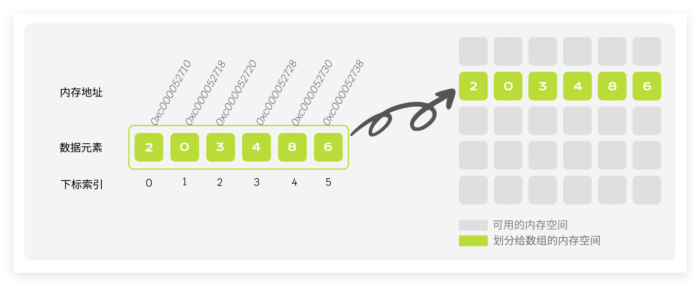

当我们谈论编程时，数组无疑是最基础也最常见的数据结构之一。它就像是编程世界中的老朋友，无论是新手还是老手，都离不开它的身影。但是，你真的了解数组的本质吗？在这篇文章中，让我们一起探索数组背后的奥秘，从基础到高阶，一起开启这段精彩的数组之旅吧!

数组，这个简单到不能再简单的数据结构，却隐藏着无穷的可能。它就像是一个五星级酒店，看似普通，但只要你深入了解，就会发现它内部蕴藏着无数的惊喜和便利。从基本的增删改查，到高级的排序和搜索，数组都能轻松应对。

## 定义

数组（Array）是一种**线性表数据结构**。它用一组连续的内存空间，来存储一组具有相同类型的数据。

- **同一类型元素**：数组中的元素必须是相同的数据类型，例如整数、浮点数、字符等。
- **连续内存分配**：数组中的元素在内存中是连续存储的，这意味着可以通过索引来访问任何元素，访问速度非常快。
- **固定大小**：数组的大小通常在创建时固定，不能动态地扩展或缩小。这意味着需要提前知道数组的最大容量。
- **随机访问**：由于元素的连续存储和固定大小，可以通过索引以 `O(1)` 的时间复杂度实现随机访问。


以整数数组为例：

```go
package main

func main() {

	arr := [6]int{2, 0, 2, 4, 0, 27}

	println(&arr[0], &arr[1], &arr[2], &arr[3], &arr[4])
}
```


数组的存储方式如下图所示：



如上图所示，假设数据元素的个数为 n，则数组中的每一个数据元素都有自己的下标索引，下标索引从 00 开始，到 `n−1` 结束。数组中的每一个「下标索引」，都有一个与之相对应的「数据元素」。

## 如何随机访问数据元素

数组的一个最大特点是：**可以进行随机访问**。即数组可以根据下标，直接定位到某一个元素存放的位置。

那么，计算机是如何实现根据下标随机访问数组元素的？

计算机给一个数组分配了一组连续的存储空间，其中第一个元素开始的地址被称为 **「首地址」**。每个数据元素都有对应的下标索引和内存地址，计算机通过地址来访问数据元素。当计算机需要访问数组的某个元素时，会通过 **「寻址公式」** 计算出对应元素的内存地址，然后访问地址对应的数据元素。

寻址公式如下：**下标 i\*i\* 对应的数据元素地址 = 数据首地址 + i\*i\* × 单个数据元素所占内存大小**。

## 数组的基本操作

数据结构的操作一般涉及到增、删、改、查共 4 种情况，下面我们一起来看一下数组的基本操作。

### 初始化数组

在 Go 语言中声明一个无初始值的实现如下：

```go
var arr [5]int 	 // 声明一个长度为5的整型数组
var arr [...]int // ...表示程序在Go编译期间确定长度
```

在 JavaScript 中声明一个无初始值的实现如下：

```js
const arr = []; // const arr = new Array();
```

### 访问元素

数组的一个最大特点是：**可以进行随机访问**。即数组可以根据下标，直接定位到某一个元素存放的位置。在数组中访问元素非常高效，我们可以在 O(1) 时间内随机访问数组中的任意一个元素。

那么，计算机是如何实现根据下标随机访问数组元素的？

计算机给一个数组分配了一组连续的存储空间，其中第一个元素开始的地址被称为 **「首地址」**。每个数据元素都有对应的下标索引和内存地址，计算机通过地址来访问数据元素。当计算机需要访问数组的某个元素时，会通过 **「寻址公式」** 计算出对应元素的内存地址，然后访问地址对应的数据元素。

寻址公式如下：**下标 i 对应的数据元素地址 = 数据首地址 + i × 单个数据元素所占内存大小**。

在 Go 语言中访问索引为1的元素:

```go
var arr [5]int = [5]int{1, 2, 3, 4, 5}
fmt.Println(arr[1]) // 2
```

在 JavaScript 中访问索引为2的元素则为:

```js
const arr = [1, 2, 3, 4, 5];
console.log(arr[2]) // 3
```

### 插入元素

数组为了保持内存数据的连续性，会导致插入、删除这两个操作比较低效。需要对目标位置后面的数据进行整体后移和前移。

插入的位置不同，会导致同一段代码，时间复杂度可能有量级的差距。所以,我们需要使用到前面说到的复杂度分析方法.：

1. 插入的元素的位置正好位于数组的最后一位，不需要移动任何元素，最好时间复杂度为 `O(1)`. 

2. 插入的位置位于数组的第一位，需要移动 n 个元素，最坏时间复杂度为O(n)。

3. 平均时间复杂度，先把概率算清，即插入到任意位置的可能性都是一样的，n个位置，所以插入到每一个位置的概率都是1/n，插入到数组的第一个位置需要移动 n个元素，插入到数组的第二个位置需要移动 n-1 个元素…插入到数组中的最后一个位置，需要移动 1 个元素。即：

   (n+n-1+n-2+...+1)/n=(n+1)/2=O(n) 

   所以，数组插入操作的平均时间复杂度为 `O(n)`

在 Go 语言中，我们就用 Slice 来做元素的插入操作，在 Go 语言中，Go 语言中内置了 `append` 方法，所以我们就用 `append` 方法来做插入操作：

```go
a := []int{1, 2, 3, 4, 5}
a = append([]int{1}, a...) // 将 1 插入到数组的最后一个位置
fmt.Println(a) // [1 1 2 3 4 5]
```

在 JavaScript 中，也可以通过数组本身提供的方法：

```js
// 第一种:向数组头部添加元素 unshift，返回添加后的新数组长度，会改变原数组
const arr = [1];
arr.unshift(2); // [2,1]

// 第二种：向数组末尾添加元素 push，返回添加后的新数组长度，会改变原数组
let arr = [1];
arr.push(2); // [1,2]
```

> 当然也可以使用 `splice` 方法给数组任意位置的元素插入操作，然后返回删除元素组成的新数组，会改变原数组。

### 删除元素

删除跟插入数据类似，如果要删除第 k 个位置的数据，为了内存的连续性，也需要搬移数据，不然中间就会出现空洞，内存就不连续了。也就是说：

- 最好情况时间复杂度为 O(1)。
- 如果删除开头的数据，则最坏情况时间复杂度为 O(n)。
- 平均情况时间复杂度也为 O(n)。

### 改变元素


## 实战练习

 ### 如何在一个成对元素的数组中找出某个缺失的元素？

> 例如：
>
> ```js
> let a = [1,1,2,2,3]
> function searchOnly(){
>   ……处理函数
> }
> console.log(searchOnly(a)); // 输出3
> ```
>
> 说明：
>
> 此问题需要用到两个运算符知识点和一个数组原型方法：
>
> **运算符知识点：**
>
> ^ 位运算符 操作二进制数据
>
> 特点：逐位比较，相等为0 不等为1
>
> 例如：
>
>  2 的二进制为 10
>
>  3 的二进制为 11
>
>  2 ^ 3 === 10111110 = 1