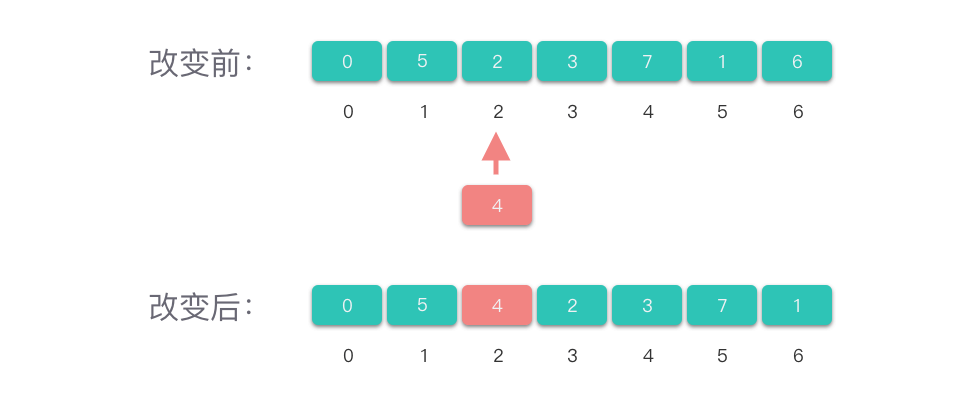

当我们谈论编程时，数组无疑是最基础也最常见的数据结构之一。它就像是编程世界中的老朋友，无论是新手还是老手，都离不开它的身影。但是，你真的了解数组的本质吗？在这篇文章中，让我们一起探索数组背后的奥秘，从基础到高阶，一起开启这段精彩的数组之旅吧!

## 定义

数组（Array）是一种**线性表数据结构**。它用一组连续的内存空间，来存储一组具有相同类型的数据。

- **同一类型元素**：数组中的元素必须是相同的数据类型，例如整数、浮点数、字符等。
- **连续内存分配**：数组中的元素在内存中是连续存储的，这意味着可以通过索引来访问任何元素，访问速度非常快。
- **固定大小**：数组的大小通常在创建时固定，不能动态地扩展或缩小。这意味着需要提前知道数组的最大容量。
- **随机访问**：由于元素的连续存储和固定大小，可以通过索引以 `O(1)` 的时间复杂度实现随机访问。


以整数数组为例：

```go
package main

func main() {
	arr := [6]int{2, 0, 2, 4, 0, 27}
	println(&arr[0], &arr[1], &arr[2], &arr[3], &arr[4])
}
```

数组的存储方式如下图所示：


如上图所示，假设数据元素的个数为 n，则数组中的每一个数据元素都有自己的下标索引，下标索引从 00 开始，到 `n−1` 结束。数组中的每一个「下标索引」，都有一个与之相对应的「数据元素」。

## 如何随机访问数据元素

数组的一个最大特点是：**可以进行随机访问**。即数组可以根据下标，直接定位到某一个元素存放的位置。

那么，计算机是如何实现根据下标随机访问数组元素的？

计算机给一个数组分配了一组连续的存储空间，其中第一个元素开始的地址被称为 **「首地址」**。每个数据元素都有对应的下标索引和内存地址，计算机通过地址来访问数据元素。当计算机需要访问数组的某个元素时，会通过 **「寻址公式」** 计算出对应元素的内存地址，然后访问地址对应的数据元素。

寻址公式如下：**下标 i 对应的数据元素地址 = 数据首地址 + i × 单个数据元素所占内存大小**。

## 数组的基本操作

数据结构的操作一般涉及到增、删、改、查共 4 种情况，下面我们一起来看一下数组的基本操作。

### 初始化数组

在 Go 语言中声明一个无初始值的实现如下：

```go
var arr [5]int 	 // 声明一个长度为5的整型数组
var arr [...]int // ...表示程序在Go编译期间确定长度
```

在 JavaScript 中声明一个无初始值的实现如下：

```js
const arr = []; // const arr = new Array();
```

### 访问元素

数组的一个最大特点是：**可以进行随机访问**。即数组可以根据下标，直接定位到某一个元素存放的位置。在数组中访问元素非常高效，我们可以在 O(1) 时间内随机访问数组中的任意一个元素。

那么，计算机是如何实现根据下标随机访问数组元素的？

计算机给一个数组分配了一组连续的存储空间，其中第一个元素开始的地址被称为 **「首地址」**。每个数据元素都有对应的下标索引和内存地址，计算机通过地址来访问数据元素。当计算机需要访问数组的某个元素时，会通过 **「寻址公式」** 计算出对应元素的内存地址，然后访问地址对应的数据元素。

寻址公式如下：**下标 i 对应的数据元素地址 = 数据首地址 + i × 单个数据元素所占内存大小**。

我们拿一个长度为 10 的 `int` 类型的数组 `arr := [10]int{0, 1, 2, 3, 4, 5, 6, 7, 8, 9}` 来举例。在我画的这个图中，计算机给数组 a[10]，分配了一块连续内存空间 1000～1039，其中，内存块的首地址为 base_address = 1000。


在 Go 语言中访问索引为1的元素:

```go
var arr [5]int = [5]int{1, 2, 3, 4, 5}
fmt.Println(arr[1]) // 2
```

在 JavaScript 中访问索引为2的元素则为:

```js
const arr = [1, 2, 3, 4, 5];
console.log(arr[2]) // 3
```

### 插入元素

数组为了保持内存数据的连续性，会导致插入、删除这两个操作比较低效。需要对目标位置后面的数据进行整体后移和前移。

插入的位置不同，会导致同一段代码，时间复杂度可能有量级的差距。所以,我们需要使用到前面说到的复杂度分析方法.：

1. 插入的元素的位置正好位于数组的最后一位，不需要移动任何元素，最好时间复杂度为 `O(1)`. 

2. 插入的位置位于数组的第一位，需要移动 n 个元素，最坏时间复杂度为O(n)。

3. 平均时间复杂度，先把概率算清，即插入到任意位置的可能性都是一样的，n个位置，所以插入到每一个位置的概率都是1/n，插入到数组的第一个位置需要移动 n个元素，插入到数组的第二个位置需要移动 n-1 个元素…插入到数组中的最后一个位置，需要移动 1 个元素。即：

   (n+n-1+n-2+...+1)/n=(n+1)/2=O(n) 

   所以，数组插入操作的平均时间复杂度为 `O(n)`

在 Go 语言中，我们就用 Slice 来做元素的插入操作，在 Go 语言中，Go 语言中内置了 `append` 方法，所以我们就用 `append` 方法来做插入操作：

```go
a := []int{1, 2, 3, 4, 5}
a = append([]int{1}, a...) // 将 1 插入到数组的最后一个位置
fmt.Println(a) // [1 1 2 3 4 5]
```

在 JavaScript 中，也可以通过数组本身提供的方法：

```js
// 第一种:向数组头部添加元素 unshift，返回添加后的新数组长度，会改变原数组
const arr = [1];
arr.unshift(2); // [2,1]

// 第二种：向数组末尾添加元素 push，返回添加后的新数组长度，会改变原数组
let arr = [1];
arr.push(2); // [1,2]
```

> 当然也可以使用 `splice` 方法给数组任意位置的元素插入操作，然后返回删除元素组成的新数组，会改变原数组。

### 删除元素

删除跟插入数据类似，如果要删除第 k 个位置的数据，为了内存的连续性，也需要搬移数据，不然中间就会出现空洞，内存就不连续了。也就是说：

- 最好情况时间复杂度为 O(1)。
- 如果删除开头的数据，则最坏情况时间复杂度为 O(n)。
- 平均情况时间复杂度也为 O(n)。

在 Go 语言中的实现为:

```go
// remove 函数使用泛型，可以对任何类型的切片进行操作
func remove[T any](nums []T, index int) []T {
    // 检查索引是否在切片范围内
    if index < 0 || index >= len(nums) {
        return nums // 如果索引无效，直接返回原切片
    }
    
    // 把索引 index 之后的所有元素向前移动一位
    for i := index; i < len(nums)-1; i++ {
        nums[i] = nums[i+1]
    }
    
    // 截取切片，去掉最后一个元素
    return nums[:len(nums)-1]
}
```

在 JavaScript 中的实现为:

```js
/* 删除索引 index 处的元素 */
function remove(nums, index) {
    // 把索引 index 之后的所有元素向前移动一位
    for (let i = index; i < nums.length - 1; i++) {
        nums[i] = nums[i + 1];
    }
}
```

### 改变元素

将数组中第 i 个元素值改为 val 的执行步骤如下：

1. 需要先检查 i 的范围是否在合法的范围区间，即 $0 \leq i \leq len(nums)-1$。
2. 然后将第 i 个元素值赋值为 val。



在 Go 语言中的实现如下：

```go
// updateElement 函数使用泛型，可以对任何类型的切片进行操作
// 它将切片中指定索引的元素更新为新的值
func updateElement[T any](nums []T, index int, newValue T) []T {
	// 检查索引是否在切片范围内
	if index < 0 || index >= len(nums) {
		return nums // 返回原始切片
	}

	// 更新切片中的元素
	nums[index] = newValue

	return nums
}
```

在 JavaScript 中的实现如下：

```js
function updateElement (array, index, newValue) {
  // 检查索引是否在数组范围内
  if (index < 0 || index >= array.length) {
    return array; // 返回原始数组
  }

  // 更新数组中的元素
  array[index] = newValue;

  return array;
}
```

### 查找元素

在数组中查找指定元素需要遍历数组，每轮判断元素值是否匹配，若匹配则输出对应索引。因为数组是线性数据结构，所以上述查找操作被称为“线性查找”。数组支持随机访问，根据下标随机访问的时间复杂度为 O(1)

在Go语言中的实现为：

```go
/* 在数组中查找指定元素 */
func find(nums []int, target int) (index int) {
    index = -1
    for i := 0; i < len(nums); i++ {
        if nums[i] == target {
            index = i
            break
        }
    }
    return
}
```

在JavaScript中的实现为:

```js
/* 在数组中查找指定元素 */
function find(nums, target) {
    for (let i = 0; i < nums.length; i++) {
        if (nums[i] === target) return i;
    }
    return -1;
}
```

### 数组访问越界问题

数组访问索引越界是一个常见的错误，它发生在尝试访问数组中不存在的位置时。数组索引是从 0 开始的，如果一个数组有 n 个元素，那么它的有效索引范围是从 0到 n-1。尝试访问任何超出这个范围的索引都会导致索引越界。

#### 索引越界的后果：

1. **运行时错误**：在许多编程语言中，如 Java、C# 等语言中，数组索引越界会导致运行时错误，如 `ArrayIndexOutOfBoundsException`或 `IndexOutOfRangeException`。
2. **未定义行为**：在一些语言中，如 C 或 C++，数组索引越界可能导致未定义行为，这可能包括访问到随机内存位置，导致程序崩溃或数据损坏。
3. **安全风险**：在某些情况下，索引越界可能被用作一种攻击手段，例如在缓冲区溢出攻击中。

在Go语言中，数组访问索引越界会导致运行时错误。Go语言的数组是固定长度的，尝试访问数组外的索引会触发运行时的 `panic`，这是一种异常情况，会导致程序崩溃并输出堆栈跟踪信息。例如，如果你尝试访问一个长度为 5 的数组的第六个元素，即索引 5（因为索引从0开始），程序将会在运行时抛出 `panic`。

为了避免这种情况，你应该始终确保你的索引在数组的有效范围内。在Go中，你可以在访问数组之前添加检查来保证索引的有效性，例如：

```go
if index >= 0 && index < len(array) {
    // 安全地访问 array[index]
} else {
    // 处理索引越界的情况
}
```

在JavaScript 中的处理方式与Go语言也大同小异：

```js
if (index >= 0 && index < array.length) {
    console.log(array[index]);
} else {
    console.log("Index out of bounds");
}
```

这类问题的预防措施：

- 边界检查
- 使用异常处理

## 总结

数组存储在连续的内存空间内，且元素类型相同。访问数组元素、改变数组元素的时间复杂度为 O(1)，在数组尾部插入、删除元素的时间复杂度也是 O(1)，普通情况下插入、删除元素的时间复杂度为 O(n)

- **空间效率高**：数组为数据分配了连续的内存块，无须额外的结构开销。
- **支持随机访问**：数组允许在 O(1) 时间内**访问**任何元素。
- **缓存局部性**：当访问数组元素时，计算机不仅会加载它，还会缓存其周围的其他数据，从而借助高速缓存来提升后续操作的执行速度。

连续空间存储是一把双刃剑，其存在以下局限性。

- **插入与删除效率低**：当数组中元素较多时，插入与删除操作需要移动大量的元素。
- **长度不可变**：数组在初始化后长度就固定了，扩容数组需要将所有数据复制到新数组，开销很大。
- **空间浪费**：如果数组分配的大小超过实际所需，那么多余的空间就被浪费了。


学完上面的内容，刷两道 leetcode 算法题：

#### [189-轮转数组](https://leetcode.cn/problems/rotate-array/)

示例 1:

```
输入: nums = [1,2,3,4,5,6,7], k = 3
输出: [5,6,7,1,2,3,4]
解释:
向右轮转 1 步: [7,1,2,3,4,5,6]
向右轮转 2 步: [6,7,1,2,3,4,5]
向右轮转 3 步: [5,6,7,1,2,3,4]
```

示例 2:

```
输入：nums = [-1,-100,3,99], k = 2
输出：[3,99,-1,-100]
解释: 
向右轮转 1 步: [99,-1,-100,3]
向右轮转 2 步: [3,99,-1,-100]
```

提示：

- `1 <= nums.length <= 105`
- `-231 <= nums[i] <= 231 - 1`
- `0 <= k <= 105`

**思路**:

1. 理解轮转：向右旋转 `k` 步意味着最后 `k` 个元素会移动到数组的前面，而前面的元素会向后移动。
2. 有效的轮转步数：由于轮转 `len(nums)` 步后数组回到原来状态，因此我们只需关注 `k` 对 `len(nums)` 的模（`k % len(nums)`）。
3. 可以将数组分为两部分：
   - 后面的 `k` 个元素
   - 前面的 `n - k` 个元素
   - 然后将这两部分合并

```go
func rotate(nums []int, k int) {
	n := len(nums)
	if n == 0 {
		return
	}
	// 处理 k 大于数组长度的情况
	k = k % n
	if k == 0 {
		return
	}

	// 反转整个数组
	reverse(nums, 0, n-1)
	// 反转前 k 个元素
	reverse(nums, 0, k-1)
	// 反转后 n-k 个元素
	reverse(nums, k, n-1)
}

func reverse(nums []int, start, end int) {
	for start < end {
		// 交换元素
		nums[start], nums[end] = nums[end], nums[start]
		start++
		end--
	}
}
```

> 为什么要反转整个数组?
>
> 反转整个数组的操作能够有效地利用原数组的内存空间，将元素的位置调整到正确的位置。通过这种方法，我们只需要 O(n) 的时间复杂度和 O(1) 的空间复杂度，非常高效。

复杂度分析

- **时间复杂度**：O(n)。
- **空间复杂度**：O(1)。

可点击此[链接](https://go.dev/play/p/AD24X4dreL8)查看上面代码在 go playground 中的完整示例!

#### [238-除自身以外数组的乘积](https://leetcode.cn/problems/product-of-array-except-self/)

给你一个整数数组 `nums`，返回 数组 `answer` ，其中 `answer[i]` 等于 `nums` 中除 `nums[i]` 之外其余各元素的乘积 。

题目数据 **保证** 数组 `nums`之中任意元素的全部前缀元素和后缀的乘积都在 **32 位** 整数范围内。

请 **不要使用除法，**且在 `O(n)` 时间复杂度内完成此题。

示例 1:

```
输入: nums = [1,2,3,4]
输出: [24,12,8,6]
```

示例 2:

```
输入: nums = [-1,1,0,-3,3]
输出: [0,0,9,0,0]
```

提示：

- `2 <= nums.length <= 105`
- `-30 <= nums[i] <= 30`
- **保证** 数组 `nums`之中任意元素的全部前缀元素和后缀的乘积都在 **32 位** 整数范围内

#### 思路

根据题意，需要计算一个新的数组 `answer`，其中每个元素 `answer[i]` 是输入数组 `nums` 中除了 `nums[i]` 之外的其他元素的乘积

根据上面的题意,以示例1来整理一下就是：

answer[0] = nums[1] * nums[2] * nums[3] ==> answer[0] = 2 * 3 * 4 = 24
answer[1] = nums[0] * nums[2] * nums[3] ==> answer[0] = 1 * 3 * 4 = 12
answer[2] = nums[0] * nums[1] * nums[3] ==> answer[2] = 1 * 2 * 4 = 8
answer[3] = nums[0] * nums[1] * nums[2] ==> answer[3] = 1 * 2 * 3 = 6

根据上面的推导，可以看出 answer[i] = nums[i] 之前的乘积✖️nums[i]之后的乘积，推导如下：

1. **前缀乘积**：

   > 前缀乘积数组 `prefix` 的定义是：`prefix[i]` 表示数组 `nums` 中第 `i` 个元素之前（不包括 `nums[i]`）所有元素的乘积。

   - 创建一个 `prefix` 数组，其中 `prefix[i]` 表示 `nums` 中第 `i` 个元素之前所有元素的乘积。

   - 例如，对于 `nums = [1, 2, 3, 4]`，`prefix` 将是 `[1, 1, 2, 6]`。

     > 对于数组 `nums = [1, 2, 3, 4]`，我们将逐步计算 `prefix` 数组：
     >
     > 1. 初始化：
     >
     >    - 创建一个 `prefix` 数组，长度与 `nums` 相同，初始值为 `[1, 1, 1, 1]`（为了便于后续乘法计算）。
     >
     > 2. 计算 `prefix`：
     >
     >    - `prefix[0]`：因为没有任何元素在 `nums[0]` 之前，所以 `prefix[0] = 1`。
     >    - `prefix[1]`：`prefix[1]` 是 `nums[0]` 的乘积，即 `prefix[1] = prefix[0] * nums[0] = 1 * 1 = 1`。
     >    - `prefix[2]`：`prefix[2]` 是 `nums[0]` 和 `nums[1]` 的乘积，即 `prefix[2] = prefix[1] * nums[1] = 1 * 2 = 2`。
     >    - `prefix[3]`：`prefix[3]` 是 `nums[0]`、`nums[1]` 和 `nums[2]` 的乘积，即 `prefix[3] = prefix[2] * nums[2] = 2 * 3 = 6`。
     >
     > 3. 最终的 `prefix` 数组计算如下：
     >
     >    - `prefix[0] = 1`（没有元素）
     >    - `prefix[1] = 1`（前缀乘积为 1）
     >    - `prefix[2] = 2`（前缀乘积为 1 * 2 = 2）
     >    - `prefix[3] = 6`（前缀乘积为 1 * 2 * 3 = 6）
     >
     >    所以最终的 `prefix` 数组为 `[1, 1, 2, 6]`。

2. **后缀乘积**：

   - 创建一个 `suffix` 数组，其中 `suffix[i]` 表示 `nums` 中第 `i` 个元素之后所有元素的乘积(后缀乘积的推导方式跟上面一样)。
   - 例如，对于 `nums = [1, 2, 3, 4]`，`suffix` 将是 `[24, 12, 4, 1]`。

3. **计算结果**：

   - 对于每个 `i`，`answer[i]` 可以通过 `prefix[i] * suffix[i]` 计算得到。

按照上面的推导过程，具体的代码实现如下：

```go
func productExceptSelf(nums []int) []int {
	n := len(nums)

	// 初始化prefix和suffix数组
	prefix := make([]int, n)
	suffix := make([]int, n)
	answer := make([]int, n)

	// 计算前缀乘积
	prefix[0] = 1
	for i := 1; i < n; i++ {
		prefix[i] = prefix[i-1] * nums[i-1]
	}

	// 计算后缀乘积
	suffix[n-1] = 1
	for i := n - 2; i >= 0; i-- {
		suffix[i] = suffix[i+1] * nums[i+1]
	}

	// 计算最终结果
	for i := 0; i < n; i++ {
		answer[i] = prefix[i] * suffix[i]
	}

	return answer
}
```

复杂度分析

- **时间复杂度**：O(n)，需遍历数组三次。
- **空间复杂度**：O(n)，使用了额外的 `prefix` 和 `suffix` 数组。

进一步优化空间复杂度，可以注意到 `answer` 数组可以替代 `prefix`，只使用一个 `suffix` 数组：

1. 先计算 `answer` 数组的前缀乘积，直接存储在 `answer` 中。
2. 然后从后往前遍历，乘以后缀乘积，更新 `answer` 数组。

```go
func productExceptSelf(nums []int) []int {
	n := len(nums)
	answer := make([]int, n)

	// 计算前缀乘积并存储在answer中
	answer[0] = 1
	for i := 1; i < n; i++ {
		answer[i] = answer[i-1] * nums[i-1]
	}

	// 计算后缀乘积并更新answer
	suffix := 1
	for i := n - 1; i >= 0; i-- {
		answer[i] *= suffix
		suffix *= nums[i]
	}

	return answer
}
```

复杂度分析

- **时间复杂度**：O(n)，需遍历数组两次。
- **空间复杂度**：O(1)，因为原题中，输出数组不算进空间复杂度中。