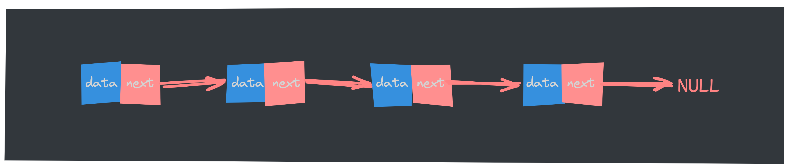

在上篇文章中，我们深入探讨了**[数组](https://mp.weixin.qq.com/s/c-yE-d9Tl_Sg3kd7Cpg3xg)**这一基础数据结构及其特性。***数组以其固定大小和快速访问***的特点被广泛应用，但在某些场景下，其固有的局限性也逐渐显露出来，例如在频繁的插入和删除操作中，数组的效率显得捉襟见肘。为了应对这些挑战，我们引入了链表这一灵活且动态的数据结构。链表通过节点的连接方式，允许我们快速地进行数据的增删操作，是许多算法和数据结构的重要基础。接下来，我们将详细了解链表的基本概念、类型及其应用场景！

## 单链表

相比数组，链表稍微复杂一点。链表（linked list）是一种线性数据结构，其中的每个元素都是一个节点对象，各个节点通过**指针**将一组零散的节点串联在一起。每个节点不仅要存放一个数据元素的值，还要存放下一个节点的地址，该地址被称为**后继指针 next**。



- 链表的首个节点被称为“头节点”，最后一个节点被称为“尾节点”。

- 尾节点的后继指针 next 指向的不再是下一个节点。而是指向一个空地址 `null`. 这样做的好处是：防止尾节点的后继指针 next 成为一“野”指针，导致遍历链表根本停不下来，或者出现一堆本不属于该链表的垃圾数据等。

    > 在 Java、C++ 和 Python 中分别被记为 `null`、`nullptr` 和 `None`；

我们知道，在进行数组的插入、删除操作时，为了保持内存数据的连续性，需要做大量的数据搬移，所以时间复杂度是 O(n)。而在链表中插入或者删除一个数据，我们并不需要为了保持内存的连续性而搬移节点，因为链表的存储空间本身就不是连续的。所以，在链表中插入和删除一个数据是非常快速的。

### 单链表的基本操作

在实现下面的插入、删除等操作之前，我们先把基本的链表结构给定义好：

```go
// Comparable 接口用于比较泛型类型
type Comparable[T any] interface {
	Compare(other T) bool
}

// 定义链表节点，T 为类型参数
type Node[T any] struct {
	data T        // 数据域
	next *Node[T] // 指向下一个节点
}

// 定义链表结构，T 为类型参数
type LinkedList[T Comparable[T]] struct {
	head   *Node[T] // 头节点
	length uint     // 链表长度
}

// 创建新节点
func NewListNode[T Comparable[T]](v T) *Node[T] {
	return &Node[T]{
		data: v,
		next: nil,
	}
}

// 创建新链表
func NewLinkedList[T Comparable[T]]() *LinkedList[T] {
	return &LinkedList[T]{
		head:   NewListNode[T](zeroValue[T]()),
		length: 0,
	}
}

// 获取下一个节点
func (list *Node[T]) GetNext() *Node[T] {
	return list.next
}

// 获取节点数据
func (list *Node[T]) GetValue() T {
	return list.data
}

// 用于获取类型 T 的零值
func zeroValue[T any]() T {
	var zero T
	return zero
}
```

#### 插入操作

向链表中增添元素，根据添加位置不同，可分为以下 3 种情况：

- 插入到链表的头部（头节点之后），作为首元节点；
- 插入到链表中间的某个位置；
- 插入到链表的最末端，作为链表中最后一个数据元素；

虽然新元素的插入位置不固定，但是链表插入元素的思想是固定的，只需做以下两步操作，即可将新元素插入到指定的位置：

1. 将新节点的 next 指针指向插入位置后的节点；
2. 将插入位置前节点的 next 指针指向插入节点；

比如，我们在链表 `{1,2,3,4}` 的基础上分别实现在头部、中间部位、尾部插入新元素 5，其实现过程如下图：


从图中可以看出，虽然新元素的插入位置不同，但实现插入操作的方法是一致的，都是**先将新节点的 next 指针指向插入位置后的节点 **(下文用①代指此步骤)，然后才是**将插入位置前节点的 next 指针指向插入节点**(下文用②代指此步骤)。

> Tips:
>
> 链表插入元素的操作必须是先步骤 ①，再步骤 ②；反之，若先执行步骤 ②，除非再添加一个指针，作为插入位置后续链表的头指针，否则会导致插入位置后的这部分链表丢失，无法再实现步骤 ①。

通过上面的图示我们搞明白了基本思路，下面使用 Go 语言来实现链表插入元素的操作：

```go
// InsertAfter 在指定节点 p 后插入值为 v 的新节点
func (list *LinkedList[T]) InsertAfter(p *Node[T], v T) bool {
	// 如果 p 为空，则返回 false
	if p == nil {
		return false
	}

	// 创建新节点
	newNode := NewListNode(v)
	// 记录原来的下一个节点
	oldNext := p.next
	// 将新节点插入到 p 之后
	p.next = newNode
	newNode.next = oldNext

	// 链表长度加1
	list.length++
	return true
}

// 在链表头部插入节点
func (list *LinkedList[T]) InsertHead(v T) bool {
	return list.InsertAfter(list.head, v)
}

// 在链表尾部插入节点
func (list *LinkedList[T]) InsertTail(v T) bool {
	current := list.head

	for current.next != nil {
		current = current.next
	}
	return list.InsertAfter(current, v)
}
```

#### 删除操作

从链表中删除一个数据无外乎这两种情况：

- 删除节点中“值等于某个给定值”的节点；这就意味着需要先定位被删除元素，然后再执行删除操作，平均时间复杂度为O(n)。
- 删除给定指针指向的节点。 这就意味着不用去定位被删除元素。直接删除这个指针指向的元素即可，时间复杂度为O(1)。

比如，从存有 `{1,2,3,4}` 的链表中删除元素 3，则此代码的执行效果如下图：


通过上面的图示理清了删除链表的思路，下面使用 Go 语言来实现链表删除元素的操作：

```go
// 删除传入的节点
func (list *LinkedList[T]) Delete(p *Node[T]) bool {
	// 如果 p 为空，则返回 false
	if p == nil {
		return false
	}

	current := list.head.next
	previous := list.head

	for current != nil {
		// 找到指定节点 p，退出循环
		if current == p {
			break
		}
		previous = current     // 记录当前节点为前一个节点
		current = current.next // 移动到下一个节点
	}

	// 说明 p 为尾节点
	if current == nil {
		return false
	}

	// 删除节点 p，将前一个节点的 next 指针指向节点 p 的下一个节点
	previous.next = p.next

	list.length--
	return true
}
```

#### 查找操作

因为链表中的数据并非连续存储的，所以无法像数组那样，根据首地址和下标，通过寻址公式就能直接计算出对应的内存地址，而是需要根据指针一个结点一个结点地依次遍历，直到找到相应的节点。在链表中查找指定数据元素，最常用的方法是：从表头依次遍历表中节点，用被查找元素与各节点数据域中存储的数据元素进行比对，直至比对成功或遍历至链表最末端的 `NULL`（比对失败的标志）；所以链表查找元素的时间复杂度为O(n)。

因此，链表中查找特定数据元素的 Go 语言实现代码为：

```go
// 查找指定值的节点
func (list *LinkedList[T]) Find(v T) *Node[T] {
	current := list.head.next

	for current != nil {
		// 对比值是否匹配，如果匹配则返回该节点
		if current.GetValue().Compare(v) {
			return current
		}
		current = current.GetNext()
	}
	// 为找到匹配的节点，返回 nil
	return nil
}
```

#### 更新操作

更新链表中的元素，只需通过遍历找到存储此元素的节点，对节点中的数据域做更改操作即可。

下面使用 Go 语言来实现链表更新元素的操作：

```go
func (list *LinkedList[T]) Update(oldValue, newValue T) bool {
	// 查找链表中的节点
	node := list.Find(oldValue)

	if node == nil {
		return false
	}
	// 更新节点的值
	node.data = newValue
	return true
}
```

上面我们详细的介绍了对链表中数据元素做“增删查改”的实现过程，虽然使用的 Go 语言实现，但是根据图文也能使用其他语言去实现对应的操作；下面就是所有的代码：

```go
package main

// Comparable 接口用于比较泛型类型
type Comparable[T any] interface {
	Compare(other T) bool
}

// 定义链表节点，T 为类型参数
type Node[T any] struct {
	data T        // 数据域
	next *Node[T] // 指向下一个节点
}

// 定义链表结构，T 为类型参数
type LinkedList[T Comparable[T]] struct {
	head   *Node[T] // 头节点
	length uint     // 链表长度
}

// 创建新节点
func NewListNode[T Comparable[T]](v T) *Node[T] {
	return &Node[T]{
		data: v,
		next: nil,
	}
}

// 创建新链表
func NewLinkedList[T Comparable[T]]() *LinkedList[T] {
	return &LinkedList[T]{
		head:   NewListNode[T](zeroValue[T]()),
		length: 0,
	}
}

// 获取下一个节点
func (list *Node[T]) GetNext() *Node[T] {
	return list.next
}

// 获取节点数据
func (list *Node[T]) GetValue() T {
	return list.data
}

// 用于获取类型 T 的零值
func zeroValue[T any]() T {
	var zero T
	return zero
}

// InsertAfter 在指定节点 p 后插入值为 v 的新节点
func (list *LinkedList[T]) InsertAfter(p *Node[T], v T) bool {
	// 如果 p 为空，则返回 false
	if p == nil {
		return false
	}

	// 创建新节点
	newNode := NewListNode(v)
	// 记录原来的下一个节点
	oldNext := p.next
	// 将新节点插入到 p 之后
	p.next = newNode
	newNode.next = oldNext

	// 链表长度加1
	list.length++
	return true
}

// 在链表头部插入节点
func (list *LinkedList[T]) InsertHead(v T) bool {
	return list.InsertAfter(list.head, v)
}

// 在链表尾部插入节点
func (list *LinkedList[T]) InsertTail(v T) bool {
	current := list.head

	for current.next != nil {
		current = current.next
	}
	return list.InsertAfter(current, v)
}

// 删除传入的节点
func (list *LinkedList[T]) Delete(p *Node[T]) bool {
	// 如果 p 为空，则返回 false
	if p == nil {
		return false
	}

	current := list.head.next
	previous := list.head

	for current != nil {
		// 找到指定节点 p，退出循环
		if current == p {
			break
		}
		previous = current     // 记录当前节点为前一个节点
		current = current.next // 移动到下一个节点
	}

	// 说明 p 为尾节点
	if current == nil {
		return false
	}

	// 删除节点 p，将前一个节点的 next 指针指向节点 p 的下一个节点
	previous.next = p.next

	list.length--
	return true
}

// 查找指定值的节点
func (list *LinkedList[T]) Find(v T) *Node[T] {
	current := list.head.next

	for current != nil {
		// 对比值是否匹配，如果匹配则返回该节点
		if current.GetValue().Compare(v) {
			return current
		}
		current = current.GetNext()
	}
	// 未找到匹配的节点，返回 nil
	return nil
}

func (list *LinkedList[T]) Update(oldValue, newValue T) bool {
	// 查找链表中的节点
	node := list.Find(oldValue)

	if node == nil {
		return false
	}
	// 更新节点的值
	node.data = newValue
	return true
}
```

根据上面的一系列实操后，我们来总结一下链表结构的优缺点：

- 优点：
    1. 动态大小：根据数据大小动态增长或缩小
    2. 插入和删除效率高：插入和删除元素只需要改变指针，时间复杂度为 O(1)
    3. 内存利用灵活：不需要连续的内存空间
- 缺点：
    1. 访问速度慢：由于链表是线性存储的，访问特定元素需要从头节点开始遍历，平均时间复杂度为 O(n)
    2. 额外的内存开销：每个节点需要存储指向下一个节点的指针，这会导致额外的内存开销
    3. 不支持随机访问：无法像数组一样通过索引直接访问元素

从上面的优缺点中可以看到链表在动态大小、插入和删除效率方面具有显著优势，但在访问速度和内存开销上存在一定的劣势。这些特性使得链表在不同场景中表现出不同的适用性；

## 总结

链表是一种动态的线性数据结构，由多个节点通过指针连接而成。与数组相比，链表具有动态大小和高效的插入与删除操作，时间复杂度为 O(1)。然而，链表的访问速度较慢，平均时间复杂度为 O(n)，并且每个节点还需存储指向下一个节点的指针，导致额外的内存开销。

文中通过图示逐步推导，也使用 Go 语言（虽然是使用的 Go 语言，基于文中的思路，使用其他语言也能实现对应的方法）实现了对链表的基本操作，包括插入、删除、查找和更新；
