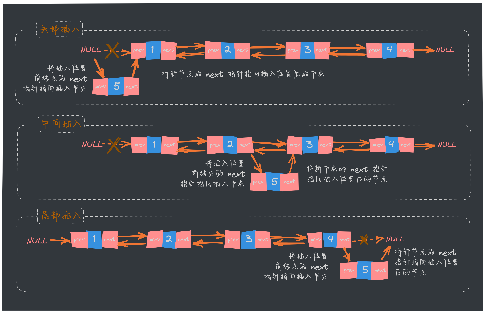
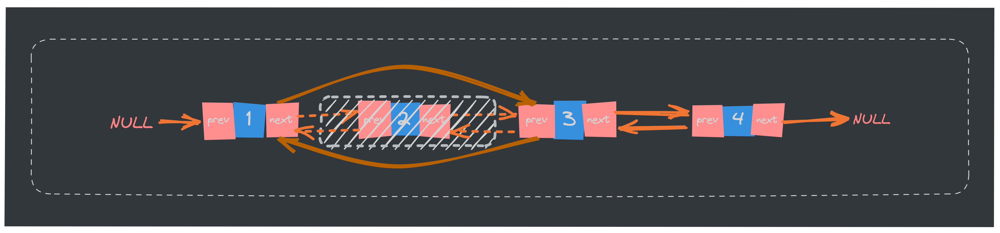
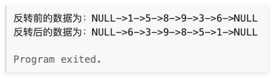

在上篇文章中，我们深入探讨了**[单链表](https://mp.weixin.qq.com/s/c-yE-d9Tl_Sg3kd7Cpg3xg)** 这一基础数据结构的相关概念及基本操作。我们继续看看双向链表！

## 概念

单向链表只有一个方向，节点只有一个后继指针 next 指向下一个节点。而双向链表，顾名思义，它支持**两个方向，每个节点不止有一个后继指针 next 指向后面的节点，还有一个前驱指针 prev 指向前面的节点**。


从图中也可以看出，在双向链表中，每个节点通常包含以下三个部分：

- **数据域(data)**：存储节点的数据。
- **前驱指针(prev)**：指向链表中前一个节点的指针。
- **后继指针(next)**：指向链表中下一个节点的指针。

双向链表需要额外的两个空间来存储前驱节点和后继节点的地址。因此，存储同样多的数据，双向链表要比单链表占用更多的内存空间（因为有 `prev`、`next` 两个指针），虽然两个指针比较浪费存储空间，但可以支持双向遍历，这样也带来了双向链表操作的灵活性。

### **特点**：

- **从双链表的任意一个节点开始，都可以很方便的访问它的前驱节点和后继节点**。
- **头节点的前驱指针和尾节点的后继指针都指向 `Null`**。

## 双链表的基本操作

双向链表的基本操作，包括节点的插入、删除、查找以及遍历。我们将通过 Go 和 JavaScript 语言的实现示例，在完整的代码实现之前，先将双向链表的数据结构定义出来：

```go
// 定义双向链表的节点结构体
type Node struct {
	Data int
	prev *Node // 指向前一个节点
	next *Node // 指向后一个节点
}

// 定义双向链表结构体
type DoublyLinkedList struct {
	head *Node // 指向链表头部
	tail *Node // 指向链表尾部
}
```

这两段代码定义了双向链表的基本结构，其中 `Node` 结构体用于表示链表中的单个节点，而 `DoublyLinkedList` 结构体则用于表示整个链表。

### **创建节点**

创建一个新的节点，包含数据域、前驱指针和后继指针。

```go
// 创建一个新的节点
func newNode(data int) *Node {
	return &Node{Data: data}
}
```

这个 `newNode` 函数的作用是创建一个新的双向链表节点，并将传入的数据存储在节点的 `Data` 字段中。函数返回一个指向新创建的 `Node` 结构体的指针，这个指针可以用于将新节点插入到双向链表中。比如调用 `newNode(10)` 时，它会创建一个新的节点，其中 `Data` 字段的值为 `10`，并且返回一个指向这个新节点的指针。

### **插入新节点**

在双向链表中插入新节点根据添加位置不同，可分为以下 3 种情况：

- 插入到链表的头部（头节点之后），作为首元节点；
- 插入到链表中间的某个位置；
- 插入到链表的最末端，作为链表中最后一个数据元素；



下面分别实现：

- 头部插入
  ```go
  // 在双向链表的头部插入一个新节点
  func (dll *DoublyLinkedList) InsertAtHead(data int) {
      node := newNode(data)
      if dll.head == nil {
  		dll.head = node
  		dll.tail = node
  		return
  	}
  	dll.head.next = node
  	node.prev = dll.tail
  	dll.tail = node
  }
  ```

- 末尾插入

  ```go
  // 在双向链表的末尾插入一个新节点
  func (dll *DoublyLinkedList) append(data int) {
  	newNode := newNode(data)
  	if dll.tail == nil {
  		dll.head = newNode
  		dll.tail = newNode
  		return
  	}
  	dll.tail.next = newNode
  	newNode.prev = dll.tail
  	dll.tail = newNode
  }
  ```

- 指定位置插入

  ```go
  // 在双向链表的指定位置插入一个新节点
  func (dll *DoublyLinkedList) insertAt(data int, position int) {
      if position < 0 {
          // 负数位置无效
          return
      }
  
      newNode := newNode(data) // 创建新节点
      if dll.head == nil {
          // 如果链表为空，新节点成为唯一的节点
          dll.head = newNode
          dll.tail = newNode
          return
      }
  
      current := dll.head
      for current != nil && position > 0 {
          // 移动到指定位置
          current = current.next
          position--
      }
  
      if current == nil {
          // 插入位置超出链表长度，将新节点插入到末尾
          dll.tail.next = newNode
          newNode.prev = dll.tail
          dll.tail = newNode
      } else {
          // 插入新节点到链表中
          newNode.next = current
          newNode.prev = current.prev
          if current.prev != nil {
              current.prev.next = newNode
          }
          current.prev = newNode
      }
  }
  ```

### **删除节点**

双链表删除节点时，只需遍历链表找到要删除的节点，然后将该节点从表中摘除即可。



```go
func (dll *DoublyLinkedList) remove(node *Node) {
	if node == nil {
		return
	}
	if node.prev != nil {
		node.prev.next = node.next
	} else {
		dll.head = node.next // 删除头节点
	}
	if node.next != nil {
		node.next.prev = node.prev
	} else {
		dll.tail = node.prev // 删除尾节点
	}
}
```

### **查找节点**

双向链表同单链表一样，都仅有一个头指针。因此，双链表查找指定元素的实现同单链表类似，都是从表头依次遍历表中元素。

```go
// 查找双向链表中的一个节点
func (dll *DoublyLinkedList) find(data int) *Node {
	current := dll.head
	for current != nil {
		if current.Data == data {
			return current
		}
		current = current.next
	}
	return nil
}
```

### **修改节点**

修改双链表中指定节点数据域的操作是在查找的基础上完成的。

实现过程是：通过遍历找到存储有该数据元素的节点，直接更改其数据域即可。

```go
// 修改节点的数据
func (dll *DoublyLinkedList) update(oldData, newData int) bool {
	node := dll.find(oldData)
	if node != nil {
		node.Data = newData
		return true
	}
	return false
}
```
## 常见的算法题练习

### 双向链表翻转

给定一个双向链表，要求实现一个函数，翻转链表中的节点顺序，使得原本的头节点变为尾节点，原本的尾节点变为头节点。

示例：

假设有一个输入链表如下：

```go
1 <-> 2 <-> 3 <-> 4 <-> 5
```

经过翻转后，链表应变为：

```go
5 <-> 4 <-> 3 <-> 2 <-> 1
```

先理一下实现的思路：双向链表的翻转过程主要是通过**不断交换节点的 `prev` 和 `next` 指针来实现**的。

实现代码如下：

```go
package main

// 定义 Node
type Node struct {
	data int
	prev *Node
	next *Node
}

type List struct {
	head   *Node
	tail   *Node
	length uint
}

func (list *List) reverse() {
	if list.length <= 0 {
		return
	}

	var prev *Node
	current := list.head
	list.tail = list.head // 翻转后，原头节点变成尾节点
	for current != nil {
		// 先保存当前节点的下一个节点
		next := current.next
		// 翻转当前节点的 next 节点
		current.next = prev
		// 反正当前节点的 prev 节点
		current.prev = next
		// 移动 prev 指针
		prev = current
		// 移动下一个节点
		current = next
	}
	list.head = prev
}
```

测试代码如下：

```go
func main() {
	list := &List{}

	test_data := []int{1, 5, 8, 9, 3, 6}
	expected := []int{6, 3, 9, 8, 5, 1}

	// 添加元素
	for _, v := range test_data {
		list.append(v)
	}
	fmt.Print("翻转前的数据为：")
	list.print()
	// 翻转链表
	list.reverse()

	current := list.head
	for i, v := range expected {
		if current == nil || current.data != v {
			fmt.Printf("Expected %d at position %d, got %d", v, i, current.data)
		}
		current = current.next
	}

	// 确保链表末尾为 nil
	if current != nil {
		fmt.Printf("Expected end of list to be nil, but it was not")
	}
	fmt.Print("翻转后的数据为：")
	list.print()
}

// append 方法用于在链表末尾添加节点
func (list *List) append(data int) {
	newNode := &Node{data: data}
	if list.head == nil {
		list.head = newNode
		list.tail = newNode
	} else {
		list.tail.next = newNode
		newNode.prev = list.tail
		list.tail = newNode
	}
	list.length++
}

// print 方法用于打印链表的元素
func (list *List) print() {
	current := list.head
	fmt.Print("NULL->")
	for current != nil {
		fmt.Print(current.data, "->")
		current = current.next
	}
	fmt.Println("NULL")
}
```

执行上面的代码后，结果如下：



#### 复杂度分析

- **时间复杂度**：`O(n)`
- **空间复杂度**：`O(1)`

上面的代码可以在 Go Playground 上查看并运行！传送门：[https://go.dev/play/p/TY0oQIpd5Xp](https://go.dev/play/p/TY0oQIpd5Xp)

### 排序双向链表

### 合并两个双向链表

### 删除重复节点

### 找到倒数第 k 个节点


## 总结

双向链表相比于单链表，多了一个前驱指针，指向链表中前一个节点的指针。

双链表从任意一个节点开始，都可以很方便的访问它的前驱节点和后继节点。

头节点的前驱指针和尾节点的后继指针都指向 `Null`。


