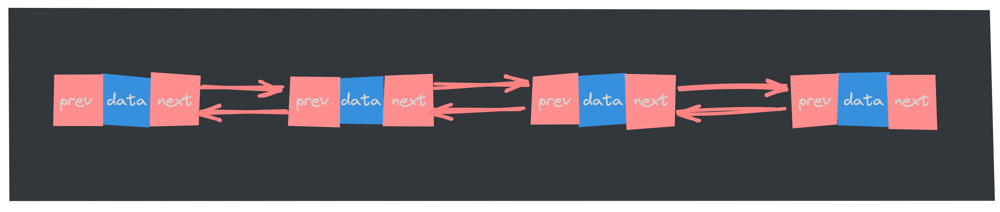

在上篇文章中，我们深入探讨了**[数组](https://mp.weixin.qq.com/s/c-yE-d9Tl_Sg3kd7Cpg3xg)**这一基础数据结构及其特性。***数组以其固定大小和快速访问***的特点被广泛应用，但在某些场景下，其固有的局限性也逐渐显露出来，例如在频繁的插入和删除操作中，数组的效率显得捉襟见肘。为了应对这些挑战，我们引入了链表这一灵活且动态的数据结构。链表通过节点的连接方式，允许我们快速地进行数据的增删操作，是许多算法和数据结构的重要基础。接下来，我们将详细了解链表的基本概念、类型及其应用场景！

## 双向链表

单向链表只有一个方向，节点只有一个后继指针 next 指向下一个节点。而双向链表，顾名思义，它支持两个方向，每个节点不止有一个后继指针 next 指向后面的节点，还有一个前驱指针 prev 指向前面的节点。



从图中也可以看出，在双向链表中，每个节点通常包含以下三个部分：

- **数据域(data)**：存储节点的数据。
- **前驱指针(prev)**：指向链表中前一个节点的指针。
- **后继指针(next)**：指向链表中下一个节点的指针。

双向链表需要额外的两个空间来存储前驱节点和后继节点的地址。因此，存储同样多的数据，双向链表要比单链表占用更多的内存空间（因为有 prev、next 两个指针），虽然两个指针比较浪费存储空间，但可以支持双向遍历，这样也带来了双向链表操作的灵活性。

它的特点：

- 从双链表的任意一个节点开始，都可以很方便的访问它的前驱节点和后继节点。
- 头节点的前驱指针和尾节点的后继指针都指向 `Null`。

### 双链表的基本操作

双向链表的基本操作，包括节点的插入、删除、查找以及遍历。我们将通过 Go 和 JavaScript 语言的实现示例，在完整的代码实现之前，先将双向链表的数据结构定义出来：

```go
// 定义双向链表的节点结构体
type Node struct {
	Data int
	prev *Node // 指向前一个节点
	next *Node // 指向后一个节点
}

// 定义双向链表结构体
type DoublyLinkedList struct {
	head *Node // 指向链表头部
	tail *Node // 指向链表尾部
}
```

这两段代码定义了双向链表的基本结构，其中 `Node` 结构体用于表示链表中的单个节点，而 `DoublyLinkedList` 结构体则用于表示整个链表。

#### **创建节点**

创建一个新的节点，包含数据域、前驱指针和后继指针。

```go
// 创建一个新的节点
func newNode(data int) *Node {
	return &Node{Data: data}
}
```

这个 `newNode` 函数的作用是创建一个新的双向链表节点，并将传入的数据存储在节点的 `Data` 字段中。函数返回一个指向新创建的 `Node` 结构体的指针，这个指针可以用于将新节点插入到双向链表中。比如调用 `newNode(10)` 时，它会创建一个新的节点，其中 `Data` 字段的值为 `10`，并且返回一个指向这个新节点的指针。

#### **插入新节点**

在双向链表中插入新节点根据添加位置不同，可分为以下 3 种情况：

- 插入到链表的头部（头节点之后），作为首元节点；
- 插入到链表中间的某个位置；
- 插入到链表的最末端，作为链表中最后一个数据元素；

下面分别实现：

- 末尾插入

  ```go
  // 在双向链表的末尾插入一个新节点
  func (dll *DoublyLinkedList) append(data int) {
  	newNode := newNode(data)
  	if dll.tail == nil {
  		dll.head = newNode
  		dll.tail = newNode
  		return
  	}
  	dll.tail.next = newNode
  	newNode.prev = dll.tail
  	dll.tail = newNode
  }
  ```

- 指定位置插入

  ```go
  // 在双向链表的指定位置插入一个新节点
  func (dll *DoublyLinkedList) insertAt(data int, position int) {
      if position < 0 {
          // 负数位置无效
          return
      }
  
      newNode := newNode(data) // 创建新节点
      if dll.head == nil {
          // 如果链表为空，新节点成为唯一的节点
          dll.head = newNode
          dll.tail = newNode
          return
      }
  
      current := dll.head
      for current != nil && position > 0 {
          // 移动到指定位置
          current = current.next
          position--
      }
  
      if current == nil {
          // 插入位置超出链表长度，将新节点插入到末尾
          dll.tail.next = newNode
          newNode.prev = dll.tail
          dll.tail = newNode
      } else {
          // 插入新节点到链表中
          newNode.next = current
          newNode.prev = current.prev
          if current.prev != nil {
              current.prev.next = newNode
          }
          current.prev = newNode
      }
  }
  ```


#### **删除节点**

从链表中删除一个数据无外乎这两种情况：

- 删除节点中“值等于某个给定值”的节点；这就意味着需要先定位被删除元素，然后再执行删除操作，平均时间复杂度为O(n)。
- 删除给定指针指向的节点。 这就意味着不用去定位被删除元素。直接删除这个指针指向的元素即可，时间复杂度为O(1)。

```go
func (dll *DoublyLinkedList) remove(node *Node) {
	if node == nil {
		return
	}
	if node.prev != nil {
		node.prev.next = node.next
	} else {
		dll.head = node.next // 删除头节点
	}
	if node.next != nil {
		node.next.prev = node.prev
	} else {
		dll.tail = node.prev // 删除尾节点
	}
}
```

