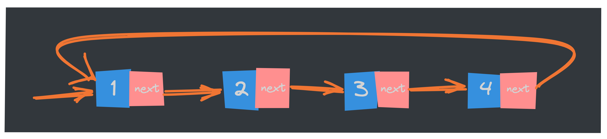

在上篇文章中，我们深入探讨了**[数组](https://mp.weixin.qq.com/s/c-yE-d9Tl_Sg3kd7Cpg3xg)** 这一基础数据结构及其特性。***数组以其固定大小和快速访问***的特点被广泛应用，但在某些场景下，其固有的局限性也逐渐显露出来，例如在频繁的插入和删除操作中，数组的效率显得捉襟见肘。为了应对这些挑战，我们引入了链表这一灵活且动态的数据结构。链表通过节点的连接方式，允许我们快速地进行数据的增删操作，是许多算法和数据结构的重要基础。接下来，我们将详细了解链表的基本概念、类型及其应用场景！

## 循环链表
**循环链表是一种特殊的单链表，它跟单链表唯一的区别就在于尾节点**。在单链表中，尾节点指针指向空地址，表示这就是最后的节点了。而**循环链表的尾结点指针是指向链表的头节点或者其他节点；循环链表的节点数不限，但必须至少有一个头节点**。在循环链表中插入或删除节点时，需要特别处理，不能破坏原有的环形结构。遍历循环链表时也需要使用特殊的方法，否则可能会陷入死循环。循环链表如下图：

> Tips：
>
> 虽然循环链表成环状，但本质上还是链表，因此在循环链表中，依然能够找到头指针和首元节点等。循环链表和普通链表相比，唯一的不同就是循环链表首尾相连，其他都完全一样。

和单链表相比，循环链表的优点是**从链尾到链头比较方便**。**当要处理的数据具有环型结构特点时，就特别适合采用循环链表**。比如著名的[约瑟夫](https://zh.wikipedia.org/wiki/%E7%BA%A6%E7%91%9F%E5%A4%AB%E6%96%AF%E9%97%AE%E9%A2%98)问题；约瑟夫问题是一个古老的数学问题，据说起源于公元1世纪。这个问题的故事情境是：在一个围成圆圈的人群中，依次数到某个数就将该人杀死，直到只剩下最后一个人。问题的关键是找出最后幸存的人的位置。

具体来说，假设有 n 个人围成一圈，从第 k 个人开始依次报数，报到 m 的人出局。然后从下一个人重新开始报数，报到m的人再次出局。重复这个过程，直到只剩下一个人。

