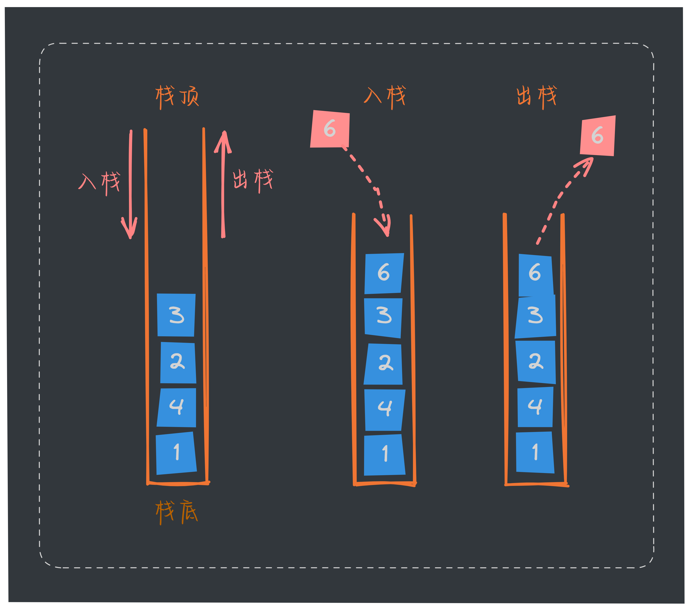

大家好，我是长林啊！一个爱好 JavaScript、Go、Rust 的全栈开发者；致力于终身学习和技术分享。

在上篇文章中，我们深入探讨了[循环链表](https://mp.weixin.qq.com/s/IVQGq7X7zIvk9XdsiU2-Zg) 这一基础数据结构的相关概念及基本操作。我们继续看看堆栈！

## 栈的基本概念
栈是一种基本的数据结构，广泛应用于计算机科学和编程中。其独特的后进先出（LIFO）特性使得它在许多场景中非常高效，特别是在管理函数调用、表达式求值以及状态回溯等任务时。

### 定义

堆栈（Stack）简称为栈。是一种**只允许在表的一端进行插入和删除操作、遵循先入后出逻辑**的线性表数据结构。如下图：



### 栈的重要性与应用场景
栈是一种重要的数据结构，具有多种应用场景。它提供了一种简单且高效的数据存储方式，适用于需要后进先出（LIFO）特性的场合。栈在程序执行中用于管理函数调用和返回，帮助实现递归和嵌套调用，同时在内存管理中扮演着关键角色，尤其是在局部变量的存储和生命周期管理方面。

栈的应用场景包括函数调用管理、表达式求值与解析、括号匹配、深度优先搜索（DFS）、撤销操作以及浏览器历史记录等。在这些应用中，栈不仅帮助检查代码语法的正确性，还支持用户操作的历史管理。通过实现最小栈，能够在常数时间内获取栈中最小元素，进一步展示了栈在数据结构中的重要性。

### 特性
- 栈遵循“后进先出”（Last In, First Out, LIFO）原则，即最后入栈的元素最先出栈。
- 栈是一种线性数据结构，元素之间呈线性关系，操作仅限于栈顶元素，不支持随机访问。
- 在某些实现中（如基于数组的栈），栈的大小是有限的，超出容量时会导致溢出（Stack Overflow）。而基于链表的栈则可以动态扩展。
- 受限操作：限定只能在表尾进行增加和删除操作。可进行操作的一端成为栈顶，不可操作的一端成为栈底。

## 栈的实现
栈既可以用数组来实现，也可以用链表来实现。
- 用数组实现的栈叫作顺序栈。
- 用链表实现的栈叫作链式栈。

### 基于数组的实现

在实现之前，我们先理清思路：
1. **定义栈的结构**
    - 使用一个数组来存储栈中的元素
    - 维护一个指针（或者索引）来只是当前栈顶的位置
2. **初始化**：在栈的创建时，定义一个固定大小的数组，并将栈顶指针（索引）初始化为 -1
3. **实现方法**：
    - 入栈（注意栈溢出）
    - 出栈
    - 获取栈顶元素
    - 检查栈是否为空
    - 栈的大小
    - 清空栈
    - 栈打印

#### Go 语言的实现
- 定义数据结构；通过泛型支持存储不同类型的元素。
  ```go
  type Stack[T any] struct {
      data []T
      top  int
  }
  ```
  
- 创建实例；通过定义一个泛型函数 `NewArrayStack`，用于创建并返回一个新的栈实例。
  ```go
  func NewArrayStack[T any]() *Stack[T] {
      return &Stack[T]{data: make([]T, 0, 32), top: -1}
  }
  ```
  
- 入栈实现
  ```go
  func (s *Stack[T]) Push(data T) {
      s.top++
      s.data = append(s.data, data)
  }
  ```
  
- 出栈的实现
  ```go
  func (s *Stack[T]) Pop() T {
      if s.IsEmpty() {
          var zero T
          return zero
      }
  
      value := s.data[s.top]
      s.data = s.data[:s.top]
      s.top--
      return value
  }
  ```
  
- 获取栈顶元素
  ```go
  func (s *Stack[T]) Top() T {
      if s.IsEmpty() {
          var zero T
          return zero
      }
      return s.data[s.top]
  }
  ```

- 栈是否为空
  ```go
  func (s *Stack[T]) IsEmpty() bool {
      return s.top == -1
  }
  ```
  
- 栈的大小
  ```go
  func (s *Stack[T]) Size() int {
      return s.top + 1 // 或者 len(s.data)
  }
  ```
  
- 清理栈
  ```go
  func (s *Stack[T]) Clear() {
      s.data = make([]T, 0, 32)
      s.top = -1
  }
  ```
  
- 栈打印
  ```go
  func (s *Stack[T]) Print() {
      if s.IsEmpty() {
          fmt.Println("stack is empty")
          return
      }
  
      for i := s.top; i >= 0; i-- {
          fmt.Println(s.data[i], " ")
      }
  }
  ```

Go 语言的完整代码和测试用例可以查看 [https://go.dev/play/p/XtODJ1-XPKm](https://go.dev/play/p/XtODJ1-XPKm)。

#### TypeScript 的实现
```ts
// /stack/arraystack.ts
export default class ArrayStack<T> {
    private data: T[];
    private count: number;

    constructor() {
        this.data = [];
        this.count = -1;
    }

    push(item: T) {
        this.data.push(item);
        this.count++;
    }

    pop(): T | undefined {
        if (this.count < 0) {
            return undefined;
        }
        const value = this.data.pop();
        this.count--;
        return value;
    }

    top(): T | undefined {
        if (this.count < 0) {
            return undefined;
        }
        return this.data[this.count];
    }

    isEmpty(): boolean {
        return this.count < 0;
    }

    size(): number {
        return this.count + 1;
    }

    clear() {
        this.data = [];
        this.count = -1;
    }

    print() {
        console.log(this.data);
    }
}
```
测试用例：
```ts
// /stack/arraystack.test.ts
import ArrayStack from './arraystack'; // 确保路径正确

describe('ArrayStack', () => {
    let stack: ArrayStack<number>;

    beforeEach(() => {
        stack = new ArrayStack<number>();
    });

    test('should initialize empty stack', () => {
        expect(stack.isEmpty()).toBe(true);
        expect(stack.size()).toBe(0);
    });

    test('should push items onto the stack', () => {
        stack.push(1);
        stack.push(2);
        stack.push(3);

        expect(stack.isEmpty()).toBe(false);
        expect(stack.size()).toBe(3);
        expect(stack.top()).toBe(3);
    });

    test('should pop items from the stack', () => {
        stack.push(1);
        stack.push(2);
        stack.push(3);

        expect(stack.pop()).toBe(3);
        expect(stack.size()).toBe(2);
        expect(stack.top()).toBe(2);
    });

    test('should return undefined when popping from an empty stack', () => {
        expect(stack.pop()).toBeUndefined();
    });

    test('should return the top item without removing it', () => {
        stack.push(1);
        stack.push(2);

        expect(stack.top()).toBe(2);
        expect(stack.size()).toBe(2); // Size should remain the same
    });

    test('should clear the stack', () => {
        stack.push(1);
        stack.push(2);
        stack.clear();

        expect(stack.isEmpty()).toBe(true);
        expect(stack.size()).toBe(0);
        expect(stack.top()).toBeUndefined();
    });

    test('should handle multiple push and pop operations', () => {
        stack.push(1);
        stack.push(2);
        stack.push(3);

        expect(stack.pop()).toBe(3);
        expect(stack.pop()).toBe(2);
        expect(stack.pop()).toBe(1);
        expect(stack.isEmpty()).toBe(true);
    });
});
```

### 基于链表的实现
上面看完了基于链表的实现跟数组的方式实现，本质上没有多少不同，只是在数据结构上稍有差异！也是定义一个链表节点结构体，以及一个栈结构体，包含基本的栈操作，如入栈、出栈、查看栈顶元素、检查是否为空和打印栈的内容。

#### Go 语言的实现
```go
// /stack/linkedliststack.go
package stack

import "fmt"

// Comparable 接口用于比较泛型类型
type Comparable[T any] interface {
	Compare(other T) bool
}

// 定义链表节点，T 为类型参数
type Node[T any] struct {
	data T        // 数据域
	next *Node[T] // 指向下一个节点
}

// 定义链表结构，T 为类型参数
type LinkedListStack[T Comparable[T]] struct {
	head   *Node[T] // 头节点
	length uint     // 链表长度
}

// 用于获取类型 T 的零值
func zeroValue[T any]() T {
	var zero T
	return zero
}

// 创建新节点
func NewListNode[T Comparable[T]](v T) *Node[T] {
	return &Node[T]{
		data: v,
		next: nil,
	}
}

// 创建新链表
func NewLinkedListStack[T Comparable[T]]() *LinkedListStack[T] {
	return &LinkedListStack[T]{
		head:   NewListNode[T](zeroValue[T]()),
		length: 0,
	}
}

// 判断链表是否为空
func (list *LinkedListStack[T]) IsEmpty() bool {
	return list.length == 0
}

// 链表入栈
func (list *LinkedListStack[T]) Push(v T) {
	list.head = &Node[T]{
		data: v,
		next: list.head,
	}
	list.length++
}

// 链表出栈
func (list *LinkedListStack[T]) Pop() (data T, ok bool) {
	if list.IsEmpty() {
		return zeroValue[T](), false
	}
	current := list.head
	// 获取链表头部的下一个节点
	list.head = current.next
	list.length--
	return current.data, true
}

// 链表栈顶
func (list *LinkedListStack[T]) Top() (data T, ok bool) {
	if list.IsEmpty() {
		return zeroValue[T](), false
	}
	return list.head.data, true
}

// 链表长度
func (list *LinkedListStack[T]) Size() uint {
	return uint(list.length)
}

// 清空
func (list *LinkedListStack[T]) Clear() {
	list.head = NewListNode[T](zeroValue[T]())
	list.length = 0
}

// 打印
func (list *LinkedListStack[T]) Print() {
	current := list.head
	for current != nil {
		fmt.Print(current.data, " -> ")
		current = current.next
	}
	fmt.Println("nil")
}
```
测试用例如下：
```go
// /stack/linkedliststack_test.go
package stack

import (
	"fmt"
	"testing"
)

// 定义一个简单的类型，实现 Comparable 接口
type Int int

func (a Int) Compare(other Int) bool {
	return a == other
}

func TestLinkedListStack(t *testing.T) {
	stack := NewLinkedListStack[Int]()

	// 测试初始状态
	if !stack.IsEmpty() {
		t.Errorf("Expected stack to be empty")
	}
	if size := stack.Size(); size != 0 {
		t.Errorf("Expected size to be 0, got %d", size)
	}

	// 测试入栈
	stack.Push(1)
	stack.Push(2)
	stack.Push(3)

	// 测试栈的状态
	if stack.IsEmpty() {
		t.Errorf("Expected stack to not be empty")
	}
	if size := stack.Size(); size != 3 {
		t.Errorf("Expected size to be 3, got %d", size)
	}

	// 测试栈顶元素
	if top, ok := stack.Top(); !ok || top != 3 {
		t.Errorf("Expected top element to be 3, got %d", top)
	}

	// 测试出栈
	if popped, ok := stack.Pop(); !ok || popped != 3 {
		t.Errorf("Expected popped element to be 3, got %d", popped)
	}
	if size := stack.Size(); size != 2 {
		t.Errorf("Expected size to be 2 after pop, got %d", size)
	}

	// 测试再次出栈
	if popped, ok := stack.Pop(); !ok || popped != 2 {
		t.Errorf("Expected popped element to be 2, got %d", popped)
	}

	// 测试栈顶元素
	if top, ok := stack.Top(); !ok || top != 1 {
		t.Errorf("Expected top element to be 1, got %d", top)
	}

	// 测试清空栈
	stack.Clear()
	if !stack.IsEmpty() {
		t.Errorf("Expected stack to be empty after clear")
	}
	if size := stack.Size(); size != 0 {
		t.Errorf("Expected size to be 0 after clear, got %d", size)
	}

	// 测试从空栈出栈
	if popped, ok := stack.Pop(); ok || popped != 0 {
		t.Errorf("Expected popped element from empty stack to be 0 and ok to be false, got %d", popped)
	}

	// 测试栈的打印（可选）
	fmt.Println("Current stack state:")
	stack.Print()
}
```
完整代码可以在 [https://go.dev/play/p/mIp8M2BWX5Y](https://go.dev/play/p/mIp8M2BWX5Y) 中体验并查看！

#### TypeScript 的实现
```ts
// /stack/linkedliststack.ts
class LinkedNode<T> {
    data: T
    next: LinkedNode<T> | null
    constructor(v: T, next: LinkedNode<T> | null) {
        this.data = v
        this.next = next
    }
}

interface LinkedListStack<T> {
    push(v: T): void
    pop(): T | null
    top(): T | null
    isEmpty(): boolean
    size(): number
    clear(): void
    print(): void
}

class LinkedListStack<T> implements LinkedListStack<T> {
    private head: LinkedNode<T> | null;
    private length: number;

    constructor() {
        // 初始化
        this.head = null;
        this.length = 0;
    }

    // 入栈
    push(v: T): void {
        const node = new LinkedNode(v, this.head);
        this.head = node;
        this.length++;
    }

    // 出栈
    pop(): T | null {
        if (this.isEmpty()) {
            return null;
        }
        const value = this.head?.data || null;
        this.head = this.head?.next || null;
        this.length--;
        return value;
    }

    // 获取栈顶元素
    top(): T | null {
        if (this.isEmpty()) {
            return null;
        }
        return this.head?.data || null;
    }

    // 判断栈是否为空
    isEmpty(): boolean {
        return this.length === 0;
    }

    // 获取栈长度
    size(): number {
        return this.length;
    }

    // 清空栈
    clear() {
        this.head = null;
        this.length = 0;
    }

    // 打印栈
    print() {
        let current = this.head;
        while (current) {
            console.log(current.data);
            current = current.next;
        }
    }
}

export default LinkedListStack
```
测试用例：
```ts
// /stack/linkedliststack.test.ts
import LinkedListStack from './linkedliststack';

// 定义一个简单的类型用于测试
type TestDataType = number;

describe('LinkedListStack', () => {
    let stack: LinkedListStack<TestDataType>;

    beforeEach(() => {
        stack = new LinkedListStack<TestDataType>();
    });

    test('should be empty on initialization', () => {
        expect(stack.isEmpty()).toBe(true);
        expect(stack.size()).toBe(0);
    });

    test('should push elements onto the stack', () => {
        stack.push(1);
        stack.push(2);
        stack.push(3);

        expect(stack.isEmpty()).toBe(false);
        expect(stack.size()).toBe(3);
        expect(stack.top()).toBe(3);
    });

    test('should pop elements from the stack', () => {
        stack.push(1);
        stack.push(2);
        stack.push(3);

        expect(stack.pop()).toBe(3);
        expect(stack.size()).toBe(2);
        expect(stack.top()).toBe(2);
    });

    test('should return null when popping from an empty stack', () => {
        expect(stack.pop()).toBeNull();
    });

    test('should return the top element without removing it', () => {
        stack.push(1);
        expect(stack.top()).toBe(1);
        expect(stack.size()).toBe(1);
    });

    test('should clear the stack', () => {
        stack.push(1);
        stack.push(2);
        stack.clear();

        expect(stack.isEmpty()).toBe(true);
        expect(stack.size()).toBe(0);
    });

    test('should print the stack elements', () => {
        const consoleSpy = jest.spyOn(console, 'log');
        stack.push(1);
        stack.push(2);
        stack.push(3);

        stack.print();

        expect(consoleSpy).toHaveBeenCalledWith(3);
        expect(consoleSpy).toHaveBeenCalledWith(2);
        expect(consoleSpy).toHaveBeenCalledWith(1);

        consoleSpy.mockRestore(); // 清理 spy
    });
});
```

## 实践应用

### 浏览器的前进后退功能
使用栈实现浏览器的前进和后退功能是一个经典的应用场景。我们可以使用两个栈来保存浏览历史：
- **一个栈用于保存后退历史**。
- **一个栈用于保存前进历史**。

#### 实现思路
- **后退栈**：存储用户已访问的页面，以便在用户选择后退时恢复到之前的页面。
- **前进栈**：存储用户后退后可以前进的页面，以便在用户选择前进时恢复这些页面。

#### 基于链表来实现

- **使用 Go 语言的实现**
```go
package main

import (
	"fmt"
)

// Node 表示双向链表中的一个节点
type Node struct {
	URL  string // 当前 URL
	Prev *Node  // 指向前一个节点
	Next *Node  // 指向下一个节点
}

// BrowserHistory 表示浏览器历史
type BrowserHistory struct {
	Current *Node // 当前节点
}

// History 接口定义浏览器历史的行为
type History interface {
	Visit(url string)
	Back() string
	Forward() string
	CurrentURL() string
}

// 确保 BrowserHistory 实现了 History 接口
var _ History = (*BrowserHistory)(nil)

// NewBrowserHistory 初始化一个新的 BrowserHistory
func NewBrowserHistory() *BrowserHistory {
	return &BrowserHistory{}
}

// Visit 添加一个新的 URL 到历史中
func (b *BrowserHistory) Visit(url string) {
	newNode := &Node{URL: url}
	if b.Current != nil {
		newNode.Prev = b.Current
		b.Current.Next = newNode
	}
	b.Current = newNode
}

// Back 后退到历史中的前一个 URL
func (b *BrowserHistory) Back() string {
	if b.Current == nil || b.Current.Prev == nil {
		return "没有之前的 URL"
	}
	b.Current = b.Current.Prev
	return b.Current.URL
}

// Forward 前进到历史中的下一个 URL
func (b *BrowserHistory) Forward() string {
	if b.Current == nil || b.Current.Next == nil {
		return "没有下一个 URL"
	}
	b.Current = b.Current.Next
	return b.Current.URL
}

// CurrentURL 返回当前的 URL
func (b *BrowserHistory) CurrentURL() string {
	if b.Current == nil {
		return "没有当前 URL"
	}
	return b.Current.URL
}

func main() {
	history := NewBrowserHistory()

	history.Visit("https://www.google.com")
	history.Visit("https://www.facebook.com")
	history.Visit("https://www.twitter.com")

	fmt.Println("当前 URL:", history.CurrentURL()) // Twitter

	fmt.Println("后退到:", history.Back()) // Facebook
	fmt.Println("后退到:", history.Back()) // Google
	fmt.Println("后退到:", history.Back()) // 没有之前的 URL

	fmt.Println("前进到:", history.Forward()) // Facebook
	fmt.Println("前进到:", history.Forward()) // Twitter
	fmt.Println("前进到:", history.Forward()) // 没有下一个 URL
}
```
- **使用 TypeScript 的实现**
```ts
// 定义 IBrowserHistory 接口
interface IBrowserHistory {
    visit(url: string): void;
    back(): string;
    forward(): string;
    currentUrl(): string;
}

// ListNode 类表示双向链表中的一个节点
class ListNode<T> {
    url: string;
    prev: ListNode<T> | null;
    next: ListNode<T> | null;

    constructor(url: string) {
        this.url = url;
        this.prev = null;
        this.next = null;
    }
}

// BrowserHistory 类实现 IBrowserHistory 接口
export default class BrowserHistory implements IBrowserHistory {
    private current: ListNode<string> | null;

    constructor() {
        this.current = null;
    }

    // 访问新 URL
    visit(url: string) {
        const newNode = new ListNode<string>(url);
        if (this.current) {
            newNode.prev = this.current;
            this.current.next = newNode;
        }
        this.current = newNode;
    }

    // 后退到前一个 URL
    back() {
        if (!this.current || !this.current.prev) {
            return "没有之前的 URL";
        }
        this.current = this.current.prev;
        return this.current.url;
    }

    // 前进到下一个 URL
    forward() {
        if (!this.current || !this.current.next) {
            return "没有下一个 URL";
        }
        this.current = this.current.next;
        return this.current.url;
    }

    // 返回当前的 URL
    currentUrl() {
        if (!this.current) {
            return "没有当前 URL";
        }
        return this.current.url;
    }
}
```
测试用例如下：
```ts
// browserHistory.test.ts
import BrowserHistory from './browserlinkedlist'; // 根据实际文件路径修改

describe('BrowserHistory', () => {
    let bHistory: BrowserHistory;

    beforeEach(() => {
        bHistory = new BrowserHistory();
    });

    test('访问 URL 应该更新当前 URL', () => {
        bHistory.visit("https://www.google.com");
        expect(bHistory.currentUrl()).toBe("https://www.google.com");

        bHistory.visit("https://www.facebook.com");
        expect(bHistory.currentUrl()).toBe("https://www.facebook.com");
    });

    test('后退功能应返回上一个 URL', () => {
        bHistory.visit("https://www.google.com");
        bHistory.visit("https://www.facebook.com");

        expect(bHistory.back()).toBe("https://www.google.com");
        expect(bHistory.currentUrl()).toBe("https://www.google.com");
    });

    test('后退到无前一个 URL 应返回提示信息', () => {
        expect(bHistory.back()).toBe("没有之前的 URL");
    });

    test('前进功能应返回下一个 URL', () => {
        bHistory.visit("https://www.google.com");
        bHistory.visit("https://www.facebook.com");
        bHistory.back(); // 现在在 Google

        expect(bHistory.forward()).toBe("https://www.facebook.com");
        expect(bHistory.currentUrl()).toBe("https://www.facebook.com");
    });

    test('前进到无下一个 URL 应返回提示信息', () => {
        bHistory.visit("https://www.google.com");
        bHistory.visit("https://www.facebook.com");

        expect(bHistory.forward()).toBe("没有下一个 URL");
    });

    test('没有当前 URL 应返回提示信息', () => {
        expect(bHistory.currentUrl()).toBe("没有当前 URL");
    });
});
```

## 总结

栈是一种遵循“后进先出”（LIFO）原则的线性数据结构，广泛应用于各种计算任务。通过实现栈的基本操作，如入栈、出栈和查看栈顶元素，可以有效管理数据的存取顺序。**使用数组实现栈时，采用固定大小的数组，具备快速访问的优点，但限制了栈的大小；而链表实现则提供了动态扩展的灵活性，但在存储和访问上稍显复杂。**

最后有以浏览器的前进和后退功能的例子以辅助理解栈。