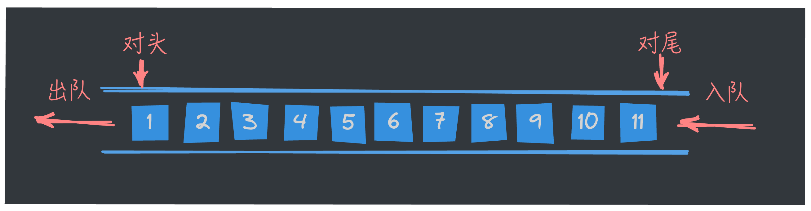

大家好，我是长林啊！一个爱好 JavaScript、Go、Rust 的全栈开发者；致力于终身学习和技术分享。

在上篇文章中，我们深入探讨了堆栈这一基础数据结构的相关概念及基本操作。我们继续看看队列！

## 队列的基本概念

在数据结构与算法中，**队列**（Queue）是一种**「先进先出」**（FIFO, First In First Out）的线性数据结构。这意味着第一个进入队列的元素会第一个被取出，类似于排队买票或等车的场景。

我们把队列中允许插入的一端称为 **「队尾（rear）」**；把允许删除的另一端称为 **「队头（front）」**。当表中没有任何数据元素时，称之为 **「空队」**。



队列跟栈一样,也是首先的线性表数据结构；队列有两种基本操作：**「插入操作」** 和 **「删除操作」**。

- 队列的插入操作又称为「入队」。
- 队列的删除操作又称为「出队」。

### 特性

队列的特性主要体现在其操作方式和处理规则上。作为一种**先进先出**（FIFO, First In First Out）的数据结构，队列的特性可以总结为以下几个方面：

- 先进先出原则：即第一个进入队列的元素总是第一个被取出。
- 有序性：队列中的元素按照插入的顺序保持有序。每个新元素总是被插入到队列的尾部，而从队列中移除的元素始终来自队列的头部。
- 容量限制：在固定大小（有界）的队列中，队列可能有容量限制。如果队列达到最大容量，再插入新元素时将触发**队满**状态。
- 空间与时间复杂度：队列操作的时间复杂度一般为 `O(1)`，因为插入和删除操作仅涉及头部和尾部的调整，不需要遍历整个队列。队列的空间复杂度取决于队列中存储的元素数量。

## 队列的实现

与栈一样，队列既可以用数组来实现，也可以用链表来实现。
- 用数组实现的队列叫作顺序队列。
- 用链表实现的队列叫作链式队列。


### 基于数组的实现

在实现之前，我们先理清思路：
1. 数组定义 

   使用一个固定大小的数组来存储队列中的元素，并定义两个指针变量 `front` 和 `rear`，分别表示队列的头部和尾部位置。`front` 指向队列中的第一个元素，`rear` 指向队列中最后一个元素的位置。

2. 初始化

   - 创建一个大小为 `capacity` 的数组 `queue[]` 来存储队列元素。

   - 初始化 `front` 和 `rear` 指针，通常设置为 `-1` 或 `0`。也可以将 `front` 初始化为 `0`，将 `rear` 初始化为 `-1`，以方便后续处理。

   - 初始化队列大小 `size` 为 `0`，用于记录队列中当前的元素个数。

3. 入队操作（Enqueue）

   - 检查是否满：在入队之前，需要检查队列是否已满。队列满的条件是 `size == capacity`。

   - 更新 `rear`：如果队列未满，将 `rear` 指针向前移动（即 `rear = (rear + 1) % capacity`），以便环形利用数组。当 `rear` 指向数组末尾时，下一次入队会回到数组的起点。

   - 插入元素：在 `rear` 所指的位置插入新元素。

   - 更新 `size`：入队成功后，`size` 增加 1。

4. 出队操作（Dequeue）

   - 检查是否空：在出队之前，需要检查队列是否为空。队列空的条件是 `size == 0`。

   - 获取队头元素：取出 `front` 所指位置的元素。

   - 更新 `front`：将 `front` 指针向后移动（即 `front = (front + 1) % capacity`）。当 `front` 到达数组末尾时，下一次出队会从数组起点开始。

   - 更新 `size`：出队成功后，`size` 减少 1。

5. 队列满与空的判断

   - 队列满的条件：`size == capacity`。

   - 队列空的条件：`size == 0`。

#### Go 语言的实现
```go
// /queue/arrayqueue.go
package queue

type ArrayQueue[T any] struct {
	data     []T
	capacity int // 队列容量
	front    int // 队头指针
	rear     int // 队尾指针
	size     int // 队列长度
}

type ArrayQueueMethod[T any] interface {
	Enqueue(T)
	Dequeue() (T, bool)
	Front() T
	IsEmpty() bool
	IsFull() bool
	Size() int
}

func NewArrayQueue[T any](capacity int) *ArrayQueue[T] {
	return &ArrayQueue[T]{
		data:     make([]T, capacity),
		capacity: capacity,
		front:    0,
		rear:     -1,
		size:     0,
	}
}

var _ ArrayQueueMethod[int] = (*ArrayQueue[int])(nil)

// 入队
func (aq *ArrayQueue[T]) Enqueue(data T) {
	// 判断队列是否已满
	if aq.IsFull() {
		return
	}
	aq.rear = (aq.rear + 1) % aq.capacity
	aq.data[aq.rear] = data
	aq.size++
}

// 出队
func (aq *ArrayQueue[T]) Dequeue() (T, bool) {
	// 判断队列是否为空
	if aq.IsEmpty() {
		var zero T
		return zero, false
	}
	// 队头元素出队
	item := aq.data[aq.front]
	// 更新对头
	aq.front = (aq.front + 1) % aq.capacity
	aq.size--
	return item, true
}

// 队头
func (aq *ArrayQueue[T]) Front() T {
	if aq.IsEmpty() {
		var zero T
		return zero
	}
	return aq.data[aq.front]
}

// 判断队列是否为空
func (aq *ArrayQueue[T]) IsEmpty() bool {
	return aq.size == 0
}

// 判断队列是否已满
func (aq *ArrayQueue[T]) IsFull() bool {
	return aq.size == aq.capacity
}

// 队列长度
func (aq *ArrayQueue[T]) Size() int {
	return aq.size
}
```

Go 语言的完整代码和测试用例可以查看 [https://go.dev/play/p/e7Izks-uiTp](https://go.dev/play/p/e7Izks-uiTp)。

#### TypeScript 的实现

```ts
// /queue/array-queue.ts
interface IArrayQueue<T> {
    enqueue(item: T): void
    dequeue(): T
    getFront(): T
    isEmpty(): boolean
    isFull(): boolean
    getSize(): number
}

export default class ArrayQueue<T> implements IArrayQueue<T> {
    private data: T[]
    private capacity: number
    private front: number
    private rear: number
    private size: number

    // capacity 这里做了个兜底
    constructor(capacity: number = 10) {
        this.data = new Array(capacity)
        this.capacity = capacity
        this.front = 0
        this.rear = -1
        this.size = 0
    }

    enqueue(item: T) {
        if (this.isFull()) {
            throw new Error('queue is full')
        }
        this.rear = (this.rear + 1) % this.capacity
        this.data[this.rear] = item
        this.size++
    }

    dequeue(): T {
        if (this.isEmpty()) {
            throw new Error('queue is empty')
        }
        const data = this.data[this.front]
        this.front = (this.front + 1) % this.capacity
        this.size--
        return data
    }

    getFront() {
        if (this.isEmpty()) {
            throw new Error('queue is empty')
        }
        return this.data[this.front]
    }

    isFull() {
        return this.size === this.capacity
    }

    isEmpty() {
        return this.size === 0
    }

    getSize() {
        return this.size
    }
}
```
测试用例：
```ts
// /queue/array-queue.test.ts
import ArrayQueue from './array-queue';

describe('ArrayQueue', () => {
    it('should create an empty queue', () => {
        const queue = new ArrayQueue<number>();
        expect(queue.getSize()).toBe(0);
        expect(queue.isEmpty()).toBe(true);
    });

    it('should enqueue and dequeue elements', () => {
        const queue = new ArrayQueue<number>();
        queue.enqueue(1);
        queue.enqueue(2);
        queue.enqueue(3);
        expect(queue.getSize()).toBe(3);
        expect(queue.getFront()).toBe(1);
        expect(queue.dequeue()).toBe(1);
        expect(queue.getSize()).toBe(2);
        expect(queue.getFront()).toBe(2);
    });

    it('should throw an error when dequeuing from an empty queue', () => {
        const queue = new ArrayQueue<number>();
        expect(() => queue.dequeue()).toThrow('queue is empty');
    });

    it('should throw an error when getting the front of an empty queue', () => {
        const queue = new ArrayQueue<number>();
        expect(() => queue.getFront()).toThrow(new Error('queue is empty'));
    });

    it('should throw an error when enqueuing to a full queue', () => {
        const queue = new ArrayQueue<number>(2);
        queue.enqueue(1);
        queue.enqueue(2);
        expect(() => queue.enqueue(3)).toThrow('queue is full');
    });

    it('should correctly check if the queue is full', () => {
        const queue = new ArrayQueue<number>(2);
        queue.enqueue(1);
        expect(queue.isFull()).toBe(false);
        queue.enqueue(2);
        expect(queue.isFull()).toBe(true);
    });
});
```

基于链表的实现跟上面基于数组的方式实现，本质上没有多少不同，只是在数据结构上稍有差异！也是定义一个链表节点结构体，以及一个队列结构体，包含基本的队列操作。


## 循环队列

循环队列主要解决了传统队列在达到最大容量后无法继续添加元素的问题。它利用一个固定大小的数组来存储元素，当队列的尾部到达数组的末尾时，如果队列的前部有空闲空间，就可以从头部继续添加新元素。

### 特点：

1. **固定大小**：循环队列的大小在创建时确定，不能动态扩展。
2. **头尾指针**：使用两个指针（通常称为头指针和尾指针）来标记队列的对头和队尾。
3. **环绕特性**：当尾指针到达数组的末尾时，如果对头有空位，可以绕回到数组的开始位置。


使用Go语言来实现一下:

```go
package main

import (
	"errors"
	"fmt"
)

type CircularQueue struct {
	data  []int // 存储数据
	head  int   // 头指针
	tail  int   // 尾指针
	count int   // 当前元素个数
	size  int   // 队列容量
}

// 创建一个新的循环队列
func NewCircularQueue(size int) *CircularQueue {
	return &CircularQueue{
		data:  make([]int, size),
		head:  0,
		tail:  0,
		count: 0,
		size:  size,
	}
}

// 入队操作
func (q *CircularQueue) Enqueue(value int) error {
	if q.count == q.size {
		return errors.New("队列已满")
	}
	q.data[q.tail] = value
	q.tail = (q.tail + 1) % q.size
	q.count++
	return nil
}

// 打印队列内容
func (q *CircularQueue) Print() {
	for i := 0; i < q.count; i++ {
		index := (q.head + i) % q.size
		fmt.Print(q.data[index], " ")
	}
	fmt.Println()
}

func main() {
	queue := NewCircularQueue(5)

	// 入队操作示例
	for i := 1; i <= 5; i++ {
		if err := queue.Enqueue(i); err != nil {
			fmt.Println(err)
		}
	}

	queue.Print() // 输出: 1 2 3 4 5

	// 尝试再入队一个元素
	if err := queue.Enqueue(6); err != nil {
		fmt.Println(err) // 输出: 队列已满
	}
}
```

查看完整代码和测试用例可以访问 [https://go.dev/play/p/HTuZucdnd0v](https://go.dev/play/p/HTuZucdnd0v)。

## 总结

队列以“先进先出”（FIFO）的方式处理元素，确保插入和删除操作遵循一定的顺序。

接着介绍了队列的基本操作，包括入队和出队，还基于数组的方式实现了所有的方法。

循环队列作为一种改进的队列实现，有效地解决了传统队列在达到最大容量后无法继续添加元素的问题。通过合理利用数组的环绕特性，循环队列能够在固定大小的条件下，实现高效的入队和出队操作。