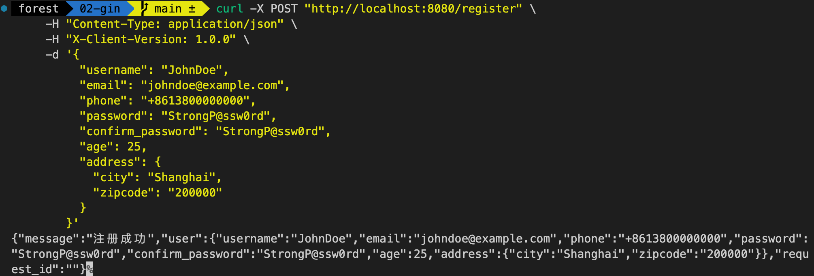

在现代 Web 开发中，高效、安全地处理客户端请求参数是构建可靠 API 的关键能力之一。Gin 框架作为 Go 语言生态中备受推崇的高性能Web框架，凭借其基于 Radix 树的路由设计、低内存消耗及出色的并发处理能力，成为开发者快速构建 API 服务的首选工具。然而，无论是简单的查询参数、动态路径变量，还是复杂的 JSON 请求体或文件上传，参数解析的准确性与健壮性直接影响到接口的功能完整性和安全性。

参数解析不仅是Web应用与用户交互的“桥梁”，更涉及数据验证、类型转换、恶意输入防御等核心问题。例如，一个未正确处理的查询参数可能导致 SQL 注入，而忽略文件上传大小限制可能引发服务器资源耗尽。Gin框架通过简洁的 API 设计（如c.Query()、c.ShouldBindJSON()）和灵活的验证机制，大幅简化了参数处理流程，但开发者仍需深入理解其底层逻辑与最佳实践，才能避免“踩坑”。

本文涉及的内容有：

- 路径参数
- 查询参数
- Form 表单
- JSON/XML
- binding

## Gin参数类型与解析方法

### 路径参数

在 Gin 框架中，路径参数（Path Parameters）用于在 URL 中传递动态值。Gin 通过 `:param` 语法定义路径参数，并通过 `c.Param("param")` 获取参数值。

#### 基本路径参数

获取一个路径参数的情况；比如：`GET http://localhost:8080/user/1234`

```go
package main

import (
	"github.com/gin-gonic/gin"
	"net/http"
)

func main() {
	r := gin.Default()

	// 定义路径参数
	r.GET("/user/:id", func(c *gin.Context) {
		id := c.Param("id") // 获取路径参数
		c.JSON(http.StatusOK, gin.H{
			"user_id": id,
		})
	})

	r.Run(":8080")
}
```

在浏览器或者终端中使用 `curl` 命令请求 `http://localhost:8080/user/1234` 会得到如下结果：

```json
{ "user_id": "1234" }
```

#### 多个路径参数

```go
r.GET("/user/:id/order/:order_id", func(c *gin.Context) {
	id := c.Param("id")
	orderID := c.Param("order_id")

	c.JSON(http.StatusOK, gin.H{
		"user_id":  id,
		"order_id": orderID,
	})
})
```

在浏览器或者终端中使用 `curl` 命令请求 `http://localhost:8080/user/42/order/789` 会得到如下结果：

```json
{
    "user_id": "42",
    "order_id": "789"
}
```

#### 可选路径参数（通配符 \*）

Gin 不支持原生可选路径参数，但可以使用 \* 通配符匹配额外的路径部分。

```go
r.GET("/files/*filepath", func(c *gin.Context) {
	filepath := c.Param("filepath") // 获取通配符路径
	c.JSON(http.StatusOK, gin.H{
		"filepath": filepath,
	})
})
```

在浏览器或者终端中使用 `curl` 命令请求 `http://localhost:8080/files/docs/readme.txt` 会得到如下结果：

```json
{
    "filepath": "/docs/readme.txt"
}
```

通配符匹配的路径会包含 `/`，所以通常需要手动去掉前导 `/`。

### 查询参数

查询参数（Query Parameters）通常用于在 URL 中传递键值对参数，格式为 `?key=value`，可以使用 `c.Query()` 或 `c.DefaultQuery()` 获取。

#### **1、获取查询参数**

使用 `c.Query("key")` 获取查询参数：

```go
r.GET("/search", func(c *gin.Context) {
	keyword := c.Query("keyword") // 获取查询参数
	c.JSON(http.StatusOK, gin.H{
		"keyword": keyword,
	})
})
```

在浏览器或者终端中使用 `curl` 命令请求 `http://localhost:8080/search?keyword=gin` 会得到如下结果：

```json
{
    "keyword": "gin"
}
```

如果 `keyword` 参数不存在，`c.Query("keyword")` 返回空字符串 `""`。

#### **2、设置默认值**

使用 `c.DefaultQuery("key", "default_value")` 设置默认值：

```go
r.GET("/search", func(c *gin.Context) {
	keyword := c.DefaultQuery("keyword", "default")
	c.JSON(http.StatusOK, gin.H{
		"keyword": keyword,
	})
})
```

在浏览器或者终端中使用 `curl` 命令请求 `http://localhost:8080/search`，请求时不包含 `keyword`，则返回默认值：

```json
{
    "keyword": "default"
}
```

#### **3、获取多个查询参数**

```go
r.GET("/filter", func(c *gin.Context) {
	category := c.Query("category")
	price := c.Query("price")

	c.JSON(http.StatusOK, gin.H{
		"category": category,
		"price":    price,
	})
})
```

在浏览器或者终端中使用 `curl` 命令请求 `http://localhost:8080/filter?category=books&price=20` 会得到如下结果：

```json
{
    "category": "books",
    "price": "20"
}
```

#### **4、获取数组查询参数**

使用 `c.QueryArray("key")` 获取多个同名参数：

```go
r.GET("/tags", func(c *gin.Context) {
	tags := c.QueryArray("tag") // 获取多个 tag 参数
	c.JSON(http.StatusOK, gin.H{
		"tags": tags,
	})
})
```

在浏览器或者终端中使用 `curl` 命令请求 `http://localhost:8080/tags?tag=go&tag=gin&tag=web` 会得到如下结果：

```json
{
    "tags": ["go", "gin", "web"]
}
```

#### **5、获取查询参数映射**

```go
r.GET("/users", func(c *gin.Context) {
	users := c.QueryMap("user") // 解析 user[name]=xxx&user[age]=xxx
	c.JSON(http.StatusOK, gin.H{
		"users": users,
	})
})
```

在浏览器访问 `http://localhost:8080/users?user[name]=alice&user[age]=25` 会得到如下结果：

```json
{
    "users": {
        "name": "alice",
        "age": "25"
    }
}
```

Gin 的查询参数用法适用于搜索、筛选等场景。

### Form 表单

在 Gin 框架中，可以使用 `c.PostForm()`、`c.DefaultPostForm()` 以及 `c.MultipartForm()` 处理表单数据，支持 `application/x-www-form-urlencoded` 和 `multipart/form-data` 两种表单提交方式。

#### **1、解析 application/x-www-form-urlencoded 表单**

使用 `c.PostForm("key")` 获取表单字段：

```go
r.POST("/login", func(c *gin.Context) {
	username := c.PostForm("username")
	password := c.PostForm("password")

	c.JSON(http.StatusOK, gin.H{
		"username": username,
		"password": password,
	})
})
```

你可以使用 postman、apifox 等工具来请求 POST 接口，我这里就是用 curl 来请求：

```sh
curl -X POST "http://localhost:8080/login" \
     -d "username=admin&password=123456"
```

这个接口也没有其他的业务逻辑，直接将其数据返回，响应回来的数据如下：

```json
{
    "username": "admin",
    "password": "123456"
}
```

如果 `username` 或 `password` 不存在，`c.PostForm("key")` 返回空字符串 `""`。

#### **2、设置默认值**

使用 `c.DefaultPostForm("key", "default_value")` 设置默认值。

```go
r.POST("/register", func(c *gin.Context) {
	username := c.DefaultPostForm("username", "guest")
	role := c.DefaultPostForm("role", "user")

	c.JSON(http.StatusOK, gin.H{
		"username": username,
		"role":     role,
	})
})
```

这里继续使用 `curl` 请求，但是不传 `role`： `curl -X POST "http://localhost:8080/register" -d "username=john"`，响应结果：

```json
{
    "username": "john",
    "role": "user"
}
```

#### **3、解析 multipart/form-data 文件上传**

使用 `c.FormFile("file")` 处理文件上传：

```go
r.POST("/upload", func(c *gin.Context) {
	file, err := c.FormFile("file")
	if err != nil {
		c.JSON(http.StatusBadRequest, gin.H{"error": "Failed to upload file"})
		return
	}

	// 保存文件
	dst := "./uploads/" + file.Filename
	c.SaveUploadedFile(file, dst)

	c.JSON(http.StatusOK, gin.H{
		"filename": file.Filename,
		"size":     file.Size,
	})
})
```

仍然使用 curl 请求 `curl -X POST "http://localhost:8080/upload" -F "file=@go.sum"`，响应结果如下：

```go
{"filename":"go.sum","size":10085}
```

> 注意：文件名前面那个`@`符号一定要加上，否则会请求失败！！！

#### **4、解析多个文件上传**

使用 `c.MultipartForm()` 解析多个文件：

```go
r.POST("/multi-upload", func(c *gin.Context) {
	form, err := c.MultipartForm()
	if err != nil {
		c.JSON(http.StatusBadRequest, gin.H{"error": "Invalid form data"})
		return
	}

	files := form.File["files"]
	var filenames []string

	for _, file := range files {
		dst := "./uploads/" + file.Filename
		c.SaveUploadedFile(file, dst)
		filenames = append(filenames, file.Filename)
	}

	c.JSON(http.StatusOK, gin.H{"uploaded_files": filenames})
})
```

使用 curl 的请求示例：`curl -X POST "http://localhost:19090/multi-upload" -F "files=@go.sum" -F "files=@go.mod"`，响应结果如下：

```json
{
    "uploaded_files": ["go.sum", "go.mod"]
}
```

### JSON/XML

在前后端分离开发中，JSON 格式的数据交互很常见，在 Gin 框架中，可以轻松地解析 JSON 和 XML 请求数据，并返回相应的 JSON 或 XML 响应。

#### **1、解析 JSON 请求数据**

Gin 使用 `c.ShouldBindJSON()` 解析 `application/json` 格式的请求数据，将其绑定到结构体。

> 这里在结构体的 tag 中用到 `binding`，后面我们再详细介绍 `binding`。

```go
package main

import (
	"github.com/gin-gonic/gin"
	"net/http"
)

type User struct {
	Name  string `json:"name" binding:"required"`
	Email string `json:"email" binding:"required,email"`
	Age   int    `json:"age"`
}

func main() {
	r := gin.Default()

	r.POST("/json", func(c *gin.Context) {
		var user User
		if err := c.ShouldBindJSON(&user); err != nil {
			c.JSON(http.StatusBadRequest, gin.H{"error": err.Error()})
			return
		}

		c.JSON(http.StatusOK, gin.H{"message": "User received", "user": user})
	})

	r.Run(":8080")
}
```

使用 curl 请求：

```sh
curl -X POST "http://localhost:8080/json" \
     -H "Content-Type: application/json" \
     -d '{"name":"Alice", "email":"alice@example.com", "age":25}'
```

响应回来的数据如下：

```json
{
    "message": "User received",
    "user": {
        "name": "Alice",
        "email": "alice@example.com",
        "age": 25
    }
}
```

#### **2、解析 XML 请求数据**

Gin 使用 `c.ShouldBindXML()` 解析 `application/xml` 格式的请求数据。

```go
type UserXML struct {
	Name  string `xml:"name"`
	Email string `xml:"email"`
	Age   int    `xml:"age"`
}

r.POST("/xml", func(c *gin.Context) {
	var user UserXML
	if err := c.ShouldBindXML(&user); err != nil {
		c.XML(http.StatusBadRequest, gin.H{"error": err.Error()})
		return
	}

	c.XML(http.StatusOK, gin.H{"message": "User received", "user": user})
})
```

使用 curl 请求：

```sh
curl -X POST "http://localhost:8080/xml" \
     -H "Content-Type: application/xml" \
     -d '<UserXML><name>Alice</name><email>alice@example.com</email><age>25</age></UserXML>'
```

这个接口响应回来的数据也是 `xml` 格式的，结果如下：

```xml
<map>
  <message>User received</message>
  <user>
    <name>Alice</name>
    <email>alice@example.com</email>
    <age>25</age>
  </user>
</map>
```

响应 JSON 格式的数据就使用 `c.JSON()`，响应 XML 格式的数据就使用 `c.XML()`，上面两个例子都有使用，这里就不在赘述！

#### **3、绑定 JSON 或 XML（自动识别 Content-Type）**

Gin 允许自动识别 `application/json` 或 `application/xml` 并绑定数据：

```go
r.POST("/bind", func(c *gin.Context) {
	var user User
	// 根据 Content-Type 类型自动绑定
	if err := c.ShouldBind(&user); err != nil {
		c.JSON(http.StatusBadRequest, gin.H{"error": err.Error()})
		return
	}

	c.JSON(http.StatusOK, gin.H{"message": "User received", "user": user})
})
```

- 如果 `Content-Type` 为 `application/json`，Gin 会调用 `c.ShouldBindJSON(&user)`。
- 如果 `Content-Type` 为 `application/xml`，Gin 会调用 `c.ShouldBindXML(&user)`。

### binding

在 Gin 框架中，`binding` 主要用于数据绑定和验证，它可以将请求数据（JSON、XML、查询参数、表单数据等）解析并绑定到结构体，同时提供数据校验功能。Gin 的 `binding` 结合了 `ShouldBind` 和 `ShouldBindWith` 系列方法，实现了自动格式解析和数据验证。

Gin 提供两类数据绑定方法：

1. **Must Bind（强制绑定）**
    - **方法**：`Bind`、`BindJSON`、`BindXML`、`BindQuery`、`BindYAML`
    - **行为**：如果发生绑定错误，请求会终止，返回 `400` 状态码，并设置 `Content-Type` 为 `text/plain; charset=utf-8`。后续尝试修改响应状态码可能会失败。

2. **Should Bind（非强制绑定）**
    - **方法**：`ShouldBind`、`ShouldBindJSON`、`ShouldBindXML`、`ShouldBindQuery`、`ShouldBindYAML`
    - **行为**：发生绑定错误时，Gin 仅返回错误，由开发者自行处理错误和请求。

Gin 官网推荐使用 [go-playground/validator/v10](https://github.com/go-playground/validator) 进行验证；而且很多开源项目也是使用的它做数据校验。

此外，`Bind` 方法会根据 `Content-Type` 自动判断绑定方式，而 `MustBindWith` 和 `ShouldBindWith` 可以手动指定绑定方式。

#### **1、绑定 JSON 数据**

如果请求的 `Content-Type` 是 `application/json`，可以使用 `binding:"required"` 来确保字段必填：

```go
package main

import (
	"github.com/gin-gonic/gin"
	"net/http"
)

type User struct {
	Name  string `json:"name" binding:"required"`
	Email string `json:"email" binding:"required,email"`
	Age   int    `json:"age" binding:"gte=18,lte=60"`
}

func main() {
	r := gin.Default()

	r.POST("/json", func(c *gin.Context) {
		var user User
		if err := c.ShouldBindJSON(&user); err != nil {
			c.JSON(http.StatusBadRequest, gin.H{"error": err.Error()})
			return
		}
		c.JSON(http.StatusOK, gin.H{"message": "User received", "user": user})
	})

	r.Run(":8080")
}
```

使用 curl 请求：

```sh
curl -X POST "http://localhost:8080/json" \
     -H "Content-Type: application/json" \
     -d '{"name":"Alice", "email":"alice@example.com", "age":25}'
```

绑定验证规则：

- `binding:"required"` —— 必填字段
- `binding:"email"` —— 必须是有效邮箱
- `binding:"gte=18,lte=60"` —— 年龄必须在 18 到 60 之间

#### **2、绑定查询参数（Query）**

如果请求是 `GET`，通常使用 `c.ShouldBindQuery()` 绑定查询参数：

```go
type QueryParams struct {
	Name  string `form:"name" binding:"required"`
	Email string `form:"email" binding:"required,email"`
}

r.GET("/query", func(c *gin.Context) {
	var params QueryParams
	if err := c.ShouldBindQuery(&params); err != nil {
		c.JSON(http.StatusBadRequest, gin.H{"error": err.Error()})
		return
	}
	c.JSON(http.StatusOK, gin.H{"message": "Query received", "params": params})
})
```

使用 curl 请求：

```sh
curl -X GET "http://localhost:8080/query?name=Alice&email=alice@example.com"
```

#### **3、绑定表单数据（Form）**

对于 `application/x-www-form-urlencoded` 或 `multipart/form-data` 提交的表单数据，使用 `c.ShouldBind()` 或 `c.ShouldBindWith()`：

```go
type LoginForm struct {
	Username string `form:"username" binding:"required"`
	Password string `form:"password" binding:"required"`
}

r.POST("/login", func(c *gin.Context) {
	var form LoginForm
	if err := c.ShouldBind(&form); err != nil {
		c.JSON(http.StatusBadRequest, gin.H{"error": err.Error()})
		return
	}
	c.JSON(http.StatusOK, gin.H{"message": "Login successful", "user": form.Username})
})
```

使用 curl 请求：

```sh
curl -X POST "http://localhost:8080/login" \
     -d "username=admin&password=123456"
```

#### **4、绑定路径参数（URI）**

可以使用 `c.ShouldBindUri()` 绑定路径参数：

```go
type URIParams struct {
	ID int `uri:"id" binding:"required"`
}

r.GET("/user/:id", func(c *gin.Context) {
	var params URIParams
	if err := c.ShouldBindUri(&params); err != nil {
		c.JSON(http.StatusBadRequest, gin.H{"error": err.Error()})
		return
	}
	c.JSON(http.StatusOK, gin.H{"user_id": params.ID})
})
```

使用 curl 请求：

```sh
curl -X GET "http://localhost:8080/user/123"
```

#### **5、绑定 XML 数据**

对于 `application/xml` 请求，可以使用 `c.ShouldBindXML()`：

```go
type UserXML struct {
	Name  string `xml:"name" binding:"required"`
	Email string `xml:"email" binding:"required,email"`
	Age   int    `xml:"age"`
}

r.POST("/xml", func(c *gin.Context) {
	var user UserXML
	if err := c.ShouldBindXML(&user); err != nil {
		c.XML(http.StatusBadRequest, gin.H{"error": err.Error()})
		return
	}
	c.XML(http.StatusOK, gin.H{"message": "User received", "user": user})
})
```

使用 curl 请求：

```sh
curl -X POST "http://localhost:8080/xml" \
     -H "Content-Type: application/xml" \
     -d '<UserXML><name>Alice</name><email>alice@example.com</email><age>25</age></UserXML>'
```

#### **6、绑定 Header 数据**

可以使用 `c.ShouldBindHeader()` 绑定请求头：

```go
type HeaderParams struct {
	RequestID string `header:"X-Request-ID" binding:"required"`
}

r.GET("/header", func(c *gin.Context) {
	var header HeaderParams
	if err := c.ShouldBindHeader(&header); err != nil {
		c.JSON(http.StatusBadRequest, gin.H{"error": err.Error()})
		return
	}
	c.JSON(http.StatusOK, gin.H{"request_id": header.RequestID})
})
```

使用 curl 请求：

```sh
curl -X GET "http://localhost:8080/header" -H "X-Request-ID: abc123"
```

#### **7、自动识别格式（JSON/XML/Form）**

Gin 还支持 `ShouldBind()` 自动识别 `JSON`、`XML` 或 `Form` 数据：

```go
r.POST("/bind", func(c *gin.Context) {
	var user User
	if err := c.ShouldBind(&user); err != nil {
		c.JSON(http.StatusBadRequest, gin.H{"error": err.Error()})
		return
	}
	c.JSON(http.StatusOK, gin.H{"message": "User received", "user": user})
})
```

这个方法会自动判断 `Content-Type`：

- `application/json` → `c.ShouldBindJSON()`
- `application/xml` → `c.ShouldBindXML()`
- `application/x-www-form-urlencoded` → `c.ShouldBind()`

### 绑定数据的常见方法总结\*\*

| 方法                       | 适用数据类型                  |
| -------------------------- | ----------------------------- |
| `c.ShouldBindJSON(&obj)`   | `application/json`            |
| `c.ShouldBindXML(&obj)`    | `application/xml`             |
| `c.ShouldBindQuery(&obj)`  | 查询参数（`?key=value`）      |
| `c.ShouldBind(&obj)`       | JSON / XML / 表单（自动检测） |
| `c.ShouldBindUri(&obj)`    | 路径参数（`/user/:id`）       |
| `c.ShouldBindHeader(&obj)` | 请求头                        |

Gin 的 `binding` 机制让数据绑定和验证变得高效且易用。

## 案例

上面这些都是常见方法绑定，下面我们来写一个稍微复杂的示例——注册！

- 请求格式（支持多种格式提交数据）：
    - JSON（application/json）
    - XML（application/xml）
    - Form 表单（application/x-www-form-urlencoded）
    - Header 中包含 X-Client-Version（客户端版本）
- 响应数据：
    - 格式——JSON
    - Header 中包含 X-Request-ID（请求唯一 ID）

字段及约束条件如下：

| 参数               | 类型     | 约束条件              |
| ------------------ | -------- | --------------------- |
| `username`         | `string` | 3~20 个字符           |
| `email`            | `string` | 符合邮箱格式          |
| `phone`            | `string` | 符合 `E.164` 国际格式 |
| `password`         | `string` | 8~32 个字符           |
| `confirm_password` | `string` | 必须匹配 `password`   |
| `age`              | `int`    | 18~65 之间            |
| `address.city`     | `string` | 必填                  |
| `address.zipcode`  | `string` | 6 位邮政编码          |

### 代码实现

有了上面的实际需求和相关规则后，下面就是编码了，我们这里做数据校验就是用的 Gin 官网推荐的 validator 库 v10 版本。

```go
package main

import (
	"net/http"

	"github.com/gin-gonic/gin"
)

// 地址信息
type Address struct {
	City    string `json:"city" xml:"city" form:"city" binding:"required"`
	ZipCode string `json:"zipcode" xml:"zipcode" form:"zipcode" binding:"required,len=6"`
}

// 注册请求
type RegisterRequest struct {
	Username        string  `json:"username" xml:"username" form:"username" binding:"required,min=3,max=20"`
	Email           string  `json:"email" xml:"email" form:"email" binding:"required,email"`
	Phone           string  `json:"phone" xml:"phone" form:"phone" binding:"required,e164"`
	Password        string  `json:"password" xml:"password" form:"password" binding:"required,min=8,max=32"`
	ConfirmPassword string  `json:"confirm_password" xml:"confirm_password" form:"confirm_password" binding:"required,eqfield=Password"`
	Age             int     `json:"age" xml:"age" form:"age" binding:"required,gte=18,lte=65"`
	Address         Address `json:"address" xml:"address" binding:"required"`
}

// 响应结构体
type RegisterResponse struct {
	Message   string      `json:"message"`
	User      interface{} `json:"user"`
	RequestID string      `json:"request_id"`
}

// 处理注册请求
func RegisterHandler(c *gin.Context) {
	var req RegisterRequest

	// 解析 JSON、XML 或 Form
	if err := c.ShouldBind(&req); err != nil {
		c.JSON(http.StatusBadRequest, gin.H{"error": err.Error()})
		return
	}

	// 获取 Header
	clientVersion := c.GetHeader("X-Client-Version")
	if clientVersion == "" {
		c.JSON(http.StatusBadRequest, gin.H{"error": "X-Client-Version header is required"})
		return
	}

	c.Header("X-Request-ID", "1234567890")
	// 返回 JSON 响应
	c.JSON(http.StatusOK, RegisterResponse{
		Message: "注册成功",
		User:    req,
	})
}

func main() {
	r := gin.Default()
	r.POST("/register", RegisterHandler)
	r.Run(":8080")
}
```

- 使用 curl 请求：

```sh
curl -X POST "http://localhost:8080/register" \
     -H "Content-Type: application/json" \
     -H "X-Client-Version: 1.0.0" \
     -d '{
          "username": "JohnDoe",
          "email": "johndoe@example.com",
          "phone": "+8613800000000",
          "password": "StrongP@ssw0rd",
          "confirm_password": "StrongP@ssw0rd",
          "age": 25,
          "address": {
            "city": "Shanghai",
            "zipcode": "200000"
          }
        }'
```

请求结果如下：


> 其它两种格式读者就自己在 postman、apifox 或者 curl 中进行测试了，因为篇幅原因，我这里就不在赘述！

## 总结

好的，我需要总结用户提供的关于Gin框架参数处理的详细内容。首先，用户分章节讲解了路径参数、查询参数、表单处理、JSON/XML解析以及binding验证。每个部分都有具体的代码示例和使用场景说明，还包含了一个综合案例。我的总结需要覆盖这些关键点，同时突出Gin的高效性和灵活性。

首先，路径参数部分提到使用`:param`定义和`c.Param()`获取，支持多个参数和通配符。查询参数使用`c.Query()`和`DefaultQuery`，以及处理数组和映射。表单部分区分了urlencoded和multipart/form-data，涉及文件上传。JSON/XML绑定使用ShouldBind方法，自动识别Content-Type。binding验证部分强调了结构体标签和validator库的使用，以及多种绑定方法。

案例部分展示了一个注册接口，支持多种数据格式，并包含复杂的数据校验。响应处理也涉及Header的设置，展示了实际应用中的完整流程。

在总结时，要强调Gin的简洁API和强大验证机制，如何提升开发效率和安全性。同时，指出正确使用这些功能的重要性，避免常见错误。需要保持结构清晰，分点列出主要内容和优势，确保读者能快速抓住重点。

## 总结

通过本文对 Gin 框架参数处理的深度解析，我们全面掌握了现代 Web 开发中高效、安全处理客户端请求的核心技术。以下是对关键内容的提炼与总结：

### 1、参数类型与解析方法

- **路径参数**  
  通过 `:param` 定义动态 URL 路径，使用 `c.Param()` 获取参数值，支持通配符 `*` 匹配多级路径。
- **查询参数**  
  使用 `c.Query()` 获取键值对参数，`c.DefaultQuery()` 支持默认值，`c.QueryArray()` 处理同名参数数组，`c.QueryMap()` 解析映射结构。

- **Form 表单**  
  通过 `c.PostForm()` 处理 `x-www-form-urlencoded` 数据，`c.FormFile()` 和 `c.MultipartForm()` 实现单文件及多文件上传，支持保存到指定路径。

- **JSON/XML**  
  使用 `c.ShouldBindJSON()` 和 `c.ShouldBindXML()` 绑定结构化数据，自动校验数据类型，结合 `binding` 标签实现字段级约束。

- **Binding 验证机制**  
  灵活利用 `ShouldBind` 系列方法自动适配请求格式（JSON/XML/Form），通过结构体标签定义校验规则（如必填、邮箱、数值范围等），结合 `validator` 库实现复杂逻辑校验。

### 2、最佳实践

- **安全性**  
  始终校验用户输入，避免 SQL 注入、路径遍历等攻击，限制文件上传大小与类型。
- **代码可维护性**  
  通过结构体定义参数模型，集中管理校验规则，提升代码可读性和复用性。

- **性能优化**  
  合理使用路径参数与查询参数，避免过度解析；对大文件上传采用流式处理，减少内存消耗。

- **响应规范化**  
  统一错误码与响应格式，添加安全相关的 Header（如 `X-Request-ID`），便于日志跟踪与监控。

### 3、实战价值

本文的注册接口案例完整演示了 Gin 的多格式数据绑定、复杂校验规则和响应处理，覆盖了实际开发中的常见场景。通过合理组合路径参数、查询参数、JSON/XML 解析及 `binding` 验证，帮助我们能够快速构建高可用、高安全的 API 服务。

虽然本文没有详细展示所有验证规则的使用，但最重要的还是要通过实际操作来掌握。
