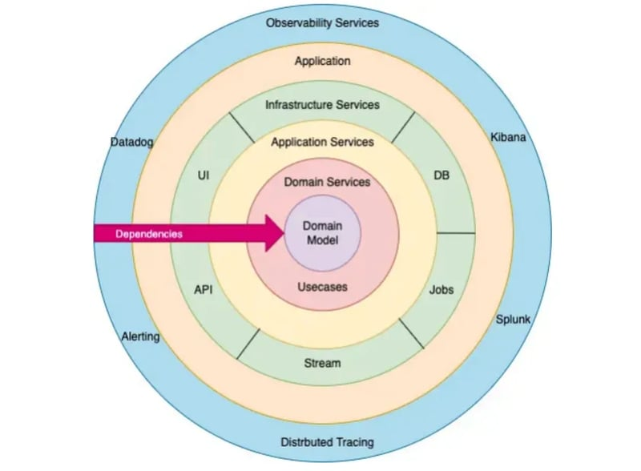

在现代 Web 开发中，中间件（Middleware）扮演着至关重要的角色。它们可以在请求到达业务逻辑之前，对请求进行预处理，或者在响应返回之前进行后续操作。典型的中间件功能包括日志记录、身份验证、错误处理、跨域处理（CORS）、限流等。  

Gin 作为 Go 语言中最流行的 Web 框架之一，提供了一种轻量级且高效的中间件机制，使开发者能够方便地扩展和定制 HTTP 请求的处理流程。Gin 采用了 **“洋葱模型”**（Onion Model）的方式执行中间件，使其能够以链式调用的方式拦截、修改或终止请求。  

下面，我们将深入探讨 Gin 中间件的原理、实现方式、常见的应用场景，并通过实战案例来展示如何编写高效的 Gin 中间件。

## Gin 中间件的基本概念

### 什么是中间件？

中间件（Middleware）是一个处理 HTTP 请求的函数，它可以在请求到达最终处理逻辑之前执行一系列操作，比如日志记录、身份验证、错误处理、跨域请求控制等。Gin 框架允许在请求生命周期的不同阶段插入中间件，以增强 Web 应用的功能和安全性。  

### Gin 中间件的执行机制（洋葱模型）



Gin 采用 **“洋葱模型”（Onion Model）** 处理中间件，这意味着请求会按照注册的顺序进入中间件，执行 `Next()` 后进入下一个中间件或处理函数，返回时再按相反顺序依次执行剩余的逻辑。  

**执行流程示意图：**  

```
请求 -> 中间件1 -> 中间件2 -> 业务逻辑 -> 中间件2 -> 中间件1 -> 响应
```

在代码中，`c.Next()` 负责将请求传递到下一个中间件或最终的业务逻辑。如果某个中间件未调用 `Next()`，请求会在此中断，不再继续执行后续中间件或处理函数。  

### Gin 中的 `gin.Context`

Gin 框架通过 `gin.Context` 结构体在中间件和处理函数之间传递请求信息，`gin.Context` 允许：  

- 读取和修改请求参数、请求体、Header 信息等；  
- 在多个中间件之间共享数据（`c.Set()` / `c.Get()`）；  
- 控制请求流程（`c.Abort()` 终止请求）；  
- 发送响应数据（`c.JSON()`、`c.String()`）。  

### Gin 中间件的分类

Gin 中间件主要分为以下几类：

1. 全局中间件：作用于所有请求，在 `router.Use()` 进行注册。  

   ```go
   router := gin.Default()
   router.Use(LoggerMiddleware) // 所有路由都会执行 LoggerMiddleware
   ```

2. 路由级中间件：仅作用于特定路由组，使用 `group.Use()` 进行注册。  

   ```go
   admin := router.Group("/admin")
   admin.Use(AuthMiddleware) // 仅 "/admin" 及其子路由生效
   ```

3. 单个路由中间件：仅对特定路由生效，直接在路由定义中注册。  

   ```go
   router.GET("/profile", AuthMiddleware, ProfileHandler)
   ```

### `Next()` 和 `Abort()` 的作用

- `Next()`：执行下一个中间件或最终的业务逻辑。  

  ```go
  func ExampleMiddleware() gin.HandlerFunc {
      return func(c *gin.Context) {
          fmt.Println("Before Next()")
          c.Next()
          fmt.Println("After Next()")
      }
  }
  ```

- `Abort()`：终止请求处理，直接返回响应，后续中间件和处理函数不会执行。

  ```go
  func AuthMiddleware() gin.HandlerFunc {
      return func(c *gin.Context) {
          token := c.GetHeader("Authorization")
          if token == "" {
              c.JSON(401, gin.H{"error": "unauthorized"})
              c.Abort() // 终止请求
              return
          }
          c.Next() // 继续执行
      }
  }
  ```

## 如何编写 Gin 中间件

在 Web 服务中，为每个请求分配唯一的请求 ID（Request ID）有助于日志跟踪、故障排查和请求关联。我们可以通过 Gin 中间件实现这一功能，并将请求 ID 作为 X-Request-ID 头部返回给客户端。

**需求分析：**

- 检查请求头是否已经包含 `X-Request-ID`，如果有，则沿用客户端传递的 ID。
- 如果 `X-Request-ID` 为空，则生成一个新的 UUID 作为请求 ID。
- 将请求 `ID` 传递给 `gin.Context`，供后续业务逻辑使用。
- 在响应头中返回 `X-Request-ID`，确保客户端也能获取该值。

**代码实现：**

```go
package main

import (
 "github.com/gin-gonic/gin"
 "github.com/google/uuid"
)

// RequestIDMiddleware 生成或传递请求 ID
func RequestIDMiddleware() gin.HandlerFunc {
 return func(c *gin.Context) {
  requestID := c.GetHeader("X-Request-ID") // 获取请求头中的 Request ID
  if requestID == "" {
   requestID = uuid.New().String() // 生成新的 UUID
  }

  c.Set("RequestID", requestID)               // 存入 context，供后续处理使用
  c.Writer.Header().Set("X-Request-ID", requestID) // 设置响应头

  c.Next() // 继续处理请求
 }
}

func main() {
 r := gin.Default()

 // 注册请求 ID 中间件
 r.Use(RequestIDMiddleware())

 // 示例路由
 r.GET("/ping", func(c *gin.Context) {
  requestID, _ := c.Get("RequestID") // 获取中间件存入的 Request ID
  c.JSON(200, gin.H{
   "message":   "pong",
   "requestID": requestID,
  })
 })

 r.Run(":8080") // 启动服务器
}
```

这里我们来测试一下具体效果，先启动服务 `go run main.go` 后，

- 客户端没有提供 X-Request-ID)  
  再在终端访问 `curl http://localhost:8080/ping`；响应结果：

  ```txt
  HTTP/1.1 200 OK
  Content-Type: application/json; charset=utf-8
  X-Request-Id: 76be517e-62bf-4a19-bf2c-52e0c64bfdd7
  Date: Tue, 11 Mar 2025 04:39:07 GMT
  Content-Length: 69
  
  {"message":"pong","requestID":"76be517e-62bf-4a19-bf2c-52e0c64bfdd7"}
  ````

- 客户端提供 X-Request-ID
  再在终端访问 `curl -i -H "X-Request-ID: my-custom-id" http://localhost:8080/ping`；响应结果：

    ```txt
  HTTP/1.1 200 OK
  Content-Type: application/json; charset=utf-8
  X-Request-Id: my-custom-id
  Date: Tue, 11 Mar 2025 04:42:07 GMT
  Content-Length: 45
  
  {"message":"pong","requestID":"my-custom-id"}
    ```

## 使用场景

- **日志追踪**：在日志中记录请求 ID，方便跟踪请求链路。
- **微服务链路跟踪**：多个服务之间传递相同的请求 ID，便于分布式跟踪。
- **限流**：可以结合 golang.org/x/time/rate 进行 API 访问限流。
- **跨域处理**：使用 CORS 允许跨域请求，适用于前后端分离开发。
- **错误恢复**：Gin 提供 `gin.Recovery()` 捕获 `panic` 并返回 500 错误。

## 总结

从 Gin 中间件的基本概念到原理解析，再到实战案例，全面介绍了 Gin 中间件的使用方式。

通过 Request ID 中间件的实现，展示了如何编写高效的中间件，并结合实际应用场景说明了其价值。

最后还可以在此基础上扩展更多自定义中间件，如日志记录、限流、权限验证 等，以提升 Web 服务的可维护性和可靠性。
