在现代软件开发中，自动化部署已成为提升团队效率和产品质量的关键环节。对于 Go 开发者而言，如何构建一套既简单可靠又高效灵活的部署流程，往往是一个既有挑战又充满机遇的课题。本文将带您探索一种基于 GitHub Actions 和 Docker 的 Go 项目自动化部署方案，从代码提交的那一刻起，通过精心设计的 CI/CD 流程，代码将自动完成测试、构建、打包、推送到阿里云镜像仓库，并最终部署到生产服务器。整个过程无需人工干预，既节省了运维成本，又降低了人为错误的可能性。不论您是小型团队的开发者，还是个人项目的维护者，这套轻量级的单机部署方案都能帮助您摆脱繁琐的手动部署，让您将更多精力投入到核心业务的开发中。接下来，让我们从基础概念开始，逐步构建这个完整的自动化部署链路。

> 本文包含以下内容：
>
> - 粗略过一下 Docker、Docker Compose、Github Actions 和 Docker 多阶段构建
> - 介绍怎么使用 Github Actions 跟 Docker Compose 构建 Go 项目
> - 在构建镜像完成之后，怎么同步到服务器，怎么将其启动起来
> - 将构建好的镜像 push 到阿里云镜像仓库，然后再分发部署

由于文章篇幅受限，本文不会对 Docker、Docker Compose、GitHub Actions 以及服务器等技术进行详细的介绍。本文假设读者已经具备一定的 Docker 基础知识和 Go 开发经验和服务器知识，因此只会对核心概念和与本文部署方案直接相关的特性进行概述。如果没有掌握这些技术，建议参考各技术的官方文档或自行搜索相关资料进行学习。

## 一、基础知识介绍

### 1.1 Docker 简介

Docker 是一个开源的应用容器引擎，它让开发者可以打包他们的应用以及依赖包到一个可移植的容器中，然后发布到任何流行的 Linux 或 Windows 机器上。通过容器化技术，Docker 彻底改变了软件交付和部署的方式。

#### Docker 的核心概念

Docker 的架构基于几个关键概念：

- **镜像（Image）**：Docker 镜像是一个只读的模板，包含了运行应用所需的所有内容——代码、运行时环境、库、环境变量和配置文件等；镜像是构建容器的基础。
- **容器（Container）**：容器是镜像的运行实例，它可以被创建、启动、停止、删除和暂停等；容器之间是彼此隔离的，拥有自己的文件系统、网络和进程空间。
- **仓库（Repository）**：Docker 仓库用于存储和分发 Docker 镜像；Docker Hub 是最常用的公共仓库，而企业通常会使用私有仓库如：阿里云容器镜像服务等等。
- **Dockerfile**：Dockerfile 是一个文本文件，包含了构建 Docker 镜像所需的一系列指令。通过 Dockerfile，可以自动化地创建镜像，确保构建过程的一致性和可重复性。

#### 容器化的优势

容器化为应用部署带来了诸多优势：

- **环境一致性**：Docker 确保应用在开发、测试和生产环境中运行的一致性，有效解决了"在我的机器上能运行"的问题。
- **轻量级**：相比虚拟机，Docker 容器共享主机的操作系统内核，启动迅速，资源占用少，性能开销小。
- **隔离性**：容器提供了进程级别的隔离，增强了应用的安全性和稳定性。
- **版本控制与可回滚**：Docker 镜像支持版本标签，便于追踪变更历史，需要时可以快速回滚到之前的版本。
- **快速部署与扩展**：容器可以在几秒钟内启动，便于快速部署和水平扩展应用。

#### Docker 在 Go 项目部署中的应用

Go 语言的特性与 Docker 有着天然的契合：

- **静态二进制文件**：Go 编译生成的是独立的静态二进制文件，无需解释器或运行时依赖，非常适合构建最小化的 Docker 镜像。
- **跨平台兼容性**：Go 的跨平台编译能力与 Docker 的跨平台运行能力相辅相成，简化了不同环境的部署工作。
- **资源效率**：Go 程序的低内存占用和高并发性能，与 Docker 容器的轻量级特性完美结合，最大化服务器资源利用率。
- **CI/CD 友好**：Go 快速的编译速度和 Docker 的容器化能力，使得构建高效的 CI/CD 流水线变得简单直观。

在后面的部署方案中，我们将充分利用 Docker 的这些特性，结合 Go 语言的优势，构建一个高效、可靠的自动化部署流程。

### 1.2 Docker Compose 简介

Docker Compose 是 Docker 官方提供的多容器应用管理工具，它通过一个简单的 YAML 文件配置，让开发者能够一次性启动和管理多个相互关联的容器服务。在现代的微服务架构中，一个应用通常由多个容器组成，而 Docker Compose 正是为了简化这种复杂应用的部署而设计的。

#### 什么是 Docker Compose

Docker Compose 的核心是声明式配置，允许开发者以代码的方式定义应用的全部服务组件及其关系。它主要解决了以下问题：

- **多容器管理**：使用单一命令启动、停止和重建所有服务
- **环境变量管理**：轻松处理不同环境的配置差异
- **依赖顺序控制**：确保容器按正确的顺序启动
- **网络自动创建**：为应用创建隔离的网络环境
- **数据卷持久化**：简化数据存储和共享

#### Docker Compose 的配置文件

`docker-compose.yml` 是 Docker Compose 的核心配置文件，它使用 YAML 格式来定义服务、网络和卷。一个典型的配置文件结构如下：

```yaml
version: '3'  # Compose 文件版本

services:      # 定义所有服务
  web:         # 服务名称
    build: ./web  # 构建上下文
    ports:
      - "8080:8080"  # 端口映射
    environment:     # 环境变量
      - DB_HOST=db
    depends_on:      # 依赖关系
      - db
  
  db:          # 数据库服务
    image: postgres:13  # 使用现有镜像
    volumes:
      - db-data:/var/lib/postgresql/data  # 数据持久化

volumes:       # 定义卷
  db-data:     # 卷名称
```

对于 Go 项目，Docker Compose 配置通常会包含应用服务、数据库服务、缓存服务等，形成一个完整的应用栈。

#### 使用 Docker Compose 管理多容器应用

Docker Compose 提供了丰富的命令，使得多容器应用的管理变得简单高效：

- **启动服务**：`docker-compose up` 启动所有定义的服务
- **后台运行**：`docker-compose up -d` 以守护进程模式运行
- **查看状态**：`docker-compose ps` 查看所有服务的运行状态
- **查看日志**：`docker-compose logs` 查看服务日志
- **执行命令**：`docker-compose exec` 在指定容器中执行命令
- **重建服务**：`docker-compose build` 重新构建服务
- **停止服务**：`docker-compose down` 停止并移除容器、网络

通过 Docker Compose，确保开发和生产环境的一致性，减少环境差异带来的问题。

### 1.3 GitHub Actions 简介

GitHub Actions 是 GitHub 提供的持续集成和持续部署 (CI/CD) 平台，允许开发者直接在 GitHub 仓库中自动化构建、测试和部署流程。它通过 YAML 文件配置工作流，使任务自动化变得简单直观。

#### CI/CD 概念

持续集成/持续部署 (CI/CD) 是现代软件开发的核心实践，旨在提高代码质量和交付速度：

- **持续集成 (CI)**：开发人员频繁地将代码集成到代码仓库，每次集成都通过自动化构建和测试进行验证，以尽早发现问题。
- **持续交付 (CD)**：确保软件可以在任何时间可靠地发布，通过自动化流程将验证过的代码发布到生产环境或指定的环境。
- **持续部署**：更进一步地，每次通过测试的更改都自动部署到生产环境，无需人工干预。

CI/CD 的主要好处包括：减少手动错误、提供快速反馈、加速发布周期、增强代码质量保障。

#### GitHub Actions 的工作原理

GitHub Actions 的核心是"事件驱动"，工作流会在特定事件（如代码推送、PR 创建）触发后执行：

- **事件 (Events)**：触发工作流执行的 GitHub 事件，如 `push`、`pull_request`、`schedule` 等。
- **工作流 (Workflows)**：由一个或多个作业组成的自动化流程，定义在仓库的 `.github/workflows` 目录下的 YAML 文件中。
- **作业 (Jobs)**：工作流中的一系列步骤，可以并行或顺序执行。
- **步骤 (Steps)**：作业中的独立任务，可以运行命令或使用社区提供的动作 (Actions)。
- **动作 (Actions)**：可重用的工作单元，类似于插件，提供特定的功能，如检出代码、设置环境等。
- **运行器 (Runners)**：执行工作流的服务器，可以使用 GitHub 提供的或自托管的运行器。

#### Workflow 文件结构和语法

GitHub Actions 工作流使用 YAML 文件定义，通常保存在仓库的 `.github/workflows` 目录下。一个基本的工作流文件结构如下：

```yaml
name: Build and Deploy  # 工作流名称

on:                     # 触发事件
  push:
    branches: [ main ]  # 仅在主分支上触发

jobs:                   # 定义作业
  build:                # 作业名称
    runs-on: ubuntu-latest  # 运行环境

    steps:              # 执行步骤
      - uses: actions/checkout@v2  # 使用动作
      
      - name: Set up Go  # 步骤名称
        uses: actions/setup-go@v2
        with:
          go-version: 1.17  # 参数
      
      - name: Build      # 自定义命令
        run: go build -v ./...
        
      - name: Test
        run: go test -v ./...
```

在本文的部署方案中，我们将利用 GitHub Actions 自动化整个从代码提交到生产部署的流程，包括代码测试、Docker 镜像构建、推送到阿里云镜像仓库以及远程部署等步骤。

### 1.4 Docker 多阶段构建

Docker 多阶段构建是一种在**单个 Dockerfile 中**使用**多个 FROM 指令**创建中间镜像的技术，**最终只保留需要的产物，从而减小最终镜像的体积**。

#### 多阶段构建的优势

Docker 多阶段构建解决了传统 Docker 构建流程中的几个关键问题：

- **减小镜像体积**：最终镜像只包含运行所需的内容，不含编译工具和源代码
- **简化构建流程**：无需编写复杂的构建脚本或使用多个 Dockerfile
- **改善部署速度**：小体积的镜像更容易传输和部署
- **单一构建上下文**：不再需要在构建过程中管理临时文件

#### 减小镜像体积的策略

除了多阶段构建外，还有几种策略可以进一步优化 Docker 镜像体积：

- **选择合适的基础镜像**：使用 Alpine 或 scratch 等最小化基础镜像
- **合并 RUN 指令**：减少镜像层数，使用 `&&` 连接多个命令
- **移除不必要的文件**：清理缓存、临时文件和未使用的包
- **使用 .dockerignore**：排除不需要的文件进入构建上下文
- **合理组织 Dockerfile 指令顺序**：利用层缓存机制提高构建效率

#### Go 项目多阶段构建的最佳实践

Go 项目的 Docker 多阶段构建通常遵循以下模式，这里我们采用 Go 1.24 版本：

```dockerfile
# 第一阶段：构建环境
FROM golang:1.24-alpine AS builder

# 设置构建参数
ARG VERSION=dev
ARG COMMIT_SHA=16e75b9

# 安装构建依赖
RUN apk add --no-cache git ca-certificates tzdata

# 设置工作目录
WORKDIR /build

# 首先仅复制依赖文件以利用缓存
COPY go.mod go.sum ./
RUN go mod download && go mod verify

# 复制源代码
COPY . .

# 构建应用并嵌入版本信息
RUN CGO_ENABLED=0 GOOS=linux GOARCH=amd64 go build \
    -ldflags="-w -s -X main.version=${VERSION} -X main.commitSHA=${COMMIT_SHA}" \
    -trimpath \
    -o app ./cmd/server

# 第二阶段：最小运行环境
FROM scratch

# 从构建阶段复制必要的证书和时区数据
COPY --from=builder /etc/ssl/certs/ca-certificates.crt /etc/ssl/certs/
COPY --from=builder /usr/share/zoneinfo /usr/share/zoneinfo
ENV TZ=Asia/Shanghai

# 创建非特权用户 (注意：scratch 镜像需要特殊处理)
# 在 scratch 镜像中，我们需要预先创建用户并通过 COPY --from 复制
COPY --from=builder /etc/passwd /etc/passwd
COPY --from=builder /etc/group /etc/group

# 工作目录
WORKDIR /app

# 复制编译好的应用
COPY --from=builder /build/app .

# 复制配置文件
COPY --from=builder /build/configs ./configs

# 健康检查
HEALTHCHECK --interval=30s --timeout=3s --start-period=5s --retries=3 \
  CMD ["/app", "health"] || exit 1

# 使用非 root 用户
USER nobody:nogroup

# 声明端口
EXPOSE 8080

# 声明存储卷（如需持久化数据）
VOLUME ["/app/data"]

# 容器启动命令
ENTRYPOINT ["/app"]
CMD ["serve"]
```

Dockerfile 最佳实践：

- **基于 scratch 的最小镜像**：使用空白基础镜像，仅包含必要组件，减小攻击面和镜像体积
- **编译优化**：
    - `-trimpath`：移除路径信息，提高可重现性
    - `-ldflags="-w -s"`：去除调试信息，减小二进制大小
    - 内嵌版本信息，便于运行时识别和故障排查
- **安全最佳实践**：
    - 使用非 root 用户运行应用
    - 多阶段构建隔离编译环境与运行环境
    - 复制必要的 SSL 证书，确保 HTTPS 连接安全
- **操作便利性**：
    - 健康检查配置，便于容器编排系统监控应用状态
    - 使用 ENTRYPOINT 和 CMD 分离，提供灵活的启动选项
    - 明确声明端口和存储卷

对于需要更多依赖的应用，可以使用 Alpine 作为基础镜像，但 scratch 对于典型的 Go 服务通常已经足够，且提供了最小的镜像体积。

## 二、使用 GitHub Actions 和 Docker Compose 构建 Go 项目

巩固完基础知识后，我们开始进入实战阶段，首先需要规划 Go 项目的结构，然后编写 `Dockerfile` 和 `docker-compose.yml` 文件，最后配置 GitHub Actions 工作流，实现自动化构建。

### 2.1 Go 项目结构规划

我们先从项目结构规划开始，一个良好的项目结构是自动化部署的基础。标准化的目录结构不仅提高了代码的可维护性，也便于自动化工具的处理。我们这里遵循 [Standard Go Project Layout](https://github.com/golang-standards/project-layout) 的标准来搭建项目环境。

#### 项目目录结构

Go 项目通常遵循以下目录结构：

```text
my-project/
├── cmd/                # 主要应用入口点
│   └── server/         # 服务启动代码
│       └── main.go     # 主函数
├── internal/           # 私有应用和库代码
│   ├── api/            # API 处理器
│   ├── config/         # 配置管理
│   └── service/        # 业务逻辑
├── pkg/                # 可公开复用的代码
├── configs/            # 配置文件目录
├── scripts/            # 各种脚本文件
├── deployments/        # 部署相关文件
│   ├── docker/         # Docker 相关文件
│   │   ├── Dockerfile  # 应用 Dockerfile
│   │   └── nginx.conf  # Nginx 配置（如需）
│   └── docker-compose.yml  # Docker Compose 配置
├── .github/            # GitHub 相关配置
│   └── workflows/      # GitHub Actions 工作流
│       └── deploy.yml  # 部署工作流配置
├── go.mod              # Go 模块文件
└── go.sum              # 依赖校验文件
```

这种结构有几个关键优势：

- **关注点分离**：清晰区分应用入口、业务逻辑和可复用代码
- **依赖管理**：通过 Go 模块进行版本控制
- **部署配置集中**：所有部署相关文件集中在 deployments 目录
- **CI/CD 就绪**：.github/workflows 目录包含自动化工作流配置

#### Dockerfile 编写

为了实现最佳的容器化实践，我们将使用多阶段构建创建一个精简的 Go 应用镜像。以下是一个优化的 `Dockerfile` 示例：

```dockerfile
# deployments/docker/Dockerfile

# 构建阶段
FROM golang:1.24-alpine AS builder

# 安装构建依赖
RUN apk add --no-cache git

# 设置工作目录
WORKDIR /app

# 首先仅复制依赖文件以利用缓存
COPY go.mod go.sum ./
RUN go mod download

# 复制源代码
COPY . .

# 构建应用
RUN CGO_ENABLED=0 GOOS=linux go build -a -installsuffix cgo -ldflags="-w -s" -o server ./cmd/server

# 最终阶段
FROM alpine:3.15

# 安装运行时依赖
RUN apk --no-cache add ca-certificates tzdata

# 设置时区
ENV TZ=Asia/Shanghai

# 创建非root用户
RUN adduser -D -g '' appuser

# 复制编译好的应用
WORKDIR /app
COPY --from=builder /app/server .
COPY --from=builder /app/configs ./configs

# 使用非root用户运行
USER appuser

# 声明端口
EXPOSE 18080

# 启动命令
CMD ["./server"]
```

这个 Dockerfile 遵循了多阶段构建的最佳实践：

- 使用官方 Go 镜像作为构建环境
- 分阶段复制依赖文件和源代码，优化缓存使用
- 使用编译标志减小二进制体积
- 基于轻量级 Alpine 镜像创建运行环境
- 使用非 root 用户运行应用，增强安全性
- 明确声明端口和启动命令

### 2.2 编写 GitHub Actions 工作流

GitHub Actions 是我们实现自动化部署的核心工具。通过编写适当的工作流配置，我们可以在代码推送到 GitHub 后自动构建 Docker 镜像并部署到服务器。

#### workflow 文件配置

我们的工作流配置将保存在 `.github/workflows/deploy.yml` 文件中，主要实现以下功能：

```yaml
name: Deploy to Production

# 触发条件：当 main 分支有推送操作时
on:
  push:
    branches: [ main ]
  # 也可以手动触发
  workflow_dispatch:

# 环境变量
env:
  IMAGE_NAME: go-app
  REGISTRY: registry.cn-hangzhou.aliyuncs.com
  NAMESPACE: your-namespace

jobs:
  # 构建并推送 Docker 镜像
  build-and-push:
    runs-on: ubuntu-latest
    steps:
      - name: Checkout code
        uses: actions/checkout@v3

      # 设置 Docker Buildx
      - name: Set up Docker Buildx
        uses: docker/setup-buildx-action@v2

      # 登录到阿里云容器镜像服务
      - name: Login to ACR
        uses: docker/login-action@v2
        with:
          registry: ${{ env.REGISTRY }}
          username: ${{ secrets.ALIYUN_USERNAME }}
          password: ${{ secrets.ALIYUN_PASSWORD }}

      # 生成镜像标签
      - name: Generate image tag
        id: tag
        run: echo "::set-output name=value::$(date +'%Y%m%d%H%M%S')-${GITHUB_SHA::8}"

      # 构建并推送镜像
      - name: Build and push
        uses: docker/build-push-action@v3
        with:
          context: .
          file: ./deployments/docker/Dockerfile
          push: true
          tags: |
            ${{ env.REGISTRY }}/${{ env.NAMESPACE }}/${{ env.IMAGE_NAME }}:${{ steps.tag.outputs.value }}
            ${{ env.REGISTRY }}/${{ env.NAMESPACE }}/${{ env.IMAGE_NAME }}:latest
          cache-from: type=registry,ref=${{ env.REGISTRY }}/${{ env.NAMESPACE }}/${{ env.IMAGE_NAME }}:buildcache
          cache-to: type=registry,ref=${{ env.REGISTRY }}/${{ env.NAMESPACE }}/${{ env.IMAGE_NAME }}:buildcache,mode=max

  # 部署到服务器
  deploy:
    needs: build-and-push
    runs-on: ubuntu-latest
    steps:
      # 检出代码
      - name: Checkout code
        uses: actions/checkout@v3

      # 生成镜像标签
      - name: Generate image tag
        id: tag
        run: echo "::set-output name=value::$(date +'%Y%m%d%H%M%S')-${GITHUB_SHA::8}"

      # 准备部署文件
      - name: Prepare deployment files
        run: |
          mkdir -p deploy
          cp deployments/docker-compose.yml deploy/
          cat > deploy/.env << EOF
          IMAGE_NAME=${{ env.REGISTRY }}/${{ env.NAMESPACE }}/${{ env.IMAGE_NAME }}
          IMAGE_TAG=${{ steps.tag.outputs.value }}
          DB_USER=${{ secrets.DB_USER }}
          DB_PASSWORD=${{ secrets.DB_PASSWORD }}
          DB_NAME=${{ secrets.DB_NAME }}
          EOF

      # 将部署文件复制到服务器
      - name: Copy files to server
        uses: appleboy/scp-action@master
        with:
          host: ${{ secrets.SERVER_HOST }}
          username: ${{ secrets.SERVER_USER }}
          key: ${{ secrets.SERVER_SSH_KEY }}
          source: "deploy/*"
          target: "/opt/go-app"
          strip_components: 1

      # 在服务器上执行部署命令
      - name: Deploy on server
        uses: appleboy/ssh-action@master
        with:
          host: ${{ secrets.SERVER_HOST }}
          username: ${{ secrets.SERVER_USER }}
          key: ${{ secrets.SERVER_SSH_KEY }}
          script: |
            cd /opt/go-app
            docker login ${{ env.REGISTRY }} -u ${{ secrets.ALIYUN_USERNAME }} -p ${{ secrets.ALIYUN_PASSWORD }}
            docker-compose pull
            docker-compose down || true
            docker-compose up -d
            docker image prune -f
```

#### 触发条件设置

GitHub Actions 工作流可以基于多种事件触发：

- **分支推送**：当特定分支（如 main）收到新的提交
- **Pull Request**：当创建或更新 PR 时
- **定时触发**：使用 cron 表达式定期执行
- **手动触发**：通过 workflow_dispatch 事件允许手动执行
- **其他 GitHub 事件**：如 release 创建、issue 操作等

在我们的部署方案中，主要使用分支推送和手动触发，以确保灵活性和安全性。

#### 构建步骤详解

我们的工作流分为两个主要作业：构建推送镜像和部署到服务器。这里我们详细解析每个步骤的作用和关键点：

##### 1. 构建并推送镜像作业

**检出代码**：

```yaml
- name: Checkout code
  uses: actions/checkout@v3
```

这一步使用官方的 `checkout` 动作将代码从 GitHub 仓库拉取到 GitHub Actions 运行器上。默认情况下，它只拉取触发工作流的那次提交，而不是完整的历史记录，这有助于加速构建流程。

**设置 Docker Buildx**：

```yaml
- name: Set up Docker Buildx
  uses: docker/setup-buildx-action@v2
```

Buildx 是 Docker 的一个扩展功能，提供了增强的构建能力，包括多平台构建和更好的缓存机制。这一步安装并配置 Buildx，为后续的镜像构建做准备。

**登录到阿里云容器镜像服务**：

```yaml
- name: Login to ACR
  uses: docker/login-action@v2
  with:
    registry: ${{ env.REGISTRY }}
    username: ${{ secrets.ALIYUN_USERNAME }}
    password: ${{ secrets.ALIYUN_PASSWORD }}
```

在推送镜像前，需要先登录到阿里云容器镜像服务。这里使用 GitHub 仓库中存储的密钥进行认证，确保凭证安全。

**生成镜像标签**：

```yaml
- name: Generate image tag
  id: tag
  run: echo "::set-output name=value::$(date +'%Y%m%d%H%M%S')-${GITHUB_SHA::8}"
```

为每次构建生成唯一的镜像标签，结合时间戳和 Git 提交 SHA 的前 8 位。这样做有两个好处：

1. 确保每次构建的镜像都有唯一标识
2. 便于追踪镜像与源代码版本的对应关系

**构建并推送镜像**：

```yaml
- name: Build and push
  uses: docker/build-push-action@v3
  with:
    context: .
    file: ./deployments/docker/Dockerfile
    push: true
    tags: |
      ${{ env.REGISTRY }}/${{ env.NAMESPACE }}/${{ env.IMAGE_NAME }}:${{ steps.tag.outputs.value }}
      ${{ env.REGISTRY }}/${{ env.NAMESPACE }}/${{ env.IMAGE_NAME }}:latest
    cache-from: type=registry,ref=${{ env.REGISTRY }}/${{ env.NAMESPACE }}/${{ env.IMAGE_NAME }}:buildcache
    cache-to: type=registry,ref=${{ env.REGISTRY }}/${{ env.NAMESPACE }}/${{ env.IMAGE_NAME }}:buildcache,mode=max
```

这是构建过程的核心步骤，使用 `docker/build-push-action` 动作构建并推送 Docker 镜像：

- `context: .`：指定构建上下文为当前目录
- `file: ./deployments/docker/Dockerfile`：使用指定路径的 Dockerfile
- `push: true`：构建完成后自动推送镜像
- `tags`：指定镜像标签，同时更新特定版本和 latest 标签
- `cache-from` 和 `cache-to`：利用远程缓存加速构建，减少重复工作

值得注意的是缓存策略：我们使用单独的 `buildcache` 标签来存储构建缓存，这可以显著提高后续构建的速度，特别是当依赖项变化不大时。

##### 2. 部署到服务器作业

**准备部署文件**：

```yaml
- name: Prepare deployment files
  run: |
    mkdir -p deploy
    cp deployments/docker-compose.yml deploy/
    cat > deploy/.env << EOF
    IMAGE_NAME=${{ env.REGISTRY }}/${{ env.NAMESPACE }}/${{ env.IMAGE_NAME }}
    IMAGE_TAG=${{ steps.tag.outputs.value }}
    DB_USER=${{ secrets.DB_USER }}
    DB_PASSWORD=${{ secrets.DB_PASSWORD }}
    DB_NAME=${{ secrets.DB_NAME }}
    EOF
```

这一步准备部署所需的文件：

1. 创建临时部署目录
2. 复制 docker-compose.yml 配置文件
3. 生成 .env 环境变量文件，包含镜像信息和数据库凭证

使用环境变量文件是一种最佳实践，它允许我们分离配置和应用，同时避免将敏感信息硬编码到配置文件中。

**将部署文件复制到服务器**：

```yaml
- name: Copy files to server
  uses: appleboy/scp-action@master
  with:
    host: ${{ secrets.SERVER_HOST }}
    username: ${{ secrets.SERVER_USER }}
    key: ${{ secrets.SERVER_SSH_KEY }}
    source: "deploy/*"
    target: "/opt/go-app"
    strip_components: 1
```

使用 SCP（安全复制协议）将部署文件安全地传输到目标服务器：

- 使用 SSH 密钥认证，确保连接安全
- `strip_components: 1` 参数移除 "deploy" 目录前缀，使文件直接放置在目标目录中

**在服务器上执行部署命令**：

```yaml
- name: Deploy on server
  uses: appleboy/ssh-action@master
  with:
    host: ${{ secrets.SERVER_HOST }}
    username: ${{ secrets.SERVER_USER }}
    key: ${{ secrets.SERVER_SSH_KEY }}
    script: |
      cd /opt/go-app
      docker login ${{ env.REGISTRY }} -u ${{ secrets.ALIYUN_USERNAME }} -p ${{ secrets.ALIYUN_PASSWORD }}
      docker-compose pull
      docker-compose down || true
      docker-compose up -d
      docker image prune -f
```

最后，通过 SSH 远程执行部署命令：

1. 进入部署目录
2. 登录到阿里云容器镜像服务
3. 拉取最新的镜像
4. 停止当前运行的容器（如果存在）
5. 启动新的容器
6. 清理未使用的镜像以节省磁盘空间

`docker-compose down || true` 命令中的 `|| true` 确保即使没有正在运行的容器，脚本也会继续执行。这增强了脚本的健壮性，适用于首次部署和后续更新。

这种分阶段的工作流不仅实现了完全自动化的部署，还具有以下优势：

- **可重复性**：每次部署都遵循相同的流程，减少人为错误
- **追踪性**：每个镜像都有唯一标识，便于版本管理和回滚
- **安全性**：敏感信息通过 GitHub Secrets 管理，不会暴露在代码中
- **效率**：利用缓存机制加速构建，并行执行独立任务
- **透明性**：每个部署步骤都有明确的日志，便于排查问题

### 2.3 多阶段构建 Go 应用镜像

在前面的章节中，我们已经介绍了多阶段构建的基本概念和优势。在这一节中，我们将深入探讨如何为 Go 应用程序实现高效的多阶段构建流程，分别针对开发环境和生产环境，并优化构建过程和缓存策略。

#### 开发环境构建阶段

开发环境的 Docker 镜像需要支持快速迭代和调试，同时保持与生产环境的一致性。以下是为开发环境优化的多阶段构建示例：

```dockerfile
# deployments/docker/Dockerfile.dev

# 基础阶段：包含通用依赖
FROM golang:1.24-alpine AS base

# 安装开发工具和依赖
RUN apk add --no-cache git curl make gcc libc-dev \
    && go install github.com/cosmtrek/air@latest \
    && go install github.com/go-delve/delve/cmd/dlv@latest

WORKDIR /app

# 开发阶段：用于热重载的镜像
FROM base AS dev

# 复制应用代码
COPY . .

# 设置环境变量
ENV CGO_ENABLED=0
ENV GO111MODULE=on
ENV GOOS=linux
ENV GOARCH=amd64

# 暴露应用端口和调试端口
EXPOSE 18080

# 使用 air 实现热重载
CMD ["air", "-c", ".air.toml"]
```

这个开发环境的 Dockerfile 有几个关键特点：

1. **热重载支持**：使用 `air` 工具监视代码变化并自动重新编译
2. **调试工具**：包含 `dlv` 远程调试器，允许开发者实时调试应用
3. **完整开发工具链**：安装编译器和其他开发依赖
4. **源代码在容器内**：直接在容器中编辑和构建代码，减少环境差异

对应的 `docker-compose.dev.yml` 文件可能如下：

```yaml
version: '3.8'

services:
  app:
    build:
      context: ..
      dockerfile: deployments/docker/Dockerfile.dev
    volumes:
      - ../:/app  # 挂载源代码目录
      - go-mod-cache:/go/pkg/mod  # 缓存 Go 模块
    ports:
      - "8080:8080"  # 应用端口
      - "2345:2345"  # 调试端口
    environment:
      - GO_ENV=development
      - DB_HOST=db
      - DB_PORT=5432
    depends_on:
      - db

  db:
    image: postgres:14-alpine
    environment:
      - POSTGRES_USER=postgres
      - POSTGRES_PASSWORD=postgres
      - POSTGRES_DB=app_dev
    volumes:
      - postgres_data:/var/lib/postgresql/data

volumes:
  go-mod-cache:
  postgres_data:
```

这种配置实现了开发环境与生产环境的最大一致性，同时提供了开发者友好的功能，如代码热重载、远程调试和数据持久化。

#### 生产环境构建阶段

生产环境的镜像需要优先考虑安全性、资源效率和稳定性。以下是针对生产环境优化的多阶段构建：

```dockerfile
# deployments/docker/Dockerfile.prod

# 第一阶段：依赖缓存
FROM golang:1.24-alpine AS deps

WORKDIR /app

# 仅复制依赖文件
COPY go.mod go.sum ./
RUN go mod download && go mod verify

# 第二阶段：构建
FROM golang:1.24-alpine AS builder

WORKDIR /app

# 复制预先下载的依赖
COPY --from=deps /go/pkg/mod /go/pkg/mod
COPY --from=deps /app/go.mod /app/go.sum ./

# 安装构建工具
RUN apk add --no-cache git ca-certificates tzdata

# 复制源代码
COPY . .

# 执行单元测试
RUN go test -v ./...

# 构建应用
ARG VERSION=unknown
ARG BUILD_DATE=unknown
ARG COMMIT_SHA=unknown

RUN CGO_ENABLED=0 GOOS=linux GOARCH=amd64 \
    go build -ldflags="-w -s \
    -X main.version=${VERSION} \
    -X main.buildDate=${BUILD_DATE} \
    -X main.commitSha=${COMMIT_SHA}" \
    -trimpath -o /app/server ./cmd/server

# 第三阶段：安全扫描
FROM aquasec/trivy:latest AS security-scan

COPY --from=builder /app/server /app/server
RUN trivy filesystem --exit-code 1 --severity HIGH,CRITICAL /app/server

# 最终阶段：最小化运行环境
FROM scratch

# 复制必要的系统文件
COPY --from=builder /usr/share/zoneinfo /usr/share/zoneinfo
COPY --from=builder /etc/ssl/certs/ca-certificates.crt /etc/ssl/certs/
COPY --from=builder /etc/passwd /etc/passwd
COPY --from=builder /etc/group /etc/group

# 设置时区
ENV TZ=Asia/Shanghai

# 创建非特权用户
USER nobody:nogroup

# 复制编译好的应用
WORKDIR /app
COPY --from=builder /app/server .
COPY --from=builder /app/configs ./configs

# 健康检查
HEALTHCHECK --interval=30s --timeout=3s --start-period=5s --retries=3 \
  CMD ["/app/server", "health"] || exit 1

# 暴露端口
EXPOSE 8080

# 启动命令
ENTRYPOINT ["/app/server"]
CMD ["serve"]
```

这个生产环境 Dockerfile 采用了四阶段构建：

1. **依赖缓存阶段**：仅下载依赖，便于利用 Docker 缓存机制
2. **构建阶段**：编译应用并嵌入版本信息
3. **安全扫描阶段**：使用 Trivy 检查二进制文件中的安全漏洞
4. **最终运行阶段**：使用 scratch 基础镜像创建最小化运行环境

这种方式确保了生产镜像的安全性、最小化和可追踪性。

#### 优化构建过程和缓存策略

高效的 Docker 构建过程对于 CI/CD 流水线至关重要。以下是一些优化策略：

##### 1. 分层缓存优化

Docker 构建缓存是基于层的，我们可以通过合理安排指令顺序来最大化缓存利用：

```dockerfile
# 不佳的缓存利用
COPY . .
RUN go mod download

# 优化的缓存利用
COPY go.mod go.sum ./
RUN go mod download
COPY . .
```

优化后的版本将依赖下载与源代码复制分开，只要依赖清单（`go.mod` 和 `go.sum`）没有变化，依赖下载的缓存层就会被重用，大大加快构建速度。

##### 2. 使用 BuildKit 缓存导出/导入

Docker BuildKit 提供了高级缓存功能，允许在构建之间持久化和共享缓存：

```yaml
- name: Build and push
  uses: docker/build-push-action@v3
  with:
    context: .
    file: ./deployments/docker/Dockerfile.prod
    push: true
    tags: ${{ env.IMAGE_NAME }}:${{ env.TAG }}
    cache-from: type=registry,ref=${{ env.IMAGE_NAME }}:buildcache
    cache-to: type=registry,ref=${{ env.IMAGE_NAME }}:buildcache,mode=max
```

这种方式将构建缓存存储在容器注册表中，在不同的 CI/CD 运行或甚至不同的机器之间共享缓存。

##### 3. 条件构建阶段

可以使用 Docker 的条件构建特性来根据构建参数选择性地执行某些阶段：

```dockerfile
FROM golang:1.24-alpine AS builder
# ... 构建应用 ...

FROM aquasec/trivy:latest AS security-scan
COPY --from=builder /app/server /app/server
RUN trivy filesystem --exit-code 1 --severity HIGH,CRITICAL /app/server

FROM scratch AS production
# ... 生产镜像配置 ...

FROM golang:1.24-alpine AS development
# ... 开发镜像配置 ...

# 条件选择最终镜像
FROM ${BUILD_ENV:-production}
```

使用 `--build-arg BUILD_ENV=development` 参数可以选择构建开发环境镜像。

##### 4. 并行构建优化

在 GitHub Actions 中，我们可以使用矩阵策略并行构建多个架构或变体的镜像：

```yaml
jobs:
  build:
    strategy:
      matrix:
        platform: [linux/amd64, linux/arm64]
    steps:
      - name: Build and push
        uses: docker/build-push-action@v3
        with:
          platforms: ${{ matrix.platform }}
          # ... 其他配置 ...
```

这将同时构建多个平台的镜像，减少总体构建时间。

##### 5. 编译优化策略

对于 Go 应用程序，我们可以使用多种编译标志来优化二进制大小和性能：

```dockerfile
RUN CGO_ENABLED=0 GOOS=linux GOARCH=amd64 \
    go build \
    -ldflags="-w -s -extldflags '-static'" \
    -trimpath \
    -o app .
```

- `-w -s`：移除调试信息，减小二进制大小
- `-extldflags '-static'`：完全静态链接，避免动态库依赖
- `-trimpath`：移除编译路径信息，提高可重现性

通过上述优化策略，我们可以显著提高 Docker 构建的效率和可靠性，为 CI/CD 流水线提供更好的支持。

## 三、镜像同步与服务器部署

完成 Docker 镜像的构建后，下一步是将镜像部署到生产服务器。这个过程包括服务器环境准备、镜像同步和自动部署策略。本节将详细介绍这些环节，确保部署过程的安全、可靠和高效。

### 3.1 服务器环境准备

在部署 Docker 容器之前，需要确保服务器环境已经正确配置。这包括安装必要的软件、配置网络和设置适当的权限。

#### Docker 和 Docker Compose 安装

在 Linux 服务器上安装 Docker 和 Docker Compose 的基本步骤：

```bash
# 更新软件包索引
apt-get update

# 安装依赖
apt-get install -y apt-transport-https ca-certificates curl software-properties-common

# 添加 Docker 官方 GPG 密钥
curl -fsSL https://download.docker.com/linux/ubuntu/gpg | apt-key add -

# 设置稳定版仓库
add-apt-repository "deb [arch=amd64] https://download.docker.com/linux/ubuntu $(lsb_release -cs) stable"

# 更新软件包索引
apt-get update

# 安装 Docker CE
apt-get install -y docker-ce

# 安装 Docker Compose
curl -L "https://github.com/docker/compose/releases/download/v2.15.1/docker-compose-$(uname -s)-$(uname -m)" -o /usr/local/bin/docker-compose
chmod +x /usr/local/bin/docker-compose

# 验证安装
docker --version
docker-compose --version
```

在生产环境中，建议创建专用的服务账户来运行 Docker 容器，而不是使用 root 用户：

```bash
# 创建 docker 用户组（Docker 安装时通常已创建）
groupadd docker

# 创建专用部署用户
useradd -m -s /bin/bash deploy

# 将用户添加到 docker 组
usermod -aG docker deploy

# 设置目录权限
mkdir -p /opt/go-app
chown deploy:deploy /opt/go-app
```

#### 必要的网络和权限配置

为了确保应用的安全和性能，需要正确配置网络和安全设置：

1. **防火墙配置**：

   ```bash
   # 允许 SSH 连接
   ufw allow 22/tcp
   
   # 允许应用端口
   ufw allow 8080/tcp
   
   # 启用防火墙
   ufw enable
   ```

2. **反向代理设置**（使用 Nginx）：

   ```bash
   # 安装 Nginx
   apt-get install -y nginx
   
   # 配置反向代理
   cat > /etc/nginx/sites-available/go-app.conf << EOF
   server {
       listen 80;
       server_name example.com;
       
       location / {
           proxy_pass http://localhost:8080;
           proxy_set_header Host \$host;
           proxy_set_header X-Real-IP \$remote_addr;
           proxy_set_header X-Forwarded-For \$proxy_add_x_forwarded_for;
           proxy_set_header X-Forwarded-Proto \$scheme;
       }
   }
   EOF
   
   # 启用站点
   ln -s /etc/nginx/sites-available/go-app.conf /etc/nginx/sites-enabled/
   nginx -t && systemctl reload nginx
   ```

3. **Docker 网络配置**：

   ```bash
   # 创建专用网络
   docker network create app-network
   ```

#### SSH 密钥配置

为了实现安全的自动部署，我们需要配置 SSH 密钥认证：

1. **在 GitHub Actions 运行器上生成 SSH 密钥**：

    ```bash
    ssh-keygen -t rsa -b 2048 -C "your_email@example.com" -f deploy-go
    ```

    具体来说，命令的各个部分的含义是：
    - `ssh-keygen`: 是一个用于生成 SSH 密钥对的命令。
    - `-t rsa`: 指定生成的密钥类型为 RSA。
    - `-b 2048`: 指定密钥的位数为 2048 位。
    - `-C "your_email@example.com"`: 指定密钥的注释（comment）为你的邮箱地址。
    - `-f deploy-go`: 指定生成的密钥文件名为 `deploy-go`。

    执行这行命令后，会生成两个文件：`deploy-go`（私钥）和 `deploy-go.pub`（公钥）。生成的密钥文件 `deploy-go` 和 `deploy-go.pub` 将会保存在当前工作目录中；如下图：

    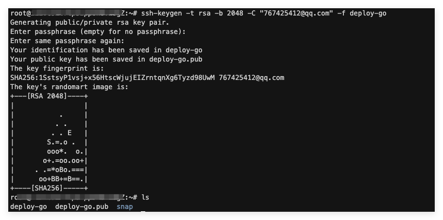

2. **将公钥添加到服务器的授权密钥**：

    ```bash
    cat deploy-go.pub >> ~/.ssh/authorized_keys
    ```

    这个命令会将公钥文件 `deploy-go.pub` 的内容追加到 `~/.ssh/authorized_keys` 文件中。

    > 注意：如果你是通过 SSH 连接到服务器的，那么你需要将公钥添加到服务器上的 `~/.ssh/authorized_keys` 文件中，而不是本地机器上的文件中。

3. **在 GitHub 仓库中添加私钥作为 Secret**：  
   将私钥（deploy-go）内容添加为名为 `SERVER_SSH_KEY` 的 GitHub Secret。

### 3.2 镜像同步到服务器

有两种主要方法可以将 Docker 镜像从 CI/CD 环境同步到生产服务器：

- 通过 Docker 镜像仓库拉取
- 直接使用 SSH 传输镜像文件。

#### 使用 GitHub Actions 推送镜像

通过镜像仓库拉取是最常用的方法，具体步骤如下：

1. **在 GitHub Actions 中构建并推送镜像到仓库**：
   这一步在前面的章节中已经介绍过，通过 `docker/build-push-action` 实现。

2. **在服务器上登录到镜像仓库**：

   ```yaml
   - name: Deploy on server
     uses: appleboy/ssh-action@master
     with:
       host: ${{ secrets.SERVER_HOST }}
       username: ${{ secrets.SERVER_USER }}
       key: ${{ secrets.SERVER_SSH_KEY }}
       script: |
         docker login ${{ env.REGISTRY }} -u ${{ secrets.ALIYUN_USERNAME }} -p ${{ secrets.ALIYUN_PASSWORD }}
   ```

3. **拉取最新镜像并启动容器**：

   ```yaml
   script: |
     cd /opt/go-app
     docker-compose pull
     docker-compose down
     docker-compose up -d
   ```

这种方法的优点是简单可靠，缺点是需要在生产服务器上存储镜像仓库凭证。

#### rsync/scp 配置

对于一些特殊场景，可能需要直接将镜像文件传输到服务器，而不通过镜像仓库：

1. **在 GitHub Actions 中保存镜像为文件**：

   ```yaml
   - name: Save Docker image
     run: |
       docker save ${{ env.IMAGE_NAME }}:${{ env.TAG }} -o image.tar
       gzip image.tar
   ```

2. **使用 SCP 传输镜像文件**：

   ```yaml
   - name: Copy image to server
     uses: appleboy/scp-action@master
     with:
       host: ${{ secrets.SERVER_HOST }}
       username: ${{ secrets.SERVER_USER }}
       key: ${{ secrets.SERVER_SSH_KEY }}
       source: "image.tar.gz"
       target: "/home/go-app"
   ```

3. **在服务器上加载镜像**：

   ```yaml
   - name: Load and run image
     uses: appleboy/ssh-action@master
     with:
       host: ${{ secrets.SERVER_HOST }}
       username: ${{ secrets.SERVER_USER }}
       key: ${{ secrets.SERVER_SSH_KEY }}
       script: |
         cd /home/go-app
         gunzip -c image.tar.gz | docker load
         docker-compose down
         docker-compose up -d
   ```

这种方法的优点是不需要镜像仓库和凭证，缺点是传输大型镜像文件可能耗时较长。

#### 安全传输策略

无论采用哪种同步方式，都需要考虑以下安全策略：

1. **使用短期凭证**：对于镜像仓库认证，使用短期令牌或定期轮换密码
2. **最小权限原则**：仅授予部署所需的最小权限
3. **加密传输**：确保所有通信都通过 SSH 或 HTTPS 加密
4. **验证镜像完整性**：考虑使用镜像签名和验证机制
5. **安全存储凭证**：使用 GitHub Secrets 或其他密钥管理服务

### 3.3 服务器端自动部署

完成镜像同步后，需要实现自动化、可靠的部署流程，包括远程执行命令、容器替换策略和无停机部署技巧。

#### 远程执行命令

GitHub Actions 通过 SSH 在服务器上执行远程命令，实现自动部署：

```yaml
- name: Deploy on server
  uses: appleboy/ssh-action@master
  with:
    host: ${{ secrets.SERVER_HOST }}
    username: ${{ secrets.SERVER_USER }}
    key: ${{ secrets.SERVER_SSH_KEY }}
    script: |
      cd /opt/go-app
      export TAG=${{ steps.tag.outputs.value }}
      docker-compose down
      docker-compose up -d
```

为了提高部署脚本的健壮性，可以添加错误处理和日志记录：

```bash
#!/bin/bash
set -e  # 遇到错误立即退出

# 记录部署日志
exec > >(tee -a /var/log/app-deploy.log) 2>&1
echo "[$(date)] Starting deployment..."

cd /opt/go-app || { echo "Deployment directory not found!"; exit 1; }

# 检查 docker-compose.yml 是否存在
if [ ! -f "docker-compose.yml" ]; then
  echo "docker-compose.yml not found!"
  exit 1
fi

# 拉取最新镜像
echo "Pulling latest images..."
docker-compose pull || { echo "Failed to pull images!"; exit 1; }

# 应用新版本
echo "Stopping current containers..."
docker-compose down || true

echo "Starting new containers..."
docker-compose up -d || { echo "Failed to start containers!"; exit 1; }

# 验证部署
echo "Verifying deployment..."
sleep 5
if docker-compose ps | grep -q "Exit"; then
  echo "Deployment failed! Some containers exited."
  docker-compose logs
  exit 1
fi

echo "[$(date)] Deployment completed successfully!"
```

这个脚本添加了错误处理、日志记录和部署验证，使部署过程更加可靠。

#### 容器替换策略

在更新容器时，有几种替换策略可供选择：

1. **停止后启动**：先停止旧容器，再启动新容器（有短暂停机时间）

    ```bash
    docker-compose down
    docker-compose up -d
    ```

2. **蓝绿部署**：启动新容器后再停止旧容器（需要额外资源）

   ```bash
   # 更新环境变量文件中的版本标签
   sed -i "s/IMAGE_TAG=.*/IMAGE_TAG=${NEW_TAG}/" .env.blue
   
   # 启动蓝色环境
   docker-compose -f docker-compose.blue.yml up -d
   
   # 验证蓝色环境健康
   sleep 10
   if curl -s http://localhost:8081/health | grep -q "ok"; then
        # 切换流量（更新 Nginx 配置）
        sed -i 's/proxy_pass http:\/\/localhost:8080/proxy_pass http:\/\/localhost:8081/' /etc/nginx/sites-enabled/app.conf
        nginx -s reload
        
        # 停止绿色环境
        docker-compose -f docker-compose.green.yml down
   else
        echo "New deployment is unhealthy, aborting!"
        docker-compose -f docker-compose.blue.yml down
        exit 1
   fi
   ```

3. **滚动更新**：对于多容器服务，一次替换一个容器

    ```bash
    # 对于使用 Docker Swarm 的情况
    docker service update --image $IMAGE_NAME:$NEW_TAG --update-parallelism 1 --update-delay 30s my_service
    ```

每种策略都有其优缺点，根据应用需求和可用资源选择合适的策略。本文所用的策略是停止后启动！

## 四、阿里云镜像仓库集成

阿里云容器镜像服务（Alibaba Cloud Container Registry，简称 ACR）是阿里云提供的安全、高性能的容器镜像托管服务。将其集成到我们的部署流程中，可以提供更安全、高效的镜像分发机制。后面将详细介绍如何设置和使用阿里云镜像仓库，以及将其无缝整合到 GitHub Actions 工作流中。

### 4.1 阿里云容器镜像服务介绍

阿里云容器镜像服务提供了企业级的镜像托管和分发功能，是构建现代容器化应用持续交付链路的重要环节。

#### 私有镜像仓库的优势

与公共镜像仓库相比，使用阿里云私有镜像仓库有以下优势：

1. **安全性**：镜像仅对授权用户可见，降低泄露风险
2. **速度**：阿里云内网传输速度更快，降低部署时间
3. **可靠性**：企业级的 SLA 保障，确保服务可用性
4. **合规性**：满足企业合规要求，支持审计和追踪
5. **网络隔离**：可以配置 VPC 内网访问，增强安全性

在容器化部署方案中，私有镜像仓库是确保交付链路安全与高效的关键环节。

#### 阿里云容器镜像服务功能简介

1. **个人版和企业版**：
    - 个人版：适合个人开发者和小型团队，提供基本的镜像托管功能
    - 企业版：提供更高的安全性、可扩展性和管理功能，适合企业级应用
2. **多地域部署**：
   支持在全球多个地域部署镜像仓库，便于跨地域应用部署和团队协作
3. **镜像安全扫描**：
   自动扫描镜像中的安全漏洞，提供修复建议
4. **镜像同步**：
   支持跨地域、跨实例的镜像自动同步
5. **触发器**：
   支持 Webhook 触发器，实现与 CI/CD 系统的集成
6. **加速器**：
   提供全球加速服务，加快镜像拉取速度

#### 权限管理

1. 通过阿里云 RAM（Resource Access Management）服务管理用户和权限
2. 可以为不同的仓库设置不同的访问权限，如只读、推送、管理等
3. 支持生成临时访问凭证，用于 CI/CD 系统安全访问

### 4.2 配置 GitHub Actions 推送到阿里云镜像仓库

要将 GitHub Actions 工作流与阿里云容器镜像服务集成，需要进行以下配置。

#### 创建容器实例

这里创建个人版的实例，容器镜像服务ACR个人版面向个人开发者，提供基础的容器镜像服务，包括应用镜像托管能力、稳定的镜像构建服务以及便捷的镜像授权功能，方便进行镜像全生命周期管理。虽然受限，但也够用了。

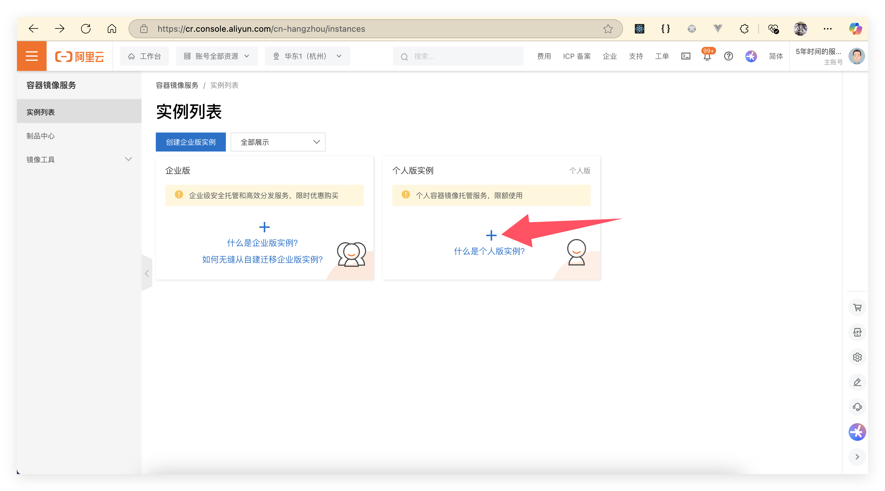

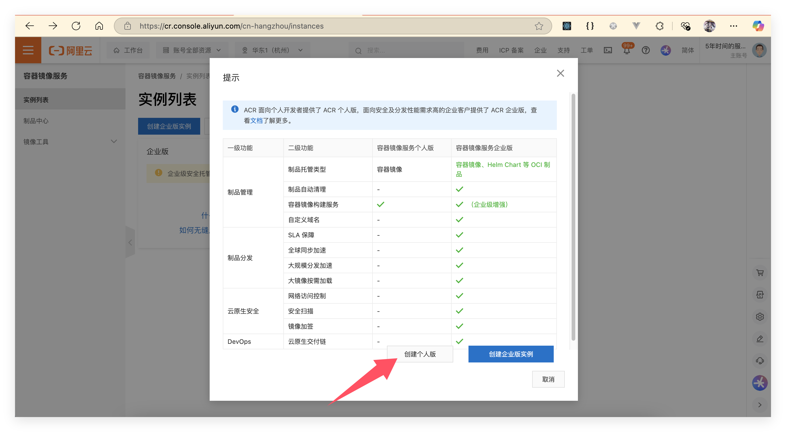

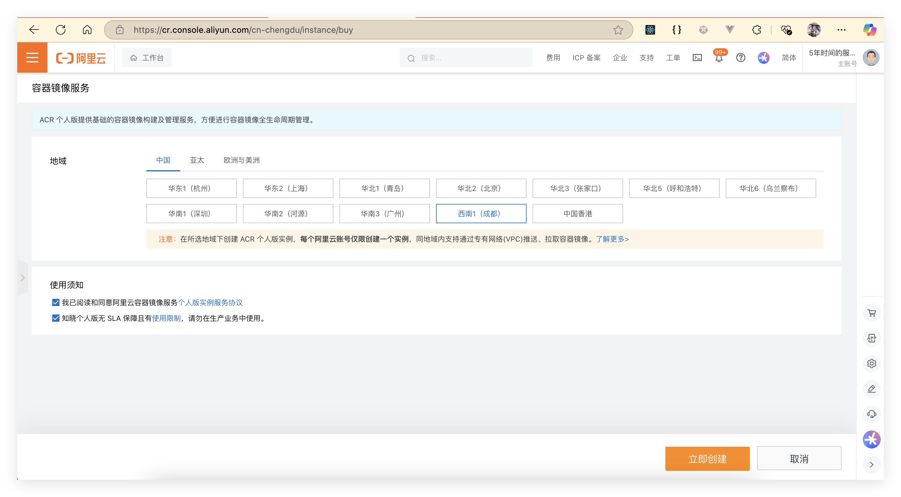

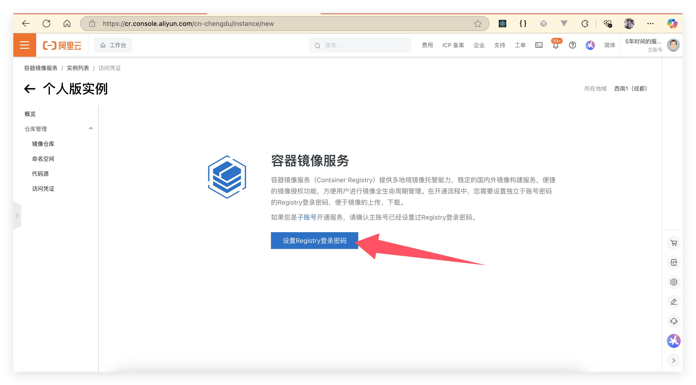

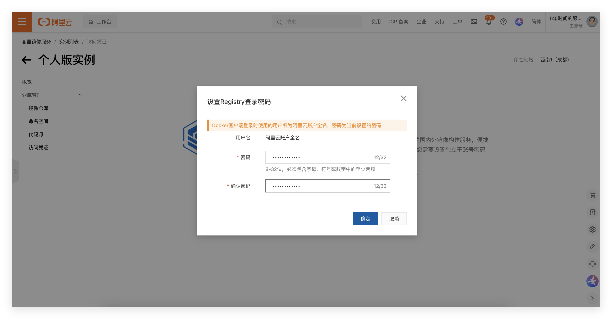

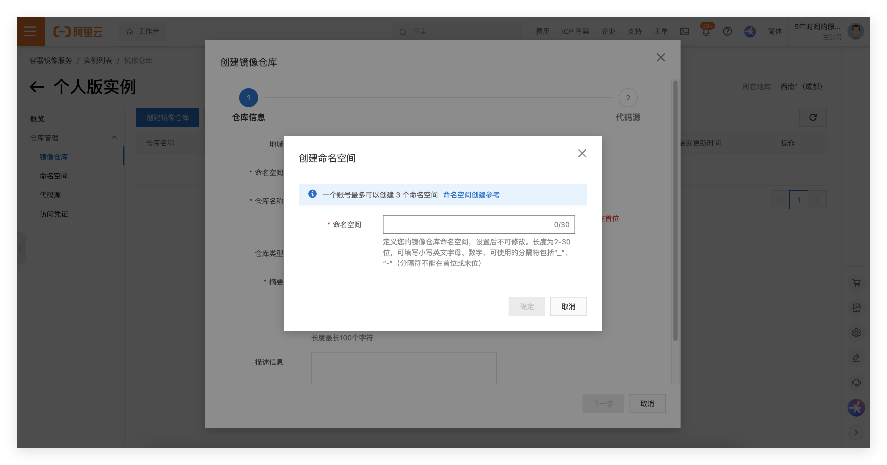

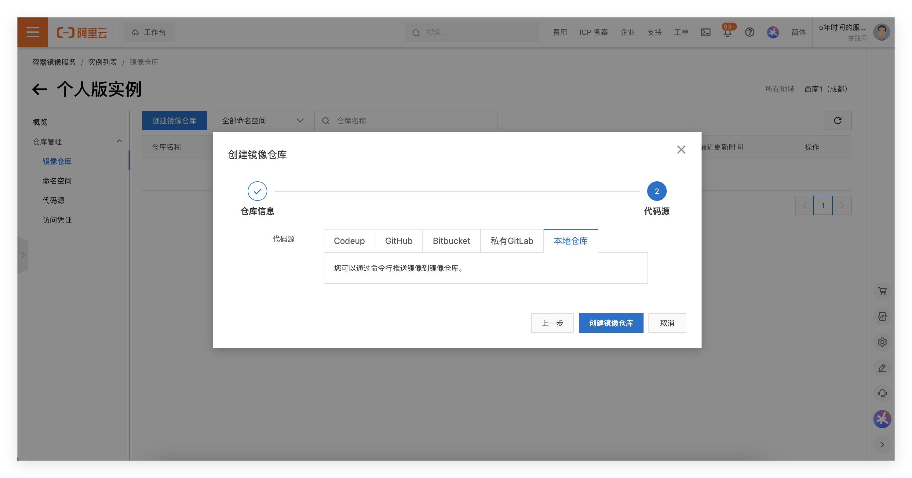

#### 认证配置

首先，需要在 GitHub 仓库中设置访问阿里云的凭证：

1. **创建 GitHub Secrets**：
   在 GitHub 仓库设置中，添加以下 Secrets：
    - `ALIYUN_USERNAME`：阿里云访问密钥 ID（AccessKey ID）
    - `ALIYUN_PASSWORD`：阿里云访问密钥密码（AccessKey Secret）
    - `ALIYUN_REGISTRY`：阿里云容器镜像服务的注册表地址（如 `registry.cn-hangzhou.aliyuncs.com`）
    - `ALIYUN_NAMESPACE`：命名空间名称

    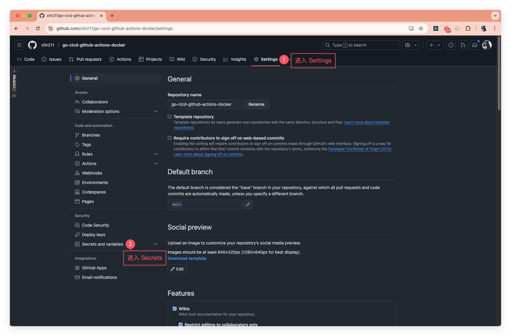

    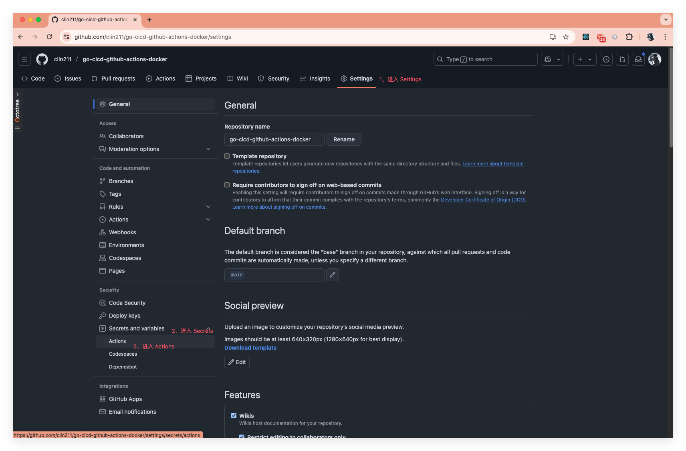

    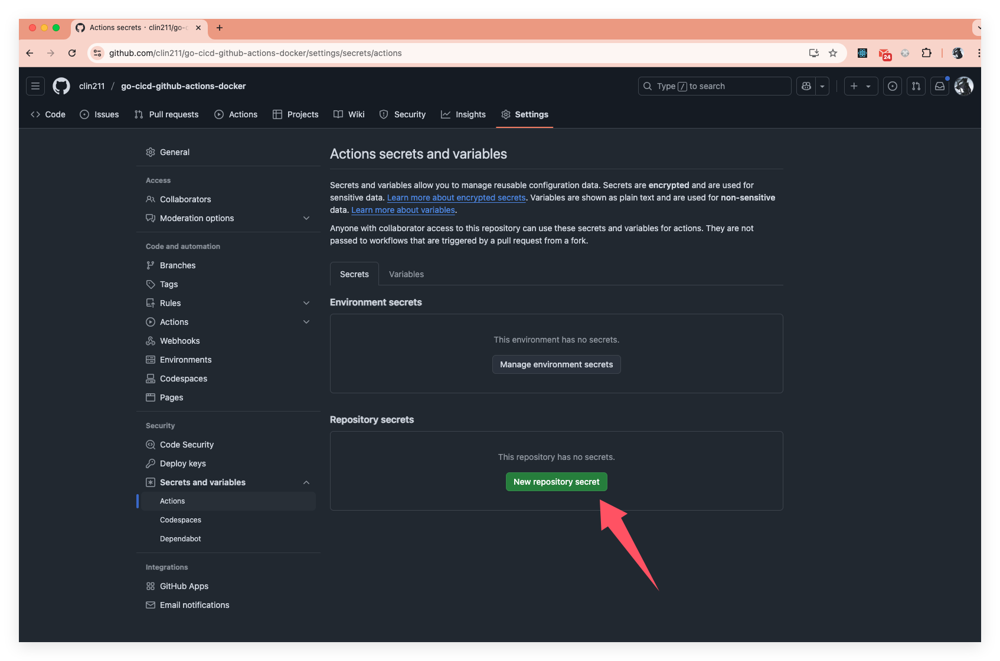

    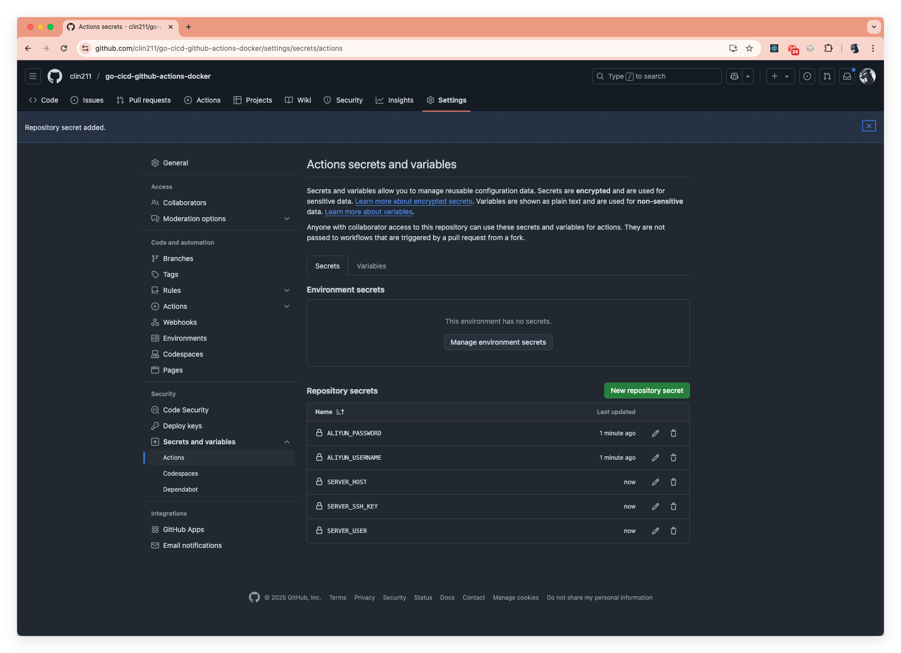

2. **配置 Docker 登录步骤**：
   在 GitHub Actions 工作流中添加登录步骤：

   ```yaml
   - name: Login to ACR
     uses: docker/login-action@v2
     with:
       registry: ${{ secrets.ALIYUN_REGISTRY }}
       username: ${{ secrets.ALIYUN_USERNAME }}
       password: ${{ secrets.ALIYUN_PASSWORD }}
   ```

#### GitHub Secrets 管理

安全管理 GitHub Secrets 是确保部署安全的关键：

1. **定期轮换凭证**：
   定期更新阿里云访问密钥和 GitHub Secrets，降低长期凭证泄露风险

2. **最小权限原则**：
   为 CI/CD 使用的账号仅分配必要的权限，如只允许对特定命名空间的特定仓库进行推送

3. **使用环境范围**：
   利用 GitHub Actions 的环境功能，限制特定分支才能访问部署密钥：

   ```yaml
   jobs:
     deploy:
       environment: production
       # 只有 environment 为 production 的 workflow 才能访问这些 secrets
   ```

4. **审计和监控**：
   启用阿里云 ActionTrail 服务，监控和审计所有 API 调用

#### 推送策略

有效的镜像推送策略可以提高部署效率并节省存储成本：

1. **镜像标签策略**：

   ```yaml
   - name: Generate image tags
     id: meta
     uses: docker/metadata-action@v4
     with:
       images: ${{ secrets.ALIYUN_REGISTRY }}/${{ secrets.ALIYUN_NAMESPACE }}/go-app
       tags: |
         type=semver,pattern={{version}}
         type=semver,pattern={{major}}.{{minor}}
         type=sha,prefix=git-
         type=raw,value=latest,enable=${{ github.ref == 'refs/heads/main' }}
   ```

    这会生成多个标签，包括语义化版本标签和 Git SHA 标签，便于版本追踪。

2. **镜像分层优化**：

   ```yaml
   - name: Build and push
     uses: docker/build-push-action@v3
     with:
       context: .
       file: ./deployments/docker/Dockerfile
       push: true
       tags: ${{ steps.meta.outputs.tags }}
       labels: ${{ steps.meta.outputs.labels }}
       cache-from: type=registry,ref=${{ secrets.ALIYUN_REGISTRY }}/${{ secrets.ALIYUN_NAMESPACE }}/go-app:buildcache
       cache-to: type=registry,ref=${{ secrets.ALIYUN_REGISTRY }}/${{ secrets.ALIYUN_NAMESPACE }}/go-app:buildcache,mode=max
   ```

   使用阿里云镜像仓库作为构建缓存，加速后续构建。

3. **自动清理策略**：  
   配置阿里云镜像服务的自动清理规则，例如保留最近几个版本的镜像，或自动删除超过一定周期的未使用镜像，避免存储成本过高。

### 4.3 从阿里云镜像仓库拉取镜像到服务器

在服务器上从阿里云镜像仓库拉取镜像，需要进行以下配置。

#### 服务器认证配置

首先，需要在服务器上配置阿里云容器镜像服务的访问权限：

1. **创建认证配置**：

    ```bash
    # 在服务器上登录到阿里云容器镜像服务
    docker login --username=${ALIYUN_USERNAME} \
      --password=${ALIYUN_PASSWORD} \
      ${ALIYUN_REGISTRY}
    ```

    这会在 `~/.docker/config.json` 中创建认证信息。

2. **使用凭证助手**：  
   为了提高安全性，可以使用 Docker 凭证助手来安全存储凭证：

    ```bash
    # 安装 pass
    apt-get install -y pass

    # 初始化 pass
    gpg --gen-key  # 按照提示操作
    pass init "Docker Registry Authentication"

    # 安装 docker-credential-helpers
    curl -L https://github.com/docker/docker-credential-helpers/releases/download/v0.6.4/docker-credential-pass-v0.6.4-amd64.tar.gz | tar xz
    chmod +x docker-credential-pass
    mv docker-credential-pass /usr/local/bin/

    # 配置 Docker 使用凭证助手
    cat > ~/.docker/config.json << EOF
    {
      "credsStore": "pass"
    }
    EOF

    # 登录（凭证将安全存储）
    docker login --username=${ALIYUN_USERNAME} \
      --password=${ALIYUN_PASSWORD} \
      ${ALIYUN_REGISTRY}
    ```

3. **为服务用户配置权限**：  
   如果使用非 root 用户运行 Docker，需要确保该用户有权限访问凭证：

    ```bash
    # 将凭证复制到服务用户的主目录
    mkdir -p /home/deploy/.docker
    cp ~/.docker/config.json /home/deploy/.docker/
    chown -R deploy:deploy /home/deploy/.docker
    chmod 600 /home/deploy/.docker/config.json
    ```

#### 自动拉取最新镜像

在 CI/CD 流程中，可以使用以下方法自动拉取最新镜像：

1. **通过 SSH 执行拉取命令**：

   ```yaml
   - name: Deploy to server
     uses: appleboy/ssh-action@master
     with:
       host: ${{ secrets.SERVER_HOST }}
       username: ${{ secrets.SERVER_USER }}
       key: ${{ secrets.SERVER_SSH_KEY }}
       script: |
         cd /opt/go-app
         echo "Pulling latest image..."
         docker pull ${{ secrets.ALIYUN_REGISTRY }}/${{ secrets.ALIYUN_NAMESPACE }}/go-app:${{ steps.meta.outputs.version }}
         echo "Updating docker-compose.yml..."
         sed -i "s|image:.*|image: ${{ secrets.ALIYUN_REGISTRY }}/${{ secrets.ALIYUN_NAMESPACE }}/go-app:${{ steps.meta.outputs.version }}|" docker-compose.yml
         echo "Restarting service..."
         docker-compose down
         docker-compose up -d
   ```

2. **使用 Webhook 触发器**：  
   设置服务器上的 Webhook 监听器，当镜像推送完成时自动触发部署：

    ```bash
    # 在服务器上安装简单的 webhook 服务器
    apt-get install -y webhook

    # 配置 webhook
    cat > /etc/webhook.conf << EOF
    [
      {
        "id": "deploy",
        "execute-command": "/opt/scripts/deploy.sh",
        "command-working-directory": "/opt/go-app",
        "response-message": "Deploying application...",
        "trigger-rule": {
          "match": {
            "type": "value",
            "value": "YOUR_SECRET_TOKEN",
            "parameter": {
              "source": "header",
              "name": "X-Deploy-Token"
            }
          }
        }
      }
    ]
    EOF

    # 创建部署脚本
    cat > /opt/scripts/deploy.sh << EOF
    #!/bin/bash
    cd /opt/go-app
    docker-compose pull
    docker-compose down
    docker-compose up -d
    EOF
    chmod +x /opt/scripts/deploy.sh

    # 启动 webhook 服务
    webhook -hooks /etc/webhook.conf -verbose
    ```

    然后在 GitHub Actions 中触发 webhook：

   ```yaml
   - name: Trigger deployment webhook
     run: |
       curl -X POST \
         -H "X-Deploy-Token: YOUR_SECRET_TOKEN" \
         https://your-server.com:9000/hooks/deploy
   ```

#### 镜像版本管理

有效的镜像版本管理策略可以确保部署的可追踪性和可回滚性：

1. **语义化版本标记**：
   使用语义化版本（例如 v1.2.3）标记稳定版本，便于追踪和回滚

   ```yaml
   # 从 git 标签生成版本号
   - name: Set version
     run: echo "VERSION=${GITHUB_REF#refs/tags/}" >> $GITHUB_ENV
     if: startsWith(github.ref, 'refs/tags/')
   ```

2. **构建元数据嵌入**：  
   将构建信息嵌入镜像中，便于运行时识别

   ```dockerfile
   # Dockerfile 中
   ARG BUILD_DATE
   ARG VERSION
   ARG COMMIT_SHA
   
   LABEL org.opencontainers.image.created="${BUILD_DATE}" \
         org.opencontainers.image.version="${VERSION}" \
         org.opencontainers.image.revision="${COMMIT_SHA}"
   ```

3. **版本锁定机制**：
   在生产环境的 docker-compose.yml 中锁定特定版本，避免意外更新

   ```yaml
   services:
     app:
       image: registry.cn-hangzhou.aliyuncs.com/your-namespace/go-app:v1.2.3
       # 不使用 latest 标签
   ```

4. **回滚策略**：
   在 GitHub Actions 中添加手动回滚工作流

   ```yaml
   name: Rollback Deployment
   
   on:
     workflow_dispatch:
       inputs:
         version:
           description: 'Version to rollback to'
           required: true
   
   jobs:
     rollback:
       runs-on: ubuntu-latest
       steps:
         - name: Deploy specific version
           uses: appleboy/ssh-action@master
           with:
             host: ${{ secrets.SERVER_HOST }}
             username: ${{ secrets.SERVER_USER }}
             key: ${{ secrets.SERVER_SSH_KEY }}
             script: |
               cd /opt/go-app
               echo "Rolling back to version ${{ github.event.inputs.version }}..."
               sed -i "s|image:.*|image: ${{ secrets.ALIYUN_REGISTRY }}/${{ secrets.ALIYUN_NAMESPACE }}/go-app:${{ github.event.inputs.version }}|" docker-compose.yml
               docker-compose down
               docker-compose pull
               docker-compose up -d
   ```

通过这些配置和策略，可以建立一个安全、高效、可靠的阿里云容器镜像服务集成方案，实现 Go 应用的自动化部署。

## 五、完整部署链路实现

### 5.1 GitHub Actions 工作流完整配置

以下是一个完整的 GitHub Actions 工作流配置文件，实现了从代码提交到生产部署的自动化流程：

```yaml
name: Build and Deploy

on:
  push:
    branches: [ main ]
    tags: [ 'v*' ]
  pull_request:
    branches: [ main ]
  workflow_dispatch:  # 允许手动触发

env:
  # 全局环境变量
  APP_NAME: go-app
  REGISTRY: registry.cn-hangzhou.aliyuncs.com
  NAMESPACE: your-namespace

jobs:
  # 第一阶段：代码检查和测试
  test:
    name: Test
    runs-on: ubuntu-latest
    steps:
      - name: Checkout code
        uses: actions/checkout@v3
      
      - name: Set up Go
        uses: actions/setup-go@v4
        with:
          go-version: '1.24'
      
      - name: Verify dependencies
        run: go mod verify
      
      - name: Run golangci-lint
        uses: golangci/golangci-lint-action@v3
        with:
          version: latest
      
      - name: Run tests
        run: go test -v -race -coverprofile=coverage.txt -covermode=atomic ./...
      
      - name: Upload coverage report
        uses: codecov/codecov-action@v3
        with:
          file: ./coverage.txt
          flags: unittests
          fail_ci_if_error: true

  # 第二阶段：构建和推送 Docker 镜像
  build:
    name: Build and Push
    needs: test  # 依赖测试作业成功完成
    runs-on: ubuntu-latest
    steps:
      - name: Checkout code
        uses: actions/checkout@v3
        with:
          fetch-depth: 0  # 获取完整历史以生成正确的版本信息
      
      - name: Set up Docker Buildx
        uses: docker/setup-buildx-action@v2
      
      - name: Login to ACR
        uses: docker/login-action@v2
        with:
          registry: ${{ env.REGISTRY }}
          username: ${{ secrets.ALIYUN_USERNAME }}
          password: ${{ secrets.ALIYUN_PASSWORD }}
      
      - name: Extract metadata
        id: meta
        uses: docker/metadata-action@v4
        with:
          images: ${{ env.REGISTRY }}/${{ env.NAMESPACE }}/${{ env.APP_NAME }}
          tags: |
            type=ref,event=branch
            type=ref,event=pr
            type=semver,pattern={{version}}
            type=semver,pattern={{major}}.{{minor}}
            type=sha,prefix=git-
      
      - name: Build and push
        uses: docker/build-push-action@v4
        with:
          context: .
          file: ./deployments/docker/Dockerfile
          push: ${{ github.event_name != 'pull_request' }}
          tags: ${{ steps.meta.outputs.tags }}
          labels: ${{ steps.meta.outputs.labels }}
          build-args: |
            VERSION=${{ steps.meta.outputs.version }}
            BUILD_DATE=$(date -u +'%Y-%m-%dT%H:%M:%SZ')
            COMMIT_SHA=${{ github.sha }}
          cache-from: type=registry,ref=${{ env.REGISTRY }}/${{ env.NAMESPACE }}/${{ env.APP_NAME }}:buildcache
          cache-to: type=registry,ref=${{ env.REGISTRY }}/${{ env.NAMESPACE }}/${{ env.APP_NAME }}:buildcache,mode=max

  # 第三阶段：部署到生产服务器
  deploy:
    name: Deploy to Production
    needs: build  # 依赖构建作业成功完成
    if: github.event_name != 'pull_request'  # PR 不部署
    runs-on: ubuntu-latest
    environment: production  # 使用生产环境
    
    steps:
      - name: Checkout code
        uses: actions/checkout@v3
      
      - name: Extract version
        id: version
        run: |
          if [[ $GITHUB_REF == refs/tags/* ]]; then
            VERSION=${GITHUB_REF#refs/tags/}
          else
            VERSION=git-${GITHUB_SHA::8}
          fi
          echo "VERSION=$VERSION" >> $GITHUB_OUTPUT
      
      - name: Prepare deployment files
        run: |
          mkdir -p deploy
          cp deployments/docker-compose.prod.yml deploy/docker-compose.yml
          cat > deploy/.env << EOF
          APP_NAME=${{ env.APP_NAME }}
          IMAGE_NAME=${{ env.REGISTRY }}/${{ env.NAMESPACE }}/${{ env.APP_NAME }}
          IMAGE_TAG=${{ steps.version.outputs.VERSION }}
          DB_HOST=db
          DB_PORT=5432
          DB_USER=${{ secrets.DB_USER }}
          DB_PASSWORD=${{ secrets.DB_PASSWORD }}
          DB_NAME=${{ secrets.DB_NAME }}
          REDIS_HOST=redis
          EOF
      
      - name: Copy files to server
        uses: appleboy/scp-action@master
        with:
          host: ${{ secrets.SERVER_HOST }}
          username: ${{ secrets.SERVER_USER }}
          key: ${{ secrets.SERVER_SSH_KEY }}
          source: "deploy/*"
          target: "/opt/${{ env.APP_NAME }}"
          strip_components: 1
          overwrite: true
      
      - name: Deploy on server
        uses: appleboy/ssh-action@master
        with:
          host: ${{ secrets.SERVER_HOST }}
          username: ${{ secrets.SERVER_USER }}
          key: ${{ secrets.SERVER_SSH_KEY }}
          script: |
            cd /opt/${{ env.APP_NAME }}
            echo "Authenticating with container registry..."
            docker login ${{ env.REGISTRY }} -u ${{ secrets.ALIYUN_USERNAME }} -p ${{ secrets.ALIYUN_PASSWORD }}
            
            echo "Pulling new image..."
            docker-compose pull
            
            echo "Deploying application..."
            docker-compose down --remove-orphans
            docker-compose up -d
            
            echo "Cleaning up..."
            docker image prune -f
            
            echo "Verifying deployment..."
            sleep 10
            if ! docker-compose ps | grep -q "Up"; then
              echo "Deployment failed!"
              docker-compose logs
              exit 1
            fi
            
            echo "Deployment successful!"
      
      - name: Notify success
        if: success()
        uses: rtCamp/action-slack-notify@v2
        env:
          SLACK_WEBHOOK: ${{ secrets.SLACK_WEBHOOK }}
          SLACK_CHANNEL: deployments
          SLACK_COLOR: good
          SLACK_TITLE: 部署成功
          SLACK_MESSAGE: ":rocket: ${{ env.APP_NAME }} v${{ steps.version.outputs.VERSION }} 已成功部署到生产环境"
      
      - name: Notify failure
        if: failure()
        uses: rtCamp/action-slack-notify@v2
        env:
          SLACK_WEBHOOK: ${{ secrets.SLACK_WEBHOOK }}
          SLACK_CHANNEL: deployments
          SLACK_COLOR: danger
          SLACK_TITLE: 部署失败
          SLACK_MESSAGE: ":x: ${{ env.APP_NAME }} v${{ steps.version.outputs.VERSION }} 部署失败，请检查 GitHub Actions 日志"
```

#### 环境变量和密钥管理

在上述工作流中，我们使用了多种环境变量和密钥：

1. **仓库级别环境变量**：

    ```yaml
    env:
        APP_NAME: go-app
        REGISTRY: registry.cn-hangzhou.aliyuncs.com
        NAMESPACE: your-namespace
    ```

    这些是全局配置，可以在工作流中随时引用。

2. **GitHub Secrets**：
   需要在仓库 Settings -> Secrets and variables -> Actions 中添加以下机密：
    - `ALIYUN_USERNAME`: 阿里云访问密钥 ID
    - `ALIYUN_PASSWORD`: 阿里云访问密钥密码
    - `SERVER_HOST`: 服务器 IP 地址
    - `SERVER_USER`: SSH 用户名
    - `SERVER_SSH_KEY`: SSH 私钥
    - `DB_USER`: 数据库用户名
    - `DB_PASSWORD`: 数据库密码
    - `DB_NAME`: 数据库名称
    - `SLACK_WEBHOOK`: Slack 通知 Webhook URL

3. **环境特定变量**：
   工作流使用 `environment: production` 配置环境特定的变量和密钥，可以实现更细粒度的权限控制。

#### 错误处理和通知

工作流中包含了错误处理和通知机制：

1. **失败检测**：

    ```bash
    if ! docker-compose ps | grep -q "Up"; then
      echo "Deployment failed!"
      docker-compose logs
      exit 1
    fi
    ```

    在部署后，检查容器是否正常运行，如果失败则输出日志并终止工作流。

2. **Slack 通知**：
   使用 `rtCamp/action-slack-notify` 动作在部署成功或失败时发送通知，让团队成员及时了解部署状态。

3. **作业依赖**：
   通过 `needs` 关键字确保作业按正确顺序执行，任何前置作业失败都会停止后续步骤。

### 5.2 部署链路的监控和日志

一个完善的部署链路需要配套的监控和日志系统，以便跟踪部署状态和排查问题。

#### 部署状态监控

1. **GitHub Actions 状态徽章**：
   在项目 README 中添加工作流状态徽章：

    ```markdown
    

    比如：
    ```

2. **部署健康检查**：
   在应用中实现健康检查 API，并在 docker-compose.yml 中配置健康检查：

   ```yaml
   services:
     app:
       # ... 其他配置 ...
       healthcheck:
         test: ["CMD", "curl", "-f", "http://localhost:8080/health"]
         interval: 30s
         timeout: 10s
         retries: 3
         start_period: 20s
   ```

3. **Prometheus 指标收集**：
   在 Go 应用中添加 Prometheus 指标支持：

    ```go
    import (
        "github.com/prometheus/client_golang/prometheus"
        "github.com/prometheus/client_golang/prometheus/promhttp"
    )

    func setupMetrics() {
        // 注册自定义指标
        deploymentCounter := prometheus.NewCounter(prometheus.CounterOpts{
            Name: "app_deployments_total",
            Help: "Total number of deployments",
        })
        prometheus.MustRegister(deploymentCounter)

        // 部署时增加计数
        deploymentCounter.Inc()

        // 暴露 /metrics 端点
        http.Handle("/metrics", promhttp.Handler())
    }
    ```

4. **Grafana 部署面板**：
   创建专门的 Grafana 面板来监控部署指标，包括部署频率、部署持续时间和部署成功率等。

#### 日志收集与分析

1. **集中式日志系统**：
   使用 ELK 栈（Elasticsearch, Logstash, Kibana）或 Loki 收集和分析日志：

   ```yaml
   services:
     app:
       # ... 其他配置 ...
       logging:
         driver: "json-file"
         options:
           max-size: "10m"
           max-file: "3"
   
     filebeat:
       image: docker.elastic.co/beats/filebeat:7.10.0
       volumes:
         - /var/lib/docker/containers:/var/lib/docker/containers:ro
         - ./filebeat.yml:/usr/share/filebeat/filebeat.yml:ro
       user: root
       restart: unless-stopped
   ```

2. **结构化日志**：
   在 Go 应用中使用结构化日志格式，便于分析：

    ```go
    import (
        "github.com/rs/zerolog"
        "github.com/rs/zerolog/log"
    )

    func setupLogging() {
        zerolog.TimeFieldFormat = zerolog.TimeFormatUnix

        log.Info().
            Str("version", version).
            Str("commit", commitSha).
            Str("environment", environment).
            Msg("Application started")
    }
    ```

3. **部署事件记录**：
   在部署过程中记录关键事件，便于追踪：

    ```bash
    echo "[$(date)] Deployment started: version $VERSION" >> /var/log/deployment.log
    # 执行部署步骤
    echo "[$(date)] Deployment completed: status $?" >> /var/log/deployment.log
    ```

#### 故障排查策略

1. **蓝绿部署排查**：
   当使用蓝绿部署时，保留旧版本一段时间，便于快速回滚和对比排查：

    ```bash
    # 不要立即删除旧容器，先停止它们
    docker-compose -f docker-compose.green.yml stop

    # 保留一段时间后再清理
    (sleep 1h && docker-compose -f docker-compose.green.yml down) &
    ```

2. **部署历史记录**：
   记录每次部署的详细信息，便于追溯问题：

    ```bash
    cat > /opt/go-app/deployments.log << EOF
    $(date) - Version: $VERSION, Commit: $COMMIT_SHA, User: $GITHUB_ACTOR
    $(docker-compose ps)
    ---
    EOF
    ```

3. **镜像版本管理**：
   保留历史镜像版本，便于回滚测试：

    ```bash
    # 在清理镜像前，保留最近 5 个版本
    docker image ls $IMAGE_NAME --format "{{.Tag}}" | sort -r | tail -n +6 | xargs -I {} docker image rm $IMAGE_NAME:{}
    ```

### 5.3 优化与最佳实践

通过不断优化部署流程，可以提高部署效率、安全性和可靠性。

#### 部署速度优化

1. **缓存优化**：
   除了 Docker 构建缓存，还可以缓存 Go 模块和测试结果：

    ```yaml
    - name: Go 模块缓存
      uses: actions/cache@v3
      with:
          path: |
              ~/.cache/go-build
              ~/go/pkg/mod
          key: ${{ runner.os }}-go-${{ hashFiles('**/go.sum') }}
          restore-keys: |
              ${{ runner.os }}-go-
    ```

2. **并行作业**：
   将独立的任务拆分为并行作业，例如同时进行代码检查和构建准备工作。

3. **分层部署**：
   先部署不依赖数据库的服务，再部署数据库相关服务，减少整体部署时间。

4. **增量部署**：
   对于大型项目，实现微服务架构，只部署变更的服务。

#### 安全性考虑

1. **密钥轮换**：
   定期轮换所有部署密钥，减少泄露风险：

    ```bash
    # 创建轮换密钥的脚本
    cat > rotate_keys.sh << EOF
    #!/bin/bash
    # 生成新的 SSH 密钥
    ssh-keygen -t ed25519 -f deploy_key -N ""

    # 更新服务器上的授权密钥
    ssh user@server "sed -i '/github-actions/d' ~/.ssh/authorized_keys"
    cat deploy_key.pub | ssh user@server "cat >> ~/.ssh/authorized_keys"

    echo "现在，将 deploy_key 添加到 GitHub Secrets..."
    EOF
    ```

2. **漏洞扫描**：
   在部署前添加容器镜像漏洞扫描：

   ```yaml
   - name: Scan image for vulnerabilities
     uses: aquasecurity/trivy-action@master
     with:
       image-ref: ${{ env.REGISTRY }}/${{ env.NAMESPACE }}/${{ env.APP_NAME }}:${{ steps.meta.outputs.version }}
       format: 'table'
       exit-code: '1'
       ignore-unfixed: true
       severity: 'CRITICAL,HIGH'
   ```

3. **最小权限原则**：
   为部署账号分配最小必要权限，使用临时凭证：

   ```yaml
   - name: Configure AWS credentials
     uses: aws-actions/configure-aws-credentials@v1
     with:
       role-to-assume: arn:aws:iam::123456789012:role/deployment-role
       aws-region: us-east-1
   ```

#### 扩展性设计

1. **模块化工作流**：
   将工作流拆分为可复用的组件，使用 GitHub Actions 的 `workflow_call` 特性：

   ```yaml
   # .github/workflows/build.yml
   name: Build
   on:
     workflow_call:
       inputs:
         image-name:
           required: true
           type: string
   
   jobs:
     build:
       # ... 构建逻辑 ...
   ```

    然后在主工作流中调用：

   ```yaml
   jobs:
     call-build:
       uses: ./.github/workflows/build.yml
       with:
         image-name: go-app
   ```

2. **环境矩阵**：
   支持多环境部署，使用矩阵策略：

   ```yaml
   jobs:
     deploy:
       strategy:
         matrix:
           environment: [staging, production]
       environment: ${{ matrix.environment }}
       # ... 部署逻辑 ...
   ```

3. **部署配置外部化**：
   将部署配置存储在专用仓库或配置系统中，与应用代码分离：

   ```yaml
   - name: Get deployment config
     uses: actions/checkout@v3
     with:
       repository: your-org/deployment-configs
       path: deploy-configs
       token: ${{ secrets.CONFIG_REPO_TOKEN }}
   ```

通过以上的完整部署链路实现，我们建立了一个从代码提交到生产部署的全自动化流程，具有高效、安全、可靠的特点，同时兼顾了监控、日志和优化等方面的需求。

## 六、结语

至此，我们详细介绍了一套完整的 Go 项目自动化部署解决方案，从通过 GitHub Actions + Docker 的自动化部署方案，为 Go 项目提供了一套完整的从代码到生产的部署流程。这套方案适用于中小型项目和团队，无需复杂的基础设施即可实现专业级的 CI/CD 体验。

随着项目的发展，可以基于此方案进一步扩展和优化，满足更复杂的需求。希望本文能够帮助开发者或运维人员简化部署流程，将更多精力投入到业务开发和创新中，而不是繁琐的手动部署工作。

自动化不是目的，而是手段。真正的目标是通过自动化提升交付效率、产品质量和团队协作，最终为用户创造更大的价值。在这个持续演进的技术世界中，保持学习和优化的心态，才能让我们的部署系统与时俱进，不断完善。
