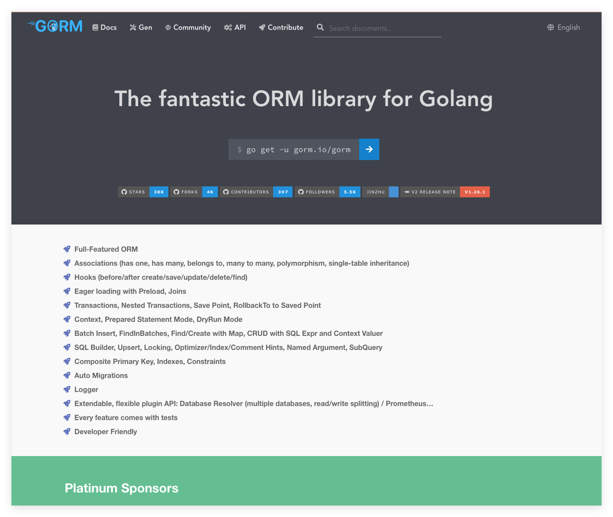
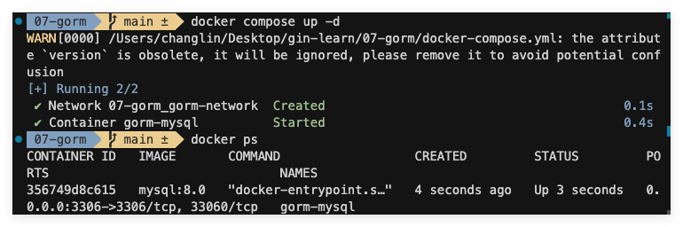
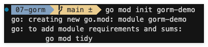

项目开发过程中，免不了要跟数据库打交道，Gorm 作为 Go 语言生态中最受欢迎的 ORM 框架，通过简洁优雅的 API 设计和强大的功能特性，为开发者提供了一种既保持 Go 语言简洁性又能高效处理复杂数据库操作的解决方案。

对于 Go 开发者而言，Gorm 不仅仅是一个数据库交互工具，更是一个能够显著提升开发效率、降低维护成本的生产力工具。从简单的 CRUD 操作到复杂的关联查询和事务管理，Gorm 都提供了**符合直觉的接口设计**，使开发者能够专注于业务逻辑而非底层数据库交互细节。

本指南旨在帮助开发者快速掌握 Gorm 的核心功能和最佳实践；让我们一起探索 Gorm 如何帮助你构建更健壮、更高效的数据驱动应用。

## 一. Gorm 简介

### 1.1 Gorm 是什么

Gorm 是一个用 Go 语言编写的全功能 ORM 库，由 Jinzhu Zhang 开发并维护。它提供了一种面向对象的方式来操作关系型数据库，使开发者能够以 Go 结构体的形式定义数据模型，并通过简单直观的 API 进行数据库操作，而无需直接编写 SQL 语句。

Gorm 支持多种主流数据库，包括 `MySQL`、`PostgreSQL`、`SQLite`、`SQL Server` 等，为 Go 开发者提供了统一的数据库操作接口，大大简化了数据库交互的复杂性。

### 1.2 Gorm 的特点和优势

1. **简洁优雅的 API 设计**：Gorm 的 API 设计遵循 Go 语言的简洁哲学，提供了直观易用的接口，使开发者能够快速上手并高效开发。

2. **强大的功能特性**：
   - 自动迁移：根据模型定义自动创建和更新数据库表结构
   - 关联关系：支持一对一、一对多、多对多等复杂关联关系
   - 钩子函数：提供 BeforeSave、AfterFind 等生命周期钩子，方便在数据操作前后执行自定义逻辑
   - 事务支持：完整的事务管理功能，包括手动和自动事务
   - 预加载：通过预加载机制解决 N+1 查询问题，提高查询效率

3. **高性能**：Gorm 在保持易用性的同时，也注重性能优化，支持连接池、批量操作等特性，能够满足高并发场景的需求。

4. **活跃的社区支持**：作为 Go 生态中最受欢迎的 ORM 框架之一，Gorm 拥有活跃的社区和丰富的文档资源，开发者可以轻松获取帮助和最佳实践。

5. **可扩展性**：Gorm 提供了插件机制，允许开发者扩展其功能，满足特定业务场景的需求。

### 1.3 与其他 ORM 框架的对比

与其他 Go 语言的 ORM 框架相比，Gorm 具有以下优势：

#### 1.3.1 与 SQLx 对比

- SQLx 更接近原生 SQL，需要开发者编写更多 SQL 语句
- Gorm 提供更高级的抽象，减少 SQL 编写，更适合快速开发
- Gorm 的自动迁移和关联关系管理是 SQLx 所不具备的

#### 1.3.2 与 XORM 对比

- XORM 功能丰富但 API 相对复杂
- Gorm 的 API 设计更简洁直观，学习曲线更平缓
- Gorm 的社区活跃度和文档质量高且支持中、英、法等11种语言

#### 1.3.3 与 Ent 对比

- Ent 是 Facebook 开发的图数据库 ORM，专注于图数据模型
- Gorm 更通用，适用于传统关系型数据库
- Gorm 的 API 更符合 Go 语言习惯，而 Ent 的 API 风格更接近 GraphQL


## 二. 安装与配置

### 2.1 环境准备

在开始使用 Gorm 之前，我们需要先搭建一个 MySQL 数据库环境。为了便于演示和开发，我们使用 Docker Compose 来快速部署一个 MySQL 实例。

#### 2.1.1 创建 Docker Compose 配置

首先，先创建一个项目 `07-gorm`，在项目根目录创建 `docker-compose.yml` 文件，内容如下：

```yaml
version: '3.8'

services:
  mysql:
    image: mysql:8.0
    container_name: gorm-mysql
    restart: always
    environment:
      MYSQL_ROOT_PASSWORD: root123456
      MYSQL_DATABASE: gorm_demo
      MYSQL_USER: gorm
      MYSQL_PASSWORD: gorm123456
    ports:
      - "3306:3306"
    volumes:
      - mysql_data:/var/lib/mysql
    command: --character-set-server=utf8mb4 --collation-server=utf8mb4_unicode_ci
    networks:
      - gorm-network

volumes:
  mysql_data:
    driver: local

networks:
  gorm-network:
    driver: bridge
```

#### 2.1.2 启动 MySQL 服务

在终端中执行以下命令启动 MySQL 服务：

```bash
docker-compose up -d
```

执行完成后，可以通过以下命令检查容器状态：

```bash
docker-compose ps
```
效果如下图：



### 2.2 安装 Gorm

#### 2.2.1 创建 Go 项目

进入项目根目录后初始化项目：
```bash
cd 07-gorm
go mod init gorm-demo
```

命令执行后如下图：


执行后，在项目的根目录就会出现一个 `go.mod` 的文件，内容如下：
```go
module gorm-demo

go 1.24.2
```

#### 2.2.2 安装 Gorm 和 MySQL 驱动

使用 go get 命令安装 `Gorm` 和 `MySQL` 驱动：

```sh
go get -u gorm.io/gorm
go get -u gorm.io/driver/mysql
```

### 2.3 配置 Gorm

#### 2.3.1 基本配置

创建一个 `main.go` 文件，添加以下代码来测试数据库连接：

```go
package main

import (
    "fmt"
    "log"
    "gorm.io/gorm"
    "gorm.io/driver/mysql"
)

func main() {
    dsn := "gorm:gorm123456@tcp(127.0.0.1:3306)/gorm_demo?charset=utf8mb4&parseTime=True&loc=Local"
    db, err := gorm.Open(mysql.Open(dsn), &gorm.Config{})
    if err != nil {
        log.Fatal("Failed to connect to database:", err)
    }
    fmt.Println("Successfully connected to database!")
}
```
这段代码是使用 Gorm 连接 MySQL 数据库的基本示例。它展示了如何：
- 配置数据库连接参数
- 建立数据库连接
- 处理连接错误
- 验证连接是否成功

其中最主要的还是链接数据库的 `DSN (Data Source Name)`，其格式是 `[username[:password]@][protocol[(address)]]/dbname[?param1=value1&...&paramN=valueN]`；注意参数的大小写。更多参数相关的详细解释可以查看 [https://github.com/go-sql-driver/mysql#dsn-data-source-name](https://github.com/go-sql-driver/mysql#dsn-data-source-name)！

#### 2.3.2 连接池配置

为了优化性能，我们可以配置数据库连接池。在建立连接后添加以下配置：

```go
sqlDB, err := db.DB()
if err != nil {
    log.Fatal("Failed to get database instance:", err)
}

// 设置连接池参数
sqlDB.SetMaxIdleConns(10)           // 设置空闲连接池中的最大连接数
sqlDB.SetMaxOpenConns(100)          // 设置打开数据库连接的最大数量
sqlDB.SetConnMaxLifetime(time.Hour) // 设置连接可复用的最大时间
```

### 2.4 日志配置

Gorm 提供了灵活的日志配置选项，可以根据需要设置不同的日志级别和输出方式：

```go
db, err := gorm.Open(mysql.Open(dsn), &gorm.Config{
    Logger: logger.Default.LogMode(logger.Info), // 设置日志级别
})
```

日志级别选项包括：

- Silent：不显示任何日志
- Error：仅显示错误日志
- Warn：显示警告和错误日志
- Info：显示所有日志

### 2.5 验证配置

完成上述配置后，可以运行程序来验证配置是否正确：

```bash
go run main.go
```

如果看到终端 "Successfully connected to database!" 的输出，说明配置成功。下面我们开始模型的定义！

## 三. 模型定义

在 Gorm 中，模型是通过 Go 结构体来定义的。这些结构体不仅定义了数据库表的结构，还包含了表名、字段映射、索引等元数据信息。

### 3.1 基本模型定义

#### 3.1.1 最简单的模型

以下是一个最基本的用户模型示例：

```go
type User struct {
    ID   uint   `gorm:"primaryKey"`
    Name string `gorm:"size:255"`
    Age  int
}
```

这个模型会被映射到数据库中的 `users` 表（Gorm 会自动将结构体名称转换为复数形式作为表名）。GORM 使用结构体名的 `snake_cases`(蛇形命名)作为表名；不过也可以通过 `TableName` 方法对表进行命名。比如将 User 的表名重写为 `profiles`：
```go
// TableName 会将 User 的表名重写为 `profiles`
func (User) TableName() string {
  return "profiles"
}
```

#### 3.1.2 字段标签

Gorm 使用结构体标签（struct tags）来定义字段的数据库映射属性。常用的标签包括：

- `primaryKey`：设置主键
- `column`：指定列名
- `type`：指定列类型，推荐使用兼容性好的通用类型；例如：所有数据库都支持 bool、int、uint、float、string、time、bytes 并且可以和其他标签一起使用，例如：not null、size, autoIncrement… 像 varbinary(8) 这样指定数据库数据类型也是支持的。
- `size`：指定列数据类型的大小或长度
- `not null`：设置非空约束
- `unique`：设置唯一约束
- `index`：创建索引
- `default`：设置默认值
- `comment`：注释
- `autoIncrement`：设置为自动增长

示例：

```go
type Product struct {
    ID          uint      `gorm:"primaryKey"`
    Code        string    `gorm:"uniqueIndex;size:50;not null"`
    Price       float64   `gorm:"type:decimal(10,2)"`
    CreatedAt   time.Time `gorm:"default:CURRENT_TIMESTAMP"`
    UpdatedAt   time.Time `gorm:"default:CURRENT_TIMESTAMP ON UPDATE CURRENT_TIMESTAMP"`
}
```

让我们详细解析这个产品模型的结构：

1. **ID 字段**：
   ```go
   ID uint `gorm:"primaryKey"`
   ```
   - 使用 `uint` 类型作为主键
   - `primaryKey` 标签将其设置为表的主键
   - 默认情况下，Gorm 会将其设置为自增主键

2. **Code 字段**：
   ```go
   Code string `gorm:"uniqueIndex;size:50;not null"`
   ```
   - 使用 `string` 类型存储产品编码
   - `uniqueIndex` 标签创建唯一索引，确保产品编码不重复
   - `size:50` 限制字段长度为 50 个字符
   - `not null` 确保该字段不能为空

3. **Price 字段**：
   ```go
   Price float64 `gorm:"type:decimal(10,2)"`
   ```
   - 使用 `float64` 类型存储价格
   - `type:decimal(10,2)` 指定数据库中的类型为 decimal，总长度 10 位，小数位 2 位
   - 这样可以精确存储货币金额，避免浮点数计算误差

4. **CreatedAt 字段**：
   ```go
   CreatedAt time.Time `gorm:"default:CURRENT_TIMESTAMP"`
   ```
   - 使用 `time.Time` 类型记录创建时间
   - `default:CURRENT_TIMESTAMP` 设置默认值为当前时间戳
   - 当创建新记录时，如果没有指定该字段的值，将自动使用当前时间

5. **UpdatedAt 字段**：
   ```go
   UpdatedAt time.Time `gorm:"default:CURRENT_TIMESTAMP ON UPDATE CURRENT_TIMESTAMP"`
   ```
   - 使用 `time.Time` 类型记录更新时间
   - `default:CURRENT_TIMESTAMP ON UPDATE CURRENT_TIMESTAMP` 设置默认值为当前时间戳，并在记录更新时自动更新为当前时间
   - 这个特性对于跟踪记录的修改时间非常有用

这个模型在数据库中的映射结果：
- 表名：`products`（没有指定表名的时候，Gorm 自动将结构体名转换为复数形式）
- 主键：`id`（自增）
- 唯一索引：`code`（非空，最大长度 50）
- 价格字段：`price`（decimal(10,2)）
- 时间戳：`created_at` 和 `updated_at`（自动管理）

### 3.2 模型嵌入

#### 3.2.1 基础模型

Gorm 提供了 `gorm.Model` 结构体，它包含了常用的字段：

```go
type Model struct {
    ID        uint           `gorm:"primarykey"`
    CreatedAt time.Time
    UpdatedAt time.Time
    DeletedAt gorm.DeletedAt `gorm:"index"`
}
```

你可以通过嵌入这个结构体来复用这些字段：

```go
type User struct {
    gorm.Model
    Name string
    Age  int
}
```

#### 3.2.2 自定义基础模型

你也可以创建自己的基础模型：

```go
type BaseModel struct {
    ID        uint      `gorm:"primarykey"`
    CreatedAt time.Time `gorm:"autoCreateTime"`
    UpdatedAt time.Time `gorm:"autoUpdateTime"`
}

type User struct {
    BaseModel
    Name string
    Age  int
}
```

完整代码示例如下：
```go
package main

import (
	"encoding/json"
	"fmt"
	"log"

	"gorm.io/driver/mysql"
	"gorm.io/gorm"
)

type User struct {
	gorm.Model
	Name string `gorm:"column:name"`
	Age  int    `gorm:"column:age"`
}

func (User) TableName() string {
	return "users"
}

func main() {
	db, err := gorm.Open(mysql.Open("gorm:gorm123456@tcp(127.0.0.1:3306)/gorm_demo?charset=utf8mb4&parseTime=True&loc=Local"), &gorm.Config{})
	if err != nil {
		log.Fatal("Failed to connect to database:", err)
	}
	fmt.Println("Successfully connected to database!")

	db.AutoMigrate(&User{})

	db.Create(&User{Name: "John", Age: 20})

	var user User
	db.First(&user, 1)
	fmt.Println(user) // {{1 2025-05-19 20:25:23.411 +0800 CST 2025-05-19 20:25:23.411 +0800 CST {0001-01-01 00:00:00 +0000 UTC false}} John 20}
	json, err := json.Marshal(user)
	if err != nil {
		log.Fatal("Failed to marshal user:", err)
	}
	fmt.Println(string(json)) // {"ID":1,"CreatedAt":"2025-05-19T20:25:23.411+08:00","UpdatedAt":"2025-05-19T20:25:23.411+08:00","DeletedAt":null,"Name":"John","Age":20}
}
```

### 3.3 字段类型映射

#### 3.3.1 基本类型映射

Go 类型到数据库类型的映射关系：

| Go 类型   | 数据库类型 |
| --------- | ---------- |
| string    | VARCHAR    |
| int       | INT        |
| int64     | BIGINT     |
| float32   | FLOAT      |
| float64   | DOUBLE     |
| bool      | BOOLEAN    |
| time.Time | DATETIME   |

#### 3.3.2 自定义类型

你可以使用自定义类型，但需要实现 `sql.Scanner` 和 `driver.Valuer` 接口：

```go
type Status string

const (
    StatusActive   Status = "active"
    StatusInactive Status = "inactive"
)

func (s Status) Value() (driver.Value, error) {
    return string(s), nil
}

func (s *Status) Scan(value interface{}) error {
    *s = Status(value.(string))
    return nil
}

type User struct {
    ID     uint
    Name   string
    Status Status `gorm:"type:varchar(20)"`
}
```

### 3.4 表名约定

#### 3.4.1 默认表名

**Gorm 默认使用结构体名称的复数形式作为表名**。例如：

- `User` -> `users`
- `Product` -> `products`

#### 3.4.2 自定义表名

你可以通过实现 `TableName` 接口来自定义表名：

```go
type User struct {
    ID   uint
    Name string
}

func (User) TableName() string {
    return "sys_users"
}
```

或者使用 `Table` 方法临时指定表名：

```go
db.Table("sys_users").Find(&users)
```

### 3.5 索引定义

#### 3.5.1 单列索引

```go
type User struct {
    ID    uint   `gorm:"primaryKey"`
    Email string `gorm:"uniqueIndex"`
    Name  string `gorm:"index"`
}
```

#### 3.5.2 复合索引

```go
type User struct {
    ID        uint
    FirstName string
    LastName  string
    Email     string
    Index     string `gorm:"index:idx_name_email,unique"`
}
```

### 3.6 模型钩子

Gorm 提供了多个模型钩子，可以在特定操作前后执行自定义逻辑：

```go
type User struct {
    ID   uint
    Name string
}

// 创建前
func (u *User) BeforeCreate(tx *gorm.DB) error {
    // 处理逻辑
    return nil
}

// 更新前
func (u *User) BeforeUpdate(tx *gorm.DB) error {
    // 处理逻辑
    return nil
}

// 删除前
func (u *User) BeforeDelete(tx *gorm.DB) error {
    // 处理逻辑
    return nil
}
```

常用的钩子函数包括：
1. **BeforeCreate**：在创建记录之前调用
   ```go
   func (u *User) BeforeCreate(tx *gorm.DB) error {
       // 在创建记录前执行的操作
       // 例如：设置默认值、数据验证、加密密码等
       if u.Password != "" {
           u.Password = hashPassword(u.Password)
       }
       return nil
   }
   ```

2. **AfterCreate**：在创建记录之后调用
   ```go
   func (u *User) AfterCreate(tx *gorm.DB) error {
       // 在创建记录后执行的操作
       // 例如：发送通知、更新缓存、记录日志等
       sendWelcomeEmail(u.Email)
       return nil
   }
   ```

3. **BeforeUpdate**：在更新记录之前调用
   ```go
   func (u *User) BeforeUpdate(tx *gorm.DB) error {
       // 在更新记录前执行的操作
       // 例如：数据验证、更新修改时间等
       if u.Password != "" {
           u.Password = hashPassword(u.Password)
       }
       return nil
   }
   ```

4. **AfterUpdate**：在更新记录之后调用
   ```go
   func (u *User) AfterUpdate(tx *gorm.DB) error {
       // 在更新记录后执行的操作
       // 例如：更新缓存、记录修改日志等
       updateUserCache(u.ID)
       return nil
   }
   ```

5. **BeforeDelete**：在删除记录之前调用
   ```go
   func (u *User) BeforeDelete(tx *gorm.DB) error {
       // 在删除记录前执行的操作
       // 例如：检查是否可以删除、备份数据等
       if u.IsAdmin {
           return errors.New("cannot delete admin user")
       }
       return nil
   }
   ```

6. **AfterDelete**：在删除记录之后调用
   ```go
   func (u *User) AfterDelete(tx *gorm.DB) error {
       // 在删除记录后执行的操作
       // 例如：清理相关数据、记录删除日志等
       cleanupUserData(u.ID)
       return nil
   }
   ```

7. **BeforeFind**：在查询记录之前调用
   ```go
   func (u *User) BeforeFind(tx *gorm.DB) error {
       // 在查询记录前执行的操作
       // 例如：添加查询条件、设置查询范围等
       tx.Statement.AddClause(clause.Where{
           Expression: clause.Eq{Column: "status", Value: "active"},
       })
       return nil
   }
   ```

8. **AfterFind**：在查询记录之后调用
   ```go
   func (u *User) AfterFind(tx *gorm.DB) error {
       // 在查询记录后执行的操作
       // 例如：数据转换、加载关联数据等
       u.FullName = u.FirstName + " " + u.LastName
       return nil
   }
   ```

使用钩子函数的注意事项：

1. **错误处理**：
   - 如果钩子函数返回错误，当前操作将被回滚
   - 建议在钩子函数中处理所有可能的错误情况

2. **性能考虑**：
   - 钩子函数会在每次操作时执行，应避免在其中执行耗时操作
   - 对于批量操作，钩子函数会对每条记录执行，需要注意性能影响

3. **事务处理**：
   - 钩子函数中的操作会自动包含在事务中
   - 可以使用传入的 `tx *gorm.DB` 参数执行额外的数据库操作

4. **最佳实践**：
   - 保持钩子函数的简单性，复杂的业务逻辑应该放在服务层
   - 在钩子函数中主要处理与数据模型直接相关的操作
   - 避免在钩子函数中执行外部服务调用等不可靠操作

## 四. 基本操作

几乎每个系统都需要用户管理功能，包括用户注册、登录、信息修改、查询等基本操作。这些操作涵盖了数据库操作的主要场景，是学习 Gorm 基本操作的最佳切入点。

### 4.1 用户管理示例

在进入正题之前，我们先要了解基本的需求是怎样的，然后再通过一个完整的用户管理系统来学习 Gorm 的基本操作。这个系统需要实现以下功能：

1. **用户模型**：
   - 基本信息：ID、用户名、密码、邮箱、手机号
   - 状态信息：是否激活、注册时间、最后登录时间
   - 安全信息：密码加密存储、登录失败次数

2. **功能需求**：
   - 用户注册：创建新用户，密码加密存储
   - 用户查询：支持按 ID、用户名、邮箱查询
   - 用户更新：修改用户信息，支持部分字段更新
   - 用户删除：支持软删除和硬删除
   - 用户列表：支持分页和条件筛选

3. **数据验证**：
   - 用户名：长度 3-20 字符，只能包含字母、数字和下划线
   - 密码：长度 6-20 字符，必须包含字母和数字
   - 邮箱：符合标准邮箱格式
   - 手机号：符合中国大陆手机号格式

#### 4.1.1 定义用户模型

```go
package main

import (
	"time"

	"gorm.io/gorm"
)

type User struct {
	ID            uint   `gorm:"primaryKey"`
	Username      string `gorm:"size:20;uniqueIndex;not null"`
	Password      string `gorm:"size:100;not null"`
	Email         string `gorm:"size:50;uniqueIndex;not null"`
	Phone         string `gorm:"size:20;uniqueIndex"`
	IsActive      bool   `gorm:"default:false"`
	LoginAttempts int    `gorm:"default:0"`
	LastLoginAt   time.Time
	CreatedAt     time.Time
	UpdatedAt     time.Time
	DeletedAt     gorm.DeletedAt `gorm:"index"`
}

// 表名
func (User) TableName() string {
	return "users"
}

// 密码加密钩子
func (u *User) BeforeCreate(tx *gorm.DB) error {
	if u.Password != "" {
		u.Password = hashPassword(u.Password)
	}
	return nil
}

func (u *User) BeforeUpdate(tx *gorm.DB) error {
	if tx.Statement.Changed("Password") {
		u.Password = hashPassword(u.Password)
	}
	return nil
}

```

### 4.2 创建操作

#### 4.2.1 创建单个用户

```go
func createUser(db *gorm.DB) error {
	// 创建用户
	user := &model.User{
		Username: "john_doe",
		Password: "secure123",
		Email:    "john@example.com",
		Phone:    "13800138000",
		IsActive: false,
	}

	// 数据验证
	if err := model.ValidateUser(user); err != nil {
		log.Fatal("Validation failed:", err)
		return err
	}

	// 创建用户
	result := db.Create(user)
	if result.Error != nil {
		log.Fatal("Failed to create user:", result.Error)
	}

	fmt.Printf("Successfully created user with ID: %d\n", user.ID)
	return nil
}
```

#### 4.2.2 批量创建用户

```go
// 批量创建用户
func batchCreateUsers(db *gorm.DB) error {
	users := []*model.User{
		{
			Username: "john_done",
			Password: "secure123",
			Email:    "john-doe@example.com",
			Phone:    "13810138100",
			IsActive: false,
		},
		{
			Username: "alice_smith",
			Password: "alice456",
			Email:    "alice-smith@example.com",
			Phone:    "13900139000",
			IsActive: true,
		},
		{
			Username: "bob_wilson",
			Password: "bob789",
			Email:    "bob-wilson@example.com",
			Phone:    "13700137000",
			IsActive: true,
		},
		{
			Username: "emma_davis",
			Password: "emma123",
			Email:    "emma-davis@example.com",
			Phone:    "13600136000",
			IsActive: false,
		},
		{
			Username: "michael_brown",
			Password: "mike456",
			Email:    "michael-brown@example.com",
			Phone:    "13500135000",
			IsActive: true,
		},
		{
			Username: "sarah_jones",
			Password: "sarah789",
			Email:    "sarah-jones@example.com",
			Phone:    "13400134000",
			IsActive: false,
		},
		{
			Username: "david_miller",
			Password: "dave123",
			Email:    "david-miller@example.com",
			Phone:    "13300133000",
			IsActive: true,
		},
		{
			Username: "lisa_wang",
			Password: "lisa456",
			Email:    "lisa-wang@example.com",
			Phone:    "13200132000",
			IsActive: true,
		},
		{
			Username: "james_zhang",
			Password: "james789",
			Email:    "james-zhang@example.com",
			Phone:    "13100131000",
			IsActive: false,
		},
		{
			Username: "sophie_li",
			Password: "sophie123",
			Email:    "sophie-li@example.com",
			Phone:    "13000130000",
			IsActive: true,
		},
	}

	// 数据验证
	for _, user := range users {
		if err := model.ValidateUser(user); err != nil {
			return err
		}
	}

	// 批量创建
	result := db.CreateInBatches(users, 100) // 每批100条
	if result.Error != nil {
		return result.Error
	}

	return nil
}
```

### 4.3 查询操作

#### 4.3.1 按 ID 查询

```go
// 根据 ID 查询用户
func GetUserByID(db *gorm.DB, id uint) (*User, error) {
    var user User
    result := db.First(&user, id)
    if result.Error != nil {
        return nil, result.Error
    }
    return &user, nil
}
```

#### 4.3.2 条件查询

```go
// 根据用户名查询
func GetUserByUsername(db *gorm.DB, username string) (*User, error) {
    var user User
    result := db.Where("username = ?", username).First(&user)
    if result.Error != nil {
        return nil, result.Error
    }
    return &user, nil
}

// 根据邮箱查询
func GetUserByEmail(db *gorm.DB, email string) (*User, error) {
    var user User
    result := db.Where("email = ?", email).First(&user)
    if result.Error != nil {
        return nil, result.Error
    }
    return &user, nil
}
```

#### 4.3.3 分页查询

```go
// 分页查询用户列表
func ListUsers(db *gorm.DB, page, pageSize int, conditions map[string]interface{}) ([]*User, int64, error) {
    var users []*User
    var total int64
    
    // 构建查询
    query := db.Model(&User{})
    
    // 添加查询条件
    for key, value := range conditions {
        query = query.Where(key+" = ?", value)
    }
    
    // 获取总数
    if err := query.Count(&total).Error; err != nil {
        return nil, 0, err
    }
    
    // 分页查询
    offset := (page - 1) * pageSize
    result := query.Offset(offset).Limit(pageSize).Find(&users)
    if result.Error != nil {
        return nil, 0, result.Error
    }
    
    return users, total, nil
}

// 使用示例
users, total, err := ListUsers(db, 1, 10, map[string]interface{}{
    "is_active": true,
})
```

### 4.4 更新操作

#### 4.4.1 更新单个字段

```go
// 更新用户状态
func UpdateUserStatus(db *gorm.DB, id uint, isActive bool) error {
    result := db.Model(&User{}).Where("id = ?", id).Update("is_active", isActive)
    return result.Error
}
```

#### 4.4.2 更新多个字段

```go
// 更新用户信息
func UpdateUser(db *gorm.DB, id uint, updates map[string]interface{}) error {
    result := db.Model(&User{}).Where("id = ?", id).Updates(updates)
    return result.Error
}

// 使用示例
err = UpdateUser(db, 1, map[string]interface{}{
    "email": "new_email@example.com",
    "phone": "13900139011",
})
if err != nil {
    log.Fatal("Failed to update user:", err)
}
fmt.Println("User updated successfully")
```

### 4.5 删除操作

#### 4.5.1 软删除

```go
// 软删除用户
func SoftDeleteUser(db *gorm.DB, id uint) error {
    result := db.Delete(&User{}, id)
    return result.Error
}
```

#### 4.5.2 硬删除

```go
// 硬删除用户
func HardDeleteUser(db *gorm.DB, id uint) error {
    result := db.Unscoped().Delete(&User{}, id)
    return result.Error
}
```

#### 4.5.3 批量删除

```go
// 批量删除用户
func BatchDeleteUsers(db *gorm.DB, ids []uint) error {
    result := db.Delete(&User{}, ids)
    return result.Error
}
```

### 4.6 事务操作

```go
// 用户注册（包含事务）
func RegisterUser(db *gorm.DB, user *User) error {
    return db.Transaction(func(tx *gorm.DB) error {
        // 创建用户
        if err := tx.Create(user).Error; err != nil {
            return err
        }
        
        // 创建用户配置
        if err := tx.Create(&UserConfig{UserID: user.ID}).Error; err != nil {
            return err
        }
        
        // 发送欢迎邮件
        if err := sendWelcomeEmail(user.Email); err != nil {
            return err
        }
        
        return nil
    })
}
```

### 4.7 错误处理

```go
// 统一的错误处理
func handleGormError(err error) error {
    if err == nil {
        return nil
    }
    
    switch {
    case errors.Is(err, gorm.ErrRecordNotFound):
        return errors.New("记录不存在")
    case errors.Is(err, gorm.ErrInvalidData):
        return errors.New("无效的数据")
    case errors.Is(err, gorm.ErrInvalidTransaction):
        return errors.New("无效的事务")
    default:
        return fmt.Errorf("数据库错误: %v", err)
    }
}
```


## 五. 高级查询

### 5.1 预加载关联数据

#### 5.1.1 N+1 查询问题

> N+1 查询问题是指当我们需要获取一组数据及其关联数据时，如果采用循环查询的方式，会导致查询次数过多的问题。

N+1 查询问题是一个常见的性能问题，特别是在处理关联数据时。假设我们要获取所有用户及其订单信息，比如要获取100个用户及其订单信息，不优化的情况下会执行1次查询获取用户列表，然后对每个用户执行1次查询获取订单，总共需要执行101次查询：

```go
// 不推荐的方式（会导致 N+1 查询问题）
var users []User
db.Find(&users)  // 第一次查询：获取所有用户

for _, user := range users {
    var orders []Order
    db.Where("user_id = ?", user.ID).Find(&orders)  // 对每个用户执行一次查询
    user.Orders = orders
}
```

这种方式会导致：

1. 1 次查询获取所有用户
2. N 次查询获取每个用户的订单（N 是用户数量）
3. 总共执行 N+1 次查询

而使用预加载等优化方式可以解决这个问题，只需要执行2次查询就能获取所有需要的数据，大大提高了查询效率。

```go
// 推荐的方式（使用预加载）
var users []User
db.Preload("Orders").Find(&users)  // 只需要执行 2 次查询
```

预加载会生成优化的 SQL 查询，通常只需要执行 2 次查询：

1. 1 次查询获取所有用户
2. 1 次查询获取所有相关订单

#### 5.1.2 预加载示例

```go
// 预加载单个关联
db.Preload("Orders").Find(&users)

// 预加载多个关联
db.Preload("Orders").Preload("Profile").Find(&users)

// 预加载嵌套关联
db.Preload("Orders.Items").Find(&users)

// 带条件的预加载
db.Preload("Orders", "state = ?", "paid").Find(&users)
```

### 5.2 复杂条件查询

Gorm 支持多种复杂的查询条件组合：

```go
// 使用结构体作为查询条件
db.Where(&User{Name: "jinzhu", Age: 20}).First(&user)

// 使用 map 作为查询条件
db.Where(map[string]interface{}{"name": "jinzhu", "age": 20}).Find(&users)

// 使用原生 SQL
db.Raw("SELECT * FROM users WHERE age > ?", 18).Find(&users)

// 使用子查询
db.Where("amount > (?)", db.Table("orders").Select("AVG(amount)")).Find(&orders)
```

### 5.3 链式查询

Gorm 支持链式查询，可以优雅地组合多个查询条件：

```go
// 链式查询示例
db.Where("name LIKE ?", "%clin%").    // 模糊查询
   Or("email LIKE ?", "%lin%").      // OR 条件
   Not("age = ?", 18).               // NOT 条件
   Order("age desc").                // 排序
   Limit(10).                        // 限制结果数量
   Offset(0).                        // 分页
   Find(&users)
```

### 5.4 聚合查询

Gorm 支持常用的聚合函数：

```go
// 计数
var count int64
db.Model(&User{}).Where("age > ?", 18).Count(&count)

// 求和
var total float64
db.Model(&Order{}).Where("user_id = ?", 1).Select("sum(amount)").Scan(&total)

// 平均值
var avg float64
db.Model(&Order{}).Select("avg(amount)").Scan(&avg)

// 分组查询
type Result struct {
    Name  string
    Total int
}
var results []Result
db.Model(&User{}).
   Select("name, count(*) as total").
   Group("name").
   Having("count(*) > ?", 1).
   Find(&results)
```

### 5.5 事务处理

Gorm 提供了完整的事务支持：

```go
// 使用事务
err := db.Transaction(func(tx *gorm.DB) error {
    // 在事务中执行一些操作
    if err := tx.Create(&user).Error; err != nil {
        // 返回错误会回滚事务
        return err
    }

    if err := tx.Create(&order).Error; err != nil {
        // 返回错误会回滚事务
        return err
    }

    // 返回 nil 提交事务
    return nil
})
```

### 5.6 查询优化

#### 5.6.1 索引使用

合理使用索引可以显著提升查询性能：

```go
// 创建索引
db.Model(&User{}).AddIndex("idx_name", "name")
db.Model(&User{}).AddUniqueIndex("idx_email", "email")

// 复合索引
db.Model(&User{}).AddIndex("idx_name_age", "name", "age")
```

#### 5.6.2 查询性能优化

```go
// 只查询需要的字段
db.Select("name, age").Find(&users)

// 使用 First 替代 Find 获取单条记录
db.First(&user)

// 使用 Pluck 获取单个字段
var names []string
db.Model(&User{}).Pluck("name", &names)

// 使用 Count 替代 Find 计数
var count int64
db.Model(&User{}).Count(&count)
```

### 5.7 高级查询示例

#### 5.7.1 分页查询

```go
func ListUsers(db *gorm.DB, page, pageSize int, conditions map[string]interface{}) ([]*User, int64, error) {
    var users []*User
    var total int64

    // 构建查询
    query := db.Model(&User{})

    // 添加查询条件
    for key, value := range conditions {
        query = query.Where(key+" = ?", value)
    }

    // 获取总数
    if err := query.Count(&total).Error; err != nil {
        return nil, 0, err
    }

    // 分页查询
    offset := (page - 1) * pageSize
    result := query.Offset(offset).Limit(pageSize).Find(&users)
    if result.Error != nil {
        return nil, 0, result.Error
    }

    return users, total, nil
}
```

#### 5.7.2 复杂条件查询

```go
func SearchUsers(db *gorm.DB, keyword string, minAge, maxAge int, isActive *bool) ([]*User, error) {
    var users []*User
    query := db.Model(&User{})

    // 关键词搜索
    if keyword != "" {
        query = query.Where(
            db.Where("name LIKE ?", "%"+keyword+"%").
                Or("email LIKE ?", "%"+keyword+"%"),
        )
    }

    // 年龄范围
    if minAge > 0 {
        query = query.Where("age >= ?", minAge)
    }
    if maxAge > 0 {
        query = query.Where("age <= ?", maxAge)
    }

    // 激活状态
    if isActive != nil {
        query = query.Where("is_active = ?", *isActive)
    }

    // 执行查询
    if err := query.Find(&users).Error; err != nil {
        return nil, err
    }

    return users, nil
}
```

#### 5.7.3 统计查询

```go
type UserStats struct {
    TotalUsers     int64   `json:"total_users"`
    ActiveUsers    int64   `json:"active_users"`
    AverageAge     float64 `json:"average_age"`
    MaxAge         int     `json:"max_age"`
    MinAge         int     `json:"min_age"`
}

func GetUserStats(db *gorm.DB) (*UserStats, error) {
    var stats UserStats

    // 使用事务确保数据一致性
    err := db.Transaction(func(tx *gorm.DB) error {
        // 总用户数
        if err := tx.Model(&User{}).Count(&stats.TotalUsers).Error; err != nil {
            return err
        }

        // 活跃用户数
        if err := tx.Model(&User{}).Where("is_active = ?", true).Count(&stats.ActiveUsers).Error; err != nil {
            return err
        }

        // 年龄统计
        if err := tx.Model(&User{}).
            Select("AVG(age) as average_age, MAX(age) as max_age, MIN(age) as min_age").
            Scan(&stats).Error; err != nil {
            return err
        }

        return nil
    })

    if err != nil {
        return nil, err
    }

    return &stats, nil
}
```

这些高级查询功能使 Gorm 能够处理各种复杂的数据库操作场景，同时保持代码的简洁性和可维护性。在实际应用中，可以根据具体需求选择合适的查询方式，并注意查询性能的优化。


## 六. 关联关系

在数据库设计中，表与表之间通常存在各种关联关系。Gorm 提供了强大的关联关系支持，让我们能够优雅地处理这些关系。下面我们通过一个博客系统的例子来学习各种关联关系。

### 6.1 模型定义

首先，让我们定义博客系统需要的模型：

```go
// 用户模型
type User struct {
    ID        uint      `gorm:"primaryKey"`
    Name      string    `gorm:"size:50;not null"`
    Email     string    `gorm:"size:100;uniqueIndex;not null"`
    Posts     []Post    // 一对多：一个用户有多篇文章
    Profile   Profile   // 一对一：一个用户有一个个人资料
    Tags      []Tag     `gorm:"many2many:user_tags;"` // 多对多：用户和标签
    CreatedAt time.Time
    UpdatedAt time.Time
}

// 文章模型
type Post struct {
    ID        uint      `gorm:"primaryKey"`
    Title     string    `gorm:"size:200;not null"`
    Content   string    `gorm:"type:text"`
    UserID    uint      // 外键：关联用户
    User      User      // 多对一：文章属于一个用户
    Comments  []Comment // 一对多：一篇文章有多个评论
    Tags      []Tag     `gorm:"many2many:post_tags;"` // 多对多：文章和标签
    CreatedAt time.Time
    UpdatedAt time.Time
}

// 评论模型
type Comment struct {
    ID        uint      `gorm:"primaryKey"`
    Content   string    `gorm:"type:text;not null"`
    PostID    uint      // 外键：关联文章
    Post      Post      // 多对一：评论属于一篇文章
    UserID    uint      // 外键：关联用户
    User      User      // 多对一：评论属于一个用户
    CreatedAt time.Time
}

// 个人资料模型
type Profile struct {
    ID        uint      `gorm:"primaryKey"`
    UserID    uint      `gorm:"uniqueIndex"` // 外键：关联用户
    User      User      // 一对一：个人资料属于一个用户
    Bio       string    `gorm:"type:text"`
    Avatar    string    `gorm:"size:200"`
    CreatedAt time.Time
    UpdatedAt time.Time
}

// 标签模型
type Tag struct {
    ID        uint      `gorm:"primaryKey"`
    Name      string    `gorm:"size:50;uniqueIndex;not null"`
    Posts     []Post    `gorm:"many2many:post_tags;"` // 多对多：标签和文章
    Users     []User    `gorm:"many2many:user_tags;"` // 多对多：标签和用户
    CreatedAt time.Time
}
```

实体关系图：

```
+-------------+      1:1      +-------------+
|    User     |<------------->|   Profile   |
+-------------+               +-------------+
| ID          |               | ID          |
| Name        |               | UserID      |
| Email       |               | Bio         |
| CreatedAt   |               | Avatar      |
| UpdatedAt   |               | CreatedAt   |
+-------------+               | UpdatedAt   |
      |                       +-------------+
      | 1
      |
      |     +-------------+      +-------------+
      +---->|    Post     |<-----|    Tag      |
      |     +-------------+      +-------------+
      |     | ID          |      | ID          |
      |     | Title       |      | Name        |
      |     | Content     |      | CreatedAt   |
      |     | UserID      |      +-------------+
      |     | CreatedAt   |            ^
      |     | UpdatedAt   |            |
      |     +-------------+            |
      |           |                    |
      |           | 1                  | *
      |           |                    |
      |           v                    |
      |     +-------------+            |
      |     |   Comment   |            |
      +---->+-------------+            |
            | ID          |            |
            | Content     |            |
            | PostID      |            |
            | UserID      |            |
            | CreatedAt   |            |
            +-------------+            |
                                       |
+-------------+       *:*              |
|    User     |<----------------------+
+-------------+
```

关系说明：
1. **一对一关系（1:1）**：
   - 一个用户只能有一个个人资料
   - 一个个人资料只能属于一个用户
2. **一对多关系（1:\*）**：
   - 一个用户可以有多篇文章
   - 一篇文章可以有多个评论
   - 一个用户可以发表多个评论
3. **多对多关系（\*:\*）**：
   - 用户和标签：一个用户可以关注多个标签，一个标签可以被多个用户关注
   - 文章和标签：一篇文章可以有多个标签，一个标签可以用于多篇文章

中间表：
- `user_tags`：用户和标签的关联表
- `post_tags`：文章和标签的关联表

### 6.2 一对一关系

**一对一关系表示一个模型只能关联到另一个模型的一个实例**。在上面的例子中，一个用户只能有一个个人资料。

#### 6.2.1 创建关联

```go
// 创建用户及其个人资料
func CreateUserWithProfile(db *gorm.DB, user *User, profile *Profile) error {
    return db.Transaction(func(tx *gorm.DB) error {
        // 创建用户
        if err := tx.Create(user).Error; err != nil {
            return err
        }
        
        // 设置个人资料的用户ID
        profile.UserID = user.ID
        
        // 创建个人资料
        if err := tx.Create(profile).Error; err != nil {
            return err
        }
        
        return nil
    })
}

// 使用示例
user := &User{
    Name:  "张三",
    Email: "zhangsan@example.com",
}
profile := &Profile{
    Bio:    "热爱编程的开发者",
    Avatar: "avatar.jpg",
}
err := CreateUserWithProfile(db, user, profile)
```

#### 6.2.2 查询关联

```go
// 查询用户及其个人资料
func GetUserWithProfile(db *gorm.DB, userID uint) (*User, error) {
    var user User
    err := db.Preload("Profile").First(&user, userID).Error
    if err != nil {
        return nil, err
    }
    return &user, nil
}
```

### 6.3 一对多关系

**一对多关系表示一个模型可以关联到另一个模型的多个实例**。在上面的例子中，一个用户可以有多篇文章。

#### 6.3.1 创建关联

```go
// 创建文章
func CreatePost(db *gorm.DB, post *Post) error {
    return db.Create(post).Error
}

// 使用示例
post := &Post{
    Title:   "Gorm 使用指南",
    Content: "这是一篇关于 Gorm 的详细教程...",
    UserID:  1, // 关联到用户ID为1的用户
}
err := CreatePost(db, post)

post = &Post{
    Title:   "并发编程之 WaitGroup",
    Content: "这是一篇介绍 sync.WaitGroup 的文章...",
    UserId:  1,
}
err := CreatePost(db, post)
```

#### 6.3.2 查询关联

```go
// 查询用户的所有文章
func GetUserPosts(db *gorm.DB, userID uint) ([]Post, error) {
    var posts []Post
    err := db.Where("user_id = ?", userID).Find(&posts).Error
    return posts, err
}

// 根据文章 ID 查询文章详情及其作者
func GetPostWithAuthor(db *gorm.DB, postID uint) (*Post, error) {
    var post Post
    err := db.Preload("User").First(&post, postID).Error
    if err != nil {
        return nil, err
    }
    return &post, nil
}
```

### 6.4 多对多关系

**多对多关系表示一个模型可以关联到另一个模型的多个实例，反之亦然**。在上面的例子中，文章和标签是多对多关系。

#### 6.4.1 创建关联

```go
// 为文章添加标签
func AddTagsToPost(db *gorm.DB, postID uint, tagIDs []uint) error {
    return db.Transaction(func(tx *gorm.DB) error {
        var post Post
        if err := tx.First(&post, postID).Error; err != nil {
            return err
        }
        
        var tags []Tag
        if err := tx.Find(&tags, tagIDs).Error; err != nil {
            return err
        }
        
        return tx.Model(&post).Association("Tags").Replace(tags)
    })
}

// 使用示例
tagIDs := []uint{1, 2, 3} // 标签ID列表
err := AddTagsToPost(db, 1, tagIDs)
```

#### 6.4.2 查询关联

```go
// 查询文章及其标签
func GetPostWithTags(db *gorm.DB, postID uint) (*Post, error) {
    var post Post
    err := db.Preload("Tags").First(&post, postID).Error
    if err != nil {
        return nil, err
    }
    return &post, nil
}

// 查询标签的所有文章
func GetTagPosts(db *gorm.DB, tagID uint) ([]Post, error) {
    var tag Tag
    err := db.Preload("Posts").First(&tag, tagID).Error
    if err != nil {
        return nil, err
    }
    return tag.Posts, nil
}
```

### 6.5 关联操作

#### 6.5.1 添加关联

```go
// 添加评论
func AddComment(db *gorm.DB, comment *Comment) error {
    return db.Create(comment).Error
}

// 使用示例
comment := &Comment{
    Content: "这是一篇很棒的文章！",
    PostID:  1,
    UserID:  2,
}
err := AddComment(db, comment)
```

#### 6.5.2 删除关联

```go
// 删除文章的所有评论
func DeletePostComments(db *gorm.DB, postID uint) error {
    return db.Where("post_id = ?", postID).Delete(&Comment{}).Error
}

// 删除文章的特定标签
func RemoveTagFromPost(db *gorm.DB, postID, tagID uint) error {
    return db.Transaction(func(tx *gorm.DB) error {
        var post Post
        if err := tx.First(&post, postID).Error; err != nil {
            return err
        }
        
        var tag Tag
        if err := tx.First(&tag, tagID).Error; err != nil {
            return err
        }
        
        return tx.Model(&post).Association("Tags").Delete(tag)
    })
}
```

#### 6.5.3 更新关联

```go
// 更新文章的所有标签
func UpdatePostTags(db *gorm.DB, postID uint, tagIDs []uint) error {
    return db.Transaction(func(tx *gorm.DB) error {
        var post Post
        if err := tx.First(&post, postID).Error; err != nil {
            return err
        }
        
        var tags []Tag
        if err := tx.Find(&tags, tagIDs).Error; err != nil {
            return err
        }
        
        return tx.Model(&post).Association("Tags").Replace(tags)
    })
}
```

### 6.6 关联查询优化

#### 6.6.1 预加载优化

```go
// 查询用户及其所有关联数据
func GetUserWithAllRelations(db *gorm.DB, userID uint) (*User, error) {
    var user User
    err := db.Preload("Profile").
        Preload("Posts").
        Preload("Posts.Comments").
        Preload("Posts.Tags").
        Preload("Tags").
        First(&user, userID).Error
    if err != nil {
        return nil, err
    }
    return &user, nil
}
```

#### 6.6.2 条件预加载

```go
// 查询用户及其最近的文章
func GetUserWithRecentPosts(db *gorm.DB, userID uint, limit int) (*User, error) {
    var user User
    err := db.Preload("Posts", func(db *gorm.DB) *gorm.DB {
        return db.Order("created_at desc").Limit(limit)
    }).First(&user, userID).Error
    if err != nil {
        return nil, err
    }
    return &user, nil
}
```

通过这个博客系统的例子，我们展示了 Gorm 中各种关联关系的使用方式。这些关联关系帮助我们：

1. 清晰地表达数据之间的关系
2. 方便地进行关联数据的查询和操作
3. 保持数据的一致性和完整性
4. 优化查询性能

在实际应用中，我们应该根据业务需求合理设计关联关系，并注意查询性能的优化。

## 七. 事务处理

事务是数据库操作中的一个重要概念，**它确保一组相关的数据库操作要么全部成功，要么全部失败**。Gorm 提供了完整的事务支持，让我们能够安全地处理需要保证数据一致性的操作。

### 7.1 事务的基本概念

#### 7.1.1 事务的特性（ACID）

1. **原子性（Atomicity）**：
   - 事务中的所有操作要么全部完成，要么全部不完成
   - 如果事务执行过程中发生错误，所有已执行的操作都会回滚

2. **一致性（Consistency）**：
   - 事务执行前后，数据库从一个一致状态转换到另一个一致状态
   - 所有数据必须满足预定义的规则和约束

3. **隔离性（Isolation）**：
   - 并发执行的事务之间互不影响
   - 一个事务的执行不能被其他事务干扰

4. **持久性（Durability）**：
   - 一旦事务提交，其结果就是永久的
   - 即使系统崩溃，已提交的事务结果也不会丢失

### 7.2 事务操作方法

Gorm 中提供了两种事务的操作方法，**自动提交**和**手动提交**！

这两种方式各有特点：
- 自动提交方式使用起来更简单，代码更简洁，适合大多数场景；
- 手动提交方式则提供了更细粒度的控制，适合需要特殊处理的场景。

选择哪种方式主要取决于你的具体需求，但无论选择哪种方式，都要确保正确处理事务的提交和回滚，以保证数据的一致性。

#### 7.2.1 自动事务

Gorm 提供了 `Transaction` 方法，它接受一个函数作为参数，自动处理事务的提交和回滚：

```go
// 使用自动事务
err := db.Transaction(func(tx *gorm.DB) error {
    // 在事务中执行操作
    if err := tx.Create(&user).Error; err != nil {
        // 返回错误会回滚事务
        return err
    }

    if err := tx.Create(&profile).Error; err != nil {
        // 返回错误会回滚事务
        return err
    }

    // 返回 nil 提交事务
    return nil
})
```

#### 7.2.2 手动事务

也可以手动控制事务的开始、提交和回滚：

```go
// 开始事务
tx := db.Begin()

// 在事务中执行操作
if err := tx.Create(&user).Error; err != nil {
    // 发生错误时回滚事务
    tx.Rollback()
    return err
}

if err := tx.Create(&profile).Error; err != nil {
    // 发生错误时回滚事务
    tx.Rollback()
    return err
}

// 提交事务
if err := tx.Commit().Error; err != nil {
    // 提交失败时回滚事务
    tx.Rollback()
    return err
}
```

### 7.3 事务使用示例

#### 7.3.1 用户注册示例

```go
// 用户注册（包含创建用户和个人资料）
func RegisterUser(db *gorm.DB, user *User, profile *Profile) error {
    return db.Transaction(func(tx *gorm.DB) error {
        // 创建用户
        if err := tx.Create(user).Error; err != nil {
            return err
        }

        // 设置个人资料的用户ID
        profile.UserID = user.ID

        // 创建个人资料
        if err := tx.Create(profile).Error; err != nil {
            return err
        }

        // 发送欢迎邮件（如果失败，整个事务会回滚）
        if err := sendWelcomeEmail(user.Email); err != nil {
            return err
        }

        return nil
    })
}
```

#### 7.3.2 文章发布示例

```go
// 发布文章（包含创建文章和添加标签）
func PublishPost(db *gorm.DB, post *Post, tagIDs []uint) error {
    return db.Transaction(func(tx *gorm.DB) error {
        // 创建文章
        if err := tx.Create(post).Error; err != nil {
            return err
        }

        // 获取标签
        var tags []Tag
        if err := tx.Find(&tags, tagIDs).Error; err != nil {
            return err
        }

        // 添加标签关联
        if err := tx.Model(post).Association("Tags").Replace(tags); err != nil {
            return err
        }

        // 更新用户文章计数
        if err := tx.Model(&User{}).Where("id = ?", post.UserID).
            UpdateColumn("post_count", gorm.Expr("post_count + ?", 1)).Error; err != nil {
            return err
        }

        return nil
    })
}
```

#### 7.3.3 评论删除示例

```go
// 删除评论（包含删除评论和更新计数）
func DeleteComment(db *gorm.DB, commentID uint) error {
    return db.Transaction(func(tx *gorm.DB) error {
        // 获取评论信息
        var comment Comment
        if err := tx.First(&comment, commentID).Error; err != nil {
            return err
        }

        // 删除评论
        if err := tx.Delete(&comment).Error; err != nil {
            return err
        }

        // 更新文章评论计数
        if err := tx.Model(&Post{}).Where("id = ?", comment.PostID).
            UpdateColumn("comment_count", gorm.Expr("comment_count - ?", 1)).Error; err != nil {
            return err
        }

        return nil
    })
}
```

### 7.4 嵌套事务处理

Gorm 支持嵌套事务，内部事务会继承外部事务：

```go
func ComplexOperation(db *gorm.DB) error {
    return db.Transaction(func(tx *gorm.DB) error {
        // 外部事务
        if err := tx.Create(&user).Error; err != nil {
            return err
        }

        // 嵌套事务
        if err := tx.Transaction(func(tx2 *gorm.DB) error {
            if err := tx2.Create(&profile).Error; err != nil {
                return err
            }
            return nil
        }); err != nil {
            return err
        }

        return nil
    })
}
```

### 7.5 事务最佳实践

1. **保持事务简短**：
   - 事务应该尽可能短
   - 避免在事务中执行耗时操作
   - 不要在事务中调用外部服务

2. **合理设置事务隔离级别**：

   ```go
   // 设置事务隔离级别
   tx := db.Set("gorm:query_option", "FOR UPDATE").Begin()
   ```

3. **正确处理错误**：
   - 总是检查错误并适当处理
   - 在发生错误时确保事务回滚
   - 记录事务相关的错误日志

4. **避免长事务**：
   - 长事务会占用数据库资源
   - 可能导致死锁
   - 影响系统性能

5. **使用事务超时**：

   ```go
   // 设置事务超时
   ctx, cancel := context.WithTimeout(context.Background(), 5*time.Second)
   defer cancel()
   
   tx := db.WithContext(ctx).Begin()
   ```

6. **事务重试机制**：

   ```go
   func WithRetry(db *gorm.DB, maxRetries int, fn func(tx *gorm.DB) error) error {
       var err error
       for i := 0; i < maxRetries; i++ {
           err = db.Transaction(fn)
           if err == nil {
               return nil
           }
           // 可以添加重试延迟
           time.Sleep(time.Millisecond * 100)
       }
       return err
   }
   ```

通过合理使用事务，我们可以确保数据的一致性和完整性，特别是在处理复杂的业务逻辑时。在实际应用中，应该根据具体需求选择合适的事务处理方式，并注意事务的性能影响。


## 八. 数据库迁移

数据库迁移是管理数据库结构变更的重要工具。Gorm 提供了强大的迁移功能，可以帮助我们自动创建和更新数据库表结构，确保数据库结构与模型定义保持同步。

### 8.1 自动迁移

#### 8.1.1 基本用法

Gorm 的自动迁移功能可以根据模型定义自动创建或更新数据库表结构：

```go
// 自动迁移单个模型
err := db.AutoMigrate(&User{})

// 自动迁移多个模型
err := db.AutoMigrate(&User{}, &Post{}, &Comment{}, &Profile{}, &Tag{})
```

#### 8.1.2 迁移选项

可以通过配置选项来控制迁移行为：

```go
// 设置迁移选项
err := db.AutoMigrate(&User{}, &Post{})
if err != nil {
    log.Fatal("Failed to migrate database:", err)
}

// 检查表是否存在
if db.Migrator().HasTable(&User{}) {
    fmt.Println("User table exists")
}

// 检查字段是否存在
if db.Migrator().HasColumn(&User{}, "email") {
    fmt.Println("Email column exists")
}
```

### 8.2 表结构管理

#### 8.2.1 创建表

```go
// 创建表
err := db.Migrator().CreateTable(&User{})

// 创建表时指定选项
err := db.Set("gorm:table_options", "ENGINE=InnoDB DEFAULT CHARSET=utf8mb4").
    Migrator().CreateTable(&User{})
```

#### 8.2.2 删除表

```go
// 删除表
err := db.Migrator().DropTable(&User{})

// 删除多个表
err := db.Migrator().DropTable(&User{}, &Post{})
```

#### 8.2.3 修改表结构

```go
// 添加字段
err := db.Migrator().AddColumn(&User{}, "age")

// 删除字段
err := db.Migrator().DropColumn(&User{}, "age")

// 修改字段
err := db.Migrator().AlterColumn(&User{}, "age")

// 重命名字段
err := db.Migrator().RenameColumn(&User{}, "old_name", "new_name")
```

### 8.3 索引管理

#### 8.3.1 创建索引

```go
// 创建索引
err := db.Migrator().CreateIndex(&User{}, "idx_email")

// 创建唯一索引
err := db.Migrator().CreateIndex(&User{}, "idx_username")

// 创建复合索引
err := db.Migrator().CreateIndex(&User{}, "idx_name_email")
```

#### 8.3.2 删除索引

```go
// 删除索引
err := db.Migrator().DropIndex(&User{}, "idx_email")
```

### 8.4 外键管理

#### 8.4.1 创建外键

```go
// 创建外键
err := db.Migrator().CreateConstraint(&Post{}, "User")

// 创建外键并指定选项
err := db.Migrator().CreateConstraint(&Post{}, "User", "ON DELETE CASCADE")
```

#### 8.4.2 删除外键

```go
// 删除外键
err := db.Migrator().DropConstraint(&Post{}, "User")
```

### 8.5 迁移最佳实践

#### 8.5.1 版本控制

```go
// 定义迁移版本
type Migration struct {
    ID        uint      `gorm:"primaryKey"`
    Name      string    `gorm:"size:100;not null"`
    AppliedAt time.Time `gorm:"not null"`
}

// 执行迁移
func RunMigrations(db *gorm.DB) error {
    // 创建迁移表
    if err := db.AutoMigrate(&Migration{}); err != nil {
        return err
    }

    // 定义迁移列表
    migrations := []struct {
        name string
        fn   func(*gorm.DB) error
    }{
        {"create_users_table", func(db *gorm.DB) error {
            return db.AutoMigrate(&User{})
        }},
        {"create_posts_table", func(db *gorm.DB) error {
            return db.AutoMigrate(&Post{})
        }},
        // 添加更多迁移...
    }

    // 执行迁移
    for _, m := range migrations {
        var count int64
        db.Model(&Migration{}).Where("name = ?", m.name).Count(&count)
        if count == 0 {
            if err := m.fn(db); err != nil {
                return err
            }
            if err := db.Create(&Migration{Name: m.name, AppliedAt: time.Now()}).Error; err != nil {
                return err
            }
        }
    }

    return nil
}
```

#### 8.5.2 数据迁移

```go
// 数据迁移示例
func MigrateUserData(db *gorm.DB) error {
    return db.Transaction(func(tx *gorm.DB) error {
        // 备份数据
        if err := tx.Exec("CREATE TABLE users_backup AS SELECT * FROM users").Error; err != nil {
            return err
        }

        // 修改表结构
        if err := tx.AutoMigrate(&User{}); err != nil {
            return err
        }

        // 迁移数据
        if err := tx.Exec(`
            UPDATE users 
            SET new_field = old_field 
            WHERE new_field IS NULL
        `).Error; err != nil {
            return err
        }

        return nil
    })
}
```

#### 8.5.3 迁移回滚

```go
// 迁移回滚示例
func RollbackMigration(db *gorm.DB, migrationName string) error {
    return db.Transaction(func(tx *gorm.DB) error {
        // 获取迁移记录
        var migration Migration
        if err := tx.Where("name = ?", migrationName).First(&migration).Error; err != nil {
            return err
        }

        // 执行回滚操作
        switch migrationName {
        case "create_users_table":
            if err := tx.Migrator().DropTable(&User{}); err != nil {
                return err
            }
        case "create_posts_table":
            if err := tx.Migrator().DropTable(&Post{}); err != nil {
                return err
            }
        // 添加更多回滚操作...
        }

        // 删除迁移记录
        return tx.Delete(&migration).Error
    })
}
```

### 8.6 迁移注意事项

1. **备份数据**：
   - 在执行迁移前备份重要数据
   - 在测试环境中先验证迁移脚本
   - 准备回滚方案

2. **性能考虑**：
   - 避免在高峰期执行迁移
   - 对于大表迁移，考虑分批处理
   - 使用事务确保数据一致性

3. **版本控制**：
   - 记录所有迁移历史
   - 使用版本号管理迁移
   - 保持迁移脚本的可重复性

4. **错误处理**：
   - 正确处理迁移过程中的错误
   - 提供详细的错误信息
   - 实现自动重试机制

5. **测试验证**：
   - 编写迁移测试用例
   - 验证数据完整性
   - 检查索引和外键约束

通过合理使用 Gorm 的迁移功能，我们可以安全地管理数据库结构的变更，确保应用程序的稳定运行。在实际应用中，应该根据项目需求选择合适的迁移策略，并注意数据安全和性能影响。

## 九. 总结

核心特性回顾：

1. **模型定义**：通过结构体和标签定义数据模型，自动处理表名和字段映射，支持模型钩子实现自定义逻辑。
2. **数据库操作**：提供完整的 CRUD 操作和链式查询构建器，支持事务处理和关联数据预加载。
3. **高级功能**：包含自动迁移、软删除、关联关系管理等特性，并提供查询优化和性能调优工具。

最佳实践总结：

1. **模型设计**：合理使用字段标签和索引，遵循命名规范，通过模型钩子处理通用逻辑。
2. **查询优化**：使用预加载避免 N+1 问题，合理使用索引和查询条件，控制结果集大小。
3. **事务处理**：合理使用事务，正确处理错误和回滚，避免长事务，实现重试机制。
4. **性能优化**：使用连接池和批量操作，实施缓存策略，进行监控和调优。

通过本指南的学习，相信你已经掌握了 Gorm 的核心概念和基本用法。在实际项目中，要灵活运用这些知识，并根据具体需求选择合适的解决方案。技术学习是一个持续的过程，保持学习的热情和探索的精神，在编程的带路上才能走得更远。

最后，相关资料推荐：

1. **官方文档**：
   - [Gorm 官方文档](https://gorm.io/docs/)
   - [API 参考](https://pkg.go.dev/gorm.io/gorm)

2. **Go 语言相关**：
   - 《Go 语言实战》
   - 《Go 程序设计语言》
   - 《Go Web 编程》

3. **数据库相关**：
   - 《数据库系统概念》
   - 《高性能 MySQL》
   - 《SQL 必知必会》