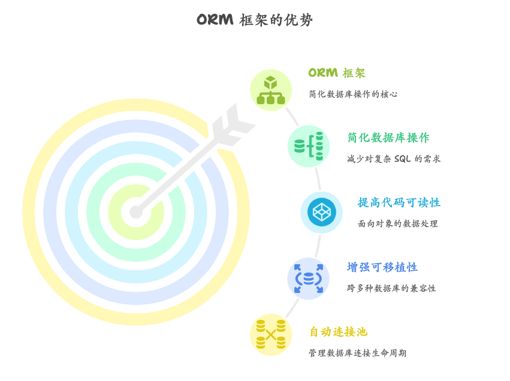
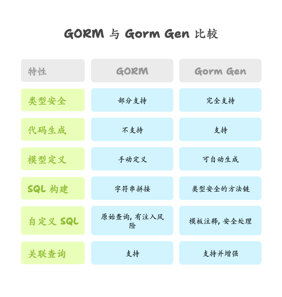
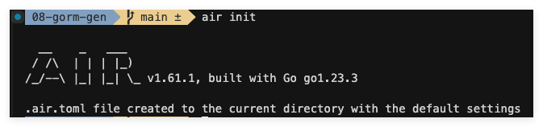
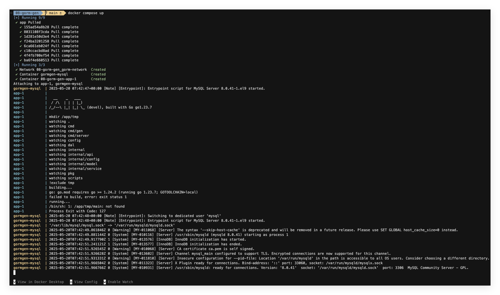
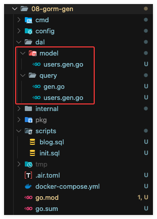

# Gorm Gen 全面指南：从入门到实战

在上一篇文章中，我们详细探讨了 Go 语言中使用 GORM 进行数据库操作的基础知识和核心技巧，让我们了解了如何使用这个流行的 ORM 框架进行数据库交互。然而，在实际的企业级项目开发中，我们常常需要处理更复杂的场景和更高的效率要求。因此，本文作为 Gorm 的下篇，将带领大家深入探索 GORM 生态中的强大工具——Gorm Gen，一款能够显著提高开发效率、增强代码安全性的代码生成工具。

本文适合以下几类读者：

- **技术小白**：对 Go 语言和数据库操作有初步了解，希望学习现代化的 ORM 工具
- **Go 初学者**：已掌握 Go 语言基础，正在寻求更高效的数据库操作方式
- **Go 进阶开发者**：希望了解更深入的 ORM 技术，提升开发效率和代码质量

## 一、Gorm Gen

### 1. Gorm Gen 简介 - 基于 GORM 的安全 ORM 框架

Gorm Gen 是一个基于 GORM 的安全 ORM 框架，其主要通过代码生成方式实现 GORM 代码封装。与传统的 ORM 不同，Gorm Gen 不仅仅是一个数据库操作库，更是一个代码生成工具，它能够根据数据库表结构或定义的模型自动生成类型安全的数据访问代码。

Gorm Gen 在保留了 GORM 所有特性的同时，提供了更加安全、高效的数据库操作方式。它生成的代码类型安全，消除了使用 `interface{}` 导致的潜在类型错误，同时支持复杂的 SQL 查询和各种数据库关系，极大地提升了开发效率和代码质量。

### 2. 开发背景与诞生历程

Gorm Gen 由字节跳动无恒实验室与 GORM 作者（Jinzhu）联合研发，旨在解决企业级项目中使用 GORM 时遇到的一系列问题。在大型项目中，开发者常常需要手动编写大量重复的数据库操作代码，同时由于使用了 `interface{}` 类型和字符串拼接 SQL 查询，导致代码类型不安全、容易出现 SQL 注入等安全问题。

为了解决这些痛点，两个团队共同打造了 Gorm Gen 这一工具，将 GORM 的易用性与代码生成技术相结合，创造了一个能够生成类型安全的 DAO 层代码、自动同步数据库模型结构体、支持自定义 SQL 的安全框架。

### 3. 为什么选择使用 Gorm Gen
Gorm Gen 相比传统 GORM 操作，具有以下几个显著优势：

**自动同步库表，省去繁琐复制** - Gorm Gen 能够根据数据库表结构自动生成对应的 Go 结构体模型，避免了手动编写和维护模型的繁琐工作。即使数据库字段信息发生变化，也可以一键同步，极大提高了开发效率。

**代码一键生成，专注业务逻辑** - 通过一键生成 CRUD 相关的数据库操作代码，开发者可以将更多精力放在业务逻辑实现上，而不是编写重复的数据访问代码。

**字段类型安全，执行 SQL 也安全** - Gorm Gen 生成的代码类型安全，不使用 `interface{}` 类型，消除了类型转换错误的风险。更重要的是，即使是自定义 SQL 查询也不会出现 SQL 注入问题，因为 Gen 会将 SQL 语句进行安全处理。

**查询优雅返回，完美兼容 GORM** - Gorm Gen 生成的 API 使用更加优雅，可以直接返回对应的类型，无需手动定义变量，同时完全兼容 GORM 的所有特性，包括关联查询、事务等高级功能。

Gorm Gen 成功解决了以下痛点：

- 手动编写和维护数据模型与数据库表结构同步的麻烦
- 重复编写 CRUD 操作代码的低效率问题
- 使用 `interface{}` 和字符串拼接 SQL 导致的类型不安全和安全风险
- 复杂查询场景下代码可读性和维护性差的问题

本文将全面介绍 Gorm Gen 的使用方法和最佳实践，从基础概念、环境搭建、基本使用到高级特性、项目实战，循序渐进地带领读者掌握这一强大工具。无论您是刚开始接触 Go 语言和数据库开发，还是有经验的开发者，本文都能为您提供有价值的参考和指导。

## 二、Gorm Gen 基础概念

### 1. 什么是 ORM，什么是代码生成器

#### ORM 的概念与价值

ORM（Object-Relational Mapping，对象关系映射）是一种编程技术，用于将面向对象编程语言中的对象与关系型数据库中的表进行映射。它创建了一个虚拟对象数据库，开发者可以使用编程语言而不是 SQL 语句来操作数据库。

在 Go 语言中，GORM 是最流行的 ORM 框架之一，它提供了简洁的 API 来执行数据库操作，如创建、查询、更新和删除记录。




使用 ORM 的主要优势包括：
- **简化数据库操作**：不需要手写复杂的 SQL 语句
- **提高代码可读性**：使用面向对象的方式处理数据
- **增强可移植性**：一套代码可以适用于多种数据库
- **自动处理连接池**：管理数据库连接的生命周期

#### 代码生成器的作用与意义

代码生成器是一种自动创建源代码的工具，它基于预定义的模板或规则，根据输入数据（如数据库模式、API 规范等）生成符合特定需求的代码。在 ORM 领域，代码生成器通常用于：

- 根据数据库表生成模型（结构体）定义
- 生成数据访问对象（DAO）或存储库（Repository）代码
- 创建标准的 CRUD 操作方法
- 构建查询构造器和特定查询方法

代码生成器的价值在于大幅减少重复性工作，提高开发效率，保持代码质量的一致性，并减少人为错误。

### 2. Gorm Gen 与 GORM 的关系与区别

#### GORM 的特点与局限

GORM 是一个功能齐全的 ORM 库，但在实际使用过程中也存在一些局限性：

- 需要手动定义与数据库表对应的结构体
- 类型不安全的接口设计（如使用 `interface{}`）增加了运行时错误风险
- 自定义复杂 SQL 查询容易引入安全隐患（如 SQL 注入）
- 需要编写大量重复的查询代码

```go
// 使用传统 GORM 的查询示例
var user User
db.Where("name = ?", userName).First(&user)
```

#### Gorm Gen 作为 GORM 的扩展和增强

Gorm Gen 并不是替代 GORM，而是建立在 GORM 基础上的代码生成工具和安全增强层。它通过生成类型安全的代码来扩展 GORM 的功能，同时保持与 GORM 完全兼容。

具体关系如下：

- Gorm Gen 使用 GORM 作为底层实现
- GORM 处理实际的数据库操作
- Gorm Gen 负责生成类型安全的上层 API

```go
// 使用 Gorm Gen 生成的代码查询示例
user, err := query.User.Where(query.User.Name.Eq(userName)).First()
```




### 3. Gorm Gen 核心特性一览

#### 自动同步库表，省去繁琐复制

Gorm Gen 可以连接到数据库，自动读取表结构信息，并生成对应的 Go 结构体模型。这一功能极大简化了模型定义过程：

```go
g := gen.NewGenerator(gen.Config{
    OutPath: "../dal/query",
})

g.UseDB(db) // 传入数据库连接

// 从数据库生成所有表的模型
allModels := g.GenerateAllTable()

// 或者只生成特定表的模型
userModel := g.GenerateModel("users")
```

生成的模型会遵循 GORM 约定，自动包含表字段信息、约束、关联关系等。

#### 代码一键生成，专注业务逻辑

Gorm Gen 不仅可以生成模型定义，还可以生成完整的 CRUD 操作代码，包括：

- 基础的增删改查方法
- 条件查询构建器
- 关联关系处理方法
- 分页、排序等辅助功能

```go
// 为模型生成基本的 CRUD 方法
g.ApplyBasic(userModel)

// 生成更多自定义方法
g.ApplyInterface(func(QueryInterface) {}, userModel)
```

这样，开发者可以直接使用生成的代码，而无需手动编写重复的数据访问逻辑，从而将精力集中在实现业务逻辑上。

#### 字段类型安全，执行 SQL 也安全

Gorm Gen 生成的查询代码是完全类型安全的，这意味着：

- 字段引用是通过结构体成员而非字符串进行的
- 查询条件会根据字段类型进行类型检查
- 方法参数和返回值都具有明确的类型

```go
// 类型安全的查询示例
users, err := query.User.
    Where(query.User.Age.Gt(18)).
    Order(query.User.CreatedAt.Desc()).
    Find()
```

对于自定义 SQL，Gorm Gen 通过模板注释方式支持，同时保证安全：

```go
type Querier interface {
    // SELECT * FROM @@table WHERE id = @id
    FindByID(id int) (gen.T, error)
}
```

#### 查询优雅返回，完美兼容 GORM

Gorm Gen 生成的代码可以直接返回强类型的结果，不需要预先定义变量：

```go
// 传统 GORM
var user User
db.First(&user, 1)

// Gorm Gen
user, err := query.User.First()
```

同时，Gorm Gen 完全兼容 GORM 的所有特性，包括：

- 钩子方法（Before/After Create/Save/Update/Delete/Find）
- 事务支持
- 预加载关联
- 连接池管理
- 数据库迁移等

### 4. Gorm Gen 的架构设计与工作原理

#### 整体架构设计

Gorm Gen 的架构设计主要分为以下几个部分：

1. **配置层**：负责解析和管理代码生成的配置选项
2. **元数据处理层**：负责解析数据库表结构、模型定义
3. **代码生成引擎**：基于模板生成 Go 代码
4. **查询构建层**：生成类型安全的查询 API
5. **GORM 集成层**：与 GORM 无缝集成

#### 代码生成流程

Gorm Gen 的代码生成流程如下：

1. 连接数据库，获取表结构信息
2. 解析表结构，生成内部元数据表示
3. 应用配置选项和自定义逻辑
4. 根据模板生成模型代码和查询代码
5. 输出到指定目录

#### 运行时工作原理

当使用 Gorm Gen 生成的代码时，其工作原理如下：

1. 查询构建：使用生成的查询 API 构建类型安全的查询
2. 转换为 GORM 查询：将类型安全的查询转换为 GORM 可识别的形式
3. 执行查询：使用 GORM 执行实际的数据库操作
4. 结果处理：将查询结果转换为强类型的返回值

```go
// 简化的工作流程示例
users, err := query.User.Where(query.User.Age.Gt(18)).Find()

// 等效于以下 GORM 操作
var users []User
result := db.Where("age > ?", 18).Find(&users)
```

Gorm Gen 巧妙地在 GORM 之上构建了一层类型安全的抽象，同时不牺牲灵活性和性能，这也是它能够快速获得开发者认可的关键所在。

## 三、环境搭建与快速入门

在本节中，我们将基于 Docker 搭建一个完整的 Gorm Gen 开发环境，并遵循 Standard Go Project Layout 创建一个使用 Gin 框架的项目。通过 air 工具实现热加载，提高开发效率。

### 1. 开发环境准备

#### Go 环境安装与配置

首先，我们通过 Docker Compose 快速搭建 Go 开发环境。这种方式无需额外的 Dockerfile，直接使用官方维护的镜像，既简洁又可靠。

项目开发过程中频繁的修改就会频繁的重启服务，这里为了解决这个问题，我们使用 air 工具来使服务热重载！在项目的根目录执行 `air init` 后，项目根目录会自动创建 `.air.toml` 文件，如下图：



配置完热重载配置文件后搭建数据库环境！在项目的根目录创建一个 `docker-compose.yml` 文件，配置 Go 热重载和 MySQL 数据库：

```yaml
services:
  app:
    image: cosmtrek/air
    working_dir: /app
    volumes:
      - .:/app
    ports:
      - "8080:8080"
    depends_on:
      - db
    networks:
      - gorm-network

  db:
    image: mysql:8.0
    container_name: gormgen-mysql
    restart: always
    environment:
      MYSQL_DATABASE: gormgen
      MYSQL_USER: gorm
      MYSQL_PASSWORD: gorm123456
      MYSQL_ROOT_PASSWORD: root123456
    ports:
      - "3306:3306"
    volumes:
      - mysql_data:/var/lib/mysql
      - ./scripts/init.sql:/docker-entrypoint-initdb.d/init.sql
    command: --character-set-server=utf8mb4 --collation-server=utf8mb4_unicode_ci
    networks:
      - gorm-network

volumes:
  mysql_data:
    driver: local

networks:
  gorm-network:
    driver: bridge
```

这个配置使用了 `cosmtrek/air` 官方镜像，其中已经包含了完整的 Go 开发环境和 `air` 热重载工具，无需额外的配置。我们通过环境变量配置了 Go 模块管理和代理设置，并设置了数据库连接信息。

在终端中进入项目的根目录，然后执行 `docker compose up` 命令后，效果如下：



创建 `scripts/init.sql` 文件，用于初始化数据库表：

```sql
CREATE TABLE IF NOT EXISTS users (
    id BIGINT AUTO_INCREMENT PRIMARY KEY,
    name VARCHAR(100) NOT NULL,
    email VARCHAR(100) NOT NULL UNIQUE,
    age INT,
    created_at TIMESTAMP DEFAULT CURRENT_TIMESTAMP,
    updated_at TIMESTAMP DEFAULT CURRENT_TIMESTAMP ON UPDATE CURRENT_TIMESTAMP
);

INSERT INTO users (name, email, age) VALUES 
('张三', 'zhangsan@example.com', 25),
('李四', 'lisi@example.com', 30);
```

### 2. 安装 Gorm Gen

#### 安装命令与依赖包

在项目中安装 Gorm Gen 及其所需依赖。首先创建 Go 模块：

```bash
mkdir -p 08-gorm-gen
cd 08-gorm-gen
go mod init github.com/clin211/08-gorm-gen
```

安装必要的依赖：

```bash
go get -u gorm.io/gorm
go get -u gorm.io/driver/mysql
go get -u gorm.io/gen
go get -u github.com/gin-gonic/gin
```

对于生产环境，建议在 `go.mod` 中指定稳定版本，本项目所使用的版本如下：

```go
require (
	github.com/gin-gonic/gin v1.10.0
	github.com/spf13/viper v1.20.1
	gorm.io/driver/mysql v1.5.7
	gorm.io/gen v0.3.27
	gorm.io/gorm v1.26.1
)
```

### 3. 第一个 Gorm Gen 项目

#### 项目结构搭建

按照 Standard Go Project Layout 标准创建项目结构：

```
.
├── Dockerfile.dev
├── docker-compose.yml
├── go.mod
├── go.sum
├── cmd/
│   ├── gen/
│   │   └── generate.go      # 代码生成入口
│   └── server/
│       └── main.go      # 应用入口
├── internal/
│   ├── api/
│   │   └── user.go      # HTTP handlers
│   ├── config/
│   │   └── config.go    # 配置
│   ├── model/
│   │   └── model.go     # 自定义模型
│   └── service/
│       └── user.go      # 业务逻辑
├── pkg/
│   └── middleware/
│       └── logger.go    # 中间件
├── dal/                 # 将由 Gorm Gen 生成
│   ├── query/           # 查询代码
│   └── model/           # 模型代码
├── scripts/
│   └── init.sql         # 数据库初始化脚本
└── .air.toml            # air 配置文件
```

配置热加载：

```toml
root = "."
testdata_dir = "testdata"
tmp_dir = "tmp"

[build]
  args_bin = []
  bin = "./tmp/main"
  cmd = "go build -o ./tmp/main ./cmd/server/main.go"
  delay = 1000
  exclude_dir = ["assets", "tmp", "vendor", "testdata"]
  exclude_file = []
  exclude_regex = ["_test.go"]
  exclude_unchanged = false
  follow_symlink = false
  full_bin = ""
  include_dir = []
  include_ext = ["go", "tpl", "tmpl", "html"]
  include_file = []
  kill_delay = "0s"
  log = "build-errors.log"
  poll = false
  poll_interval = 0
  post_cmd = []
  pre_cmd = []
  rerun = false
  rerun_delay = 500
  send_interrupt = false
  stop_on_error = false

[color]
  app = ""
  build = "yellow"
  main = "magenta"
  runner = "green"
  watcher = "cyan"

[log]
  main_only = false
  silent = false
  time = false

[misc]
  clean_on_exit = false

[proxy]
  app_port = 0
  enabled = false
  proxy_port = 0

[screen]
  clear_on_rebuild = false
  keep_scroll = true
```

#### 连接数据库配置

在项目根目录创建项目中所需要的配置：

```yml
# 08-gorm-gen/config/config.yml
app:
  port: ":8080"
  mode: "debug"
mysql:
  host: "localhost" # 数据库地址，如果使用 Docker，请使用 "db"
  port: 3306 # 数据库端口
  user: "gorm" # 数据库用户名
  password: "gorm123456" # 数据库密码
  dbname: "gormgen" # 数据库名称
```

创建 `internal/config/config.go` 文件，用于管理数据库连接配置，这里读取配置文件使用 是 `viper`：

```go
package config

import (
	"strings"

	"github.com/spf13/viper"
)

var (
	App   *AppConfig
	MySQL *MySQLConfig
)

type AppConfig struct {
	Port string `mapstructure:"port"`
	Mode string `mapstructure:"mode"`
}

type MySQLConfig struct {
	Host     string `mapstructure:"host"`
	Port     string `mapstructure:"port"`
	User     string `mapstructure:"user"`
	Password string `mapstructure:"password"`
	DBName   string `mapstructure:"dbname"`
}

type Config struct {
	App   AppConfig   `mapstructure:"app"`
	MySQL MySQLConfig `mapstructure:"mysql"`
}

func InitConfig() error {
	viper.AddConfigPath(".")
	viper.SetConfigType("yml")
	viper.SetConfigName("config/config.yml")
	// 替换环境变量 key 中的分隔符 '.' 和 '-' 为 '_'
	replacer := strings.NewReplacer(".", "_", "-", "_")
	viper.SetEnvKeyReplacer(replacer)

	if err := viper.ReadInConfig(); err != nil {
		return err
	}

	var config Config
	if err := viper.Unmarshal(&config); err != nil {
		return err
	}

	App = &config.App
	MySQL = &config.MySQL

	return nil
}
```

Viper 是 Go 语言中流行的配置解决方案，支持从多种来源（如配置文件、环境变量等）读取配置。上面这段代码也是使用的 Viper 库来实现配置管理。主要有以下几点：

1. 定义了两个全局变量，用于在整个应用程序中访问配置：

    ```go
    var (
        App   *AppConfig
        MySQL *MySQLConfig
    )
    ```

2. 定义配置的结构体：
    - `AppConfig`：应用配置，包含端口和运行模式
    - `MySQLConfig`：MySQL 数据库配置，包含连接信息
    - `Config`：组合以上两种配置的主配置结构体

#### 生成模型代码

创建 `cmd/gen/main.go` 文件，用于生成 Gorm Gen 代码：

```go
package main

import (
	"fmt"

	"gorm.io/driver/mysql"
	"gorm.io/gen"
	"gorm.io/gorm"
	"gorm.io/gorm/logger"
)

func main() {
	// 获取数据库配置
	dsn := "gorm:gorm123456@tcp(127.0.0.1:3306)/gormgen?charset=utf8mb4&parseTime=True&loc=Local"

	// 连接数据库
	db, err := gorm.Open(mysql.Open(dsn), &gorm.Config{
		Logger: logger.Default.LogMode(logger.Info),
	})
	if err != nil {
		fmt.Println(`failed to connect database:`, err)
		panic(err)
	}

	// 创建生成器实例
	g := gen.NewGenerator(gen.Config{
		// 输出路径
		OutPath: "./dal/query",
		// 输出模式
		Mode: gen.WithDefaultQuery | gen.WithQueryInterface | gen.WithoutContext,
		// 表字段可为空值时，对应结构体字段使用指针类型
		FieldNullable: true,
		// 生成字段类型标签
		FieldWithTypeTag: true,
		// 生成字段DB标签
		FieldWithIndexTag: true,
	})

	// 使用数据库
	g.UseDB(db)

	// 生成所有表的模型和查询代码
	// 也可以用 g.GenerateModel("users") 指定表
	g.ApplyBasic(g.GenerateAllTable()...)

	// 执行代码生成
	g.Execute()
}
```

#### 实现业务逻辑层

创建 `internal/service/user.go` 文件，封装业务逻辑：

```go
package service

import (
	"context"

	"github.com/clin211/08-gorm-gen/dal/model"
	"github.com/clin211/08-gorm-gen/dal/query"
)

// UserService 用户业务逻辑服务
type UserService struct{}

// NewUserService 创建 UserService 实例
func NewUserService() *UserService {
	return &UserService{}
}

// GetAllUsers 获取所有用户
func (s *UserService) GetAllUsers() (interface{}, error) {
	return query.User.Find()
}

// GetUserByID 根据 ID 获取用户
func (s *UserService) GetUserByID(id int64) (interface{}, error) {
	return query.User.Where(query.User.ID.Eq(id)).First()
}

// CreateUser 创建用户
func (s *UserService) CreateUser(name, email string, age int) (interface{}, error) {
	ageInt := int32(age)
	// 使用 Gorm Gen 创建用户
	user := model.User{
		Name:  name,
		Email: email,
		Age:   &ageInt,
	}

	return user, query.User.WithContext(context.Background()).Create(&user)
}

// UpdateUser 更新用户
func (s *UserService) UpdateUser(id int64, name string, age int) error {
	_, err := query.User.Where(query.User.ID.Eq(id)).
		Updates(map[string]any{
			"Name": name,
			"Age":  int32(age),
		})
	return err
}

// DeleteUser 删除用户
func (s *UserService) DeleteUser(id int64) error {
	_, err := query.User.Where(query.User.ID.Eq(id)).Delete()
	return err
}
```

#### API 层实现

创建 `internal/api/user.go` 文件，封装用户相关 API 处理函数：

```go
package api

import (
	"net/http"
	"strconv"

	"github.com/clin211/08-gorm-gen/internal/service"
	"github.com/gin-gonic/gin"
)

// UserAPI 处理用户相关的 API 请求
type UserAPI struct {
	userService *service.UserService
}

// NewUserAPI 创建 UserAPI 实例
func NewUserAPI(userService *service.UserService) *UserAPI {
	return &UserAPI{userService: userService}
}

// GetUsers 获取所有用户
func (u *UserAPI) GetUsers(c *gin.Context) {
	users, err := u.userService.GetAllUsers()
	if err != nil {
		c.JSON(http.StatusInternalServerError, gin.H{"error": err.Error()})
		return
	}
	c.JSON(http.StatusOK, users)
}

// GetUserByID 根据 ID 获取用户
func (u *UserAPI) GetUserByID(c *gin.Context) {
	idStr := c.Param("id")
	id, err := strconv.ParseInt(idStr, 10, 64)
	if err != nil {
		c.JSON(http.StatusBadRequest, gin.H{"error": "invalid user ID"})
		return
	}

	user, err := u.userService.GetUserByID(id)
	if err != nil {
		c.JSON(http.StatusNotFound, gin.H{"error": "user not found"})
		return
	}

	c.JSON(http.StatusOK, user)
}

// CreateUser 创建用户
func (u *UserAPI) CreateUser(c *gin.Context) {
	var input struct {
		Name  string `json:"name" binding:"required"`
		Email string `json:"email" binding:"required,email"`
		Age   int    `json:"age" binding:"required,gte=0,lte=150"`
	}

	if err := c.ShouldBindJSON(&input); err != nil {
		c.JSON(http.StatusBadRequest, gin.H{"error": err.Error()})
		return
	}

	user, err := u.userService.CreateUser(input.Name, input.Email, input.Age)
	if err != nil {
		c.JSON(http.StatusInternalServerError, gin.H{"error": err.Error()})
		return
	}

	c.JSON(http.StatusCreated, user)
}

// UpdateUser 更新用户
func (u *UserAPI) UpdateUser(c *gin.Context) {
	idStr := c.Param("id")
	id, err := strconv.ParseInt(idStr, 10, 64)
	if err != nil {
		c.JSON(http.StatusBadRequest, gin.H{"error": "invalid user ID"})
		return
	}

	var input struct {
		Name string `json:"name"`
		Age  int    `json:"age" binding:"gte=0,lte=150"`
	}

	if err := c.ShouldBindJSON(&input); err != nil {
		c.JSON(http.StatusBadRequest, gin.H{"error": err.Error()})
		return
	}

	if err := u.userService.UpdateUser(id, input.Name, input.Age); err != nil {
		c.JSON(http.StatusInternalServerError, gin.H{"error": err.Error()})
		return
	}

	c.Status(http.StatusOK)
}

// DeleteUser 删除用户
func (u *UserAPI) DeleteUser(c *gin.Context) {
	idStr := c.Param("id")
	id, err := strconv.ParseInt(idStr, 10, 64)
	if err != nil {
		c.JSON(http.StatusBadRequest, gin.H{"error": "invalid user ID"})
		return
	}

	if err := u.userService.DeleteUser(id); err != nil {
		c.JSON(http.StatusInternalServerError, gin.H{"error": err.Error()})
		return
	}

	c.Status(http.StatusNoContent)
}
```

#### 主程序入口

创建 `cmd/server/main.go` 文件，设置路由并启动服务：

```go
package main

import (
	"fmt"

	"github.com/clin211/08-gorm-gen/dal/query"
	"github.com/clin211/08-gorm-gen/internal/api"
	"github.com/clin211/08-gorm-gen/internal/config"
	"github.com/clin211/08-gorm-gen/internal/service"
	"github.com/gin-gonic/gin"
	"gorm.io/driver/mysql"
	"gorm.io/gorm"
	"gorm.io/gorm/logger"
)

func main() {
	if err := config.InitConfig(); err != nil {
		fmt.Println("failed to init config:", err)
		panic(err)
	}

	_, err := initDB()
	if err != nil {
		fmt.Println("failed to connect database:", err)
		panic(err)
	}

	r := gin.New()
	r.Use(gin.Recovery())

	r.GET("/ping", func(c *gin.Context) {
		c.JSON(200, gin.H{
			"message": "pong",
		})
	})

	userService := service.NewUserService()
	userAPI := api.NewUserAPI(userService)

	// 定义 API 路由
	v1 := r.Group("/api/v1")
	{
		users := v1.Group("/users")
		{
			users.GET("", userAPI.GetUsers)
			users.GET("/:id", userAPI.GetUserByID)
			users.POST("", userAPI.CreateUser)
			users.PUT("/:id", userAPI.UpdateUser)
			users.DELETE("/:id", userAPI.DeleteUser)
		}
	}

	r.Run(config.App.Port)
}

func initDB() (*gorm.DB, error) {
	dsn := fmt.Sprintf("%s:%s@tcp(%s:%s)/%s?charset=utf8mb4&parseTime=True&loc=Local",
		config.MySQL.User,
		config.MySQL.Password,
		config.MySQL.Host,
		config.MySQL.Port,
		config.MySQL.DBName,
	)
	db, err := gorm.Open(mysql.Open(dsn), &gorm.Config{
		Logger: logger.Default.LogMode(logger.Info),
	})

	// 设置 Gorm Gen 使用的默认数据库
	query.SetDefault(db)

	return db, err
}
```

### 4. 启动与测试项目

首先，生成 Gorm Gen 代码：

```bash
# 在 Docker 容器中执行
docker-compose up -d  # 启动 MySQL 服务
```
服务启动成功后，在项目的根目录下运行 `go run cmd/gen/generate.go` 命令，这将在 `dal` 目录下生成 `query` 和 `model` 子目录，包含生成的模型和查询代码。



接着项目的根目录中运行命令 `air`，这会启动开发服务器并启用热加载，每次代码修改后服务会自动重新编译。

服务启动成功后，通过 curl 或浏览器测试 API 接口：

```bash
# 获取所有用户
curl http://localhost:8080/api/v1/users

# 获取指定用户（假设 ID 为 1）
curl http://localhost:8080/api/v1/users/1

# 创建用户
curl -X POST http://localhost:8080/api/v1/users \
  -H "Content-Type: application/json" \
  -d '{"name":"王五","email":"wangwu@example.com","age":35}'

# 更新用户
curl -X PUT http://localhost:8080/api/v1/users/1 \
  -H "Content-Type: application/json" \
  -d '{"name":"张三 (已更新)","age":26}'

# 删除用户(删除上面请求添加的王五)
curl -X DELETE http://localhost:8080/api/v1/users/4
```

通过以上步骤，我们已经基于 Docker、air 热加载并基于 Standard Go Project Layout 风格使用 Gin 框架搭建了一个完整的 Gorm Gen 开发环境，并创建了一个包含完整 CRUD 功能的用户管理 API 示例项目。

> 上面所有代码都在 [https://github.com/clin211/gin-learn/commit/7882fc7d696eb9389ac159c0f72d7de9cddddd76](https://github.com/clin211/gin-learn/commit/7882fc7d696eb9389ac159c0f72d7de9cddddd76) commit 上！