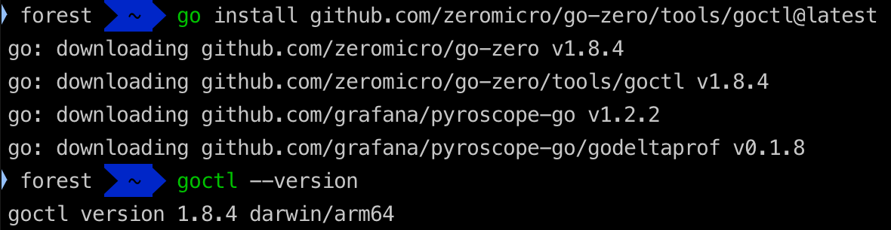
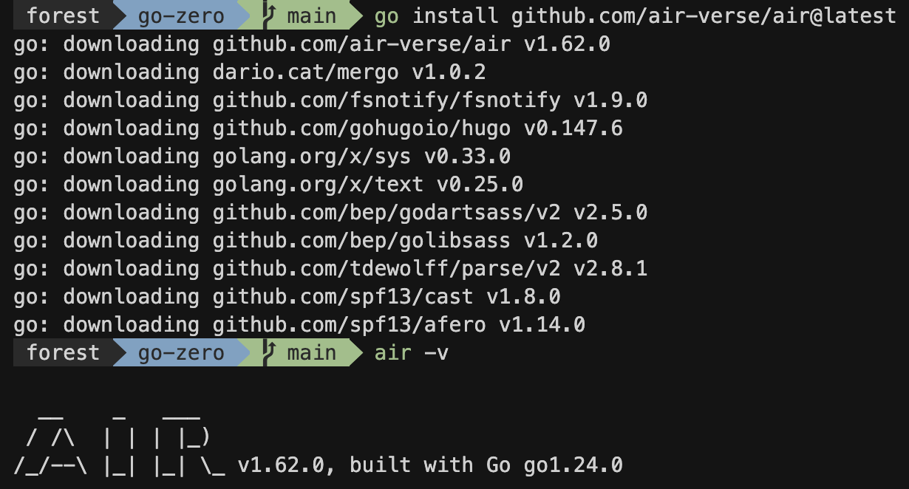
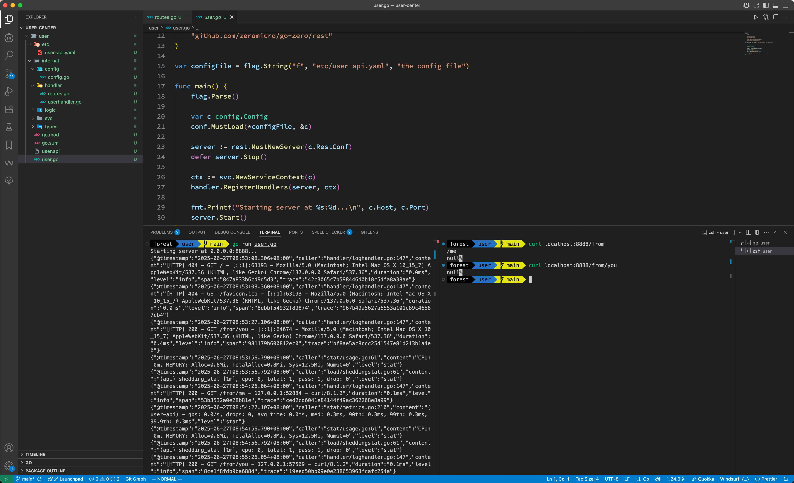
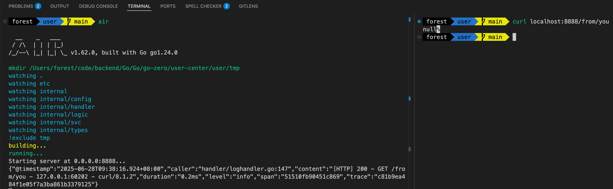
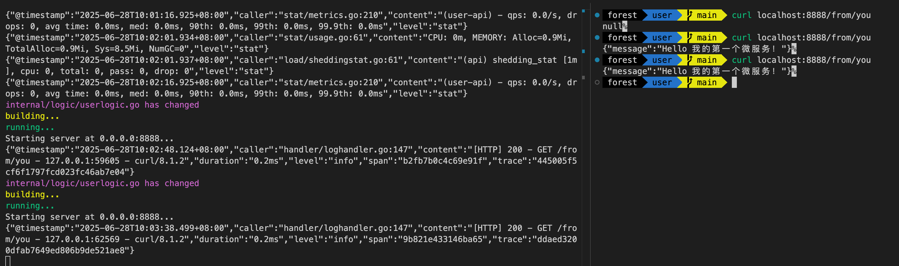
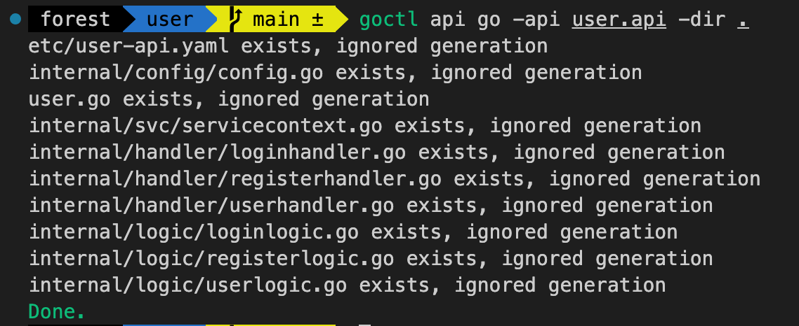
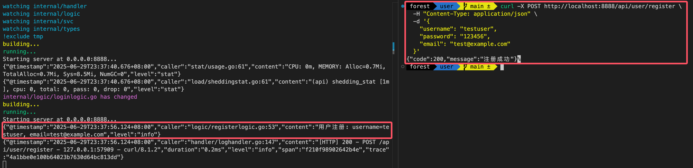
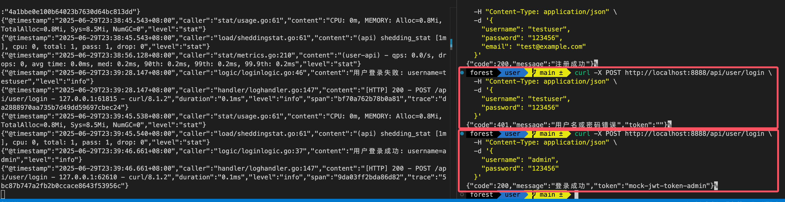
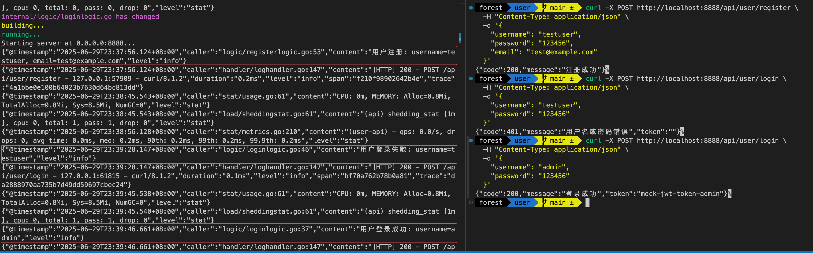

## 一、开篇引入

### 1. 微服务时代的到来

还记得小时候搭积木吗？我们总是先搭一个大房子，然后发现要改个窗户，整个房子都得拆掉重建。软件开发也是如此！

#### 为什么需要微服务？

想象一下你正在经营一家购物场所：

**传统单体应用就像一个大超市**：

- 所有功能都挤在一个巨大的建筑里
- 生鲜区、服装区、电器区、收银台全部混在一起
- 如果收银系统坏了，整个超市都得关门
- 想要装修电器区？对不起，整个超市都要停业
- 所有员工都在同一个管理体系下，协调困难

**微服务架构就像一个购物中心**：

- 每个店铺都是独立的：服装店、电器店、餐厅、电影厅
- 服装店装修时，电器店照常营业
- 每个店铺可以独立选择装修风格和营业时间
- 各店铺有自己的团队，专业化管理更高效
- 某个店铺出问题，不会影响整个购物中心的运营

#### 传统单体 vs 微服务架构

| 特性        | 传统单体应用       | 微服务架构                 |
| ----------- | ------------------ | -------------------------- |
| 📦 部署方式 | 一次性部署整个应用 | 各服务独立部署             |
| 🔧 技术选型 | 统一技术栈         | 每个服务可选择最适合的技术 |
| 👥 团队协作 | 多人修改同一代码库 | 团队专注各自服务           |
| 📈 扩展性   | 整体扩展           | 按需扩展特定服务           |
| 🛠️ 维护成本 | 改动影响全局       | 服务间相对独立             |

#### 小白也能轻松上手微服务开发

你可能会想："微服务听起来很复杂，我一个小白能搞定吗？"

答案是：**绝对可以！**

现在有了 go-zero 这样的框架，微服务开发变得像搭积木一样简单。你不需要：

- ❌ 深度理解复杂的分布式理论
- ❌ 手动配置繁琐的服务发现
- ❌ 从零开始搭建整套微服务架构

你只需要：

- ✅ 学会使用 go-zero 的工具
- ✅ 按照最佳实践编写业务代码
- ✅ 跟着教程一步步实践

### 2. 初识go-zero

#### go-zero是什么？

**一句话概括**：go-zero 是一个集成了各种工程实践的 web 和 rpc 框架，让你能够快速构建弹性设计的微服务。

简单来说，它就是一个**微服务开发的瑞士军刀**🔧，帮你解决微服务开发中的各种问题。

#### 为什么选择go-zero？

**1. 开发效率超高**

```bash
# 一行命令生成完整的API服务
goctl api new user-service

# 一行命令生成数据库操作代码
goctl model mysql datasource -url="user:password@tcp(localhost:3306)/database" -table="users" -dir="."
```

**2. 生产级别的稳定性**

- 内置熔断器、限流器、负载均衡
- 自动服务发现与注册
- 完善的链路追踪和监控
- 这些复杂的功能，go-zero 都帮你做好了！

**3. 学习成本低**

- 约定大于配置，遵循最佳实践
- 详细的文档和丰富的示例
- 活跃的社区支持

#### 今天我们要实现什么？

在这篇文章结束时，你将明白**一个完整的登录注册用户微服务**的构建过程：

```bash
# 用户注册
curl -X POST http://localhost:8888/api/user/register \
  -H "Content-Type: application/json" \
  -d '{"username":"clin","password":"123456","email":"clin@example.com"}'

# 响应结果
{
  "code": 200,
  "message": "注册成功"
}

# 用户登录
curl -X POST http://localhost:8888/api/user/login \
  -H "Content-Type: application/json" \
  -d '{"username":"admin","password":"123456"}'

# 响应结果
{
  "code": 200,
  "message": "登录成功",
  "data": {
     "token": "mock-jwt-token"
  }
}
```

**现代化的开发体验**：

- 代码修改后自动重启服务（热重载）
- 清晰的项目结构和代码分层
- 完善的错误处理和参数验证

**实实在在的收获**：

- 理解微服务的基本概念
- 掌握go-zero的核心使用方法
- 学会现代化的Go开发工作流
- 为后续深入学习打下坚实基础

### 准备好了吗？

不要担心，我们会一步一步来。即使你是编程小白，只要跟着教程走，很快你就能看到自己的第一个微服务在运行！

让我们开始这个激动人心的微服务之旅吧！冲冲冲🚀

## 二、环境准备

俗话说"工欲善其事，必先利其器"。在开始我们的 go-zero 微服务之旅前，让我们先把开发环境搭建好。

### 1. 前置条件检查

#### Go语言环境验证

首先，我们需要确保Go语言已经正确安装在你的系统上。

**检查Go是否已安装：**

```bash
go version
go version go1.24.0 darwin/arm64 # 或类似的版本信息
```

如果看到类似上面的输出，恭喜你！Go语言环境已经准备就绪。如果出现"command not found"错误，说明你需要先安装Go语言。

> 小提示：推荐使用Go 1.19或更高版本，以获得最佳的go-zero开发体验。

#### 常见环境问题排查

**问题1：Go命令无法识别**

```bash
# 如果遇到这个错误：
bash: go: command not found
```

**解决方案：**

- 确认Go语言已正确安装
- 检查PATH环境变量是否包含Go的bin目录
- 重新打开终端窗口

**问题2：网络连接问题**

```bash
# 如果遇到网络相关错误，可设置Go代理：
go env -w GOPROXY=https://goproxy.cn,direct
```

**问题3：权限问题（主要在Linux/macOS）**

```bash
# 如果遇到权限错误，确保当前用户有相应目录的写权限
# 或使用sudo命令（不推荐）
```

### 2. go-zero安装

现在让我们安装go-zero的核心工具——goctl。这个工具就像一个智能助手，能帮我们快速生成项目骨架和代码。

#### 安装goctl工具

**一键安装命令：**

```bash
go install github.com/zeromicro/go-zero/tools/goctl@latest
```



**安装过程详细说明：**

1. **命令解析**：
    - `go install`：Go语言的包安装命令
    - `@latest`：安装最新版本
    - 这个过程会自动下载、编译并安装goctl工具

2. **安装位置**：
    - 工具会被安装到`$GOPATH/bin`或`$GOBIN`目录
    - 通常是`~/go/bin`目录

#### 验证安装是否成功

**检查goctl是否安装成功：**

```bash
goctl --version
```

**预期输出：**

```bash
goctl version 1.8.4 darwin/arm64
```

**如果看到版本信息，说明安装成功！** 🎉

#### 可能遇到的问题及解决方案

**问题1：goctl命令无法识别**

```bash
bash: goctl: command not found
```

**解决方案：**

```bash
# 1. 检查Go的bin目录是否在PATH中
echo $PATH

# 2. 找到Go的安装目录
go env GOPATH

# 3. 手动添加到PATH（临时解决）
export PATH=$PATH:$(go env GOPATH)/bin

# 4. 永久解决：将上述export命令添加到~/.bashrc或~/.zshrc文件中
```

**问题2：网络下载失败**

```bash
# 使用代理重试
go env -w GOPROXY=https://goproxy.cn,direct
go install github.com/zeromicro/go-zero/tools/goctl@latest
```

**问题3：权限不足**

```bash
# 确保有写入权限到Go的bin目录
# 或者设置自定义的GOBIN目录
mkdir -p ~/mygo/bin
export GOBIN=~/mygo/bin
export PATH=$PATH:$GOBIN
```

### 3. 开发工具准备

选择一个好的开发工具就像选择一辆好车，能让你的开发旅程更加顺畅。

#### 推荐的IDE/编辑器配置

- Visual Studio Code

    

    VS Code是目前最受欢迎的Go开发工具，免费且功能强大。

    **安装步骤：**
    1. 访问 <https://code.visualstudio.com/>
    2. 下载适合你系统的版本
    3. 按照向导完成安装

- 次选：[GoLand](https://www.jetbrains.com/go/)

    

    JetBrains 出品的专业Go IDE，功能更强大但需要付费（学生可免费）。

- 备选：Vim/Neovim

    适合喜欢命令行操作的开发者。

#### 必要的插件安装

**对于VS Code用户，这些插件必不可少：**

1. **Go插件**

    
    - 插件名称：Go (Google官方)
    - 功能：语法高亮、自动完成、调试支持
    - 安装：在VS Code扩展商店搜索"Go"

2. **其他推荐插件：**

    ```text
    - Go Outliner: 代码结构预览
    - Go Test Explorer: 测试用例管理
    - Thunder Client: API测试工具（替代Postman）
    - GitLens: Git历史查看
    - Bracket Pair Colorizer: 括号匹配着色
    ```

**配置Go插件：**

```bash
# 打开VS Code后，按Ctrl+Shift+P（或Cmd+Shift+P），输入：
Go: Install/Update Tools

# 选择所有工具进行安装
```

#### 项目目录结构预览

让我们提前了解一下使用go-zero创建的项目是什么样子的：

```text
user-center/                   # 项目根目录
├── user-api/                  # API服务目录
│   ├── etc/                   # 配置文件目录
│   │   └── user-api.yaml      # 服务配置文件
│   ├── internal/              # 内部代码目录
│   │   ├── handler/           # HTTP请求处理器
│   │   ├── logic/             # 业务逻辑层
│   │   ├── svc/               # 服务上下文
│   │   └── types/             # 数据类型定义
│   ├── user-api.api           # API定义文件
│   ├── user-api.go            # 主程序入口
│   └── go.mod                 # Go模块文件
└── README.md                  # 项目说明文档
```

**目录职责说明：**

- `etc/`：存放配置文件，如数据库连接、端口设置等
- `handler/`：处理HTTP请求，类似于其他框架的Controller
- `logic/`：业务逻辑实现，这里是我们主要编写代码的地方
- `svc/`：服务依赖管理，如数据库连接等
- `types/`：数据结构定义，请求和响应的数据格式

### 4. 开发效率提升工具

最后，让我们安装一个能够大大提升开发效率的神器——Air热重载工具！

#### 安装Air热重载工具

**一键安装：**

```bash
go install github.com/air-verse/air@latest
# 安装后查看版本验证是否安装成功
air -v
```

效果如下：


#### Air工具的作用和优势

**什么是热重载？**

传统开发流程：

```text
修改代码 → 保存保存 → 停止服务 → 重新编译 → 启动服务 → 测试
```

热重载开发流程：

```text
修改代码 → 保存代码 → 自动重新编译和重启 → 直接测试
```

**Air的强大功能：**

1. **文件监控**：自动监控Go文件的变化
2. **智能重编译**：只在必要时重新编译
3. **快速重启**：毫秒级别的服务重启
4. **彩色输出**：美观的日志显示
5. **自定义配置**：可以配置监控的文件类型和目录

#### 配置文件的基本设置

我们稍后会在项目中创建`.air.toml`配置文件，这里先了解一下基本配置：

```toml
  # Air 热重载工具的配置文件，使用 TOML 格式

  # 工作目录
  # 使用 . 或绝对路径，请注意后续目录必须在 root 目录下
  root = "."
  tmp_dir = "tmp"

  [build]
  # 每次构建前执行的命令数组
  pre_cmd = ["echo 'hello air' > pre_cmd.txt"]
  # 普通的 shell 命令，也可以使用 `make`
  cmd = "go build -o ./tmp/main ."
  # 按下 Ctrl+C 后执行的命令数组
  post_cmd = ["echo 'hello air' > post_cmd.txt"]
  # 由 `cmd` 命令生成的二进制文件
  bin = "tmp/main"
  # 自定义二进制文件，可以在运行应用时设置环境变量
  full_bin = "APP_ENV=dev APP_USER=air ./tmp/main"
  # 运行二进制文件时的额外参数，将运行 './tmp/main hello world'
  args_bin = ["hello", "world"]
  # 监视这些文件扩展名
  include_ext = ["go", "tpl", "tmpl", "html"]
  # 忽略这些文件扩展名或目录
  exclude_dir = ["assets", "tmp", "vendor", "frontend/node_modules"]
  # 如果指定了，监视这些目录
  include_dir = []
  # 监视这些文件
  include_file = []
  # 排除这些文件
  exclude_file = []
  # 排除特定的正则表达式
  exclude_regex = ["_test\\.go"]
  # 排除未更改的文件
  exclude_unchanged = true
  # 对目录启用符号链接跟踪
  follow_symlink = true
  # 日志文件，放置在你的 tmp_dir 中
  log = "air.log"
  # 使用轮询方式检查文件变化，而不是使用 fsnotify
  poll = false
  # 轮询间隔（默认最小间隔为 500ms）
  poll_interval = 500 # 毫秒
  # 如果文件变化过于频繁，没有必要每次都触发构建
  delay = 0 # 毫秒
  # 当构建错误发生时停止运行旧的二进制文件
  stop_on_error = true
  # 在杀死进程前发送中断信号（Windows 不支持此功能）
  send_interrupt = false
  # 发送中断信号后的延迟时间
  kill_delay = 500 # 纳秒
  # 是否重新运行二进制文件
  rerun = false
  # 每次执行后的延迟时间
  rerun_delay = 500

  [log]
  # 显示日志时间
  time = false
  # 只显示主日志（静默 watcher、build、runner）
  main_only = false
  # 静默 air 产生的所有日志
  silent = false

  [color]
  # 自定义各部分的颜色，如果没有找到颜色，使用原始应用日志
  main = "magenta"
  watcher = "cyan"
  build = "yellow"
  runner = "green"

  [misc]
  # 退出时删除临时目录
  clean_on_exit = true

  [screen]
  # 重新构建时清屏
  clear_on_rebuild = true
  # 保持滚动
  keep_scroll = true

  [proxy]
  # 在浏览器中启用实时重载
  enabled = true
  proxy_port = 8090
  app_port = 8080
```

你的go-zero开发环境已经完全准备就绪！现在我们可以开始创建第一个微服务项目了。

## 三、快速上手

### 创建项目骨架

```bash
# 创建user-center项目
mkdir user-center && cd user-center

# 生成API服务
goctl api new user
```

项目创建好之后，在 vscode（使用自己顺手的工具都 OK） 中打开，如下：



### 项目结构解析

```text
user/
├── etc/                    # 配置文件目录
│   └── user-api.yaml      # 服务配置文件
├── internal/              # 内部代码目录（外部无法访问）
│   ├── config/            # 配置结构定义
│   │   └── config.go      # 配置结构体
│   ├── handler/           # HTTP请求处理器目录
│   │   ├── routes.go      # 路由注册
│   │   └── userhandler.go # 用户相关处理器
│   ├── logic/             # 业务逻辑目录
│   │   └── userlogic.go   # 用户相关业务逻辑
│   ├── svc/               # 服务上下文目录
│   │   └── servicecontext.go # 服务依赖管理
│   └── types/             # 数据类型定义目录
│       └── types.go       # 请求/响应数据结构
├── user-api.api          # API定义文件（DSL）
├── user-api.go           # 主程序入口
└── go.mod                # Go模块依赖文件
```

#### **目录职责详解**

让我用通俗的比喻来解释每个目录的作用：

- `etc/` - 配置中心

    ```text
    这里就像商店的"营业须知"，包含：
    - 服务监听的端口（店铺地址）
    - 数据库连接信息（仓库地址）
    - 其他运行参数（营业规则）
    ```

- `internal/` - 核心业务区

    ```text
    这是我们的"后厨"，外人不能进入，包含五个重要区域：
    ```

    1. `config/` - 配置管理中心

        ```text
        负责管理服务的配置结构
        定义配置文件的数据格式
        确保配置的类型安全和验证
        ```

    2. `handler/` - 接待员

        ```text
        负责接待客户（HTTP请求）
        检查客户需求是否合理
        将需求转交给业务部门处理
        ```

    3. `logic/` - 业务部门

        ```text
        这里是真正干活的地方
        处理具体的业务逻辑
        比如用户注册、登录的核心流程
        ```

    4. `svc/` - 后勤部门

        ```text
        管理各种资源和依赖
        比如数据库连接、外部API调用
        为业务部门提供基础服务
        ```

    5. `types/` - 标准制定部门

        ```text
        定义数据格式标准
        规定请求和响应的数据结构
        确保数据传输的一致性
        ```

- `user-api.api` - 合同文档

    ```text
    这是我们的"服务合同"
    定义了提供哪些API接口
    客户端和服务端都要遵守这个约定
    ```

- `user-api.go` - 总经理

    ```text
    程序的入口点
    负责启动整个服务
    协调各个部门的工作
    ```

#### go-zero的分层架构思想

go-zero 采用了清晰的分层架构，数据流向如下：

```text
配置文件(etc/) → Config（配置结构） → ServiceContext（依赖管理）
                                        ↓
客户端请求 → Handler（接待） → Logic（业务处理） → 返回响应
              ↓                    ↑
           Types（数据验证）    Types（数据封装）
```

**各层职责：**

- **Config层**：管理配置结构，确保配置的类型安全
- **ServiceContext层**：初始化和管理所有依赖资源
- **Handler层**：处理HTTP请求，参数验证和路由分发
- **Logic层**：实现核心业务逻辑，与外部服务交互
- **Types层**：定义数据结构，确保类型安全

**这种设计的好处：**

- 职责分明：每层只负责自己的事情
- 易于测试：可以单独测试每一层
- 易于扩展：新增功能只需要在对应层添加代码
- 团队协作：不同开发者可以专注不同层的开发
- 配置管理：配置变更无需修改业务代码

### 配置热重载环境

在 user 目录下，执行 `air init` 命令，创建 .air.toml 配置，然后调整 cmd 配置项，调整后的配置如下：

```toml
# Air 热重载工具的配置文件，针对 go-zero 项目优化

# 工作目录
root = "."
tmp_dir = "tmp"

[build]
  # 构建命令：编译我们的 user 服务
  cmd = "go build -o ./tmp/main ./user.go"
  # 生成的二进制文件
  bin = "tmp/main"
  # 运行命令：启动服务并指定配置文件
  full_bin = "./tmp/main -f etc/user-api.yaml"
  # 监视这些文件类型的变化
  include_ext = ["go", "yaml", "yml", "toml"]
  # 忽略这些目录
  exclude_dir = ["tmp", "vendor", ".git"]
  # 排除测试文件
  exclude_regex = ["_test\\.go"]
  # 当文件变化时立即重建
  delay = 1000
  # 构建错误时停止旧进程
  stop_on_error = true

[log]
  # 不显示时间戳，让日志更清爽
  time = false

[color]
  # 彩色输出，让日志更美观
  main = "magenta"
  watcher = "cyan"
  build = "yellow"
  runner = "green"

[misc]
  # 退出时清理临时文件
  clean_on_exit = true
```

**为什么要这样配置？**

- `cmd`：告诉 Air 如何编译我们的项目
- `full_bin`：告诉 Air 如何启动我们的服务，`-f etc/user-api.yaml` 指定配置文件
- `include_ext`：监视 Go 代码和配置文件的变化
- `exclude_regex`：忽略测试文件，避免无意义的重启
- `delay`：设置1秒延迟，避免频繁重启

### 第一次运行

```bash
cd user && go mod tidy

# 方式一：传统启动方式
go run user-api.go -f etc/user-api.yaml

# 方式二：热重载启动方式（推荐开发时使用）
air
```

#### **方式一：传统启动方式**

```bash
go run user-api.go -f etc/user-api.yaml
```

你会看到类似这样的输出：

```bash
Starting server at 0.0.0.0:8888...
```

这说明服务已经成功启动，监听在 8888 端口！

测试一下：

```bash
# 打开新的终端窗口，测试服务是否正常
curl http://localhost:8888/from/you
```

应该会返回，正常情况下会返回一个 `null`。按 `Ctrl+C` 停止服务。

#### **方式二：热重载启动方式（推荐）**

现在让我们体验热重载的威力：

```bash
air
```

效果如下：



#### 热重载的优势体验

让我们体验一下热重载的效果！

**1. 修改响应消息**

打开 `internal/logic/userlogic.go` 文件，找到类似这样的代码：

```go diff
func (l *UserLogic) User(req *types.Request) (resp *types.Response, err error) {
    return
}
```

将消息改为：

```go
func (l *UserLogic) User(req *types.Request) (resp *types.Response, err error) {
	return &types.Response{
		Message: "Hello 我的第一个微服务！",
	}, nil
}
```

**保存文件后，观察终端：**

```bash
building...
running...

Starting server at 0.0.0.0:8888...
```

如下图：



> 上面所有代码可以在 <https://github.com/clin211/Go/commit/8a085129c43f14b701a41ccff168555fe4dbd931> 查看！

## 四、实战：用户注册登录

> 通过实际功能让我们了解完整的开发流程

### 开发流程蓝图

在开始编码之前，让我们先了解一下完整的开发步骤，这样我们就有了清晰的路线图：

1️⃣ 定义API接口 → 设计接口结构和路由
2️⃣ 生成代码骨架 → 使用goctl自动生成框架代码  
3️⃣ 实现业务逻辑 → 编写注册和登录的具体逻辑
4️⃣ 测试验证功能 → 使用curl测试接口是否正常

**开发思路：**

- **先设计，后实现**：通过 API 定义文件明确接口契约
- **自动生成骨架**：利用 go-zero 的代码生成能力
- **专注业务逻辑**：框架代码自动生成，我们只需关注核心业务
- **快速验证**：通过API测试确保功能正常

现在让我们按照这个开发步骤开始实战开发！

### 定义API接口

现在我们要在现有的基础上添加用户注册和登录功能。首先修改 `user.api` 文件，定义我们的API接口。

```api
syntax = "v1"

type Request {
 Name string `path:"name,options=you|me"`
}

type Response {
 Message string `json:"message"`
}

// 注册
type RegisterReq {
 Username string `json:"username"`
 Password string `json:"password"`
 Email    string `json:"email"`
}

type RegisterRes {
 Code    int    `json:"code"`
 Message string `json:"message"`
}

// 登录
type LoginReq {
 Username string `json:"username"`
 Password string `json:"password"`
}

type LoginRes {
 Code    int    `json:"code"`
 Message string `json:"message"`
 Token   string `json:"token"`
}

service user-api {
 @handler UserHandler
 get /from/:name (Request) returns (Response)

 @handler Register
 post /api/user/register (RegisterReq) returns (RegisterRes)

 @handler login
 post /api/user/login (LoginReq) returns (LoginRes)
}


```

**API语法说明：**

- `type` 定义数据结构，包括请求和响应的格式
- `service` 定义服务名称和路由
- `@handler` 指定处理器名称
- `post` 表示HTTP POST请求
- `(RequestType) returns (ResponseType)` 定义输入输出类型

### 生成代码

修改完API定义后，使用goctl重新生成代码：

```bash
# 在user目录下执行
goctl api go -api user.api -dir .
```

执行后，你会看到goctl自动为我们生成了新的 `handler` 和 `logic` 文件：



### 实现业务逻辑

现在我们需要实现具体的业务逻辑。

#### 1. 实现注册逻辑

打开 `internal/logic/registerlogic.go` 文件，实现注册功能：

```go
func (l *RegisterLogic) Register(req *types.RegisterReq) (resp *types.RegisterRes, err error) {
	// 参数验证
	if req.Username == "" {
		return &types.RegisterRes{
			Code:    400,
			Message: "用户名不能为空",
		}, nil
	}

	if req.Password == "" {
		return &types.RegisterRes{
			Code:    400,
			Message: "密码不能为空",
		}, nil
	}

	if req.Email == "" {
		return &types.RegisterRes{
			Code:    400,
			Message: "邮箱不能为空",
		}, nil
	}

	// 这里可以添加更多验证逻辑
	// 比如检查用户名是否已存在、密码强度等

	// 模拟注册成功
	logx.Infof("用户注册: username=%s, email=%s", req.Username, req.Email)

	return &types.RegisterRes{
		Code:    200,
		Message: "注册成功",
	}, nil
}
```

#### 2. 实现登录逻辑

打开 `internal/logic/loginlogic.go` 文件，实现登录功能：

```go
func (l *LoginLogic) Login(req *types.LoginReq) (resp *types.LoginRes, err error) {
	// 参数验证
	if req.Username == "" || req.Password == "" {
		return &types.LoginRes{
			Code:    400,
			Message: "用户名和密码不能为空",
		}, nil
	}

	// 简单的用户验证（实际项目中应该查询数据库）
	if req.Username == "admin" && req.Password == "123456" {
		logx.Infof("用户登录成功: username=%s", req.Username)
		return &types.LoginRes{
			Code:    200,
			Message: "登录成功",
			Token:   "mock-jwt-token-" + req.Username,
		}, nil
	}

	// 登录失败
	logx.Infof("用户登录失败: username=%s", req.Username)
	return &types.LoginRes{
		Code:    401,
		Message: "用户名或密码错误",
	}, nil
}
```

保存文件后，如果你正在使用 `air` 运行服务，会看到服务自动重启：

```text
....
building...
running...
Starting server at 0.0.0.0:8888...
```

## 五、测试验证

### 测试API接口

现在我们可以测试刚刚实现的功能了。可以使用 postman 或者 apifox 等工具，也可以是 curl 工具在终端中请求，下面就演示一下再终端中使用 curl 来请求接口。

#### 1. 测试用户注册

```bash
curl -X POST http://localhost:8888/api/user/register \
  -H "Content-Type: application/json" \
  -d '{
    "username": "testuser",
    "password": "123456",
    "email": "test@example.com"
  }'
```

预期响应：

```json
{
    "code": 200,
    "msg": "注册成功"
}
```

效果如下：



#### 2. 测试用户登录

```bash
# 正确的用户名密码
curl -X POST http://localhost:8888/api/user/login \
  -H "Content-Type: application/json" \
  -d '{
    "username": "admin",
    "password": "123456"
  }'
```

预期响应：

```json
{
    "code": 200,
    "msg": "登录成功",
    "token": "mock-jwt-token-admin"
}
```

效果如下：



> 图中也是用了上面 testuser 的账户登录，为什么会报错呢？是因为上面注册的信息没有保存起来，后面可以使用数据库保存起来，然后将整个功能连通！

### 查看日志输出

在终端中，你会看到我们添加的日志信息：

```text
{"@timestamp":"2025-06-29T23:37:56.124+08:00","caller":"logic/registerlogic.go:53","content":"用户注册: username=testuser, email=test@example.com","level":"info"}
{"@timestamp":"2025-06-29T23:37:56.124+08:00","caller":"handler/loghandler.go:147","content":"[HTTP] 200 - POST /api/user/register - 127.0.0.1:57909 - curl/8.1.2","duration":"0.2ms","level":"info","span":"f210f98902642b4e","trace":"4a1bbe0e100b64023b7630d64bc813dd"}
{"@timestamp":"2025-06-29T23:38:45.543+08:00","caller":"stat/usage.go:61","content":"CPU: 0m, MEMORY: Alloc=0.8Mi, TotalAlloc=0.8Mi, Sys=8.5Mi, NumGC=0","level":"stat"}
{"@timestamp":"2025-06-29T23:38:45.543+08:00","caller":"load/sheddingstat.go:61","content":"(api) shedding_stat [1m], cpu: 0, total: 1, pass: 1, drop: 0","level":"stat"}
{"@timestamp":"2025-06-29T23:38:56.128+08:00","caller":"stat/metrics.go:210","content":"(user-api) - qps: 0.0/s, drops: 0, avg time: 0.0ms, med: 0.2ms, 90th: 0.2ms, 99th: 0.2ms, 99.9th: 0.2ms","level":"stat"}
{"@timestamp":"2025-06-29T23:39:28.147+08:00","caller":"logic/loginlogic.go:46","content":"用户登录失败: username=testuser","level":"info"}
{"@timestamp":"2025-06-29T23:39:28.147+08:00","caller":"handler/loghandler.go:147","content":"[HTTP] 200 - POST /api/user/login - 127.0.0.1:61815 - curl/8.1.2","duration":"0.1ms","level":"info","span":"bf70a762b78b0a81","trace":"da2888970aa735b7d49dd59697cbec24"}
{"@timestamp":"2025-06-29T23:39:45.538+08:00","caller":"stat/usage.go:61","content":"CPU: 0m, MEMORY: Alloc=0.8Mi, TotalAlloc=0.8Mi, Sys=8.5Mi, NumGC=0","level":"stat"}
{"@timestamp":"2025-06-29T23:39:45.540+08:00","caller":"load/sheddingstat.go:61","content":"(api) shedding_stat [1m], cpu: 0, total: 1, pass: 1, drop: 0","level":"stat"}
{"@timestamp":"2025-06-29T23:39:46.661+08:00","caller":"logic/loginlogic.go:37","content":"用户登录成功: username=admin","level":"info"}
```

下面框出来的日志就是上面注册、登录的相关日志！


### 代码组织的优势

通过这个实战，我们可以看到go-zero的代码组织优势：

- **清晰的分层**：API定义、数据结构、业务逻辑分离
- **自动生成**：大部分框架代码自动生成，专注业务逻辑
- **热重载**：修改代码后自动重启，提升开发效率
- **统一规范**：所有接口遵循相同的代码风格

到这里，我们已经成功实现了一个包含用户注册和登录功能的微服务。虽然这只是一个简单的 demo，但它展示了 go-zero 开发微服务的完整流程：

**定义API → 生成代码 → 实现逻辑 → 测试验证**

这个流程是所有go-zero项目开发的基本模式，掌握了这个模式，你就可以快速开发更复杂的微服务功能了。

## 六、开发效率优化技巧

### 热重载配置优化

在我们的 `.air.toml` 配置中，可以进一步优化：

```toml
[build]
# 只监听真正需要的文件类型
include_ext = ["go", "yaml", "yml"]
# 排除不需要的目录，避免无用的重启
exclude_dir = ["tmp", "vendor", ".git", "logs"]
# 设置合理的延迟，避免频繁重启
delay = 1000
```

### API测试工具推荐

1. **命令行工具**
    - `curl`：最基础的HTTP请求工具
    - `httpie`：更友好的HTTP客户端

2. **图形化工具**
    - Postman：功能全面的API测试工具
    - Apifox：国产API开发测试平台，集成API设计、调试、文档、Mock等功能

3. **VS Code 插件**
    - Thunder Client：在编辑器内直接测试API
    - REST Client：使用 `.http` 文件测试API

### 日志调试技巧

在业务代码中合理使用日志：

```go
// 使用不同级别的日志
logx.Info("普通信息")
logx.Error("错误信息")
logx.Debugf("调试信息: %s", variable)
```

## 七、常见问题解答

### 环境相关问题

**Q: go mod tidy 执行很慢怎么办？**

A: 设置Go代理加速下载：

```bash
go env -w GOPROXY=https://goproxy.cn,direct
```

**Q: Air 工具无法找到怎么办？**

A: 检查 GOPATH/bin 是否在 PATH 中：

```bash
echo $PATH | grep $(go env GOPATH)/bin
```

### 代码相关问题

**Q: 修改API文件后需要重启服务吗？**

A: 需要重新生成代码后才能生效：

```bash
goctl api go -api user.api -dir .
```

**Q: 如何添加自定义的中间件？**

A: 在 handler 中添加中间件，或在路由级别配置（后面会有出专门的文章来探讨中间件）。

### 开发工具问题

**Q: VS Code 中 Go 插件无法工作？**

A: 安装 Go 工具包(可能需要梯子，这个就需要自行解决)：

```bash
# 在 VS Code 中按 Ctrl/Command+Shift+P，输入：
Go: Install/Update Tools
```

### 学习资源推荐

- **官方文档**：[go-zero 官网](https://go-zero.dev/)
- **代码示例**：[GitHub go-zero 仓库](https://github.com/zeromicro/go-zero)

恭喜你完成了 go-zero 的初体验！现在你已经掌握了微服务开发的基本技能。继续实践和学习，很快你就能构建出复杂的分布式系统了。

如果对你有帮助，欢迎关注微信公众号「长林啊」获取更多优质技术内容！**让我们在技术的世界里共同成长，期待与你在公众号相遇！**
