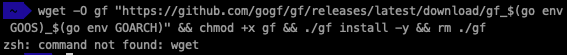
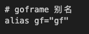
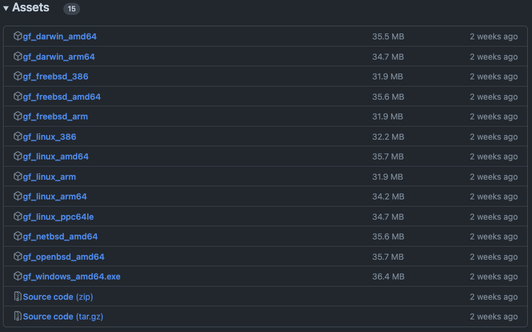
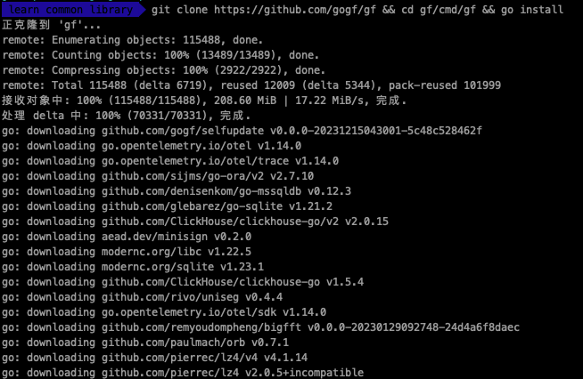
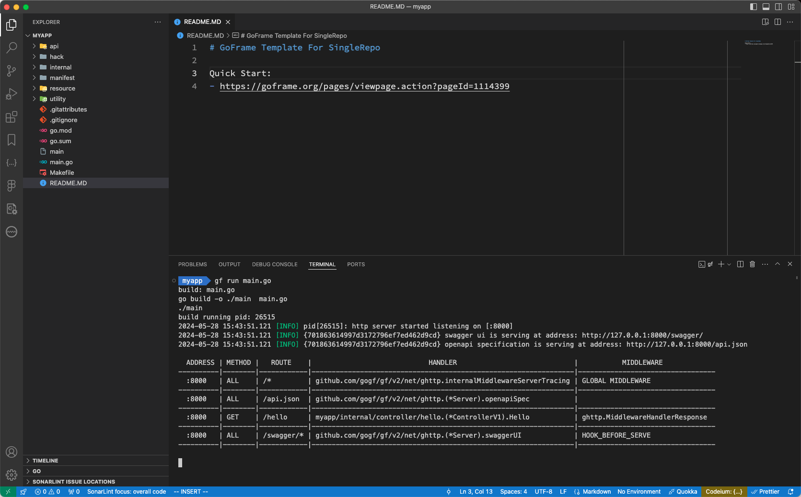
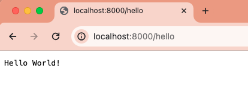
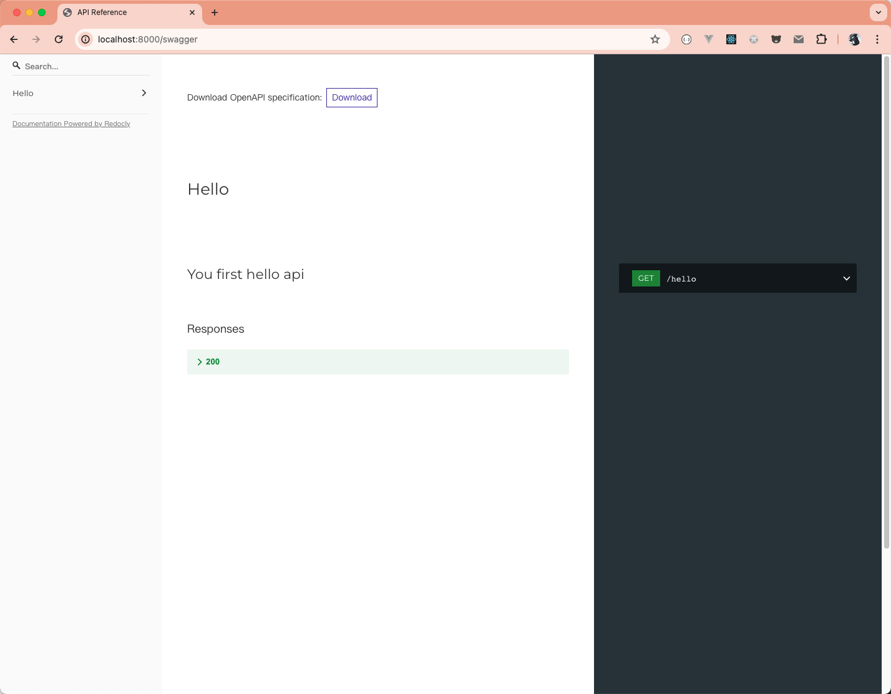

## 认识 GoFrame

GoFrame 是一款面向企业的高性能 Go 开发框架。它模块化设计，使其不仅适用于构建完整的项目，还可以作为工具库使用。GoFrame 扩展了 Go 语言的标准库，提供了各种通用的基础开发组件，具有实用性强、模块丰富、文档全面和易用性高等优点。它是一款通用性的框架，非常适合团队开发。

### 介绍Go语言的流行：简单介绍Go语言的特点和流行趋势

Go 语言的流行 Go 语言，也称为 Golang，由 Google 于 2009 年发布，是一种静态类型、编译型的编程语言。 Go 语言在过去十几年间迅速崛起，成为现代软件开发中备受欢迎的语言之一。它的设计目标是提高程序员的工作效率和代码可维护性。

##### Go语言的特点

1. **简洁高效**：Go 语言语法简洁直观，减少了复杂性，使开发者能专注于解决实际问题。它的编译速度非常快，能显着缩短开发和部署时间。
2. **并发性**：Go 语言内置强大的并发编程支持，Goroutine 和 Channel 使得编写高并发程序变得更加容易和高效。这使得 Go 在处理高并发和分布式系统时表现出色。
3. **内存管理**：Go 语言具有自动垃圾回收机制，开发者无需手动管理内存，降低了内存泄漏和指针错误的风险。
4. **跨平台支持**：Go 语言可以编译成独立的二进制文件，并能在不同的操作系统上运行，如 Windows、Linux 和 MacOS，这使得部署和分发变得非常简单。
5. **强大的标准库**：Go 语言标准库功能强大，涵盖了网络、I/O 操作、文本处理、数据库访问等常用功能，大大提高了开发效率。

##### Go语言的流行趋势

Go 语言因其高效的并发处理和跨平台支持，成为开发云原生应用和微服务架构的首选语言。像 Kubernetes、Docker 等知名项目都是使用Go语言编写的，这进一步推动了 Go 语言在云计算领域的普及。

### goframe 为何值得关注

1. **模块化设计**：GoFrame 采用模块化设计，所有功能模块都可以独立使用或组合使用。这种设计使得项目更容易维护和扩展。
2. **高性能**：得益于 Go 语言本身的高性能特性和 GoFrame 的优化设计，使用 GoFrame 开发的应用在性能上表现优异，适合高并发、高负载场景。
3. **丰富的组件**：GoFrame 包含了大量的基础开发组件，如路由、数据库操作、会话管理、缓存、配置管理等，极大地简化了开发过程。
4. **易用性**：GoFrame 提供了简洁直观的 API，开发者可以快速上手并开始开发项目。
5. **全面的文档**：GoFrame 拥有详尽的文档和教程，为开发者提供了充足的学习资源和技术支持。
6. **实战化**：GoFrame 经过大量实际项目的验证和优化，具备了丰富的实战经验和可靠性。

### goframe 的起源和开发背景

GoFrame 的起源和开发背景源自于 Go 语言生态系统的快速发展和企业级应用的需求。适用于小、中、大型项目，提供开箱即用、丰富强大的基础组件库。

### 与其他框架的对比（如 Gin）的异同

GoFrame 是一个功能丰富且功能强大的 Go 语言Web框架,与其他流行的 Go 框架如 Gin、Beego 等相比，它们各有自己的特点和优缺点。下面是 GoFrame 与其他框架的主要异同:

相同点:

- **路由管理**: 这些框架都提供了强大的路由管理功能，支持 RESTful API、路由分组等。
- **中间件**: 它们都支持中间件机制，方便开发者扩展功能。
- **模板引擎**: 大部分框架都内置了模板引擎，支持动态页面渲染。

不同点:

- **功能全面性**:
    - GoFrame 集成了更多功能模块，如缓存、定时任务、配置管理等，是一个比较全面的 Web 开发框架。
    - Gin 相对更轻量级，专注于 Web 开发的核心功能。
- **性能**:
    - GoFrame 在性能方面经过了优化，在高并发场景下有优势。
    - Gin 在性能方面也有出色表现，是一个非常轻量级和高性能的框架。
- **学习曲线**:
    - GoFrame 由于功能更加丰富，学习曲线相对较陡。
    - Gin 相对更简单易学。
- **社区和生态**:
    - Gin 有更大的社区和生态圈。
    - GoFrame 的社区相对较小，但正在快速成长。

## 开始使用 goframe

goframe 框架为开发者提供了便捷的开发指令简化开发工作，如工程脚手架、代码自动生成、工具及框架更新等实用命令。

### 安装 goframe 框架工具

上面对 goframe 有大致了解后，接下来看看如何安装 goframe，包括必要的环境配置和依赖安装。

### MacOS 系统

```shell
  wget -O gf "https://github.com/gogf/gf/releases/latest/download/gf_$(go env GOOS)_$(go env GOARCH)" && chmod +x gf && ./gf install -y && rm ./gf
```

#### 您可能会遇到以下常见问题

如果当前系统没有安装 wget 命令，使用 `brew install wget` 安装后继续执行该命令（若不想安装 wget，可以使用后面手动编译安装的方式）。


如果您使用的是 zsh 终端，可能会存在 gf 别名冲突（ git fetch 快捷指令），那么安装后（至少执行一次）请重启终端软件来继续使用。

解决办法：
直接在 .zshrc 文件添加 alias 并更新 .zshrc 文件；操作步骤如下：

- 进入根目录

    ```sh
    cd ~
    ```

- 添加 gf 别名

    ```sh
    vi .zshrc
    ```

    在文件的结尾添加 `alias gf="gf"`，如下图：
    
    输入完成后，按 ESC 键，然后 `:wq` 保存并退出编辑状态，接着更新 .zshrc 文件使其配置生效或者重新打开一个终端；更新命令如下：

    ```sh
    resouce .zshrc
    ```

    验证别名是否设置成功，可以使用 `gf -v` 查看 goframe 的版本进行验证，如果成功打印出 goframe 相关的信息则说明设置成功了，如果没有的话，就要检查 .zshrc 的设置是否有问题，比如标点是否输成中文之类的问题。

#### Linux 系统

```shell
wget -O gf "https://github.com/gogf/gf/releases/latest/download/gf_$(go env GOOS)_$(go env GOARCH)" && chmod +x gf && ./gf install -y && rm ./gf
```

如果系统没有安装wget命令：

- Ubuntu/Debian系统请使用 `apt-get install wget -y`。
- CentOS/RedHat系统请使用 `yum install wget -y`。

#### Windows环境

手动下载对应的二进制文件，双击按照终端指令安装即可。如果双击安装失败，请采用最后万能的手动编译安装方式。[github 链接](https://github.com/gogf/gf/releases)


#### 手动编译安装

```shell
git clone https://github.com/gogf/gf && cd gf/cmd/gf && go install
```

通过下载源码到本地编译生成二进制后安装到系统目录，这是万能的安装方式：


#### 脚手架常用命令

- **工具帮助 help**

    ```shell
    gf -h
    ```

    这个命令是使用的最频繁的，因为有什么参数或者命令不知道怎么使用就直接使用 `gf -h`。

- **查看版本 version（-v）**

    查看当前 gf 命令行工具编译时的版本信息。

    ```shell
    $ gf -v
    v2.7.1
    Welcome to GoFrame!
    Env Detail:
      Go Version: go1.22.0 darwin/amd64
      GF Version(go.mod): cannot find go.mod
    CLI Detail:
      Installed At: /Users/changlin/go/bin/gf
      Built Go Version: go1.22.0
      Built GF Version: v2.7.1
    Others Detail:
      Docs: https://goframe.org
      Now : 2024-05-28T11:47:59+08:00
    ```

- **框架升级 up**

    该命令从框架v2.3版本开始提供，用以实现版本更新，同时更新主框架版本、社区组件版本到最新版本。

    ```shell
    $ $ gf up -h
    USAGE
        gf up [OPTION]

    OPTION
        -a, --all    upgrade both version and cli, auto fix codes
        -c, --cli    also upgrade CLI tool
        -f, --fix    auto fix codes(it only make sense if cli is to be upgraded)
        -h, --help   more information about this command

    EXAMPLE
        gf up
        gf up -a
        gf up -c
        gf up -cf
    ```

    参数说明：

    | 名称 | 说明                                                          |
    | ---- | ------------------------------------------------------------- |
    | all  | 同时更新cli工具版本，并且自动修复本地代码在升级中的不兼容变更 |
    | fix  | 升级时自动修复本地代码在升级中的不兼容变更                    |
    | cli  | 升级时同时更新cli工具版本                                     |

- **创建项目 init**

    使用 init 命令在当前目录生成一个空 GoFrame 项目，可给定项目名称参数

    ```shell
    $ gf init -h
    USAGE
        gf init ARGUMENT [OPTION]

    ARGUMENT
        NAME    name for the project. It will create a folder with NAME in current directory.The NAME will also be the
                module name for the project.

    OPTION
        -m, --mono    initialize a mono-repo instead a single-repo
        -a, --monoApp initialize a mono-repo-app instead a single-repo
        -h, --help    more information about this command

    EXAMPLE
        gf init my-project
        gf init my-mono-repo -m
    ```

    > - 在**当前目录下初始化项目**
    >
    >     ```shell
    >     gf init .
    >     ```
    >
    > - 在**当前目录创建一个指定名称的项目**
    >
    >     ```shell
    >     gf init project-name
    >     ```
    >
    > - 在**当前目录创建一个 Monorepo 项目**
    >
    >     默认情况下创建的是 SingleRepo 项目，若有需要也可以创建一个 Monorepo（大仓）项目，通过使用 `-m` 选项即可。
    >
    >     ```shell
    >     gf init project-name -m
    >     ```

- **交叉编译 build**

    仅限于交叉编译使用到 GoFrame 框架的项目，支持绝大部分常见系统的直接交叉编译。更多详情可查看[官方文档](https://goframe.org/pages/viewpage.action?pageId=1115788)

- **自动编译 run**

    该命令将会自动编译当前程序，并停止原有程序，运行新版的程序。

    ```shell
    $ gf run -h
    USAGE
        gf run FILE [OPTION]

    ARGUMENT
        FILE    building file path.

    OPTION
        -p, --path         output directory path for built binary file. it's "manifest/output" in default
        -e, --extra        the same options as "go run"/"go build" except some options as follows defined
        -a, --args         custom arguments for your process
        -w, --watchPaths   watch additional paths for live reload, separated by ",". i.e. "manifest/config/*.yaml"
        -h, --help         more information about this command

    EXAMPLE
        gf run main.go
        gf run main.go --args "server -p 8080"
        gf run main.go -mod=vendor
        gf run main.go -w "manifest/config/*.yaml"

    DESCRIPTION
        The "run" command is used for running go codes with hot-compiled-like feature,
        which compiles and runs the go codes asynchronously when codes change.
    ```

- **镜像编译 docker**

    自动编译并生成 docker 镜像。非必需 MAIN 参数为编译文件路径，默认为 main.go 。非必需参数 OPTIONS 为 `docker build` 命令相同参数及选项。更多使用姿势可查看[官方文档](https://goframe.org/pages/viewpage.action?pageId=1115799)。

    ```shell
    $ gf docker -h
    USAGE
        gf docker [MAIN] [OPTION]

    ARGUMENT
        MAIN    main file path for "gf build", it's "main.go" in default. empty string for no binary build

    OPTION
        -f, --file           file path of the Dockerfile. it's "manifest/docker/Dockerfile" in default
        -s, --shell          path of the shell file which is executed before docker build
        -b, --build          binary build options before docker image build, it's "-a amd64 -s linux" in default
        -t, --tag            full tag for this docker, pattern like "xxx.xxx.xxx/image:tag"
        -tn, --tagName       tag name for this docker, pattern like "image:tag". this option is required with TagPrefixes
        -tp, --tagPrefixes   tag prefixes for this docker, which are used for docker push. this option is required with
                             TagName
        -p, --push           auto push the docker image to docker registry if "-t" option passed
        -e, --extra          extra build options passed to "docker image"
        -h, --help           more information about this command

    EXAMPLE
        gf docker
        gf docker -t hub.docker.com/john/image:tag
        gf docker -p -t hub.docker.com/john/image:tag
        gf docker main.go
        gf docker main.go -t hub.docker.com/john/image:tag
        gf docker main.go -t hub.docker.com/john/image:tag
        gf docker main.go -p -t hub.docker.com/john/image:tag
        gf docker main.go -p -tp ["hub.docker.com/john","hub.docker.com/smith"] -tn image:tag

    DESCRIPTION
        The "docker" command builds the GF project to a docker images.
        It runs "gf build" firstly to compile the project to binary file.
        It then runs "docker build" command automatically to generate the docker image.
        You should have docker installed, and there must be a Dockerfile in the root of the project.
    ```

- **代码生成 gen**

    ```shell
    $ gf gen -h
    USAGE
        gf gen COMMAND [OPTION]

    COMMAND
        ctrl        parse api definitions to generate controller/sdk go files
        dao         automatically generate go files for dao/do/entity
        enums       parse go files in current project and generate enums go file
        pb          parse proto files and generate protobuf go files
        pbentity    generate entity message files in protobuf3 format
        service     parse struct and associated functions from packages to generate service go file

    DESCRIPTION
        The "gen" command is designed for multiple generating purposes.
        It's currently supporting generating go files for ORM models, protobuf and protobuf entity files.
        Please use "gf gen dao -h" for specified type help.
    ```

    1. **接口规范 gen ctrl**，官方文档[链接](https://goframe.org/pages/viewpage.action?pageId=93880327)。
    2. **数据规范 gen dao**

        `gen dao` 命令是 CLI 中最频繁使用、也是框架设计的工程规范能否准确落地的关键命令。该命令用于生成 dao 数据访问对象、do 数据转化模型及 entity 实例数据模型 Go 代码文件。参数选项较多，这里就不一一罗列，更多信息可以查看[官方文档](https://goframe.org/pages/viewpage.action?pageId=3673173)。

    3. **模块规范 gen service**

        该命令通过分析给定的logic业务逻辑模块目录下的代码，自动生成service目录接口代码。更多详情可以查[官方文档](https://goframe.org/pages/viewpage.action?pageId=49770772)。

    4. **枚举维护 gen enums**

        该命令用于分析指定代码目录源码，按照规范生成枚举值信息以及 Go 代码文件，主要用以完善OpenAPIv3文档中的枚举值维护，更多详情可查看[官方文档](https://goframe.org/pages/viewpage.action?pageId=86187843)。

    5. **协议编译 gen pb**

        该命令用于编译proto文件，生成对应的protobuf go文件以及对应的控制器文件，更多详情可查看[官方文档](https://goframe.org/pages/viewpage.action?pageId=80488191)。

    6. **数据表PB gen pbentity**

        该命令用于读取配置的数据库，根据数据表生成对应的proto数据结构文件，更多详情可查看[官方文档](https://goframe.org/pages/viewpage.action?pageId=80488193)。

## 第一个 goframe 项目

gf 命令行工具提供了一系列的命令，可以帮助你快速地生成项目框架和文件，并且可以根据你的需求进行自定义。

### 创建项目

介绍如何使用 goframe 创建一个新的项目，项目结构是什么样的。

#### 使用`gf`命令创建项目

```sh
$ gf init myapp
initializing...
initialization done!
you can now run "cd myapp && gf run main.go" to start your journey, enjoy!
```

这个创建过程很快，如果看到的结果上面的内容一样，则说明创建成功了，可以使用自己比较熟悉的工具打开项目，然后运行项目，笔者比较熟悉 vscode，下面就是用 vscode 打开，并运行项目，效果图如下：



运行 `gf run main.go` 命令后，在项目的根目录就会有一个 main 可执行文件，其实 gf 运行的就是这个文件；启动之后就可以在终端中查看到服务运行在哪个端口、有哪些路由：

```sh
gf run main.go
build: main.go
go build -o ./main  main.go
./main
build running pid: 26515
2024-05-28 15:43:51.121 [INFO] pid[26515]: http server started listening on [:8000]
2024-05-28 15:43:51.121 [INFO] {701863614997d3172796ef7ed462d9cd} swagger ui is serving at address: http://127.0.0.1:8000/swagger/
2024-05-28 15:43:51.121 [INFO] {701863614997d3172796ef7ed462d9cd} openapi specification is serving at address: http://127.0.0.1:8000/api.json

  ADDRESS | METHOD |   ROUTE    |                             HANDLER                             |           MIDDLEWARE
----------|--------|------------|-----------------------------------------------------------------|----------------------------------
  :8000   | ALL    | /*         | github.com/gogf/gf/v2/net/ghttp.internalMiddlewareServerTracing | GLOBAL MIDDLEWARE
----------|--------|------------|-----------------------------------------------------------------|----------------------------------
  :8000   | ALL    | /api.json  | github.com/gogf/gf/v2/net/ghttp.(*Server).openapiSpec           |
----------|--------|------------|-----------------------------------------------------------------|----------------------------------
  :8000   | GET    | /hello     | myapp/internal/controller/hello.(*ControllerV1).Hello           | ghttp.MiddlewareHandlerResponse
----------|--------|------------|-----------------------------------------------------------------|----------------------------------
  :8000   | ALL    | /swagger/* | github.com/gogf/gf/v2/net/ghttp.(*Server).swaggerUI             | HOOK_BEFORE_SERVE
----------|--------|------------|-----------------------------------------------------------------|----------------------------------
```

可以打开浏览器请求 hello 服务： `http://localhost:8000/hello`


在浏览器中查看 swagger 访问服务： `http://localhost:8000/swagger`



#### 项目目录

```tree
.
├── api                 // 对外提供服务的输入/输出数据结构定义。考虑到版本管理需要，往往以api/xxx/v1...存在
│   └── hello
├── hack                // 存放项目开发工具、脚本等内容。例如，CLI工具的配置，各种shell/bat脚本等文件
│   ├── config.yaml
│   ├── hack-cli.mk
│   └── hack.mk
├── internal            // 业务逻辑存放目录
│   ├── cmd             // 命令行管理目录
│   ├── consts          // 项目所有常量定义
│   ├── controller      // 接收/解析用户输入参数的入口/接口层
│   ├── dao             // 数据访问对象，这是一层抽象对象，用于和底层数据库交互，仅包含最基础的 CURD 方法
│   ├── logic           // 业务逻辑封装管理，特定的业务逻辑实现和封装。往往是项目中最复杂的部分
│   ├── model           // 数据结构管理模块，管理数据实体对象，以及输入与输出数据结构定义
│   │   ├── do          // 用于dao数据操作中业务模型与实例模型转换，由工具维护，用户不能修改
│   │   └── entity      // 数据模型是模型与数据集合的一对一关系，由工具维护，用户不能修改
│   ├── packed
│   └── service         // 用于业务模块解耦的接口定义层。具体的接口实现在 logic 中进行注入
├── manifest            // 包含程序编译、部署、运行、配置的文件
│   ├── config          // 配置文件存放目录
│   ├── deploy          // 部署相关的文件。默认提供了Kubernetes集群化部署的Yaml模板，通过 kustomize 管理
│   ├── docker          // Docker镜像相关依赖文件，脚本文件等等
│   ├── i18n            // 国际化
│   └── protobuf        // GRPC协议时使用的protobuf协议定义文件，协议文件编译后生成go文件到api目录
├── resource            // 静态资源文件
│   ├── public
│   └── template
├── utility
├── go.mod              // 使用 Go Module 包管理的依赖描述文件
├── go.sum
├── Makefile
├── README.MD           // 描述文件
└── main.go             // 程序入口文件
```

## 扩展问题

> 以下回答基于 goframe v2.7.1 版本的实现。为了确保该版本源码的保存，我已将其备份到 [GitHub](https://github.com/clin211/goframe-practice/tree/goframe-code) 上。

### `gf init project-name` 执行了哪些操作？

1. 检查配置信息，优先使用 `/hack/config.yml` 文件中的信息进行 CLI 配置；[源码位置](https://github.com/gogf/gf/blob/master/cmd/gf/gfcmd/gfcmd.go#L50)。
2. 处理 MacOS 系统 `gf` 与 "git fetch" 命令冲突；[源码位置](https://github.com/gogf/gf/blob/master/cmd/gf/gfcmd/gfcmd.go#L59)。
3. `-y` 参数检查，用于自动确认所有提示；[源码位置](https://github.com/gogf/gf/blob/master/cmd/gf/gfcmd/gfcmd.go#L62)。

### `gf run main.go` 的启动流程是什么？是如何自动编译的？

## 总结

文章从 GoFrame 的介绍开始，详细阐述了 GF 框架的安装过程及 GF CLI 的一些常用命令行工具。

虽然安装过程中遇到了一些挑战，但文中也提供了相应的解决办法。

同时，文章对 GF 和 Gin 两个框架进行了初步的对比分析。

在安装和环境配置完成后，成功地使用 GF 创建并启动了一个项目，并在浏览器中成功访问了项目的演示服务 `/hello`。

文章中的所有代码都可以在 [GitHub](https://github.com/clin211/goframe-practice/tree/myapp) 上找到。
