在我们的上一篇文章《GoFrame 入门指南：环境搭建及框架初识》中，我们初步探索了 GoFrame 的基本概念，学习了如何搭建开发环境，熟悉了一些常用的命令，同时也对如何创建项目以及项目的基本架构有了基本的认识。接下来，我们将深入探究 GoFrame 的核心组件，这包括：对象管理、调试模式、命令管理、配置管理、日志组件、错误处理、数据校验、类型转换、缓存、模板引擎、ORM、国际化以及资源管理。这些核心组件将会在接下来的几篇文章中详细介绍。让我们一起揭开 GoFrame 强大功能的神秘面纱，深入探索它的魅力所在。

## 对象管理

GoFrame框架封装了一些常用的数据类型以及对象获取方法，通过 `g.*` 方法获取。使用 `g` 对象的需要引入包：

```sh
import "github.com/gogf/gf/v2/frame/g"
```

下面就是 `g` 对象的数据结构，源码位置 [/frame/g](https://github.com/clin211/goframe-practice/blob/goframe-code/frame/g/g.go)：

```go
package g

import (
	"context"

	"github.com/gogf/gf/v2/container/gvar"
	"github.com/gogf/gf/v2/util/gmeta"
)

type (
	Var  = gvar.Var        // Var is a universal variable interface, like generics.
	Ctx  = context.Context // Ctx is alias of frequently-used type context.Context.
	Meta = gmeta.Meta      // Meta is alias of frequently-used type gmeta.Meta.
)

type (
	Map        = map[string]interface{}      // Map is alias of frequently-used map type map[string]interface{}.
	MapAnyAny  = map[interface{}]interface{} // MapAnyAny is alias of frequently-used map type map[interface{}]interface{}.
	MapAnyStr  = map[interface{}]string      // MapAnyStr is alias of frequently-used map type map[interface{}]string.
	MapAnyInt  = map[interface{}]int         // MapAnyInt is alias of frequently-used map type map[interface{}]int.
	MapStrAny  = map[string]interface{}      // MapStrAny is alias of frequently-used map type map[string]interface{}.
	MapStrStr  = map[string]string           // MapStrStr is alias of frequently-used map type map[string]string.
	MapStrInt  = map[string]int              // MapStrInt is alias of frequently-used map type map[string]int.
	MapIntAny  = map[int]interface{}         // MapIntAny is alias of frequently-used map type map[int]interface{}.
	MapIntStr  = map[int]string              // MapIntStr is alias of frequently-used map type map[int]string.
	MapIntInt  = map[int]int                 // MapIntInt is alias of frequently-used map type map[int]int.
	MapAnyBool = map[interface{}]bool        // MapAnyBool is alias of frequently-used map type map[interface{}]bool.
	MapStrBool = map[string]bool             // MapStrBool is alias of frequently-used map type map[string]bool.
	MapIntBool = map[int]bool                // MapIntBool is alias of frequently-used map type map[int]bool.
)

type (
	List        = []Map        // List is alias of frequently-used slice type []Map.
	ListAnyAny  = []MapAnyAny  // ListAnyAny is alias of frequently-used slice type []MapAnyAny.
	ListAnyStr  = []MapAnyStr  // ListAnyStr is alias of frequently-used slice type []MapAnyStr.
	ListAnyInt  = []MapAnyInt  // ListAnyInt is alias of frequently-used slice type []MapAnyInt.
	ListStrAny  = []MapStrAny  // ListStrAny is alias of frequently-used slice type []MapStrAny.
	ListStrStr  = []MapStrStr  // ListStrStr is alias of frequently-used slice type []MapStrStr.
	ListStrInt  = []MapStrInt  // ListStrInt is alias of frequently-used slice type []MapStrInt.
	ListIntAny  = []MapIntAny  // ListIntAny is alias of frequently-used slice type []MapIntAny.
	ListIntStr  = []MapIntStr  // ListIntStr is alias of frequently-used slice type []MapIntStr.
	ListIntInt  = []MapIntInt  // ListIntInt is alias of frequently-used slice type []MapIntInt.
	ListAnyBool = []MapAnyBool // ListAnyBool is alias of frequently-used slice type []MapAnyBool.
	ListStrBool = []MapStrBool // ListStrBool is alias of frequently-used slice type []MapStrBool.
	ListIntBool = []MapIntBool // ListIntBool is alias of frequently-used slice type []MapIntBool.
)

type (
	Slice    = []interface{} // Slice is alias of frequently-used slice type []interface{}.
	SliceAny = []interface{} // SliceAny is alias of frequently-used slice type []interface{}.
	SliceStr = []string      // SliceStr is alias of frequently-used slice type []string.
	SliceInt = []int         // SliceInt is alias of frequently-used slice type []int.
)

type (
	Array    = []interface{} // Array is alias of frequently-used slice type []interface{}.
	ArrayAny = []interface{} // ArrayAny is alias of frequently-used slice type []interface{}.
	ArrayStr = []string      // ArrayStr is alias of frequently-used slice type []string.
	ArrayInt = []int         // ArrayInt is alias of frequently-used slice type []int.
)
```

每个类型别名都有一个注释，简单地解释了它的用途。以下是这些类型别名的解释：

- `Var`、`Ctx` 和 `Meta`：分别是 `gvar.Var`、`context.Context` 和 `gmeta.Meta` 的别名，它们是常用的类型，用于处理各种常见的任务。
- Map 系列：定义了一系列用于处理键值对的数据类型的别名，其中键和值的类型各不相同。
- List 系列：定义了一系列用于处理列表的数据类型的别名，这些列表中的每一项都是一个 Map 类型的对象。
- Slice 和 Array 系列：定义了一系列用于处理切片的数据类型的别名，这些切片中的每一项的类型可以是任何类型。

### 常用的对象

常用对象都是通过单例模式进行管理的，**可以根据不同的单例名称获取对应的对象实例**，对象初始化时会自动检索获取配置文件中对应的配置项。**其中 `g` 模块从实现上原理上看，在并发量大的场景下会存在锁竞争的情况**，但在绝大部分情况不用太在意锁竞争带来的性能损耗；也可以通过单例模式在特定的场景下使其重复使用。

### `HTTP` 客户端对象

创建一个新的 HTTP 客户端对象（在线地址 [http\_#L26](https://github.com/clin211/goframe-practice/blob/goframe-code/frame/g/g_object.go#L26)）：

```go
// Client is a convenience function, which creates and returns a new HTTP client.
func Client() *gclient.Client {
	return gclient.New()
}
```

### Config 配置管理对象（在线地址 [cfg\_#L57](https://github.com/clin211/goframe-practice/blob/goframe-code/frame/g/g_object.go#L57)）

```go
// Cfg is alias of Config.
// See Config.
func Cfg(name ...string) *gcfg.Config {
	return Config(name...)
}
```

该单例对象将会自动按照文件后缀 toml、yaml、yml、json、ini、xml、properties 文自动检索配置文件。默认情况下会自动检索以下配置文件：

- config
- config.toml
- config.yaml
- config.yml
- config.json
- config.ini
- config.xml
- config.properties

并缓存，配置文件在外部被修改时将会自动刷新缓存。

为方便多文件场景下的配置文件调用，简便使用并提高开发效率，单例对象在创建时将会自动使用单例名称进行文件检索。例如：`g.Cfg("redis")` 获取到的单例对象将默认会自动检索以下文件：

- redis
- redis.toml
- redis.yaml
- redis.yml
- redis.json
- redis.ini
- redis.xml
- redis.properties

如果检索成功那么将该文件加载到内存缓存中，下一次将会直接从内存中读取；当该文件不存在时，则使用默认的配置文件（config.toml）

### Log 日志管理对象

该单例对象将会自动读取默认配置文件中的 logger 配置项，并只会初始化一次日志对象（在线地址 [Log\_#L81](https://github.com/clin211/goframe-practice/blob/goframe-code/frame/g/g_object.go#L81)）：

```go
// Log returns an instance of glog.Logger.
// The parameter `name` is the name for the instance.
func Log(name ...string) *glog.Logger {
	return gins.Log(name...)
}
```

### View 模板引擎对象

自动读取**默认配置文件中的 viewer 配置项，并只会初始化一次模板引擎对象**。内部采用了**懒初始化设计**，获取模板引擎对象时只是创建了一个轻量的模板管理对象，只有当解析模板文件时才会真正初始化。源码如下（在线代码 [View\_#L46](https://github.com/clin211/goframe-practice/blob/goframe-code/frame/g/g_object.go#L46)）：

```go
// View returns an instance of template engine object with specified name.
func View(name ...string) *gview.View {
	return gins.View(name...)
}
```

### Validator 校验对象

创建一个新的数据校验对象（在线地址 [Validator\_#L106](https://github.com/clin211/goframe-practice/blob/goframe-code/frame/g/g_object.go#L106)）：

```go
// Validator is a convenience function, which creates and returns a new validation manager object.
func Validator() *gvalid.Validator {
	return gvalid.New()
}
```

### Web Server

将会自动读取默认配置文件中的 server 配置项，并只会初始化一次 Server 对象。源码如下（在线地址 [web server#L31](https://github.com/clin211/goframe-practice/blob/goframe-code/frame/g/g_object.go#L31)）：

```go
// Server returns an instance of http server with specified name.
func Server(name ...interface{}) *ghttp.Server {
	return gins.Server(name...)
}
```

### 数据库ORM对象

该单例对象将会自动读取默认配置文件中的 database 配置项，并只会初始化一次 DB 对象。源码如下（在线地址 [DB#L86](https://github.com/clin211/goframe-practice/blob/goframe-code/frame/g/g_object.go#L86)）：

```go
// DB returns an instance of database ORM object with specified configuration group name.
func DB(name ...string) gdb.DB {
	return gins.Database(name...)
}
```

此外，可以通过以下方法在默认数据库上创建一个 Model 对象：

```go
// Model creates and returns a model based on configuration of default database group.
func Model(tableNameOrStruct ...interface{}) *gdb.Model {
	return DB().Model(tableNameOrStruct...)
}
```

### Redis客户端对象

该单例对象将会**自动读取默认配置文件中的 redis 配置项**，并只会**初始化一次 Redis 对象**。源码如下（在线地址 [Redis#L101](https://github.com/clin211/goframe-practice/blob/goframe-code/frame/g/g_object.go#L101)）：

```go
// Redis returns an instance of redis client with specified configuration group name.
func Redis(name ...string) *gredis.Redis {
	return gins.Redis(name...)
}
```

### 资源管理对象

```go
// Res is alias of Resource.
// See Resource.
func Res(name ...string) *gres.Resource {
	return Resource(name...)
}
```

### 国际化

```go
// I18n returns an instance of gi18n.Manager.
// The parameter `name` is the name for the instance.
func I18n(name ...string) *gi18n.Manager {
	return gins.I18n(name...)
}
```

## 调试模式

在业务开发中，经常会遇到一些奇奇怪怪的问题，那么如何去定位并解决这些问题呢？一个有效的方法就是调试我们的业务代码。Goframe 团队已经考虑到了这个问题，在执行关键性功能时，框架会生成一些调试信息。这些调试信息主要是给开发者在开发过程中使用。

框架调试模式下打印的调试信息将会以 **INTE** 级别的日志前缀输出到终端标准输出，并且会打印出所在源文件的名称以及代码行号:

```txt
2024-05-31 17:48:29.792 [INTE] gbuild.go:55 no build variables
2024-05-31 17:48:29.799 [INTE] gres_resource.go:57 Add 75 files to resource manager
2024-05-31 17:48:29.801 [INTE] gres_resource.go:57 Add 259 files to resource manager
2024-05-31 17:48:29.802 [INTE] gres_resource.go:57 Add 338 files to resource manager
2024-05-31 17:48:29.808 [INTE] gcfg_adapter_file_path.go:168 AddPath:/Users/changlin/code/backend/Go/learn-goframe/myapp
2024-05-31 17:48:29.811 [INTE] gcfg_adapter_file_path.go:168 AddPath:/Users/xxx/code/backend/Go/gf/cmd/gf
2024-05-31 17:48:29.811 [INTE] gcfg_adapter_file_path.go:168 AddPath:/Users/xxx/go/bin
2024-05-31 17:48:29.811 [INTE] gcfg_adapter_file_path.go:91 SetPath:/Users/xxx/code/backend/Go/learn-goframe/myapp/hack
2024-05-31 17:48:29.820 [INTE] gcmd_command_object.go:313 {183f49ebd589d4171557cf1a25356a23} input command data map: {"FILE":"main.go","Path":"./"}
2024-05-31 17:48:29.821 [INTE] gcmd_command_object.go:321 {183f49ebd589d4171557cf1a25356a23} input object assigned data: {"File":"main.go","Path":"./","Extra":"","Args":"","WatchPaths":null}
2024-05-31 17:48:29.821 [INTE] gi18n_manager.go:103 New: &gi18n.Manager{mu:sync.RWMutex{w:sync.Mutex{state:0, sema:0x0}, writerSem:0x0, readerSem:0x0, readerCount:atomic.Int32{_:atomic.noCopy{}, v:0}, readerWait:atomic.Int32{_:atomic.noCopy{}, v:0}}, data:map[string]map[string]string(nil), pattern:"\\{#(.+?)\\}", pathType:"normal", options:gi18n.Options{Path:"/Users/changlin/code/backend/Go/learn-goframe/myapp/manifest/i18n", Language:"en", Delimiters:[]string{"{#", "}"}, Resource:(*gres.Resource)(0xc0001a6540)}}
```

### 开启调试模式

开启调试模式有两种方式：通过环境变量和命令行参数

#### 通过环境变量的方式开启

- **golang 的配置方式**
  在运行模板中添加 GF_DEBUG 环境变量，然后开始调试程序。
  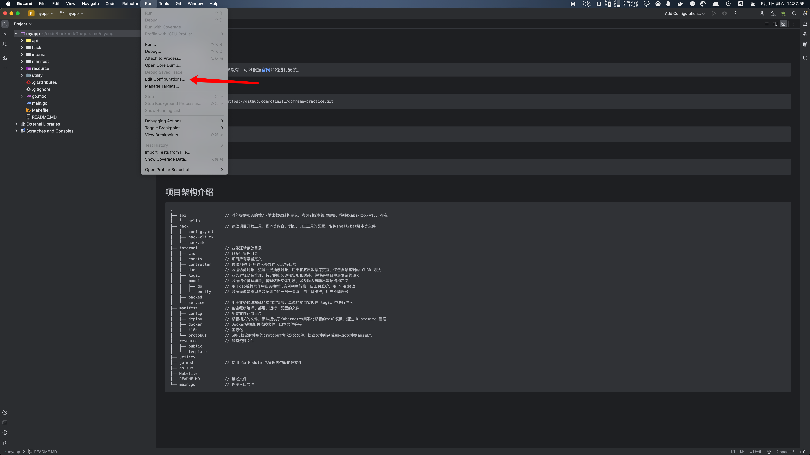

    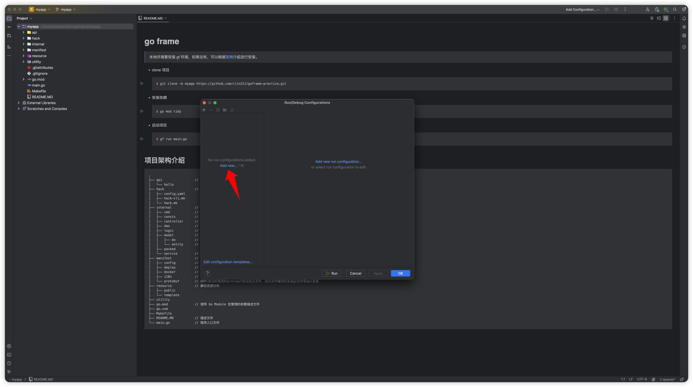

    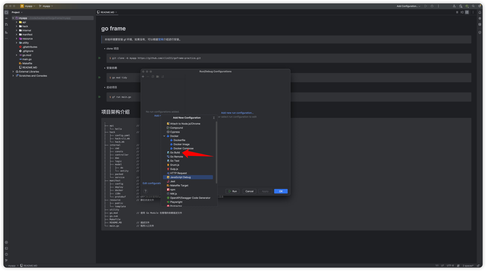

    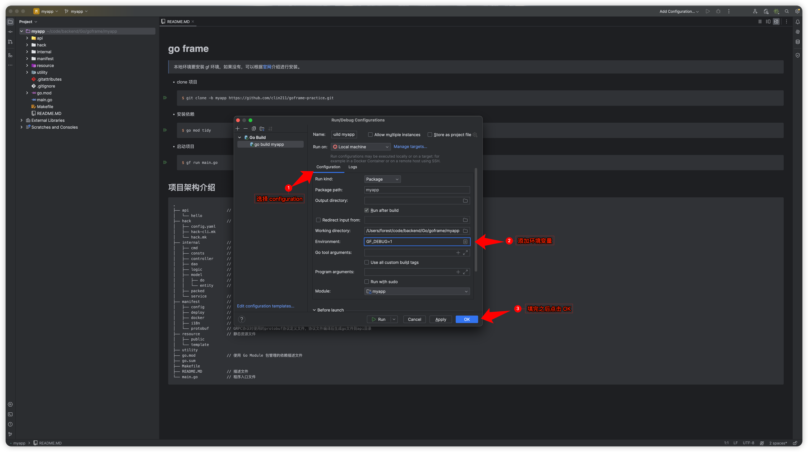

    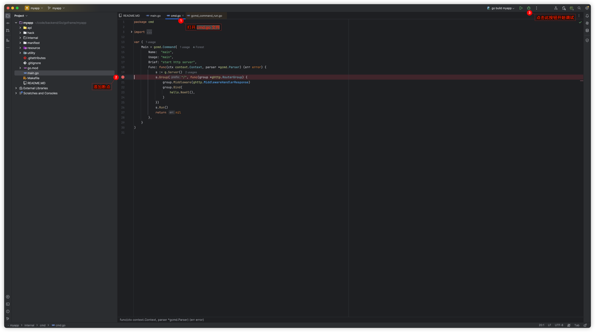

    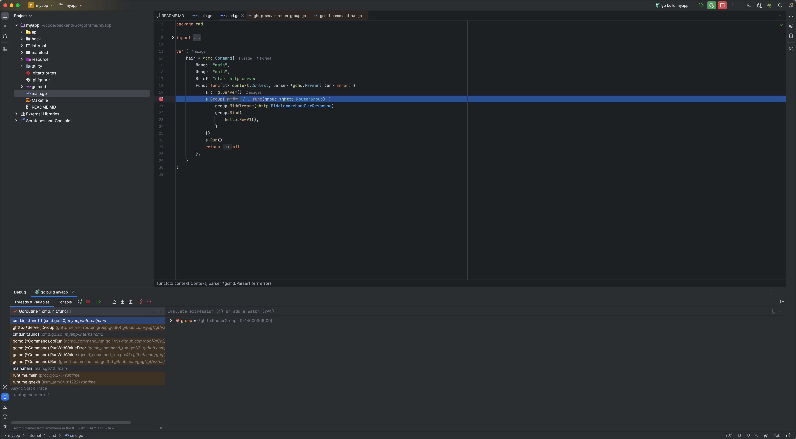

- **Visual Studio Code 的配置方式**
    1. 在 vscode 中打开项目，按照下图步骤进行操作
       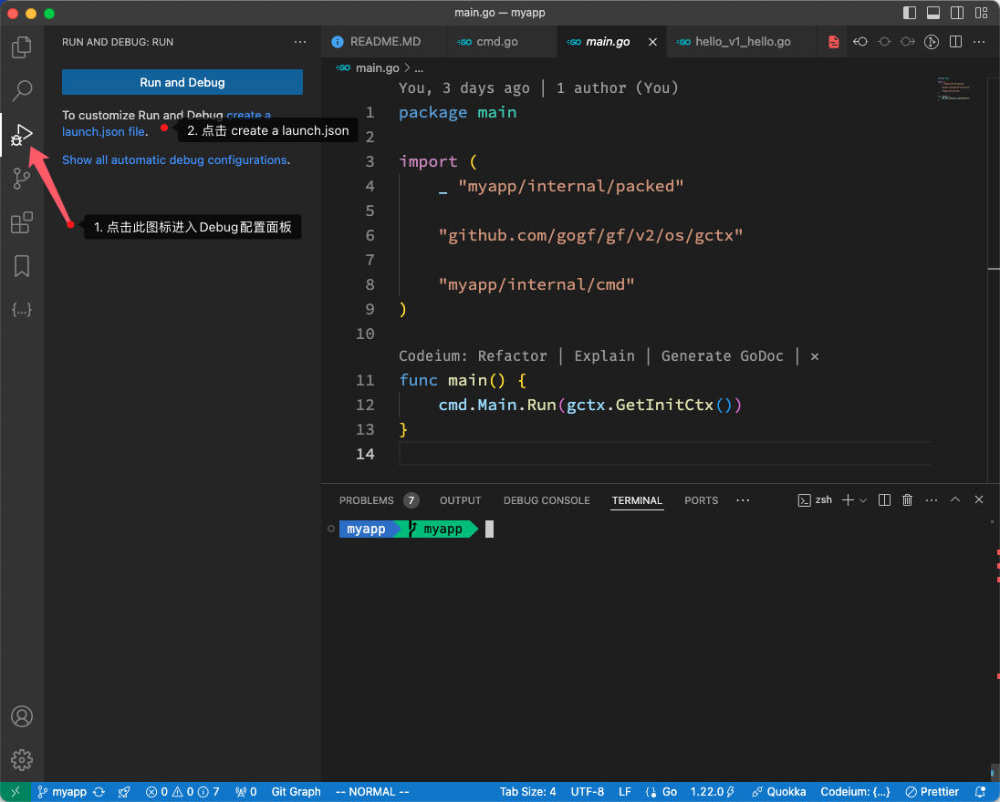

    2. 选择 Launch Package 项
       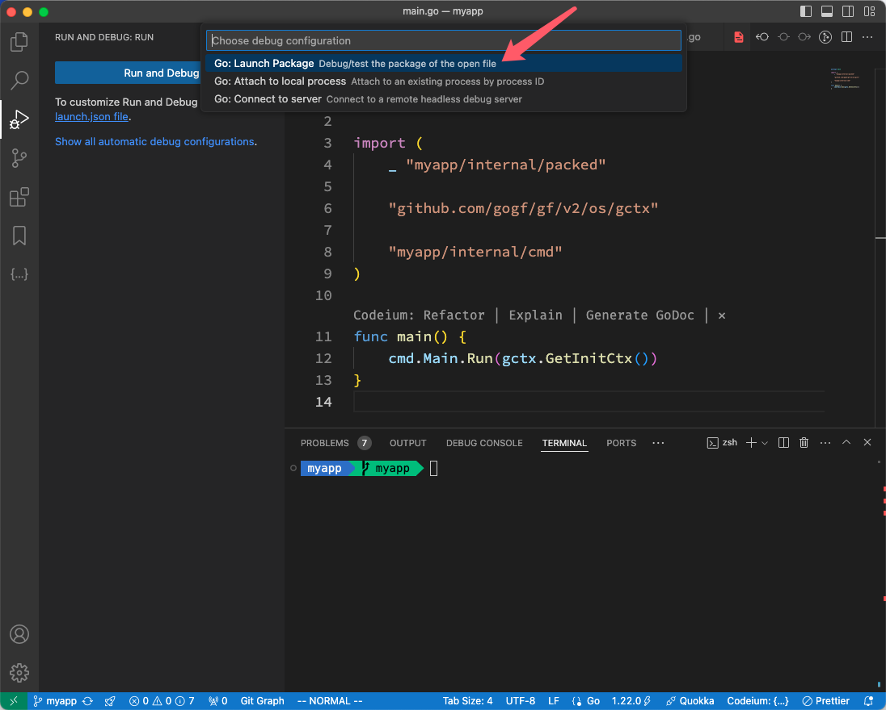

        然后就在项目的根目录的 `.vscode/launch.json` 中自动添加如下内容：

        ```json
        {
            // Use IntelliSense to learn about possible attributes.
            // Hover to view descriptions of existing attributes.
            // For more information, visit: https://go.microsoft.com/fwlink/?linkid=830387
            "version": "0.2.0",
            "configurations": [
                {
                    "name": "Launch Package",
                    "type": "go",
                    "request": "launch",
                    "mode": "auto",
                    "program": "${fileDirname}"
                }
            ]
        }
        ```

        这个肯定不能直接使用，需要改造一下，添加程序的入口文件和环境变量（参数的形式也可以）：

        ```json
        {
            // Use IntelliSense to learn about possible attributes.
            // Hover to view descriptions of existing attributes.
            // For more information, visit: https://go.microsoft.com/fwlink/?linkid=830387
            "version": "0.2.0",
            "configurations": [
                {
                    "name": "debug goframe project",
                    "type": "go",
                    "request": "launch",
                    "mode": "auto",
                    "program": "main.go",
                    "env": {
                        "GF_DEBUG": "true"
                    },
                    "cwd": "${workspaceFolder}",
                    "args": ["--gf.debug=1"],
                    "console": "integratedTerminal"
                }
            ]
        }
        ```

    3. 在程序中打断点，如下图：
       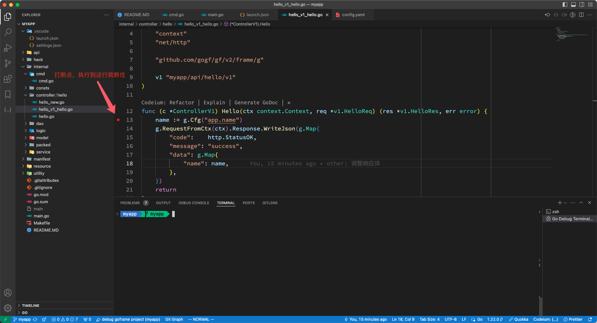

    4. 开始运行刚刚配置的调试脚本
       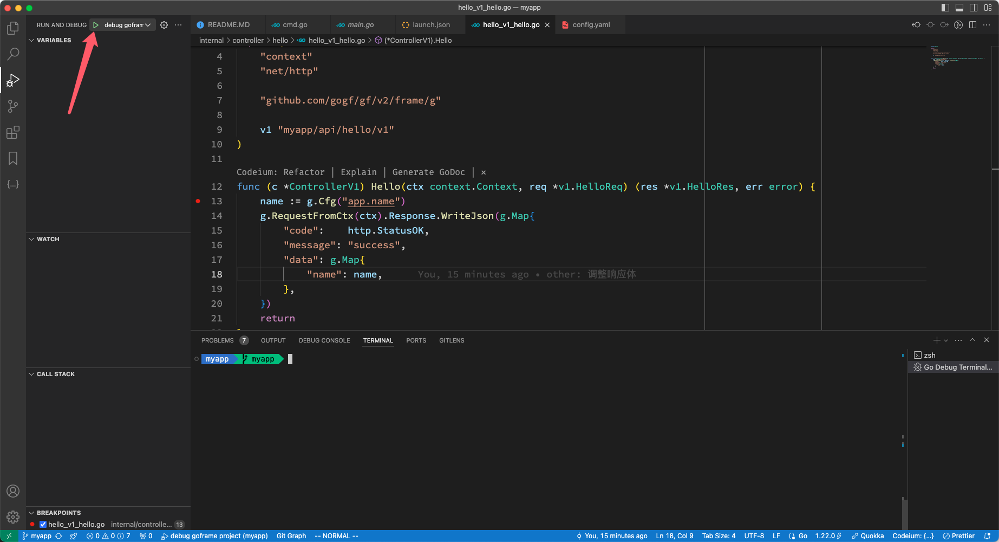

        效果如下图：

        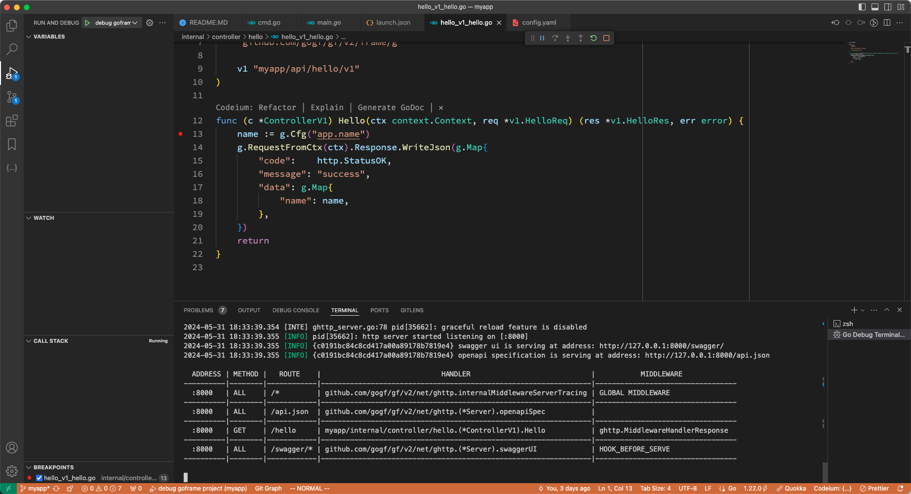

        在浏览器访问 `http://localhost:8000/hello` 后如下：
        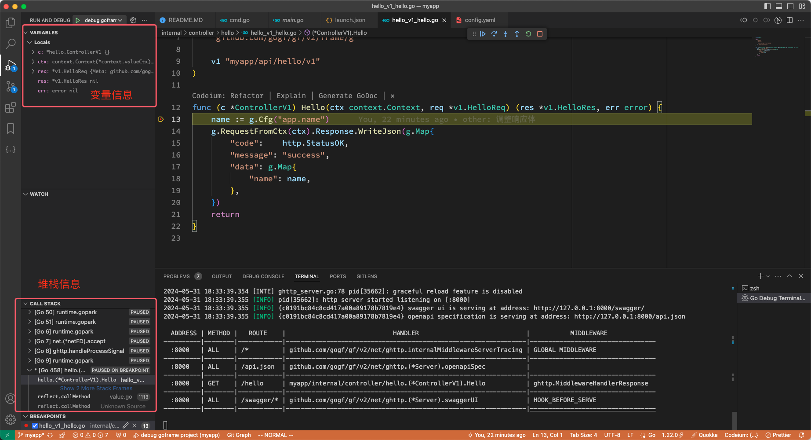

#### 通过命令行参数的方式开启

启动程序时带上 `--gf.debug=1` 或者 `--gf.debug=true`

```sh
# 开发过程中开启调试模式
$ gf run main.go --gf.debug=1

# 调试构建后应用程序
$ ./main --gf.debug=1
```

示例如下：

```txt
$ gf run main.go --gf.debug=1
2024-05-31 20:48:29.792 [INTE] gbuild.go:55 no build variables
2024-05-31 20:48:29.799 [INTE] gres_resource.go:57 Add 75 files to resource manager
2024-05-31 20:48:29.801 [INTE] gres_resource.go:57 Add 259 files to resource manager
2024-05-31 20:48:29.802 [INTE] gres_resource.go:57 Add 338 files to resource manager

// ......此处省略多行日志信息

2024-05-31 21:00:46.249 /Users/clin/code/backend/Go/gf/cmd/gf/internal/cmd/cmd_run.go:153: build: main.go
2024-05-31 21:00:46.249 /Users/clin/code/backend/Go/gf/cmd/gf/internal/cmd/cmd_run.go:172: go build -o ./main  main.go
2024-05-31 21:00:47.024 /Users/clin/code/backend/Go/gf/cmd/gf/internal/cmd/cmd_run.go:186: ./main
2024-05-31 21:00:47.026 /Users/clin/code/backend/Go/gf/cmd/gf/internal/cmd/cmd_run.go:197: build running pid: 32055
2024-05-31 21:00:47.266 [INFO] pid[32055]: http server started listening on [:8000]
2024-05-31 21:00:47.266 [INFO] {10e9365f818ad41700340a4482397f0c} swagger ui is serving at address: http://127.0.0.1:8000/swagger/
2024-05-31 21:00:47.266 [INFO] {10e9365f818ad41700340a4482397f0c} openapi specification is serving at address: http://127.0.0.1:8000/api.json

  ADDRESS | METHOD |   ROUTE    |                             HANDLER                             |           MIDDLEWARE
----------|--------|------------|-----------------------------------------------------------------|----------------------------------
  :8000   | ALL    | /*         | github.com/gogf/gf/v2/net/ghttp.internalMiddlewareServerTracing | GLOBAL MIDDLEWARE
----------|--------|------------|-----------------------------------------------------------------|----------------------------------
  :8000   | ALL    | /api.json  | github.com/gogf/gf/v2/net/ghttp.(*Server).openapiSpec           |
----------|--------|------------|-----------------------------------------------------------------|----------------------------------
  :8000   | GET    | /hello     | myapp/internal/controller/hello.(*ControllerV1).Hello           | ghttp.MiddlewareHandlerResponse
----------|--------|------------|-----------------------------------------------------------------|----------------------------------
  :8000   | ALL    | /swagger/* | github.com/gogf/gf/v2/net/ghttp.(*Server).swaggerUI             | HOOK_BEFORE_SERVE
----------|--------|------------|-----------------------------------------------------------------|----------------------------------
```

## 命令管理

程序需要通过命令行来管理程序启动入口，因此命令行管理组件也是框架的核心组件之一。GoFrame 框架提供了强大的命令行管理模块，由 gcmd 组件实现。

使用方式[原文件](https://github.com/clin211/goframe-practice/blob/goframe-code/os/gcmd/gcmd.go)：

```go
import "github.com/gogf/gf/v2/os/gcmd"
```

### 组件特性

gcmd组件具有以下显著特性：

- 使用简便、功能强大
- 命令行参数管理灵活
- 支持灵活的 Parser 命令行自定义解析
- 支持多层级的命令行管理、更丰富的命令行信息
- 支持对象模式结构化输入/输出管理大批量命令行
- 支持参数结构化自动类型转换、自动校验
- 支持参数结构化从配置组件读取数据
- 支持自动生成命令行帮助信息
- 支持终端录入功能

### 与Cobra比较

Cobra 是 Golang 中使用比较广泛的命令行管理库，开源项目地址：[cobra](https://github.com/spf13/cobra)

GoFrame 框架的 gcmd 命令行组件与 Cobra 比较，基础的功能比较相似，但差别比较大的在于参数管理方式以及可观测性支持方面：

- gcmd 组件支持结构化的参数管理，支持层级对象的命令行管理、方法自动生成命令，无需开发者手动定义手动解析参数变量。
- gcmd 组件支持**自动化的参数类型转换**，支持基础类型以及复杂类型。
- gcmd 组件支持可配置的常用**参数校验能力**，提高参数维护效率。
- gcmd 组件支持**没有终端传参时通过配置组件读取参数方式**。
- gcmd 组件支持**链路跟踪**，便于父子进程的链路信息传递。

## 配置管理

配置管理由 gcfg 组件实现，gcfg 组件的所有方法是并发安全的。gcfg 组件采用接口化设计，默认提供的是基于文件系统的接口实现。

使用方式：

```go
import "github.com/gogf/gf/v2/os/gcfg"
```

## goframe的核心概念

- 路由系统：详细介绍 goframe 的路由系统，如何定义和管理路由。
- 控制器和服务：解释控制器和服务的角色及其实现方式。
- 数据绑定和验证：介绍如何进行数据绑定和验证。
- 中间件：如何使用和编写中间件。

> gcfg 组件具有以下显著特性：
>
> - 接口化设计，很高的灵活性及扩展性，默认提供文件系统接口实现
> - 支持多种常见配置文件格式：yaml/toml/json/xml/ini/properties
> - 支持配置项不存在时读取指定环境变量或命令行参数
> - 支持检索读取资源管理组件中的配置文件
> - 支持配置文件自动检测热更新特性
> - 支持层级访问配置项
> - 支持单例管理模式

### 配置对象

推荐使用单例模式获取配置管理对象，可以通过 `g.Cgf()` 获取默认的全局配置管理对象，也可以通过 `gcfg.Instance` 包获取配置管理对象单例。

#### 实际案例

在 `manifest/config/config.yaml` 中添加下面的配置：

```yaml
app:
    name: 'myapp'
    version: '1.0.0'
```

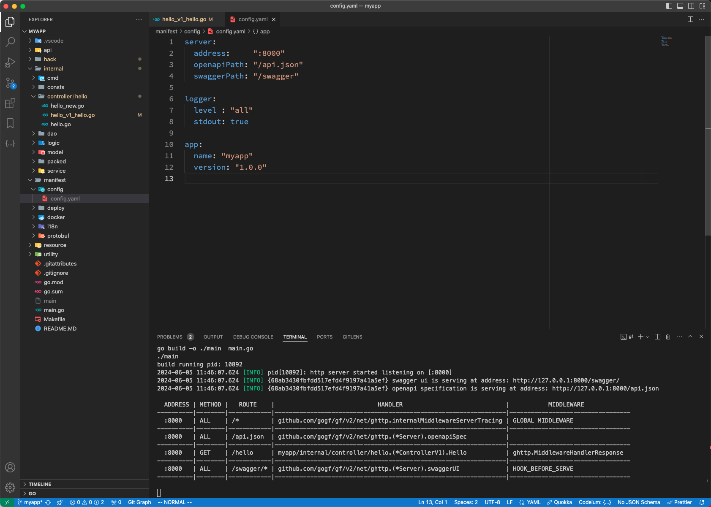

创建项目的时候，CLI 工具为我们默认创建了一个 `/hello` 的路由，我们就在这个路由中来获取配置信息，在 `interal/controller/hello/hello_v1_hello.go` 文件中做如下调整：

```go
func (c *ControllerV1) Hello(ctx context.Context, req *v1.HelloReq) (res *v1.HelloRes, err error) {
	// 使用 g.Cfg() 获取配置
	name, err := g.Cfg().Get(ctx, "app.name")
	fmt.Println("name: ", name)
	message := "success"
	if err != nil {
		message = err.Error()
	}

	// 使用 gcfg.Instance() 获取配置
	version, err := gcfg.Instance().Get(ctx, "app.version")
	if err != nil {
		message = err.Error()
	}

	g.RequestFromCtx(ctx).Response.WriteJson(g.Map{
		"code":    http.StatusOK,
		"message": message,
		"data": g.Map{
			"name":    name,
			"version": version,
		},
	})
	return
}
```

然后运行 `gf run main.go` 启动项目，在浏览器中访问 `http://localhost:8000/hello` 就会得到如下结果：

```json
{
    "code": 200,
    "message": "success",
    "data": {
        "name": "myapp",
        "version": "1.0.0"
    }
}
```

上面的完整代码可以访问 [github](https://github.com/clin211/goframe-practice/commit/a0b094d537dd191a95c2a20cb4b28dc4899a692b)

#### 自动检索特性

单例对象在创建时会按照文件后缀 `toml`，`yaml`，`yml`，`json`，`ini`，`xml`，`properties` 自动检索配置文件。默认情况下会自动检索配置文件 `config.toml/yaml/yml/json/ini/xml/properties` 并缓存，**配置文件在外部被修改时将会自动刷新缓存**。

为方便多文件场景下的配置文件调用，简便使用并提高开发效率，**单例对象在创建时将会自动使用单例名称进行文件检索**。例如：`g.Cfg("redis")` 获取到的单例对象将默认会自动检索 redis.toml/yaml/yml/json/ini/xml/properties，如果检索成功那么将该文件加载到内存缓存中，下一次将会直接从内存中读取；**当该文件不存在时，则使用默认的配置文件（config.toml）**。

### 文件配置

支持的数据文件格式包括： `JSON`，`XML`，`YAML(YML)`，`TOML`，`INI`，`PROPERTIES`。

#### 默认配置文件

配置对象推荐使用单例方式获取；单例对象将会按照文件后缀 `toml`，`yaml`，`yml`，`json`，`ini`，`xml`，`properties` 文自动检索配置文件。默认情况下会自动检索配置文件`config.toml/yaml/yml/json/ini/xml/properties` 并缓存，配置文件在外部被修改时将会自动刷新缓存。

如果你想要调整配置文件的格式，可以使用 `SetFileName()` 来更改默认的配置文件名（比如：`default.yaml`，`default.json`，`default.xml` 等等）。

例如，我们可以用以下的方式来获取 `local.yaml` 配置文件中的数据库配置项。

1. 在 `manifest/config/` 下创建 `local.yaml` 文件，添加如下配置：

    ```yaml
    mysql:
        port: 3306
        host: 127.0.0.1
        username: root
        password: 123456
        database: practice
    ```

2. 读取配置

    继续在 `/hello` 这个路由去做实践，添加代码如下：

    ```go
      // 读取自定义配置文件
      g.Cfg().GetAdapter().(*gcfg.AdapterFile).SetFileName("local.yaml")

      // 后面读取的配置都是从 local.yaml 中读取
      mysqlConfig, err := g.Cfg().Get(ctx, "mysql")

      if err != nil {
          message = err.Error()
      }

      g.RequestFromCtx(ctx).Response.WriteJson(g.Map{
          "code":    http.StatusOK,
          "message": message,
          "data": g.Map{
              "name":    name,
              "version": version,
              "mysql":   mysqlConfig,
          },
      })
    ```

    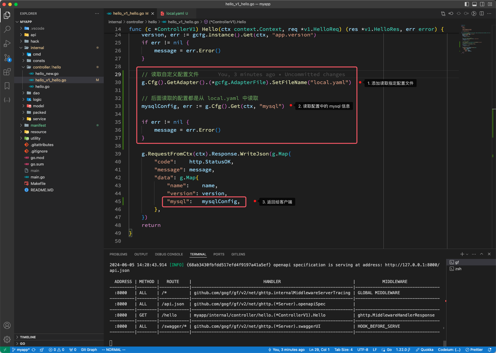

3. 在浏览器中访问 `http://localhost:8000/hello` 会得到如下信息：

    ```json
    {
        "code": 200,
        "message": "success",
        "data": {
            "mysql": {
                "database": "practice",
                "host": "127.0.0.1",
                "password": 123456,
                "port": 3306,
                "username": "root"
            },
            "name": "myapp",
            "version": "1.0.0"
        }
    }
    ```

上面的完整代码可查看 [github](https://github.com/clin211/goframe-practice/commit/abed661c77f1d9041b6a1a2325a9cf647f751141)

#### 默认文件修改

goframe 提供了以下3种方式修改默认文件名称：

1. 通过配置管理的 `SetFileName` 方法修改；也就是上面的方式。

```go
g.Cfg().GetAdapter().(*gcfg.AdapterFile).SetFileName("local.yaml")
```

1. 通过命令行修改启动参数 `--gf.gcfg.file`。

```sh
gf run main.go --gf.gcfg.file=local.yaml
```

1. 通过修改指定的环境变量 `--GF_GCFG_FILE`。

- 启动时修改环境变量

    ```go
    GF_GCFG_FILE=config.prod.toml; ./main
    ```

- 使用 genv 模块来修改环境变量

    ```go
    genv.Set("GF_GCFG_FILE", "config.prod.toml")
    ```

### 配置目录

#### 目录配置方法

gcfg 配置管理器支持非常灵活的多目录自动搜索功能，**通过 `SetPath` 可以修改目录管理目录为唯一的目录地址**，同时，我们推荐通过 `AddPath` 方法添加多个搜索目录，配置管理器底层将会**按照添加目录的顺序作为优先级进行自动检索**。直到检索到一个匹配的文件路径为止，如果在**所有搜索目录下查找不到配置文件，那么会返回失败**。

#### 默认目录配置

gcfg配置管理对象初始化时，默认会自动添加以下配置文件搜索目录：

当前工作目录及其下的 `config`、`manifest/config` 目录：例如当前的工作目录为 `/home/www` 时，将会添加：

- `/home/www`
- `/home/www/config`
- `/home/www/manifest/config`

当前可执行文件所在目录及其下的 `config`、`manifest/config` 目录：例如二进制文件所在目录为 `/tmp`时，将会添加：

- `/tmp`
- `/tmp/config`
- `/tmp/manifest/config`

当前main源代码包所在目录及其下的`config`、`manifest/config` 目录(仅对源码开发环境有效)：例如 `main` 包所在目录为 `/home/john/workspace/gf-app` 时，将会添加：

- `/home/john/workspace/gf-app`
- `/home/john/workspace/gf-app/config`
- `/home/john/workspace/gf-app/manifest/config`

#### 默认目录修改

**修改的参数必须是一个目录，不能是文件路径！！！**

goframe 仍然提供了灵活的配置文件搜索目录的修改方法，修改后将会只在该目录下执行配置文件的检索：

1. 通过配置管理器的 `SetPath()` 手动修改。

```go
g.Cfg().GetAdapter().(*gcfg.AdapterFile).SetPath("/opt/config")
```

1. 通过修改命令行启动参数 `--gf.gcfg.path`。

```sh
# 将配置文件的检索目录改为 /opt/config
$ gf run main.go --gf.gcfg.path=/opt/config/
```

1. 通过修改环境变量 `--GF_GCFG_PATH`。

- 启动时修改环境变量。

    ```sh
    GF_GCFG_PATH=/opt/config/; ./main
    ```

- 使用 genv 模块来修改环境变量

    ```sh
    genv.Set("GF_GCFG_PATH", "/opt/config")
    ```

#### 内容配置

gcfg 包也支持直接内容配置，而不是读取配置文件，常用于程序内部动态修改配置内容。通过以下包配置方法实现全局的配置。

```go
func (c *AdapterFile) SetContent(content string, file ...string)
func (c *AdapterFile) GetContent(file ...string) string
func (c *AdapterFile) RemoveContent(file ...string)
func (c *AdapterFile) ClearContent()
```

需要注意的是**该配置是全局生效的，并且优先级会高于读取配置文件**。因此，假如我们通过 `SetContent("v = 1", "config.toml")` 配置了 `config.toml` 的配置内容，并且也同时存在 `config.toml` 配置文件，那么只会使用到 `SetContent` 的配置内容，而配置文件内容将会被忽略。

#### 层级访问

在默认提供的文件系统接口实现下，gcfg 组件支持按层级获取配置数据，层级访问默认通过英文 `.` 号指定，其中`pattern` 参数和 [通用编解码-gjson](https://goframe.org/pages/viewpage.action?pageId=1114881) 的 `pattern` 参数一致。例如以下配置（config.yaml）

```yml
server:
    address: ':8199'
    serverRoot: 'resource/public'

database:
    default:
        link: 'mysql:root:12345678@tcp(127.0.0.1:3306)/focus'
        debug: true
```

针对以上配置文件内容的层级读取：

```go
// :8199
g.Cfg().Get(ctx, "server.address")

// true
g.Cfg().Get(ctx, "database.default.debug")
```

### 常用方法

> 在 goframe 2.7.1 版本中，有下面的方法，在未来的版本可能有删改。

- New
- NewWithAdapter
- Instance
- SetAdapter
- GetAdapter
- Available
- Get
- GetWithEnv
- GetWithCmd
- Data
- MustGet
- MustGetWithEnv
- MustGetWithCmd
- MustData

## 日志组件

日志在业务开发中，是必不可少的一个模块，goframe 也不例外，也实现了日志管理模块，

### 介绍

使用方式：

```go
import "github.com/gogf/gf/v2/os/glog"
```

所有方法：

```go
type ILogger interface {
	Print(ctx context.Context, v ...interface{})
	Printf(ctx context.Context, format string, v ...interface{})
	Debug(ctx context.Context, v ...interface{})
	Debugf(ctx context.Context, format string, v ...interface{})
	Info(ctx context.Context, v ...interface{})
	Infof(ctx context.Context, format string, v ...interface{})
	Notice(ctx context.Context, v ...interface{})
	Noticef(ctx context.Context, format string, v ...interface{})
	Warning(ctx context.Context, v ...interface{})
	Warningf(ctx context.Context, format string, v ...interface{})
	Error(ctx context.Context, v ...interface{})
	Errorf(ctx context.Context, format string, v ...interface{})
	Critical(ctx context.Context, v ...interface{})
	Criticalf(ctx context.Context, format string, v ...interface{})
	Panic(ctx context.Context, v ...interface{})
	Panicf(ctx context.Context, format string, v ...interface{})
	Fatal(ctx context.Context, v ...interface{})
	Fatalf(ctx context.Context, format string, v ...interface{})
}
```

glog 组件具有以下显著特性：

- 使用简便，功能强大
- 支持配置管理，使用统一的配置组件
- 支持日志级别
- 支持颜色打印
- 支持链式操作
- 支持指定输出日志文件/目录
- 支持链路跟踪
- 支持异步输出
- 支持堆栈打印
- 支持调试信息开关
- 支持自定义 Writer 输出接口
- 支持自定义日志 Handler 处理
- 支持自定义日志 CtxKeys 键值
- 支持 JSON 格式打印
- 支持 Flags 特性
- 支持 Rotate 滚动切分特性

### 日志配置管理

日志的配置使用的是框架统一的配置组件，支持多种文件格式，也支持配置中心、接口化扩展等特性。

日志组件支持配置文件，当使用 `g.Log(单例名称)` 获取 Logger 单例对象时，将会自动通过默认的配置管理对象获取对应的 Logger 配置。默认情况下会读取 `logger.` 单例名称配置项，当该配置项不存在时，将会读取默认的 logger 配置项。配置项请参考配置对象结构定义（[glog_logger_config.go#L25](https://github.com/clin211/goframe-practice/blob/goframe-code/os/glog/glog_logger_config.go#L25)）：

```go
// Config is the configuration object for logger.
type Config struct {
	Handlers             []Handler      `json:"-"`                    // Logger handlers which implement feature similar as middleware.
	Writer               io.Writer      `json:"-"`                    // Customized io.Writer.
	Flags                int            `json:"flags"`                // Extra flags for logging output features.
	TimeFormat           string         `json:"timeFormat"`           // Logging time format
	Path                 string         `json:"path"`                 // Logging directory path.
	File                 string         `json:"file"`                 // Format pattern for logging file.
	Level                int            `json:"level"`                // Output level.
	Prefix               string         `json:"prefix"`               // Prefix string for every logging content.
	StSkip               int            `json:"stSkip"`               // Skipping count for stack.
	StStatus             int            `json:"stStatus"`             // Stack status(1: enabled - default; 0: disabled)
	StFilter             string         `json:"stFilter"`             // Stack string filter.
	CtxKeys              []interface{}  `json:"ctxKeys"`              // Context keys for logging, which is used for value retrieving from context.
	HeaderPrint          bool           `json:"header"`               // Print header or not(true in default).
	StdoutPrint          bool           `json:"stdout"`               // Output to stdout or not(true in default).
	LevelPrint           bool           `json:"levelPrint"`           // Print level format string or not(true in default).
	LevelPrefixes        map[int]string `json:"levelPrefixes"`        // Logging level to its prefix string mapping.
	RotateSize           int64          `json:"rotateSize"`           // Rotate the logging file if its size > 0 in bytes.
	RotateExpire         time.Duration  `json:"rotateExpire"`         // Rotate the logging file if its mtime exceeds this duration.
	RotateBackupLimit    int            `json:"rotateBackupLimit"`    // Max backup for rotated files, default is 0, means no backups.
	RotateBackupExpire   time.Duration  `json:"rotateBackupExpire"`   // Max expires for rotated files, which is 0 in default, means no expiration.
	RotateBackupCompress int            `json:"rotateBackupCompress"` // Compress level for rotated files using gzip algorithm. It's 0 in default, means no compression.
	RotateCheckInterval  time.Duration  `json:"rotateCheckInterval"`  // Asynchronously checks the backups and expiration at intervals. It's 1 hour in default.
	StdoutColorDisabled  bool           `json:"stdoutColorDisabled"`  // Logging level prefix with color to writer or not (false in default).
	WriterColorEnable    bool           `json:"writerColorEnable"`    // Logging level prefix with color to writer or not (false in default).
	internalConfig
}
```

完整配置文件配置项及说明如下，其中配置项名称不区分大小写：

```go
logger:
  path:                  "/var/log/"           # 日志文件路径。默认为空，表示关闭，仅输出到终端
  file:                  "{Y-m-d}.log"         # 日志文件格式。默认为"{Y-m-d}.log"
  prefix:                ""                    # 日志内容输出前缀。默认为空
  level:                 "all"                 # 日志输出级别
  timeFormat:            "2006-01-02T15:04:05" # 自定义日志输出的时间格式，使用Golang标准的时间格式配置
  ctxKeys:               []                    # 自定义Context上下文变量名称，自动打印Context的变量到日志中。默认为空
  header:                true                  # 是否打印日志的头信息。默认true
  stdout:                true                  # 日志是否同时输出到终端。默认true
  rotateSize:            0                     # 按照日志文件大小对文件进行滚动切分。默认为0，表示关闭滚动切分特性
  rotateExpire:          0                     # 按照日志文件时间间隔对文件滚动切分。默认为0，表示关闭滚动切分特性
  rotateBackupLimit:     0                     # 按照切分的文件数量清理切分文件，当滚动切分特性开启时有效。默认为0，表示不备份，切分则删除
  rotateBackupExpire:    0                     # 按照切分的文件有效期清理切分文件，当滚动切分特性开启时有效。默认为0，表示不备份，切分则删除
  rotateBackupCompress:  0                     # 滚动切分文件的压缩比（0-9）。默认为0，表示不压缩
  rotateCheckInterval:   "1h"                  # 滚动切分的时间检测间隔，一般不需要设置。默认为1小时
  stdoutColorDisabled:   false                 # 关闭终端的颜色打印。默认开启
  writerColorEnable:     false                 # 日志文件是否带上颜色。默认false，表示不带颜色
```

level 配置项使用字符串配置，按照日志级别支持以下配置：`DEBU < INFO < NOTI < WARN < ERRO < CRIT`，也支持`ALL`, `DEV`, `PROD` 常见部署模式配置名称；level 配置项字符串不区分大小写。

- **默认配置项**：

    ```yml
    logger:
        path: '/var/log'
        level: 'all'
        stdout: false
    ```

    随后可以使用**g.Log()获取默认的单例对象时自动获取并设置该配置**。

- 多个配置项
  多个Logger的配置示例：

    ```go
    logger:
    path:    "/var/log"
    level:   "all"
    stdout:  false
    logger1:
      path:    "/var/log/logger1"
      level:   "dev"
      stdout:  false
    logger2:
      path:    "/var/log/logger2"
      level:   "prod"
      stdout:  true
    ```

    可以通过单例对象名称获取对应配置的 Logger 单例对象：

    ```go
    // 对应 logger.logger1 配置项
    l1 := g.Log("logger1")
    // 对应 logger.logger2 配置项
    l2 := g.Log("logger2")
    // 对应默认配置项 logger
    l3 := g.Log("none")
    // 对应默认配置项 logger
    l4 := g.Log()
    ```

#### 配置方法（高级）

配置方法用于模块化使用 glog 时由开发者自己进行配置管理。

方法列表：

- 可以通过 `SetConfig` 及 `SetConfigWithMap` 来设置。
- 可以使用 Logger 对象的 `Set*` 方法进行特定配置的设置。
- 主要注意的是，**配置项在Logger对象执行日志输出之前设置，避免并发安全问题**。

可以使用 `SetConfigWithMap()` 通过 `Key-Value` 键值对来设置/修改 Logger 的特定配置，其余的配置使用默认配置即可。

> 其中 Key 的名称即是 Config 这个 struct 中的属性名称，并且不区分大小写，单词间也支持使用 `-/_/` 空格符号连接，具体可参考 [类型转换-Struct转换](https://goframe.org/pages/viewpage.action?pageId=1114345) 章节的转换规则。

示例如下：

```go
logger := glog.New()
logger.SetConfigWithMap(g.Map{
	"path":     "/var/log",
	"level":    "all",
	"stdout":   false,
	"StStatus": 0,
})
logger.Print("test")
```

其中 `StStatus` 表示是否开启堆栈打印，设置为 0 表示关闭。键名也可以使用 `stStatus`, `st-status`, `st_status`, `St Status`，其他配置属性以此类推。

### 日志级别

对日志进行分类，可以通过设定特定的日志级别来关闭或者开启特定的日志内容。

#### SetLevel

通过 `SetLevel` 方法可以设置日志级别，glog 模块支持以下几种日志级别常量设定：

```txt
LEVEL_ALL
LEVEL_DEV
LEVEL_PROD
LEVEL_DEBU
LEVEL_INFO
LEVEL_NOTI
LEVEL_WARN
LEVEL_ERRO
```

我们可以通过位操作组合使用这几种级别，例如其中 `LEVEL_AL`L 等价于 `LEVEL_DEBU | LEVEL_INFO | LEVEL_NOTI | LEVEL_WARN | LEVEL_ERRO | LEVEL_CRIT`。还可以通过 `LEVEL_ALL & ^LEVEL_DEBU & ^LEVEL_INFO & ^LEVEL_NOTI` 来过滤掉 `LEVEL_DEBU/LEVEL_INFO/LEVEL_NOTI` 日志内容。

```go
// 打印日志
logger := glog.New()
logger.Infof(ctx, "mysql config: %v", mysqlConfig)

// 设置日志等级
logger.SetLevel(glog.LEVEL_ALL | glog.LEVEL_INFO)
logger.Infof(ctx, "version: %v", version)
```

```txt
2024-06-05 19:13:19.174 [INFO] {28c77656d110d6175053427d308d811a} mysql config: {"database":"practice","host":"127.0.0.1","password":123456,"port":3306,"username":"root"}
2024-06-05 19:13:19.174 [INFO] {28c77656d110d6175053427d308d811a} version: 1.0.0
```

#### SetLevelStr

大部分场景下我们可以通过 `SetLevelStr` 方法来通过字符串设置日志级别，配置文件中的 level 配置项也是通过字符串来配置日志级别。支持的日志级别字符串如下，不区分大小写：

```go
"ALL":      LEVEL_DEBU | LEVEL_INFO | LEVEL_NOTI | LEVEL_WARN | LEVEL_ERRO | LEVEL_CRIT,
"DEV":      LEVEL_DEBU | LEVEL_INFO | LEVEL_NOTI | LEVEL_WARN | LEVEL_ERRO | LEVEL_CRIT,
"DEVELOP":  LEVEL_DEBU | LEVEL_INFO | LEVEL_NOTI | LEVEL_WARN | LEVEL_ERRO | LEVEL_CRIT,
"PROD":     LEVEL_WARN | LEVEL_ERRO | LEVEL_CRIT,
"PRODUCT":  LEVEL_WARN | LEVEL_ERRO | LEVEL_CRIT,
"DEBU":     LEVEL_DEBU | LEVEL_INFO | LEVEL_NOTI | LEVEL_WARN | LEVEL_ERRO | LEVEL_CRIT,
"DEBUG":    LEVEL_DEBU | LEVEL_INFO | LEVEL_NOTI | LEVEL_WARN | LEVEL_ERRO | LEVEL_CRIT,
"INFO":     LEVEL_INFO | LEVEL_NOTI | LEVEL_WARN | LEVEL_ERRO | LEVEL_CRIT,
"NOTI":     LEVEL_NOTI | LEVEL_WARN | LEVEL_ERRO | LEVEL_CRIT,
"NOTICE":   LEVEL_NOTI | LEVEL_WARN | LEVEL_ERRO | LEVEL_CRIT,
"WARN":     LEVEL_WARN | LEVEL_ERRO | LEVEL_CRIT,
"WARNING":  LEVEL_WARN | LEVEL_ERRO | LEVEL_CRIT,
"ERRO":     LEVEL_ERRO | LEVEL_CRIT,
"ERROR":    LEVEL_ERRO | LEVEL_CRIT,
"CRIT":     LEVEL_CRIT,
"CRITICAL": LEVEL_CRIT,
```

可以看到，通过级别名称设置的日志级别是按照日志级别的高低来进行过滤的：`DEBU < INFO < NOTI < WARN < ERRO < CRIT`，也支持`AL`L, `DEV`, `PROD` 常见部署模式配置名称。

使用示例：

```go
package main

import (
	"context"

	"github.com/gogf/gf/v2/os/glog"
)

func main() {
	ctx := context.TODO()
	l := glog.New()
	l.Info(ctx, "info1")
	l.SetLevelStr("notice")
	l.Info(ctx, "info2")
}
```

执行后，输出结果为：

```txt
2024-06-05 19:18:13.134 [INFO] info1
```

#### SetLevelPrint

控制默认日志输出是否打印日志级别标识，默认会打印日志级别标识。
使用示例如下：

```go
package main

import (
	"context"

	"github.com/gogf/gf/v2/os/glog"
)

func main() {
	ctx := context.TODO()
	l := glog.New()
	l.Info(ctx, "info1")
	l.SetLevelPrint(false)
	l.Info(ctx, "info2")
}
```

执行结果如下：

```txt
2024-06-05 19:28:03.20 [INFO] info1
2024-06-05 19:28:03.128 info1
```

### 日志文件目录配置

#### 日志文件

默认情况下，日志文件名称以当前时间日期命名，格式为 `YYYY-MM-DD.log`，我们可以使用 `SetFile()` 来设置文件名称的格式，并且文件名称格式支持 时间管理-gtime 时间格式 。简单示例：

```go
package main

import (
	"context"

	"github.com/gogf/gf/v2/frame/g"
	"github.com/gogf/gf/v2/os/gfile"
	"github.com/gogf/gf/v2/os/glog"
)

// 设置日志等级
func main() {
	ctx := context.TODO()
	path := "./glog"
	glog.SetPath(path)
	glog.SetStdoutPrint(false)

	// 使用默认文件名称格式
	glog.Print(ctx, "标准文件名称格式，使用当前时间时期")

	// 通过SetFile设置文件名称格式
	glog.SetFile("stdout.log")

	glog.Print(ctx, "设置日志输出文件名称格式为同一个文件")

	// 链式操作设置文件名称格式
	glog.File("stderr.log").Print(ctx, "支持链式操作")
	glog.File("error-{Ymd}.log").Print(ctx, "文件名称支持带gtime日期格式")
	glog.File("access-{Ymd}.log").Print(ctx, "文件名称支持带gtime日期格式")

	list, err := gfile.ScanDir(path, "*")
	g.Dump(err)
	g.Dump(list)
}
```

执行后效果如下图：
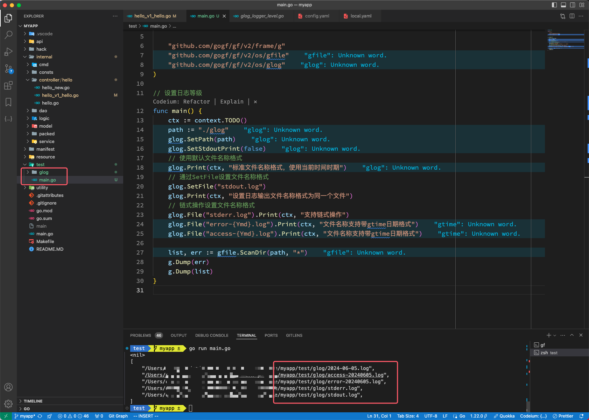

#### 日志目录

默认情况下，glog 将会输出日志内容到标准输出，我们可以通过 `SetPath()` 设置日志输出的目录路径，这样日志内容将会写入到日志文件中，并且由于其内部使用了 `gfpool` 文件指针池，文件写入的效率相当优秀。简单示例：

```go
package main

import (
	"context"

	"github.com/gogf/gf/v2/frame/g"
	"github.com/gogf/gf/v2/os/gfile"
	"github.com/gogf/gf/v2/os/glog"
)

// 设置日志等级
func main() {
	ctx := context.TODO()
	path := "./glog"
	glog.SetPath(path)
	glog.Print(ctx, "日志内容")
	list, err := gfile.ScanDir(path, "*")
	g.Dump(err)
	g.Dump(list)
}
```

执行后效果如下图：

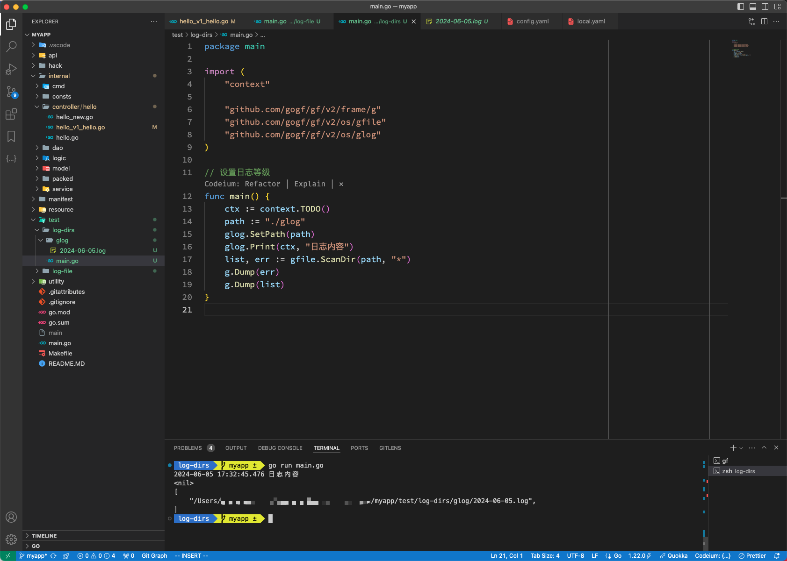

### 日志链式操作

主要的链式操作方法如下：

```go
// 重定向日志输出接口
func To(writer io.Writer) *Logger

// 日志内容输出到目录
func Path(path string) *Logger

// 设置日志文件分类
func Cat(category string) *Logger

// 设置日志文件格式
func File(file string) *Logger

// 设置日志打印级别
func Level(level int) *Logger

// 设置日志打印级别(字符串)
func LevelStr(levelStr string) *Logger

// 设置文件回溯值
func Skip(skip int) *Logger

// 是否开启trace打印
func Stack(enabled bool) *Logger

// 开启trace打印并设定过滤trace的字符串
func StackWithFilter(filter string) *Logger

// 是否开启终端输出
func Stdout(enabled ...bool) *Logger

// 是否输出日志头信息
func Header(enabled ...bool) *Logger

// 输出日志调用行号信息
func Line(long ...bool) *Logger

// 异步输出日志
func Async(enabled ...bool) *Logger
```

#### 基本使用

```go
package main

import (
	"context"

	"github.com/gogf/gf/v2/frame/g"
	"github.com/gogf/gf/v2/os/gfile"
)

func main() {
	ctx := context.TODO()
	path := "/tmp/glog-cat"
	g.Log().SetPath(path)
	g.Log().Stdout(false).Cat("cat1").Cat("cat2").Print(ctx, "test")
	list, err := gfile.ScanDir(path, "*", true)
	g.Dump(err)
	g.Dump(list)
}
```

执行结果如下：
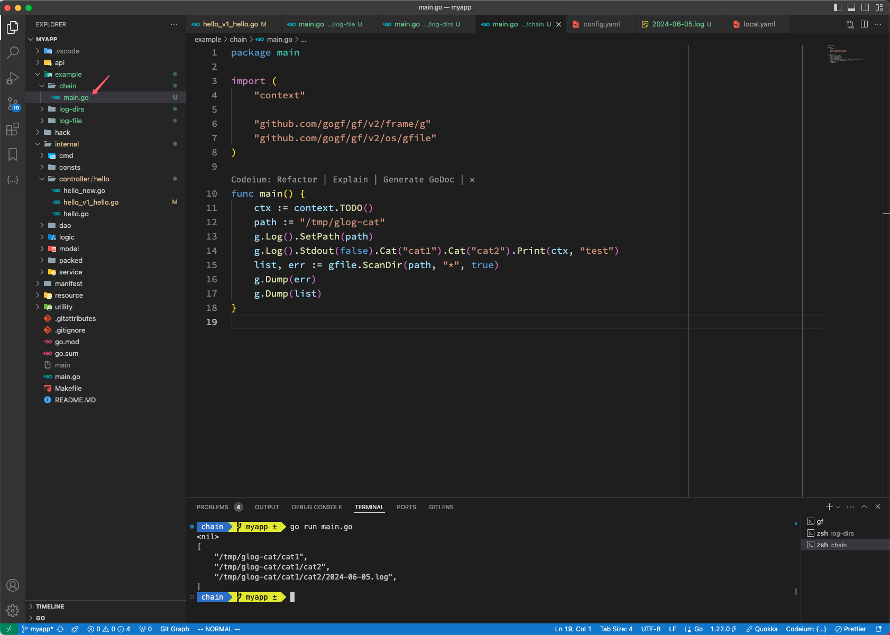

#### 打印调用行号

```go
package main

import (
	"context"

	"github.com/gogf/gf/v2/frame/g"
)

func main() {
	ctx := context.TODO()
	g.Log().Line().Print(ctx, "this is the short file name with its line number")
	g.Log().Line(true).Print(ctx, "lone file name with line number")
}
```

执行后效果如下：
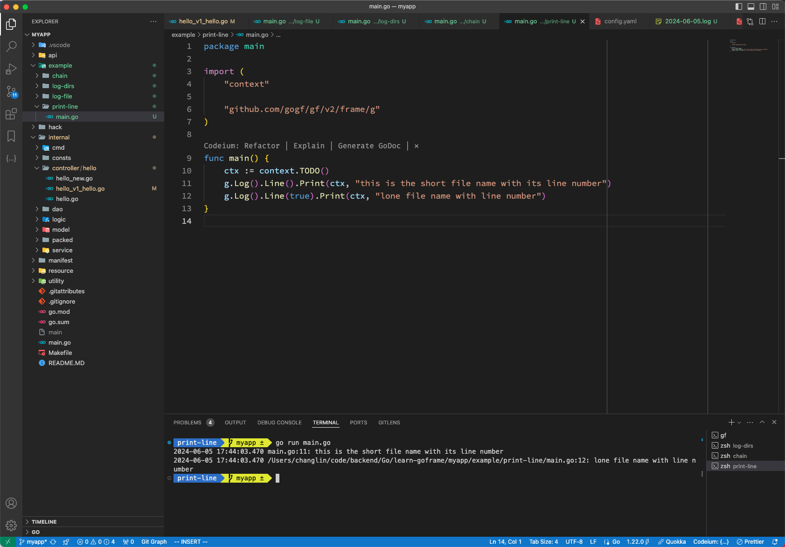

### 日志颜色打印

可以增加日志的可查看性，打印日志时，会将错误等级文字通过添加字体颜色的方式突出显示。

#### 基本使用

```go
package main

import (
	"context"

	"github.com/gogf/gf/v2/frame/g"
)

func main() {
	ctx := context.TODO()
	g.Log().Debug(ctx, "Debug")
	g.Log().Info(ctx, "Info")
	g.Log().Notice(ctx, "Notice")
	g.Log().Warning(ctx, "Warning")
	g.Log().Error(ctx, "Error")
}
```

执行后效果如下：
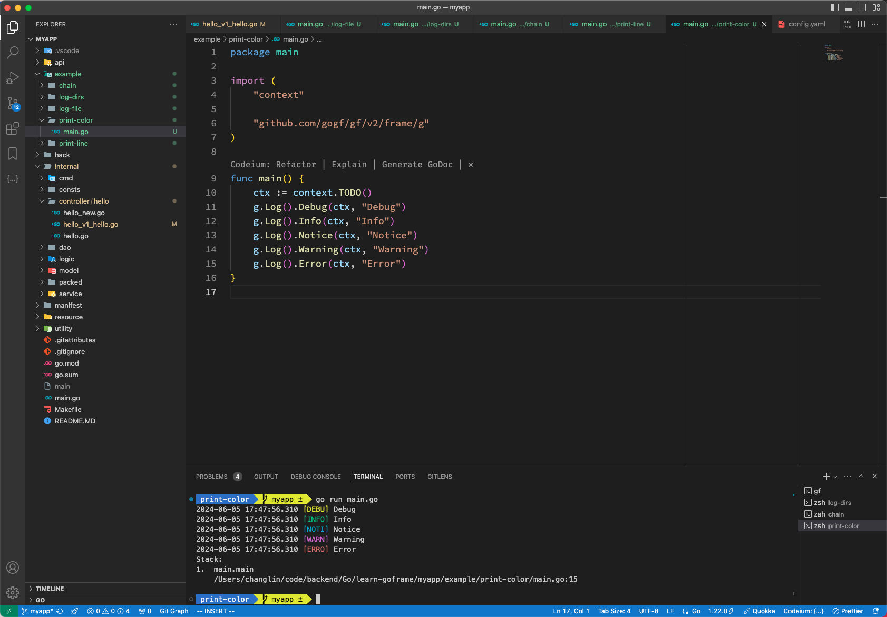

#### 使用配置

控制台是必然会自带颜色输出的，文件日志默认不带颜色；若需要在文件中的日志也带上颜色可以在配置文件中添加配置。

```yml
logger:
    stdoutColorDisabled: false # 是否关闭终端的颜色打印。默认否，表示终端的颜色输出。
    writerColorEnable: false # 是否开启Writer的颜色打印。默认否，表示不输出颜色到自定义的Writer或者文件。
```

也可以在代码中添加：

```go
g.Log().SetWriterColorEnable(true)
```

#### 日志组件上下文对象

从v2版本开始，glog 组件将 `ctx` 上下文变量作为日志打印的必需参数。

#### 配置

```yml
# 日志组件配置
logger:
    Level: 'all'
    Stdout: true
    CtxKeys: ['RequestId', 'UserId']
```

其中 `CtxKeys` 用于配置需要从 `context.Context` 接口对象中读取并输出的键名。

#### 日志输出

使用上述配置，然后在输出日志的时候，通过 `Ctx` 链式操作方法指定输出的 `context.Context` 接口对象，例如：

```go
package main

import (
	"context"

	"github.com/gogf/gf/v2/frame/g"
)

func main() {
	var ctx = context.Background()
	ctx = context.WithValue(ctx, "RequestId", "123456789")
	ctx = context.WithValue(ctx, "UserId", "10000")
	g.Log().Error(ctx, "runtime error")
}
```

执行后效果如下：

```sh
$ go run main.go
2024-06-05 19:54:27.726 [ERRO] runtime error
Stack:
1.  main.main
    /Users/xxx/myapp/example/logger-context/main.go:13
```

### 日志 JSON 格式

glog 对日志分析工具非常友好，支持输出 JSON 格式的日志内容，以便于后期对日志内容进行解析分析。

#### 使用map/struct参数

想要支持 JSON 数据格式的日志输出非常简单，给打印方法提供 map/struct 类型参数即可。

使用示例：

```go
package main

import (
	"context"

	"github.com/gogf/gf/v2/frame/g"
)

func main() {
	ctx := context.TODO()
	g.Log().Debug(ctx, g.Map{"uid": 100, "name": "john"})
	type User struct {
		Uid  int    `json:"uid"`
		Name string `json:"name"`
	}
	g.Log().Debug(ctx, User{100, "john"})
}
```

执行后效果如下：
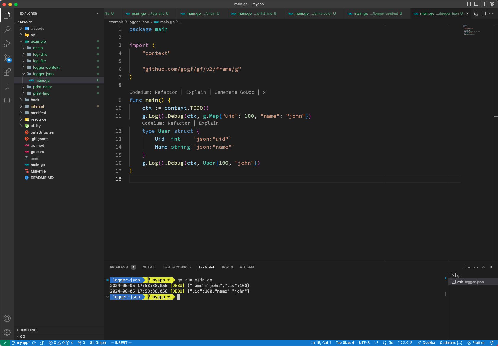

### 日志的堆栈打印

错误日志信息支持 Stack 特性，该特性可以自动打印出当前调用日志组件方法的堆栈信息，该堆栈信息可以通过 `Notice*/Warning*/Error*/Critical*/Panic*/Fatal*` 等错误日志输出方法触发，也可以通过 `GetStack/PrintStack` 获取/打印。错误信息的 stack 信息对于调试来说相当有用。

有以下三个方法可以使用：

- 通过 `Error` 方法触发

    ```go
    glog.Error(ctx, "This is error!")
    ```

- 通过 `Stack` 方法打印

    ```go
    package main

    import (
        "context"
        "fmt"

        "github.com/gogf/gf/v2/os/glog"
    )

    func main() {
        ctx := context.TODO()
        glog.PrintStack(ctx)
        glog.New().PrintStack(ctx)

        fmt.Println(glog.GetStack())
        fmt.Println(glog.New().GetStack())
    }
    ```

- 打印 `gerror.Error`

    ```go
    gerror.New("connection closed with gerror")
    ```

日志组件的其余高级使用姿势请看[官方文档](https://goframe.org/pages/viewpage.action?pageId=1114673)，这里就不一一列举了。

## 错误处理

gerror 组件是 goframe 框架统一的错误处理组件，框架所有组件如果存在错误返回时，均带有堆栈信息，方便开发者快速定位问题。

### 常用方法

- `New/Newf`：创建一个自定义错误信息的error对象，并包含堆栈信息。
- `Wrap/Wrapf`：包裹其他错误error对象，构造成多级的错误信息，包含堆栈信息。
- `NewSkip/NewSkipf`：创建一个自定义错误信息的error对象，并且忽略部分堆栈信息（按照当前调用方法位置往上忽略）。高级功能，一般开发者很少用得到。

### 堆栈特性

- `HasStack` 判断错误是否带堆栈

    ```go
    err1 := errors.New("sql error")
    err2 := gerror.New("write error")
    fmt.Println(gerror.HasStack(err1))
    fmt.Println(gerror.HasStack(err2))
    ```

- `Stack` 获取完整的堆栈信息

    ```go
    var err error
    err = errors.New("sql error")
    err = gerror.Wrap(err, "adding failed")
    err = gerror.Wrap(err, "api calling failed")
    fmt.Println(gerror.Stack(err))
    ```

- `Current` 获取当前层级的错误信息

    ```go
    var err error
    err = errors.New("sql error")
    err = gerror.Wrap(err, "adding failed")
    err = gerror.Wrap(err, "api calling failed")
    fmt.Println(err)
    fmt.Println(gerror.Current(err))
    ```

- `Next/Unwrap` 获取层级错误的下一级错误 `error` 接口对象
    1. 简单的错误层级访问示例

        ```go
        var err error
        err = errors.New("sql error")
        err = gerror.Wrap(err, "adding failed")
        err = gerror.Wrap(err, "api calling failed")

        fmt.Println(err)

        err = gerror.Next(err)
        fmt.Println(err)

        err = gerror.Next(err)
        fmt.Println(err)
        ```

    2. 常见遍历逻辑代码示例

        ```go
        func IsGrpcErrorNotFound(err error) bool {
            if err != nil {
                for e := err; e != nil; e = gerror.Unwrap(e) {
                    if s, ok := status.FromError(e); ok && s != nil && s.Code() == codes.NotFound {
                        return true
                    }
                }
            }
            return false
        }
        ```

- `Cause` 获得 `error` 对象的根错误信息（原始错误）

### 错误比较

使用的 `Equal()` 和 `Is()` 两个方法。

使用示例：

```go
func ExampleEqual() {
	err1 := errors.New("permission denied")
	err2 := gerror.New("permission denied")
	err3 := gerror.NewCode(gcode.CodeNotAuthorized, "permission denied")
	fmt.Println(gerror.Equal(err1, err2)) // true
	fmt.Println(gerror.Equal(err2, err3)) // false
}

func ExampleIs() {
	err1 := errors.New("permission denied")
	err2 := gerror.Wrap(err1, "operation failed")
	fmt.Println(gerror.Is(err1, err1)) // false
	fmt.Println(gerror.Is(err2, err2)) // true
	fmt.Println(gerror.Is(err2, err1)) // true
	fmt.Println(gerror.Is(err1, err2)) // false
}
```

### 错误码的特性

#### 错误码的使用

**创建带错误码的 error**

- `NewCode/NewCodef` 创建一个自定义错误信息的 `error` 对象，并包含堆栈信息，并增加错误码对象的输入。

    ```go
    func ExampleNewCode() {
        err := gerror.NewCode(gcode.New(10000, "", nil), "My Error")
        fmt.Println(err.Error())
        fmt.Println(gerror.Code(err))

        // Output:
        // My Error
        // 10000
    }

    func ExampleNewCodef() {
        err := gerror.NewCodef(gcode.New(10000, "", nil), "It's %s", "My Error")
        fmt.Println(err.Error())
        fmt.Println(gerror.Code(err).Code())

        // Output:
        // It's My Error
        // 10000
    }
    ```

- `WrapCode/WrapCodef` 用于包裹其他错误 `error` 对象，构造成多级的错误信息，包含堆栈信息，并增加错误码参数的输入。

    ```go
    func ExampleWrapCode() {
        err1 := errors.New("permission denied")
        err2 := gerror.WrapCode(gcode.New(10000, "", nil), err1, "Custom Error")
        fmt.Println(err2.Error())              // Custom Error: permission denied
        fmt.Println(gerror.Code(err2).Code())  // 10000
    }

    func ExampleWrapCodef() {
        err1 := errors.New("permission denied")
        err2 := gerror.WrapCodef(gcode.New(10000, "", nil), err1, "It's %s", "Custom Error")
        fmt.Println(err2.Error())              // It's Custom Error: permission denied
        fmt.Println(gerror.Code(err2).Code())  // 10000
    }
    ```

    - `NewCodeSkip/NewCodeSkipf` 用于创建一个自定义错误信息的 `error` 对象，并且忽略部分堆栈信息（按照当前调用方法位置往上忽略），并增加错误参数输入。

**获取error中的错误码接口**

```go
func Code(err error) gcode.Code
```

#### 错误码接口

框架提供了默认实现 `gcode.Code` 的结构体，开发者可以直接通过 `New/WithCode` 方法创建错误码，示例如下：

```go
func ExampleNew() {
	c := gcode.New(1, "custom error", "detailed description")
	fmt.Println(c.Code())    // 1
	fmt.Println(c.Message()) // custom error
	fmt.Println(c.Detail())  // detailed description
}
```

框架默认实现 `gcode.Code` 的结构体不满足需求，可以自行定义，只需实现 `gcode.Code` 即可。

#### 错误码扩展

当业务需要复杂的错误码定义时，我们推荐灵活使用错误码的 `Detail` 参数来扩展错误码功能。

#### 错误码实现

当业务需要更复杂的错误码定义时，我们可以自定义实现业务自己的错误码，只需要实现 `gcode.Code` 相关的接口即可。

#### 内置错误码

```go
var (
	CodeNil                       = localCode{-1, "", nil}                             // No error code specified.
	CodeOK                        = localCode{0, "OK", nil}                            // It is OK.
	CodeInternalError             = localCode{50, "Internal Error", nil}               // An error occurred internally.
	CodeValidationFailed          = localCode{51, "Validation Failed", nil}            // Data validation failed.
	CodeDbOperationError          = localCode{52, "Database Operation Error", nil}     // Database operation error.
	CodeInvalidParameter          = localCode{53, "Invalid Parameter", nil}            // The given parameter for current operation is invalid.
	CodeMissingParameter          = localCode{54, "Missing Parameter", nil}            // Parameter for current operation is missing.
	CodeInvalidOperation          = localCode{55, "Invalid Operation", nil}            // The function cannot be used like this.
	CodeInvalidConfiguration      = localCode{56, "Invalid Configuration", nil}        // The configuration is invalid for current operation.
	CodeMissingConfiguration      = localCode{57, "Missing Configuration", nil}        // The configuration is missing for current operation.
	CodeNotImplemented            = localCode{58, "Not Implemented", nil}              // The operation is not implemented yet.
	CodeNotSupported              = localCode{59, "Not Supported", nil}                // The operation is not supported yet.
	CodeOperationFailed           = localCode{60, "Operation Failed", nil}             // I tried, but I cannot give you what you want.
	CodeNotAuthorized             = localCode{61, "Not Authorized", nil}               // Not Authorized.
	CodeSecurityReason            = localCode{62, "Security Reason", nil}              // Security Reason.
	CodeServerBusy                = localCode{63, "Server Is Busy", nil}               // Server is busy, please try again later.
	CodeUnknown                   = localCode{64, "Unknown Error", nil}                // Unknown error.
	CodeNotFound                  = localCode{65, "Not Found", nil}                    // Resource does not exist.
	CodeInvalidRequest            = localCode{66, "Invalid Request", nil}              // Invalid request.
	CodeNecessaryPackageNotImport = localCode{67, "Necessary Package Not Import", nil} // It needs necessary package import.
	CodeInternalPanic             = localCode{68, "Internal Panic", nil}               // An panic occurred internally.
	CodeBusinessValidationFailed  = localCode{300, "Business Validation Failed", nil}  // Business validation failed.
)
```

#### 错误码的其他特性

- NewOption自定义的错误创建

    ```go
    func ExampleNewOption() {
        err := gerror.NewOption(gerror.Option{
            Text: "this feature is disabled in this storage",
            Code: gcode.CodeNotSupported,
        })
    }
    ```

- fmt 格式化

    通过 `%+v` 的打印格式可以打印出完整的堆栈信息，当然 `gerror.Error` 对象支持多种fmt格式：

    | 格式符   | 输出内容                                                           |
    | -------- | ------------------------------------------------------------------ |
    | %v, %s   | 打印所有的层级错误信息，构成完成的字符串返回，多个层级使用`:`拼接  |
    | %-v, %-s | 打印当前层级的错误信息，返回字符串                                 |
    | %+s      | 打印完整的堆栈信息列表                                             |
    | %+v      | 打印所有的层级错误信息字符串，以及完整的堆栈信息，等同于 `%s\n%+s` |

- 日志输出支持

    glog日志管理模块天然支持对 `gerror` 错误堆栈打印支持，这种支持不是强耦合性的，而是通过fmt格式化打印接口支持的。

- 堆栈打印模式

    错误组件在打印堆栈信息时支持通过环境变量(`GF_GERROR_STACK_MODE`)或者命令行启动参数(`gf.gerror.stack.mode`)指定堆栈打印信息模式：

    | 堆栈模式 | 说明                                                       |
    | -------- | ---------------------------------------------------------- |
    | brief    | 简略模式。错误堆栈打印时，不会打印框架相关的堆栈           |
    | detail   | 详情模式。错误堆栈打印时，会打印完整的框架组件代码调用链路 |

    在 detail 下，将会打印错误对象中**完整的框架堆栈信息**。

#### 错误处理的最佳实践

1. 打印错误对象中的堆栈信息
   通过 fmt/glog 或者其他包打印错误对象时，默认情况下不会输出错误堆栈信息。如果要打印堆栈信息，应当使用 `%+v` 的格式化方式。示例如下（[在线代码](https://github.com/clin211/goframe-practice/commit/e638ccb16036bed1f135b462367c707a13186b9e)）：

    ```go
    package main

    import (
        "fmt"

        "github.com/gogf/gf/v2/encoding/gjson"
    )

    func main() {
        _, err := gjson.Encode(func() {})
        fmt.Printf("normal error line: %v\n\n", err)

        _, err = gjson.Encode(func() {})
        fmt.Printf("stack error line: %+v\n", err)
    }
    ```

    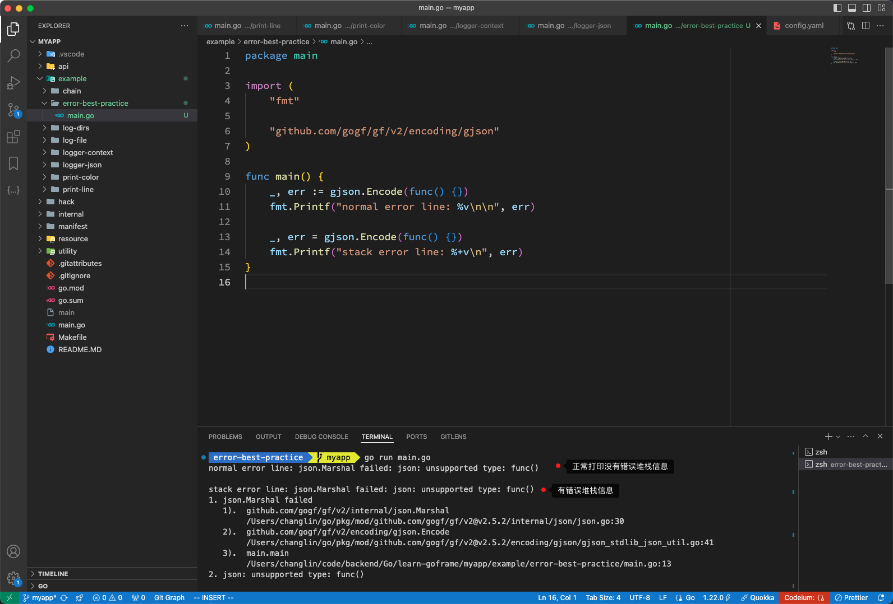

2. 正确的错误对象 Wrap 方式

    **当对错误对象进行 Wrap 时，不要将错误对象打印到 Wrap 的错误信息中，因为 Wrap 时本身会将目标错误对象包裹到创建的新的错误对象内部**。如果将错误信息再打印包含在错误字符串中，那么在打印错误堆栈的时候会出现错误信息重复。
