大家好，我是长林啊！一个 Go、Rust 爱好者，同时也是一名全栈开发者；致力于终生学习和技术分享。

在上一篇文章《深入探索GoFrame核心组件（一）》中，详细讨论了对象管理、调试模式、命令管理、配置管理、日志组件以及错误处理这些关键部分。接下来，我们将继续深入研究 GoFrame 的其他核心组件，包括数据校验、类型转换、缓存管理、模版引擎、I18N国际化和资源管理。我们一起来解锁更多 GoFrame 的高级使用技巧吧。

## 数据校验

GoFrame 框架中的 gvalid 组件是一款功能强大而灵活的数据/表单校验组件。它内置了数十种常见的校验规则，不仅支持单数据多规则校验和多数据多规则批量校验，还可以自定义错误信息、自定义正则校验，并能注册自定义校验规则。这个组件的设计灵感来源于经典的 PHP Laravel 框架。该组件还支持 i18n 国际化处理以及结构标签规则和提示信息的绑定等特性，无疑是目前最强大的 Go 数据校验模块。

### 校验规则
在日常业务开发中，数据校验是使用最频繁的功能之一，校验规则涉及到联合校验的场景时，规则中关联的参数名称会**自动按照不区分大小写且忽略特殊字符的形式进行智能匹配**。结构体属性中的v标签标识 validation 的缩写，用于设置该属性的校验规格。支持单数据多规则校验、多数据多规则批量校验、自定义错误信息、自定义正则校验、自定义校验规则注册、支持 struct tag 规则及提示信息绑定等特性，是目前功能最强大的 Go 数据校验模块。

#### 修饰规则

修饰规则本身没有任何的校验逻辑，而是修改后续功能规则的实现逻辑。

- ci（Case Insensitive）
  
  **在默认情况下是区分大小写匹配**，通过 `ci` 修饰规则，可以设置后续需要比较值的规则字段为不区分大小写。比如：`same`、`deifferent`、`in`、`not-in`等等。
  
  示例如下（[github 源码](https://github.com/clin211/goframe-practice/commit/133e3e8833e18d77d1c2b04a980dd1e961984fa1)）：
  ```go
  package main
  
  import (
      "net/http"
  
      "github.com/gogf/gf/v2/frame/g"   // 引入GoFrame框架
      "github.com/gogf/gf/v2/net/ghttp" // 引入GoFrame的HTTP包
  )
  
  // BizReq 是我们的数据结构，它有三个字段：Account，Password和Password2
  type BizReq struct {
      Account   string `v:"required"`                   // 必须有一个账户名
      Password  string `v:"required|ci|same:Password2"` // 必须有一个密码，并且它应该与Password2字段相同，ci表示大小写不敏感
      Password2 string `v:"required"`                   // 必须有一个Password2字段
  }
  
  func main() {
      s := g.Server()                             // 创建一个新的服务器实例
      s.BindHandler("/", func(r *ghttp.Request) { // 绑定一个处理器到根URL
          var data BizReq
          if err := r.Parse(&data); err != nil { // 尝试解析请求中的数据到我们的BizReq数据结构
              r.Response.WriteExit(err.Error()) // 如果有错误，我们将返回错误消息并退出
          }
  
          // 如果没有错误，我们将返回一个成功消息
          r.Response.WriteJson(g.Map{
              "code":    http.StatusOK,
              "message": "Account and Password validation passed",
              "data":    data,
          })
      })
      s.SetPort(8199) // 设置服务器端口为8199
      s.Run()         // 运行服务器
  }
  ```
  运行命令 `gf run main.go` 如下：
  
  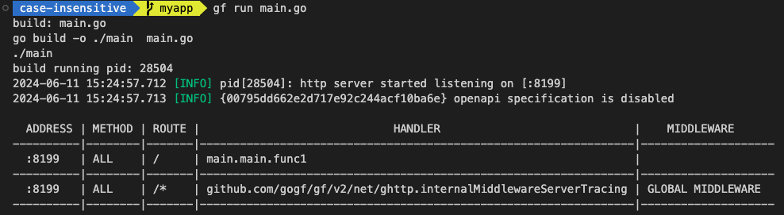
  
  在浏览器中访问 [http://localhost:8199/?account=cLin&password=Password123456&password2=password123456](http://localhost:8199/?account=cLin&password=Password123456&password2=password123456) 效果如下：
  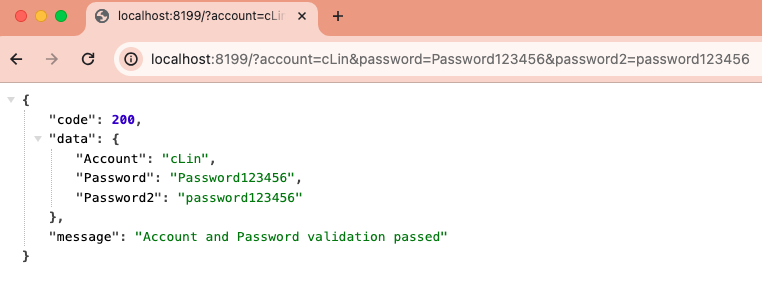
  
- bail 只要后续的多个校验中有一个规则校验失败则停止校验并立即返回校验结果。在框架的 HTTP Server 组件中，如果采用规范路由注册方式，在其自动校验特性中将会自动开启bail修饰规则。

  示例如下（[github 源码](https://github.com/clin211/goframe-practice/commit/8ece906659d62131346ad282e2c658c8f00dcc5e)）：
  ```go
  package main

  import (
      "context"
      "fmt"

      "github.com/gogf/gf/v2/frame/g" // 导入GoFrame框架
  )

  func main() {

      BailRule()
  }

  func BailRule() {
      // 定义一个结构体BizReq，包含四个字段：Account，QQ，Password，Password2
      type BizReq struct {
          Account   string `v:"bail|required|length:6,16|same:QQ"` //Account字段必须存在，长度在6-16之间，并且必须与QQ字段相同
          QQ        string // QQ字段没有特殊要求
          Password  string `v:"required|same:Password2"` // Password字段必须存在，并且必须与Password2字段相同
          Password2 string `v:"required"`                // Password2字段必须存在
      }
      var (
          ctx = context.Background() // 创建一个context背景
          req = BizReq{
              Account:   "clin",           // 设置Account为"clin"
              QQ:        "123456",         // 设置QQ为"123456"
              Password:  "password123456", // 设置Password为"password123456"
              Password2: "password123456", // 设置Password2为"password123456"
          }
      )
      if err := g.Validator().Data(req).Run(ctx); err != nil {
          fmt.Println(err) // 如果验证失败，打印错误信息
      }
  }
  ```

  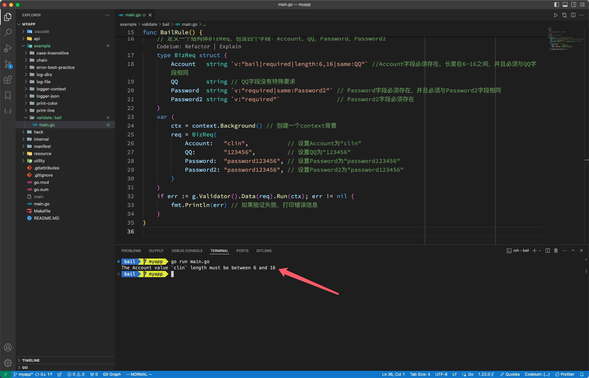

- foreach 用于数组参数，将待检验的参数作为数组遍历，并将后一个校验规则应用于数组中的每一项。

  示例如下（[github 源码](https://github.com/clin211/goframe-practice/commit/bc322b8abac007f1f226dd5c7d077ec29fa05d97)）：
  ```go
  package main
  
  import (
      "context"
      "fmt"
  
      "github.com/gogf/gf/v2/frame/g"
  )
  
  func main() {
      // 定义一个名为BizReq的结构体，有两个字段：Value1和Value2，都是整数数组
      type BizReq struct {
          Value1 []int `v:"foreach|in:1,2,3"` // Value1字段的每个元素都必须在1,2,3之中
          Value2 []int `v:"foreach|in:1,2,3"` // Value2字段的每个元素都必须在1,2,3之中
      }
      var (
          ctx = context.Background() // 创建一个上下文环境
          req = BizReq{
              Value1: []int{1, 2, 3}, // 设置Value1为1,2,3
              Value2: []int{3, 4, 5}, // 设置Value2为3,4,5
          }
      )
      // 验证数据，如果数据不满足验证规则，那么验证器会返回一个错误
      if err := g.Validator().Bail().Data(req).Run(ctx); err != nil {
          fmt.Println(err.String()) // 打印错误信息
      }
  }
  ```
  
  运行上面的代码，结果如下：
  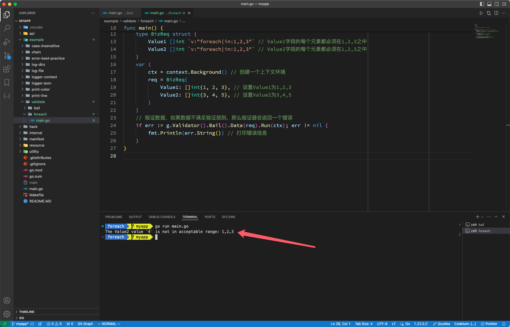
  
#### 功能规则
- required：**必需参数**，除了支持常见的字符串，**也支持 slice/map 类型**
- required-if：**必需参数**(当**任意所给定字段值与所给值相等时**，即：当field字段的值为value时，当前验证字段为必须参数)。**多个字段以`,`分隔**
- required-unless：**必需参数**(当**所给定字段值与所给值都不相等时**，即：当 field 字段的值不为 value 时，当前验证字段为必须参数)。多个字段以 `,` 分隔
- required-with：必需参数(当**所给定任意字段值其中之一不为空时**)
- required-with-all：必须参数(当所给定所有字段值全部都不为空时)
- required-without：必需参数(当所给定任意字段值其中之一为空时)
- required-without-all：必须参数(当所给定所有字段值全部都为空时)
- date：参数为常用日期类型，日期之间支持的连接符号`-`或`/`或`.`，也支持不带连接符号的8位长度日期，格式如： `2006-01-02`，`2006/01/02`，`2006.01.02`，`20060102`
- datetime：参数为常用日期时间类型，其中日期之间支持的连接符号只支持-，格式如： `2006-01-02 12:00:00`
- date-format：判断日期是否为指定的日期/时间格式，format参数格式为gtime日期格式(可以包含日期及时间)，格式说明参考章节：[gtime模块](https://goframe.org/pages/viewpage.action?pageId=1114883)
- before 判断给定的日期/时间是否在指定字段的日期/时间之前
- before-equal：判断给定的日期/时间是否在指定字段的日期/时间之前，或者与指定字段的日期/时间相等
- after：判断给定的日期/时间是否在指定字段的日期/时间之后
- after-equal：判断给定的日期/时间是否在指定字段的日期/时间之后，或者与指定字段的日期/时间相等
- array：判断给定的参数是否数组格式。如果给定的参数为JSON数组字符串，也将检验通过
- enums：校验提交的参数是否在字段类型的枚举值中。该规则需要结合gf gen enums命令一起使用，详情请参考：[枚举维护-gen enums](https://goframe.org/pages/viewpage.action?pageId=86187843)
- email：EMAIL邮箱地址格式
- phone：大中国区手机号格式
- phone-loose：宽松的手机号验证，只要满足 13、14、15、16、17、18、19开头的11位数字都可以通过验证。可用于非严格的业务场景
- telephone：大中国区座机电话号码，”XXXX-XXXXXXX”、”XXXX-XXXXXXXX”、”XXX-XXXXXXX”、”XXX-XXXXXXXX”、”XXXXXXX”、”XXXXXXXX”
- passport：通用帐号规则（字母开头，只能包含字母、数字和下划线，长度在6~18之间）
- password：通用密码规则（任意可见字符，长度在6~18之间）
- password2：中等强度密码（在通用密码规则的基础上，要求密码必须包含大小写字母和数字）
- password3：强等强度密码（在通用密码规则的基础上，必须包含大小写字母、数字和特殊字符）
- postcode：大中国区邮政编码规则
- resident-id：公民身份证号码
- bank-card：大中国区银行卡号校验
- qq：腾讯QQ号码规则
- ip：IPv4/IPv6地址
- ipv4：IPv4地址
- ipv6：IPv6地址
- mac：MAC地址
- url：URL
- domain：域名
- size：参数长度为 size (长度参数为整形)，注意底层使用 Unicode 计算长度，因此中文一个汉字占1个长度单位
- length：参数长度为 min 到 max( 长度参数为整形)，注意底层使用 Unicode 计算长度，因此中文一个汉字占1个长度单位
- min-length：参数长度最小为 min (长度参数为整形)，注意底层使用 Unicode 计算长度，因此中文一个汉字占1个长度单位
- max-length：参数长度最大为 max (长度参数为整形)，注意底层使用 Unicode 计算长度，因此中文一个汉字占1个长度单位
- between：参数大小为min到max(支持整形和浮点类型参数)
- min：参数大小最小为min(支持整形和浮点类型参数)
- max：参数大小最大为max(支持整形和浮点类型参数)
- json：判断数据格式为JSON
- integer：整数（正整数或者负整数）
- float：浮点数
- boolean：布尔值(1,true,on,yes为true | 0,false,off,no,""为false)
- same：参数值必需与field字段参数的值相同（在用户注册时，提交密码Password和确认密码Password2必须相等）
- different：参数值不能与field字段参数的值相同（备用邮箱OtherMailAddr和邮箱地址MailAddr必须不相同）
- eq：参数值必需与field字段参数的值相同。same规则的别名，功能同same规则
- not-eq：参数值必需与field字段参数的值不相同。different规则的别名，功能同different规则
- gt：参数值必需大于给定字段对应的值
- gte：参数值必需大于或等于给定字段对应的值
- lt：参数值必需小于给定字段对应的值
- lte：参数值必需小于或等于给定字段对应的值
- in：参数值应该在value1,value2,...中（字符串匹配）
- not-in：参数值不应该在value1,value2,...中（字符串匹配）
- regex：参数值应当满足正则匹配规则pattern
- not-regex：参数值不应当满足正则匹配规则pattern

### 校验对象
数据校验组件提供了数据校验对象，用于数据校验的统一的配置管理、便捷的链式操作。
所有方法如下（[goframe源码再点地址](https://github.com/clin211/goframe-practice/blob/goframe-code/util/gvalid/gvalid_validator.go)）：
```go
type Validator struct {
	i18nManager                       *gi18n.Manager
	data                              interface{}
	assoc                             interface{}
	rules                             interface{}
	messages                          interface{}
	ruleFuncMap                       map[string]RuleFunc
	useAssocInsteadOfObjectAttributes bool
	bail                              bool
	foreach                           bool
	caseInsensitive                   bool
}

// 用于创建一个新的校验对象
func New() *Validator {}

// 对给定规则和信息的数据进行校验操作
func (v *Validator) Run(ctx context.Context) Error {}

// 克隆会创建并返回一个新的验证器，它是当前验证器的浅层副本。
func (v *Validator) Clone() *Validator {}

// 用于设置当前校验对象的I18N国际化组件。默认情况下，校验组件使用的是框架全局默- 认的i18n组件对象
func (v *Validator) I18n(i18nManager *gi18n.Manager) *Validator {}

// 方法用于设定只要后续的多个校验中有一个规则校验失败则停止校验立即返回错误结果
func (v *Validator) Bail() *Validator {}

// Foreach 将当前值作为一个数组，并对其每个元素进行验证，从而进行下一次验证
func (v *Validator) Foreach() *Validator {}

// 用于设置需要比较数值的规则时，不区分字段的大小写
func (v *Validator) Ci() *Validator {}

// 用于传递需要联合校验的数据集合，往往传递的是map类型或者struct类型
func (v *Validator) Data(data interface{}) *Validator {}

// 用于关联数据校验
func (v *Validator) Assoc(assoc interface{}) *Validator {}

// 用于传递当前链式操作校验的自定义校验规则，往往使用[]string类型或者map类型
func (v *Validator) Rules(rules interface{}) *Validator {}

// 用于传递当前链式操作校验的自定义错误提示信息，往往使用map类型传递
func (v *Validator) Messages(messages interface{}) *Validator {}

// RuleFunc 向当前验证器注册一个自定义规则函数
func (v *Validator) RuleFunc(rule string, f RuleFunc) *Validator {}

// RuleFuncMap 向当前验证器注册多个自定义规则函数
func (v *Validator) RuleFuncMap(m map[string]RuleFunc) *Validator {}

// getCustomRuleFunc 检索并返回指定规则的自定义规则函数
func (v *Validator) getCustomRuleFunc(rule string) RuleFunc {}

// checkRuleRequired 检查并返回给定的 `ule` 是否为必填项，即使它为 nil 或空
func (v *Validator) checkRuleRequired(rule string) bool {}
```

> g 模块中也定义了 Validator 方法来快捷创建校验对象，大部分场景下推荐使用 `g.Validator()` 来快捷创建一个校验模块

#### 使用示例
以下示例代码可在 [github](https://github.com/clin211/goframe-practice/commit/6772987d5f7e1795523f555a767434ff8b3391fa) 中找到。
- 单数据校验
  ```go
  package main
  
  import (
      "fmt"
  
      "github.com/gogf/gf/v2/frame/g"
      "github.com/gogf/gf/v2/os/gctx"
  )
  
  // 定义全局变量
  var (
      err  error        // 用于存储错误信息
      ctx  = gctx.New() // 创建新的上下文
      data = g.Map{
          "password": "123", // 初始化一个映射，键为"password"，值为"123"
      }
  )
  
  func main() {
      // 创建一个新的验证器，规则是"gte:18"，表示值必须大于或等于18；数据为16，消息为"未成年人不允许注册哟"；最后运行验证
      err = g.Validator().
          Rules("gte:18").
          Data(16).
          Messages("未成年人不允许注册哟").
          Run(ctx)
      fmt.Println(err.Error())
  
      // 创建另一个新的验证器，规则是"required-with:password"，表示如果"password"字段存在，那么这个字段就是必须的；数据为空字符串，关联的数据为data，消息为"请输入确认密码"；最后运行验证
      err = g.Validator().Data("").Assoc(data).
          Rules("required-with:password").
          Messages("请输入确认密码").
          Run(ctx)
  
      fmt.Println(err.Error())
  }
  ```
  执行结果：
  ```sh
  $ go run single-data.go  
  未成年人不允许注册哟
  请输入确认密码
  ```
  
- Struct 数据校验

  ```go
  package main
  
  import (
      "fmt"
  
      "github.com/gogf/gf/v2/frame/g"
      "github.com/gogf/gf/v2/os/gctx"
      "github.com/gogf/gf/v2/util/gconv"
      "github.com/gogf/gf/v2/util/gvalid"
  )
  
  type User struct {
      Name string `v:"required#请输入用户姓名"` // Name字段是必须的，错误消息为“请输入用户姓名”
      Type int    `v:"required#请选择用户类型"` // Type字段也是必须的，错误消息为“请选择用户类型”
  }
  
  // 定义全局变量
  var (
      err  error        // 错误信息
      ctx  = gctx.New() // 创建新的上下文
      user = User{}     // 初始化一个User结构体变量
      data = g.Map{
          "name": "john", // 初始化一个映射，键为"name"，值为"john"
      }
  )
  
  func main() {
      // 将data的值扫描到user变量中，如果出错则抛出panic
      if err = gconv.Scan(data, &user); err != nil {
          panic(err)
      }
  
      // 创建一个新的验证器，关联的数据为data，需要验证的数据为user
      // 运行验证，如果出错，打印出错误信息
      err = g.Validator().Assoc(data).Data(user).Run(ctx)
      if err != nil {
          fmt.Println(err.(gvalid.Error).Items())
      }
  }
  ```
  执行结果：
  ```sh
  $ go run main.go
  [map[Type:map[required:请选择用户类型]]]
  ```
  
- Map 数据校验
  ```go
  package main
  
  import (
      "github.com/gogf/gf/v2/frame/g"
      "github.com/gogf/gf/v2/os/gctx"
  )
  
  func main() {
      // 定义一个包含注册信息的映射
      params := map[string]interface{}{
          "passport":  "",        // 用户的账号
          "password":  "123456",  // 用户的密码
          "password2": "1234567", // 用户确认的密码
      }
      // 定义验证规则
      rules := map[string]string{
          "passport":  "required|length:6,16",                // 账号是必须的，长度在6到16之间
          "password":  "required|length:6,16|same:password2", // 密码是必须的，长度在6到16之间，且必须和password2字段相同
          "password2": "required|length:6,16",                // password2字段是必须的，长度在6到16之间
      }
      // 定义错误消息
      messages := map[string]interface{}{
          "passport": "账号不能为空|账号长度应当在{min}到{max}之间", // 账号相关的错误消息
          "password": map[string]string{ // 密码相关的错误消息
              "required": "密码不能为空",
              "same":     "两次密码输入不相等",
          },
      }
      // 创建一个新的验证器，设置错误消息，验证规则和数据，然后运行验证
      err := g.Validator().Messages(messages).Rules(rules).Data(params).Run(gctx.New())
      // 如果验证出错，打印错误信息
      if err != nil {
          g.Dump(err.Maps())
      }
  }
  ```
  执行后打印的结果如下：

  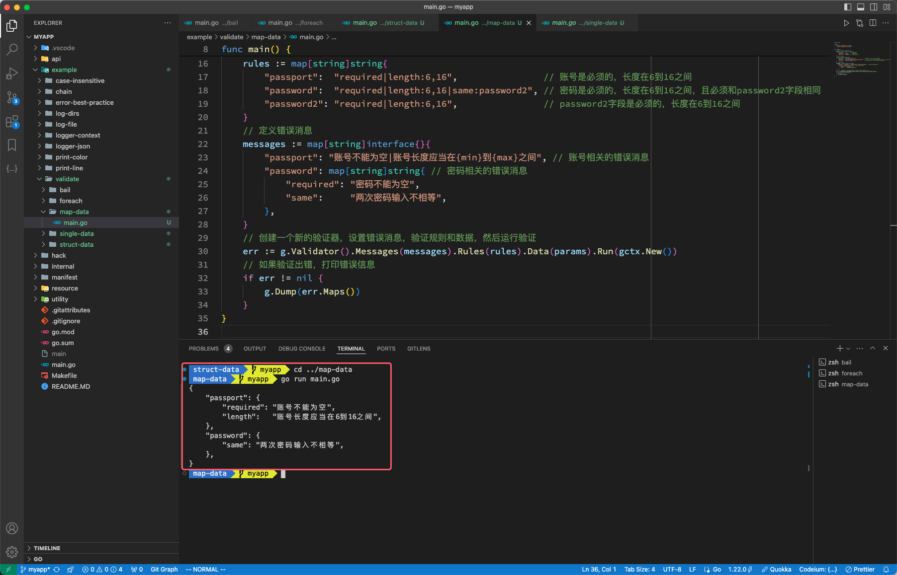

### 校验结果
校验结果为一个 error 错误对象，内部使用 `gvalid.Error` 对象实现。当数据规则校验成功时，校验方法返回的结果为 `nil`。当数据规则校验失败时，返回的该对象是包含结构化的层级 map，包含多个字段及其规则及对应错误信息，以便于接收端能够准确定位错误规则。

其数据结构和方法如下（[goframe 源码](https://github.com/clin211/goframe-practice/blob/goframe-code/util/gvalid/gvalid_error.go#L19)）：
```go
type Error interface {
	// 在校验组件中，该方法固定返回错误码 gcode.CodeValidationFailed
	Code() gcode.Code
	// 实现了gerror的Current接口，用于获取校验错误中的第一条错误对象
	Current() error
	// 实现标准库的error.Error接口，获取返回所有校验错误组成的错误字符串。内部逻辑同String方法
	Error() string
	// 在有多个键名/属性校验错误的时候，用以获取出错的第一个键名，以及其对应的出错规则和错误信息。其顺序性只有使用顺序校验规则时有效，否则返回的结果是随机的
	FirstItem() (key string, messages map[string]error)
	// 返回FirstItem中得第一条出错的规则及错误信息。其顺序性只有使用顺序校验规则时有效，否则返回的结果是随机的
	FirstRule() (rule string, err error)
	FirstError() (err error)
	// 在顺序性校验中将会按照校验规则顺序返回校验错误数组。其顺序性只有在顺序校验时有效，否则返回的结果是随机的
	Items() (items []map[string]map[string]error)
	// 返回FirstItem中得出错自规则及对应错误信息map
	Map() map[string]error
	// 返回所有的出错键名及对应的出错规则及对应的错误信息(map[string]map[string]error)
	Maps() map[string]map[string]error
	// 返回所有的错误信息，构成一条字符串返回，多个规则错误信息之间以;符号连接。其顺序性只有使用顺序校验规则时有效，否则返回的结果是随机的
	String() string
	// 返回所有的错误信息，构成[]string类型返回。其顺序性只有使用顺序校验规则时有效，否则返回的结果是随机的
	Strings() (errs []string)
}
```

#### gerror.Current支持
gvalid.Error实现了Current() error接口，因此可以通过gerror.Current方法获取它的第一条错误信息，这在接口校验失败时返回错误信息非常方便。

示例如下：
```go
package main

import (
	"github.com/gogf/gf/v2/errors/gerror"
	"github.com/gogf/gf/v2/frame/g"
	"github.com/gogf/gf/v2/os/gctx"
	"github.com/gogf/gf/v2/util/gvalid"
)

func main() {
	type User struct {
		Name string `v:"required#请输入用户姓名"`
		Type int    `v:"required|min:1#|请选择用户类型"`
	}
	var (
		err  error
		ctx  = gctx.New()
		user = User{}
	)
	if err = g.Validator().Data(user).Run(ctx); err != nil {
		g.Dump(err.(gvalid.Error).Maps())
		g.Dump(gerror.Current(err))
	}
}
```
执行后，终端输出如下图：

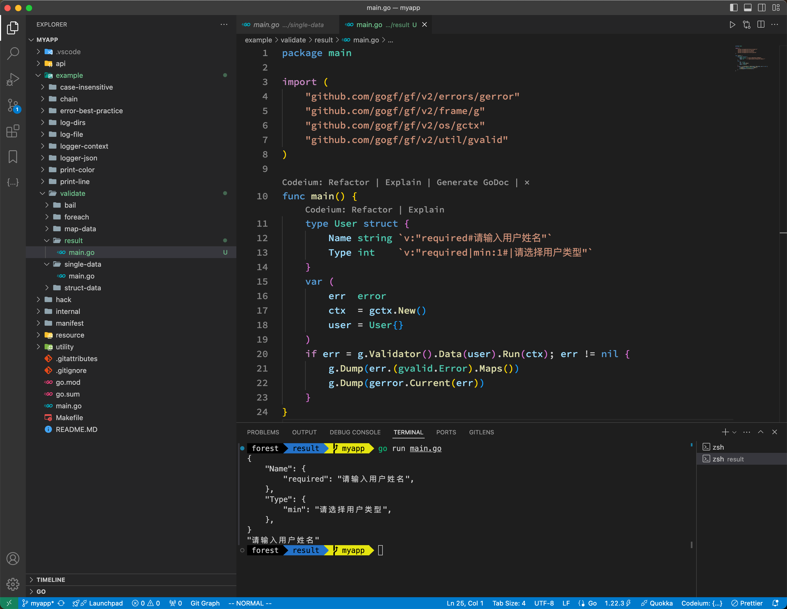

### 参数类型

将给定的变量当做一个完整的参数进行校验，即单数据校验；

- 校验数据长度，使用默认的错误提示
  ```go
  package main
  
  import (
      "fmt"
      "github.com/gogf/gf/v2/frame/g"
      "github.com/gogf/gf/v2/os/gctx"
  )
  
  func main() { 	
      var (
          ctx  = gctx.New()
          rule = "length:6,16"
      )
  
      if err := g.Validator().Rules(rule).Data("123456").Run(ctx); err != nil {
          fmt.Println(err.String())
      }
      if err := g.Validator().Rules(rule).Data("12345").Run(ctx); err != nil {
          fmt.Println(err.String())
      } 
  }
  ```
  执行后，终端输出：
  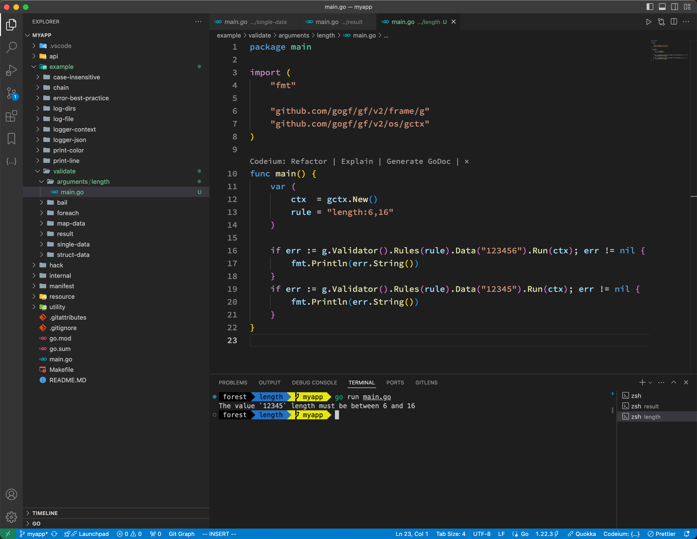
- 校验数据类型及大小，并且使用自定义的错误提示
  ```go
  package main
  
  import (
      "github.com/gogf/gf/v2/frame/g"
      "github.com/gogf/gf/v2/os/gctx"
  )
  
  func main() {
      var (
          ctx      = gctx.New()
          rule     = "integer|between:6,16"
          messages = "请输入一个整数|参数大小不对啊老铁"
          value    = 5.66
      )
  
      if err := g.Validator().Rules(rule).Messages(messages).Data(value).Run(ctx); err != nil {
          g.Dump(err.Map())
      }
  }
  ```
  
  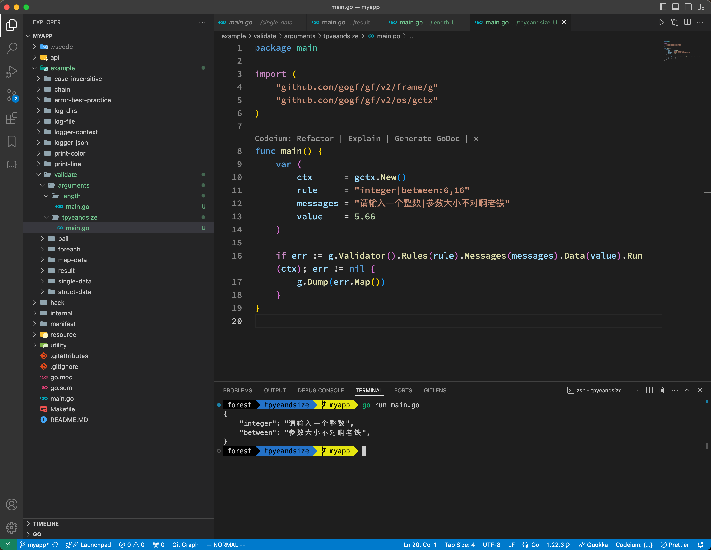

  多个规则以及多个自定义错误提示之间使用英文 `|` 号进行分割，注意自定义错误提示的顺序和多规则的顺序一一对应。messages参数除了支持 `string` 类型以外，还支持 `map[string]string` 类型，请看以下例子：
  ```go
  package main
  
  import (
      "github.com/gogf/gf/v2/frame/g"
      "github.com/gogf/gf/v2/os/gctx"
  )
  
  func main() {
      var (
          ctx      = gctx.New()
          rule     = "url|min-length:11"
          value    = "goframe.org"
          messages = map[string]string{
              "url":        "请输入正确的URL地址",
              "min-length": "地址长度至少为{min}位",
          }
      )
      if err := g.Validator().Rules(rule).Messages(messages).Data(value).Run(ctx); err != nil {
          g.Dump(err.Map())
      }
  }
  ```
  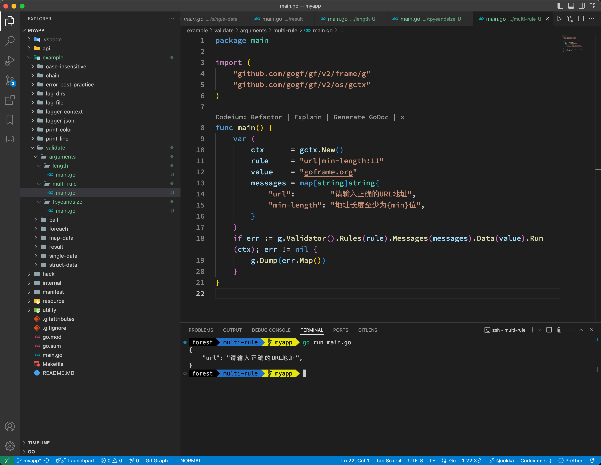

- 使用自定义正则校验数据格式，使用默认错误提示
  ```go
  package main
  
  import (
      "fmt"
  
      "github.com/gogf/gf/v2/frame/g"
      "github.com/gogf/gf/v2/os/gctx"
  )
  
  func main() {
      var (
          ctx  = gctx.New()
          rule = `regex:\d{6,}|\D{6,}|max-length:16`
      )
  
      if err := g.Validator().Rules(rule).Data(`123456`).Run(ctx); err != nil {
          fmt.Println(err)
      }
  
      if err := g.Validator().Rules(rule).Data(`abcde6`).Run(ctx); err != nil {
          fmt.Println(err)
      }
  }
  ```

  执行后，效果如下图：
  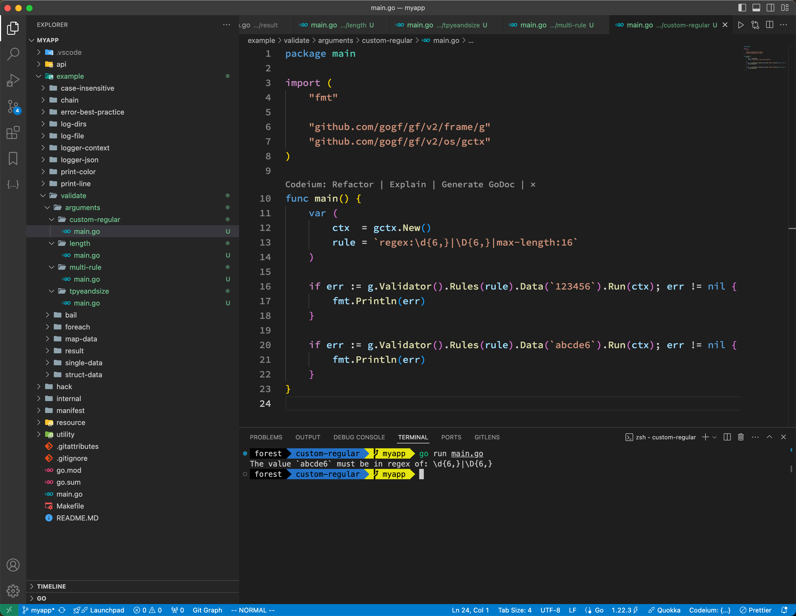

### struct 和 map 的数据校验

#### struct 数据校验
Struct校验常使用以下链式操作方式：
```go
g.Validator().Data(object).Run(ctx)
```
**校验tag规则介绍**
```go
[属性别名@]校验规则[#错误提示]
```
- **属性别名** 和 **错误提示** 为非必需字段，**校验规则** 是必需字段。
- **属性别名** 非必需字段，指定在校验中使用的对应 `struct`属性的别名，同时校验后返回的 `error` 对象中的也将使用该别名返回。例如在处理请求表单时比较有用，因为表单的字段名称往往和struct的属性名称不一致。大部分场景下不需要设置属性别名，默认直接使用属性名称即可。
- **校验规则**则为当前属性的校验规则，多个校验规则请使用|符号组合，例如：`required|between:1,100`。
- 错误提示 非必需字段，表示自定义的错误提示信息，当规则校验时对默认的错误提示信息进行覆盖。
- 校验tag使用示例
  ```go
  package main
  
  import (
      "github.com/gogf/gf/v2/frame/g"
      "github.com/gogf/gf/v2/os/gctx"
  )
  
  type User struct {
      Uid   int    `v:"uid      @integer|min:1#|请输入用户ID"`
      Name  string `v:"name     @required|length:6,30#请输入用户名称|用户名称长度非法"`
      Pass1 string `v:"password1@required|password3"`
      Pass2 string `v:"password2@required|password3|same:Pass1#|密码格式不合法|两次密码不一致，请重新输入"`
  }
  
  func main() {
      var (
          ctx  = gctx.New()
          user = &User{
              Name:  "john",
              Pass1: "Abc123!@#",
              Pass2: "123",
          }
      )
  
      err := g.Validator().Data(user).Run(ctx)
      if err != nil {
          g.Dump(err.Items())
      }
  }
  ```
  执行后，效果如下：
  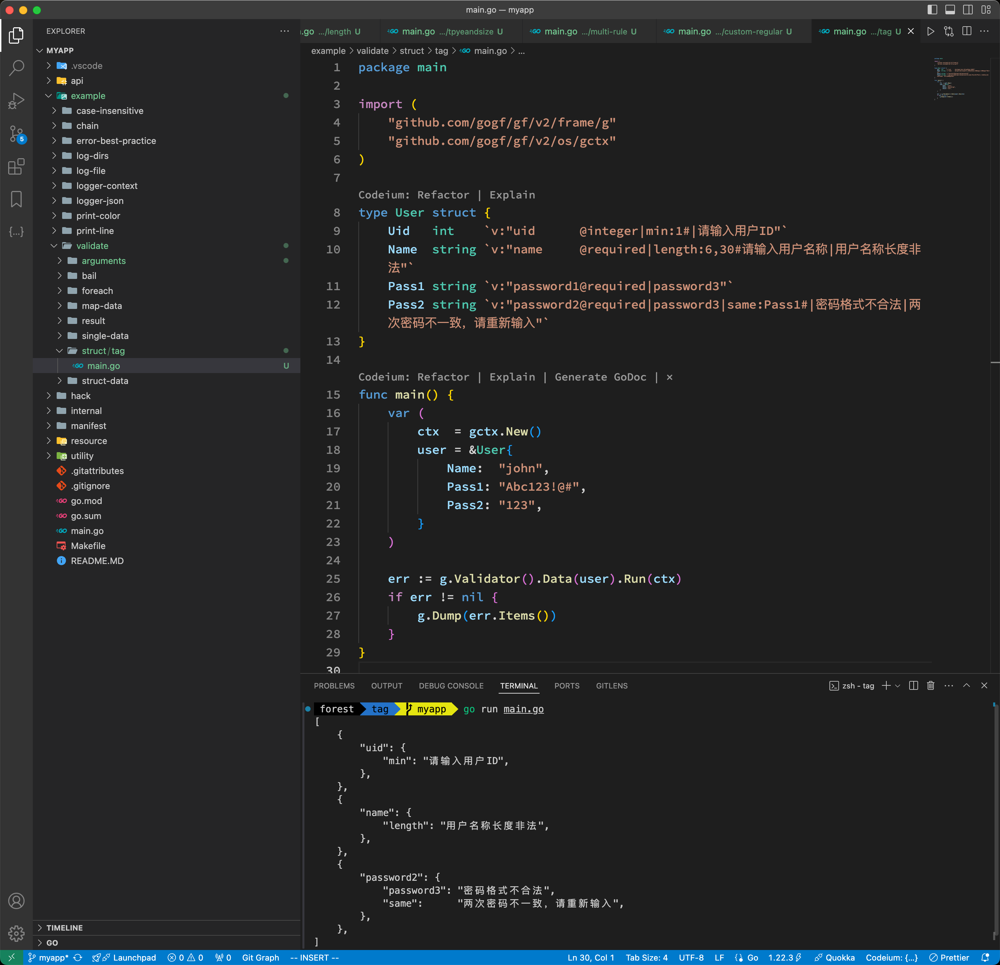

- 使用map指定校验规则
  ```go
  package main
  
  import (
      "github.com/gogf/gf/v2/frame/g"
      "github.com/gogf/gf/v2/os/gctx"
  )
  
  func main() {
      type User struct {
          Age  int
          Name string
      }
      var (
          ctx   = gctx.New()
          user  = User{Name: "john"}
          rules = map[string]string{
              "Name": "required|length:6,16",
              "Age":  "between:18,30",
          }
          messages = map[string]interface{}{
              "Name": map[string]string{
                  "required": "名称不能为空",
                  "length":   "名称长度为{min}到{max}个字符",
              },
              "Age": "年龄为18到30周岁",
          }
      )
  
      err := g.Validator().Rules(rules).Messages(messages).Data(user).Run(ctx)
      if err != nil {
          g.Dump(err.Maps())
      }
  }
  ```
  执行后，结果如下：

  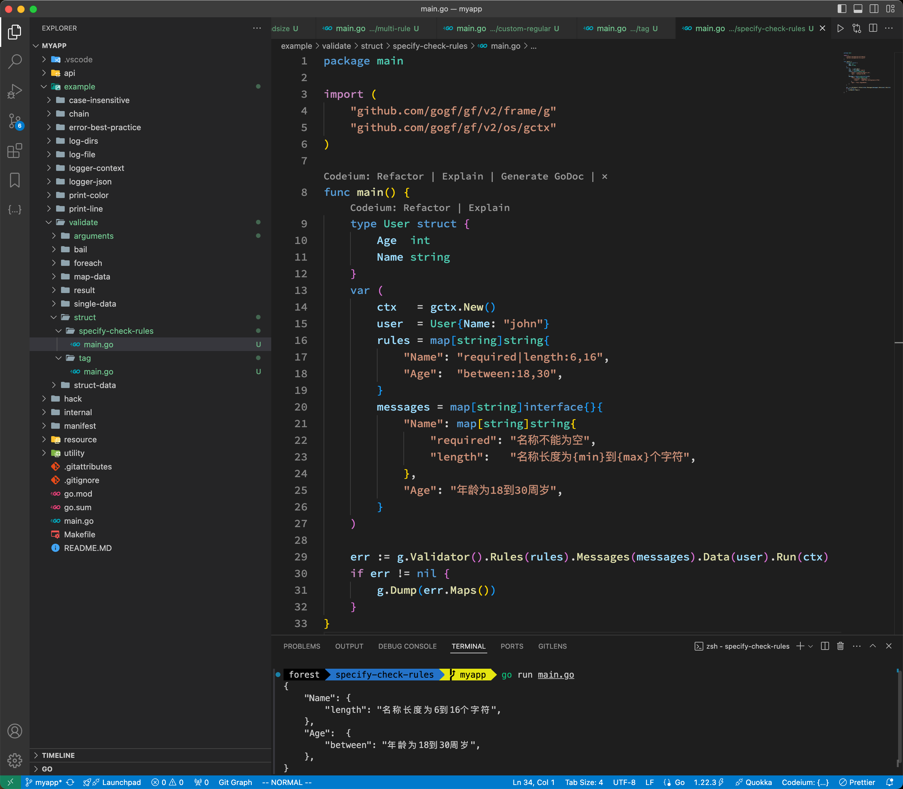

- 结构体递归校验（嵌套校验）
  支持递归的结构体校验（嵌套校验），即如果属性也是结构体（也支持嵌套结构体（embedded）），那么将会自动将该属性执行递归校验。
  
  ```go
  package main
  
  import (
      "github.com/gogf/gf/v2/frame/g"
      "github.com/gogf/gf/v2/os/gctx"
  )
  
  func main() {
      type Pass struct {
          Pass1 string `v:"password1@required|same:password2#请输入您的密码|您两次输入的密码不一致"`
          Pass2 string `v:"password2@required|same:password1#请再次输入您的密码|您两次输入的密码不一致"`
      }
      type User struct {
          Pass
          Id   int
          Name string `valid:"name@required#请输入您的姓名"`
      }
      var (
          ctx  = gctx.New()
          user = &User{
              Name: "john",
              Pass: Pass{
                  Pass1: "1",
                  Pass2: "2",
              },
          }
      )
      err := g.Validator().Data(user).Run(ctx)
      g.Dump(err.Maps())
  }
  ```
  执行后，效果如下：
  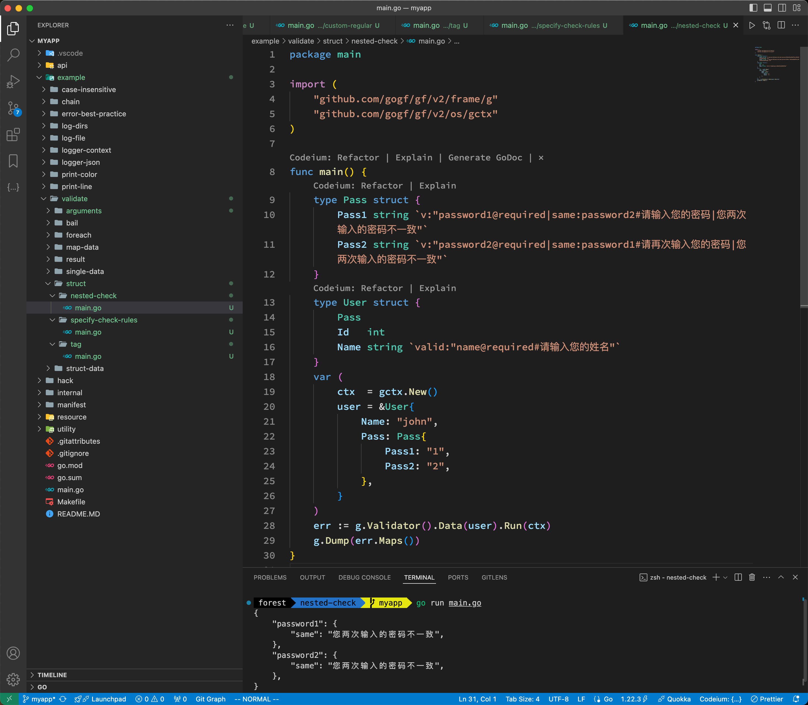

#### Map 校验
- 默认错误提示
  ```go
  package main
  
  import (
      "github.com/gogf/gf/v2/frame/g"
      "github.com/gogf/gf/v2/os/gctx"
  )
  
  func main() {
      var (
          ctx    = gctx.New()
          params = map[string]interface{}{
              "passport":  "",
              "password":  "123456",
              "password2": "1234567",
          }
          rules = map[string]string{
              "passport":  "required|length:6,16",
              "password":  "required|length:6,16|same:password2",
              "password2": "required|length:6,16",
          }
      )
      err := g.Validator().Rules(rules).Data(params).Run(ctx)
      if err != nil {
          g.Dump(err.Maps())
      }
  }
  ```
  执行后，效果如下图：
  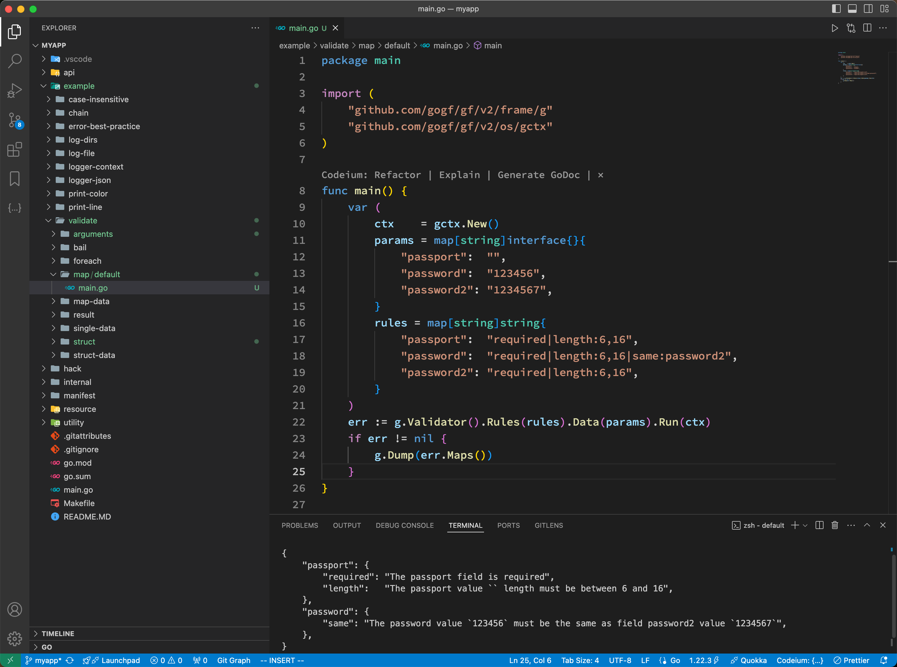

- 自定义错误提示
  ```go
  package main
  
  import (
      "github.com/gogf/gf/v2/frame/g"
      "github.com/gogf/gf/v2/os/gctx"
  )
  
  func main() {
      var (
          ctx    = gctx.New()
          params = map[string]interface{}{
              "passport":  "",
              "password":  "123456",
              "password2": "1234567",
          }
          rules = map[string]string{
              "passport":  "required|length:6,16",
              "password":  "required|length:6,16|same:password2",
              "password2": "required|length:6,16",
          }
          messages = map[string]interface{}{
              "passport": "账号不能为空|账号长度应当在{min}到{max}之间",
              "password": map[string]string{
                  "required": "密码不能为空",
                  "same":     "两次密码输入不相等",
              },
          }
      )
  
      err := g.Validator().Messages(messages).Rules(rules).Data(params).Run(ctx)
      if err != nil {
          g.Dump(err.Maps())
      }
  }
  ```
  执行后，效果如下图：

  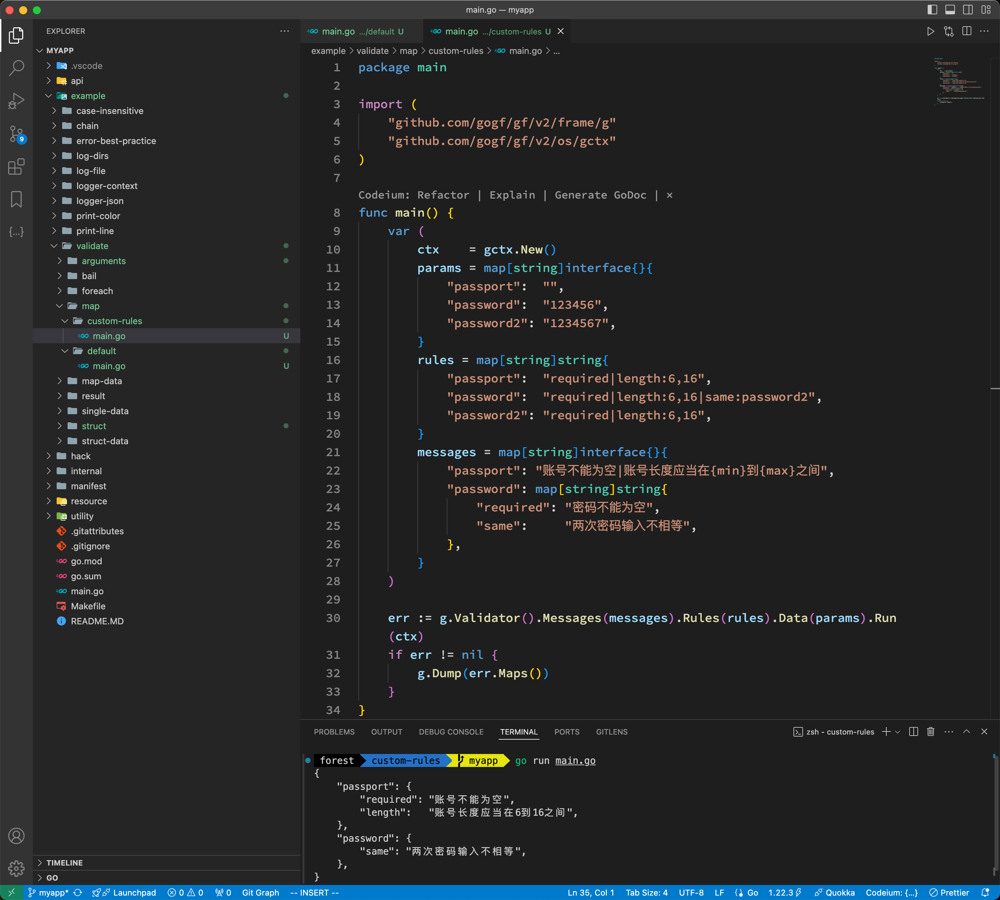
  
  - 校验顺序性
  
  如果将之前的示例代码多执行几次之后会发现，返回的结果是没有排序的，而且字段及规则输出的先后顺序完全是随机的。即使我们使用 `FirstItem`，`FirstString()` 等其他方法获取校验结果也是一样，返回的校验结果不固定。那是因为校验的规则我们传递的是map类型，而 golang 的 `map` 类型并不具有有序性，因此校验的结果和规则一样是随机的，同一个校验结果的同一个校验方法多次获取结果值返回的可能也不一样了。
  ```go
  package main
  
  import (
      "fmt"
  
      "github.com/gogf/gf/v2/frame/g"
      "github.com/gogf/gf/v2/os/gctx"
  )
  
  func main() {
      var (
          ctx    = gctx.New()
          params = map[string]interface{}{
              "passport":  "",
              "password":  "123456",
              "password2": "1234567",
          }
          rules = []string{
              "passport@required|length:6,16#账号不能为空|账号长度应当在{min}到{max}之间",
              "password@required|length:6,16|same:password2#密码不能为空|密码长度应当在{min}到{max}之间|两次密码输入不相等",
              "password2@required|length:6,16#",
          }
      )
      err := g.Validator().Rules(rules).Data(params).Run(ctx)
      if err != nil {
          fmt.Println(err.Map())
          fmt.Println(err.FirstItem())
          fmt.Println(err.FirstError())
      }
  }
  ```
  执行后结果如下：
  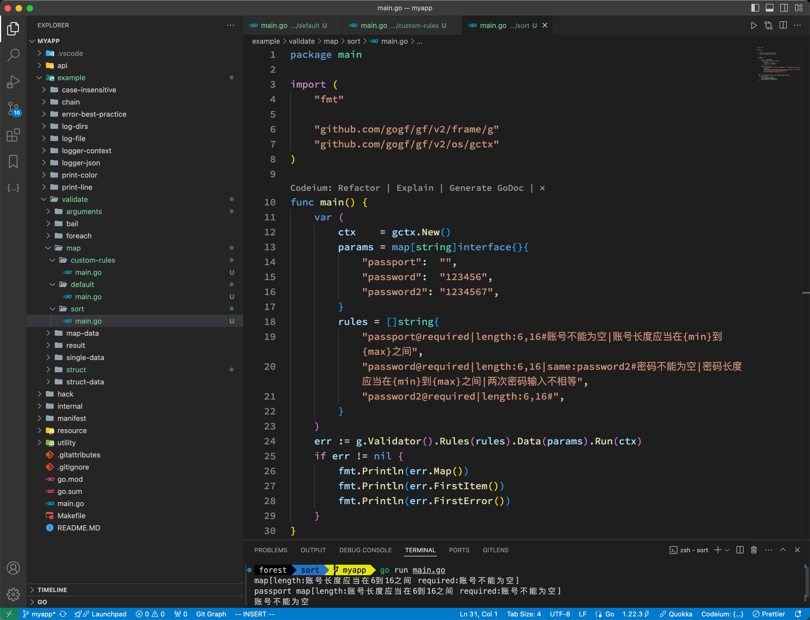
  只需要将 rules 参数的类型修改为 `[]string`，按照一定的规则设定即可，并且 msgs 参数既可以定义到 rules 参数中，也可以分开传入（使用第三个参数)


> 数据 [校验 struct](https://goframe.org/pages/viewpage.action?pageId=1114179) 和 [校验 map](https://goframe.org/pages/viewpage.action?pageId=1114192) 可以查看查看官方文档，这里就不做过多演示了。

## 类型转换

### 基本类型转换
```go
package main

import (
	"fmt"

	"github.com/gogf/gf/v2/util/gconv"
)

func main() {
	i := 123.456
	fmt.Printf("%10s %v\n", "Int:", gconv.Int(i))
	fmt.Printf("%10s %v\n", "Int8:", gconv.Int8(i))
	fmt.Printf("%10s %v\n", "Int16:", gconv.Int16(i))
	fmt.Printf("%10s %v\n", "Int32:", gconv.Int32(i))
	fmt.Printf("%10s %v\n", "Int64:", gconv.Int64(i))
	fmt.Printf("%10s %v\n", "Uint:", gconv.Uint(i))
	fmt.Printf("%10s %v\n", "Uint8:", gconv.Uint8(i))
	fmt.Printf("%10s %v\n", "Uint16:", gconv.Uint16(i))
	fmt.Printf("%10s %v\n", "Uint32:", gconv.Uint32(i))
	fmt.Printf("%10s %v\n", "Uint64:", gconv.Uint64(i))
	fmt.Printf("%10s %v\n", "Float32:", gconv.Float32(i))
	fmt.Printf("%10s %v\n", "Float64:", gconv.Float64(i))
	fmt.Printf("%10s %v\n", "Bool:", gconv.Bool(i))
	fmt.Printf("%10s %v\n", "String:", gconv.String(i))
	fmt.Printf("%10s %v\n", "Bytes:", gconv.Bytes(i))
	fmt.Printf("%10s %v\n", "Strings:", gconv.Strings(i))
	fmt.Printf("%10s %v\n", "Ints:", gconv.Ints(i))
	fmt.Printf("%10s %v\n", "Floats:", gconv.Floats(i))
	fmt.Printf("%10s %v\n", "Interfaces:", gconv.Interfaces(i))
}
```
在终端中执行后，结果如下：
```sh
      Int: 123
     Int8: 123
    Int16: 123
    Int32: 123
    Int64: 123
     Uint: 123
    Uint8: 123
   Uint16: 123
   Uint32: 123
   Uint64: 123
  Float32: 123.456
  Float64: 123.456
     Bool: true
   String: 123.456
    Bytes: [119 190 159 26 47 221 94 64]
  Strings: [123.456]
     Ints: [123]
   Floats: [123.456]
Interfaces: [123.456]
```

> **Tips**:
>
> 数字转换方法例如 `gconv.Int/Uint` 等等，当给定的转换参数为字符串时，会自动识别十六进制、八进制。
>
> gconv 将 `0x` 开头的数字字符串当做十六进制转换。例如，`gconv.Int("0xff")` 将会返回 255。

更多高级的类型转换，可以查看官方文档：
- [Map转换](https://goframe.org/pages/viewpage.action?pageId=1114356)
- [Struct转换](https://goframe.org/pages/viewpage.action?pageId=1114345)
- [struct对struct对象的转换](https://goframe.org/pages/viewpage.action?pageId=7301898)
- [Scan转换](https://goframe.org/pages/viewpage.action?pageId=7301902)
- [Converter 特性](https://goframe.org/pages/viewpage.action?pageId=126844932)
- [复杂类型转换](https://goframe.org/pages/viewpage.action?pageId=1114226)

## 缓存管理

`gcache` 是提供统一的缓存管理模块，让开发者可自定义灵活接入的缓存适配接口，并默认提供了高速内存缓存适配实现。

`gcache` 默认提供默认的高速内存缓存对象，可以通过包方法操作内存缓存，也可以通过 `New` 方法创建内存缓存对象。在通过包方法使用缓存功能时，操作的是 `gcache` 默认提供的一个 `gcache.Cache` 对象，具有全局性，因此在使用时注意全局键名的覆盖。

`gcache` 使用的键名类型是 `interface{}` ，而不是 `string` 类型，这意味着我们可以使用任意类型的变量作为键名，但大多数时候建议使用 `string` 或者 `[]byte` 作为键名，并且统一键名的数据类型，以便维护。

`gcache` 存储的键值类型是 `interface{}`，也就是说可以存储任意的数据类型，当获取数据时返回的也是 `interface{}` 类型，若需要转换为其他的类型可以通过 `gcache` 的 `Get*` 方法便捷获取常见类型。

> 注意，如果您确定知道自己使用的是内存缓存，那么可以直接使用断言方式对返回的 `interface{}` 变量进行类型转换，否则建议通过获取到的泛型对象对应方法完成类型转换。

另外需要注意的是，`gcache` 的缓存过期时间参数 `duration` 的类型为 `time.Duration` 类型，在 `Set` 缓存变量时，如果缓存时间参数：
- `duration = 0` 表示不过期
- `duration < 0` 表示立即过期
- `duration > 0` 表示超时过期。

> 缓存组件中关于键值对的数据类型都是 `interface{}`，这种设计主要是为了考虑通用性和易用性，但是使用上需要注意 `interface{}` 的比较：**只有数据和类型都相等才算真正匹配**

### 接口设计
缓存组件采用了接口化设计，提供了 Adapter 接口，任何实现了 Adapter 接口的对象均可注册到缓存管理对象中，使得开发者可以对缓存管理对象进行灵活的自定义实现和扩展。

- 注册接口实现

  通过该方法将实现的adapter应用到对应的Cache对象上
  ```go
  func (c *Cache) SetAdapter(adapter Adapter)
  ```
  
- 获取接口实现

  通过该方法获取当前注册的adapter接口实现对象上：
  ```go
  func (c *Cache) GetAdapter() Adapter
  ```
  
### 内存缓存
缓存组件默认提供了一个高速的内存缓存，操作效率非常高效，CPU 性能损耗在纳秒级别。

- 基本使用：
  ```go
  package main
  
  import (
      "fmt"
  
      "github.com/gogf/gf/v2/os/gcache"
      "github.com/gogf/gf/v2/os/gctx"
  )
  
  func main() {
      // 创建一个缓存对象，
      // 当然也可以便捷地直接使用gcache包方法
      var (
          ctx   = gctx.New()
          cache = gcache.New()
      )
  
      // 设置缓存，不过期
      err := cache.Set(ctx, "k1", "v1", 0)
      if err != nil {
          panic(err)
      }
  
      // 获取缓存值
      value, err := cache.Get(ctx, "k1")
      if err != nil {
          panic(err)
      }
      fmt.Println(value)
  
      // 获取缓存大小
      size, err := cache.Size(ctx)
      if err != nil {
          panic(err)
      }
      fmt.Println(size)
  
      // 缓存中是否存在指定键名
      b, err := cache.Contains(ctx, "k1")
      if err != nil {
          panic(err)
      }
      fmt.Println(b)
  
      // 删除并返回被删除的键值
      removedValue, err := cache.Remove(ctx, "k1")
      if err != nil {
          panic(err)
      }
      fmt.Println(removedValue)
  
      // 关闭缓存对象，让GC回收资源
      if err = cache.Close(ctx); err != nil {
          panic(err)
      }
  }
  ```
  执行后，结果如下图：
  ```sh
  $ go run main.go 
  v1
  1
  true
  v1
  ```
  
- 过期控制
```go
package main

import (
	"fmt"
	"time"

	"github.com/gogf/gf/v2/os/gcache"
	"github.com/gogf/gf/v2/os/gctx"
)

func main() {
	var (
		ctx = gctx.New()
	)
	// 当键名不存在时写入，设置过期时间1000毫秒
	_, err := gcache.SetIfNotExist(ctx, "k1", "v1", time.Second)
	if err != nil {
		panic(err)
	}

	// 打印当前的键名列表
	keys, err := gcache.Keys(ctx)
	if err != nil {
		panic(err)
	}
	fmt.Println(keys)

	// 打印当前的键值列表
	values, err := gcache.Values(ctx)
	if err != nil {
		panic(err)
	}
	fmt.Println(values)

	// 获取指定键值，如果不存在时写入，并返回键值
	value, err := gcache.GetOrSet(ctx, "k2", "v2", 0)
	if err != nil {
		panic(err)
	}
	fmt.Println(value)

	// 打印当前的键值对
	data1, err := gcache.Data(ctx)
	if err != nil {
		panic(err)
	}
	fmt.Println(data1)

	// 等待1秒，以便k1:v1自动过期
	time.Sleep(time.Second)

	// 再次打印当前的键值对，发现k1:v1已经过期，只剩下k2:v2
	data2, err := gcache.Data(ctx)
	if err != nil {
		panic(err)
	}
	fmt.Println(data2)
}
```
执行后，结果为：
```sh
[k1]
[v1]
v2
map[k1:v1 k2:v2]
map[k1:v1 k2:v2]
```

#### 获取缓存值
`GetOrSetFunc` 获取一个缓存值，当缓存不存在时执行指定的 `f func(context.Context) (interface{}, error)`，缓存该f方法的结果值，并返回该结果。

> `GetOrSetFunc` 的缓存方法参数 `f` 是在缓存的锁机制外执行，因此在 `f` 内部也可以嵌套调用 `GetOrSetFunc` 。但如果f的执行比较耗时，高并发的时候容易出现f被多次执行的情况(缓存设置只有第一个执行的f返回结果能够设置成功，其余的被抛弃掉)。而 `GetOrSetFuncLock` 的缓存方法f是在缓存的锁机制内执行，因此可以保证当缓存项不存在时只会执行一次 `f`，但是缓存写锁的时间随着 `f` 方法的执行时间而定。

```go
package main

import (
	"context" // 用于处理上下文，支持可取消的操作
	"fmt"     // 用于标准输入输出
	"time"    // 用于时间操作

	// 引入 gcache 和 gctx 是 GoFrame 框架的一部分，用于缓存和上下文处理
	"github.com/gogf/gf/v2/os/gcache"
	"github.com/gogf/gf/v2/os/gctx"
)

func main() {
	// 定义变量
	var (
		ch    = make(chan struct{}, 0) // 创建一个容量为0的无缓冲通道，用于同步控制
		ctx   = gctx.New()             // 创建一个新的 GoFrame 上下文
		key   = `key`                  // 定义缓存的键
		value = `value`                // 定义缓存的值
	)

	// 启动10个 goroutine
	for i := 0; i < 10; i++ {
		go func(index int) {
			<-ch // 等待通道信号，确保所有 goroutine 同时开始执行
			_, err := gcache.GetOrSetFuncLock(ctx, key, func(ctx context.Context) (interface{}, error) {
				// 这段代码块在缓存中不存在对应键的值时执行
				fmt.Println(index, "entered") // 打印当前 goroutine 的索引，显示哪个 goroutine 获取到了锁
				return value, nil             // 返回要缓存的值
			}, 0) // 第三个参数0表示该缓存项没有过期时间
			if err != nil {
				panic(err) // 如果发生错误，程序直接崩溃
			}
		}(i) // 将当前循环的索引传递给 goroutine
	}

	close(ch)               // 关闭通道，允许所有等待的 goroutine 开始执行
	time.Sleep(time.Second) // 主 goroutine 休眠一秒，等待其他 goroutine 执行完毕
}
```
执行后，结果如下（带有随机性，但是只会输出一条信息）：
```sh
9 entered
```

可以看到，多个 goroutine 同时调用 `GetOrSetFuncLock` 方法时，由于该方法有并发安全控制，因此最终只有一个 goroutine 的数值生成函数执行成功，成功之后其他 goroutine 拿到数据后则立即返回不再执行对应的数值生成函数

#### LRU缓存淘汰控制
```go
package main

import (
	"fmt"
	"time"

	"github.com/gogf/gf/v2/os/gcache"
	"github.com/gogf/gf/v2/os/gctx"
)

func main() {

	var (
		ctx   = gctx.New()
		cache = gcache.New(2) // 设置LRU淘汰数量
	)

	// 添加10个元素，不过期
	for i := 0; i < 10; i++ {
		if err := cache.Set(ctx, i, i, 0); err != nil {
			panic(err)
		}
	}
	size, err := cache.Size(ctx)
	if err != nil {
		panic(err)
	}
	fmt.Println(size)

	keys, err := cache.Keys(ctx)
	if err != nil {
		panic(err)
	}
	fmt.Println(keys)

	// 读取键名1，保证该键名是优先保留
	value, err := cache.Get(ctx, 1)
	if err != nil {
		panic(err)
	}
	fmt.Println(value)

	// 等待一定时间后(默认1秒检查一次)，
	// 元素会被按照从旧到新的顺序进行淘汰
	time.Sleep(3 * time.Second)
	size, err = cache.Size(ctx)
	if err != nil {
		panic(err)
	}
	fmt.Println(size)

	keys, err = cache.Keys(ctx)
	if err != nil {
		panic(err)
	}
	fmt.Println(keys)
}
```
执行后，输出结果为：
```sh
10
[5 7 8 1 3 4 6 9 0 2]
1
2
[1 9]
```

### Redis缓存
缓存组件同时提供了 `gcache` 的 Redis 缓存适配实现。Redis 缓存在多节点保证缓存的数据一致性时非常有用，特别是 Session 共享、数据库查询缓存等场景中。

使用示例
```go
package main

import (
	"fmt"
	"time"

	_ "github.com/gogf/gf/contrib/nosql/redis/v2"
	"github.com/gogf/gf/v2/database/gredis"
	"github.com/gogf/gf/v2/os/gcache"
	"github.com/gogf/gf/v2/os/gctx"
)

func main() {
	var (
		err         error
		ctx         = gctx.New()
		cache       = gcache.New()
		redisConfig = &gredis.Config{
			Address: "127.0.0.1:15001",
			Pass:    "123456",
			Db:      9,
		}
		cacheKey   = `key`
		cacheValue = `value`
	)
	// Create redis client object.
	redis, err := gredis.New(redisConfig)
	if err != nil {
		panic(err)
	}
	// Create redis cache adapter and set it to cache object.
	cache.SetAdapter(gcache.NewAdapterRedis(redis))

	// Set and Get using cache object.
	err = cache.Set(ctx, cacheKey, cacheValue, time.Second)
	if err != nil {
		panic(err)
	}
	fmt.Println(cache.MustGet(ctx, cacheKey).String())

	// Get using redis client.
	fmt.Println(redis.MustDo(ctx, "GET", cacheKey).String())
}
```
运行结果为：
```sh
value
value
```

注意：需要提前在本地启动一个 Redis 服务，Redis 跑起来后在运行上面的示例，下面有一个 docker-compose 的 Redis 脚本，如果有 docker 可以用这种方式启动 Redis 服务：
```yml
version: "3.9"

services:
  redis:
    image: redis
    restart: always
    container_name: "redis"
    ports:
      - 15001:6379
    volumes:
      - ./data/redis:/data
    command: ["redis-server", "--requirepass", "123456"]
```
使用 `docker-compose up` 就可以启动 Redis 服务啦！然后再运行上面的代码，效果如下：
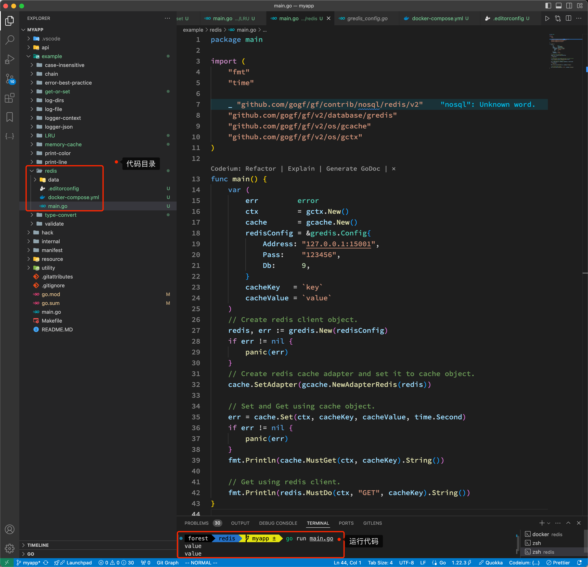

在使用 `gcache.Cache` 连接到 Redis 时：
- 同样的配置 会连接到 同一个 Redis 数据库。
- Redis 没有数据分组功能，所以多个 `gcache.Cache` 实例会共享同一个数据库。
- 操作（如 `Clear`、`Size`）会影响 整个数据库，而不是单独的缓存实例。
- 建议使用不同的 redis db 区分业务缓存类型。

#### 方法介绍
- `Set` 使用 `key-value` 键值对设置缓存，键值可以是任意类型。
  
  将 `slice` 切片设置到键名 k1 的缓存中。
  ```go
  package main
  
  import (
      "fmt"
  
      _ "github.com/gogf/gf/contrib/nosql/redis/v2"
      "github.com/gogf/gf/v2/database/gredis"
      "github.com/gogf/gf/v2/frame/g"
      "github.com/gogf/gf/v2/os/gcache"
      "github.com/gogf/gf/v2/os/gctx"
  )
  
  func main() {
      var (
          err         error
          ctx         = gctx.New()
          cache       = gcache.New()
          redisConfig = &gredis.Config{
              Address: "127.0.0.1:15001",
              Pass:    "123456",
              Db:      9,
          }
      )
      // Create redis client object.
      redis, err := gredis.New(redisConfig)
      if err != nil {
          panic(err)
      }
      // Create redis cache adapter and set it to cache object.
      cache.SetAdapter(gcache.NewAdapterRedis(redis))
  
      c := gcache.New()
      c.Set(ctx, "k1", g.Slice{1, 2, 3, 4, 5, 6, 7, 8, 9}, 0)
      fmt.Println(c.Get(ctx, "k1"))
  }
  ```
  运行结果为：
  ```sh
  $ go run main.go 
  [1,2,3,4,5,6,7,8,9] <nil>
  ```
  
- `SetAdapter` 更改此缓存对象的底层适配器。请注意，此设置函数不是并发安全的。
  ```go
  package main
  
  import (
      "fmt"
  
      "github.com/gogf/gf/v2/frame/g"
      "github.com/gogf/gf/v2/os/gcache"
      "github.com/gogf/gf/v2/os/gctx"
  )
  
  func main() {
      ctx := gctx.New()
      c := gcache.New()
      adapter := gcache.New()
      c.SetAdapter(adapter)
      c.Set(ctx, "k1", g.Slice{1, 2, 3, 4, 5, 6, 7, 8, 9}, 0)
      fmt.Println(c.Get(ctx, "k1"))
  }
  ```
  运行结果为：
  ```sh
  $ go run main.go
  [1,2,3,4,5,6,7,8,9] <nil>
  ```
  
- `SetIfNotExist` 指定 `key` 的键值不存在时设置其对应的键值 `value` 并返回`true`，否则什么都不做并返回 `false`。

  通过 `SetIfNotExist` 直接判断写入，并设置过期时间。

  ```go
  package main
  
  import (
      "fmt"
      "time"
  
      "github.com/gogf/gf/v2/os/gcache"
      "github.com/gogf/gf/v2/os/gctx"
  )
  
  func main() {
      ctx := gctx.New()
      c := gcache.New()
      // 当键名不存在时写入，并设置过期时间为1000毫秒
      k1, err := c.SetIfNotExist(ctx, "k1", "v1", 1000*time.Millisecond)
      fmt.Println("不存在则写入，过期时间为1000毫秒：", k1, err)
  
      // 当键名已存在时返回false
      k2, err := c.SetIfNotExist(ctx, "k1", "v2", 1000*time.Millisecond)
      fmt.Println("已存在则返回false：", k2, err)
  
      // 打印当前的键值列表
      keys1, _ := c.Keys(ctx)
      fmt.Println("当前的键值列表：", keys1)
  
      // 如果`duration` == 0，则不会过期。如果`duration` < 0 或 给定`value`为nil，则删除`key`。
      c.SetIfNotExist(ctx, "k1", 0, -10000)
  
      // 等待1秒，K1: V1会自动过期
      time.Sleep(1200 * time.Millisecond)
  
      // 再次打印当前的键值对，发现K1: V1已经过期
      keys2, _ := c.Keys(ctx)
      fmt.Println("过期则返回 nil：", keys2)
  }
  ```
  运行后效果如下:
  ```sh
  $ go run main.go 
  true <nil>
  false <nil>
  [k1]
  [<nil>]
  ```
  
  - Size 返回设置了多少项缓存。
  ```go
  package main
  
  import (
      "fmt"
  
      "github.com/gogf/gf/v2/os/gcache"
      "github.com/gogf/gf/v2/os/gctx"
  )
  
  func main() {
      c := gcache.New()
      ctx := gctx.New()
  
      // 添加10个没有过期时间的元素
      for i := 0; i < 10; i++ {
          c.Set(ctx, i, i, 0)
      }
  
      // Size返回缓存中的项目数量
      n, _ := c.Size(ctx)
      fmt.Println(n) // 10
  }
  ```
  
- Update 更新 `key` 的对应的键值，但不更改其过期时间，并返回旧值。如果缓存中不存在 `key`，则返回的 `exist` 值为 `false`。
  ```go
  package main
  
  import (
      "fmt"
  
      "github.com/gogf/gf/v2/frame/g"
      "github.com/gogf/gf/v2/os/gcache"
      "github.com/gogf/gf/v2/os/gctx"
  )
  
  func main() {
      // 创建一个新的缓存实例
      c := gcache.New()
  
      // 创建一个新的上下文实例
      ctx := gctx.New()
  
      // 使用SetMap方法将多个键值对添加到缓存中，设置的过期时间为0，表示这些键值对不会过期
      c.SetMap(ctx, g.MapAnyAny{"k1": "v1", "k2": "v2", "k3": "v3"}, 0)
  
      // 从缓存中获取键 "k1" 对应的值，并打印出来
      k1, _ := c.Get(ctx, "k1")
      fmt.Println(k1)
  
      // 从缓存中获取键 "k2" 对应的值，并打印出来
      k2, _ := c.Get(ctx, "k2")
      fmt.Println(k2)
  
      // 从缓存中获取键 "k3" 对应的值，并打印出来
      k3, _ := c.Get(ctx, "k3")
      fmt.Println(k3)
  
      // 更新缓存中键 "k1" 对应的值为 "v11"
      // re 是更新之前的值
      // exist 表示键 "k1" 是否存在于缓存中
      re, exist, _ := c.Update(ctx, "k1", "v11")
      fmt.Println(re, exist)
  
      // 尝试更新缓存中键 "k4" 对应的值为 "v44"
      // 由于 "k4" 不存在于缓存中，所以 exist 为 false，re 无法提供旧值
      re1, exist1, _ := c.Update(ctx, "k4", "v44")
      fmt.Println(re1, exist1)
  
      // 再次从缓存中获取键 "k1"、"k2" 和 "k3" 对应的值，打印出来以确认更新后的状态
      kup1, _ := c.Get(ctx, "k1")
      fmt.Println(kup1)
  
      kup2, _ := c.Get(ctx, "k2")
      fmt.Println(kup2)
  
      kup3, _ := c.Get(ctx, "k3")
      fmt.Println(kup3)
  }
  ```
  运行后效果如下：
  ```sh
  $ go run main.go
  v1
  v2
  v3
  v1 true
   false
  v11
  v2
  v3
  ```

- Values 获取缓存中的所有值，以切片方式返回。
```go
package main

import (
	"fmt"

	"github.com/gogf/gf/v2/frame/g"
	"github.com/gogf/gf/v2/os/gcache"
	"github.com/gogf/gf/v2/os/gctx"
)

func main() {
	// 创建一个新的缓存实例
	c := gcache.New()

	// 创建一个新的上下文实例
	ctx := gctx.New()

	// 设置缓存项，键名为 "k1"，对应的值是一个包含多个键值对的 Map，并且没有设置过期时间（0 表示永不过期）
	c.Set(ctx, "k1", g.Map{"k1": "v1", "k2": "v2"}, 0)

	// 使用 Values 方法获取缓存中所有的值，返回一个切片
	// data 包含缓存中的所有值，这里只有一个键 "k1"，它的值是一个 Map
	data, _ := c.Values(ctx)

	// 打印缓存中的所有值
	fmt.Println(data)
}
```
运行后效果如下：
```sh
[map[k1:v1 k2:v2]]
```

- Contains 如果 `key` 存在则返回 `true`，否则返回 `false`
  ```go
  package main
  
  import (
      "fmt"
  
      "github.com/gogf/gf/v2/os/gcache"
      "github.com/gogf/gf/v2/os/gctx"
  )
  
  func main() {
      c := gcache.New()
      ctx := gctx.New()
  
      // 向缓存中设置一个键值对，键名为 "k"，值为 "v"，过期时间为 0 表示永不过期
      c.Set(ctx, "k", "v", 0)
  
      // 使用 Contains 方法检查缓存中是否存在键 "k"
      data, _ := c.Contains(ctx, "k")
      fmt.Println(data) // true，表示键 "k" 存在于缓存中
  
      // 使用 Contains 方法检查缓存中是否存在键 "k1"
      data1, _ := c.Contains(ctx, "k1")
      fmt.Println(data1) // false，表示键 "k1" 不存在于缓存中
  }
  ```
  运行效果如下：
  ```sh
  $ go run main.go
  true
  false
  ```
  
- Data 数据以 `map` 类型返回缓存中所有**键值对('key':'value')的拷贝**
  ```go
  package main
  
  import (
      "fmt"
  
      "github.com/gogf/gf/v2/frame/g"
      "github.com/gogf/gf/v2/os/gcache"
      "github.com/gogf/gf/v2/os/gctx"
  )
  
  func main() {
      c := gcache.New()
      ctx := gctx.New()
  
      // 使用 SetMap 方法向缓存中设置多个键值对，键 "k1" 对应的值为 "v1"，过期时间为 0 表示永不过期
      c.SetMap(ctx, g.MapAnyAny{"k1": "v1"}, 0)
  
      // 使用 Data 方法获取整个缓存的数据
      data, _ := c.Data(ctx)
      fmt.Println(data) // map[k1:v1]
  }
  ```
  上面的演示的所有缓存管理的方法介绍的代码都可以在 https://github.com/clin211/goframe-practice/tree/myapp 中查看。[传送门](https://github.com/clin211/goframe-practice/commit/9817ba0355dd5f12ad100ba08b2c7539b228e573)
  这里就不再一一罗列了，更多方法的时候可以查看官方文档 [缓存管理-方法介绍](https://goframe.org/pages/viewpage.action?pageId=27755640) 了解。

## 总结

GoFrame作为一个全面的Go语言开发框架，提供了关键的核心组件，包括**数据校验**、**自定义错误处理**、**类型转换**和**缓存管理**等功能。

数据校验模块允许开发者定义和应用验证规则，确保输入数据的合法性和完整性，从而提高程序的安全性和稳定性。

自定义错误处理功能使开发者能够根据具体的业务需求定义特定的错误类型和错误信息，有效地管理和调试程序中的异常情况。

类型转换功能简化了不同数据类型之间的转换过程，提供了高效和安全的数据操作手段。

另外，GoFrame 的缓存管理模块支持 **内存缓存** 和 **Redis缓存** 两种主流方式，通过清晰的接口设计实现了快速的数据存取和更新操作，显著提升了应用程序的性能和响应速度。GoFrame通过其强大的核心组件为开发者提供了构建高效、可靠和可维护的应用程序的完整解决方案。