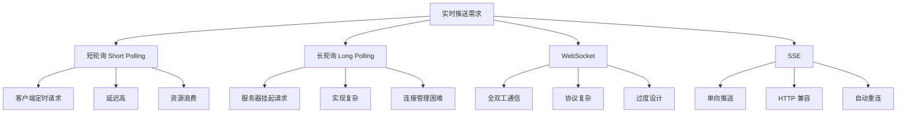
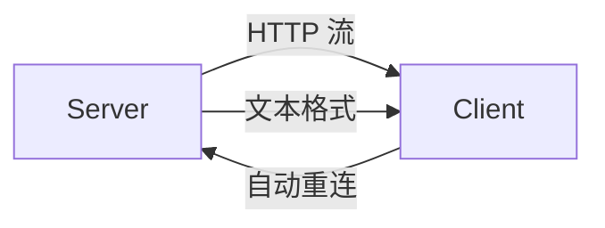
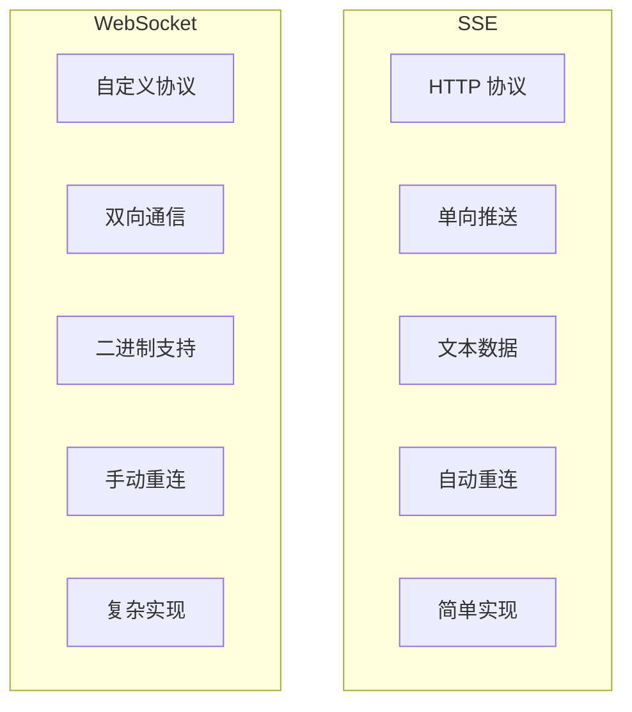
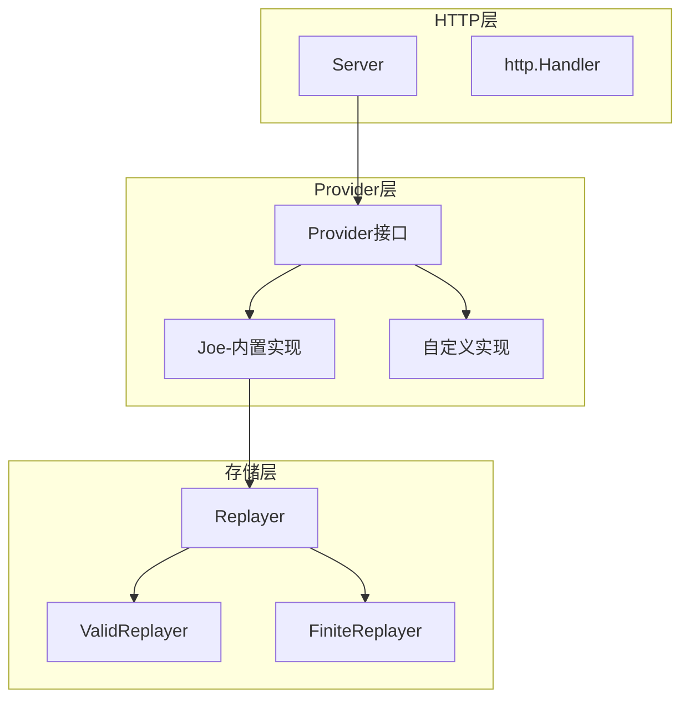
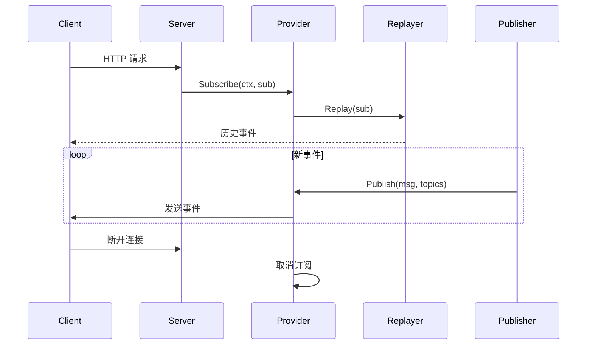
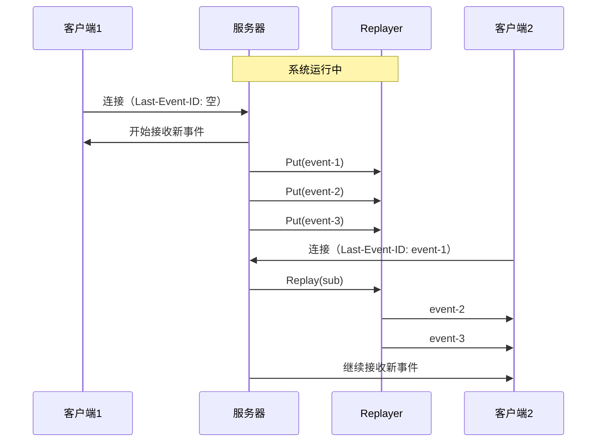
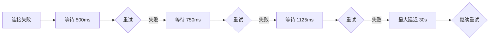
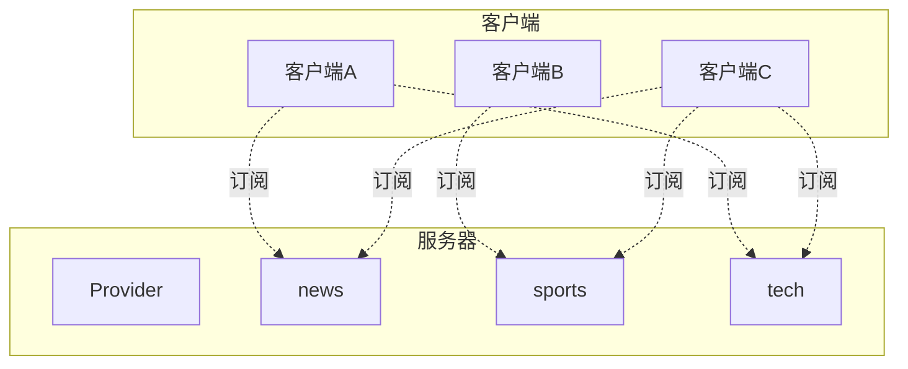
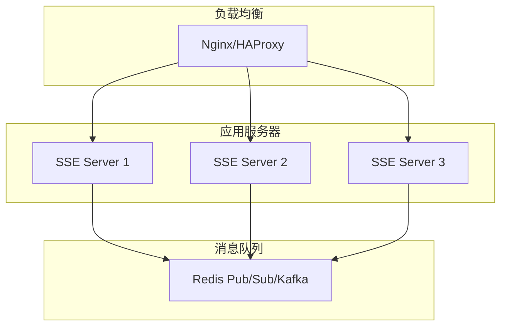
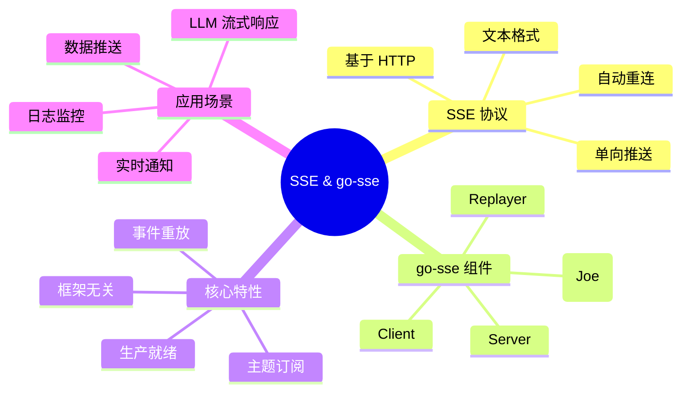

# SSE 详解：从原理到实战，彻底掌握 Server-Sent Events

> 本文首发于微信公众号【长林啊】，欢迎大家关注、分享、点赞！

## 本文大纲

- 一、开篇引入：为什么需要 SSE？
  - 1.1 现实场景：实时数据推送的痛点
  - 1.2 传统方案的局限性
  - 1.3 SSE：恰到好处的解决方案
- 二、SSE 核心概念与原理
  - 2.1 什么是 SSE？
  - 2.2 SSE 协议详解
  - 2.3 SSE vs WebSocket：如何选择？
- 三、原生 SSE 开发的痛点
  - 3.1 手动解析协议的繁琐
  - 3.2 断线重连的复杂性
  - 3.3 事件重放的实现难度
- 四、go-sse：优雅的 SSE 解决方案
  - 4.1 项目介绍与安装
  - 4.2 架构设计核心思想
  - 4.3 核心组件详解
- 五、服务端实战
  - 5.1 快速入门：Hello World
  - 5.2 深入 Provider 机制
  - 5.3 使用 Joe 实现事件发布订阅
  - 5.4 实现事件重放功能
  - 5.5 构建完整的实时通知系统
- 六、客户端实战
  - 6.1 连接 SSE 服务器
  - 6.2 订阅与处理事件
  - 6.3 断线重连机制
  - 6.4 读取 LLM 流式响应
- 七、高级特性与最佳实践
  - 7.1 事件过滤与主题订阅
  - 7.2 自定义 Provider 实现
  - 7.3 性能优化建议
  - 7.4 生产环境部署
- 八、总结与展望

---

## 一、开篇引入：为什么需要 SSE？

### 1.1 现实场景：实时数据推送的痛点

想象一下，你正在开发一个在线聊天应用。当用户 A 发送一条消息时，用户 B 需要立即看到这条消息。这时候，你面临一个核心问题：**服务器如何主动将数据推送给客户端？**

在 Web 开发中，这类"服务器到客户端"的实时推送场景非常普遍：

| 场景 | 描述 | 实时性要求 |
|------|------|-----------|
| 股票行情 | 股价变化需要实时展示 | 毫秒级 |
| 在线聊天 | 消息即时送达 | 秒级 |
| 通知系统 | 系统通知、提醒推送 | 秒级 |
| 协同编辑 | 多人同时编辑文档 | 毫秒级 |
| 进度监控 | 长时间任务进度更新 | 秒级 |
| AI 对话 | LLM 流式响应输出 | 毫秒级 |

### 1.2 传统方案的局限性

在 SSE 出现之前，我们有哪些方案来实现实时推送呢？



**短轮询（Short Polling）**

```go
// 客户端每隔几秒发送请求
for {
    response := http.Get("/api/messages")
    processMessages(response)
    time.Sleep(3 * time.Second)
}
```

**问题**：

- 延迟高：最多等待 3 秒才能收到新消息
- 资源浪费：大量无效请求
- 服务器压力：频繁的 HTTP 请求处理

**长轮询（Long Polling）**

```go
// 服务器挂起请求，直到有数据或超时
func handleLongPolling(w http.ResponseWriter, r *http.Request) {
    ctx := r.Context()
    select {
    case <-newMessage:
        json.NewEncoder(w).Encode(message)
    case <-time.After(30 * time.Second):
        w.WriteHeader(http.StatusNoContent)
    case <-ctx.Done():
        return
    }
}
```

**问题**：

- 实现复杂：需要管理大量挂起的连接
- 连接超时：需要处理超时重连
- 资源占用：每个连接占用一个 goroutine

### 1.3 SSE：恰到好处的解决方案

**Server-Sent Events（SSE）** 是 W3C 标准的 HTML5 API，专门用于服务器到客户端的单向实时数据推送。

**SSE 的核心优势**：



1. **基于 HTTP**：无需额外协议，天然兼容现有基础设施
2. **自动重连**：浏览器原生支持断线重连
3. **文本格式**：UTF-8 编码，易于调试
4. **事件 ID**：支持断点续传和事件重放
5. **单向推送**：适合"服务器推送"场景，设计简洁

---

## 二、SSE 核心概念与原理

### 2.1 什么是 SSE？

SSE（Server-Sent Events）是一种允许服务器向浏览器推送事件流的技术。它建立在 HTTP 之上，使用持久连接来服务器发送的事件。

**核心特点**：

| 特性 | 说明 |
|------|------|
| 传输方向 | 仅服务器 → 客户端（单向） |
| 传输协议 | HTTP/1.1 或 HTTP/2 |
| 内容格式 | 纯文本（UTF-8） |
| 连接方式 | 长连接 |
| 浏览器支持 | 现代浏览器原生支持 |
| 自动重连 | 是（浏览器原生） |

### 2.2 SSE 协议详解

**服务端响应格式**：

```http
HTTP/1.1 200 OK
Content-Type: text/event-stream
Cache-Control: no-cache
Connection: keep-alive

data: 第一条消息

data: 第二条消息
data: 第二条消息的第二行

event: userLogin
data: {"username": "alice", "time": "2024-01-01T12:00:00Z"}

id: 12345
data: 带有 ID 的消息

retry: 5000
data: 告诉客户端 5 秒后重试

: 这是注释，会被客户端忽略

data: 结尾需要两个换行符

```

**字段说明**：

| 字段 | 说明 | 示例 |
|------|------|------|
| `data` | 事件数据，可多行 | `data: hello` |
| `event` | 事件类型（名称） | `event: message` |
| `id` | 事件唯一标识 | `id: msg-001` |
| `retry` | 重连延迟（毫秒） | `retry: 3000` |
| `:` | 注释，客户端忽略 | `: heartbeat` |

**客户端使用**：

```javascript
// 创建 EventSource 对象
const eventSource = new EventSource('/api/events');

// 监听所有消息
eventSource.onmessage = (event) => {
    console.log('收到消息:', event.data);
};

// 监听特定类型的事件
eventSource.addEventListener('userLogin', (event) => {
    const data = JSON.parse(event.data);
    console.log('用户登录:', data.username);
});

// 错误处理
eventSource.onerror = (error) => {
    console.error('连接错误:', error);
    // 浏览器会自动重连
};

// 手动关闭连接
eventSource.close();
```

### 2.3 SSE vs WebSocket：如何选择？



**对比分析**：

| 维度 | SSE | WebSocket |
|------|-----|-----------|
| 通信方向 | 服务器 → 客户端 | 双向 |
| 协议 | HTTP | WebSocket (HTTP 升级) |
| 连接管理 | 浏览器自动 | 需手动实现 |
| 二进制数据 | 需编码 | 原生支持 |
| 防火墙穿透 | 优秀 | 可能受限 |
| 服务器负载 | 较低 | 较高 |
| 实现复杂度 | 低 | 中高 |
| 浏览器 API | EventSource | WebSocket API |

**选型建议**：

- **选择 SSE**：仅服务器推送、需要自动重连、HTTP 环境受限
- **选择 WebSocket**：双向通信、需要二进制传输、低延迟聊天

---

## 三、原生 SSE 开发的痛点

虽然 SSE 概念简单，但在实际开发中，我们面临许多挑战：

### 3.1 手动解析协议的繁琐

**原始 SSE 流解析**：

```go
// 需要手动处理各种边界情况
func parseSSEStream(reader io.Reader) ([]Event, error) {
    scanner := bufio.NewScanner(reader)
    var currentEvent Event
    var events []Event

    for scanner.Scan() {
        line := scanner.Text()

        // 处理注释
        if strings.HasPrefix(line, ":") {
            continue
        }

        // 处理空行（事件分隔符）
        if line == "" {
            if currentEvent.Valid() {
                events = append(events, currentEvent)
            }
            currentEvent = Event{}
            continue
        }

        // 解析字段
        parts := strings.SplitN(line, ":", 2)
        if len(parts) != 2 {
            continue
        }
        field := strings.TrimSpace(parts[0])
        value := strings.TrimSpace(parts[1])

        switch field {
        case "data":
            currentEvent.Data += value + "\n"
        case "event":
            currentEvent.Type = value
        case "id":
            currentEvent.ID = value
        case "retry":
            // 解析数字...
        }
    }

    return events, scanner.Err()
}
```

**问题**：

- 需要处理各种边界情况
- 数据格式验证繁琐
- 代码容易出错

### 3.2 断线重连的复杂性

**客户端重连逻辑**：

```go
// 需要手动实现指数退避重连
func connectWithRetry(url string, maxRetries int) error {
    var retryDelay time.Duration = time.Second

    for i := 0; i < maxRetries; i++ {
        err := connect(url)
        if err == nil {
            return nil
        }

        // 指数退避
        retryDelay *= 2
        if retryDelay > 30*time.Second {
            retryDelay = 30 * time.Second
        }

        log.Printf("连接失败，%v 后重试", retryDelay)
        time.Sleep(retryDelay)
    }

    return errors.New("连接失败")
}
```

**问题**：

- 需要实现重连策略
- 处理 Last-Event-ID 恢复
- 错误分类和判断

### 3.3 事件重放的实现难度

**服务端事件重放**：

```go
// 需要自己实现事件缓存和重放逻辑
type EventReplayer struct {
    events  []Event
    clients map[string]*Client
    mu      sync.RWMutex
}

func (r *EventReplayer) Replay(clientID, lastEventID string) error {
    r.mu.RLock()
    defer r.mu.RUnlock()

    startIndex := 0
    if lastEventID != "" {
        // 查找起始位置
        for i, e := range r.events {
            if e.ID == lastEventID {
                startIndex = i + 1
                break
            }
        }
    }

    // 发送历史事件
    for i := startIndex; i < len(r.events); i++ {
        if err := r.sendToClient(clientID, r.events[i]); err != nil {
            return err
        }
    }

    return nil
}
```

**问题**：

- 事件缓存管理
- 内存占用控制
- 过期事件清理

---

## 四、go-sse：优雅的 SSE 解决方案

### 4.1 项目介绍与安装

**go-sse** 是一个完全符合 HTML5 SSE 规范的 Go 语言库，提供了服务端和客户端的完整实现。

**核心特性**：

- 完全符合 W3C SSE 规范
- 提供服务端和客户端实现
- 支持自定义 Provider（可接入 Redis、Kafka 等）
- 内置事件重放功能
- 自动断线重连
- 框架无关，可与任何 HTTP 框架集成

**安装**：

```bash
go get -u github.com/tmaxmax/go-sse@latest
```

**项目信息**：

| 项目 | 信息 |
|------|------|
| GitHub | github.com/tmaxmax/go-sse |
| 许可证 | MIT |
| Go 版本 | 支持最新两个 Go 版本 |
| 测试覆盖 | 全面测试覆盖 |

### 4.2 架构设计核心思想

go-sse 的设计遵循"**关注点分离**"原则，将消息传递机制与 HTTP 处理解耦：



**核心接口**：

```go
// Provider 是发布-订阅系统的抽象
type Provider interface {
    // 订阅主题，当 context 取消时自动取消订阅
    Subscribe(ctx context.Context, sub Subscription) error

    // 向指定主题的所有订阅者发布消息
    Publish(msg *Message, topics []string) error

    // 关闭 Provider，清理所有资源
    Shutdown(ctx context.Context) error
}

// Replayer 负责事件重放
type Replayer interface {
    // 将新事件放入重放缓冲区
    Put(msg *Message, topics []string) (*Message, error)

    // 向新订阅者重放有效事件
    Replay(sub Subscription) error
}
```

### 4.3 核心组件详解

**1. Server - SSE 服务器**

```go
type Server struct {
    // Provider：发布-订阅系统
    Provider Provider

    // OnSession：会话回调，用于认证和授权
    OnSession func(*Session) (Subscription, bool)

    // Logger：日志记录器
    Logger Logger
}
```

**2. Joe - 内置 Provider**

```go
type Joe struct {
    // Replayer：可选的事件重放器
    Replayer Replayer
}
```

Joe 是 go-sse 内置的发布-订阅实现，特点是：

- 纯 Go 实现，无外部依赖
- 轻量级，资源占用低
- 同步事件分发
- 支持事件重放

**3. Message - SSE 消息**

```go
type Message struct {
    ID    EventID      // 事件唯一标识
    Type  EventType    // 事件类型
    Retry time.Duration // 重连延迟
    // 私有字段：data 和 comments
}
```

**4. Client - SSE 客户端**

```go
type Client struct {
    HTTPClient        *http.Client
    Backoff           Backoff         // 重连策略
    ResponseValidator ResponseValidator
}
```

---

## 五、服务端实战

### 5.1 快速入门：Hello World

让我们从一个最简单的例子开始：

```go
package main

import (
    "log"
    "net/http"
    "time"

    "github.com/tmaxmax/go-sse"
)

func main() {
    // 创建 SSE 服务器（零值即可用）
    server := &sse.Server{}

    // 启动一个 goroutine 定期发送消息
    go func() {
        ticker := time.NewTicker(time.Second)
        defer ticker.Stop()

        msg := &sse.Message{}
        msg.AppendData("Hello, SSE!")
        msg.ID = sse.ID("msg-1")

        for range ticker.C {
            if err := server.Publish(msg); err != nil {
                log.Printf("发布失败: %v", err)
            }
        }
    }()

    // 启动 HTTP 服务器
    log.Println("SSE 服务器启动在 :8080")
    if err := http.ListenAndServe(":8080", server); err != nil {
        log.Fatal(err)
    }
}
```

**运行测试**：

```bash
# 运行服务器
go run main.go

# 在另一个终端使用 curl 测试
curl -N http://localhost:8080
```

**输出结果**：

```
id: msg-1
data: Hello, SSE!

id: msg-1
data: Hello, SSE!

...
```

### 5.2 深入 Provider 机制

Provider 是 go-sse 的核心抽象，它定义了发布-订阅系统的接口：



**自定义 Provider 示例**：

```go
// RedisProvider 基于 Redis pub/sub 实现
type RedisProvider struct {
    client *redis.Client
    mu     sync.RWMutex
    subs   map[string][]Subscription
}

func (p *RedisProvider) Subscribe(ctx context.Context, sub Subscription) error {
    p.mu.Lock()
    defer p.mu.Unlock()

    // 订阅 Redis 频道
    for _, topic := range sub.Topics {
        p.subs[topic] = append(p.subs[topic], sub)
    }

    return nil
}

func (p *RedisProvider) Publish(msg *Message, topics []string) error {
    // 发布到 Redis
    data, _ := msg.MarshalText()
    for _, topic := range topics {
        p.client.Publish(ctx, topic, data)
    }
    return nil
}

func (p *RedisProvider) Shutdown(ctx context.Context) error {
    p.mu.Lock()
    defer p.mu.Unlock()

    p.subs = make(map[string][]Subscription)
    return p.client.Close()
}
```

### 5.3 使用 Joe 实现事件发布订阅

Joe 是 go-sse 内置的 Provider 实现，适合大多数应用场景：

```go
package main

import (
    "context"
    "log"
    "net/http"
    "time"

    "github.com/tmaxmax/go-sse"
)

func main() {
    // 创建带有事件重放的 Joe
    replayer, err := sse.NewValidReplayer(5*time.Minute, false)
    if err != nil {
        log.Fatal(err)
    }

    joe := &sse.Joe{
        Replayer: replayer,
    }

    // 创建 SSE 服务器
    server := &sse.Server{
        Provider: joe,
    }

    // 模拟不同类型的事件
    go publishEvents(server)

    log.Println("SSE 服务器启动在 :8080")
    log.Fatal(http.ListenAndServe(":8080", server))
}

func publishEvents(server *sse.Server) {
    types := []string{"news", "weather", "stock"}

    ticker := time.NewTicker(2 * time.Second)
    defer ticker.Stop()

    for i := range ticker.C {
        eventType := types[i%len(types)]

        msg := &sse.Message{}
        msg.Type = sse.Type(eventType)
        msg.ID = sse.ID(fmt.Sprintf("%s-%d", eventType, time.Now().Unix()))
        msg.AppendData(fmt.Sprintf("[%s] 新消息 at %s", eventType, time.Now().Format(time.RFC3339)))

        server.Publish(msg)
    }
}
```

### 5.4 实现事件重放功能

事件重放是 SSE 的重要特性，允许新连接的客户端获取历史事件：

```go
package main

import (
    "log"
    "net/http"
    "time"

    "github.com/tmaxmax/go-sse"
)

func main() {
    // 使用 ValidReplayer：重放未过期的事件
    // 参数1：事件有效期 5 分钟
    // 参数2：是否自动生成 ID（false 表示需要手动设置 ID）
    replayer, err := sse.NewValidReplayer(5*time.Minute, false)
    if err != nil {
        log.Fatal(err)
    }

    joe := &sse.Joe{
        Replayer: replayer,
    }

    server := &sse.Server{
        Provider: joe,
        Logger:   &DefaultLogger{},
    }

    // 定期发送带 ID 的事件
    go func() {
        counter := 0
        ticker := time.NewTicker(time.Second)
        defer ticker.Stop()

        for range ticker.C {
            counter++
            msg := &sse.Message{}
            msg.ID = sse.ID(fmt.Sprintf("event-%d", counter))
            msg.AppendData(fmt.Sprintf("事件 #%d - %s", counter, time.Now().Format(time.RFC3339)))

            server.Publish(msg)
        }
    }()

    log.Println("SSE 服务器启动在 :8080（支持事件重放）")
    log.Fatal(http.ListenAndServe(":8080", server))
}

// DefaultLogger 简单的日志实现
type DefaultLogger struct{}

func (l *DefaultLogger) Log(ctx context.Context, level sse.LogLevel, msg string, data map[string]any) {
    log.Printf("[%d] %s: %v", level, msg, data)
}
```

**事件重放原理**：



**FiniteReplayer：固定数量重放**：

```go
// 只保留最近的 100 条事件
replayer, err := sse.NewFiniteReplayer(100, true)
if err != nil {
    log.Fatal(err)
}

joe := &sse.Joe{
    Replayer: replayer,
}
```

| Replayer 类型 | 使用场景 | 特点 |
|---------------|----------|------|
| ValidReplayer | 时间窗口内的事件 | 基于 TTL 过期 |
| FiniteReplayer | 最近的 N 条事件 | 固定数量，自动 ID |

### 5.5 构建完整的实时通知系统

让我们构建一个更实用的例子：实时用户通知系统：

```go
package main

import (
    "context"
    "encoding/json"
    "fmt"
    "log"
    "net/http"
    "strconv"
    "sync"
    "time"

    "github.com/tmaxmax/go-sse"
)

// Notification 通知结构
type Notification struct {
    ID      string    `json:"id"`
    Type    string    `json:"type"`
    Title   string    `json:"title"`
    Content string    `json:"content"`
    Time    time.Time `json:"time"`
}

// NotificationServer 通知服务器
type NotificationServer struct {
    sse     *sse.Server
    storage *NotificationStorage
}

// NotificationStorage 内存存储
type NotificationStorage struct {
    mu    sync.RWMutex
    items map[string]*Notification
}

func NewNotificationStorage() *NotificationStorage {
    return &NotificationStorage{
        items: make(map[string]*Notification),
    }
}

func (ns *NotificationStorage) Add(n *Notification) {
    ns.mu.Lock()
    defer ns.mu.Unlock()
    ns.items[n.ID] = n
}

func (ns *NotificationStorage) Get(id string) (*Notification, bool) {
    ns.mu.RLock()
    defer ns.mu.RUnlock()
    n, ok := ns.items[id]
    return n, ok
}

func NewNotificationServer() *NotificationServer {
    // 创建重放器：保留最近 1000 条通知
    replayer, err := sse.NewFiniteReplayer(1000, true)
    if err != nil {
        panic(err)
    }

    joe := &sse.Joe{
        Replayer: replayer,
    }

    storage := NewNotificationStorage()

    s := &NotificationServer{
        sse: &sse.Server{
            Provider: joe,
            OnSession: func(session *sse.Session) (sse.Subscription, bool) {
                // 从请求中获取用户信息
                userID := session.Req.URL.Query().Get("user_id")
                if userID == "" {
                    // 未授权用户
                    return sse.Subscription{}, false
                }

                // 订阅用户专属主题和全局通知
                return sse.Subscription{
                    Topics:      []string{"global", "user:" + userID},
                    LastEventID: session.LastEventID,
                    Client:      session.Res,
                }, true
            },
        },
        storage: storage,
    }

    // 启动模拟通知
    go s.simulateNotifications()

    return s
}

func (s *NotificationServer) simulateNotifications() {
    types := []string{"info", "warning", "success", "error"}
    titles := []string{
        "系统更新",
        "新消息",
        "任务完成",
        "安全提醒",
    }

    ticker := time.NewTicker(5 * time.Second)
    defer ticker.Stop()

    counter := 0
    for range ticker.C {
        counter++
        notif := &Notification{
            ID:      fmt.Sprintf("notif-%d", counter),
            Type:    types[counter%len(types)],
            Title:   titles[counter%len(titles)],
            Content: fmt.Sprintf("这是第 %d 条通知", counter),
            Time:    time.Now(),
        }

        s.storage.Add(notif)
        s.Broadcast(notif, "global")
    }
}

func (s *NotificationServer) Broadcast(notif *Notification, topic string) {
    data, _ := json.Marshal(notif)

    msg := &sse.Message{}
    msg.ID = sse.ID(notif.ID)
    msg.Type = sse.Type(notif.Type)
    msg.AppendData(string(data))

    s.sse.Publish(msg, topic)
}

func (s *NotificationServer) SendToUser(userID string, notif *Notification) {
    data, _ := json.Marshal(notif)

    msg := &sse.Message{}
    msg.ID = sse.ID(notif.ID)
    msg.Type = sse.Type(notif.Type)
    msg.AppendData(string(data))

    s.sse.Publish(msg, "user:"+userID)
}

func (s *NotificationServer) ServeHTTP(w http.ResponseWriter, r *http.Request) {
    s.sse.ServeHTTP(w, r)
}

func main() {
    server := NewNotificationServer()

    // 设置路由
    mux := http.NewServeMux()
    mux.Handle("/events", server)
    mux.HandleFunc("/notify", handleNotify(server))

    log.Println("通知服务器启动在 :8080")
    log.Println("连接地址: ws://localhost:8080/events?user_id=YOUR_USER_ID")
    log.Fatal(http.ListenAndServe(":8080", mux))
}

func handleNotify(server *NotificationServer) http.HandlerFunc {
    return func(w http.ResponseWriter, r *http.Request) {
        if r.Method != http.MethodPost {
            http.Error(w, "Method not allowed", http.StatusMethodNotAllowed)
            return
        }

        var req struct {
            UserID  string `json:"user_id"`
            Title   string `json:"title"`
            Content string `json:"content"`
        }

        if err := json.NewDecoder(r.Body).Decode(&req); err != nil {
            http.Error(w, err.Error(), http.StatusBadRequest)
            return
        }

        notif := &Notification{
            ID:      fmt.Sprintf("notif-%d", time.Now().UnixNano()),
            Type:    "info",
            Title:   req.Title,
            Content: req.Content,
            Time:    time.Now(),
        }

        server.SendToUser(req.UserID, notif)

        json.NewEncoder(w).Encode(map[string]any{
            "success": true,
            "id":      notif.ID,
        })
    }
}
```

**项目结构**：

```
notification-system/
├── main.go           # 主程序
├── server.go         # SSE 服务器
├── storage.go        # 通知存储
└── handlers.go       # HTTP 处理器
```

**测试方式**：

```bash
# 1. 启动服务器
go run *.go

# 2. 连接并接收通知
curl -N "http://localhost:8080/events?user_id=alice"

# 3. 发送个人通知
curl -X POST http://localhost:8080/notify \
  -H "Content-Type: application/json" \
  -d '{"user_id":"alice","title":"新消息","content":"你好，Alice！"}'
```

---

## 六、客户端实战

### 6.1 连接 SSE 服务器

go-sse 提供了功能完整的客户端实现：

```go
package main

import (
    "context"
    "fmt"
    "log"
    "net/http"
    "os"
    "os/signal"
    "syscall"

    "github.com/tmaxmax/go-sse"
)

func main() {
    // 创建带取消上下文的请求
    ctx, cancel := context.WithCancel(context.Background())
    defer cancel()

    req, err := http.NewRequestWithContext(ctx, http.MethodGet, "http://localhost:8080/events?user_id=alice", http.NoBody)
    if err != nil {
        log.Fatal(err)
    }

    // 创建连接
    conn := sse.NewConnection(req)

    // 订阅所有消息
    unsubscribe := conn.SubscribeToAll(func(event sse.Event) {
        fmt.Printf("[%s] %s\n", event.Type, event.Data)
    })
    defer unsubscribe()

    // 处理中断信号
    sigCh := make(chan os.Signal, 1)
    signal.Notify(sigCh, os.Interrupt, syscall.SIGTERM)

    // 启动连接
    go func() {
        if err := conn.Connect(); err != nil {
            log.Printf("连接错误: %v", err)
        }
    }()

    <-sigCh
    fmt.Println("\n客户端关闭")
}
```

### 6.2 订阅与处理事件

go-sse 提供了三种订阅方式：

```go
package main

import (
    "fmt"
    "net/http"

    "github.com/tmaxmax/go-sse"
)

func main() {
    req, _ := http.NewRequest(http.MethodGet, "http://localhost:8080/events", http.NoBody)
    conn := sse.NewConnection(req)

    // 1. 订阅无类型的事件
    conn.SubscribeMessages(func(event sse.Event) {
        fmt.Printf("消息: %s\n", event.Data)
    })

    // 2. 订阅特定类型的事件
    conn.SubscribeEvent("userLogin", func(event sse.Event) {
        fmt.Printf("用户登录: %s\n", event.Data)
    })

    conn.SubscribeEvent("warning", func(event sse.Event) {
        fmt.Printf("警告: %s\n", event.Data)
    })

    // 3. 订阅所有事件
    conn.SubscribeToAll(func(event sse.Event) {
        fmt.Printf("[%s] %s (ID: %s)\n", event.Type, event.Data, event.LastEventID)
    })

    conn.Connect()
}
```

**订阅方式对比**：

| 方法 | 订阅范围 | 使用场景 |
|------|----------|----------|
| `SubscribeMessages` | 无类型事件 | 默认消息流 |
| `SubscribeEvent` | 指定类型 | 事件分类处理 |
| `SubscribeToAll` | 所有事件 | 全局监听 |

### 6.3 断线重连机制

go-sse 内置了智能重连机制：

```go
package main

import (
    "log"
    "net/http"
    "time"

    "github.com/tmaxmax/go-sse"
)

func main() {
    // 自定义客户端配置
    client := &sse.Client{
        HTTPClient: &http.Client{
            Timeout: 30 * time.Second,
        },
        Backoff: sse.Backoff{
            InitialInterval: 500 * time.Millisecond,  // 初始重连延迟
            Multiplier:     1.5,                      // 延迟倍增
            Jitter:         0.5,                      // 随机抖动
            MaxInterval:    30 * time.Second,         // 最大延迟
            MaxElapsedTime: 5 * time.Minute,          // 总重连时长
            MaxRetries:     0,                        // 无限重试（0 表示无限）
        },
        OnRetry: func(err error, delay time.Duration) {
            log.Printf("连接失败，%v 后重试: %v", delay, err)
        },
    }

    req, _ := http.NewRequest(http.MethodGet, "http://localhost:8080/events", http.NoBody)
    conn := client.NewConnection(req)

    conn.SubscribeToAll(func(event sse.Event) {
        log.Printf("收到事件: %s", event.Data)
    })

    if err := conn.Connect(); err != nil {
        log.Printf("最终连接失败: %v", err)
    }
}
```

**重连策略说明**：



### 6.4 读取 LLM 流式响应

go-sse 特别适合读取 LLM 的流式响应：

```go
package main

import (
    "bytes"
    "context"
    "encoding/json"
    "fmt"
    "io"
    "log"
    "net/http"

    "github.com/tmaxmax/go-sse"
)

type ChatRequest struct {
    Model    string    `json:"model"`
    Messages []Message `json:"messages"`
    Stream   bool      `json:"stream"`
}

type Message struct {
    Role    string `json:"role"`
    Content string `json:"content"`
}

func main() {
    ctx := context.Background()

    // 构建 LLM API 请求
    chatReq := ChatRequest{
        Model: "gpt-4",
        Messages: []Message{
            {Role: "user", Content: "用 Go 语言写一个 Hello World"},
        },
        Stream: true,
    }

    body, _ := json.Marshal(chatReq)

    req, err := http.NewRequestWithContext(ctx, http.MethodPost, "https://api.openai.com/v1/chat/completions", bytes.NewReader(body))
    if err != nil {
        log.Fatal(err)
    }

    req.Header.Set("Content-Type", "application/json")
    req.Header.Set("Authorization", "Bearer YOUR_API_KEY")

    // 发送请求
    resp, err := http.DefaultClient.Do(req)
    if err != nil {
        log.Fatal(err)
    }
    defer resp.Body.Close()

    // 使用 sse.Read 解析流式响应
    for ev, err := range sse.Read(resp.Body, nil) {
        if err != nil {
            if err == io.EOF {
                break
            }
            log.Printf("读取错误: %v", err)
            break
        }

        // 处理每个事件
        fmt.Printf("收到事件: %s\n", ev.Data)

        // 解析 delta 内容
        var data struct {
            Choices []struct {
                Delta struct {
                    Content string `json:"content"`
                } `json:"delta"`
            } `json:"choices"`
        }

        if err := json.Unmarshal([]byte(ev.Data), &data); err == nil {
            if len(data.Choices) > 0 {
                content := data.Choices[0].Delta.Content
                fmt.Print(content)
            }
        }
    }

    fmt.Println("\n\n响应完成")
}
```

**对于不支持 Go 1.23 迭代器的版本**：

```go
// 使用传统的迭代方式
events := sse.Read(resp.Body, nil)
for {
    ev, err, ok := events.Next()
    if !ok {
        break
    }
    if err != nil {
        log.Printf("错误: %v", err)
        break
    }
    fmt.Printf("事件: %s\n", ev.Data)
}
```

---

## 七、高级特性与最佳实践

### 7.1 事件过滤与主题订阅

主题（Topics）是 go-sse 事件分发的重要机制：

```go
package main

import (
    "fmt"
    "net/http"
    "sync"

    "github.com/tmaxmax/go-sse"
)

// TopicManager 主题管理器
type TopicManager struct {
    server *sse.Server
}

func NewTopicManager(server *sse.Server) *TopicManager {
    return &TopicManager{server: server}
}

// 发布到特定主题
func (tm *TopicManager) PublishToTopic(topic string, data string) {
    msg := &sse.Message{}
    msg.ID = sse.ID(fmt.Sprintf("%s-%d", topic, time.Now().UnixNano()))
    msg.AppendData(data)

    tm.server.Publish(msg, topic)
}

// 广播到多个主题
func (tm *TopicManager) Broadcast(topics []string, data string) {
    msg := &sse.Message{}
    msg.ID = sse.ID(fmt.Sprintf("broadcast-%d", time.Now().UnixNano()))
    msg.AppendData(data)

    tm.server.Publish(msg, topics...)
}

func main() {
    server := &sse.Server{
        OnSession: func(session *sse.Session) (sse.Subscription, bool) {
            // 根据查询参数决定订阅的主题
            topics := session.Req.URL.Query()["topic"]
            if len(topics) == 0 {
                // 默认订阅公共主题
                topics = []string{"public"}
            }

            return sse.Subscription{
                Topics:      topics,
                LastEventID: session.LastEventID,
                Client:      session.Res,
            }, true
        },
    }

    tm := NewTopicManager(server)

    // 启动发布者
    go func() {
        topics := []string{"news", "sports", "tech"}
        for i := 0; ; i++ {
            topic := topics[i%len(topics)]
            tm.PublishToTopic(topic, fmt.Sprintf("新消息: %s #%d", topic, i))
            time.Sleep(2 * time.Second)
        }
    }()

    http.ListenAndServe(":8080", server)
}
```

**主题订阅图示**：



### 7.2 自定义 Provider 实现

对于需要更高扩展性的场景，可以实现自定义 Provider：

```go
package main

import (
    "context"
    "fmt"
    "log"
    "net/http"
    "sync"
    "time"

    "github.com/tmaxmax/go-sse"
)

// ConcurrentProvider 并发安全的 Provider 实现
type ConcurrentProvider struct {
    mu       sync.RWMutex
    subs     map[string]map[*sse.Subscription]context.CancelFunc
    channels map[string]chan *sse.Message
    closed   bool
}

func NewConcurrentProvider() *ConcurrentProvider {
    return &ConcurrentProvider{
        subs:     make(map[string]map[*sse.Subscription]context.CancelFunc),
        channels: make(map[string]chan *sse.Message),
    }
}

func (p *ConcurrentProvider) Subscribe(ctx context.Context, sub sse.Subscription) error {
    p.mu.Lock()
    defer p.mu.Unlock()

    if p.closed {
        return sse.ErrProviderClosed
    }

    ctx, cancel := context.WithCancel(ctx)

    for _, topic := range sub.Topics {
        if _, ok := p.subs[topic]; !ok {
            p.subs[topic] = make(map[*sse.Subscription]context.CancelFunc)
            p.channels[topic] = make(chan *sse.Message, 100)
        }
        p.subs[topic][&sub] = cancel

        // 启动分发 goroutine
        go p.distribute(topic, &sub, ctx)
    }

    return nil
}

func (p *ConcurrentProvider) distribute(topic string, sub *sse.Subscription, ctx context.Context) {
    ch := p.channels[topic]

    for {
        select {
        case msg := <-ch:
            if err := sub.Client.Send(msg); err != nil {
                log.Printf("发送失败: %v", err)
                return
            }
            if err := sub.Client.Flush(); err != nil {
                log.Printf("刷新失败: %v", err)
                return
            }
        case <-ctx.Done():
            return
        }
    }
}

func (p *ConcurrentProvider) Publish(msg *sse.Message, topics []string) error {
    p.mu.RLock()
    defer p.mu.RUnlock()

    if p.closed {
        return sse.ErrProviderClosed
    }

    for _, topic := range topics {
        ch := p.channels[topic]
        select {
        case ch <- msg:
        default:
            log.Printf("主题 %s 缓冲区已满", topic)
        }
    }

    return nil
}

func (p *ConcurrentProvider) Shutdown(ctx context.Context) error {
    p.mu.Lock()
    defer p.mu.Unlock()

    p.closed = true

    // 取消所有订阅
    for _, subs := range p.subs {
        for _, cancel := range subs {
            cancel()
        }
    }

    // 关闭所有通道
    for _, ch := range p.channels {
        close(ch)
    }

    return nil
}

func main() {
    provider := NewConcurrentProvider()
    defer provider.Shutdown(context.Background())

    server := &sse.Server{
        Provider: provider,
    }

    // 模拟发布
    go func() {
        ticker := time.NewTicker(time.Second)
        defer ticker.Stop()

        for range ticker.C {
            msg := &sse.Message{}
            msg.AppendData(fmt.Sprintf("消息 at %s", time.Now().Format(time.RFC3339)))
            server.Publish(msg, "default")
        }
    }()

    log.Println("服务器启动在 :8080")
    log.Fatal(http.ListenAndServe(":8080", server))
}
```

### 7.3 性能优化建议

| 优化点 | 说明 | 建议 |
|--------|------|------|
| Replayer 大小 | 控制内存占用 | ValidReplayer 设置合理 TTL，FiniteReplayer 限制数量 |
| 缓冲区大小 | 避免阻塞 | 根据消息大小调整 channel buffer |
| 连接超时 | 防止僵尸连接 | 设置合理的 read/write timeout |
| 心跳机制 | 检测死连接 | 定期发送注释消息作为心跳 |
| 日志级别 | 减少 I/O 开销 | 生产环境使用 WARN 或 ERROR |

**心跳实现**：

```go
func startHeartbeat(server *sse.Server, interval time.Duration) {
    ticker := time.NewTicker(interval)
    defer ticker.Stop()

    for range ticker.C {
        msg := &sse.Message{}
        msg.AppendComment("heartbeat")
        server.Publish(msg)
    }
}
```

### 7.4 生产环境部署

**部署架构**：



**Nginx 配置**：

```nginx
upstream sse_backend {
    least_conn;
    server sse1:8080;
    server sse2:8080;
    server sse3:8080;
}

server {
    listen 80;
    server_name sse.example.com;

    location /events {
        proxy_pass http://sse_backend;

        # SSE 必需的配置
        proxy_set_header Connection '';
        proxy_http_version 1.1;
        chunked_transfer_encoding off;
        proxy_buffering off;
        proxy_cache off;

        # 超时配置
        proxy_connect_timeout 60s;
        proxy_send_timeout 300s;
        proxy_read_timeout 300s;

        # 增加缓冲区
        proxy_request_buffering off;
    }
}
```

**健康检查**：

```go
func healthHandler(server *sse.Server) http.HandlerFunc {
    return func(w http.ResponseWriter, r *http.Request) {
        // 检查 Provider 是否正常
        if server.Provider == nil {
            http.Error(w, "Provider not initialized", http.StatusServiceUnavailable)
            return
        }

        w.Header().Set("Content-Type", "application/json")
        json.NewEncoder(w).Encode(map[string]any{
            "status": "healthy",
            "time":   time.Now().Unix(),
        })
    }
}
```

---

## 八、总结与展望

### 核心要点回顾



| 特性 | 原生 SSE | go-sse |
|------|----------|--------|
| 协议解析 | 手动实现 | 自动处理 |
| 重连机制 | 需自己写 | 内置支持 |
| 事件重放 | 需自己实现 | Replayer 支持 |
| 主题过滤 | 需自己实现 | 内置支持 |
| 测试覆盖 | 无 | 全面测试 |

### 学习建议

1. **基础阶段**：从 Hello World 开始，理解基本概念
2. **进阶阶段**：学习 Joe 和 Replayer，实现事件重放
3. **高级阶段**：自定义 Provider，对接 Redis/Kafka
4. **实践阶段**：构建完整的通知系统

### 延伸阅读

- [SSE 官方规范](https://html.spec.whatwg.org/multipage/server-sent-events.html)
- [MDN SSE 文档](https://developer.mozilla.org/en-US/docs/Web/API/Server-sent_events)
- [go-sse GitHub](https://github.com/tmaxmax/go-sse)
- [go-sse 文档](https://pkg.go.dev/github.com/tmaxmax/go-sse)

---

> 本文介绍了 SSE 的原理、go-sse 的使用方法，以及如何构建生产级的实时推送系统。如果你有任何问题或建议，欢迎在评论区讨论！

> 下一篇文章，我们将深入探讨 Go 语言中的 WebSocket 编程，敬请期待！
