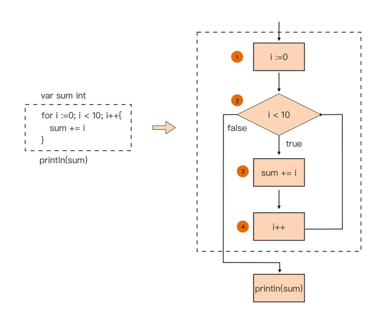

# 运算符、流程控制与循环

## 运算符

### 算数运算

| 操作符 | 描述 |
| ------ | ---- |
| +      | 加   |
| -      | 减   |
| *      | 乘   |
| /      | 除   |

### 关系运算符

| 操作符 | 描述                                           |
| ------ | ---------------------------------------------- |
| ==     | 两边相等则返回 `true` 否则返回 `false`         |
| !=     | 两边不相等则返回 `true` 否则返回 `false`       |
| >      | 左值大于右值则返回 `true` 否则返回 `false`     |
| >=     | 左值大于等于右值则返回 `true` 否则返回 `false` |
| <      | 左值小于则返回 `true` 否则返回 `false`         |
| <=     | 左值小于等于右值则返回 `true` 否则返回 `false` |

### 逻辑运算符

| 操作符 | 描述                                                         |
| ------ | ------------------------------------------------------------ |
| &&     | AND 运算符，两边表达式结果都为 `true` 则为 `true` 否则为 `false` |
| \|\|   | OR 运算符，两边表达式有一个为 `true` 则为 `true` 否则为 `false` |
| !      | NOT 运算符，取反；如果条件为 `true` 则为 `false` 否则为 `true` |

### 位运算符

| 操作符 | 描述                                       |
| ------ | ------------------------------------------ |
| &      | 按位与，二进制位都为 1 则为1，否则 为 0    |
| \|     | 按位或，二进制位有一个为 1 则为 1 否则为 0 |
| ^      | 按位异或，二进制位不一样就为 1 否则为 0    |
| <<     | 左移，左移 n 为就是乘以 2 的 n 次方        |
| >>     | 右移，右移n位就是除以2的n次方              |

```go
package main

import (
	"fmt"
)

func main() {
	two := 2  // 二进制表示： 0000 0010
	four := 4 // 二进制表示： 0000 0100

	// 按位与；二进制位都为 1 则为1，否则 为 0
	result := two & four // 0000 0000
	fmt.Println(result)  // 0

	// 按位或；二进制位有一个为 1 则为 1 否则为 0
	result = two | four // 0000 0110 --> 6
	fmt.Println(result) // 6

	// 按位异或；二进制位不一样就为 1 否则为 0
	result = two ^ four // 0000 0110 --> 6
	fmt.Println(result) // 6

	// 左移运算；左移 n 为就是乘以 2 的 n 次方
	result = two << four // 将two左移了four位，即two的二进制表示左移了4位，也就是two的二进制数的末尾添加了4个零
	fmt.Println(result)  // 0010 0000 ---> 32

	// 右移运算；右移n位就是除以2的n次方
	result = two >> four // 将 two 向右移动了 four 位。右移运算就是将二进制数向右移动指定的位数，实际上是将其除以2的n次方，其中n是右移的位数
	fmt.Println(result)  // 0000 0000 --> 0
}
```

## 流程控制

### if 系列

> - `if` 语句的布尔表达式整体不需要用括号包裹。
> - 可以用多个逻辑操作符连接起多个条件判断表达式。
> - `if` 关键字后面的条件判断表达式的求值结果必须是布尔类型，即要么是 `true`，要么是 `false。`
> - `if` 语句的分支代码块的左大括号与 `if` 关键字在同一行上，这也是 Go 代码风格的统一要求，`gofmt` 工具会帮助我们实现这一点。

#### 单分支

```go
if condition {
	
}
```

#### 多分支

```go
// 第一种
if boolean_expression {
  // 分支1
} else {
  // 分支2
}


// 第二种
if boolean_expression1 {
  // 分支1
} else if boolean_expression2 {
  // 分支2

... ...

} else if boolean_expressionN {
  // 分支N
} else {
  // 分支N+1
}
```

### switch case

```go
switch initStmt; expr {
    case expr1:
        // 执行分支1
    case expr2:
        // 执行分支2
    case expr3_1, expr3_2, expr3_3:
        // 执行分支3
    case expr4:
        // 执行分支4
    ... ...
    case exprN:
        // 执行分支N
    default: 
        // 执行默认分支
}
```

> - `switch` 后面的大括号内是一个个代码执行分支，每个分支以 `case` 关键字开始，每个 `case` 后面是一个表达式或是一个逗号分隔的表达式列表。这里还有一个以 `default` 关键字开始的特殊分支，被称为默认分支。且**每个 `switch` 只能有一个 `default` 分支**
> - **Go 先对 switch expr 表达式进行求值，然后再按 `case` 语句的出现顺序，从上到下进行逐一求值**。
> - 无论 `default` 分支出现在什么位置，它都只会在所有 `case` 都没有匹配上的情况下才会被执行的。
> - Go 取消了每个 `case` 后面显示调用 `break`，默认会在每个 `case` 后面调用 `break`，**如果需要执行下一个 `case` 的代码逻辑，可以显式使用 Go 提供的关键字 `fallthrough` 来实现**。


```go
// 示例一：一分支多值
package main

import "fmt"

func main() {
	var user string = "forest"
	switch user {
	case "forest", "changlin":
		fmt.Println("ok")
	}
}


// 示例二：分支表达式
package main

import "fmt"

func main() {
	var age int = 18
	switch {
	case age > 10 && age < 20:
		fmt.Println("ok!")
	}
}
```

## 循环

Go 语言中只有一种循环语句 `for`，提供了 3 中形式，只有其中一种使用分号。

- 经典模式

  ```go
  for init; condition; post{
      
  }
  ```

  - init：控制变量赋初始值
  - condition：循环控制条件
  - post：给控制变量增量或减量

  ```go
  package main
  
  func main() {
  	var sum int
  	for i := 0; i < 10; i++ {
  		sum += i
  	}
  	println(sum) // 45
  }
  ```

  

  Go 语言的 for 循环支持声明多循环变量，并且可以应用在循环体以及判断条件中

  ```go
  package main
  
  func main() {
  	sum := 0
  	for i, j, k := 0, 1, 2; (i < 20) && (j < 10) && (k < 30); i, j, k = i+1, j+1, k+5 {
  		sum += (i + j + k)
  	}
  
  	println(sum)
  }
  ```

- 进保留循环判断条件表达式

  ```go
  i := 0
  for i < 10 {
      println(i)
      i++
  }
  ```

  

- 无限循环，相当于 JavaScript 中 `while` 语句一样

  ```
  for { 
     // 循环体代码
  }
  ```

  

`for...range` 循环结构，可以遍历数组、切片、字符串、`map` 及 `channel`，语法如下：

```go
for key, value := range 复合变量值 {
    // ...
}
```

如果只针对部分值进行使用，则可以通过一下方式进行处理：

- 不关心元素的值则可以省略代表元素值的变量 v，只声明代表下标值的变量 i

  ```go
  for i := range sl {
    // ... 
  }
  ```

- 如果不关心元素下标，只关心元素值，那么可以用空标识符替代代表下标值的变量 i

  ```go
  for _, v := range sl {
    // ... 
  }
  ```

- 既不关心下标值，也不关心元素值

  ```go
  for range sl {
    // ... 
  }
  ```

### 常见"坑"与避免方法

-  循环变量重用

    > `for...range` 形式的循环语句，使用短变量声明的方式来声明循环变量，循环体将使用这些循环变量实现特定的逻辑，但可能会发现循环变量的值与你之前的“预期”不符

    ```go
    package main
    
    import (
        "fmt"
        "time"
    )
    
    func main() {
        var m = []int{1, 2, 3, 4, 5}
    
        for i, v := range m {
            go func() {
                time.Sleep(time.Second * 3)
                fmt.Println(i, v)
            }()
        }
    
        time.Sleep(time.Second * 10)
    }
    ```

    ```txt
    
    // 预期结果
    // 0 1
    // 1 2
    // 2 3
    // 3 4
    // 4 5
    
    // 实际打印结果
    // 4 5
    // 4 5
    // 4 5
    // 4 5
    // 4 5
    ```


    上面代码是对一个整型切片进行遍历，并且在每次循环体的迭代中都会创建一个新的 Goroutine，输出这次迭代的元素的下标值和元素值，实际打印出来的结果与我们的预期完全不符，原因是***因为循环变量在 for range 语句中仅会被声明一次,且在每次迭代中都会被重用***。如何修改才能与预期一致？可以为闭包函数增加参数，并且在创建 Goroutine 是将参数的值进行绑定，如下：
    
    ```go
    package main
    
    import (
        "fmt"
        "time"
    )
    
    func main() {
        var m = []int{1, 2, 3, 4, 5}
    
        for i, v := range m {
            go func(i, v int) {
                time.Sleep(time.Second * 3)
                fmt.Println(i, v)
            }(i, v)
        }
    
        time.Sleep(time.Second * 10)
    }
    ```

- 参与循环的是 range 表达式的副本

  `for...range` 可以遍历数组、指向数组的指针、切片、字符串，还有 `map` 和 `channel`.

  ```go
  package main
  
  import (
      "fmt"
  )
  
  func main() {
      var a = [5]int{1, 2, 3, 4, 5}
      var r [5]int
  
      fmt.Println("original a =", a)
  
      for i, v := range a {
          if i == 0 {
              a[1] = 12
              a[2] = 13
          }
          r[i] = v
      }
  
      fmt.Println("after for range loop, r =", r)
      fmt.Println("after for range loop, a =", a)
  }
  ```

  ```go
  // 预期结果
  // original a = [1 2 3 4 5]
  // after for range loop, r = [1 12 13 4 5]
  // after for range loop, a = [1 12 13 4 5]
  
  // 打印结果
  // original a = [1 2 3 4 5]
  // after for range loop, r = [1 2 3 4 5]
  // after for range loop, a = [1 12 13 4 5]
  ```

  上面值的实际结果怎么和预期不一致呢？原因是参与 `for...range` 循环的时 `range` 表达式的副本(值传递并非引用传递)，应如何修改才能达到预期结果呢？有两种方式:

  - 可以使用切片的方式

    ```go
    package main
    
    import (
      "fmt"
    )
    
    func main() {
      var a = [5]int{1, 2, 3, 4, 5}
      var r [5]int
    
      fmt.Println("original a =", a)
    
      for i, v := range a[:] {
          if i == 0 {
              a[1] = 12
              a[2] = 13
          }
          r[i] = v
      }
    
      fmt.Println("after for range loop, r =", r)
      fmt.Println("after for range loop, a =", a)
    }
    ```

    ```shell
    // 执行后打印结果
    original a = [1 2 3 4 5]
    after for range loop, r = [1 12 13 4 5]
    after for range loop, a = [1 12 13 4 5]
    ```


  - 使用数组指针的方式

    ```go
    package main

    import (
      "fmt"
    )

    func main() {
      var a = [5]int{1, 2, 3, 4, 5}
      var r [5]int
      fmt.Println("original a =", a)

      for i, v := range &a { // a 改为&a
          if i == 0 {
              a[1] = 12
              a[2] = 13
          }
          r[i] = v
      }
      fmt.Println("after for range loop, r =", r)
      fmt.Println("after for range loop, a =", a)
    }

    // 执行后的结果
    original a = [1 2 3 4 5]
    after for range loop, r = [1 12 13 4 5]
    after for range loop, a = [1 12 13 4 5]
    ```

- 遍历 map 中的元素具有随机性

  > 当 `map` 类型变量作为 `for...range` 表达式时，我们得到的 `map` 变量的副本与原变量指向同一个 `map`，在针对 map 类型的循环中，新创建一个 map 元素项具有随机性，可能出现在后续循环中，也可能不出现，可以查看 `map` 小节。


## continue

如果循环体中的代码执行到一半，要中断当前迭代，忽略此迭代循环体中的后续代码，并回到 for 循环条件判断，尝试开启下一次迭代，可以使用 continue 语句。

```go
package main

func main() {
	var sum int
	var sl = []int{1, 2, 3, 4, 5, 6}
	for i := 0; i < len(sl); i++ {
		// 如果当前值取模 2 等于 0 则进行下一次循环
		if sl[i]%2 == 0 {
			// 忽略切片中值为偶数的元素
			continue
		}
		sum += sl[i]
	}
	println(sum) // 9
}
```

带 label 的 continue 语句，作用是标记跳转目标

```go
package main

func main() {
	var sum int
	var sl = []int{1, 2, 3, 4, 5, 6}

loop:
	for i := 0; i < len(sl); i++ {
		if sl[i]%2 == 0 {
			// 忽略切片中值为偶数的元素
			continue loop
		}
		sum += sl[i]
	}
	println(sum) // 9
}

```

带 label 的 continue 语句，通常出现于嵌套循环语句中，被用于跳转到外层循环并继续执行外层循环语句的下一个迭代

```go
package main

import "fmt"

func main() {
	var sl = [][]int{
		{1, 34, 26, 35, 78},
		{3, 45, 13, 24, 99},
		{101, 13, 38, 7, 127},
		{54, 27, 40, 83, 81},
	}

outerloop:
	for i := 0; i < len(sl); i++ {
		for j := 0; j < len(sl[i]); j++ {
		// 一旦内层循环发现 13 这个值，便中断内层 for 循环，回到外层 for 循环继续执行
			if sl[i][j] == 13 {
				fmt.Printf("found 13 at [%d, %d]\n", i, j)
				continue outerloop
			}
		}
	}
}
```

## break

不仅要中断当前循环体迭代的进行，还要同时彻底跳出循环，终结整个循环语句的执行的场景

```go
package main

func main() {
	var sl = []int{5, 19, 6, 3, 8, 12}
	var firstEven int = -1

	// 找出整型切片sl中的第一个偶数
	for i := 0; i < len(sl); i++ {
		if sl[i]%2 == 0 {
			firstEven = sl[i]
			break
		}
	}

	println(firstEven) // 6
}
```

## 练习

### 9*9 [乘法表](https://go.dev/play/p/TbH8APTgnsb)

```go
package main

import "fmt"

func main() {
	for i := 1; i <= 9; i++ {
		for j := 1; j <= i; j++ {
			fmt.Printf("%d * %d = %d   ", j, i, i*j)
		}
		fmt.Printf("\n")
	}
}
```

### [字符串遍历](https://go.dev/play/p/pFFQAuHvFSG)

```go
package main

import (
	"fmt"
	"unicode/utf8"
)

func main() {
	str := "this is a string"
	len := utf8.RuneCountInString(str)
	fmt.Println("字符串的长度：", len)
	for i := 0; i < len; i++ {
		fmt.Printf("%s\n", string(str[i]))
	}
}
```

### [数组遍历](https://go.dev/play/p/54I1NcCqq-u)

```go
package main

import (
	"fmt"
)

func main() {
	arr := [5]int{1, 2, 3, 4, 5}
	for _, value := range arr {
		fmt.Printf("value: %d\n", value)
	}
}
```

### [切片遍历](https://go.dev/play/p/bormQqNzcZ8)

```go
package main

import (
	"fmt"
)

func main() {
	arr := []int{1, 2, 3, 4, 5}
	for _, value := range arr {
		fmt.Printf("value: %d\n", value)
	}
}
```

### map [多层遍历](https://go.dev/play/p/K-opRJboTWb)

```go
package main

import (
	"fmt"
	"strings"
)

func main() {
	books := map[string]map[string]int{
		"四书": map[string]int{"论语": 80, "大学": 66, "中庸": 60, "孟子": 70},
		"五经": map[string]int{"周易": 90, "诗书": 80, "礼记": 88, "尚书": 78, "春秋": 99},
		"书法": map[string]int{"兰亭集序": 66, "九成宫碑": 68, "多宝塔": 56},
	}
	for key, value := range books {
		slice := []string{}
		for v := range value {
			slice = append(slice, v)
		}
		fmt.Printf("%s: %s\n", key, strings.Join(slice, ", "))
	}
}
```