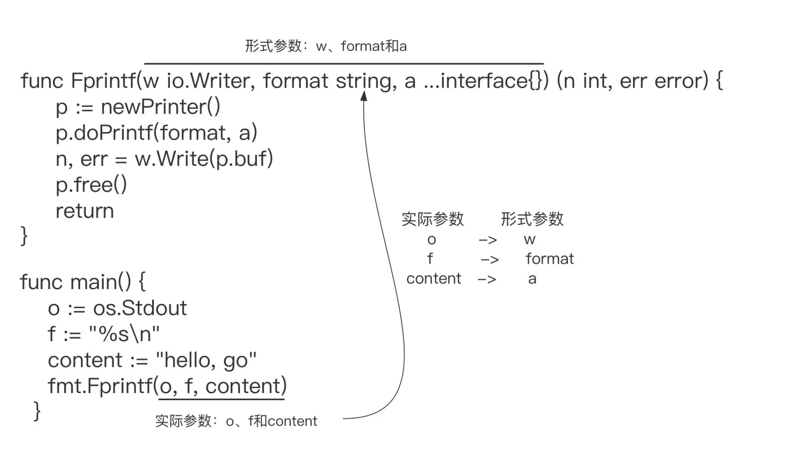

# 函数

函数这种语法元素的诞生，源于将大问题分解为若干小任务与代码复用；函数是唯一一种基于特定输入，实现特定任务并可返回任务执行结果的代码块。

## 函数声明

```go
func 函数名(参数) 返回值 {
	// 函数体
}
```

- `func`：Go 函数声明的关键字。
- 函数名，函数名是指代函数定义的标识符，由字母、数字、下划线组成。但函数名的第一个字母不能是数字；**在同一个 Go 包中，函数名应该是唯一的，并且它也遵守 Go 标识符的导出规则**，即首字母大写的函数名指代的函数是可以在包外使用的，小写的就只在包内可见。
- 参数，**由一个或多个参数变量和参数变量的类型组成，多个参数之间使用逗号分隔**；每个参数的参数名在前，参数类型在后，这和变量声明中变量名与类型的排列方式是一致的；**Go 函数支持变长参数**（底层切片实现），也就是一个形式参数可以对应数量不定的实际参数。**变长参数与普通参数在声明时的不同点，就在于它会在类型前面增加了一个“…”符号**；Go 函数支持变长参数，也就是一个形式参数可以对应数量不定的实际参数。
- 返回值，返回值由返回值变量和其变量类型组成，也可以只写返回值的类型，多个返回值必须用`()`包裹，并用逗号分隔。
- 函数体，实现特定逻辑的代码块。

> 每个函数声明所定义的函数，仅仅是对应的函数类型的一个实例：
>
> - 在声明函数类型时，可以省略函数签名参数列表中的参数名，以及返回值列表中的返回值变量名
>
>     ```go
>     func(io.Writer, string, ...interface{}) (int, error)
>     ```
>
> - 如果两个函数类型的函数签名是相同的，即便参数列表中的参数名，以及返回值列表中的返回值变量名都是不同的，那么这两个函数类型也是相同类型。
>
>     ```go
>     func (a int, b string) (results []string, err error)
>     func (c int, d string) (sl []string, err error)
>     ```

```go
package main

import "fmt"

func main() {
	// 函数调用并接收返回值
	result := sum(3, 5)
	fmt.Printf("result: %d", result) // result: 8
}

// 函数声明
func sum(a, b int) int {
	return a + b
}
```

## 参数

把参数列表中的参数叫做形式参数（Parameter，简称形参），在函数体中，使用的都是形参；而在函数实际调用时传入的参数被称为实际参数（Argument，简称实参）。



**函数参数传递采用是值传递的方式**。所谓“值传递”，就是将实际参数在内存中的表示逐位拷贝（Bitwise Copy）到形式参数中。对于像整型、数组、结构体这类类型，它们的内存表示就是它们自身的数据内容，因此当这些类型作为实参类型时，值传递拷贝的就是它们自身，传递的开销也与它们自身的大小成正比。[传送门](https://go.dev/play/p/j38wW-o1z1M)

```go
package main

import "fmt"

func main() {
	x := 10
	y := 20

	fmt.Println("Before swap:")
	fmt.Println("x =", x) // x = 10
	fmt.Println("y =", y) // y = 20

	swap(x, y)

	fmt.Println("After swap:")
	fmt.Println("x =", x) // x = 10
	fmt.Println("y =", y) // y = 20
}

// swap函数接受两个整数作为参数，并交换它们的值
func swap(a, b int) {
	temp := a
	a = b
	b = temp
}
```

但是像 string、slice、map 这些类型就不是了，它们的内存表示对应的是它们数据内容的“描述符”。当这些类型作为实参类型时，值传递拷贝的也是它们数据内容的“描述符”，不包括数据内容本身，所以这些类型传递的开销是固定的，与数据内容大小无关。这种只拷贝“描述符”，不拷贝实际数据内容的拷贝过程，也被称为“浅拷贝”。[传送门](https://go.dev/play/p/YHfqt94CaQ7)

```go
package main

import "fmt"

func main() {
	// 修改字符串
	str := "hello"
	fmt.Println("Before update:")
	fmt.Println("str =", str) // str = hello
	updateString(str)
	fmt.Println("After update:")
	fmt.Println("str =", str) // str = hello

	// 修改 slice
	slice := []string{"hello", "world"}
	fmt.Println("Before update:")
	fmt.Println("slice =", slice) // slice = [hello world]
	updateSlice(slice)
	fmt.Println("After update:") // slice = [updated world]
	fmt.Println("slice =", slice)

	// 修改 map
	mp := map[string]string{"key": "value"}
	fmt.Println("Before update:")
	fmt.Println("mp =", mp) // mp = map[key:value]
	updateMap(mp)
	fmt.Println("After update:")
	fmt.Println("mp =", mp) // mp = map[key:updated]
}

// updateString函数接受一个字符串作为参数，并将字符串修改为"updated"
func updateString(s string) {
	s = "updated"
}

// updateSlice函数接受一个切片作为参数，并将切片中的第一个元素修改为"updated"
func updateSlice(s []string) {
	s[0] = "updated"
}

// updateMap函数接受一个映射（map）作为参数，并将键"key"对应的值修改为"updated"
func updateMap(m map[string]string) {
	m["key"] = "updated"
}
```

当函数的形参为接口类型，或者形参是变长参数时，Go 编译器会把传递的实参赋值给对应的接口类型形参；对于为变长参数的形参，Go 编译器会将零个或多个实参按一定形式转换为对应的变长形参。[传送门](https://go.dev/play/p/0Z8045D4s8Q)

```go
package main

import "fmt"

func myAppend(sl []int, elems ...int) []int {
	fmt.Printf("%T\n", elems) // []int
	if len(elems) == 0 {
		println("no elems to append")
		return sl
	}

	sl = append(sl, elems...)
	return sl
}

func main() {
	sl := []int{1, 2, 3}
	sl = myAppend(sl) // no elems to append
	fmt.Println(sl)   // [1 2 3]
	sl = myAppend(sl, 4, 5, 6)
	fmt.Println(sl) // [1 2 3 4 5 6]
}
```

## 返回值

Go 函数支持多返回值，下面是三种格式的具体示例：

- 无返回值的函数

    ```go
    package main

    import "fmt"

    func main() {
        // 调用无返回值的函数
        foo()
    }

    // 无返回值的函数
    func foo() {
        fmt.Println("Hello, world!")
    }
    ```

- 仅有一个返回值的函数 [传送门](https://go.dev/play/p/CcGX0UDcd9s)

    ```go
    package main

    import "fmt"

    func main() {
     // 调用仅有一个返回值的函数
     err := foo()
     if err != nil {
      fmt.Println("Error:", err)
     } else {
      fmt.Println("Success")
     }
    }

    // 仅有一个返回值的函数
    func foo() error {
     return fmt.Errorf("something went wrong")
    }
    ```

- 有2个或2个以上返回值的函数 [传送门](https://go.dev/play/p/b3i7BDqVfSc)

    ```go
    package main

    import "fmt"

    func main() {
     // 调用有2个或2个以上返回值的函数
     num, str, err := foo()
     if err != nil {
      fmt.Println("Error:", err)
     } else {
      fmt.Println("Number:", num)
      fmt.Println("String:", str)
     }
    }

    // 有2个或2个以上返回值的函数
    func foo() (int, string, error) {
     return 42, "hello", nil
    }
    ```

- 具名返回值

    函数定义时可以给返回值命名，并在函数体中直接使用这些变量，最后通过`return`关键字返回。[传送门](https://go.dev/play/p/qCc-Ku82y2c)

    ```go
    package main

    import "fmt"

    func main() {
     // 调用使用命名返回值的函数
     circleArea, circleCircumference := calculateCircle(2.5)
     fmt.Println("Circle Area:", circleArea)
     fmt.Println("Circle Circumference:", circleCircumference)
    }

    // 使用命名返回值的函数
    func calculateCircle(radius float64) (area float64, circumference float64) {
     // 计算圆的面积和周长
     area = 3.14 * radius * radius
     circumference = 2 * 3.14 * radius
     // 直接通过return返回命名的返回值
     return
    }
    ```

## 高阶函数

高阶函数分为函数作为参数和函数作为返回值两部分

### [函数作为参数](https://go.dev/play/p/2uirmX5oO39)

```go
package main

import "fmt"

func main() {
	// 调用performOperation函数，并将add函数作为参数传递
	result := performOperation(add, 10, 5)
	fmt.Println("Addition Result:", result) // Addition Result: 15

	// 调用performOperation函数，并将subtract函数作为参数传递
	result = performOperation(subtract, 10, 5)
	fmt.Println("Subtraction Result:", result) // Subtraction Result: 5
}

// 函数作为参数传递的示例
func performOperation(operation func(int, int) int, a, b int) int {
	// 调用传递进来的函数并返回结果
	return operation(a, b)
}

// 加法函数
func add(a, b int) int {
	return a + b
}

// 减法函数
func subtract(a, b int) int {
	return a - b
}
```

### [函数作为返回值](https://go.dev/play/p/j4YRExpc-LX)

```go
package main

import "fmt"

func main() {
	// 调用getOperation函数，并根据参数获取不同的操作函数
	addOperation := getOperation("add")
	subtractOperation := getOperation("subtract")

	// 调用返回的操作函数
	result := addOperation(10, 5)
	fmt.Println("Addition Result:", result) // Addition Result: 15

	result = subtractOperation(10, 5)
	fmt.Println("Subtraction Result:", result) // Subtraction Result: 5
}

// 函数作为返回值的示例
func getOperation(operationType string) func(int, int) int {
	if operationType == "add" {
		return add
	} else if operationType == "subtract" {
		return subtract
	} else {
		return nil
	}
}

// 加法函数
func add(a, b int) int {
	return a + b
}

// 减法函数
func subtract(a, b int) int {
	return a - b
}
```

### 匿名函数

在Go语言中，匿名函数是一种没有具体名称的函数。它可以在定义的地方直接使用，或者将其赋值给变量进行后续调用。匿名函数通常用于需要在函数内部定义并使用的简单逻辑块。匿名函数多用于实现回调函数和闭包。

声明语法:

```go
func(参数)(返回值){
	函数体
}
```

匿名函数因为没有函数名，所以没办法像普通函数那样调用，所以匿名函数需要保存到某个变量或者作为立即执行函数：[传送门](https://go.dev/play/p/8bi7XJwrMX2)

```go
package main

import "fmt"

func main() {
	// 定义并调用匿名函数
	func() {
		fmt.Println("Hello, World!") // Hello, World!
	}()

	// 将匿名函数赋值给变量，并调用
	greet := func() {
		fmt.Println("Hello, Go!")
	}
	greet() // Hello, Go!
}
```

> 定义并调用匿名函数与将匿名函数赋值给变量并调用：
>
> - 定义并调用匿名函数适用于只需要执行一次的简单逻辑。
> - 将匿名函数赋值给变量并调用适用于需要重复调用或传递给其他函数的逻辑。

### 匿名函数

闭包指的是一个函数和与其相关的引用环境组合而成的实体。简单来说，`闭包=函数+引用环境(执行上下文)` [传送门](https://go.dev/play/p/m8DQagxfWBP)

```go
package main

import "fmt"

func main() {
	// 创建一个累加器
	acc := accumulator()

	// 使用闭包函数进行累加
	fmt.Printf("第一次调用： %d\n", acc(1)) // 第一次调用： 1
	fmt.Printf("第二次调用： %d\n", acc(2)) // 第二次调用： 3
	fmt.Printf("第三次调用： %d\n", acc(3)) // 第三次调用： 6
}

// 返回一个闭包函数，用于计算累加值
func accumulator() func(int) int {
	sum := 0 // sum 是闭包函数引用的变量

	// 返回的闭包函数
	return func(x int) int {
		sum += x
		return sum
	}
}
```

在这个示例中，定义了一个 `accumulator` 函数，它返回一个闭包函数。这个闭包函数引用了内部变量 `sum` ，用于计算累加值。在 `main` 函数中，调用 `accumulator` 函数创建了一个累加器 `acc`。通过调用`acc`函数，我们可以使用闭包函数进行累加操作。每次调用`acc`函数时，闭包函数都会更新`sum`变量，并返回累加后的值。

### defer 语句

在Go语言中，**`defer` 是一种用于延迟执行函数调用的关键字**。通过使用 `defer`，我们可以将函数调用推迟到包含 `defer` 语句的函数即将返回之前执行。无论函数是通过正常返回还是通过发生错误而返回，`defer` 语句都会被执行。

以下是一个具体的示例代码，展示了 `defer` 的用法和相关的解释：[传送门](https://go.dev/play/p/PIdHrRWfB-3)

```go
package main

import "fmt"

func main() {
	// 使用 defer 关键字延迟执行函数调用
	defer printMessage()
	defer closeResource()

	fmt.Println("Main function body")
}

// 在函数返回前打印消息
func printMessage() {
	fmt.Println("Printing message...")
}

// 在函数返回前关闭资源
func closeResource() {
	fmt.Println("Closing resource...")
}
```

在这个示例中，定义了两个函数：`printMessage`和 `closeResource`。这两个函数分别用于在函数返回前打印消息和关闭资源。在 `main` 函数中，我们使用 `defer` 关键字来推迟执行 `printMessage` 和 `closeResource` 函数的调用。无论 `main` 函数是通过正常返回还是通过发生错误而返回，这两个函数的调用都会被延迟执行。执行结果:

```sh
Main function body
Closing resource...
Printing message...
```

**`defer` 语句的执行顺序是后进先出（LIFO）的，也就是说最后一个 `defer` 语句会最先执行，依次类推**。这个特性使得 `defer` 非常适合用于资源的清理和释放，因为可以确保在函数返回之前执行相应的清理操作。

`defer`的使用可以使代码更加简洁和易读，同时也可以避免忘记执行必要的清理操作。在实际开发中，`defer`常常被用于处理文件的打开和关闭、锁的获取和释放等场景。

场景分析：[传送门](https://go.dev/play/p/rLhJ_Rrpxgs)

```go
package main

import "fmt"

func main() {
	fmt.Println("f1:", f1())
	fmt.Println("f2:", f2())
	fmt.Println("f3:", f3())
	fmt.Println("f4:", f4())
}

func f1() int {
	x := 5
	defer func() {
		x++
	}()
	return x
}

func f2() (x int) {
	defer func() {
		x++
	}()
	return 5
}

func f3() (y int) {
	x := 5
	defer func() {
		x++
	}()
	return x
}

func f4() (x int) {
	defer func(x int) {
		x++
	}(x)
	return 5
}
```

上面的代码中，有四个函数 `f1`、`f2`、`f3` 和 `f4`，每个函数都使用了 `defer` 关键字。

1. `f1` 函数中，`defer` 语句引用了外部作用域的变量 `x`，但是 `defer` 语句在 `return` 语句之前执行，所以 `x` 的值并没有被修改。因此，`f1` 函数返回 `x` 的初始值 `5`。
2. `f2` 函数中，`defer` 语句同样引用了外部作用域的变量 `x`，但是这次 `defer` 语句在 `return` 语句之后执行。由于 `x` 是函数的命名返回值，所以它的值会被修改为 `5` 返回之前的值 `6`。
3. `f3` 函数中，`defer` 语句同样引用了外部作用域的变量 `x`。但是 `f3` 函数中同时定义了一个命名返回值 `y`，并将 `x` 的值赋值给 `y`。在 `defer` 语句执行之前，`y` 的值已经被赋值为 `5`。因此，`f3` 函数返回 `y` 的初始值 `5`。
4. `f4` 函数中，`defer` 语句传递了参数 `x`，但是这个参数是按值传递的，所以在 `defer` 函数内部修改的是参数的副本，并不会影响返回值 `x` 的值。因此，`f4` 函数返回 `x` 的初始值 `5`。

所以，最终的输出结果是：

```sh
f1: 5
f2: 6
f3: 5
f4: 5
```

代码分析: [传送门](https://go.dev/play/p/cB6yc9imS1g)

```go
package main

import "fmt"

func main() {
	x := 1
	y := 2
	defer calc("AA", x, calc("A", x, y))
	x = 10
	defer calc("BB", x, calc("B", x, y))
	y = 20
}

func calc(index string, a, b int) int {
	ret := a + b
	fmt.Println(index, a, b, ret)
	return ret
}
```

在这段代码中，定义了一个`calc` 函数，在 `main` 函数中，我们使用了 `defer` 关键字来延迟执行函数调用。

1. 首先，在 `main` 函数中定义了两个变量 `x` 和 `y`，它们分别被赋值为 `1` 和 `2`。
2. 接下来，在第一个 `defer` 语句中，我们调用了 `calc("A", x, y)` 函数，并将其结果作为参数传递给 `calc("AA", x, calc("A", x, y))` 函数。这里需要注意的是，`calc("A", x, y)` 函数会首先执行，并输出 `"A 1 2 3"`，然后将结果 `3` 作为参数传递给 `calc("AA", x, 3)` 函数，整个表达式被推迟执行。
3. 然后，我们将 `10` 赋值给变量 `x`。
4. 接着，在第二个 `defer` 语句中，我们调用了 `calc("B", x, y)` 函数，并将其结果作为参数传递给 `calc("BB", x, calc("B", x, y))` 函数。同样地，`calc("B", x, y)` 函数会先执行，并输出 `"B 10 2 12"`，然后将结果 `12` 作为参数传递给 `calc("BB", 10, 12)` 函数，整个表达式被推迟执行。
5. 最后，我们将 `20` 赋值给变量 `y`。

在整个程序执行完毕后，`defer` 语句中的函数调用会按照后进先出（LIFO）的顺序执行。所以，首先会执行 `calc("BB", 10, 12)`，输出 `"BB 10 12 22"`；然后会执行 `calc("AA", 1, 3)`，输出 `"AA 1 3 4"`。

因此，最终的输出结果是：

```sh
A 1 2 3
B 10 2 12
BB 10 12 22
AA 1 3 4
```

### defer 与 return

当 一个函数中既包含了defer也有return时，它们的执行顺序是？[传送门](https://go.dev/play/p/qo4VSHURoef)

```go
package main

import "fmt"

func main() {
	fmt.Println(foo())
}

func foo() int {
	num := 42
	defer fmt.Println("defer 1")

	defer func() {
		num++
		fmt.Println("defer 2")
	}()

	fmt.Println("foo")
	return num
}
```

在上述代码中，我们定义了一个 `foo` 函数，其中包含了两个 `defer` 语句和一个 `return` 语句。虽然在 `defer` 语句中对 `num` 进行了自增操作，但是这个自增操作对函数的返回值没有任何影响。**函数的返回值在 `return` 语句执行时就已经确定了**，之后对 `num` 的修改不会改变函数的返回结果。

```sh
foo
defer 2
defer 1
42
```

在 `foo` 函数中，我们将 `num` 的初始值设为 `42`，然后通过 `defer` 语句对其进行自增操作。但是，在 `return` 语句执行时，函数的返回结果已经被确定为 `42`，而不是自增后的值。这是因为 `return` 语句在执行时会将返回结果保存下来，而不会再关注后续的 `defer` 语句。因此，无论 `defer` 语句中对 `num` 进行了多少次自增操作，`foo` 函数的返回值始终是初始值 `42`。

当一个函数中既包含了 `defer` 语句又有 `return` 语句时，它们的执行顺序如下：

1. 当函数执行到 `defer` 语句时，会将 `defer` 后面的表达式或函数调用压入一个栈中，但不会立即执行。这样做的目的是为了延迟函数的执行，将其放在函数返回之后执行。
2. 接着，函数会执行 `return` 语句，并将返回结果保存下来。请注意，这里的返回结果并不是最终的函数返回结果，而是在 `return` 语句中指定的结果。
3. 最后，**函数会从栈中按照后进先出（LIFO）的顺序取出被推迟的函数调用**，并执行它们。这意味着 `defer` 语句中的函数调用会在函数返回之后执行。

## 内置函数

| 内置函数 | 描述                                     |
| -------- | ---------------------------------------- |
| close    | 关闭一个通道（channel）                  |
| len      | 返回字符串、数组、切片、字典或通道的长度 |
| cap      | 返回切片的容量，通道的缓冲区大小         |
| new      | 为类型分配内存并返回指向该类型的指针     |
| make     | 用于创建切片、映射和通道                 |
| append   | 将元素追加到切片的末尾                   |
| copy     | 将源切片的元素复制到目标切片             |
| delete   | 从字典中删除指定键的键值对               |
| panic    | 触发一个运行时错误。                     |
| recover  | 从 panic 中恢复，用于处理运行时错误      |
