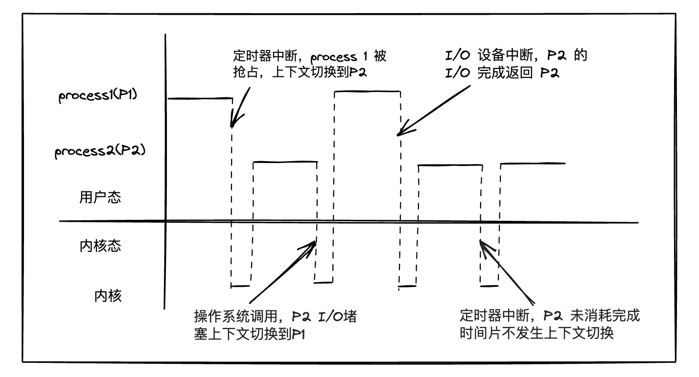
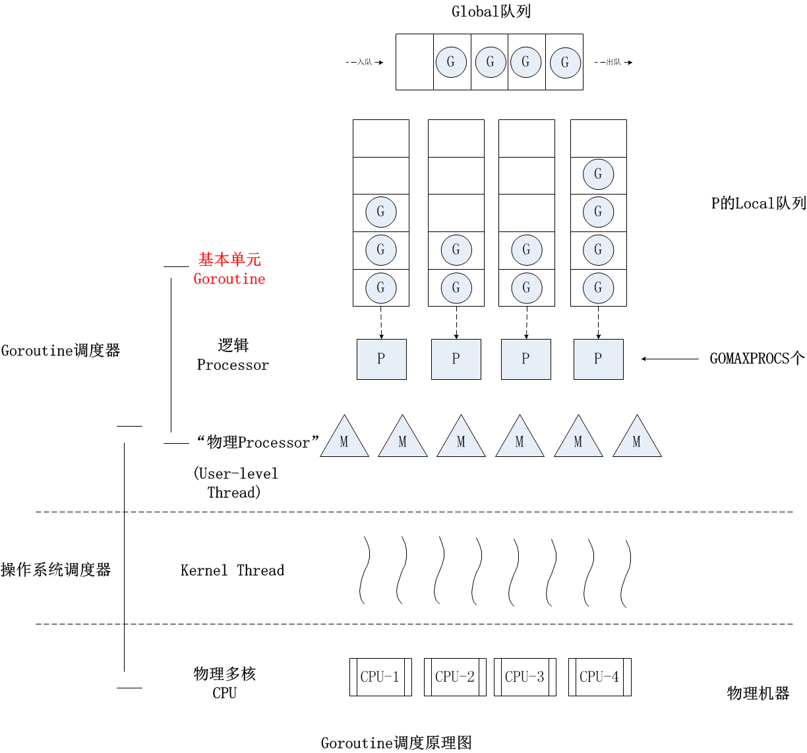

Go 并没有使用操作系统线程作为承载分解后的代码片段（模块）的基本执行单元，而是实现了 `goroutine` 这一由 **Go 运行时（runtime）负责调度的、轻量的用户级线程**，为并发程序设计提供原生支持。

## 进程与线程
在计算机科学中，**线程是可以有调度程序独立管理的最小程序指令集，而进程是程序运行的实例**。

<div style="width:100%;display:flex;justify-content:space-evenly;">
  <div style="width:45%;display:flex;justify-content:cneter;flex-direction:column;">
    
    <p style="text-align:center;color:f08c00;">单进程应用</p>
  </div>
  <div style="width:45%;display:flex;justify-content:center;flex-direction:column;">
    
    <p style="text-align:center;color:f08c00;">多进程应用</p>
  </div>
</div>


在大部分情况下，**线程是进程的组成部分，一个进程中可以存在多个线程，这些线程并发执行并共享进程的内存（例如全局变量）等资源**。而**进程之间相对独立，不同进程具有不同的内存地址空间、代表程序运行的机器码、进程状态、操作系统资源描述符等**

在一个进程内部，可能有多个线程被同时处理。追求高并发处理、高性能的程序或者库一把都会设计为多线程。

> 为什么程序通常不采取多进程，而采取多线程的方式进行设计呢？
>
> 因为开启一个新的进程比开启一个新线程**大（开销）得多**，而且**进程具有独立的内存空间**，这使得多进程之间的共享通信更加困难

操作系统调度到 CPU 中执行的最小单位是线程；在传统的单核（Core）CPU 上运行的多线程应用程序必须交织线程，交替抢占 CPU 的时间片。但是现代计算机系统普遍拥有多核处理器；在多核 CPU上，线程可以分布在多个 CPU 核心上，从而实现真正的并行处理。

## 线程上下文切换
当计算机处理多个任务时，即使处理器有多个核心可以同时执行不同的任务，但实际上，要运行的程序和需要的线程数量通常比处理器核心数多得多。因此，*为了确保每个线程都能得到足够的处理时间，并且最大限度地利用处理器资源，操作系统需要进行上下文切换*。这种切换通常是在特定时间间隔、输入输出设备操作或系统调用时发生的。

在进行线程上下文切换时，操作系统需要从当前正在执行的线程切换到另一个线程。这个过程中，操作系统需要保存当前线程的重要信息，比如寄存器的内容和进程状态，保存在操作系统的线程控制块中。然后，它加载下一个要执行的线程的重要信息，使其可以继续执行。如果切换的线程属于不同的进程，操作系统还需要更新额外的状态信息和内存地址空间，并确保正确导入新的页表到内存中。



在处理进程之间的切换时，**最大的麻烦是因为要改变内存地址空间**，这会导致缓存失效，就好像你在书里标记了页码，但是突然要换一本书，之前的标记就失效了一样。所以，不同进程间的切换比同一进程内的线程切换慢很多。


## 线程与协程（goroutine）

**线程是由操作系统调度和管理的，而协程是由 Go 语言的运行时环境管理的**。在操作系统级别，每个线程都有自己的内存空间和堆栈，而协程则共享相同的地址空间，因此创建和销毁协程的成本通常比线程低。

其次，**线程通常是并发执行的，而协程则是轻量级的并发单元**。在大多数操作系统上，*线程都是通过在多个处理器核心上同时运行来实现并发的*。但是，线程的创建和销毁通常比较昂贵，而协程的创建和销毁成本很低，因此在Go语言中，可以轻松创建数千甚至数百万个协程而不会造成性能问题。

最后，线程通常是阻塞式的，也就是说当一个线程在等待某些I/O操作完成时，它会被阻塞，并且在此期间不能执行其他任务。而协程则通常是非阻塞的，可以在等待I/O操作完成时让出CPU，允许其他协程继续执行，从而提高了并发性能。

在Go语言中，协程是一种非常强大的并发编程工具，它们使得编写并发程序变得简单而高效。通过使用关键字go来启动一个新的协程，Go语言的运行时环境会负责调度这些协程，并在需要时自动将它们分配到可用的处理器核心上执行。

相比传统操作系统线程来说，goroutine 的优势主要是：
- **资源占用小**，每个 goroutine 的初始栈大小仅为 2k；
- 由 Go 运行时而不是操作系统调度，goroutine 上下文切换在用户层完成，**开销更小**；
- **在语言层面而不是通过标准库提供**。goroutine 由go关键字创建，一退出就会被回收或销毁，开发体验更佳；
- **语言内置 `channel` 作为 goroutine 间通信原语**，为并发设计提供了强大支撑。

与传统编程语言不同的是，Go 语言是面向并发而生的，所以，在程序的结构设计阶段，Go 的惯例是优先考虑并发设计。这样做的目的更多是考虑随着外界环境的变化，通过并发设计的 Go 应用可以更好地、更自然地适应规模化（scale）。

> 比如，当应用被分配到更多计算资源，或者计算处理硬件增配后，Go 应用不需要再进行结构调整，就可以充分利用新增的计算资源。而且，经过并发设计后的 Go 应用也会更加契合 Gopher 们的开发分工协作。

## goroutine 的基本用法

Go 没有使用操作系统线程作为承载分解后的代码片段的基本执行单元，而是实现了 goroutine 这一由 Go 运行时负责调度的、轻量的用户级线程，为并发提供了原生支持；并发是一种能力，它让你的程序可以由若干个代码片段组合而成，并且每个片段都是独立运行的。`goroutine` 恰恰就是 Go 原生支持并发的一个具体实现。无论是 Go 自身运行时代码还是用户层 Go 代码，都无一例外地运行在 `goroutine` 中。

这一方案的优势：
- 资源占用小，每个 `goroutine` 的初始栈大小仅为 2k
- 由 Go 运行时而不是操作系统调度，`goroutine` 上下文切换在用户层完成，开销更小
- 在语言层面而不是通过标准库提供；`goroutine` 由关键字 `go` 创建，一退出就会被回收或销毁，开发体验更佳
- 语言内置 `channel` 作为 `goroutine` 间通信原语，为并发设计提供了强大支撑

### 创建 goroutine

Go 语言通过 **`go` 关键字+函数/方法**的方式创建一个 `goroutine`；创建后，新的 goroutine 将拥有独立的代码执行流，并于创建它的 `goroutine` 一起被 Go 运行时调度。
> 一个 `goroutine` 必定对应一个函数，可以创建多个 `goroutine` 去执行相同的函数。

#### 启动单个 goroutine
先来个例子，[在线运行](https://go.dev/play/p/JN24NSps_-C)
```go
package main

import "fmt"

func sayHello() {
	fmt.Println("hello goroutine!")
}
func main() {
	sayHello()
	fmt.Println("main goroutine done!")
}
```
执行结果如下：
```go
hello goroutine!
main goroutine done!
```

上面示例中，`sayHello` 函数和下面的语句是串行的，执行的结果是打印完 `hello goroutine!`后打印 `main goroutine done!`。

接下来我们在调用 `sayHello` 函数前面加上关键字 `go`，也就是启动一个 goroutine 去执行 `sayHello`这个函数。代码如下：[在线运行](https://go.dev/play/p/D9weBxAbVBk)
```go
package main

import "fmt"

func sayHello() {
	fmt.Println("hello goroutine!")
}
func main() {
	go sayHello() // 启动另外一个 goroutine 去执行 sayHello 函数
	fmt.Println("main goroutine done!")
}
```
执行结果如下：
```js
main goroutine done!
```
运行后发现只有 `main goroutine done!`，没有打印 `hello goroutine!`。为什么呢？

**在程序启动时，Go程序就会为 `main()` 函数创建一个默认的goroutine**。当 `main()` 函数返回的时候该 goroutine 就结束了，所有在 `main()` 函数中启动的 goroutine 会一同结束。要解决这个问题，关键在于让 `main` 函数等一等 `sayHello` 函数，最简单粗暴的方式就是 `time.Sleep` 了。

调整后的代码如下：[在线运行](https://go.dev/play/p/M6k_h1Bsc-T)
```go
package main

import (
	"fmt"
	"time"
)

func sayHello() {
	fmt.Println("hello goroutine!")
}
func main() {
	go sayHello() // 启动另外一个 goroutine 去执行 sayHello 函数
	fmt.Println("main goroutine done!")
	time.Sleep(time.Second)
}
```

执行的结果如下：
```go
main goroutine done!
hello goroutine!
```

执行上面的代码你会发现，这一次先打印 `main goroutine done!`，然后紧接着打印 `hello goroutine!`。

#### 启动多个 goroutine
启动多个 goroutine 其实和启动单个 goroutine 一样，示例如下：
```go
package main

import (
	"fmt"
	"time"
)

func main() {
	// 启动第一个goroutine，计算1+2的和
	go func() {
		sum := 1 + 2
		fmt.Println("Goroutine 1:", sum)
	}()

	// 启动第二个goroutine，计算3+4的和
	go func() {
		sum := 3 + 4
		fmt.Println("Goroutine 2:", sum)
	}()

	// 主线程等待一段时间，确保goroutine有足够的时间执行
	time.Sleep(1 * time.Second)
}
```
执行结果打印的顺序有可能如下；这是*因为 goroutine 是异步执行的，它们之间的执行顺序是不确定的*。
```go
Goroutine 1: 3
Goroutine 2: 7
```
在上面的示例中，我们使用 `go` 关键字启动了两个 goroutine。每个 goroutine 都是一个匿名函数，用于执行简单的计算任务。`go` 关键字会在一个新的 goroutine 中启动匿名函数，并且立即返回，而不会等待函数执行完成。

在主线程中，我们使用 `time.Sleep` 函数来等待一段时间，以确保 goroutine 有足够的时间执行。这是因为 goroutine 是异步执行的，主线程可能会在 goroutine 执行完成之前就结束了。


通过上面两个例子，可以看到通过 `go` 关键字，我们可以基于已有的`具名函数/方法创建 goroutine，也可以基于匿名函数/闭包创建 goroutine`；如果具名函数或者匿名函数有返回值会怎么样？

**当使用 `go` 关键字创建 goroutine 时，无论是基于具名函数还是匿名函数，如果这些函数有返回值，这些返回值将会被忽略。这是因为 goroutine 的启动是非阻塞的，主程序会继续执行而不等待 goroutine 的返回值。具名函数或匿名函数的返回值不会被收集或利用。**

这种行为主要是为了确保 goroutine 启动的速度和轻量级特性。如果需要从 goroutine 中获取返回值，可以使用通道（`channel`）或其他同步机制来实现。

下面是一个示例代码，演示了基于具名函数和匿名函数创建 goroutine，但不会获取它们的返回值：
```go
package main

import (
    "fmt"
    "time"
)

// 具名函数
func namedFunction() int {
    time.Sleep(2 * time.Second)
    return 42
}

func main() {
    // 基于具名函数创建 goroutine
    go namedFunction()

    // 基于匿名函数创建 goroutine
    go func() {
        time.Sleep(1 * time.Second)
        fmt.Println("Anonymous function goroutine")
    }()

    // 等待一段时间以确保 goroutines 有足够时间执行
    time.Sleep(3 * time.Second)

    fmt.Println("Main goroutine done")
}
```
在这个示例中，无论是 `namedFunction` 函数还是匿名函数，它们都没有返回值被使用。主程序会启动这些 goroutine，然后继续执行。

了解了怎么创建，那我们怎么退出 goroutine 呢？
> **goroutine 的执行函数的返回，就意味着 goroutine 退出**。

在 Go 语言中，goroutine 的生命周期通常由其所在的函数的执行周期来确定。当一个函数执行完毕时，其中创建的 goroutine 也会自然结束。但是，有时候我们可能需要在某些条件下提前结束 goroutine。

一种常见的方式是使用通道（`channel`）来进行通信。通过在 goroutine 中监听一个退出通道，在主程序中发送退出信号到该通道，从而触发 goroutine 的退出。

下面是一个示例代码，演示了如何使用通道来退出 goroutine：
```js
package main

import (
    "fmt"
    "time"
)

func worker(done chan bool) {
    fmt.Println("Worker: Starting work...")
    // 模拟耗时工作
    time.Sleep(2 * time.Second)
    fmt.Println("Worker: Work done!")
    
    // 发送完成信号到通道
    done <- true
}

func main() {
    // 创建一个通道用于接收工作完成信号
    done := make(chan bool)

    fmt.Println("Main: Starting worker...")
    // 启动goroutine
    go worker(done)

    // 等待工作完成或超时
    select {
    case <-done:
        fmt.Println("Main: Worker finished!")
    case <-time.After(3 * time.Second):
        fmt.Println("Main: Timeout! Worker didn't finish in time.")
    }
}
```

在这个示例中，`worker` 函数是一个耗时的任务，它接收一个类型为 `chan bool` 的通道作为参数。在任务完成后，它会向通道发送一个布尔值 `true`，表示任务完成。

在 `main` 函数中，我们先创建了一个用于接收完成信号的通道 `done`，然后启动了一个 goroutine 来执行 `worker` 函数。在 main 函数中，我们使用 `select` 语句来等待两种情况：一种是从 `done` 通道接收到完成信号，另一种是超时。如果超时时间内任务没有完成，我们会输出相应的提示信息。

## goroutine 间的通信
传统的编程语言如 C++、Java 和 Python 并非专门为并发而设计，它们通常**依赖于操作系统的线程来处理并发逻辑**。**线程之间的通信主要依赖于操作系统提供的原语**，比如共享内存、信号、管道、消息队列和套接字等。在这些**通信方式中，最常用、最广泛且效率最高的是利用了线程同步原语（如锁和原子操作）的共享内存方式**。因此，我们可以说传统语言的并发模型是基于内存共享的。

传统的并发模型主要依赖于共享内存，但这种方式很容易出错，特别是在大型或复杂的程序中。开发人员在设计并发程序时，需要考虑线程模型并规划线程之间的通信方式。如果选择了基于共享内存的高效机制，就需要花费大量时间来设计线程间的同步机制。此外，还必须处理复杂的内存管理问题，并防止出现死锁等情况。

从设计之初，Go 语言就致力于解决传统并发模型的复杂性问题，并在新的并发模型设计中受到了著名计算机科学家 Tony Hoare 提出的 CSP（Communicating Sequential Processes，通信顺序进程）模型的启发。Tony Hoare 提出的 CSP 模型的目标是简化并发程序的编写，使并发程序的编写过程与编写顺序程序一样简单。他强调了输入输出作为基本的编程原语，认为**数据处理逻辑（即 CSP 中的 P）只需调用输入原语获取数据，顺序地处理数据，然后通过输出原语输出结果数据**。因此，在 Tony Hoare 的观点中，一个符合 CSP 模型的并发程序应该是**一组通过输入输出原语连接起来的 P 的集合**。从这个角度来看，CSP 理论不仅是一个并发参考模型，还是一种并发程序的程序组织方法。这种组合思想与 Go 的设计哲学不谋而合。

> 在 Tony Hoare 的 CSP 理论中，P 代表着一个进程（Process），它是一个抽象概念，用来表示任何一段顺序处理逻辑的封装。这段逻辑可以接收输入数据，也可以从其他进程的输出中获取数据，然后对这些数据进行处理，最后产生出可以被其他进程使用的输出数据。
>
> 换句话说，你可以把 P 想象成一个小工厂，它接收原材料（输入数据），经过加工处理后，生产出成品（输出数据），这些成品又可以被其他工厂使用。这种逻辑上的封装使得每个进程都可以独立运行，并且通过输入和输出与其他进程进行通信，从而实现复杂的并发编程任务。

```go
package main

import (
	"errors"
	"fmt"
	"time"
)

func main() {
	c := spawn(func() error {
		time.Sleep(2 * time.Second)
		return errors.New("timeout")
	})
	fmt.Println(<-c)
}

func spawn(f func() error) <-chan error {
	c := make(chan error)

	go func() {
		c <- f()
	}()

	return c
}
```
这个示例在 main goroutine 与子 goroutine 之间建立了一个元素类型为 error 的 channel，子 goroutine 退出时，会将它执行的函数的错误返回值写入这个 channel，main goroutine 可以通过读取 channel 的值来获取子 goroutine 的退出状态。
- `main` 函数是程序的入口函数。
- `spawn` 函数是一个工具函数，它接受一个函数作为参数，并返回一个只读的 channel，用于接收该函数执行的结果。
- 在 `main` 函数中，首先调用 `spawn` 函数，传入一个匿名函数作为参数。这个匿名函数会在一个单独的 goroutine 中执行。
- 在这个匿名函数中，会执行一个 `time.Sleep(2 * time.Second)`，暂停当前 goroutine 的执行，模拟一个耗时操作。然后它返回一个错误，表示超时。
- `main` 函数接着会从 channel `c` 中读取数据。这会导致 `main` 函数阻塞，直到从 channel 中接收到数据。
- 因为 `spawn` 函数中的 goroutine 已经执行完毕，它会将错误值发送到 channel `c` 中。
- `main` 函数接收到从 channel 中读取到的错误值，然后将其打印出来。


## Goroutine 调度器

当我们谈论调度时，**通常是指操作系统如何管理多个任务的执行顺序**。操作系统会根据任务的优先级和其他条件来安排任务的执行顺序。

在操作系统中，任务可以是进程或线程。调度器会根据一些算法，如先来先服务、优先级调度等，决定哪个任务优先执行，哪个任务需要等待。这样可以确保系统资源的合理利用，提高系统的整体效率。

但是一个Go程序对于操作系统来说只是一个用户层程序，操作系统眼里只有线程，它是运行在一个或多个操作系统的线程上的，也就是 **Goroutine 是按照一定算法放在不同的操作系统线程中去执行的**。Goroutine 是如何被 Go 语言的调度器安排到不同的操作系统线程上的？

Goroutine 的调度模型经过十多年的迭代，从最初的 G-M 模型，到 G-P-M 模型，再到支持协作式抢占，它经历了多次演化与优化。

## G-M 模型

2012 年 3 月 28 日，Go 1.0 发布，引入了简单的 G-M 模型。每个 Goroutine（G）对应一个抽象结构，每个操作系统线程被视为一个机器 M(machine)。调度器将 G 调度到 M 上执行，通过 `GOMAXPROCS` 控制活跃 M 的数量。

G-M 模型虽然简单有效，但存在一些问题。德米特里·维尤科夫指出，该模型**限制了 Go 并发程序的伸缩性，尤其对于那些高吞吐或并行计算需求的服务程序。**

问题主要集中在以下几个方面：

- 单一全局互斥锁和集中状态存储导致所有 Goroutine 相关操作需要上锁，造成**性能瓶颈**。
- Goroutine 在 M 之间**传递导致调度延迟增大**，增加额外性能开销。
- 每个 M 都做内存缓存，导致**内存占用过高**，且数据局部性差。
- **频繁的系统调用引起工作线程阻塞和解除阻塞**，增加额外性能损耗。

有人说过：“计算机科学领域的任何问题都可以通过增加一个间接的中间层来解决”，为了解决上面的几个问题，德米特里·维尤科夫在 Go 1.1 版本中实现了 G-P-M 模型和 [work stealing 算法](http://supertech.csail.mit.edu/papers/steal.pdf)，这个模型一直沿用至今；模型如下图所示：



P 是一个“逻辑processor”，每个 G（Goroutine）要想真正运行起来，首先需要被分配一个 P，也就是进入到 P 的本地运行队列中，对于 G 来说，P 就是运行它的“CPU”，可以说：在 G 的眼里只有 P，但从 Go 调度器的视角来看，真正的“CPU”是 M，只有将 P 和 M 绑定，才能让 P 中的 G 中真正运行起来。

G-P-M 模型的实现算是 Go 调度器的一大进步，但是调度器仍然有一个令人头疼的问题，那就是不支持抢占式调度，这导致一旦某个G中出现死循环的代码逻辑，那么G将永久占用分配给它的 P 和 M，而位于同一个 P 中的其他 G 将不得调度，出现“饿死”的情况；

更为严重的是，当只有一个 P（GOMAXPROCS=1）时，这个 Go 程序中的其他 G 都将 “饿死”；于是德米特里·维尤科夫又提出了《Go Preemptive Scheduler Design》并在 Go 1.2 版本中实现了**基于协作的“抢占式”调度**。

> 这个抢占式调度的原理：
>
> **Go 编译器在每个函数或方法的入口处加上了一段额外的代码，让运行时有机会在这段代码中检查是否需要执行抢占式调度**

这种解决方案只能说局部解决了“饿死”问题，只在有函数调用的地方才能插入“抢占”代码，对于没有函数调用而是纯算法循环计算的 G，Go调度器依然无法抢占。

比如，死循环等并没有给编译器插入抢占代码的机会，这就会导致 GC 在等待所有 Goroutine 停止时的等待时间过长，从而导致 GC 延迟，内存暂用瞬间冲高；甚至在一些特殊情况下，导致在 STW（stop the world）是死锁。

为了解决这些问题，Go在 1.14 版本中接受了奥斯汀·克莱门茨（Austin Clements）的提案，增加了对非协作的抢占式调度的支持，这种抢占式调度是基于信号的，也就是通过向线程发送信号的方式来抢占正在运行的 Goroutine。


## 深入 GPM 模型
在 Go 语言中，GPM 是用于实现并发的核心模型，其中 G 代表 Goroutine，P 代表 Processor，M 代表 Machine。

### G、P 和 M
- G: **代表 Goroutine**，存储了 Goroutine 的**执行栈信息、状态和任务函数**等，而且 G 对象是**可以重用**的；
- P: 代表**逻辑 processor**，P 的数量决定了**系统内最大可并行的 G 的数量**，P 的最大作用还是其拥有的各种 G 对象队列、链表、一些缓存和状态；
- M: **M 代表着真正的执行计算资源**。在绑定有效的 P 后，进入一个调度循环，而调度循环的机制大致是从 P 的本地运行队列以及全局队列中获取 G，切换到 G 的执行栈上并执行 G 的函数，调用 goexit 做清理工作并回到 M，如此反复。M 并不保留 G 状态，这是 G 可以跨 M 调度的基础。

在运行时，M、P 和 G 三者协同工作，共同构成了 Go 语言的并发机制。具体来说，M 从关联的 P 的运行队列中获取 G，然后执行 G 的代码。当 G 执行完毕或者需要等待某个事件（如 I/O 操作）时，M 会将 G 放回到 P 的运行队列中，并从队列中获取下一个 G 来执行。

> Goroutine 调度器的目标就是**公平合理地将各个 G 调度到 P 上“运行”**。

### G 是如何被调度的？

如果一个 Goroutine 没有进行系统调用、没有发生 I/O 操作，也没有在一个 channel 操作上阻塞，那么，调度器是如何让这个 Goroutine 停止，并转而调度下一个可运行的 Goroutine 呢？答案是——**Goroutine 会被抢占调度**。这意味着，只要 Goroutine 在调用函数，Go 的运行时系统就有机会抢占 Goroutine 的执行。

除了在极端的无限循环情况下，Go 运行时系统总是有机会抢占 Goroutine。当 Go 程序开始运行时，运行时系统会启动一个叫做 sysmon 的 Machine（通常被称为监控线程）。这个 Machine 的特性在于它不需要绑定 Processor 就可以运行。在整个 Go 程序的运行过程中，这个 Machine 扮演着至关重要的角色。

**如果一个 G 任务运行 10ms，sysmon 就会认为它的运行时间太久而发出抢占式调度的请求。**

除了这个常规调度之外，还有两个特殊情况下 G 的调度方法:
1. channel 阻塞或网络 I/O 情况下的调度

    当 Goroutine（G）在某个 channel 操作或网络 I/O 操作上被阻塞时，它会被移动到一个等待队列中，而 Machine（M）会试图运行 Processor（P）的下一个可运行的 Goroutine。如果此时 Processor 没有可供 Machine 运行的 Goroutine，那么 Machine 会解除与 Processor 的绑定，并进入暂停状态。一旦 I/O 操作完成或 channel 操作完成，等待队列中的 Goroutine 就会被唤醒，标记为可运行，并被放入某个 Processor 的队列中，然后绑定到一个 Machine 并继续执行。
    
    换句话说，**当一个 Goroutine 在等待某些操作（如 I/O 或 channel）完成时，Go 的运行时系统不会让 Machine 空闲等待，而是会让它去运行其他的 Goroutine。当等待的操作完成时，原来的 Goroutine 就会被唤醒并继续执行。这样可以保证 Machine 的利用率，从而提高程序的并发性能。**
    
2. 系统调用阻塞情况下的调度

    如果 Goroutine 被阻塞在某个系统调用（system call）上，那么不光 Goroutine 会阻塞，执行这个 Goroutine 的 Machine 也会解绑 Processor，与 Goroutine 一起进入挂起状态。如果此时有空闲的 Machine，那么 Processor 就会和它绑定，并继续执行其他 Goroutin；如果没有空闲的 Machine，但仍然有其他 Goroutine 要去执行，那么 Go 运行时就会创建一个新 Machine（线程）。当系统调用返回后，阻塞在这个系统调用上的 Goroutine 会尝试获取一个可用的 Processor，如果没有可用的 Processor，那么 Goroutin 会被标记为 runnable，之前的那个挂起的 Machine 将再次进入挂起状态。
    
## 总结
好了，现在来一起回顾一下吧！

线程是可以有调度程序独立管理的最小程序指令集，而进程是程序运行的实例，Goroutine是一种轻量级线程，用于处理并发任务。

探讨了进程和线程的概念，了解线程上下文切换、线程与 Goroutine。

Goroutine 如何使 Go 语言能够轻松处理并发任务，通过实际示例演示如何创建和使用 Goroutine。这包括创建单个和多个 Goroutine，以及如何使用通（channel）在 Goroutine 之间传递数据。

深入浅出 Goroutine 调度器模型与演化过程。