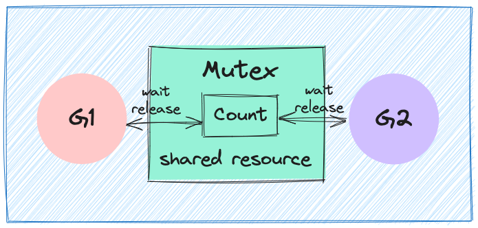
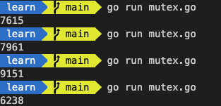
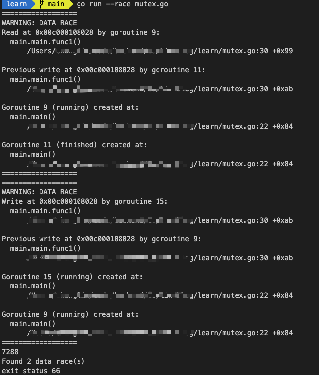
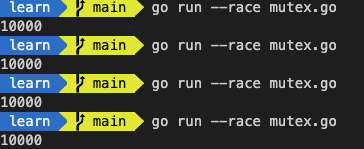
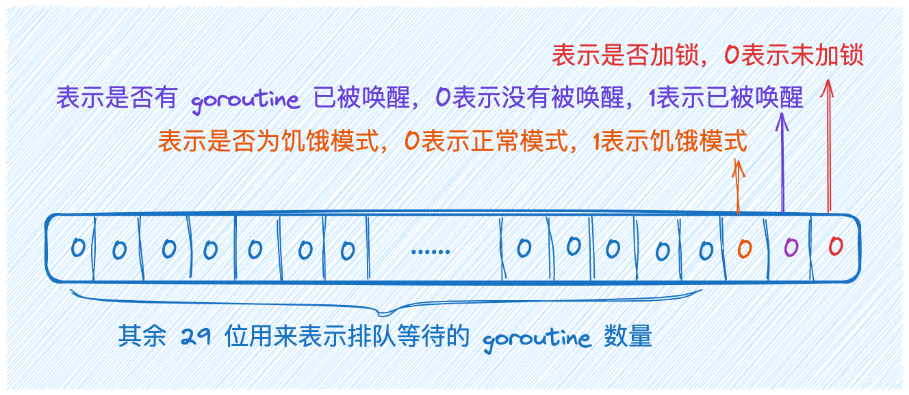
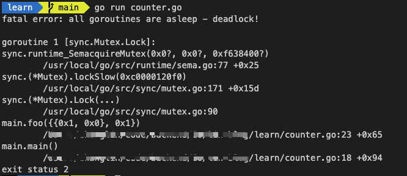
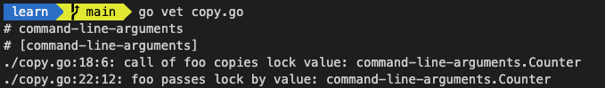
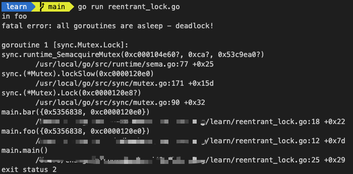
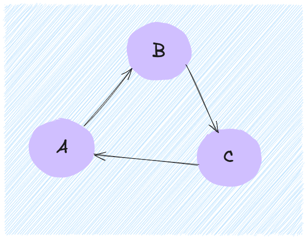

> 本文中所有代码运行的环境：
>
> - go version: 1.22
> - platform: MacOS
> - IDEA：VS Code(1.89.1)

## 简介

在开发过程中，我们常会面临着需同时处理多个事件或任务的挑战，这就引出了并发编程这个话题。在进行并发编程时，一项挺常见的问题就是并发资源访问；比如说，多个 Goroutine 同时并发读写同一份数据，比如积分排行榜、同时修改一份活动报名数量等等。如果对这些操作无法有效地控制和管理，就可能引发异常现象，如排行榜积分出错、活动报名人数超额、电影票售卖系统出现超售等诸多问题。这些问题该如何解决呢？答案就是借助于**互斥锁（Mutex）** 的力量。Go 语言，作为一种天生并发编程的语言，其并发机制既简单又清晰，而 Mutex 无疑是其中不可或缺的一员。

### 并发编程的重要性

在日常生活中，并发是常态。比如在餐馆用餐，你可以看到厨师正在准备食物，服务员正在给客人点餐、上菜，收银员正在结账。所有这些任务都在同时进行，但各自又不会干扰到对方。这就是一个按照并发模式运作的系统。

拿电商网站作为例子，它需要同时处理用户的搜索请求、浏览商品、增加购物车、下单支付等操作，这些都是并发的请求。而每一个请求又可能需要调用数据库、与第三方服务接口交互、计算推荐商品等任务，这些任务也需要并行完成，以提升效率。如果没有并发编程，这些操作都需要按顺序一一完成，相当于餐馆一个客人的需求解决后，再服务下一位客人。很显然，这种情况下，服务器的性能会受到严重的影响，用户体验也会大打折扣。

现实生活如此，程序中依然如此，现实生活中的并发现象在程序中同样重要。如果一个程序无法以迅速、高效、准确的方式处理各种用户请求，这就像一台功能受限的机器，想像一下，如果一个软件无法快速响应用户的需求，用户往往会选择别的替代产品。为什么呢？因为在现代快节奏的生活中，时间就是金钱，用户的耐心是有限的。

## Mutex

在并发编程中，如果程序中的一部分会被并发访问或修改，那么，为了避免并发访问导致的意想不到的结果，这部分程序需要被保护起来，这部分被保护起来的程序，就叫做临界区。

### 什么是 Mutex

在 Go 中，**mutex 是 sync 包提供的一种同步原语。它用于保护共享资源，防止多个程序同时访问。** 一个 mutex 一次只允许一个 goroutine 访问代码的关键部分，从而确保并发访问受到控制并防止数据竞争的问题。

**互斥锁是并发控制的一个基本手段**，是为了避免竞争而建立的一种并发控制机制。



Mutex 是使用最广泛的同步原语,同步原语的适用场景:

- **共享资源**。并发地读写共享资源，会出现数据竞争（data race）的问题，所以需要 Mutex、RWMutex 这样的并发原语来保护。
- **任务编排**。需要 goroutine 按照一定的规律执行，而 goroutine 之间有相互等待或者依赖的顺序关系，我们常常使用 WaitGroup 或者 Channel 来实现。
- **消息传递**。信息交流以及不同的 goroutine 之间的线程安全的数据交流，常常使用 Channel 来实现。

在 Go 的标准库中，package sync 提供了锁相关的一系列同步原语，这个 package 还定义了一个 Locker 的接口，Mutex 就实现了这个接口。

Locker 的接口定义了锁同步原语的方法集：

```go
type Locker interface {
	Lock()
	Unlock()
}
```

可以看到，Go 定义的锁接口的方法集很简单，就是请求锁（Lock）和释放锁（Unlock）这两个方法，秉承了 Go 语言一贯的简洁风格。

Go 标准库内的 sync 包为我们提供了各类同步机制，包括了 Mutex（互斥锁）等一系列与锁相关的同步原语。另外，该包还定义了一个 `Locker` 接口。Mutex 也实现了 `Locker` 接口：

```go
func (m *Mutex) Lock()
func (m *Mutex) Unlock()
```

当一个 goroutine 成功调用了 `Lock()` 并获取了锁之后，其它正在尝试获取锁的 goroutine 将会在 `Lock()` 的调用处发生阻塞。此时 goroutine 将一直处于阻塞状态，直到锁被释放(`Unlock()`)并且它们中的一个成功获取了锁。

### Mutex 的基本使用方法

根据以上内容，已经对 Mutex 有了基本的理解。可能你会有所疑惑，为什么我们必须要使用锁呢？看看在下面的实践中，如果不使用锁会产生怎样的效果。

在这个例子中，我们创建了 10 个 goroutine，同时不断地对一个变量（count）进行加 1 操作，每个 goroutine 负责执行 1000 次的加 1 操作，我们期望的最后计数的结果是 10 \* 1000 = 10000。可[在线运行](https://go.dev/play/p/_h31CGxDuU_q)代码：

```go
package main

import (
	"fmt"
	"sync"
)

func main() {
	// 创建一个变量count并初始化为0
	var count = 0

	// 使用WaitGroup等待10个goroutine完成
	var wg sync.WaitGroup // 创建WaitGroup wg，用于同步并发goroutine的执行

	// 设置WaitGroup等待的goroutine数为10
	wg.Add(10)

	// 循环10次，创建10个goroutine
	for i := 0; i < 10; i++ {

		// 使用go关键字开启一个并发的goroutine
		go func() {

			// 确保在当前goroutine执行完毕后调用wg.Done()，使得WaitGroup的计数减1
			defer wg.Done()

			// 对变量count执行1000次加1
			for j := 0; j < 1000; j++ { // 在当前goroutine中，循环1000次
				// 每次循环，将count增加1
				count++
			}
		}()
	}
	// 等待10个goroutine完成
	wg.Wait() // 阻塞，等待所有goroutine执行完成

	// 打印最终的count的值
	fmt.Println(count)
}
```

执行结果如下：


每次运行，你都可能得到不同的结果，这是为什么呢？因为 `count++` 不是一个原子操作，它至少包含几个步骤:

- 读取变量 count 的当前值
- 对这个值加 1
- 把结果再保存到 count 中

整个 `count++` 是在 cpu 中操作的，而 cpu 最小操作单元是指令，分为三条指令，就是上文提到的，获取 `count` 值; 对这个值加 1；然后在重置 `count`。**每个指令是原子操作，但是这三条放在一起就不是原子操作了，因此会引发竞争。**

> **什么是原子操作？**
>
> 顾名思义，**是不可被中断的一个或一系列操作**。在多线程环境下，如果一个操作被标记为原子操作，那么在整个操作过程中，它不会被其他线程或进程中断，也就是说，**这个操作要么完全被执行，要么根本不会启动，而执行过程中不会被其他线程阻塞或者对其进行修改**。

比如 10 个 goroutine 同时读取到 count 的值为 9151，接着各自按照自己的逻辑进行加1，然后值就变成了 9152，接着把这个结果写回到 count 变量。但实际上，此时我们增加的总数应该是 10 才对，这里却只增加了 1，好多计数都被“吞”掉了。

这其实就是并发访问共享数据的常见错误，单纯这个问题，有经验的开发者很快就能能 Debug 出来，很多时候，并发问题隐藏得非常深，即使是有经验的人，也不太容易发现或者 Debug 出来。

针对这个问题，Go 官方提供了一个检测并发访问共享资源是否有问题的工具： [race detector](https://go.dev/doc/articles/race_detector)，它可以帮助我们自动发现程序有没有 data race 的问题。在代码运行的时候，race detector 就能监控到对共享变量的非同步访问，出现 race 的时候，就会打印出警告信息。这个工具使用也比较简单，运行程序是在命令行中添加 `--race` 就好了，比如：`go run --race mutex.go` 就会看到输出的警告信息：


这个警告不但会告诉你有并发问题，而且还会告诉你哪个 goroutine 在哪一行对哪个变量有写操作，同时，哪个 goroutine 在哪一行对哪个变量有读操作；在上面这个例子中，数据竞争发生在 `main.main` 函数中，对应的代码位于 `/xxxx/learn/mutex.go:30`，而引发数据竞争的 goroutine 是在 `/xxxx/learn/mutex.go:22` 这个位置创建的。

这个工具使用起来相当简单，但由于它的实现方式，**只有在真正进行实际地址的读写操作时，才能够进行探测，因此它无法在编译阶段就发现数据竞争问题**。此外，当程序运行时，只在数据竞争真正发生后，才能进行检测。如果数据竞争问题未被触发（例如，某一数据竞争问题只在6月18日晚上十一点或11月11日凌晨六点出现），那么这个问题就无法被检测出来。

根据上面的分析，这个例子存在 data race 问题，怎么解决它呢？这里的共享资源是 count 变量，临界区是 count++，只要在临界区前面获取锁，在离开临界区的时候释放锁，就能完美地解决 data race 的问题了

经过上面的分析，发现这个示例中存在数据竞争问题。那么如何解决它呢？我们需要注意的共享资源是 `count` 变量，而临界区指的是 `count++` 这个操作。我们只需要在进入临界区之前获取锁，并在离开临界区时释放锁，这样就可以解决这个数据竞争问题。代码如下，[在线运行](https://go.dev/play/p/BVg9WCke4XY)：

```go
package main

import (
	"fmt"
	"sync"
)

func main() {
	// 创建一个变量count并初始化为0
	var count = 0

	// 互斥锁保护计数器
	var mu sync.Mutex

	// 使用WaitGroup等待10个goroutine完成
	var wg sync.WaitGroup // 创建WaitGroup wg，用于同步并发goroutine的执行

	// 设置WaitGroup等待的goroutine数为10
	wg.Add(10)

	// 循环10次，创建10个goroutine
	for i := 0; i < 10; i++ {

		// 使用go关键字开启一个并发的goroutine
		go func() {

			// 确保在当前goroutine执行完毕后调用wg.Done()，使得WaitGroup的计数减1
			defer wg.Done()

			// 对变量count执行1000次加1
			for j := 0; j < 1000; j++ { // 在当前goroutine中，循环1000次
				// 通过互斥锁mu保证每次只有一个goroutine能修改count
				mu.Lock()
				// -----------临界区开始-----------
				// 每次循环，将count增加1
				count++
				// -----------临界区结束-----------
				// 释放锁，使得其他goroutine能获取锁并修改count
				mu.Unlock()
			}
		}()
	}
	// 等待10个goroutine完成
	wg.Wait() // 阻塞，等待所有goroutine执行完成

	// 打印最终的count的值
	fmt.Println(count)
}
```

这行后的结果如下：


> Mutex 的零值是还没有 goroutine 等待的未加锁的状态，所以你不需要额外的初始化，直接声明变量（如 `var mu sync.Mutex`）即可。

`TryLock` 是 Go1.18 中才加入的一个新方法，这个方法的添加讨论了很多年，甚至对于这个方法的命名也有争议；它**用于尝试获取互斥锁（mutex）的方法**。与普通的 `Lock` 方法不同，`TryLock` 方法不会阻塞等待锁的释放，而是立即返回结果，表示是否成功获取到了锁。这对于**避免阻塞等待的场景**特别有用。

下面例子将演示 TryLock 的使用方式，代码如下，可[在线运行](https://go.dev/play/p/gSclvhxbPdf)：

```go
package main

import (
	"fmt"
	"sync"
	"time"
)

// main 函数是程序的入口
func main() {
	// 打印 "Hello, 世界"
	fmt.Println("Hello, 世界")

	// 调用 tryLock 函数，演示 TryLock 的使用
	tryLock()
}

// tryLock 函数演示 sync.Mutex 的 TryLock 方法
func tryLock() {
	// 定义一个局部的互斥锁 mu
	var mu sync.Mutex

	// 启动一个新的 goroutine
	go func() {
		// 锁定互斥锁 mu
		mu.Lock()

		// 模拟长时间运行的任务，休眠 2 秒钟
		time.Sleep(2 * time.Second)

		// 解锁互斥锁 mu
		mu.Unlock()
	}()

	// 主 goroutine 休眠 1 秒钟，确保上面的 goroutine 有时间锁定 mu
	time.Sleep(time.Second)

	// 尝试锁定互斥锁 mu
	if mu.TryLock() {
		// 如果成功获取到锁，打印 "try lock success"
		fmt.Println("try lock success")

		// 解锁互斥锁 mu
		mu.Unlock()
	} else {
		// 如果未能获取到锁，打印 "try lock failed"
		fmt.Println("try lock failed")
	}
}
```

执行结果如下：

```shell
Hello, 世界
try lock failed
```

详细运行流程：

1. 主 goroutine 执行 `fmt.Println("Hello, 世界")`，输出 `"Hello, 世界"`。
2. 主 goroutine 调用 `tryLock` 函数。
3. 在 tryLock 函数中：
    - 启动一个新的 goroutine，锁定 `mu` 并休眠 2 秒钟，然后解锁 `mu`。
    - 主 goroutine 休眠 1 秒钟后，尝试使用 `mu.TryLock()` 获取锁。
    - 因为新的 goroutine 已经锁定了 `mu`，`mu.TryLock()` 返回 `false`。
    - 主 goroutine 打印 `"try lock failed"`。

这个示例展示了在并发环境中使用 `sync.Mutex` 的 `TryLock` 方法如何实现非阻塞锁定操作。**如果锁已经被其他 goroutine 持有，`TryLock` 会立即返回 false，而不会阻塞等待锁的释放**。

### Mutex 配合结构体使用

互斥锁（Mutex）的一种常见用法是与结构体配合使用。在Go语言中，我们可以在定义结构体时包含一个 Mutex 类型的字段，从而用于保护结构体的其他字段不会在并发情况下出现数据竞争问题。当我们需要修改结构体中的某个字段时，首先将 Mutex 上锁，修改完成后释放 Mutex 的锁。这样就能保证只有一个 goroutine 修改结构体的字段，保证了数据的安全性。比如：

```go
type Counter struct {
	mu    sync.Mutex
	Count uint64
}
```

**在初始化嵌入的 struct 时，也不必初始化这个 Mutex 字段，不会因为没有初始化出现空指针或者是无法获取到锁的情况。**

- 采用嵌入字段的方式去调用 `Lock()` 和 `Unlock()`

    ```go
    package main

    import (
        "fmt"
        "sync"
    )

    // 定义一个包含mutex和一个uint64类型字段的Counter类型
    type Counter struct {
        sync.Mutex        // Mutex类型的匿名字段
        Count      uint64 // 计数
    }

    func main() {
        // 声明一个 Counter 类型的变量 counter
        var counter Counter

        // 声明一个 WaitGroup 类型的变量 wg，它用于等待一组 goroutine 的结束
        var wg sync.WaitGroup

        // 调用 WaitGroup 的 Add 方法，设置需要等待的 goroutine 的数量为10
        wg.Add(10)

        // 循环启动 10 个 goroutine
        for i := 0; i < 10; i++ {
            go func() { // 启动一个 goroutine
                // 当 goroutine 运行结束后，调用 WaitGroup 的 Done 方法，将等待的 goroutine 的数量减1
                defer wg.Done()

                // 内层循环1000次
                for j := 0; j < 1000; j++ {
                    // 在修改 counter 的 Count 字段前，先对 counter 调用 Lock 方法，将 mutex 上锁，以避免并发问题
                    counter.Lock()
                    // 修改 counter 的 Count 字段，将其自增1
                    counter.Count++
                    // 在修改完成后，对 counter 调用 Unlock 方法，释放 mutex，允许其他 goroutine 进行修改
                    counter.Unlock()
                }
            }()
        }

        // 调用 WaitGroup 的 Wait 方法，等待所有 goroutine 运行结束
        wg.Wait()

        fmt.Println(counter.Count)
    }
    ```

    如果嵌入的 struct 有多个字段，我们一般会把 Mutex 放在要控制的字段上面，然后使用空格把字段分隔开来。即使你不这样做，代码也可以正常编译，只不过，用这种风格去写的话，逻辑会更清晰，也更易于维护。

- 把获取锁、释放锁、计数加一的逻辑封装成一个方法

    ```go
    package main

    import (
        "fmt"
        "sync"
    )

    // 线程安全的计数器类型
    type Counter struct {
        CounterType int
        Name        string

        mu    sync.Mutex
        count uint64
    }

    // 加1的方法，内部使用互斥锁保护
    func (c *Counter) Increment() {
        c.mu.Lock()
        c.count++
        c.mu.Unlock()
    }

    // 得到计数器的值，也需要锁保护
    func (c *Counter) Count() uint64 {
        c.mu.Lock()
        defer c.mu.Unlock()
        return c.count
    }

    func main() {
        // 封装好的计数器
        var counter Counter

        var wg sync.WaitGroup
        wg.Add(10)

        // 启动10个goroutine
        for i := 0; i < 10; i++ {
            go func() {
                defer wg.Done()
                // 执行 1000 次累加
                for j := 0; j < 1000; j++ {
                    counter.Increment() // 受到锁保护的方法
                }
            }()
        }
        wg.Wait()
        fmt.Println(counter.Count())
    }
    ```

## Mutex深入探讨

有了对 Mutex 的使用方法和认知后，你可能会发现 Mutex 仅有 `Lock` 和 `Unlock` 两个方法。在进入临界区之前调用 `Lock` 方法，而在退出临界区时调用 `Unlock` 方法。这是否也对其实现原理的好奇呢？那就来一探究吧！

### Mutex的底层原理

接下来，我们来深入探索 Mutex 是如何实现的。您可以在 /go/src/sync/mutex.go 的路径中找到 mutex 对应的代码。为了方便理解，我已经将所有的注释从下面的源码中删除。现在，让我们一起看看源码吧：

```go
package sync

import (
	"internal/race"
	"sync/atomic"
	"unsafe"
)

func throw(string)
func fatal(string)

type Mutex struct {
	state int32
	sema  uint32
}

type Locker interface {
	Lock()
	Unlock()
}

const (
	mutexLocked = 1 << iota
	mutexWoken
	mutexStarving
	mutexWaiterShift = iota

	starvationThresholdNs = 1e6
)

func (m *Mutex) Lock() {

	if atomic.CompareAndSwapInt32(&m.state, 0, mutexLocked) {
		if race.Enabled {
			race.Acquire(unsafe.Pointer(m))
		}
		return
	}

	m.lockSlow()
}

func (m *Mutex) TryLock() bool {
	old := m.state
	if old&(mutexLocked|mutexStarving) != 0 {
		return false
	}

	if !atomic.CompareAndSwapInt32(&m.state, old, old|mutexLocked) {
		return false
	}

	if race.Enabled {
		race.Acquire(unsafe.Pointer(m))
	}
	return true
}

func (m *Mutex) lockSlow() {
	var waitStartTime int64
	starving := false
	awoke := false
	iter := 0
	old := m.state
	for {

		if old&(mutexLocked|mutexStarving) == mutexLocked && runtime_canSpin(iter) {

			if !awoke && old&mutexWoken == 0 && old>>mutexWaiterShift != 0 &&
				atomic.CompareAndSwapInt32(&m.state, old, old|mutexWoken) {
				awoke = true
			}
			runtime_doSpin()
			iter++
			old = m.state
			continue
		}
		new := old

		if old&mutexStarving == 0 {
			new |= mutexLocked
		}
		if old&(mutexLocked|mutexStarving) != 0 {
			new += 1 << mutexWaiterShift
		}

		if starving && old&mutexLocked != 0 {
			new |= mutexStarving
		}
		if awoke {

			if new&mutexWoken == 0 {
				throw("sync: inconsistent mutex state")
			}
			new &^= mutexWoken
		}
		if atomic.CompareAndSwapInt32(&m.state, old, new) {
			if old&(mutexLocked|mutexStarving) == 0 {
				break
			}

			queueLifo := waitStartTime != 0
			if waitStartTime == 0 {
				waitStartTime = runtime_nanotime()
			}
			runtime_SemacquireMutex(&m.sema, queueLifo, 1)
			starving = starving || runtime_nanotime()-waitStartTime > starvationThresholdNs
			old = m.state
			if old&mutexStarving != 0 {

				if old&(mutexLocked|mutexWoken) != 0 || old>>mutexWaiterShift == 0 {
					throw("sync: inconsistent mutex state")
				}
				delta := int32(mutexLocked - 1<<mutexWaiterShift)
				if !starving || old>>mutexWaiterShift == 1 {

					delta -= mutexStarving
				}
				atomic.AddInt32(&m.state, delta)
				break
			}
			awoke = true
			iter = 0
		} else {
			old = m.state
		}
	}

	if race.Enabled {
		race.Acquire(unsafe.Pointer(m))
	}
}

//

func (m *Mutex) Unlock() {
	if race.Enabled {
		_ = m.state
		race.Release(unsafe.Pointer(m))
	}

	new := atomic.AddInt32(&m.state, -mutexLocked)
	if new != 0 {

		m.unlockSlow(new)
	}
}

func (m *Mutex) unlockSlow(new int32) {
	if (new+mutexLocked)&mutexLocked == 0 {
		fatal("sync: unlock of unlocked mutex")
	}
	if new&mutexStarving == 0 {
		old := new
		for {

			if old>>mutexWaiterShift == 0 || old&(mutexLocked|mutexWoken|mutexStarving) != 0 {
				return
			}

			new = (old - 1<<mutexWaiterShift) | mutexWoken
			if atomic.CompareAndSwapInt32(&m.state, old, new) {
				runtime_Semrelease(&m.sema, false, 1)
				return
			}
			old = m.state
		}
	} else {

		runtime_Semrelease(&m.sema, true, 1)
	}
}
```

我们一步一步看，先看 Mutex 的定义，github 的地址为 [mutex.go#L34](https://github.com/golang/go/blob/master/src/sync/mutex.go#L34)：

```go
// A Mutex is a mutual exclusion lock.
// The zero value for a Mutex is an unlocked mutex.
//
// A Mutex must not be copied after first use.
//
// In the terminology of the Go memory model,
// the n'th call to [Mutex.Unlock] “synchronizes before” the m'th call to [Mutex.Lock]
// for any n < m.
// A successful call to [Mutex.TryLock] is equivalent to a call to Lock.
// A failed call to TryLock does not establish any “synchronizes before”
// relation at all.
type Mutex struct {
	state int32
	sema  uint32
}
```

> 注释也说得很明确，**Mutex 是一个互斥锁。Mutex 的零值是一个未上锁的互斥锁。互斥锁在第一次使用之后就不能再进行复制。** 根据 Go 内存模型的术语，第 n 次调用 Mutex.Unlock 在第 m 次调用 Mutex.Lock 之前进行了同步， 其中 n < m。成功调用 [Mutex.TryLock] 等同于调用Lock。而对 TryLock 的失败调用则不会建立任何“先同步”的关系。

#### state 为状态，是一个复合型字段

```go
const (
	mutexLocked           = 1 << iota // 1 0001 含义：用最后一位表示当前对象锁的状态，0-未锁住 1-已锁住
	mutexWoken                        // 2 0010 含义：用倒数第二位表示当前对象是否被唤醒 0-唤醒 1-未唤醒
	mutexStarving                     // 4 0100 含义：用倒数第三位表示当前对象是否为饥饿模式，0为正常模式，1为饥饿模式。
	mutexWaiterShift      = iota      // 3，从倒数第四位往前的bit位表示在排队等待的goroutine数
	starvationThresholdNs = 1e6       // 1ms 切换到饥饿模式的阈值
)
```

- 第一位（倒数第一个）表示锁是**否被持有**；
- 第二位（倒数第二位）表示是**否有唤醒的 goroutine**；
- 第三位（倒数第三位）表示**当前的互斥锁进入饥饿状态**；
- 剩余的 29 位数代表的是**当前的互斥锁进入饥饿状态**；
  

    Mutex 有两种模式：

- 正常模式
- 饥饿模式

    在**正常模式下，锁的等待者会按照先进先出的顺序获取锁**。但是刚被唤起的 Goroutine 与新创建的 Goroutine 竞争时，大概率会获取不到锁，为了减少这种情况的出现，一旦 Goroutine 超过 1ms 没有获取到锁，它就会将当前互斥锁切换饥饿模式，防止部分 Goroutine 被饿死。引入了饥饿模式，引入饥饿模式的目的是保证互斥锁的公平性。

    在饥饿模式中，互斥锁会直接交给等待队列最前面的 Goroutine。新的 Goroutine 在该状态下不能获取锁、也不会进入自旋（spin）状态，它们只会在队列的末尾等待。如果一个 Goroutine 获得了互斥锁并且它在队列的末尾或者它等待的时间少于 1ms，那么当前的互斥锁就会切换回正常模式。

    与饥饿模式相比，正常模式下的互斥锁能够提供更好地性能，饥饿模式的能避免 Goroutine 由于陷入等待无法获取锁而造成的高尾延时。

    > 源码中的注释:
    >
    > Mutex fairness.
    >
    > Mutex can be in 2 modes of operations: normal and starvation.
    > In normal mode waiters are queued in FIFO order, but a woken up waiter
    > does not own the mutex and competes with new arriving goroutines over
    > the ownership. New arriving goroutines have an advantage -- they are
    > already running on CPU and there can be lots of them, so a woken up
    > waiter has good chances of losing. In such case it is queued at front
    > of the wait queue. If a waiter fails to acquire the mutex for more than 1ms,
    > it switches mutex to the starvation mode.
    >
    > In starvation mode ownership of the mutex is directly handed off from
    > the unlocking goroutine to the waiter at the front of the queue.
    > New arriving goroutines don't try to acquire the mutex even if it appears
    > to be unlocked, and don't try to spin. Instead they queue themselves at
    > the tail of the wait queue.
    >
    > If a waiter receives ownership of the mutex and sees that either
    > (1) it is the last waiter in the queue, or (2) it waited for less than 1 ms,
    > it switches mutex back to normal operation mode.
    >
    > Normal mode has considerably better performance as a goroutine can acquire
    > a mutex several times in a row even if there are blocked waiters.
    > Starvation mode is important to prevent pathological cases of tail latency.

#### sema 为信号量

**信号量来自同步原语，通常被访问资源持有，表示当前资源允许多少协程同时持有**。被持有后信号量减一，通常小于等于0时需要请求方等待资源被返回。

比如信号量为2，那么就允许被两个协程持有通过，在持有协程释放前，不允许其他协程通过。这种可以是任意整数的信号量叫做计数信号量(counting semaphore)，也叫普通信号量,旨在控制通过数量。

如果说信号量只有1和0,则称为二进制信号量。计数信号量和二进制信号量本质上是一样的。Mutex 中的 sema 是计数信号量。

### Lock

互斥锁的加锁是靠 Mutex.Lock 方法完成的，以下代码进行了简化，省略了 race 相关代码，只保留主干部分；[mutex.go#L81](https://github.com/golang/go/blob/master/src/sync/mutex.go#L81) 上的位置：

```go
func (m *Mutex) Lock() {
	// 尝试把 Mutex 的状态从 0（未锁定）改为 mutexLocked（已锁定）
	if atomic.CompareAndSwapInt32(&m.state, 0, mutexLocked) {
		// 是否启用了竞态检测
		if race.Enabled {
			// 调用 race.Acquire 方法来通知竞态检测器当前 goroutine 已经获取到了这个锁
			race.Acquire(unsafe.Pointer(m))
		}
		// 成功获取到锁后直接返回
		return
	}

	// 如果没有获取到锁就调用 m.lockSlow() 方法进行后续的处理，此方法会让当前 goroutine 进入等待状态，直到获取到锁为止。
	m.lockSlow()
}
```

lockSlow 方法的源码如下：

```go
func (m *Mutex) lockSlow() {
	// 等待时间
	var waitStartTime int64
	// 此 goroutine 是否处于饥饿标记
	starving := false
	// 唤醒标记
	awoke := false
	// 自旋次数
	iter := 0
	// 当前锁的状态
	old := m.state

	// 不断的尝试去获取互斥锁
	for {
		// 锁是非饥饿状态，锁还没被释放，尝试自旋
		if old&(mutexLocked|mutexStarving) == mutexLocked && runtime_canSpin(iter) {
			// 尝试设置 mutexWoken 标志以通知解锁，以避免唤醒其他阻塞的程序。
			if !awoke && old&mutexWoken == 0 && old>>mutexWaiterShift != 0 &&
				atomic.CompareAndSwapInt32(&m.state, old, old|mutexWoken) {
				awoke = true
			}
			runtime_doSpin()
			iter++
			// 再次获得锁的状态，之后会检查是否被锁释放了
			old = m.state
			continue
		}
		new := old
		// 不尝试获取处于饥饿状态的 mutex，新来的 goroutine 排队等待。
		if old&mutexStarving == 0 {
			// 非饥饿状态，加锁
			new |= mutexLocked
		}
		if old&(mutexLocked|mutexStarving) != 0 {
			// 等待数量加 1
			new += 1 << mutexWaiterShift
		}

		if starving && old&mutexLocked != 0 {
			// 设置饥饿状态
			new |= mutexStarving
		}
		if awoke {
			if new&mutexWoken == 0 {
				throw("sync: inconsistent mutex state")
			}
			new &^= mutexWoken
		}
		// 成功设置新状态
		if atomic.CompareAndSwapInt32(&m.state, old, new) {

			// 原来锁的状态已释放，并且不是饥饿状态，正常请求到了锁，返回
			if old&(mutexLocked|mutexStarving) == 0 {
				break // locked the mutex with CAS
			}

			// 如果以前就在队列里面，加入到队列头
			queueLifo := waitStartTime != 0
			if waitStartTime == 0 {
				waitStartTime = runtime_nanotime()
			}

			//  阻塞等待
			runtime_SemacquireMutex(&m.sema, queueLifo, 1)

			// 唤醒之后检查锁是否应该处于饥饿状态
			starving = starving || runtime_nanotime()-waitStartTime > starvationThresholdNs
			old = m.state

			// 如果锁已经处于饥饿状态，直接抢到锁，返回
			if old&mutexStarving != 0 {
				if old&(mutexLocked|mutexWoken) != 0 || old>>mutexWaiterShift == 0 {
					throw("sync: inconsistent mutex state")
				}

				// 加锁并且将waiter数减 1
				delta := int32(mutexLocked - 1<<mutexWaiterShift)
				if !starving || old>>mutexWaiterShift == 1 {
					// 最后一个waiter或者已经不饥饿了，清除饥饿标记
					delta -= mutexStarving
				}

				atomic.AddInt32(&m.state, delta)
				break
			}

			awoke = true
			iter = 0
		} else {
			old = m.state
		}
	}

	if race.Enabled {
		race.Acquire(unsafe.Pointer(m))
	}
}
```

`runtime_SemacquireMutex` 方法的主要作用是:

- 不断调用尝试获取锁
- 休眠当前 goroutine
- 等待信号量，唤醒 goroutine

goroutine 被唤醒之后就会去判断当前是否处于饥饿模式，如果当前等待超过 1ms 就会进入饥饿模式

- 饥饿模式下：会获得互斥锁，如果等待队列中只存在当前 Goroutine，互斥锁还会从饥饿模式中退出
- 正常模式下：会设置唤醒和饥饿标记、重置迭代次数并重新执行获取锁的循环

### Unlock

```go
func (m *Mutex) Unlock() {
	// 是否启用了竞态检测
	if race.Enabled {
		// 触发 race 检测器的读取操作
		_ = m.state
		// 通知 race 检测器当前 goroutine 释放了互斥锁 m，即结束了对 m 的操作
		race.Release(unsafe.Pointer(m))
	}

	// 直接尝试设置 state 的值，进行解锁
	new := atomic.AddInt32(&m.state, -mutexLocked)
	// 如果减去了 mutexLocked 的值之后不为零就会进入慢速通道，这说明有可能失败了，或者是还有其他的 goroutine 等着被唤醒
	if new != 0 {
		m.unlockSlow(new)
	}
}

func (m *Mutex) unlockSlow(new int32) {
	// 解锁一个没有锁定的互斥量会报运行时错误
	if (new+mutexLocked)&mutexLocked == 0 {
		fatal("sync: unlock of unlocked mutex")
	}
	// 判断是否处于饥饿模式
	if new&mutexStarving == 0 {
		// 正常模式
		old := new
		for {
			// 如果当前没有等待者或者 goroutine 已经被唤醒或者是处于锁定状态了，就直接返回
			if old>>mutexWaiterShift == 0 || old&(mutexLocked|mutexWoken|mutexStarving) != 0 {
				return
			}

			// 唤醒等待者并且移交锁的控制权
			new = (old - 1<<mutexWaiterShift) | mutexWoken
			if atomic.CompareAndSwapInt32(&m.state, old, new) {
				runtime_Semrelease(&m.sema, false, 1)
				return
			}
			old = m.state
		}
	} else {
		// 饥饿模式，走 handoff 流程，直接将锁交给下一个等待的 goroutine，注意这个时候不会从饥饿模式中退出
		runtime_Semrelease(&m.sema, true, 1)
	}
}
```

### Tryock

简单说，`TryLock()` 方法就是尝试获取锁，如果返回 `true` 则表示已经获取到了相应的锁，如果返回 `false` 则表示没有获取到相应的锁。

```go
func (m *Mutex) TryLock() bool {
	// 保存当前互斥锁状态
	old := m.state

	// 检查互斥锁当前状态是否已经被锁定或处于饥饿状态
	if old&(mutexLocked|mutexStarving) != 0 {
		return false
	}

	// 尝试将互斥锁状态设置为锁定状态
	if !atomic.CompareAndSwapInt32(&m.state, old, old|mutexLocked) {
		return false
	}

	// 如果启用了竞态检测，则通知竞态检测器锁的获取
	if race.Enabled {
		race.Acquire(unsafe.Pointer(m))
	}

	// 成功获取锁，返回 true
	return true
}
```

> - `m.state`：互斥锁的内部状态，表示锁的当前状态（如是否被锁定，是否有饥饿等待的 goroutine 等）。
> - `mutexLocked` 和 `mutexStarving`：表示互斥锁状态的常量值。
> - `mutexLocked`：表示锁已经被某个 goroutine 持有。
> - `mutexStarving`：表示锁处于饥饿模式，通常用于优化高并发情况下的锁获取公平性。
> - `atomic.CompareAndSwapInt32`：原子操作函数，比较并交换值，确保在多线程环境下的安全操作。
> - `race.Enabled`：检查是否启用了竞态条件检测（通过 `-race` 标志运行时）。

如果当前的 Mutex 已经加锁或者当前的 Mutex 处于饥饿状态，那么当前请求锁的 goroutine 就获取不到锁，直接返回 false。否则尝试加锁，也就是在 old 上加 mutexLocked 锁表示；如果这个时候 Mutex 已经被其他 goroutine 加锁了或者 Mutex 转换为 饥饿状态，那么也直接返回 false，没有获取到锁。反之直接获得锁。

## Mutex 常见的 4 种错误场景

- **`Lock/Unlock` 不成对出现**

    如果对互斥锁的加锁（`Lock`）和解锁（`Unlock`）操作不成对进行，就会引起程序异常。比如，多**次加锁而未解锁可能导致程序“卡死”（也被称为死锁）**。反之，**尝试解锁一个未加锁的互斥锁可能引发程序崩溃（panic）**。

    ```go
    package main

    import (
        "fmt"
        "sync"
    )

    func main() {
        var mu sync.Mutex

        defer mu.Unlock()
        fmt.Println("hello")
    }
    ```

    直接 Unlock 一个未加锁的 Mutex 会 panic，运行效果如下：
    

- **Copy 已使用的 Mutex**

    看下面的例子，可[在线运行](https://go.dev/play/p/e-mvDZFGs2D)：

    ```go
    // /path/to/copy.go
    package main

    import (
        "fmt"
        "sync"
    )

    type Counter struct {
        sync.Mutex
        Count int
    }

    func main() {
        var c Counter
        c.Lock()
        defer c.Unlock()
        c.Count++
        foo(c) // 复制锁
    }

    // 这里Counter的参数是通过复制的方式传入的
    func foo(c Counter) {
        c.Lock()
        defer c.Unlock()
        fmt.Println("in foo")
    }
    ```

    运行上面的代码后，会遇到下面的报错信息：
    

    > sync 的同步原语在使用后是不能复制的，是因为 **Mutex 是一个有状态的对象，它的 state 字段记录这个锁的状态**

    这类问题怎么及时发现呢？可以使用 vet 工具检查：
    
    使用这个工具就可以发现 Mutex 复制的问题，错误信息提示很清楚，是在调用 foo 函数的时候发生了 lock value 复制的情况，还告诉我们出问题的代码行数以及 copy lock 导致的错误。

- **锁重入**

    > 可重入锁：**当一个线程获取锁时，如果没有其它线程拥有这个锁，那么这个线程就成功获取到这个锁**。之后，**如果其它线程再请求这个锁，就会处于阻塞等待的状态**。但是，**如果拥有这把锁的线程再请求这把锁的话，不会阻塞，而是成功返回**，所以叫可重入锁（有时候也叫做递归锁）。**Mutex 不是可重入的锁**。

    ```go
    package main

    import (
        "fmt"
        "sync"
    )

    // 接收一个 sync.Locker 接口类型的参数，这意味着可以传入任何实现了Lock和Unlock方法的类型，比如*sync.Mutex或*sync.RWMutex。
    func foo(l sync.Locker) {
        fmt.Println("in foo")
        l.Lock() // 对 l 进行加锁操作
        bar(l)
        l.Unlock() // 解锁 l
    }

    // 接收一个sync.Locker接口类型的参数，同样尝试去锁定传入的l，打印出"in bar"，然后解锁l。
    func bar(l sync.Locker) {
        l.Lock() // 对 l 进行加锁操作
        fmt.Println("in bar")
        l.Unlock() // 解锁 l
    }

    func main() {
        l := &sync.Mutex{} // 创建一个互斥锁
        foo(l)             // 把互斥锁作为参数传给foo函数
    }
    ```

    运行结果如下：
    

- **死锁**

    什么是死锁呢？就是**两个或两个以上的进程（或线程，goroutine）在执行过程中，因争夺共享资源而处于相互等待的状态**，如果没有外部干涉，它们都将无法推进下去，此时系统处于死锁状态或系统产生了死锁。

    我们来分析一下死锁产生的必要条件。如果你想避免死锁，只要破坏这四个条件中的一个或者几个，就可以了。
    1. _至少一个资源是被排他性独享的_，其他线程必须处于等待状态，直到资源被释放。
    2. goroutine 持有一个资源，并且还在请求其它 goroutine 持有的资源。
    3. 资源只能由持有它的 goroutine 来释放——**谁持有谁释放**。
    4. **环路等待**；A 进程等待 B 进程所占用的资源，B 进程等待 C 进程所占用的资源，C 进程等待 A 进程所占用的资源，就形成了一个环路，这样就会发生环路等待。
       

## 总结

以餐馆和电商网站的例子出发，探讨了并发编程在现实生活中的体现。

逐步引出 Mutex 的概念和使用方法，深入解析其底层实现。

列举了 Mutex 常见的四种错误场景：

- `Lock` 和 `Unlock` 不成对出现
- 复制已使用的 Mutex
- 锁重入
- 死锁
