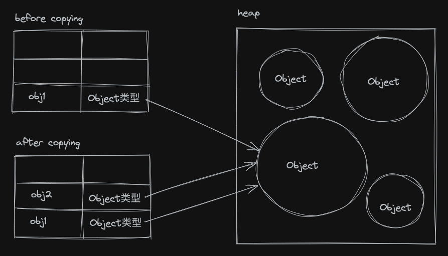
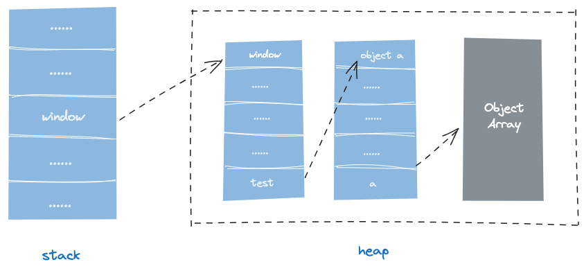
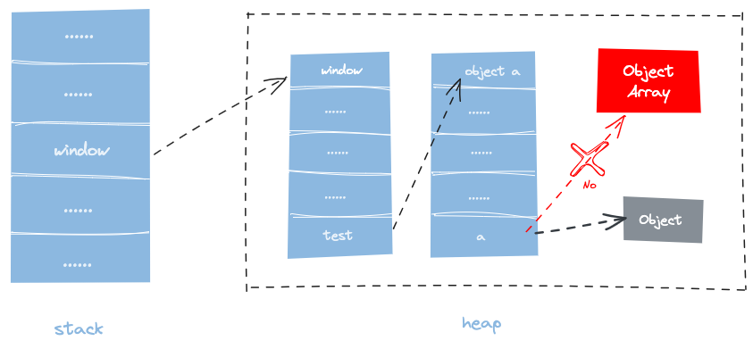
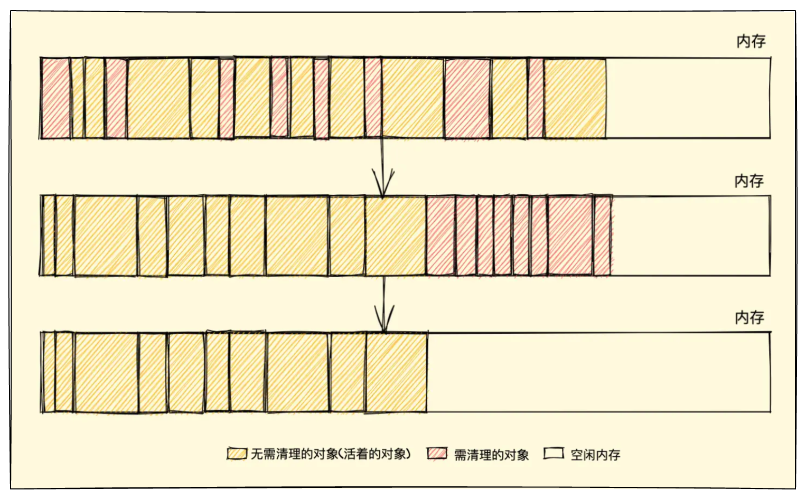

# 变量、作用域与内存

本文目标：
- 原始值和引用值
- 执行上下文
- 垃圾回收

**在 JavaScript 中，变量是灵活的，就像一个标签，表示某个值**。这个值和数据类型可以随时改变，没有限制。这种特性很强大，但也可能带来一些问题。

## 原始值与引用值

**原始值就是最简单的数据，保存的是实际值，引用值则是保存在内存中的对象**，JavaScript 不允许直接访问内存地址，也就是不能直接操作对象所在的内存空间，也就是实际上是对该对象的引用而非实际的对象本身，**保存引用值的变量是按引用访问的**。

原始值的六中类型：
- Undefined
- Null
- Boolean
- Number
- String
- Symbol

引用值：
- Object

### 动态属性
原始值和引用值的定义方式很类似，都是创建一个变量，然后给它赋一个值。不过，在变量保存了
这个值之后，可以对这个值做什么，则大有不同。对于引用值而言，可以随时添加、修改和删除其属性
和方法。比如，看下面的例子：
```js
const person = new Object();
person.name = 'changlin';
console.log(person.name); // changlin
```

首先，实例化一个对象，然后保存在变量 `person` 中，然后给这个对象添加一个名为 `name` 的属性，并给这个属性赋值给一个字符串 `"changlin"`。

原始值不能有属性，尽管尝试给原始值添加属性也不会报错。比如：
```js
const name = 'changlin';
name.age = 18;
console.log(name.age); // undefined
```
只有引用值可以动态添加后面可以使用的属性。
> **原始类型的初始化可以只使用原始字面量形式。如果使用的是 `new` 关键字，则 JavaScript 会
> 创建一个 `Object` 类型的实例，但其行为类似原始值。**
>
> 下面来看看这两种初始化方式的差异：
> ```js
> const name1 = "changlin"; 
> const name2 = new String("forest"); 
> name1.age = 18; 
> name2.age = 20; 
> console.log(name1.age); // undefined 
> console.log(name2.age); // 20
> console.log(typeof name1); // string 
> console.log(typeof name2); // object
> ```


### 复制值
原始值和引用值除了在存储方式上有所差别外，在变量复制的时候也有所不同；在通过变量把一个原始值赋值到另一个变量时，原始值会被复制到新变量的位置。
```js
let name = 'changlin';
let nickname = name;
name = 'forest';
console.log(nickname); // 结果是什么？changlin 还是 forest ？
```
分析一下上面的代码片段，首先声明了一个变量 `name` 保存的是字符串 `'changlin'`，然后又声明了一个变量 `nickname`，保存的是 `name` 的值 `'changlin'`，然后又给变量 `name` 重新赋值为 `forest`，此时变量 `name` 保存的是字符串 `forest`；在这段代码中，当 `nickname = name` 执行时，`nickname` 实际上指向的是存储 `'changlin'` 的内存位置。后续修改 `name` 的值为 `'forest'` 不会影响 `nickname`，因为它们实际上指向的是不同的内存位置。所以**最后打印的结果是 `'changlin'`。**


在把**引用值从一个变量赋给另一个变量时，存储在变量中的值也会被复制到新变量所在的位置**。区
别在于，这里**复制的值实际上是一个指针，它指向存储在堆内存中的对象**。操作完成后，**两个变量实际上指向同一个对象，因此一个对象上面的变化会在另一个对象上反映出来**，如下面的例子所示：
```js
const obj1 = new Object();
const obj2 = obj1;
obj1.name = 'changlin';
console.log(obj2.name); // undefined or 'changlin'?
```
这段代码中，首先创建了一个对象 `obj1`，然后将 `obj1` 的引用值赋给了 `obj2`，也就是它们指向同一个对象。接着给 `obj1` 添加了一个属性 `name` 并赋值为 `'changlin'`。由于 `obj1` 和 `obj2` 指向同一个对象，所以无论通过哪个变量访问对象的属性，都会得到相同的结果。因此最后会输出 `'changlin'`。




### 参数传递
**ECMAScript 中所有函数的参数都是按值传递的**。也就是函数外的值会被复制到函数内部的参数
中，就像从一个变量复制到另一个变量一样。如果是原始值，那么就跟原始值变量的复制一样，如果是
引用值，那么就跟引用值变量的复制一样。**在按值传递参数时，值会被复制到一个局部变量**（即一个命名参数，或者用 ECMAScript 的话说，就是 `arguments` 对象中的一个槽位）。**在按引用传递参数时，值在内存中的位置会被保存在一个局部变量，这意味着对本地变量的修改会反映到函数外部。**

```js
function addTen(num) { 
   num += 10; 
   return num; 
}

let count = 20;
let result = addTen(count);

console.log(count);   // 20，没有变化
console.log(result);  // 30
```

这段代码中，函数 `addTen()` 有一个参数 `num`，**它其实是一个局部变量**。在调用时，变量 `count` 作为参数传入。`count` 的值是 20，这个值被复制到参数 `num` 以便在 `addTen()` 内部使用。在函数内部，参数 `num` 的值被加上了 10，但这不会影响函数外部的原始变量 `count`。参数 `num` 和变量 `count` 互不干扰，它们只不过碰巧保存了一样的值。如果 `num` 是按引用传递的，那么 `count` 的值也会被修改为 30。

如果变量中传递的是对象呢？如下：
```js
function setName(obj){
  obj.name = 'changlin';
}

const  person = new Object();
setName(person);
console.log(person.name); // 'changlin'
```
这段代码定义了一个函数 `setName`，该函数接受一个对象作为参数，并将该对象的 `name` 属性设置为 `'changlin'`。然后创建了一个名为 `person` 的新对象，并将该对象作为参数传递给 `setName` 函数。最后打印出 `person` 对象的 `name` 属性，其值为 `'changlin'`。这里的关键是**对象是通过引用传递的**，所以在调用 `setName` 函数时，实际上是传递了 `person` 对象的引用，因此在函数内部对对象的属性做的更改会直接影响到原始对象。

Tips:
**不要错误的认为当在局部作用域中修改对象而变化反映到全局时，就意味着参数是按引用传递的。** 具体示例如下：
```js
function setName(obj) {
   obj.name = "changlin"; 
   obj = new Object(); 
   obj.name = "Greg"; 
} 
let person = new Object(); 
setName(person); 
console.log(person.name); // "changlin"
```

在这段代码中，`setName` 函数接收一个对象，首先将传入的对象 `obj` 的 `name` 属性设置为 `"changlin"`。然后在函数内部，`obj` 被重新赋值为一个新的空对象，并且这个新对象的 `name` 属性被设置为 `"Greg"`。

接着，创建了一个名为 `person` 的新对象，并将其传递给 `setName` 函数。在函数中，`obj` 的引用被重新分配为一个新对象，但是这个更改不会影响原始的 `person` 对象。

因此，最后打印 `person.name` 时，输出结果将是 `"changlin"`，因为在函数中更改的是传入对象的属性，而不是传入对象本身。

### 确定类型
之前有使用到 `typeof` 更确切地说判断一个变量是否为字符串、数值、布尔值或 `undefined` 的最简便方式。如果值是对象或 `null`，那么 `typeof` 返回 `"object"`，如下示例：
```js
console.log(typeof '');   // string
console.log(typeof 1);    // number
console.log(typeof true); // boolean

let u;
console.log(typeof u);    // undefined

const obj = new Object();
console.log(typeof obj);  // object

const n = null;
conosle.log(typeof n);    // object
```

`typeof` 虽然对原始值很有用，但它对引用值的用处不大。我们通常不关心一个值是不是对象，而是想知道它是什么类型的对象。为了解决这个问题，ECMAScript 提供了 instanceof 操作符，语法如下：
```js
result = variable instanceof constructor
```
如果变量是给定引用类型的实例，则 `instanceof` 操作符返回 `true`。来看下面的例子：
```js
console.log(person instanceof Object);  // 变量 person 是 Object 吗？
console.log(colors instanceof Array);   // 变量 colors 是 Array 吗？
console.log(pattern instanceof RegExp); // 变量 pattern 是 RegExp 吗？
```

> 通过 `instanceof` 操作符检测任何引用值和 `Object` 构造函数都会返回 `true`。类似地，如果用 `instanceof` 检测原始值，则始终会返回 `false`，因为原始值不是对象。

## 执行上下文与作用域

**变量或函数的上下文决定了它们可以访问哪些数据，以及它们的行为。每个上下文都有一个关联的变量对象（variable object），而这个上下文中定义的所有变量和函数都存在于这个对象上**。虽然无法通过代码访问变量对象，但后台处理数据会用到它。

**全局上下文是最外层的上下文**。根据 ECMAScript 实现的宿主环境，表示全局上下文的对象可能不一样。

**在浏览器中，全局上下文就是我们常说的 `window` 对象**，因此所有通过 var 定
义的全局变量和函数都会成为 `window` 对象的属性和方法。

**使用 `let` 和 `const` 的顶级声明不会定义在全局上下文中，但在作用域链解析上效果是一样的**。上下文在其所有代码都执行完毕后会被销毁，包括定义在它上面的所有变量和函数。

**每个函数调用都有自己的上下文**。当代码执行流进入函数时，函数的上下文被推到一个上下文**栈**上。
在函数执行完之后，上下文栈会弹出该函数上下文，将控制权返还给之前的执行上下文。

**上下文中的代码在执行的时候，会创建变量对象的一个作用域链**（scope chain）。这个**作用域链决定
了各级上下文中的代码在访问变量和函数时的顺序**。**代码正在执行的上下文的变量对象始终位于作用域链的最前端。**

**如果上下文是函数，则其活动对象（AO: activation object）用作变量对象**。活动对象最初只有一个定义变量：`arguments`。（全局上下文中没有这个变量。）**作用域链中的下一个变量对象来自包含上下文，再下一个对象来自再下一个包含上下文**。

> 全局上下文的变量对象始终是作用域链的最后一个变量对象。

**代码执行时的标识符解析是通过沿作用域链逐级搜索标识符名称完成的。搜索过程始终从作用域链的最前端开始，然后逐级往后，直到找到标识符（如果没有找到标识符，那么通常会报错）。** 比如：
```js
var color = "blue"; 

function changeColor() { 
   if (color === "blue") { 
       color = "red"; 
   } else { 
       color = "blue"; 
   } 
} 
changeColor();
```
上面这段代码中，函数 `changeColor()` 的作用域链包含两个对象：
- 它自己的变量对象——`arguments`
- 全局上下文的变量对象——`color`

局部作用域中定义的变量可用于在局部上下文中替换全局变量。看例子：
```js
var color = "blue"; 

function changeColor() { 
   let anotherColor = "red"; 
   function swapColors() { 
       let tempColor = anotherColor; 
       anotherColor = color; 
       color = tempColor; 
       // 这里可以访问 color、anotherColor 和 tempColor 
   } 

   // 这里可以访问 color 和 anotherColor，但访问不到 tempColor 
   swapColors(); 
} 

// 这里只能访问 color 
changeColor();
```
在这段代码中，一共有三个上下文：
- **全局上下文对象（window）**；全局上下文中只有两个对象：
  - 变量 `color`
  - 函数 `changeColor`
- **`changeColor` 方法的局部变量**；`changeColor` 函数的上下文中也有两个对象：
  - 变量 `anotherColor`
  - 函数 `swapColor`
- **`swapColors` 方法的局部变量**，在 `swapColors` 函数的上下文中只有一个对象：
  - 变量 `tempColor`

全局上下文和 `changeColor()` 的局部上下文都无法访问到 `tempColor`。而在 `swapColors()` 中则可以访问全局上下文和 `changeColor` 上下文中的变量，因为它们都是**父级上下文**。


> 内部上下文可以通过作用域链访问外部上下文中的一切，但外部上下文无法访问内部上下文中的任何东西。**上下文之间的连接是线性的、有序的**。每个上下文都可以到上一级上下文中去搜索变量和函数，但任何上下文都不能到下一级上下文中去搜索。函数参数被认为是当前上下文中的变量，因此也跟上下文中的其他变量遵循相同的
> 访问规则。


### 变量声明

1. 使用 `var` 的函数作用域声明

    **在使用 `var` 声明变量时，变量会被自动添加到最接近的上下文**。在函数中，最接近的上下文就是函数的局部上下文。在 `with` 语句中，最接近的上下文也是函数上下文。如果变量未经声明就被初始化了，那么它就会自动被添加到全局上下文，如下面的例子所示：
    ```js
    function add(num1, num2){
        var sum = num1 + num2; 
        return sum; 
    } 
    
    let result = add(10, 20); // 30 
    console.log(sum);         // Uncaught ReferenceError: sum is not defined
    ```
    在上面的代码中， 函数 `add` 定义了一个局部变量 `sum`，这个值作为函数的返回值，因为变量 `sum` 是在 `add` 函数的上下文中，根据前面介绍的作用域访问规则，父级上下文是不能访问子级上下文中的对象，所以打印 `sum` 时会报错；图示如下：


    
    
    如果省略上面例子中的关键字 `var`，那么 `sum` 在 `add()` 被调用之后就变成可以访问的了；代码如下：
    ```js
    function add(num1, num2){
        sum = num1 + num2;
        return sum;
    }
    
    let result = add(10, 20);  // result = 30
    console.log(sum);          // 30
    ```
    
    这一次，变量 `sum` 被用加法操作的结果初始化时并没有使用 `var` 声明。在调用 `add()` 之后，`sum` 被添加到了全局上下文，在函数退出之后依然存在，从而在后面可以访问到。


    > 在 JavaScript 编程中，未经声明而初始化的变量是一个常见的错误。这个错误会导致很多问题，包括：
    >
    > - 变量值未定义：**未经声明而初始化的变量在使用时会具有未定义的值**，这可能导致意外的行为和错误。**在严格模式下，未经声明就初始化变量会报错**。
    > - 变量作用域不明确：**未经声明而初始化的变量会被自动声明为全局变量**，这可能导致意外的作用域和命名冲突。
    > - **内存泄漏**：*如果未经声明而初始化的变量在函数内部使用，它们可能会在函数调用结束后仍然保留在内存中，导致内存泄漏*。
    
    **`var` 声明会被拿到函数或全局作用域的顶部，位于作用域中所有代码之前**。这个现象叫作“提升”（hoisting）。**变量提升让同一作用域中的代码不必考虑变量是否已经声明就可以直接使用**。提升也会导致合法却奇怪的现象——在变量声明之前使用变量。如下：
    ```js
    var name = 'changlin';
    ```
    等价于
    ```js
    name = 'changlin';
    var name;
    ```
    
    下面两个函数的上下文对象是等价（作用域范围）的：
    ```js
    function fn(){
        var name = 'changlin';
    }
    ```
    等价于
    ```js
    function fn(){
        var name;
        name = 'changlin';
    }
    ```
    
    通过在声明之前打印变量，可以验证变量会被提升。声明的提升意味着会输出 undefined 而不是报错；如下：
    ```js
    console.log(name);
    var name = 'changlin';
    ```
    
    ```js
    function fn(){
        console.log(name);
        var name = 'changlin';
    }
    ```

2. 使用 let 的块级作用域声明

    ES6 新增的 `let` 关键字跟 `var` 很相似，但它的作用域是块级的，这也是 JavaScript 中的新概念。块级作用域由最近的一对包含花括号 `{}` 界定。换句话说，`if` 块、`while` 块、`function` 块，甚至连单独的块也是 `let` 声明变量的作用域。

    ```js
    if(true){
       let a; 
    } 
    console.log(a); // ReferenceError: a 没有定义

    while (true) { 
       let b; 
    }
    console.log(b); // ReferenceError: b 没有定义

    function foo() { 
       let c; 
    } 
    console.log(c); // ReferenceError: c 没有定义，即使 var 声明也会导致报错，这不是对象字面量，而是一个独立的块，JavaScript 解释器会根据其中内容识别出它来

    {
        let d;
    }
    console.log(d); // ReferenceError: d 没有定义
    ```

    **`let` 与 `var` 的另一个不同之处是在同一作用域内不能声明两次。重复的 `var` 声明会被忽略，而重复的 `let` 声明会抛出 `SyntaxError`。**
    ```js
    var a; 
    var a; 
    // 不会报错
    { 
        let b; 
        let b; 
    } 
    // SyntaxError: 标识符 b 已经声明过了
    ```
    `let` 的行为非常适合在循环中声明迭代变量。**使用 `var` 声明的迭代变量会泄漏到循环外部**，这种情况应该避免。来看下面两个例子：
    ```js
    for (var i = 0; i < 10; ++i) {} 
    console.log(i); // 10 
    for (let j = 0; j < 10; ++j) {} 
    console.log(j); // Uncaught ReferenceError: j is not defined
    ```

    > 严格来讲，`let` 在 JavaScript 运行时中也会被提升，但由于“**暂时性死区**”（temporal dead zone）的缘故，实际上不能在声明之前使用 `let` 变量。因此，从写 JavaScript 代码的角度说，`let` 的提升跟 `var` 是不一样的。

3. 使用 `const` 的常量声明

    `const` 声明用于声明块作用域的局部变量。**常量的值不能通过使用赋值运算符重新赋值来更改，但是如果常量是一个对象，它的属性可以被添加、更新或删除**。
    
    ```js
    const a; // SyntaxError: 常量声明时没有初始化
    const b = 3; 
    console.log(b); // 3 
    b = 4; // TypeError: 给常量赋值
    ```
    
   `const` 除了要遵循以上规则，其他方面与 `let` 声明是一样的：
    ```js
    if (true) { 
       const a = 0; 
    } 
    console.log(a); // ReferenceError: a 没有定义
    
    while (true) { 
       const b = 1; 
    } 
    console.log(b); // ReferenceError: b 没有定义
    
    function foo() { 
       const c = 2; 
    } 
    console.log(c); // ReferenceError: c 没有定义
    
    { 
       const d = 3; 
    } 
    console.log(d); // ReferenceError: d 没有定义
    ```
    `const` 声明只应用到顶级原语或者对象。换句话说，赋值为对象的 `const` 变量不能再被重新赋值为其他引用值，但对象的键则不受限制。
    ```js
    const o1 = {}; 
    o1 = {}; // TypeError: 给常量赋值
    const o2 = {}; 
    o2.name = 'Jake'; 
    console.log(o2.name); // 'Jake'
    ```
    如果想让整个对象都不能修改，可以使用 `Object.freeze()`，这样再给属性赋值时虽然不会报错，但会静默失败：
    ```js
    const o3 = Object.freeze({}); 
    o3.name = 'Jake'; 
    console.log(o3.name); // undefined
    ```
## 垃圾回收

### 什么是垃圾回收？
谈到垃圾回收，我们先来聊聊内存管理；像 C 语言这样的底层语言一般都有底层的内存管理接口，比如 `malloc()` 和 `free()`。而 **JavaScript 是在创建变量（对象、字符串等）时自动分配了内存，并且在不使用它们时“自动”释放；我们把释放的这个过程叫做垃圾回收**。

### 垃圾是怎么产生的？
无论使用什么语言，我们都会频繁地使用数据，这些数据会被存放在栈和堆中，通常的方式是在内存中创建一块空间，使用这些空间，在不需要的时候就回收这块对象。

```js
window.test = new Object();
window.test.a = new Uint16Array(100);
```

当 JavaScript 执行这段代码的时候，会先为 `window` 对象添加一个 `test` 属性，并在堆中创建一个空对象，并将对象的地址指向 `window.test` 属性；随后又创建一个大小为 100 的数组，并将属性地地址指向了 `test.a` 的属性值。




从上图中可以看到，栈中只保存了指向 `window` 对象的指针，通过栈中 `window` 的地址，我们可以到达 `window` 对象，通过 `window` 对象可以达到 `test` 对象，通过 `test` 对象还可以到达 `a` 对象。

如果此时将另一个对象赋值给 a 属性，代码如下
```js
window.test.a = new Object();
```
此时的内存布局为：



上图可以看到，`a` 属性之前是指向堆中数组对象的，现在已经指向了另外一个空对象，那么此时堆中的数组对象就成为了垃圾数据，因为我们无法从一个更对象遍历到这个 `Array` 对象。

### 为什么有垃圾回收？

**垃圾回收是一种自动的内存管理机制**，它负责在程序运行过程中自动释放不再需要的内存空间。这是因为在编程中，我们常常会创建大量的对象和变量，而忘记在适当的时候释放它们占用的内存。**如果没有垃圾回收机制，这些未使用的内存将一直占用系统资源，导致内存泄漏和性能下降**。

因此，垃圾回收很重要的原因如下：

- **节省内存空间**：垃圾回收机制可以自动释放不再需要的内存，从而节省程序的内存空间。这对于处理大型数据或大量对象的应用非常有用。
- **提高程序性能**：频繁地手动管理内存可能会导致性能下降，因为需要花费额外的时间和精力来处理内存分配和释放。而垃圾回收机制可以自动处理这些操作，使程序能够更快地运行


### 内存管理

> 不管什么程序语言，内存生命周期基本是一致的：
>
> - 分配你所需要的内存
> - 使用分配到的内存（读、写）
> - 不需要时将其释放\归还

### JavaScript中的内存是如何分配和管理的
我们知道写代码时创建一个基本类型、对象、函数……都是需要占用内存的，但是我们并不关注这些内存是如何分配的，因为这是 JavaScript 引擎为我们自动分配的，我们不需要显式手动的去分配内存。但是，你有没有想过，JavaScript 引擎是如何分配内存的？当我们不再需要某个东西时会发生什么？JavaScript 引擎又是如何发现并清理它的呢？

- 值的初始化
  ```js
  var n = 123;       // 给数值变量分配内存
  var s = "azerty";  // 给字符串分配内存
  
  var o = {
      a: 1,
      b: null,
  }; // 给对象及其包含的值分配内存
  
  // 给数组及其包含的值分配内存（就像对象一样）
  var a = [1, null, "abra"];
  
  function f(a) {
      return a + 2;
  } // 给函数（可调用的对象）分配内存
  
  // 函数表达式也能分配一个对象
  someElement.addEventListener("click",function () {
        someElement.style.backgroundColor = "blue";
  }, false);
  ```
- 通过函数调用分配内存

  有些函数调用结果是分配对象内存：
  ```js
  var d = new Date(); // 分配一个 Date 对象
  var e = document.createElement("div"); // 分配一个 DOM 元素
  ```
  有些方法分配新变量或者新对象：
  ```js
  var s = "azerty";
  var s2 = s.substr(0, 3); // s2 是一个新的字符串
  // 因为字符串是不变量，
  // JavaScript 可能决定不分配内存，
  // 只是存储了 [0-3] 的范围。
  
  var a = ["ouais ouais", "nan nan"];
  var a2 = ["generation", "nan nan"];
  var a3 = a.concat(a2);
  // 新数组有四个元素，是 a 连接 a2 的结果
  ```

JavaScript 是使用垃圾回收的语言，也就是说执行环境负责在代码执行时管理内存。**垃圾回收算法主要依赖于引用的概念**。在内存管理的环境中，一个对象如果有访问另一个对象的权限（隐式或者显式），叫做一个对象引用另一个对象。

思路很简单：
- 确定哪个变量不会再使用，然后释放它占用的内存。
- 这个过程是周期性的，即垃圾回收程序每隔一定时间（或者说在代码执行过程中某个预定的收集时间）就会自动运行。

垃圾回收过程是一个近似且不完美的方案，因为**某块内存是否还有用，属于“不可判定的”问题**，意味着靠算法是解决不了的。在浏览器的发展史上，用到过两种主要的标记策略：**标记清理和引用计数**。


### 垃圾回收策略

#### 引用计数
引用计数（reference counting）其思路是**对每个值都记录它被引用的次数**。声明变量并给它赋一个引用值时，这个值的引用数为 1。如果同一个值又被赋给另一个变量，那么引用数加 1。类似地，如果保存对该值引用的变量被其他值给覆盖了，那么引用数减 1。当一个值的引用数为 0 时，就说明没办法再访问到这个值了，因此可以安全地收回其内存了。垃圾回收程序下次运行的时候就会释放引用数为 0 的值的内存。

```js
let obj1 = { value: "first value" };  // obj1 引用一个对象，引用计数为 1

let obj2 = obj1;  // obj2 引用同一个对象，引用计数增加到 2

obj1 = { value: "second value" };  // obj1 不再引用原来的对象，引用计数减少到 1

obj2 = { value: "third value" };  // obj2 也不再引用原来的对象，引用计数变为 0
```
在这个例子中，首先我们创建了一个对象并将其引用赋值给 `obj1`，这时候这个对象的引用计数为 1。然后我们将同一个对象的引用赋值给 `obj2`，引用计数增加到 2。然后我们改变了 `obj1` 和 `obj2` 的引用，使它们不再引用原来的对象，引用计数逐渐减少到 0。当引用计数为0时，原来的对象就成为垃圾，当垃圾回收程序下次运行时，它将回收这个对象的内存。

引用计数最早由 Netscape Navigator 3.0 采用，但很快就遇到了严重的问题：循环引用。所谓循环引用，就是对象 A 有一个指针指向对象 B，而对象 B 也引用了对象 A。这里是一个示例：

```js
function f() {
  var o = {};
  var o2 = {};
  o.a = o2; // o 引用 o2
  o2.a = o; // o2 引用 o

  return "azerty";
}

f();
```
上面的例子中，两个对象被创建，并互相引用，形成了一个循环。它们被调用之后会离开函数作用域，所以它们已经没有用了，可以被回收了。然而，引用计数算法考虑到它们互相都有至少一次引用，所以它们不会被回收。

如果函数被多次调用，则会导致大量内存永远不会被释放。为此，Netscape 在 4.0 版放弃了引用计数，转而采用标记清理。

在 IE8 及更早版本的 IE 中，并非所有对象都是原生 JavaScript 对象。**BOM 和 DOM 中的对象是 C++实现的组件对象模型（COM，Component Object Model）对象，而 COM 对象使用引用计数实现垃圾回收**。因此，即使这些版本 IE 的 JavaScript 引擎使用标记清理，JavaScript 存取的 COM 对象依旧使用引用计数。也就是说**只要涉及 COM 对象，就无法避开循环引用问题**。下面这个简单的例子展示了涉及 COM 对象的循环引用问题：
```js
let element = document.getElementById("some_element"); 
let myObject = new Object(); 
myObject.element = element; 
element.someObject = myObject;
```

这个例子在一个 DOM 对象（element）和一个原生 JavaScript 对象（`myObject`）之间制造了循环引用。`myObject` 变量有一个名为 `element` 的属性指向 DOM 对象 `element`，而 `element` 对象有一个 `someObject` 属性指回 `myObject` 对象。由于存在循环引用，因此 DOM 元素的内存永远不会被回收，即使它已经被从页面上删除了也是如此。

为避免类似的循环引用问题，应该**在确保不使用的情况下切断原生 JavaScript 对象与 DOM 元素之
间的连接**。比如，通过以下代码可以清除前面的例子中建立的循环引用：
```js
myObject.element = null; 
element.someObject = null;
```

把变量设置为 `null` 实际上会切断变量与其之前引用值之间的关系。当下次垃圾回收程序运行时，
这些值就会被删除，内存也会被回收。

**优点：**
- **即时回收**：引用计数在引用值为 0 时立即回收垃圾。
- **简单高效**：引用计数只需在引用时计数，不需要遍历堆里的对象。

缺点：
- **计数器占用空间**：引用计数需要额外的计数器占用空间，且无法确定被引用数量的上限。
- **无法处理循环引用**：引用计数无法解决循环引用导致的内存泄漏问题，是其最严重的缺点之一。

#### 标记清除（Mark and Sweep）

JavaScript 最常用的垃圾回收策略是**标记清理**（mark-and-sweep）。当变量进入上下文，比如在函数内部声明一个变量时，这个变量会被加上存在于上下文中的标记。而在上下文中的变量，逻辑上讲，永远不应该释放它们的内存，因为只要上下文中的代码在运行，就有可能用到它们。当变量离开上下文时，也会被加上离开上下文的标记。

给变量加标记的方式有很多种。比如，当变量进入上下文时，反转某一位；或者可以维护“在上下文中”和“不在上下文中”两个变量列表，可以把变量从一个列表转移到另一个列表。标记过程的实现并不重要，关键是策略。

垃圾回收程序运行的时候，会标记内存中存储的所有变量（记住，标记方法有很多种）。然后，它会将所有在上下文中的变量，以及被在上下文中的变量引用的变量的标记去掉。在此之后再被加上标记的变量就是待删除的了，原因是任何在上下文中的变量都访问不到它们了。随后垃圾回收程序做一次内存清理，销毁带标记的所有值并收回它们的内存。到了 2008 年，IE、Firefox、Opera、Chrome 和 Safari 都在自己的 JavaScript 实现中采用标记清理（或其变体），只是在运行垃圾回收的频率上有所差异。

标记清除（mark-and-sweep）对于处理循环引用特别有效。以下是标记清除的基本步骤：
- 垃圾回收器在运行时会给存储在内存中的所有变量都加上标记。
- 垃圾回收器会去掉环境中的变量以及被环境中的变量引用的变量的标记。
- 此时仍有标记的是被环境中的变量间接引用的变量。
- 最后，垃圾回收器完成内存清除工作，销毁那些带标记的值并回收它们所占用的内存空间。

以下是一个例子来说明这个过程：
```javascript
let obj1 = { value: "first value" };  // 创建一个对象并赋值给obj1
let obj2 = { value: "second value" };  // 创建另一个对象并赋值给obj2
let obj3 = obj1;  // obj3引用obj1所指向的对象

obj1 = obj2;  // obj1现在引用obj2所指向的对象

// 此时，"first value"这个对象没有被任何活动对象引用
// 所以在垃圾回收期间，它会被标记并清除
```
在这个例子中，"first value"这个对象最初被 `obj1` 和 `obj3` 引用。当 `obj1` 改为引用 `obj2` 所指向的对象后，"first value"这个对象就只被 `obj3` 引用。如果 `obj3` 的引用也被移除，那么该对象就没有被任何活动对象引用，因此在垃圾回收期间，它会被标记为可回收的，然后在清除阶段被销毁并回收其占用的内存。
#### 优点
- 实现简单，打标记就是两种状态——打与不打两种情况。
- 高效的内存管理：标记清除算法可以高效地识别并回收垃圾对象，而不需要额外的计数器或引用追踪。

#### 缺点
标记清除的垃圾回收策略尽管有效，但是它也有一些缺点：
- 效率问题：标记清除需要遍历所有对象，然后清除所有未被标记的对象。这个过程中，CPU的资源消耗会比较大，特别是在对象数量非常多的情况下，是一个 `O(n)` 的操作。
- 内存碎片化：标记清除的过程**可能会导致内存中出现很多不连续的空闲小块内存**，这就是所谓的内存碎片。**当需要分配一个较大的内存块时，可能找不到足够大的连续内存空间**，即使空闲的内存总量是充足的。

以下是一个简单的示例来说明这个问题：
```js
let obj1 = new Array(1000000);  // 创建一个大数组，占据大量内存
let obj2 = new Array(1000000);  // 创建另一个大数组，占据大量内存
let obj3 = new Array(1000000);  // 创建更多的大数组，占据大量内存

// 这会在内存中创建大量的连续块

obj1 = null;  // 释放一个大数组
obj3 = null;  // 释放另一个大数组

// 此时，内存中有两个大的空闲块，它们之间被obj2占用的内存隔开

let obj4 = new Array(2000000);  // 尝试创建一个更大的数组

// 在这种情况下，尽管有足够的空闲内存，
// 但由于这些内存是碎片化的，没有连续的空间可以分配给obj4，
// 因此这个操作可能会失败。
```
在这个例子中，我们创建了一些大数组来占据大量的内存。然后我们释放了一些数组，这在内存中留下了一些空闲的碎片。尽管我们有足够的空闲内存，但由于这些内存是碎片化的，我们可能无法分配一个大的连续内存块来创建一个更大的数组。这就是内存碎片化的问题。

归根结底，**标记清除算法的缺点在于清除之后剩余的对象位置不变而导致的空闲内存不连续**，所以只要解决这一点，两个缺点都可以完美解决了。而标记整理（Mark-Compact）算法就可以有效地解决，它的标记阶段和标记清除算法没有什么不同，只是标记结束后，标记整理算法会将活着的对象（即不需要清理的对象）向内存的一端移动，最后清理掉边界的内存




## 性能优化
### 内存泄漏是什么以及为什么要避免它
写得不好的 JavaScript 可能出现难以察觉且有害的内存泄漏问题。在内存有限的设备上，或者在函数会被调用很多次的情况下，内存泄漏可能是个大问题。JavaScript 中的内存泄漏大部分是由不合理的引用导致的。

- **意外声明全局变量是最常见但也最容易修复的内存泄漏问题**。

  下面的代码没有使用任何关键字声明变量：
  ```js
  function setName() { 
     name = 'Jake'; 
  }
  ```
  此时，解释器会把变量 `name` 当作 `window` 的属性来创建（相当于 `window.name = 'Jake'`）。可想而知，在 `window` 对象上创建的属性，只要 window 本身不被清理就不会消失。这个问题很容易解决，只要在变量声明前头加上 `var`、`let` 或 `const` 关键字即可，这样变量就会在函数执行完毕后离开作用域。
- 定时器也可能会悄悄地导致内存泄漏。

  下面的代码中，定时器的回调通过闭包引用了外部变量：
  ```js
  let name = 'Jake'; 
  setInterval(() => { 
     console.log(name); 
  }, 100);
  ```
  只要定时器一直运行，回调函数中引用的 `name` 就会一直占用内存。垃圾回收程序当然知道这一点，因而就不会清理外部变量。
  
- 使用 JavaScript 闭包很容易在不知不觉间造成内存泄漏。
  ```js
  let outer = function() { 
     let name = 'Jake'; 
     return function() { 
         return name; 
     }; 
  };
  ```
  调用 outer()会导致分配给 name 的内存被泄漏。以上代码执行后创建了一个内部闭包，只要返回的函数存在就不能清理 name，因为闭包一直在引用着它。假如 name 的内容很大（不止是一个小字符串），那可能就是个大问题了。

### 如何避免常见的内存泄漏问题
- **正确管理全局变量和全局对象**：*避免在全局作用域中创建过多的全局变量和全局对象，以减少内存占用*。可以使用模块化开发方式，将相关的代码和数据封装在模块中，从而减少全局作用域的污染。
- **避免使用全局对象作为缓存**：*全局对象（如 window 对象）可能会被多个部分的代码共享，如果不善于管理，可能会导致内存泄漏*。可以使用其他数据结构（如 Map 或 WeakMap）来实现缓存功能，以避免依赖全局对象。
- **正确处理事件监听器和定时器**：*确保在不再需要事件监听器或定时器时，及时移除它们，以避免内存泄漏和资源浪费*。
- **避免闭包的滥用**：闭包可以创建私有作用域，但如果不善于使用，也可能导致内存泄漏。*确保在闭包中使用弱引用或清理不需要的引用，以避免内存泄漏*。

### 静态分配与对象池
为了提升 JavaScript 性能，最后要考虑的一点往往就是压榨浏览器了。此时，一个关键问题就是**如何减少浏览器执行垃圾回收的次数**。开发者无法直接控制什么时候开始收集垃圾，但可以间接控制触发垃圾回收的条件。理论上，如果能够合理使用分配的内存，同时避免多余的垃圾回收，那就可以保住因释放内存而损失的性能。

**浏览器决定何时运行垃圾回收程序的一个标准就是对象更替的速度**。如果有很多对象被初始化，然后一下子又都超出了作用域，那么浏览器就会采用更激进的方式调度垃圾回收程序运行，这样当然会影响性能。看一看下面的例子，这是一个计算二维矢量加法的函数：
```js
function addVector(a, b) { 
   let resultant = new Vector(); 
   resultant.x = a.x + b.x; 
   resultant.y = a.y + b.y; 
   return resultant; 
}
```
调用这个函数时，会在堆上创建一个新对象，然后修改它，最后再把它返回给调用者。如果这个矢量对象的生命周期很短，那么它会很快失去所有对它的引用，成为可以被回收的值。假如这个矢量加法函数频繁被调用，那么垃圾回收调度程序会发现这里对象更替的速度很快，从而会更频繁地安排垃圾回收。

该问题的解决方案是**不要动态创建矢量对象**，比如可以修改上面的函数，让它使用一个已有的矢量对象:
```js
function addVector(a, b, resultant) { 
   resultant.x = a.x + b.x; 
   resultant.y = a.y + b.y; 
   return resultant; 
}
```

当然，这需要在其他地方实例化矢量参数 `resultant`，但这个函数的行为没有变。那么在哪里创建矢量可以不让垃圾回收调度程序盯上呢？

一个策略是使用**对象池**。**在初始化的某一时刻，可以创建一个对象池，用来管理一组可回收的对象**。应用程序可以向这个对象池请求一个对象、设置其属性、使用它，然后在操作完成后再把它还给对象池。由于没发生对象初始化，垃圾回收探测就不会发现有对象更替，因此垃圾回收程序就不会那么频繁地运行。下面是一个对象池的伪实现：
```js
// vectorPool 是已有的对象池 
let v1 = vectorPool.allocate(); 
let v2 = vectorPool.allocate(); 
let v3 = vectorPool.allocate(); 
v1.x = 10; 
v1.y = 5; 
v2.x = -3; 
v2.y = -6; 
addVector(v1, v2, v3); 
console.log([v3.x, v3.y]); // [7, -1] 
vectorPool.free(v1); 
vectorPool.free(v2); 
vectorPool.free(v3); 

// 如果对象有属性引用了其他对象
// 则这里也需要把这些属性设置为 null 
v1 = null; 
v2 = null; 
v3 = null;
```
如果对象池只按需分配矢量（在对象不存在时创建新的，在对象存在时则复用存在的），那么这个实现本质上是一种贪婪算法，有单调增长但为静态的内存。这个对象池必须使用某种结构维护所有对象，数组是比较好的选择。**如果使用数组来实现，必须留意不要招致额外的垃圾回收**。比如下面这个例子：
```js
let vectorList = new Array(100); 
let vector = new Vector(); 
vectorList.push(vector);
```
由于 JavaScript 数组的大小是动态可变的，引擎会删除大小为 100 的数组，再创建一个新的大小为 200 的数组。垃圾回收程序会看到这个删除操作，说不定因此很快就会跑来收一次垃圾。要避免这种动态分配操作，可以在初始化时就创建一个大小够用的数组，从而避免上述先删除再创建的操作。不过，必须事先想好这个数组有多大。