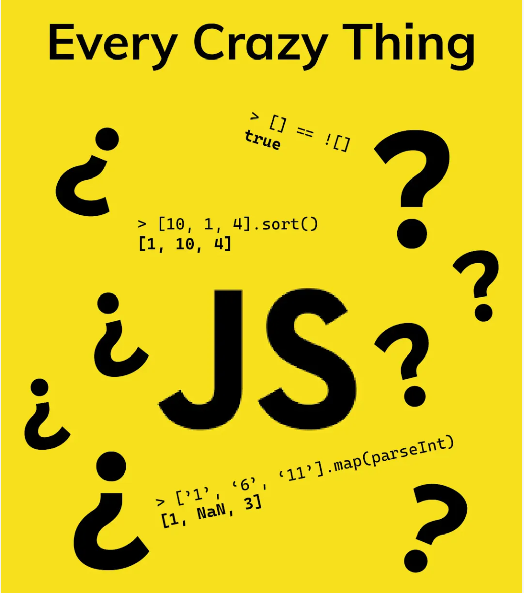

在日常的前端开发中，操作数组是 JavaScript 前端开发的基本技能，同时也是处理数据的关键。无论是应对用户的输入，还是操作大规模的数据集，都离不开数组方法。但是，面对众多的数组方法，如 `push()`、`map()`、`reduce()`，以及最新的 `Array.at()`，不知道如何选择和使用它们？




下面将深入研究 JavaScript 数组方法的世界，从基本操作到高级技巧，通过清楚的示例和实用的场景，完全掌握这些工具的使用。

#### 数组的特性
在 JavaScript 中，数组不是基本类型，而是具有以下核心特征的 Array 对象：
- JavaScript 数组中每个元素**可以存储任意类型的数据**。
- JavaScript 数组是**的大小是动态的**，会随着数据添加而自动增长，并且可以包含不同的[数据类型](https://developer.mozilla.org/zh-CN/docs/Web/JavaScript/Data_structures) 。（当不需要这些特征时，可以使用[类型化数组](https://developer.mozilla.org/zh-CN/docs/Web/JavaScript/Guide/Typed_arrays)。）
- **JavaScript 数组不是关联数组**，因此，**不能使用任意字符串作为索引访问数组元素，但必须使用非负整数**（或它们各自的字符串形式）作为索引访问。
- JavaScript 数组的索引[从 0 开始](https://zh.wikipedia.org/zh-cn/%E5%BE%9E%E9%9B%B6%E9%96%8B%E5%A7%8B%E7%9A%84%E7%B7%A8%E8%99%9F)：数组的第一个元素在索引 0 处，第二个在索引 1 处，以此类推，最后一个元素是数组的 length 属性减去 1 的值。
- JavaScript 数组[复制操作](https://developer.mozilla.org/zh-CN/docs/Web/JavaScript/Reference/Global_Objects/Array#%E5%A4%8D%E5%88%B6%E6%95%B0%E7%BB%84)创建[浅拷贝](https://developer.mozilla.org/zh-CN/docs/Glossary/Shallow_copy)。（所有 JavaScript 对象的标准内置复制操作都会创建浅拷贝，而不是[深拷贝](https://developer.mozilla.org/zh-CN/docs/Glossary/Deep_copy)）。

### 创建数组
有以下几种基本的方式可以创建数组。

#### 使用 Array 构造函数
```js
const colors = new Array();
```
**如果知道数组中元素的数量，那么可以给构造函数传入一个数值，然后 length 属性就会被自动创建并设置为这个值**。比如，下面的代码会创建一个初始 length 为 20 的数组：
```js
const colors = new Array(20);
```
也**可以给 Array 构造函数传入要保存的元素**。比如，下面的代码会创建一个包含 3 个字符串值的数组：
```js
const colors = new Array("red", "blue", "green");
```

在JavaScript中，当你创建一个新的数组时，你可以选择传递一个值给数组的构造函数。
- 如果传递的值是数值类型，比如你写的是 `new Array(5)`，那么 JavaScript 会创建一个长度为5的空数组。
- 如果传递的值是其他类型，比如你写的是 `new Array('hello')`，那么 JavaScript 会创建一个包含单一元素 `'hello'` 的数组。

#### 数组字面量

数组字面量是在中括号中包含以逗号分隔的元素列表，如下面的例子所示：
```js
let colors = ["red", "blue", "green"]; // 创建一个包含 3 个元素的数组
let names = []; // 创建一个空数组
let values = [1,2,]; // 创建一个包含 2 个元素的数组
```
上面代码中，第一行创建一个包含 3 个字符串的数组。第二行用一对空中括号创建了一个空数组。第三行展示了在数组最后一个值后面加逗号的效果：values 是一个包含两个值（1 和 2）的数组。

> 在使用数组字面量表示法创建数组不会调用 Array 构造函数。

Array 构造函数还有两个 ES6 新增的用于创建数组的静态方法：`from()` 和 `of()`。
- `from()` 用于将类数组结构转换为数组实例。
  
  `Array.from()` 的第一个参数是一个**类数组对象**，即任何可迭代的结构，或者**有一个 length 属性和可索引元素的结构**。
  
  1. **字符串会被拆分成单个字符数组**
      ```js
      const str = "这是一个字符串";
      console.log(Array.from(str)); // ['这', '是', '一', '个', '字', '符', '串']
      ```
  2. **将集合和映射转换为一个新数组**
      ```js
      // 创建一个新的 Map 对象，并添加两个键值对
      const m = new Map().set(1, 2).set(3, 4);
    
      // 创建一个新的 Set 对象，并添加四个元素
      const s = new Set().add(1).add(2).add(3).add(4);
    
      // 使用 Array.from() 方法从 Map 对象创建新的数组，每个键值对会被转换成一个子数组
      console.log(Array.from(m)); // [[1, 2], [3, 4]]
    
      // 使用 Array.from() 方法从 Set 对象创建新的数组
      console.log(Array.from(s)); // [1, 2, 3, 4]
      ```
    
  3. **对现有数组执行浅复制**
      ```js
      // 创建一个数组 arr1
      const arr1 = [1, 2, 3, 4];
      
      // 使用 Array.from() 方法创建一个新的数组 arr2，这个新数组是 arr1 的复制
      const arr2 = Array.from(arr1);
      
      // 打印原始数组 arr1
      console.log(arr1); // [1, 2, 3, 4];
      
      // 比较原始数组 arr1 和新数组 arr2 是否相等，由于 arr2 是 arr1 的复制而非引用，所以结果为 false
      console.log(arr1 === arr2); // false
      ```
  4. **使用 `Array.from()` 方法和自定义的迭代器创建新的数组**
      ```js
      // 定义一个包含 Symbol.iterator 属性的对象，该属性是一个生成器函数
      // 生成器函数每次调用 yield 会返回一个新的值
      const iter = {
          *[Symbol.iterator]() {
              yield 1;
              yield 2;
              yield 3;
              yield 4;
          },
      };
      
      // 使用 Array.from() 方法和自定义的迭代器创建新的数组
      // iter 对象的 Symbol.iterator 属性是一个生成器，会按顺序生成 1, 2, 3, 4
      // Array.from() 方法会将这些值收集到一个新的数组中
      console.log(Array.from(iter)); // [1, 2, 3, 4]
      ```
      
  5. **把 `arguments` 对象转换为数组**
      ```js
      // 定义一个函数 getArgsArray，它接收任意数量的参数
      function getArgsArray() {
          // 使用 Array.from() 方法将 arguments 对象转换成一个新的数组
          // arguments 对象包含了函数调用时传递的所有参数
          return Array.from(arguments);
      }
      
      // 调用 getArgsArray 函数，并传入四个参数：1, 2, 3, 4
      // 函数返回一个新数组，包含了传入的所有参数
      console.log(getArgsArray(1, 2, 3, 4)); // [1, 2, 3, 4]
      ```
      
  6. **将类似数组的对象转换为一个新的数组**
      ```js
      // 创建一个类似数组的对象，该对象有四个元素和一个 length 属性
      const arrayLikeObject = {
          0: 1,
          1: 2,
          2: 3,
          3: 4,
          length: 4,
      };
      
      // 使用 Array.from() 方法将类似数组的对象转换为一个新的数组
      // arrayLikeObject 对象有 length 属性和相应的索引，因此可以被视为类似数组的对象
      // Array.from() 方法会将这些值收集到一个新的数组中
      console.log(Array.from(arrayLikeObject)); // [1, 2, 3, 4]
      ```
      
  7. **从 NodeList 构建数组**
      ```js
      // 使用 document.querySelectorAll 方法选择页面上的所有 img 标签，返回一个 NodeList 对象
      const images = document.querySelectorAll("img");
      
      // 使用 Array.from 方法将 NodeList 对象转换为数组
      // 传入一个映射函数，这个函数会遍历每个 img 元素，并返回它们的 src 属性
      const sources = Array.from(images, (image) => image.src);
      
      // 使用数组的 filter 方法筛选出所有以 "http://" 开头的链接
      // 这些链接是不安全的，因为它们没有使用加密的 https 协议
      const insecureSources = sources.filter((link) => link.startsWith("http://"));
      ```
      
  
  `Array.from()` 还接收第二个可选的**映射函数参数**。这个函数可以直接增强新数组的值，而无须像调用 `Array.from().map()` 那样先创建一个中间数组。还可以接收**第三个可选参数，用于指定映射函数中 this 的值**。
  ```js
  // 创建一个数组 a1
  const a1 = [1, 2, 3, 4];
  
  // 使用 Array.from() 方法创建一个新的数组 a2，映射函数是对每个元素进行平方
  // x => x**2 是一个箭头函数，它接收一个参数 x，返回 x 的平方
  const a2 = Array.from(a1, x => x ** 2);
  
  // 使用 Array.from() 方法创建一个新的数组 a3，映射函数是对每个元素进行平方
  // 这次我们使用了一个常规函数，并通过 this 关键字引用了额外的参数
  // {exponent: 2} 是映射函数的第二个参数，它会被作为 this 值传递给映射函数
  const a3 = Array.from(
      a1,
      function (x) {
          return x ** this.exponent;
      },
      { exponent: 2 },
  );
  
  // 打印新的数组 a2，输出：[1, 4, 9, 16]
  console.log(a2);
  
  // 打印新的数组 a3，输出：[1, 4, 9, 16]
  console.log(a3);
  ```
  
- `of()` 用于将一组参数转换为数组实例。

  `Array.of()` 可以把一组参数转换为数组。这个方法用于替代在 ES6之前常用的 `Array.prototype.slice.call(arguments)`，一种异常笨拙的将 arguments 对象转换为数组的写法：
  ```js
  console.log(Array.of(7)); // [7]
  console.log(Array(7)); // 由 7 个空槽组成的数组
  
  console.log(Array.of(1, 2, 3)); // [1, 2, 3]
  console.log(Array(1, 2, 3)); // [1, 2, 3]
  ```
  
### 数组空位
使用数组字面量初始化数组时，可以使用一串逗号来创建空位（hole）。ECMAScript 会将逗号之间相应索引位置的值当成空位，ES6 规范重新定义了该如何处理这些空位。

可以像下面这样创建一个空位数组：
```js
const options = [,,,,,]; // 创建包含 5 个元素的数组
console.log(options.length); // 5 
console.log(options); // [,,,,,]
```

ES6 新增的方法和迭代器与早期 ECMAScript 版本中存在的方法行为不同。ES6 新增方法普遍将这些空位当成存在的元素，只不过值为 undefined：
- 逗号创建空位
  ```js
  const options = [1, , , , 5];
  for (const option of options) {
      console.log(option === undefined);
  }
  // false
  // true
  // true
  // true
  // false
  
  for (const [index, value] of options.entries()) {
      console.log('es6 method:', value);
  }
  // es6 method: 1
  // es6 method: undefined
  // es6 method: undefined
  // es6 method: undefined
  // es6 method: 5
  ```
  
- 使用 `Array.from()` 创建空位的数组
  ```js
  const a = Array.from([, , ,]); // 使用 ES6 的 Array.from()创建的包含 3 个空位的数组
  for (const val of a) {
      console.log('for of val:', val === undefined);
  }
  // for of val: true
  // for of val: true
  // for of val: true
  
  console.log('Array.of result:', Array.of(...[, , ,])); // [undefined, undefined, undefined]
  ```
  

ES6 之前的方法则会忽略这个空位，但具体的行为也会因方法而异：
```js
const options = [1,,,,5]; 

// map()会跳过空位置
console.log(options.map(() => 6)); // [6, undefined, undefined, undefined, 6] 

// join()视空位置为空字符串
console.log(options.join('-')); // "1----5"
```

### 数组索引

`Array` 不能使用任意字符串作为元素索引，**必须使用非负整数**。通过**非整数设置或访问不会设置或从数组列表本身检索元素**，但会设置或访问与该数组的对象属性集合相关的变量。数组的对象属性和数组元素列表是分开的，数组的遍历和修改操作不能应用于这些命名属性。

> JavaScript 语法要求使用**方括号表示法**而**不是点号表示法**来访问以数字开头的属性。**也可以用引号包裹数组下标**（例如，`years['2']` 而不是 `years[2]` ，尽管通常没有必要。

要取得或设置数组的值，需要使用方括号并提供相应值的数字索引，如下所示：
```js
const colors = ['red', 'blue', 'green']; // 定义一个字符串数组
console.log(colors[0]); // 显示第一项
colors[2] = 'black'; // 修改第三项
colors[3] = 'brown'; // 添加第四项
```
索引值的相关规律：
- 如果**索引小于数组包含的元素数，则返回存储在相应位置的元素**，就像示例中 `colors[0]` 显示 `"red"` 一样。
- **设置数组的索引是存在的，就是替换指定位置的值**。
- 如果设置的索引**超过数组的长度**（就像示例中的 `colors[3]`），**则数组长度会自动扩展到该索引值加 1**（示例中设置的索引 3，所以数组长度变成了 4）。

JavaScript 引擎通过隐式的 `toString`，将 `years[2]` 中的 `2` 强制转换为字符串。因此，`'2'` 和 `'02'` 将指向 `years` 对象上的两个不同的槽位，下面的例子可能是 `true`：
```js
const years = [2022, 2023, 2024];
// `'2'` 和 `'02'` 将指向 `years` 对象上的两个不同的槽位
console.log(years["2"] !== years["02"]); // true
```

数组中元素的数量保存在 `length` 属性中，这个属性始终返回大于等于0的值，如下例所示：
```js
const colors = ["red", "blue", "green"]; // 创建一个包含 3 个字符串的数组
const names = []; // 创建一个空数组
alert(colors.length); // 3 
alert(names.length); // 0
```

在 JavaScript 中，数组 `length` 属性的独特之处在于，它**不是只读的。通过修改 `length` 属性，可以从数组末尾删除或添加元素**。
```js
let colors = ["red", "blue", "green"]; // 创建一个包含 3 个字符串的数组
colors.length = 2; 
alert(colors[2]); // undefined
```

这里，数组 `colors` 一开始有 3 个值。将 `length` 设置为 2，就删除了最后一个（位置 2 的）值，因此 `colors[2]` 就没有值了。如果将 `length` 设置为大于数组元素数的值，则新添加的元素都将以 `undefined` 填充，如下例所示：
```js
let colors = ["red", "blue", "green"]; // 创建一个包含 3 个字符串的数组
colors.length = 4; 
alert(colors[3]); // undefined
```
这里将数组 `colors` 的 `length` 设置为 4，虽然数组只包含 3 个元素。位置 3 在数组中不存在，因此访问其值会返回特殊值 `undefined`。

> 为什么访问一个不存在的索引的元素返回的是 `undefined`？
>
> 因为 Array 是引用类型，未定义的索引并不等同于不存在，当你创建一个数组，它会有一个预定义的长度，但这并不意味着所有的索引都被赋值了。也就是说空位有自己的位置，但是这个位置的值是未定义，即这个**值是不存在的**。如果一定要读取，结果就是undefined（因为undefined在JavaScript语言中表示不存在）

**使用 length 属性可以方便地向数组末尾添加元素**，如下例所示：
```js
const colors = ['red', 'blue', 'green']; // 创建一个包含 3 个字符串的数组
colors[colors.length] = 'black'; // 添加一种颜色（位置 3）
colors[colors.length] = 'brown'; // 再添加一种颜色（位置 4）
console.log(colors); // ['red', 'blue', 'green', 'black', 'brown']
```
数组中最后一个元素的索引始终是 length - 1，因此下一个新增槽位的索引就是 length。每次在数组最后一个元素后面新增一项，数组的 length 属性都会自动更新。
```js
const colors = ['red', 'blue', 'green']; // 创建一个包含 3 个字符串的数组
colors[99] = 'black'; // 添加一种颜色（位置 99）
console.log(colors.length); // 100
```
这里，`colors` 数组有一个值被插入到位置 99，结果新 `length` 就变成了 100（99 + 1）。这中间的所有元素，即位置 3~98，实际上并不存在，因此在访问时会返回 undefined。

> **数组最多可以包含 4294967295 个元素**，这对于大多数编程任务应该足够了。如果尝试添加更多项，则会导致抛出错误。以这个最大值作为初始值创建数组，可能导致脚本运行时间过长的错误。

### 检测数组
一个经典的 ECMAScript 问题是判断一个对象是不是数组。在只有一个网页（因而只有一个全局作用域）的情况下，使用 instanceof 操作符就足矣：
```js
if (value instanceof Array){ 
   // 操作数组
}
```
使用 instanceof 的问题是假定只有一个全局执行上下文。如果网页里有多个框架，则可能涉及两个不同的全局执行上下文，因此就会有两个不同版本的 `Array` 构造函数。如果要把数组从一个框架传给另一个框架，则这个数组的构造函数将有别于在第二个框架内本地创建的数组。


为解决这个问题，ECMAScript 提供了 `Array.isArray()` 方法。这个方法的目的就是**确定一个值是否为数组，而不用管它是在哪个全局执行上下文中创建的**。来看下面的例子：
```js
if (Array.isArray(value)){ 
   // 操作数组
}
```

- `instanceof` 和 `Array.isArray(`) 的区别：

  `Array.isArray()` 也拒绝原型链中带有 `Array.prototype`，而实际不是数组的对象，但 `instanceof Array` 会接受。

    ```js
    const iframe = document.createElement('iframe');
    document.body.appendChild(iframe);
    const xArray = window.frames[window.frames.length - 1].Array;
    const arr = new xArray(1, 2, 3); // [1, 2, 3]
  
    // 正确检查 Array
    Array.isArray(arr); // true
    // arr 的原型是 xArray.prototype，它是一个不同于 Array.prototype 的对象
    arr instanceof Array; // false
    ```
  
### 迭代器方法
ES6 中，Array 的原型上暴露了 3 个用于检索数组内容的方法：`keys()`、`values()`和 `entries()`。
```js
const a = ['foo', 'bar', 'baz', 'qux'];
// 因为这些方法都返回迭代器，所以可以将它们的内容
// 通过 Array.from()直接转换为数组实例
const aKeys = Array.from(a.keys());
const aValues = Array.from(a.values());
const aEntries = Array.from(a.entries());
console.log(aKeys); // [0, 1, 2, 3]
console.log(aValues); // ["foo", "bar", "baz", "qux"]
console.log(aEntries); // [[0, "foo"], [1, "bar"], [2, "baz"], [3, "qux"]]
```

使用 ES6 的解构可以非常容易地在循环中拆分键/值对：
```js
const a = ['foo', 'bar', 'baz', 'qux'];
for (const [idx, element] of a.entries()) {
    console.log(`index:${idx} -> ${element}`);
}
// index:0 -> foo
// index:1 -> bar
// index:2 -> baz
// index:3 -> qux
```

### 复制和填充方法
ES6 新增了两个方法：批量复制方法 `copyWithin()`，以及填充数组方法 `fill()`。这**两个方法的函数签名类似**，都需要指定既有数组实例上的一个范围，**包含开始索引，不包含结束索引。使用这个方法不会改变数组的大小**。

#### fill 方法
语法：
```txt
fill(value)
fill(value, start)
fill(value, start, end)
```

**参数解释**：

**value：用来填充数组元素的值**。
```js
const zeroes = [0, 0, 0, 0, 0];

// 用 5 填充整个数组
zeroes.fill(5);
console.log(zeroes); // [5, 5, 5, 5, 5]
```

**start：基于零的索引，从此开始填充，转换为整数**。
  - **负数索引从数组的末端开始计算**，如果 `start < 0`，则使用 `start + array.length`。
    ```js
    // 初始化一个数组
    const array = [1, 2, 3, 4, 5];
    
    // 如果 start < 0，从数组末端开始计算索引
    array.fill('a', -2); // [1, 2, 3, 'a', 'a']
    ```
  - 如果 `start < -array.length` 或 start 被省略，则使用 0。
    ```js
    // 初始化一个数组
    let array = [1, 2, 3, 4, 5];
    
    // 如果 start < -array.length 或 start 被省略，则从索引0开始填充
    array.fill('b', -6);
    console.log(array); // ['b', 'b', 'b', 'b', 'b'];
    array.fill('c');
    console.log(array); // ['c', 'c', 'c', 'c', 'c']
    ```
  - 如果 `start >= array.length`，没有索引被填充。
    ```js
    // 初始化一个数组
    let array = [1, 2, 3, 4, 5];
    
    // 如果 start = array.length，没有索引被填充
    array.fill('d', 5);
    console.log(array); // [1, 2, 3, 4, 5]，原数组无变化
    
    // 如果 start > array.length，没有索引被填充
    array.fill('d', 6);
    console.log(array); // [1, 2, 3, 4, 5]，原数组无变化
    ```

**end：基于零的索引，在此结束填充，转换为整数**。`fill()` 填充到但不包含 `end` 索引。
  - 负数索引从数组的末端开始计算，如果 `end < 0`，则使用 `end + array.length`。
    ```js
    // 初始化一个数组
    let array = [1, 2, 3, 4, 5];
    
    // 如果 end < 0，从数组末端开始计算索引
    array.fill('a', 0, -1);
    console.log(array); // ['a', 'a', 'a', 'a', 5]
    ```
  - 如果 `end < -array.length`，则使用 0。
    ```js
    // 初始化一个数组
    let array = [1, 2, 3, 4, 5];
    
    array.fill('b', 0, -6); // [1, 2, 3, 4, 5], 原数组无变化
    ```
  - 如果 `end >= array.length` 或 `end` 被省略，则使用 `array.length`，导致所有索引都被填充。
    ```js
    // 初始化一个数组
    let array = [1, 2, 3, 4, 5];
    
    // 如果 end >= array.length 或 end 被省略，则使用 array.length，所有索引都被填充
    array.fill('c', 0); // ['c', 'c', 'c', 'c', 'c']
    array.fill('d'); // ['d', 'd', 'd', 'd', 'd']
    ```
  - 如果经标准化后，`end` 的位置在 `start` 之前或之上，没有索引被填充。
    ```js
    // 初始化一个数组
    let array = [1, 2, 3, 4, 5];
    // 如果经标准化后，end 的位置在 start 之前或之上，没有索引被填充
    array.fill('e', 3, 2); // [1, 2, 3, 4, 5]，原数组无变化
    ```

使用 `fill()` 方法**可以向一个已有的数组中插入全部或部分相同的值**。
- 开始索引用于指定开始填充的位置，它是可选的。
- 如果不提供结束索引，则一直填充到数组末尾。
- 负值索引从数组末尾开始计算。


示例如下：
```js
const zeroes = [0, 0, 0, 0, 0];

// 用 5 填充整个数组
zeroes.fill(5);
console.log(zeroes); // [5, 5, 5, 5, 5]

zeroes.fill(0); // 重置

// 用 6 填充索引大于等于 3 的元素
zeroes.fill(6, 3);
console.log(zeroes); // [0, 0, 0, 6, 6]

zeroes.fill(0); // 重置

// 用 7 填充索引大于等于 1 且小于 3 的元素
zeroes.fill(7, 1, 3);
console.log(zeroes); // [0, 7, 7, 0, 0];

zeroes.fill(0); // 重置

// 用 8 填充索引大于等于 1 且小于 4 的元素
// (-4 + zeroes.length = 1)
// (-1 + zeroes.length = 4)
zeroes.fill(8, -4, -1);
console.log(zeroes); // [0, 8, 8, 8, 0];
```

`fill()` 默认忽略超出数组边界、零长度及方向相反的索引范围：
```js

const zeroes = [0, 0, 0, 0, 0];

// 索引过低，忽略
zeroes.fill(1, -10, -6);
console.log(zeroes); // [0, 0, 0, 0, 0]

// 索引过高，忽略
zeroes.fill(1, 10, 15);
console.log(zeroes); // [0, 0, 0, 0, 0]

// 索引反向，忽略
zeroes.fill(2, 4, 2);
console.log(zeroes); // [0, 0, 0, 0, 0]

// 索引部分可用，填充可用部分
zeroes.fill(4, 3, 10);
console.log(zeroes); // [0, 0, 0, 4, 4]
```

### 转换方法
之前提到过，所有对象都有 `toLocaleString()`、`toString()` 和 `valueOf()` 方法。
- `valueOf()` 返回的还是数组本身。
- `toString()` 返回由数组中每个值的等效字符串拼接而成的一个逗号分隔的字符串。也就是说，**对数组的每个值都会调用其 `toString()` 方法，以得到最终的字符串**。
- `toLocaleString()` 方法也可能返回跟 `toString()` 和 `valueOf()` 相同的结果，但也不一定。在调用数组的 toLocaleString()方法时，会得到一个逗号分隔的数组值的字符串。它与另外两个方法唯一的区别是，为了得到最终的字符串，会调用数组每个值的 `toLocaleString()` 方法，而不是 `toString()` 方法。

  ```js
  const colors = ["red", "blue", "green"]; 
  console.log(colors.toString()); // red,blue,green 
  console.log(colors.valueOf()); // red,blue,green 
  console.log(colors); // red,blue,green
  
  const person1 = {
      toLocaleString() {
          return 'Nikolaos';
      },
      toString() {
          return 'Nicholas';
      },
  };
  const person2 = {
      toLocaleString() {
          return 'Grigorios';
      },
      toString() {
          return 'Greg';
      },
  };
  const people = [person1, person2];
  console.log(people); // Nicholas,Greg
  console.log(people.toString()); // Nicholas,Greg
  console.log(people.toLocaleString()); // Nikolaos,Grigorios
  ```
  这里定义了两个对象 `person1` 和 `person2`，它们都定义了 `toString()` 和 `toLocaleString()` 方法，而且返回不同的值。然后又创建了一个包含这两个对象的数组 `people`。在将数组传给 `console.log()` 时，输出的是 `"Nicholas,Greg"`，这是因为会在数组每一项上调用 `toString()` 方法（与下一行显式调用 `toString()` 方法结果一样）。而在调用数组的 `toLocaleString()` 方法时，结果变成了 `"Nikolaos, Grigorios"`，这是因为调用了数组每一项的 `toLocaleString()` 方法。
  

继承的方法 `toLocaleString()` 以及 `toString()` 都返回数组值的逗号分隔的字符串。**如果想使用不同的分隔符，则可以使用 `join()` 方法**。`join()` 方法接收一个参数，即字符串分隔符，返回包含所有项的字符串。
```js
const colors = ["red", "green", "blue"]; 
console.log(colors.join(",")); // red,green,blue 
console.log(colors.join("||")); // red||green||blue
```
> 如果数组中某一项是 `null` 或 `undefined`，则在 `join()`、`toLocaleString()`、`toString()` 和 `valueOf()` 返回的结果中会以空字符串表示。

### 栈方法
数组对象可以像栈一样，
也就是一种限制插入和删除项的数据结构。**栈是一种后进先出（LIFO，Last-In-First-Out）的结构，也就是最近添加的项先被删除**。数据项的插入（称为推入，push）和删除（称为弹出，pop）只在栈的一个地方发生，即栈顶。ECMAScript 数组提供了 `push()` 和 `pop()` 方法，以实现类似栈的行为。

- `push()` 方法接收任意数量的参数，并将它们添加到数组末尾，**返回数组的最新长度**。
  ```js
  const arr = [1, 2, 3];
  const len = arr.push(4, 5, 6);
  console.log('新数组的长度：', len); // 新数组的长度： 6
  console.log('push 后的新数组：', arr); // push 后的新数组： (6) [1, 2, 3, 4, 5, 6]
  ```
- `pop()` 方法则用于删除数组的最后一项，同时减少数组的 `length` 值，**返回被删除的项**。
  ```js
  const colors = ['red', 'blue']; // 初始化一个包含两个元素的数组
  colors.push('brown'); // 在数组的末尾添加一个新元素，此时数组变为 ['red', 'blue', 'brown']
  colors[3] = 'black'; // 在数组的索引3的位置添加一个新元素，此时数组变为 ['red', 'blue', 'brown', 'black']
  console.log(colors.length); // 打印数组的长度，结果为4
  const item = colors.pop(); // 从数组的末尾移除一个元素并返回这个元素，此时数组变为 ['red', 'blue', 'brown']
  console.log(item); // 打印被移除的元素，结果为 'black'
  ```
  
### 队列方法
**队列以先进先出（FIFO，First-In-First-Out）形式限制访问**；队列在列表末尾添加数据，但从列表开头获取数据。

- `shift()` 从数组开头取数据，它会删除数组的第一项并返回它，然后数组长度减 1。
  ```js
  const array = [1, 2, 3, 4, 5];
  
  const firstItem = array.shift(); 
  console.log(firstItem); // 1
  console.log(array); // [2, 3, 4, 5]
  ```
- `unshift()` 在数组开头添加任意多个值，然后返回新的数组长度。
  ```js
  let array = [1, 2, 3, 4, 5];
  
  let newLength = array.unshift('a', 'b', 'c'); 
  console.log(newLength); // 8
  console.log(array); // ['a', 'b', 'c', 1, 2, 3, 4, 5]
  ```
  
### 排序方法

数组有两个方法可以用来对元素重新排序：`reverse()` 和 `sort()`。

- reverse()方法就是将**数组元素反向排列**。
  ```js
  const values = [1, 2, 3, 4, 5]; 
  values.reverse(); 
  console.log(values); // 5,4,3,2,1
  ```
  通过调用 `reverse()` 反向排序，得到了`[5,4,3,2,1]`。这个方法很直观，但不够灵活，所以才有了 `sort()` 方法。
  
- `sort()` 会按**照升序重新排列数组元素，即最小的值在前面，最大的值在后面**。

  `sort()` 会在**每一项上调用 `String()` 转型函数，然后比较字符串来决定顺序**。即使数组的元素都是数值，也会先把数组转换为字符串再比较、排序。
  ```js
  const values = [0, 1, 5, 10, 15];
  values.sort();
  console.log(values); // 0,1,10,15,5
  ```
  
  `sort()` 方法可以接收一个**比较函数**，用于判断哪个值应该排在前面。
  
  比较函数接收两个参数:
  - 如果第一个参数应该排在第二个参数前面，就返回负值；
  - 如果两个参数相等，就返回 0；
  - 如果第一个参数应该排在第二个参数后面，就返回正值。
  
  示例如下：
  ```js
  function compare(value1, value2) {
      if (value1 < value2) {
          return -1;
      } else if (value1 > value2) {
          return 1;
      } else {
          return 0;
      }
  }
  const values = [0, 1, 5, 10, 15];
  values.sort(compare);
  console.log(values); // 0,1,5,10,15
  ```
  
  还可以简写成箭头函数：
  ```js
  const values = [0, 1, 5, 10, 15]; 
  values.sort((a, b) => a < b ? 1 : a > b ? -1 : 0); 
  console.log(values); // 15,10,5,1,0
  ```
  
  > 如果只是想反转数组的顺序，`reverse()` 更简单也更快。`reverse()` 和 `sort()` 都返回调用它们的数组的引用。
  
  如果数组的元素是数值，或者是其 valueOf()方法返回数值的对象（如 Date 对象），这个比较函数还可以写得更简单，因为这时可以直接用第二个值减去第一个值：
  ```js
  const compare = (val1, val2) => val2 -val1;
  ```
  比较函数就是要返回小于 0、0 和大于 0 的数值，因此减法操作完全可以满足要求。
  
  
### 操作方法
对于数组中的元素，我们有很多操作方法。

- `concat()` 方法可以在 现有数组全部元素基础上创建一个新数组。

  它首先会创建一个当前数组 的副本，然后再把它的参数添加到副本末尾，最后返回这个新构建的数 组。如果传入一个或多个数组，则 `concat()` 会把这些数组的每一项都添 加到结果数组。如果参数不是数组，则直接把它们添加到结果数组末尾。
  ```js
  let colors = ["red", "green", "blue"];
  let colors2 = colors.concat("yellow", ["black", "brown"]);
  console.log(colors);   // ["red", "green","blue"]
  console.log(colors2);  // ["red", "green", "blue", "yellow", "black", "brown"]
  ```

  这里先创建一个包含3个值的数组 `colors` 。然后 `colors` 调用 `concat()` 方法，传入字符串 `"yellow"` 和一个包含 `"black"` 和 `"brown"` 的数组。保存 在colors2中的结果就是 `["red", "green", "blue", "yellow", "black", "brown"]` 。原始数组 `colors` 保持不变。

  打平数组参数的行为可以重写，方法是在参数数组上指定一个特殊的符 号: `Symbol.isConcatSpreadable`。这个符号能够阻止 `concat()` 打平参数数组。相反，把这个值设置为true可以强制打平类数组对象：
  ```js
  const colors = ['red', 'green', 'blue'];
  const newColors = ['black', 'brown'];
  const moreNewColors = {
      [Symbol.isConcatSpreadable]: true,
      length: 2,
      0: 'pink',
      1: 'cyan',
  };
  newColors[Symbol.isConcatSpreadable] = false;
  // 强制不打平数组
  const colors2 = colors.concat('yellow', newColors);
  // 强制打平类数组对象
  const colors3 = colors.concat(moreNewColors);
  console.log(colors); // ["red", "green", "blue"]
  console.log(colors2); // ["red", "green", "blue", "yellow", ["black", "brown"]]
  console.log(colors3); // ["red", "green", "blue", "pink", "cyan"]
  ```

- `slice()` 用于创建一个包含原有数组中一个或多个元素的新数组。

  `slice()` 方法可以接收一个或两个参数并返回元素的开始索引和结束索引。
  - 如果只有一个参数，则 `slice()` 会返回该索引到数组末尾的所有元素。
  - 如果有两个参数，则 `slice()` 返回从开始索引到结束索引对应的所有元素，其中不包含结束索引对应的元素。**这个操作不影响原始数组**。来看下面的例子:
  ```js
  const colors = ['red', 'green', 'blue', 'yellow', 'purple'];
  const colors2 = colors.slice(1);
  const colors3 = colors.slice(1, 4);
  console.log(colors2); // green,blue,yellow,purple
  console.log(colors3); // green,blue,yellow
  ```

  > 如果 `slice()` 的参数有负值，那么就以数值长度加上这个负值的结果确定位置。比如，在包含5个元素的数组上调用 `slice(-2,-1)`，就相当于调用 `slice(3,4)`。如果结束位置小于开始位置，则返回空数组。

- `splice()` 的主要目的是在数组中间插入元素，但有3种不同的方式使用这个方法。

  1. 删除。需要给 `splice()` 传2个参数:要删除的**第一个元素的位置**和要**删除的元素数量**。可以从数组中删除任意多个元素，比如 `splice(0, 2)` 会删除前两个元素。 
      ```js
      const colors = ['red', 'green', 'blue'];
      let removed = colors.splice(0, 1); // 删除第一项
      console.log(colors); // green,blue
      console.log(removed); // red，只有一个元素的数组
      ```
  2. 插入。需要给 `splice()` 传3个参数:**开始位置、0(要删除的元素数 量)和要插入的元素，可以在数组中指定的位置插入元素**。第三个 参数之后还可以传第四个、第五个参数，乃至任意多个要插入的元 素。比如，`splice(2, 0, "red", "green")` 会从数组位置2开始插入 字符串 `"red"` 和 `"green"`。 
      ```js
      const colors = ['red', 'green', 'blue'];
      let removed = colors.splice(0, 1); // 删除第一项
      removed = colors.splice(1, 0, 'yellow', 'orange');
      console.log(colors);  // ['green', 'yellow', 'orange', 'blue']
      console.log(removed); // []
      ```
  3. 替换。splice()在删除元素的同时可以在指定位置插入新元素，同 样要传入3个参数:开始位置、要删除元素的数量和要插入的任意。
    ```js
    const colors = ['red', 'green', 'blue'];
    let removed = colors.splice(0, 1);
    removed = colors.splice(1, 1, 'red', 'purple'); // 插入两个值，删除一个元素（替换）
    console.log(colors); // green,red,purple,orange,blue
    console.log(removed); // ['blue'];
    ```
  
    
### 搜索和位置方法
ECMAScript提供两类搜索数组的方法：**按严格相等搜索和按断言函数搜索**。

#### 严格相等
ECMAScript提供了3个严格相等的搜索方法：`indexOf()`、`lastIndexOf()` 和 `includes()`。前两个方法 在所有版本中都可用，而第三个方法是 ECMAScript 7新增的。这些方法都接收两个参数：要查找的元素和一个可选的起始搜索位 置。`indexOf()` 和 `includes()` 方法从数组前头(第一项)开始向后搜 索，而 `lastIndexOf()` 从数组末尾(最后一项)开始向前搜索。
> 在比较第一个参数跟数组每一项时，会 **使用全等(===)比较**，也就是说两项必须严格相等。

`indexOf()` 和 `lastIndexOf()` 都返回要查找的元素在数组中的位置， 如果没找到则返回 -1。
```js
const arr = [1, 2, 3, 4, 5];
console.log(arr.indexOf(3)); // 2
console.log(arr.lastIndexOf(4)); // 3
console.log(arr.indexOf(6)); // -1
console.log(arr.indexOf(6)); // -1
```

`includes()`返回布尔值，表示是否至少找到 一个与指定元素匹配的项。
```js
const arr = [1, 2, 3, 4, 5];
console.log(arr.includes(3)); // true
console.log(arr.includes(6)); // false
```
#### 断言函数
ECMAScript 也允许按照定义的断言函数搜索数组，每个索引都会调用这个函数。断言函数的返回值决定了相应索引的元素是否被认为匹配。

断言函数接收3个参数:**元素、索引和数组本身**。其中元素是数组中当前搜索的元素，索引是当前元素的索引，而数组就是正在搜索的数组。断言函数返回真值，表示是否匹配。

`find()` 和 `findIndex()` 方法使用了断言函数。这两个方法都从**数组的最小索引开始**。`find()` 返回第一个匹配的元素，`findIndex()` 返回第 一个匹配元素的索引。这两个方法也都接收第二个可选的参数，用于指定断言函数内部this的值。
```js
const people = [
    { name: 'Matt', age: 27 },
    { name: 'Nicholas', age: 29 },
];
console.log(people.find((element, index, array) => element.age < 28));
// {name: "Matt", age: 27}
console.log(people.findIndex((element, index, array) => element.age < 28)); // 0
```

### 迭代方法
ECMAScript为数组定义了5个迭代方法。
#### every

`every()` 方法测试一个数组内的**所有元素是否都能通过指定函数的测试**。它返回一个布尔值。
```js
const isBelowThreshold = (currentValue) => currentValue < 40;
const array1 = [1, 30, 39, 29, 10, 13];
console.log(array1.every(isBelowThreshold)); // true
```

- 检查所有数组元素的大小，下例测试数组中的所有元素是否都大于 10。
    ```js
    function isBigEnough(element, index, array) {
      return element >= 10;
    }
    [12, 5, 8, 130, 44].every(isBigEnough); // false
    [12, 54, 18, 130, 44].every(isBigEnough); // true
    ```
    
- 检查一个数组是否是另一个数组的子集，下面的示例测试一个数组的所有元素是否都存在于另一个数组中。
    ```js
    const isSubset = (array1, array2) =>
    array2.every((element) => array1.includes(element));
    console.log(isSubset([1, 2, 3, 4, 5, 6, 7], [5, 7, 6])); // true
    console.log(isSubset([1, 2, 3, 4, 5, 6, 7], [5, 8, 7])); // false
    ```

#### filter

创建给定数组一部分的浅拷贝，其包含通过所提供函数实现的测试的所有元素。`filter()` 方法是一个迭代方法。它为数组中的每个元素调用提供的 `callbackFn` 函数一次，并构造一个由所有返回真值的元素值组成的新数组。未通过 `callbackFn` 测试的数组元素不会包含在新数组中。
```js
const words = ['spray', 'elite', 'exuberant', 'destruction', 'present'];
const result = words.filter((word) => word.length > 6);
console.log(result); // ["exuberant", "destruction", "present"]
```
`filter()` 方法是一个复制方法。它不会改变 `this`，而是返回一个包含与原始数组相同的元素（其中某些元素已被过滤掉）的浅拷贝。但是，作为 `callbackFn` 的函数可以更改数组。
> 在第一次调用 `callbackFn` 之前，数组的长度已经被保存。因此：
>
> - 当开始调用 `filter()` 时，`callbackFn` 将不会访问超出数组初始长度的任何元素。
> - 对已访问索引的更改不会导致再次在这些元素上调用 `callbackFn`。
> - 如果数组中一个现有的、尚未访问的元素被 `callbackFn` 更改，则它传递给 `callbackFn` 的值将是该元素被修改后的值。被删除的元素则不会被访问。

下面的示例测试在修改数组时 `filter()` 方法的行为。
```js
// 修改每个单词
let words = ['spray', 'limit', 'exuberant', 'destruction', 'elite', 'present'];

const modifiedWords = words.filter((word, index, arr) => {
    arr[index + 1] += ' extra';
    return word.length < 6;
});

console.log(modifiedWords);
// 注意，在长度为 6 以下有三个单词，但是由于它们已经被修改，所以返回一个单词
// ["spray"]

// 添加新单词
words = ['spray', 'limit', 'exuberant', 'destruction', 'elite', 'present'];
const appendedWords = words.filter((word, index, arr) => {
    arr.push('new');
    return word.length < 6;
});

console.log(appendedWords);
// 只有三个符合条件，即使 `words` 本身现在有更多字符长度小于 6 的单词
// ["spray" ,"limit" ,"elite"]

// 删除单词
words = ['spray', 'limit', 'exuberant', 'destruction', 'elite', 'present'];
const deleteWords = words.filter((word, index, arr) => {
    arr.pop();
    return word.length < 6;
});

console.log(deleteWords);
// 注意我们没有得到 'elite'，因为它在过滤器访问到它之前就已经从 'words' 弹出了
// ["spray" ,"limit"]
```

#### forEach

对数组每一项都运行传入的函数，没有返回值。`forEach()` 方法是一个迭代方法。它按索引升序地为数组中的每个元素调用一次提供的 `callbackFn` 函数。与 `map()` 不同，`forEach()` 总是返回 `undefined`，而且不能继续链式调用。其典型的用法是在链式调用的末尾执行某些操作。

`callbackFn` 仅对已赋值的数组索引调用。对于稀疏数组中的空槽，它不会被调用。

`forEach()` 不会改变其调用的数组，但是，作为 `callbackFn` 的函数可以更改数组。

> 请注意，在第一次调用 `callbackFn` 之前，数组的长度已经被保存。因此：
>
> - 当调用 `forEach()` 时，`callbackFn` 不会访问超出数组初始长度的任何元素。
> - 已经访问过的索引的更改不会导致 `callbackFn` 再次调用它们。
> - 如果 `callbackFn` 更改了数组中已经存在但尚未访问的元素，则传递给 `callbackFn` 的值将是在访问该元素时的值。已经被删除的元素不会被访问。

`forEach()` 期望的是一个同步函数，它不会等待 Promise 兑现。在使用 Promise（或异步函数）作为 `forEach` 回调时，请确保你意识到这一点可能带来的影响。
```js
const ratings = [5, 4, 5];
let sum = 0;

const sumFunction = async (a, b) => a + b;

ratings.forEach(async rating => {
    sum = await sumFunction(sum, rating);
});

console.log(sum);
// 期望的输出：14
// 实际的输出：0
```

下面是一个对象复制函数的示例：
```js
const copy = obj => {
    const copy = Object.create(Object.getPrototypeOf(obj));
    const propNames = Object.getOwnPropertyNames(obj);
    propNames.forEach(name => {
        const desc = Object.getOwnPropertyDescriptor(obj, name);
        Object.defineProperty(copy, name, desc);
    });
    return copy;
};

const obj1 = { a: 1, b: 2 };
const obj2 = copy(obj1); // 现在 obj2 看起来和 obj1 一模一样了
```

使用 `forEach` 方法扁平化数组，下面的示例仅用于学习目的。如果你想使用内置方法来扁平化数组，你可以考虑使用 `Array.prototype.flat()`。
```js
const flatten = arr => {
    const result = [];
    arr.forEach(item => {
        if (Array.isArray(item)) {
            result.push(...flatten(item));
        } else {
            result.push(item);
        }
    });
    return result;
};

// 用例
const nested = [1, 2, 3, [4, 5, [6, 7], 8, 9]];
console.log(flatten(nested)); // [1, 2, 3, 4, 5, 6, 7, 8, 9]
```

#### map
对数组每一项都运行传入的函数，返回由每次函数调用的结果构成的数组。它为数组中的每个元素调用一次提供的 `callbackFn` 函数，并用结果构建一个新数组。

`callbackFn` 仅在已分配值的数组索引处被调用。它**不会在稀疏数组中的空槽处被调用**。

`map()` 方法是一个**复制方法**。它不会改变 `this`。然而，作为 `callbackFn` 提供的函数可以更改数组。
> 请注意，在第一次调用 `callbackFn` 之前，数组的长度已经被保存。因此：
>
> - 当开始调用 `map()` 时，`callbackFn` 将不会访问超出数组初始长度的任何元素。
> - 对已访问索引的更改不会导致再次在这些元素上调用 `callbackFn`。
> - 如果数组中一个现有的、尚未访问的元素被 `callbackFn` 更改，则它传递给 `callbackFn` 的值将是该元素被修改后的值。被删除的元素则不会被访问。
> - 由于 `map` 创建一个新数组，在没有使用返回的数组的情况下调用它是不恰当的；应该使用 `forEach` 或 `for...of` 作为代替。

下面的代码创建了一个新数组，值为原数组中对应数字的平方根：
```js
const numbers = [1, 4, 9];
const roots = numbers.map(num => Math.sqrt(num));

// roots 现在是     [1, 2, 3]
// numbers 依旧是   [1, 4, 9]
```

#### some

`some()` 方法测试数组中是否至少有一个元素通过了由提供的函数实现的测试。如果在数组中找到一个元素使得提供的函数返回 `true`，则返回 `true`；否则返回 `false`。**它不会修改数组**。

- 下面的例子检测在数组中是否有元素大于 10：
    ```js
    function isBiggerThan10(element, index, array) {
        return element > 10;
    }
    
    [2, 5, 8, 1, 4].some(isBiggerThan10); // false
    [12, 5, 8, 1, 4].some(isBiggerThan10); // true
    ```
    使用箭头函数改写示例：
    ```js
    [2, 5, 8, 1, 4].some((x) => x > 10); // false
    [12, 5, 8, 1, 4].some((x) => x > 10); // true
    ```
    
- 将任意值转换为布尔类型：
    ```js
    const TRUTHY_VALUES = [true, 'true', 1];
    
    function getBoolean(value) {
        if (typeof value === 'string') {
            value = value.toLowerCase().trim();
        }
    
        return TRUTHY_VALUES.some(t => t === value);
    }
    
    getBoolean(false); // false
    getBoolean('false'); // false
    getBoolean(1); // true
    getBoolean('true'); // true
    ```
    
### 归并方法
ECMAScript为数组提供了两个归并方法：`reduce()` 和 `reduceRight()`。 这两个方法都会迭代数组的所有项，并在此基础上构建一个最终返回值。`reduce()` 方法从数组第一项开始遍历到最后一项。而 `reduceRight()` 从最后一项开始遍历至第一项。

这两个方法都接收两个参数:
对每一项都会运行的归并函数，以及可选的以之为归并起点的初始值。传给 `reduce()` 和 `reduceRight()` 的函数接收 4个参数:上一个归并值、当前项、当前项的索引和数组本身。

#### reduce 方法
可以使用reduce()函数执行累加数组中所有数值的操作，比如：
```js
const array1 = [1, 2, 3, 4];

const initialValue = 0;
const sumWithInitial = array1.reduce(
    (accumulator, currentValue) => accumulator + currentValue,
    initialValue
);

console.log(sumWithInitial); // 10
```
`reducer` 逐个遍历数组元素，每一步都将当前元素的值与前一步的结果相加（该结果是之前所有步骤结果的总和）——直到没有更多需要相加的元素。
> 边界情况
>
> - 如果数组只有一个元素（无论位置如何）且未提供 initialValue，或者提供了 initialValue 但数组为空，则将返回该单个值，而不调用 callbackFn。
> - 如果提供了 initialValue 且数组不为空，则 reduce 方法将始终从索引 0 开始调用回调函数。
> ```js
> const getMax = (a, b) => Math.max(a, b);
> 
> // 从索引 0 开始为数组中的每个元素调用回调函数
> [1, 100].reduce(getMax, 50); // 100
> [50].reduce(getMax, 10); // 50
> 
> // 仅为索引 1 处的元素调用回调函数
> [1, 100].reduce(getMax); // 100
> 
> // 不调用回调函数
> [50].reduce(getMax); // 50
> [].reduce(getMax, 1); // 1
> 
> [].reduce(getMax); // TypeError
> ```

- 无初始值时 `reduce()` 如何运行

  假如运行以下无初始值的 `reduce()` 代码：
  ```js
  const array = [15, 16, 17, 18, 19];
  
  function reducer(accumulator, currentValue, index) {
      const returns = accumulator + currentValue;
      console.log(
          `accumulator: ${accumulator}, currentValue: ${currentValue}, index: ${index}, returns: ${returns}`
      );
      return returns;
  }
  
  array.reduce(reducer);
  ```
  回调函数会被调用四次，每次调用的参数和返回值如下表：

  | name       | accumulator | currentValue | index | 返回值 |
  | ---------- | ----------- | ------------ | ----- | ------ |
  | 第一次调用 | 15          | 16           | 1     | 31     |
  | 第二次调用 | 31          | 17           | 2     | 48     |
  | 第三次调用 | 48          | 18           | 3     | 66     |
  | 第四次调用 | 66          | 19           | 4     | 85     |
  
- 有初始值时 reduce() 如何运行，在这里，我们以相同的算法 reduce 同一个数组，但提供 10 作为 initialValue：
  ```js
  [15, 16, 17, 18, 19].reduce(
      (accumulator, currentValue) => accumulator + currentValue,
      10
  );
  ```
  回调函数会被调用五次，每次调用的参数和返回值如下表：
  |            | accumulator | currentValue | index | 返回值 |
  | ---------- | ----------- | ------------ | ----- | ------ |
  | 第一次调用 | 10          | 15           | 0     | 25     |
  | 第二次调用 | 25          | 16           | 1     | 41     |
  | 第三次调用 | 41          | 17           | 2     | 58     |
  | 第四次调用 | 58          | 18           | 3     | 76     |
  | 第五次调用 | 76          | 19           | 4     | 95     |
  
- 求对象数组中值的总和，为了对包含在对象数组中的值进行求和，必须提供一个 initialValue，以便每个项都通过回调函数处理。
  ```js
  const objects = [{ x: 1 }, { x: 2 }, { x: 3 }];
  const sum = objects.reduce(
      (accumulator, currentValue) => accumulator + currentValue.x,
      0
  );
  
  console.log(sum); // 6
  ```
  
- 展平嵌套数组
  ```js
  const flattened = [
      [0, 1],
      [2, 3],
      [4, 5],
  ].reduce((accumulator, currentValue) => accumulator.concat(currentValue), []);
  console.log(flattened); // flattened 的值是 [0, 1, 2, 3, 4, 5]
  ```
  
- 统计对象中值的出现次数
  ```js
  const names = ['Alice', 'Bob', 'Tiff', 'Bruce', 'Alice'];
  
  const countedNames = names.reduce((allNames, name) => {
      const currCount = allNames[name] ?? 0;
      return {
          ...allNames,
          [name]: currCount + 1,
      };
  }, {});
  // countedNames 的值是：
  // { 'Alice': 2, 'Bob': 1, 'Tiff': 1, 'Bruce': 1 }
  ```
  
- 数组去重
  > 可以使用 `Set` 和 `Array.from()` 来实现相同的效果，如 `const arrayWithNoDuplicates = Array.from(new Set(myArray))`，并且性能更好。
  
  ```js
  const myArray = ['a', 'b', 'a', 'b', 'c', 'e', 'e', 'c', 'd', 'd', 'd', 'd'];
  const myArrayWithNoDuplicates = myArray.reduce((accumulator, currentValue) => {
      if (!accumulator.includes(currentValue)) {
          return [...accumulator, currentValue];
      }
      return accumulator;
  }, []);
  
  console.log(myArrayWithNoDuplicates); // ['a', 'b', 'c', 'e', 'd']
  ```
  
- 使用 `reduce()` 来替代 `.filter().map()`

  使用 `filter()` 和 `map()` 会遍历数组两次，但是你可以使用 `reduce()` 只遍历一次并实现相同的效果，从而更高效。
  ```js
  const numbers = [-5, 6, 2, 0];
  
  const doubledPositiveNumbers = numbers.reduce((accumulator, currentValue) => {
      if (currentValue > 0) {
          const doubled = currentValue * 2;
          return [...accumulator, doubled];
      }
      return accumulator;
  }, []);
  
  console.log(doubledPositiveNumbers); // [12, 4]
  ```
  
- 按顺序运行 Promise

  ```js
  /**
   * 链接一系列 Promise 处理程序。
   *
   * @param {array} arr——一个 Promise 处理程序列表，每个处理程序接收前一个处理程序解决的结果并返回另一个 Promise。
   * @param {*} input——开始调用 Promise 链的初始值
   * @return {Object}——由一系列 Promise 链接而成的 Promise
   */
  function runPromiseInSequence(arr, input) {
      return arr.reduce(
          (promiseChain, currentFunction) => promiseChain.then(currentFunction),
          Promise.resolve(input)
      );
  }
  
  // Promise 函数 1
  function p1(a) {
      return new Promise((resolve, reject) => {
          resolve(a * 5);
      });
  }
  
  // Promise 函数 2
  function p2(a) {
      return new Promise((resolve, reject) => {
          resolve(a * 2);
      });
  }
  
  // 函数 3——将由 `.then()` 包装在已解决的 Promise 中
  function f3(a) {
      return a * 3;
  }
  
  // Promise 函数 4
  function p4(a) {
      return new Promise((resolve, reject) => {
          resolve(a * 4);
      });
  }
  
  const promiseArr = [p1, p2, f3, p4];
  runPromiseInSequence(promiseArr, 10).then(console.log); // 1200
  ```
  
- 使用函数组合实现管道
  ```js
  // 函数组合，实现管道功能
  const pipe =
      (...functions) =>
      initialValue =>
          functions.reduce((acc, fn) => fn(acc), initialValue);
  
  // 组合的函数，实现特定值的乘法
  const multiply6 = pipe(double, triple);
  const multiply9 = pipe(triple, triple);
  const multiply16 = pipe(quadruple, quadruple);
  const multiply24 = pipe(double, triple, quadruple);
  
  // 用例
  multiply6(6); // 36
  multiply9(9); // 81
  multiply16(16); // 256
  multiply24(10); // 240
  ```
#### reduceRight 方法
reduceRight()方法与之类似，只是方向相反。`reduceRight()` 不会改变被调用的数组，但是作为 `callbackFn` 提供的函数可能会改变数组。

- 展平一个二维数组
  ```js
  const arrays = [
      [0, 1],
      [2, 3],
      [4, 5],
  ];
  const flattened = arrays.reduceRight((a, b) => a.concat(b), []);
  console.log(flattened); // [4, 5, 2, 3, 0, 1]
  ```
  

究竟是使用 `reduce()` 还是 `reduceRight()`，**只取决于遍历数组元素的方 向**。除此之外，这两个方法没什么区别。

### 简化数组索引的现代解决方案
`at()` 方法接收一个整数值并**返回该索引对应的元素，允许正数和负数。负整数从数组中的最后一个元素开始倒数。**
>  `Array.at()` 方法是在 ECMAScript 2022 (ES13) 中被引入的，旨在解决传统数组索引的复杂性和可读性问题。

```js
let array = [10, 20, 30, 40, 50];

// 使用正索引
console.log(array.at(2)); // 30

// 使用负索引
console.log(array.at(-2)); // 40

// 传统方法的对比
console.log(array[array.length - 2]); // 40
```