# Kafka 核心概念与快速入门

> 本系列文章参考 Apache Kafka 官方文档整理，面向 Go 语言开发者
> 学习目标：从零到能够满足各个场景的使用和高级特性的平衡

## 一、开篇引入：为什么需要 Kafka？

### 1. 消息队列是什么？

还记得早期在银行排队办理业务的时代吗？

**传统同步调用就像银行柜台直接办理**：

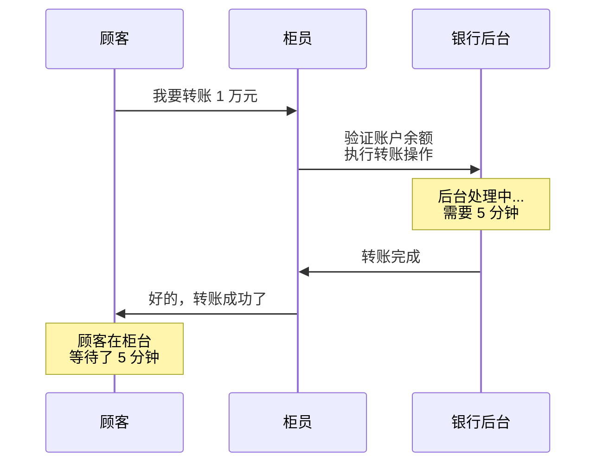

这种方式的问题很明显：

- 顾客必须站在柜台前等待，浪费时间
- 柜员被占住，无法服务其他顾客
- 如果后台系统故障，整个业务就卡住了

**消息队列就像银行叫号系统**：

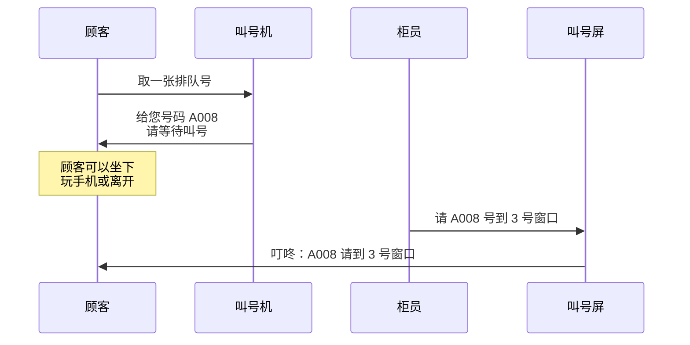

使用消息队列的优势：

- **异步处理**：顾客不用一直等，可以做其他事情
- **削峰填谷**：高峰期时，订单可以先排队，厨师按能力处理
- **解耦系统**：窗口阿姨和厨师可以独立工作，互不影响

### 2. Kafka 是什么？

**一句话概括**：Apache Kafka 是一个分布式流处理平台，最初由 LinkedIn 开发，后来贡献给了 Apache。

Kafka 就像一个**超级智能的消息快递系统**：

| 特性 | 传统 MQ（如 RabbitMQ） | Kafka |
|------|---------------------|-------|
| **消息存储** | 消费后即删除 | 持久化存储，可回溯 |
| **吞吐量** | 万级/秒 | 百万级/秒 |
| **消息回溯** | 不支持 | 支持 |
| **流式处理** | 不支持 | 原生支持 |
| **适用场景** | 传统业务解耦 | 日志收集、实时流处理 |

### 3. Kafka 的应用场景

#### 场景 1：日志收集系统

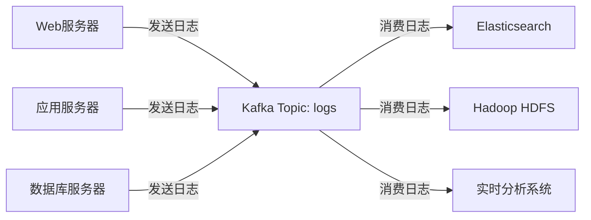

**传统方式的问题**：

- 每个服务器都要连接多个日志存储系统
- 日志存储系统故障会影响业务系统
- 难以统一管理和监控

**使用 Kafka 后**：

- 所有服务只需把日志发送到 Kafka
- 日志存储系统按需消费，互不影响
- 可以随时增加新的日志消费方

#### 场景 2：用户行为实时分析

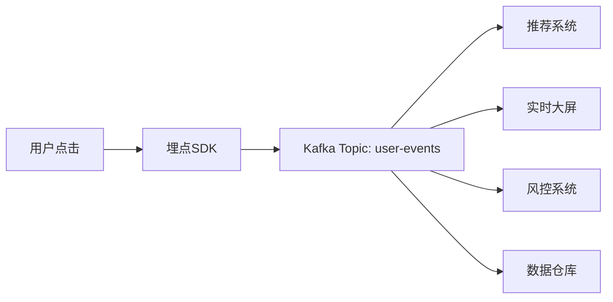

#### 场景 3：微服务异步通信

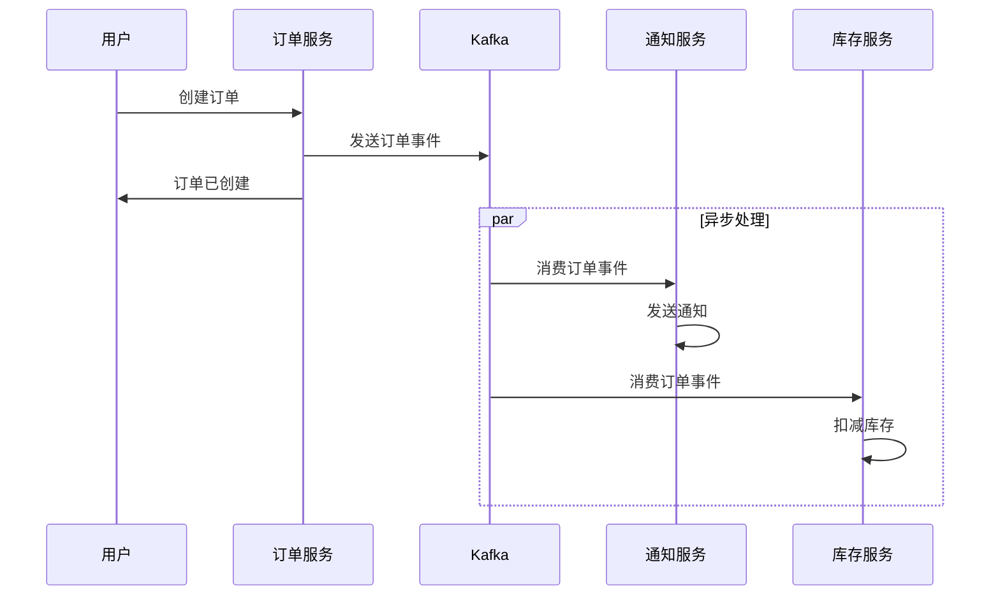

### 4. 今天我们要实现什么？

在这篇文章结束时，你将掌握：

```bash
# 启动 Kafka 集群（KRaft 模式）
docker-compose -f docker-compose-kraft.yml up -d

# 创建 Topic
docker exec -it kafka-kraft /usr/bin/kafka-topics \
  --create \
  --topic quickstart-events \
  --bootstrap-server kafka:9092 \
  --partitions 3 \
  --replication-factor 1

# 使用 Go 发送消息
go run producer.go
# Output: Message delivered to topic quickstart-events [0] at offset 0

# 使用 Go 消费消息
go run consumer.go
# Output: Message on quickstart-events [0] @ 0: Hello Kafka from Go!
```

**实实在在的收获**：

- 理解 Kafka 的核心概念和架构
- 掌握 ZooKeeper 模式 vs KRaft 模式的区别
- 能够独立搭建 Kafka 开发环境
- 学会使用 Go 语言编写生产者和消费者
- 理解 Kafka 的应用场景和最佳实践

---

## 二、Kafka 核心概念详解

### 1. Kafka 架构概览

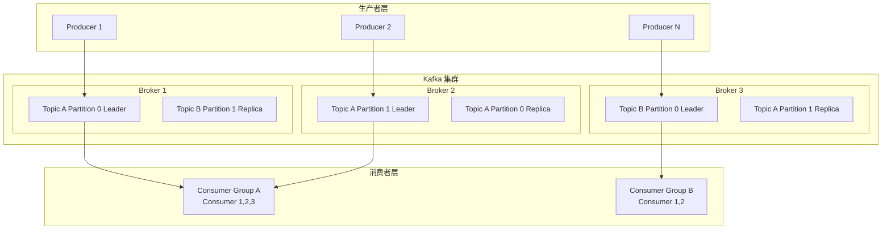

### 2. 核心组件说明

#### Producer（生产者）

**角色**：消息的发送方

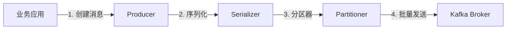

**生产者的工作流程**：

1. **创建消息**：封装 Key-Value 对
2. **序列化**：将对象转换为字节数组
3. **分区**：根据 Key 或轮询策略选择分区
4. **压缩**：可选的压缩（gzip、snappy、lz4、zstd）
5. **批量发送**：累积一批消息后发送

#### Consumer（消费者）

**角色**：消息的接收方

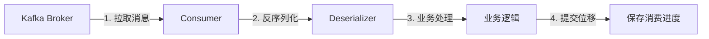

**消费者的重要概念**：

- **Consumer Group（消费者组）**：多个消费者组成一个组，共同消费一个 Topic
- **Offset（位移）**：记录消费者消费到的位置
- **Rebalance（再平衡）**：组内消费者变化时，分区重新分配

#### Broker（代理服务器）

**角色**：Kafka 集群中的服务节点

每个 Broker 的职责：

| 职责 | 说明 |
|------|------|
| **存储消息** | 持久化到磁盘，支持配置保留时间 |
| **处理请求** | 生产者发送、消费者拉取 |
| **分区管理** | Leader 读写，Follower 只同步 |
| **副本同步** | 保证数据可靠性 |

#### Topic（主题）

**定义**：消息的分类，类似数据库中的表

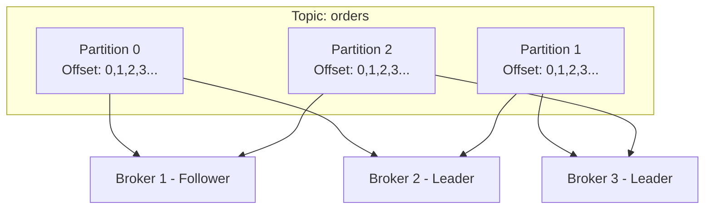

**Topic 的命名规范**：

```bash
# 好的命名
orders           # 订单主题
user-events      # 用户事件主题
logs-application # 应用日志主题

# 不好的命名
topic1           # 无意义
data             # 太泛
ORDER_DATA       # 不要用大写
```

#### Partition（分区）

**作用**：

- **水平扩展**：一个 Topic 可以分布在多个 Broker 上
- **并行处理**：多个消费者可以并行消费不同分区
- **提高吞吐**：单机吞吐量有限，分区可以突破限制

**分区中的消息结构**：

```
Partition 0:
┌──────┬──────┬──────┬──────┬──────┐
│ Off  │ Off  │ Off  │ Off  │ Off  │
│  0   │  1   │  2   │  3   │  4   │
├──────┼──────┼──────┼──────┼──────┤
│ Msg1 │ Msg2 │ Msg3 │ Msg4 │ Msg5 │
└──────┴──────┴──────┴──────┴──────┘
```

**消息写入分区的顺序**：

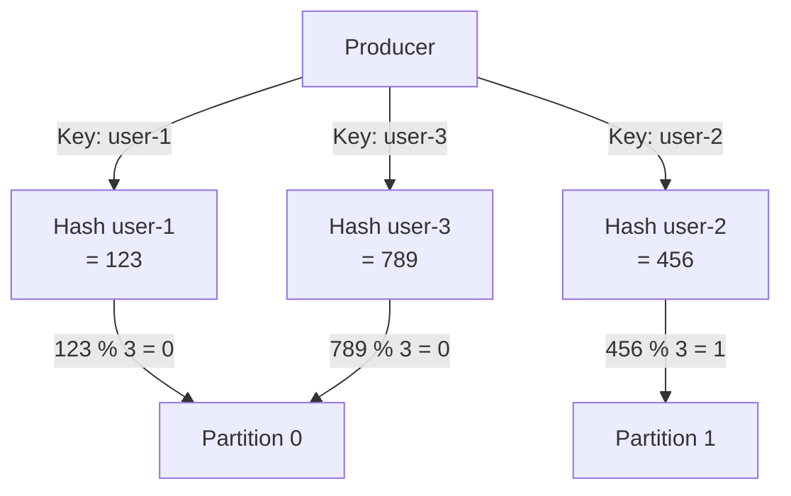

> **重要**：相同 Key 的消息总是发送到同一个分区，保证顺序性

#### Replica（副本）

**目的**：保证数据高可用

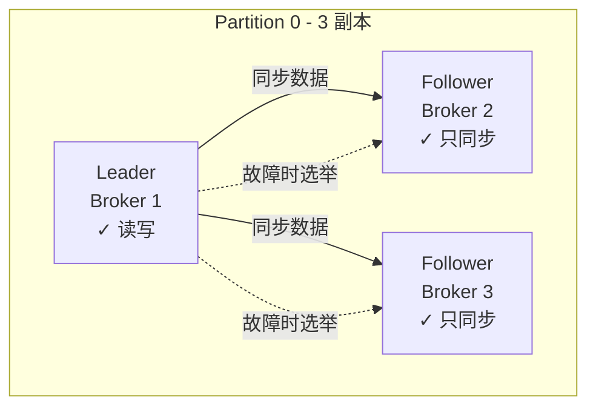

**副本角色**：

| 角色 | 职责 | 是否提供服务 |
|------|------|------------|
| **Leader** | 处理读写请求 | 是 |
| **Follower** | 同步 Leader 数据 | 否（Leader 故障后才可能升级） |

**ISR（In-Sync Replicas）**：与 Leader 保持同步的副本集合

---

## 三、Kafka 部署模式：ZooKeeper vs KRaft

### 1. ZooKeeper 模式（传统模式）

ZooKeeper 模式是 Kafka 的传统部署方式，在 Kafka 2.8 之前的版本中是唯一的选择。

#### 架构特点

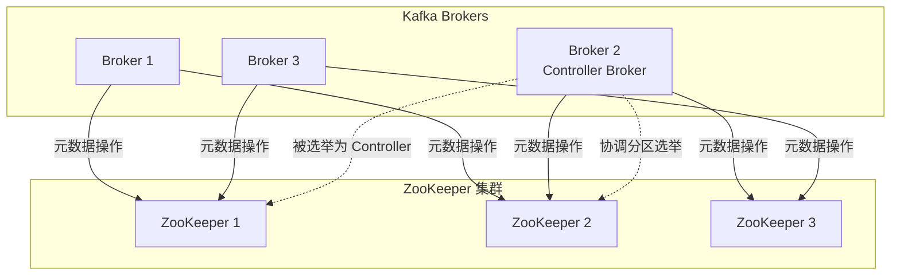

#### 工作原理

**ZooKeeper 的作用**：

| 作用 | 说明 |
|------|------|
| **Controller 选举** | 从集群中选举出一个 Broker 作为 Controller |
| **元数据管理** | 存储 Topic、Partition、Broker 等元数据信息 |
| **分区 Leader 选举** | 分区 Leader 故障时，通过 ZooKeeper 协议选举新的 Leader |
| **配置管理** | 管理配额配置、ACL 权限等 |
| **成员管理** | 监控 Broker 的加入和退出 |

**Broker 角色分离**：

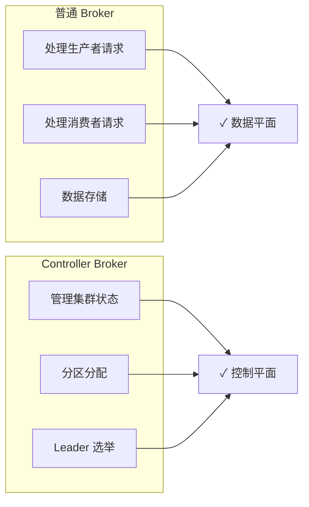

#### 优点与缺点

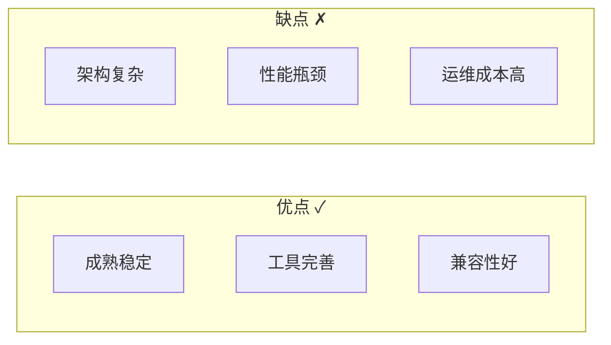

### 2. KRaft 模式（Kafka Raft 模式）

KRaft 模式是 Kafka 2.8 版本引入的重大改进，在 Kafka 3.0 版本正式可用，并在 Kafka 3.3+ 版本达到生产可用。

#### 架构特点

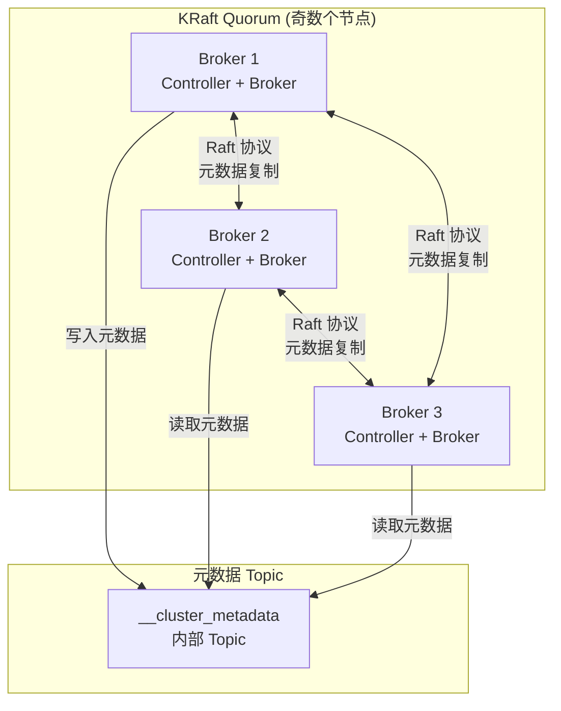

#### 工作原理

**Raft 协议核心概念**：

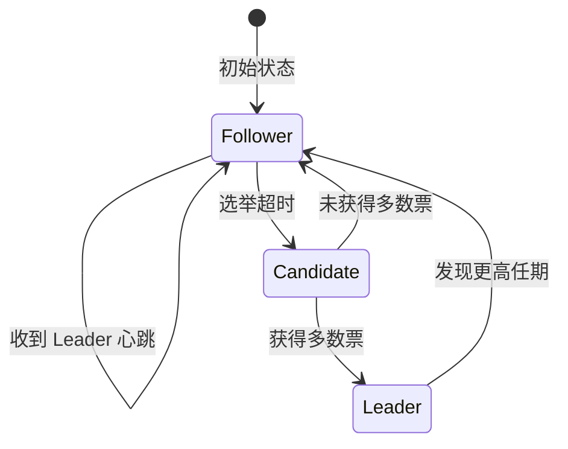

**Quorum Controller（仲裁控制器）**：

| 概念 | 说明 |
|------|------|
| **Quorum** | 参与元数据投票的 Broker 集合（通常是 3、5、7 个） |
| **Controller Broker** | 既参与元数据管理，又处理客户端请求 |
| **Broker-only** | 只处理客户端请求，不参与元数据管理 |

**元数据存储变化**：

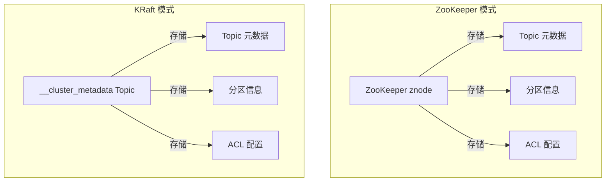

#### 优点与缺点

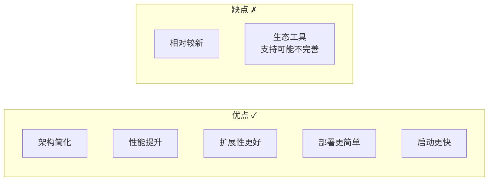

### 3. 对比总结

| 特性 | ZooKeeper 模式 | KRaft 模式 |
|------|---------------|-----------|
| **Kafka 版本** | 所有版本 | 2.8+ (生产可用: 3.3+) |
| **外部依赖** | 需要 ZooKeeper 集群 | 无需外部依赖 |
| **架构复杂度** | 复杂（两套系统） | 简单（单一系统） |
| **部署难度** | 较高 | 较低 |
| **Controller 选举** | 通过 ZooKeeper | 通过 Raft 协议 |
| **元数据存储** | ZooKeeper | 内部 Topic |
| **元数据操作延迟** | 较高（ZooKeeper 网络往返） | 较低（内部 RPC） |
| **支持的分区数** | 受 ZooKeeper 性能限制 | 支持更多分区 |
| **工具成熟度** | 非常成熟 | 快速完善中 |

### 4. 什么时候使用哪种模式？

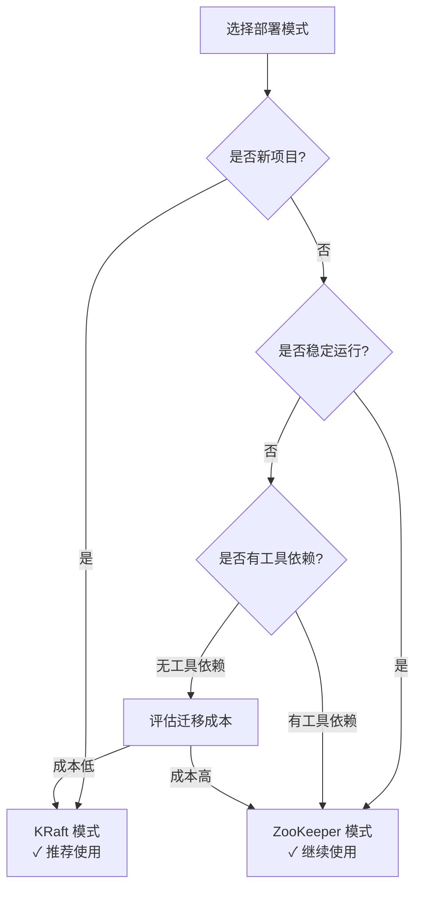

**使用 ZooKeeper 模式的场景**：

1. **现有生产环境**：已经在使用 ZooKeeper 模式的稳定系统
2. **工具依赖**：依赖需要 ZooKeeper 的运维工具或监控系统
3. **保守策略**：对新架构持观望态度，希望 KRaft 模式更加成熟
4. **兼容性需求**：需要与旧版本 Kafka 互操作

**使用 KRaft 模式的场景**：

1. **新部署的项目**：从零开始搭建的新 Kafka 集群
2. **简化运维**：希望减少维护的组件数量
3. **大规模部署**：需要支持更多的分区和更快的元数据操作
4. **云原生环境**：在容器化、Kubernetes 环境中部署
5. **未来规划**：KRaft 是 Kafka 未来的发展方向，官方推荐新项目使用

**迁移建议**：

- **新项目**：直接使用 KRaft 模式（推荐 Kafka 3.3+ 版本）
- **现有项目**：可以继续使用 ZooKeeper 模式，等待合适的时机迁移

---

## 四、环境搭建：Docker 快速启动

### 1. 前置条件

确保你的系统已安装：

```bash
# 检查 Docker 版本
$ docker --version
Docker version 28.4.0, build d8eb465
# 推荐版本：20.10+

# 检查 Docker Compose 版本
$ docker compose version
Docker Compose version v2.39.2-desktop.1
# 推荐版本：2.30+

# 检查 Go 版本
$ go version
go version go1.25.3 darwin/arm64
# 本教程使用 Go 1.25.3
```

### 2. ZooKeeper 模式部署（了解即可）

> ⚠️ 注意：新项目建议使用 KRaft 模式，这里仅供参考

**docker-compose-zookeeper.yml**：

```yaml
version: '3'
services:
  zookeeper:
    image: confluentinc/cp-zookeeper:7.5.0
    hostname: zookeeper
    container_name: zookeeper
    ports:
      - "2181:2181"
    environment:
      ZOOKEEPER_CLIENT_PORT: 2181
      ZOOKEEPER_TICK_TIME: 2000
    volumes:
      - zk-data:/var/lib/zookeeper/data
      - zk-logs:/var/lib/zookeeper/log

  kafka:
    image: confluentinc/cp-kafka:7.5.0
    hostname: kafka
    container_name: kafka
    depends_on:
      - zookeeper
    ports:
      - "9092:9092"
      - "9101:9101"
    environment:
      KAFKA_BROKER_ID: 1
      KAFKA_ZOOKEEPER_CONNECT: 'zookeeper:2181'
      KAFKA_LISTENER_SECURITY_PROTOCOL_MAP: PLAINTEXT:PLAINTEXT,PLAINTEXT_HOST:PLAINTEXT
      KAFKA_ADVERTISED_LISTENERS: PLAINTEXT://kafka:29092,PLAINTEXT_HOST://localhost:9092
      KAFKA_OFFSETS_TOPIC_REPLICATION_FACTOR: 1
      KAFKA_TRANSACTION_STATE_LOG_MIN_ISR: 1
      KAFKA_TRANSACTION_STATE_LOG_REPLICATION_FACTOR: 1
      KAFKA_GROUP_INITIAL_REBALANCE_DELAY_MS: 0
      KAFKA_JMX_PORT: 9101
      KAFKA_JMX_HOSTNAME: localhost
    volumes:
      - kafka-data:/var/lib/kafka/data

volumes:
  zk-data:
  zk-logs:
  kafka-data:
```

**启动命令**：

```bash
# 启动 ZooKeeper 模式集群
docker-compose -f docker-compose-zookeeper.yml up -d

# 查看日志
docker-compose -f docker-compose-zookeeper.yml logs -f kafka

# 停止集群
docker-compose -f docker-compose-zookeeper.yml down
```

### 3. KRaft 单节点部署（开发环境推荐）

**docker-compose-kraft.yml**：

```yaml
services:
  kafka:
    image: confluentinc/cp-kafka:7.5.0
    hostname: kafka
    container_name: kafka-kraft
    ports:
      - "9092:9092"
      - "9093:9093"
    environment:
      # === 基础配置 ===
      KAFKA_NODE_ID: 1
      # KRaft 模式必需的集群 ID（Confluent 镜像使用 CLUSTER_ID 而非 KAFKA_CLUSTER_ID）
      CLUSTER_ID: 'MkU3OEVBNTcwNTJENDM2Qk'

      # === 角色配置 ===
      # broker: 处理客户端请求
      # controller: 参与元数据管理
      KAFKA_PROCESS_ROLES: 'broker,controller'

      # === Controller 配置 ===
      # 单节点模式，quorum voters 只有一个
      KAFKA_CONTROLLER_QUORUM_VOTERS: '1@kafka:9093'

      # === 监听器配置 ===
      KAFKA_LISTENERS: 'PLAINTEXT://kafka:9092,CONTROLLER://kafka:9093'
      KAFKA_ADVERTISED_LISTENERS: 'PLAINTEXT://kafka:9092'
      KAFKA_CONTROLLER_LISTENER_NAMES: 'CONTROLLER'
      KAFKA_INTER_BROKER_LISTENER_NAME: 'PLAINTEXT'

      # === 安全协议 ===
      KAFKA_LISTENER_SECURITY_PROTOCOL_MAP: 'CONTROLLER:PLAINTEXT,PLAINTEXT:PLAINTEXT'

      # === Topic 配置 ===
      # 默认副本因子（单节点只能设为 1）
      KAFKA_DEFAULT_REPLICATION_FACTOR: 1
      KAFKA_OFFSETS_TOPIC_REPLICATION_FACTOR: 1
      KAFKA_TRANSACTION_STATE_LOG_MIN_ISR: 1
      KAFKA_TRANSACTION_STATE_LOG_REPLICATION_FACTOR: 1

      # === 性能优化 ===
      # 关闭初始再平衡延迟
      KAFKA_GROUP_INITIAL_REBALANCE_DELAY_MS: 0

      # === 日志配置 ===
      KAFKA_LOG_DIRS: '/var/lib/kafka/data'
    volumes:
      - kafka-kraft-data:/var/lib/kafka/data
    # 单节点模式需要特殊的健康检查
    healthcheck:
      test: ["CMD", "kafka-broker-api-versions", "--bootstrap-server", "localhost:9092"]
      interval: 10s
      timeout: 10s
      retries: 5

volumes:
  kafka-kraft-data:
```

**启动命令**：

```bash
# 启动 KRaft 单节点集群
docker-compose -f docker-compose-kraft.yml up -d

# 查看启动日志
docker-compose -f docker-compose-kraft.yml logs -f kafka

# 等待看到 "Recorded new controller" 表示启动成功
```

**验证集群状态**：

```bash
# 查看元数据目录（KRaft 模式会显示 cluster.id 和 node.id）
docker exec kafka-kraft kafka-storage info --config /etc/kafka/kafka.properties

# 输出示例：
# Found log directory:
#   /var/lib/kafka/data
#
# Found metadata: {cluster.id=MkU3OEVBNTcwNTJENDM2Qg, node.id=1, version=1}

# 生成新的随机 Cluster ID（用于创建新集群时）
docker exec kafka-kraft kafka-storage random-uuid
```

### 4. KRaft 三节点集群（生产推荐）

**docker-compose-kraft-cluster.yml**：

```yaml
# 自定义网络
networks:
  kafka-kraft-net:
    driver: bridge

services:
  # === Kafka 节点 1 ===
  kafka1:
    image: confluentinc/cp-kafka:7.5.0
    hostname: kafka1
    container_name: kafka1
    ports:
      - "19092:9092"
      - "19093:9093"
    environment:
      KAFKA_NODE_ID: 1
      # KRaft 模式必需的集群 ID（所有节点必须使用相同的 CLUSTER_ID）
      CLUSTER_ID: 'MkU3OEVBNTcwNTJENDM2Qk'
      KAFKA_PROCESS_ROLES: 'broker,controller'

      # 三节点 Quorum，每个节点都要声明所有 voters
      # 格式: node-id@host:controller-port
      KAFKA_CONTROLLER_QUORUM_VOTERS: '1@kafka1:9093,2@kafka2:9093,3@kafka3:9093'

      KAFKA_LISTENERS: 'PLAINTEXT://kafka1:9092,CONTROLLER://kafka1:9093'
      KAFKA_ADVERTISED_LISTENERS: 'PLAINTEXT://localhost:19092'
      KAFKA_CONTROLLER_LISTENER_NAMES: 'CONTROLLER'
      KAFKA_INTER_BROKER_LISTENER_NAME: 'PLAINTEXT'
      KAFKA_LISTENER_SECURITY_PROTOCOL_MAP: 'CONTROLLER:PLAINTEXT,PLAINTEXT:PLAINTEXT'

      KAFKA_DEFAULT_REPLICATION_FACTOR: 3
      KAFKA_OFFSETS_TOPIC_REPLICATION_FACTOR: 3
      KAFKA_TRANSACTION_STATE_LOG_MIN_ISR: 2
      KAFKA_TRANSACTION_STATE_LOG_REPLICATION_FACTOR: 3
      KAFKA_GROUP_INITIAL_REBALANCE_DELAY_MS: 0

      KAFKA_LOG_DIRS: '/var/lib/kafka/data'
    volumes:
      - kafka1-data:/var/lib/kafka/data
    networks:
      - kafka-kraft-net

  # === Kafka 节点 2 ===
  kafka2:
    image: confluentinc/cp-kafka:7.5.0
    hostname: kafka2
    container_name: kafka2
    ports:
      - "19094:9092"
      - "19095:9093"
    environment:
      KAFKA_NODE_ID: 2
      CLUSTER_ID: 'MkU3OEVBNTcwNTJENDM2Qk'
      KAFKA_PROCESS_ROLES: 'broker,controller'
      KAFKA_CONTROLLER_QUORUM_VOTERS: '1@kafka1:9093,2@kafka2:9093,3@kafka3:9093'

      KAFKA_LISTENERS: 'PLAINTEXT://kafka2:9092,CONTROLLER://kafka2:9093'
      KAFKA_ADVERTISED_LISTENERS: 'PLAINTEXT://localhost:19094'
      KAFKA_CONTROLLER_LISTENER_NAMES: 'CONTROLLER'
      KAFKA_INTER_BROKER_LISTENER_NAME: 'PLAINTEXT'
      KAFKA_LISTENER_SECURITY_PROTOCOL_MAP: 'CONTROLLER:PLAINTEXT,PLAINTEXT:PLAINTEXT'

      KAFKA_DEFAULT_REPLICATION_FACTOR: 3
      KAFKA_OFFSETS_TOPIC_REPLICATION_FACTOR: 3
      KAFKA_TRANSACTION_STATE_LOG_MIN_ISR: 2
      KAFKA_TRANSACTION_STATE_LOG_REPLICATION_FACTOR: 3
      KAFKA_GROUP_INITIAL_REBALANCE_DELAY_MS: 0

      KAFKA_LOG_DIRS: '/var/lib/kafka/data'
    volumes:
      - kafka2-data:/var/lib/kafka/data
    networks:
      - kafka-kraft-net

  # === Kafka 节点 3 ===
  kafka3:
    image: confluentinc/cp-kafka:7.5.0
    hostname: kafka3
    container_name: kafka3
    ports:
      - "19096:9092"
      - "19097:9093"
    environment:
      KAFKA_NODE_ID: 3
      CLUSTER_ID: 'MkU3OEVBNTcwNTJENDM2Qk'
      KAFKA_PROCESS_ROLES: 'broker,controller'
      KAFKA_CONTROLLER_QUORUM_VOTERS: '1@kafka1:9093,2@kafka2:9093,3@kafka3:9093'

      KAFKA_LISTENERS: 'PLAINTEXT://kafka3:9092,CONTROLLER://kafka3:9093'
      KAFKA_ADVERTISED_LISTENERS: 'PLAINTEXT://localhost:19096'
      KAFKA_CONTROLLER_LISTENER_NAMES: 'CONTROLLER'
      KAFKA_INTER_BROKER_LISTENER_NAME: 'PLAINTEXT'
      KAFKA_LISTENER_SECURITY_PROTOCOL_MAP: 'CONTROLLER:PLAINTEXT,PLAINTEXT:PLAINTEXT'

      KAFKA_DEFAULT_REPLICATION_FACTOR: 3
      KAFKA_OFFSETS_TOPIC_REPLICATION_FACTOR: 3
      KAFKA_TRANSACTION_STATE_LOG_MIN_ISR: 2
      KAFKA_TRANSACTION_STATE_LOG_REPLICATION_FACTOR: 3
      KAFKA_GROUP_INITIAL_REBALANCE_DELAY_MS: 0

      KAFKA_LOG_DIRS: '/var/lib/kafka/data'
    volumes:
      - kafka3-data:/var/lib/kafka/data
    networks:
      - kafka-kraft-net

  # === Kafka UI（可选的 Web 管理界面） ===
  kafka-ui:
    image: provectuslabs/kafka-ui:latest
    container_name: kafka-ui
    depends_on:
      - kafka1
      - kafka2
      - kafka3
    ports:
      - "8080:8080"
    environment:
      # 配置集群信息
      KAFKA_CLUSTERS_0_NAME: local-kraft-cluster
      KAFKA_CLUSTERS_0_BOOTSTRAPSERVERS: kafka1:9092,kafka2:9092,kafka3:9092
      KAFKA_CLUSTERS_0_ZOOKEEPER_CONNECT: ''  # KRaft 模式不需要
    networks:
      - kafka-kraft-net

volumes:
  kafka1-data:
  kafka2-data:
  kafka3-data:
```

**启动命令**：

```bash
# 启动三节点集群
docker-compose -f docker-compose-kraft-cluster.yml up -d

# 查看所有节点状态
docker-compose -f docker-compose-kraft-cluster.yml ps

# 查看 Controller 选举日志
docker-compose -f docker-compose-kraft-cluster.yml logs kafka1 | grep -i controller
```

**访问 Kafka UI**：

启动成功后，访问 `http://localhost:8080`，你将看到：

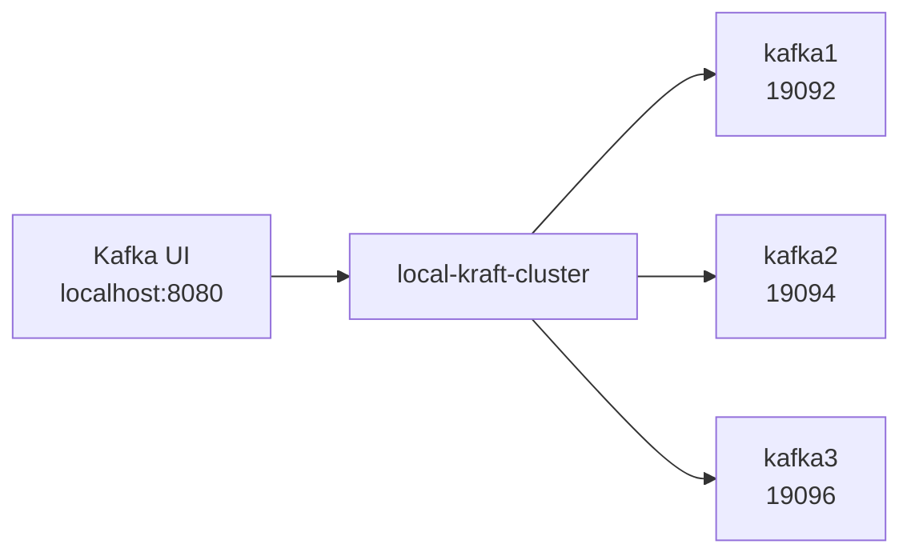

---

## 五、Kafka 基础命令操作

### 1. Topic 管理

```bash
# 进入 Kafka 容器
docker exec -it kafka-kraft bash

# === 创建 Topic ===
kafka-topics --create \
  --topic quickstart-events \
  --bootstrap-server kafka:9092 \
  --partitions 3 \
  --replication-factor 1

# 参数说明：
# --topic: Topic 名称
# --partitions: 分区数量
# --replication-factor: 副本因子（不能超过 Broker 数量）

# === 列出所有 Topic ===
kafka-topics --list --bootstrap-server localhost:9092

# 输出：
# __cluster_metadata  # KRaft 内部元数据 Topic
# quickstart-events

# === 查看 Topic 详情 ===
kafka-topics --describe \
  --topic quickstart-events \
  --bootstrap-server localhost:9092

# 输出示例：
# Topic: quickstart-events  TopicId: <id>  PartitionCount: 3  ReplicationFactor: 1
#     Topic: quickstart-events  Partition: 0  Leader: 1  Replicas: 1  Isr: 1
#     Topic: quickstart-events  Partition: 1  Leader: 1  Replicas: 1  Isr: 1
#     Topic: quickstart-events  Partition: 2  Leader: 1  Replicas: 1  Isr: 1

# 字段说明：
# Partition: 分区编号
# Leader: 该分区的 Leader Broker ID
# Replicas: 所有副本的 Broker ID 列表
# Isr: In-Sync Replicas，与 Leader 保持同步的副本

# === 修改 Topic 分区数 ===
# 注意：分区数只能增加，不能减少
kafka-topics --alter \
  --topic quickstart-events \
  --bootstrap-server localhost:9092 \
  --partitions 5

# === 删除 Topic ===
kafka-topics --delete \
  --topic quickstart-events \
  --bootstrap-server localhost:9092
```

### 2. 消息生产与消费

```bash
# === 生产消息（交互式） ===
kafka-console-producer \
  --topic quickstart-events \
  --bootstrap-server localhost:9092

# 然后输入消息（每行一条）：
# > Hello Kafka
# > This is a test
# > 使用 Ctrl+C 退出

# === 生产消息（非交互式） ===
echo "Hello from command line" | kafka-console-producer \
  --topic quickstart-events \
  --bootstrap-server localhost:9092

# === 消费消息（从最新开始） ===
kafka-console-consumer \
  --topic quickstart-events \
  --bootstrap-server localhost:9092

# === 消费消息（从头开始） ===
kafka-console-consumer \
  --topic quickstart-events \
  --from-beginning \
  --bootstrap-server localhost:9092

# === 消费指定分区 ===
kafka-console-consumer \
  --topic quickstart-events \
  --partition 0 \
  --bootstrap-server localhost:9092

# === 消费者组模式 ===
# 终端 1：启动消费者组
kafka-console-consumer \
  --topic quickstart-events \
  --group my-group \
  --bootstrap-server localhost:9092

# 终端 2：查看消费者组详情
kafka-consumer-groups \
  --bootstrap-server localhost:9092 \
  --group my-group \
  --describe

# 输出示例：
# GROUP           TOPIC               PARTITION  CURRENT-OFFSET  LOG-END-OFFSET  LAG
# my-group        quickstart-events   0          5               5               0
# my-group        quickstart-events   1          3               3               0
# my-group        quickstart-events   2          7               7               0

# 字段说明：
# CURRENT-OFFSET: 当前消费位移
# LOG-END-OFFSET: 最新消息位移
# LAG: 消费延迟（LOG-END-OFFSET - CURRENT-OFFSET）
```

### 3. 消费者组管理

```bash
# === 列出所有消费者组 ===
kafka-consumer-groups \
  --bootstrap-server localhost:9092 \
  --list

# === 查看消费者组详情 ===
kafka-consumer-groups \
  --bootstrap-server localhost:9092 \
  --group my-group \
  --describe

# === 重置消费位移 ===
# 场景：想重新消费所有消息
kafka-consumer-groups \
  --bootstrap-server localhost:9092 \
  --group my-group \
  --reset-offsets \
  --to-earliest \
  --execute \
  --topic quickstart-events

# === 删除消费者组 ===
kafka-consumer-groups \
  --bootstrap-server localhost:9092 \
  --group my-group \
  --delete
```

---

## 六、Go 客户端开发实战

### 1. 环境准备

```bash
# 创建项目目录
mkdir kafka-demo
cd kafka-demo

# 初始化 Go Module（Go 1.25.3）
go mod init github.com/yourusername/kafka-demo

# 安装 confluent-kafka-go
# 注意：confluent-kafka-go 依赖 librdkafka，需要先安装系统依赖
go get -u github.com/confluentinc/confluent-kafka-go/v2/kafka
```

**系统依赖安装**：

```bash
# macOS
brew install librdkafka

# Ubuntu/Debian
sudo apt-get install -y librdkafka-dev

# CentOS/RHEL
sudo yum install -y librdkafka-devel
```

### 2. 项目结构

```bash
kafka-demo/
├── go.mod
├── go.sum
├── producer/
│   └── main.go           # 生产者示例
├── consumer/
│   └── main.go           # 消费者示例
└── config/
    └── config.go         # 配置文件
```

### 3. 配置管理

**config/config.go**：

```go
package config

import "time"

// Config Kafka 配置
type Config struct {
	// BootstrapServers Kafka 集群地址
	BootstrapServers string

	// Topic 默认 Topic
	Topic string

	// GroupID 消费者组 ID
	GroupID string
}

// DefaultConfig 返回默认配置
func DefaultConfig() *Config {
	return &Config{
		BootstrapServers: "localhost:9092",
		Topic:           "quickstart-events",
		GroupID:         "demo-group",
	}
}

// ProducerConfig 生产者配置
type ProducerConfig struct {
	*Config

	// Acks 确认级别: 0, 1, all
	Acks string

	// CompressionType 压缩类型: none, gzip, snappy, lz4, zstd
	CompressionType string

	// LingerMs 等待时间（毫秒）
	LingerMs int

	// BatchSize 批量大小（字节）
	BatchSize int

	// RetryTimes 重试次数
	RetryTimes int

	// Timeout 超时时间
	Timeout time.Duration
}

// DefaultProducerConfig 返回默认生产者配置
func DefaultProducerConfig() *ProducerConfig {
	return &ProducerConfig{
		Config:          DefaultConfig(),
		Acks:            "all",
		CompressionType: "snappy",
		LingerMs:        10,
		BatchSize:       16384,
		RetryTimes:      3,
		Timeout:         30 * time.Second,
	}
}

// ConsumerConfig 消费者配置
type ConsumerConfig struct {
	*Config

	// AutoOffsetReset 位移重置策略: earliest, latest, none
	AutoOffsetReset string

	// EnableAutoCommit 是否自动提交位移
	EnableAutoCommit bool

	// AutoCommitIntervalMs 自动提交间隔（毫秒）
	AutoCommitIntervalMs int

	// SessionTimeoutMs 会话超时（毫秒）
	SessionTimeoutMs int

	// HeartbeatIntervalMs 心跳间隔（毫秒）
	HeartbeatIntervalMs int
}

// DefaultConsumerConfig 返回默认消费者配置
func DefaultConsumerConfig() *ConsumerConfig {
	return &ConsumerConfig{
		Config:               DefaultConfig(),
		AutoOffsetReset:      "earliest",
		EnableAutoCommit:     true,
		AutoCommitIntervalMs: 5000,
		SessionTimeoutMs:     30000,
		HeartbeatIntervalMs:  3000,
	}
}
```

### 4. 生产者实现

**producer/main.go**：

```go
package main

import (
	"fmt"
	"os"
	"os/signal"
	"syscall"

	"github.com/confluentinc/confluent-kafka-go/v2/kafka"
	"github.com/yourusername/kafka-demo/config"
)

func main() {
	// 加载配置
	cfg := config.DefaultProducerConfig()

	// 创建生产者
	p, err := kafka.NewProducer(&kafka.ConfigMap{
		"bootstrap.servers":  cfg.BootstrapServers,
		"acks":               cfg.Acks,
		"compression.type":   cfg.CompressionType,
		"linger.ms":          cfg.LingerMs,
		"batch.size":         cfg.BatchSize,
		"retries":            cfg.RetryTimes,
		"request.timeout.ms": int(cfg.Timeout.Milliseconds()),
		"enable.idempotence": true, // 启用幂等性
	})
	if err != nil {
		fmt.Printf("创建生产者失败: %v\n", err)
		os.Exit(1)
	}
	defer p.Close()

	fmt.Printf("Kafka 生产者已启动，连接到: %s\n", cfg.BootstrapServers)
	fmt.Printf("Topic: %s\n", cfg.Topic)
	fmt.Printf("Acks: %s, Compression: %s\n", cfg.Acks, cfg.CompressionType)

	// 创建 delivery channel 用于接收发送结果
	deliveryChan := make(chan kafka.Event, 10000)

	// 处理信号，优雅退出
	sigchan := make(chan os.Signal, 1)
	signal.Notify(sigchan, syscall.SIGINT, syscall.SIGTERM)

	// 示例 1：发送简单消息
	go func() {
		for i := 0; i < 10; i++ {
			key := fmt.Sprintf("key-%d", i)
			value := fmt.Sprintf("Hello Kafka! Message #%d from Go 1.25.3", i)

			err := p.Produce(&kafka.Message{
				TopicPartition: kafka.TopicPartition{
					Topic:     &cfg.Topic,
					Partition: kafka.PartitionAny,
				},
				Key:   []byte(key),
				Value: []byte(value),
			}, deliveryChan)

			if err != nil {
				fmt.Printf("发送失败: %v\n", err)
			}
		}
	}()

	// 示例 2：发送 JSON 消息
	go func() {
		user := map[string]interface{}{
			"id":       "user-123",
			"name":     "张三",
			"email":    "zhangsan@example.com",
			"age":      25,
			"action":   "login",
			"timestamp": "2024-01-15T10:30:00Z",
		}

		// 简单的 JSON 序列化（生产环境建议使用 encoding/json）
		jsonStr := fmt.Sprintf(
			`{"id":"%s","name":"%s","email":"%s","age":%d,"action":"%s","timestamp":"%s"}`,
			user["id"], user["name"], user["email"], user["age"],
			user["action"], user["timestamp"],
		)

		p.Produce(&kafka.Message{
			TopicPartition: kafka.TopicPartition{
				Topic:     &cfg.Topic,
				Partition: kafka.PartitionAny,
			},
			Key:   []byte(user["id"].(string)),
			Value: []byte(jsonStr),
		}, deliveryChan)
	}()

	// 处理发送结果
	run := true
	remaining := 11
	for run && remaining > 0 {
		select {
		case <-sigchan:
			fmt.Println("\n收到退出信号，正在停止...")
			run = false

		case ev := <-deliveryChan:
			switch e := ev.(type) {
			case *kafka.Message:
				if e.TopicPartition.Error != nil {
					fmt.Printf("发送失败 [%s]: %v\n",
						e.TopicPartition, e.TopicPartition.Error)
				} else {
					fmt.Printf("发送成功: Topic=%s, Partition=%d, Offset=%d, Key=%s\n",
						*e.TopicPartition.Topic,
						e.TopicPartition.Partition,
						e.TopicPartition.Offset,
						string(e.Key))
				}
				remaining--
			}
		}
	}

	// 等待所有消息发送完成
	remaining = p.Flush(15 * 1000)
	if remaining > 0 {
		fmt.Printf("还有 %d 条消息未发送完成\n", remaining)
	}

	close(deliveryChan)
	fmt.Println("生产者已关闭")
}
```

### 5. 消费者实现

**consumer/main.go**：

```go
package main

import (
	"context"
	"fmt"
	"log"
	"os"
	"os/signal"
	"sync"
	"syscall"
	"time"

	"github.com/confluentinc/confluent-kafka-go/v2/kafka"
	"github.com/yourusername/kafka-demo/config"
)

func main() {
	// 加载配置
	cfg := config.DefaultConsumerConfig()

	// 创建消费者
	c, err := kafka.NewConsumer(&kafka.ConfigMap{
		"bootstrap.servers":        cfg.BootstrapServers,
		"group.id":                 cfg.GroupID,
		"auto.offset.reset":        cfg.AutoOffsetReset,
		"enable.auto.commit":       cfg.EnableAutoCommit,
		"auto.commit.interval.ms":  cfg.AutoCommitIntervalMs,
		"session.timeout.ms":       cfg.SessionTimeoutMs,
		"heartbeat.interval.ms":    cfg.HeartbeatIntervalMs,
	})
	if err != nil {
		fmt.Printf("创建消费者失败: %v\n", err)
		os.Exit(1)
	}
	defer c.Close()

	fmt.Printf("Kafka 消费者已启动，连接到: %s\n", cfg.BootstrapServers)
	fmt.Printf("Topic: %s, Group: %s\n", cfg.Topic, cfg.GroupID)
	fmt.Printf("AutoOffsetReset: %s\n", cfg.AutoOffsetReset)

	// 订阅 Topic
	topics := []string{cfg.Topic}
	err = c.SubscribeTopics(topics, rebalanceCallback)
	if err != nil {
		fmt.Printf("订阅 Topic 失败: %v\n", err)
		os.Exit(1)
	}

	// 创建上下文，用于优雅退出
	ctx, cancel := context.WithCancel(context.Background())
	defer cancel()

	// 处理信号
	sigchan := make(chan os.Signal, 1)
	signal.Notify(sigchan, syscall.SIGINT, syscall.SIGTERM)

	// 使用 WaitGroup 等待所有处理完成
	var wg sync.WaitGroup

	// 消费消息
	run := true
	for run {
		select {
		case <-sigchan:
			fmt.Println("\n收到退出信号，正在停止...")
			run = false
			cancel()

		case <-ctx.Done():
			run = false

		default:
			// 读取消息，超时 100ms
			msg, err := c.ReadMessage(100 * time.Millisecond)
			if err != nil {
				// 忽略超时错误
				if err.(kafka.Error).Code() == kafka.ErrTimedOut {
					continue
				}
				log.Printf("读取消息错误: %v", err)
				continue
			}

			// 异步处理消息
			wg.Add(1)
			go func(m *kafka.Message) {
				defer wg.Done()
				processMessage(ctx, m)
			}(msg)
		}
	}

	// 等待所有消息处理完成
	wg.Wait()
	fmt.Println("消费者已关闭")
}

// rebalanceCallback 处理再平衡事件
func rebalanceCallback(c *kafka.Consumer, event kafka.Event) error {
	switch e := event.(type) {
	case kafka.AssignedPartitions:
		fmt.Printf("✓ 分配分区: %v\n", e.Partitions)
		// 可以在这里执行一些初始化操作

	case kafka.RevokedPartitions:
		fmt.Printf("✗ 撤销分区: %v\n", e.Partitions)
		// 在分区被撤销前提交位移
		c.Commit()
	}
	return nil
}

// processMessage 处理消息
func processMessage(ctx context.Context, msg *kafka.Message) {
	// 检查上下文是否已取消
	select {
	case <-ctx.Done():
		return
	default:
	}

	// 打印消息基本信息
	fmt.Printf("\n--- 收到消息 ---\n")
	fmt.Printf("Topic: %s\n", *msg.TopicPartition.Topic)
	fmt.Printf("Partition: %d\n", msg.TopicPartition.Partition)
	fmt.Printf("Offset: %d\n", msg.TopicPartition.Offset)
	fmt.Printf("Key: %s\n", string(msg.Key))

	// 打印消息内容
	fmt.Printf("Value: %s\n", string(msg.Value))

	// 打印时间戳（如果有）
	if !msg.Timestamp.IsZero() {
		fmt.Printf("Timestamp: %s\n", msg.Timestamp.UTC().Format(time.RFC3339))
	}

	// 打印 Headers（如果有）
	if len(msg.Headers) > 0 {
		fmt.Printf("Headers:\n")
		for _, h := range msg.Headers {
			fmt.Printf("  %s: %s\n", h.Key, string(h.Value))
		}
	}

	// 模拟业务处理
	time.Sleep(100 * time.Millisecond)

	fmt.Printf("--- 处理完成 ---\n\n")
}
```

### 6. 运行示例

```bash
# 终端 1：启动消费者
go run consumer/main.go

# 终端 2：启动生产者
go run producer/main.go
```

**预期输出**：

**生产端**：

```
Kafka 生产者已启动，连接到: localhost:9092
Topic: quickstart-events
Acks: all, Compression: snappy
发送成功: Topic=quickstart-events, Partition=0, Offset=0, Key=key-0
发送成功: Topic=quickstart-events, Partition=1, Offset=0, Key=key-1
发送成功: Topic=quickstart-events, Partition=2, Offset=0, Key=key-2
...
发送成功: Topic=quickstart-events, Partition=0, Offset=3, Key=user-123
```

**消费端**：

```
Kafka 消费者已启动，连接到: localhost:9092
Topic: quickstart-events, Group: demo-group
✓ 分配分区: [quickstart-events[0] quickstart-events[1] quickstart-events[2]]

--- 收到消息 ---
Topic: quickstart-events
Partition: 0
Offset: 0
Key: key-0
Value: Hello Kafka! Message #0 from Go
--- 处理完成 ---
```

### 7. 高级用法示例

#### 7.1 带 Headers 的消息

```go
// producer/advanced.go
package main

import (
	"fmt"
	"time"

	"github.com/confluentinc/confluent-kafka-go/v2/kafka"
)

func produceWithHeaders() {
	p, _ := kafka.NewProducer(&kafka.ConfigMap{
		"bootstrap.servers": "localhost:9092",
	})
	defer p.Close()

	topic := "quickstart-events"

	headers := []kafka.Header{
		{Key: "content-type", Value: []byte("application/json")},
		{Key: "producer-id", Value: []byte("producer-1")},
		{Key: "trace-id", Value: []byte("abc-123-def")},
		{Key: "timestamp", Value: []byte(time.Now().Format(time.RFC3339))},
	}

	p.Produce(&kafka.Message{
		TopicPartition: kafka.TopicPartition{
			Topic:     &topic,
			Partition: kafka.PartitionAny,
		},
		Key:     []byte("message-with-headers"),
		Value:   []byte(`{"status":"success","data":"test"}`),
		Headers: headers,
	}, nil)

	p.Flush(15 * 1000)
}
```

#### 7.2 指定分区发送

```go
// producer/assign_partition.go
package main

import (
	"fmt"

	"github.com/confluentinc/confluent-kafka-go/v2/kafka"
)

func produceToSpecificPartition() {
	p, _ := kafka.NewProducer(&kafka.ConfigMap{
		"bootstrap.servers": "localhost:9092",
	})
	defer p.Close()

	topic := "quickstart-events"

	// 方式 1：直接指定分区号
	p.Produce(&kafka.Message{
		TopicPartition: kafka.TopicPartition{
			Topic:     &topic,
			Partition: 0, // 指定分区 0
		},
		Key:   []byte("explicit-partition"),
		Value: []byte("This message goes to partition 0"),
	}, nil)

	// 方式 2：让 Kafka 自动选择（基于 Key 的哈希）
	p.Produce(&kafka.Message{
		TopicPartition: kafka.TopicPartition{
			Topic:     &topic,
			Partition: kafka.PartitionAny, // 自动选择
		},
		Key:   []byte("user-123"), // 相同 Key 总是分配到同一分区
		Value: []byte("User 123 data"),
	}, nil)

	p.Flush(15 * 1000)
}
```

#### 7.3 手动提交位移

```go
// consumer/manual_commit.go
package main

import (
	"fmt"
	"time"

	"github.com/confluentinc/confluent-kafka-go/v2/kafka"
)

func consumeWithManualCommit() {
	// 禁用自动提交
	c, _ := kafka.NewConsumer(&kafka.ConfigMap{
		"bootstrap.servers": "localhost:9092",
		"group.id":          "manual-commit-group",
		"auto.offset.reset": "earliest",
		"enable.auto.commit": "false", // 禁用自动提交
	})
	defer c.Close()

	c.SubscribeTopics([]string{"quickstart-events"}, nil)

	for {
		msg, err := c.ReadMessage(100 * time.Millisecond)
		if err != nil {
			continue
		}

		// 处理消息
		fmt.Printf("处理消息: %s\n", string(msg.Value))

		// 模拟处理失败
		if string(msg.Value) == "error" {
			fmt.Println("处理失败，不提交位移")
			continue // 不提交，下次重新消费
		}

		// 处理成功，提交位移
		// 方式 1：同步提交当前消息的位移
		_, err = c.CommitMessage(msg)
		if err != nil {
			fmt.Printf("提交失败: %v\n", err)
		}
	}
}
```

---

## 八、常见问题与解决方案

### 1. 连接问题

```bash
# 问题：连接超时
# Error: kafka: client has run out of available brokers

# 解决方案：
# 1. 检查 Kafka 是否正常运行
docker ps | grep kafka

# 2. 检查端口是否正确
docker exec -it kafka-kraft cat /etc/kafka/server.properties | grep listeners

# 3. 检查防火墙
telnet localhost 9092

# 4. 检查 ADVERTISED_LISTENERS 配置
# 确保客户端能访问到 advertised 地址
```

### 2. 消费者找不到分区

```bash
# 问题：消费者组重新分配分区时卡住

# 解决方案：
# 1. 增加会话超时时间
"session.timeout.ms": 60000,  # 60 秒
"heartbeat.interval.ms": 10000,  # 10 秒

# 2. 检查 max.poll.interval.ms
# 如果消息处理时间过长，需要增加这个值
"max.poll.interval.ms": 300000,  # 5 分钟
```

### 3. 生产者性能问题

```bash
# 问题：发送速度慢

# 解决方案：
# 1. 启用压缩
"compression.type": "lz4",  # 或 "snappy", "zstd"

# 2. 增加批量大小
"batch.size": 32768,  # 32KB

# 3. 增加 linger 时间
"linger.ms": 20,  # 等待 20ms

# 4. 调整缓冲区
"buffer.memory": 67108864,  # 64MB
```

### 4. 消息丢失问题

```bash
# 问题：消息可能丢失

# 解决方案：
# 1. 设置 acks=all（等待所有副本确认）
"acks": "all",

# 2. 启用幂等性
"enable.idempotence": true,

# 3. 设置最小同步副本数
# 在 Broker 配置中：
# min.insync.replicas=2

# 4. 增加重试次数
"retries": 10,
```

---

## 九、今日总结

### 1. 核心概念回顾

```mermaid
mindmap
  root((Kafka Day 1))
    核心概念
      Producer 生产者
      Consumer 消费者
      Broker 代理
      Topic 主题
      Partition 分区
      Replica 副本
    部署模式
      ZooKeeper 模式
        依赖外部 ZooKeeper
        成熟稳定
        运维复杂
      KRaft 模式
        无外部依赖
        性能更好
        推荐新项目使用
    Go 开发
      confluent-kafka-go
      Producer API
      Consumer API
      配置管理
```

### 2. 练习

1. **基础练习**
   - 创建一个名为 `user-events` 的 Topic，包含 5 个分区
   - 使用 Go 生产者发送 100 条消息
   - 使用 Go 消费者消费这些消息
   - 观察消息在不同分区的分布

2. **进阶练习**
   - 实现 JSON 序列化/反序列化
   - 添加消息 Headers，记录 trace-id
   - 实现手动提交位移
   - 测试消费者再平衡（启动多个消费者）

3. **挑战练习**
   - 实现一个简单的日志收集系统
   - 使用多个 Topic 分离不同类型的日志
   - 实现消息的重试机制
   - 监控消费延迟（LAG）

### 3. 下节预告

在 **Day 2**，我们将深入探索：

- 生产者的三种发送方式（发后即忘、同步、异步）
- 序列化器（JSON、Avro、Protobuf）
- 自定义分区器
- 生产者性能调优

---

## 十、参考资料

- [Apache Kafka 官方文档](https://kafka.apache.org/documentation/)
- [confluent-kafka-go 文档](https://docs.confluent.io/platform/current/clients/confluent-kafka-go/index.html)
- [KRaft 模式介绍](https://developer.confluent.io/learn-kafka/kraft/)

> 本文档基于 Kafka 3.5+ 版本和 Go 1.25.3 编写
> 如有问题，欢迎随时提问交流！
