# Kafka 生产者详解

> 本系列文章参考 Apache Kafka 官方文档整理，面向 Go 语言开发者
> 学习目标：深入理解 Kafka 生产者的工作原理与最佳实践

## 一、开篇引入：生产者的职责

### 1. 生产者的角色定位

还记得第一天我们学习的消息队列叫号系统吗？

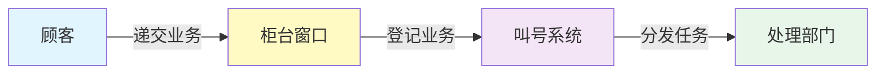
```mermaid
graph LR
    A[顾客] -->|递交业务| B[柜台窗口]
    B -->|登记业务| C[叫号系统]
    C -->|分发任务| D[处理部门]

    style A fill:#e1f5fe
    style B fill:#fff9c4
    style C fill:#f3e5f5
    style D fill:#e8f5e9
```

**Kafka 生产者就像是柜台窗口**：

| 柜台窗口 | Kafka 生产者 |
|---------|-------------|
| 接收顾客业务 | 接收应用数据 |
| 登记到系统 | 发送到 Kafka |
| 给顾客回执 | 返回发送结果 |
| 处理特殊要求 | 处理分区、压缩等 |

### 2. 生产者的核心职责

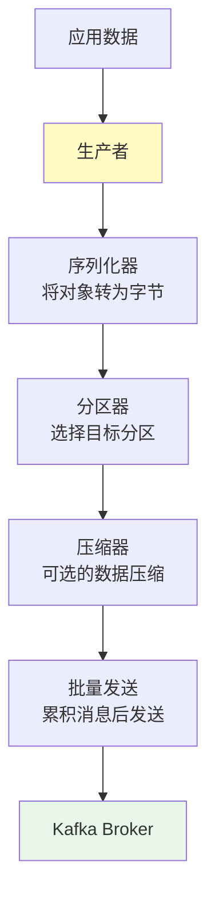
```mermaid
graph TB
    A[应用数据] --> B[生产者]

    B --> C[序列化器<br/>将对象转为字节]
    C --> D[分区器<br/>选择目标分区]
    D --> E[压缩器<br/>可选的数据压缩]
    E --> F[批量发送<br/>累积消息后发送]
    F --> G[Kafka Broker]

    style B fill:#fff9c4
    style G fill:#e8f5e9
```

**生产者的五大职责**：

| 职责 | 说明 | 配置参数 |
|------|------|---------|
| **序列化** | 将对象转换为字节数组 | `key.serializer`、`value.serializer` |
| **分区** | 选择消息发送到哪个分区 | `partitioner.class` |
| **压缩** | 减少网络传输和存储开销 | `compression.type` |
| **批量发送** | 累积多条消息一起发送 | `batch.size`、`linger.ms` |
| **确认机制** | 控制消息可靠性级别 | `acks` |

### 3. 今天我们要实现什么？

在这篇文章结束时，你将掌握：

```bash
# 三种发送方式
# 方式1：发后即忘（最快，可能丢数据）
producer.Produce(msg, nil)

# 方式2：同步发送（等待确认）
deliveryChan := make(chan kafka.Event)
producer.Produce(msg, deliveryChan)
event := <-deliveryChan

# 方式3：异步发送（带回调）
for msg := range messages {
    producer.Produce(msg, deliveryChan)
}
// 后续处理 deliveryChan 中的事件

# 自定义分区器
"partitioner": "murmur2"  // Java 兼容
"partitioner": "consistent"  // 一致性分区

# 性能调优配置
"acks": "all",
"compression.type": "zstd",
"linger.ms": 20,
"batch.size": 32768
```

---

## 二、生产者工作原理与架构

### 1. 生产者内部架构

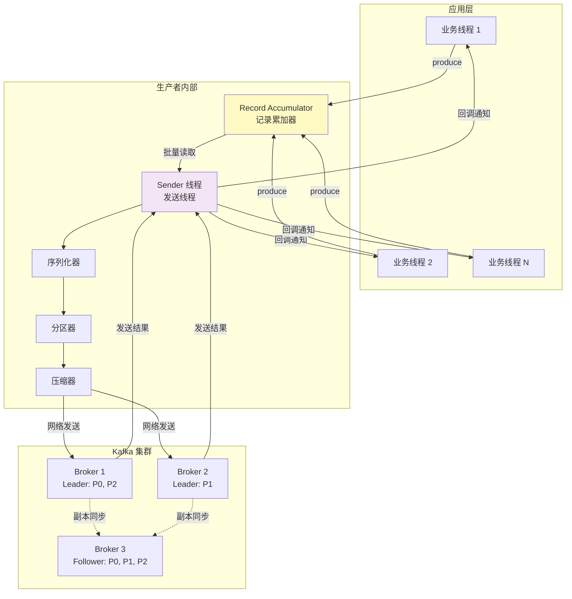
```mermaid
graph TB
    subgraph "应用层"
        A[业务线程 1]
        B[业务线程 2]
        C[业务线程 N]
    end

    subgraph "生产者内部"
        D[Record Accumulator<br/>记录累加器]
        E[Sender 线程<br/>发送线程]
        F[序列化器]
        G[分区器]
        H[压缩器]
    end

    subgraph "Kafka 集群"
        I1[Broker 1<br/>Leader: P0, P2]
        I2[Broker 2<br/>Leader: P1]
        I3[Broker 3<br/>Follower: P0, P1, P2]
    end

    A -->| produce | D
    B -->| produce | D
    C -->| produce | D

    D -->|批量读取| E
    E --> F
    F --> G
    G --> H
    H -->|网络发送| I1
    H -->|网络发送| I2

    I1 -.->|副本同步| I3
    I2 -.->|副本同步| I3

    I1 -->|发送结果| E
    I2 -->|发送结果| E
    E -->|回调通知| A
    E -->|回调通知| B
    E -->|回调通知| C

    style D fill:#fff9c4
    style E fill:#f3e5f5
```

**核心组件说明**：

| 组件 | 职责 | 线程模型 |
|------|------|---------|
| **Record Accumulator** | 缓冲待发送的消息，按分区分组 | 主线程写入 |
| **Sender** | 从 Accumulator 读取批量消息并发送 | 独立 IO 线程 |
| **Serializer** | 序列化 Key 和 Value | 主线程 |
| **Partitioner** | 选择目标分区 | 主线程 |
| **Compressor** | 压缩批量消息 | Sender 线程 |

### 2. 消息发送流程

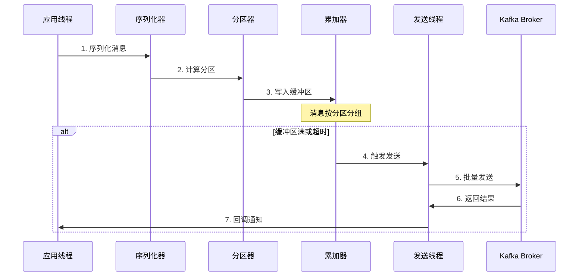
```mermaid
sequenceDiagram
    participant App as 应用线程
    participant Ser as 序列化器
    participant Part as 分区器
    participant Accu as 累加器
    participant Sender as 发送线程
    participant Broker as Kafka Broker

    App->>Ser: 1. 序列化消息
    Ser->>Part: 2. 计算分区
    Part->>Accu: 3. 写入缓冲区
    Note over Accu: 消息按分区分组

    alt 缓冲区满或超时
        Accu->>Sender: 4. 触发发送
        Sender->>Broker: 5. 批量发送
        Broker->>Sender: 6. 返回结果
        Sender->>App: 7. 回调通知
    end
```

**关键参数控制**：

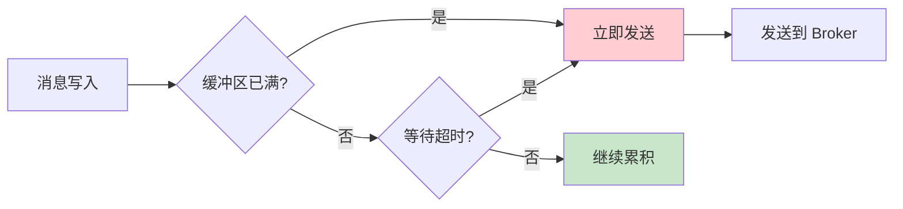
```mermaid
graph LR
    A[消息写入] --> B{缓冲区已满?}
    B -->|是| C[立即发送]
    B -->|否| D{等待超时?}

    D -->|是| C
    D -->|否| E[继续累积]

    C --> F[发送到 Broker]

    style C fill:#ffcdd2
    style E fill:#c8e6c9
```

**批量发送条件**（满足任一即发送）：

| 条件 | 参数 | 默认值 | 说明 |
|------|------|--------|------|
| **缓冲区满** | `batch.size` | 16384 字节 | 达到批次大小 |
| **等待超时** | `linger.ms` | 0 毫秒 | 等待时间到 |

### 3. 生产者线程模型

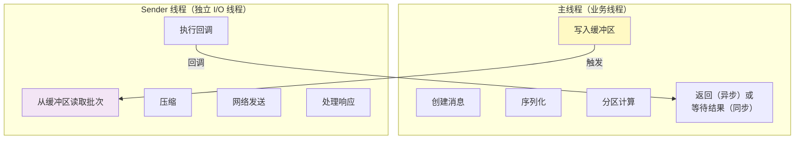
```mermaid
graph TB
    subgraph "主线程（业务线程）"
        direction TB
        A1[创建消息]
        A2[序列化]
        A3[分区计算]
        A4[写入缓冲区]
        A5[返回（异步）或<br/>等待结果（同步）]
    end

    subgraph "Sender 线程（独立 I/O 线程）"
        direction TB
        B1[从缓冲区读取批次]
        B2[压缩]
        B3[网络发送]
        B4[处理响应]
        B5[执行回调]
    end

    A4 -->|触发| B1
    B5 -->|回调| A5

    style A4 fill:#fff9c4
    style B1 fill:#f3e5f5
```

**线程安全保证**：

- `Producer` 实例是线程安全的
- 可以在多个 goroutine 中共享同一个 `Producer`
- `Producer` 内部使用锁保证并发安全

---

## 三、核心配置参数详解

### 1. 可靠性相关配置

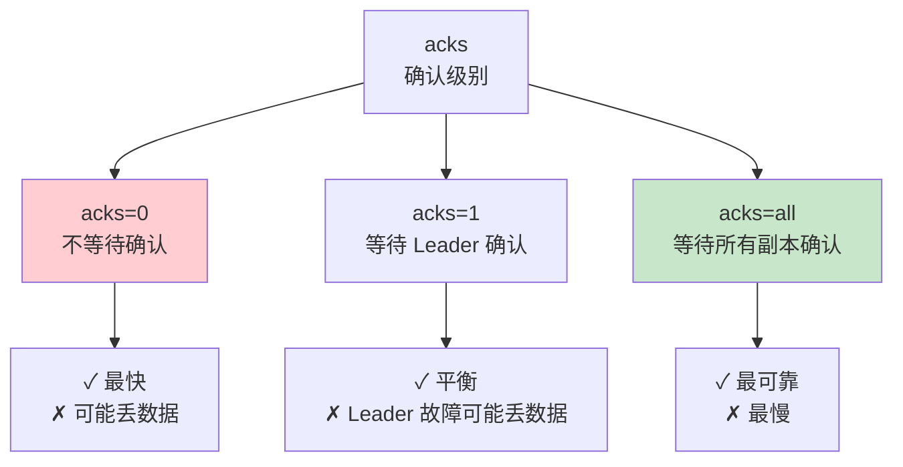
```mermaid
graph TB
    A[acks<br/>确认级别] --> B1[acks=0<br/>不等待确认]
    A --> B2[acks=1<br/>等待 Leader 确认]
    A --> B3[acks=all<br/>等待所有副本确认]

    B1 --> C1[✓ 最快<br/>✗ 可能丢数据]
    B2 --> C2[✓ 平衡<br/>✗ Leader 故障可能丢数据]
    B3 --> C3[✓ 最可靠<br/>✗ 最慢]

    style B3 fill:#c8e6c9
    style B1 fill:#ffcdd2
```

#### acks（确认级别）

| 值 | 说明 | 可靠性 | 性能 | 适用场景 |
|-----|------|-------|------|---------|
| **0** | 发送后不等待确认 | 最低 | 最高 | 日志收集、可容忍数据丢失 |
| **1** | 等待 Leader 确认 | 中等 | 中等 | 大多数业务场景 |
| **all/-1** | 等待所有 ISR 副本确认 | 最高 | 最低 | 金融、支付等核心业务 |

**acks 工作原理**：

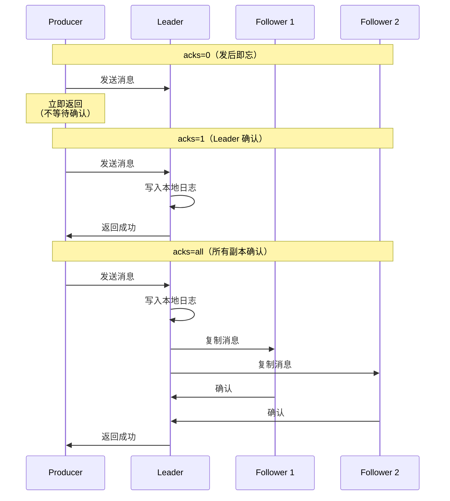
```mermaid
sequenceDiagram
    participant P as Producer
    participant L as Leader
    participant F1 as Follower 1
    participant F2 as Follower 2

    Note over P,F2: acks=0（发后即忘）
    P->>L: 发送消息
    Note over P: 立即返回<br/>（不等待确认）

    Note over P,F2: acks=1（Leader 确认）
    P->>L: 发送消息
    L->>L: 写入本地日志
    L->>P: 返回成功

    Note over P,F2: acks=all（所有副本确认）
    P->>L: 发送消息
    L->>L: 写入本地日志
    L->>F1: 复制消息
    L->>F2: 复制消息
    F1->>L: 确认
    F2->>L: 确认
    L->>P: 返回成功
```

#### enable.idempotence（幂等性）

**作用**：保证消息不重复，即使重试也只会写入一条

```go
// 启用幂等性（推荐）
p, _ := kafka.NewProducer(&kafka.ConfigMap{
    "bootstrap.servers":  "localhost:9092",
    "enable.idempotence": true,  // 启用幂等性
    // 幂等性会自动设置以下参数：
    // "acks": "all"
    // "retries": 2147483647（无限重试）
    // "max.in.flight.requests.per.connection": 5
})
```

**幂等性原理**：

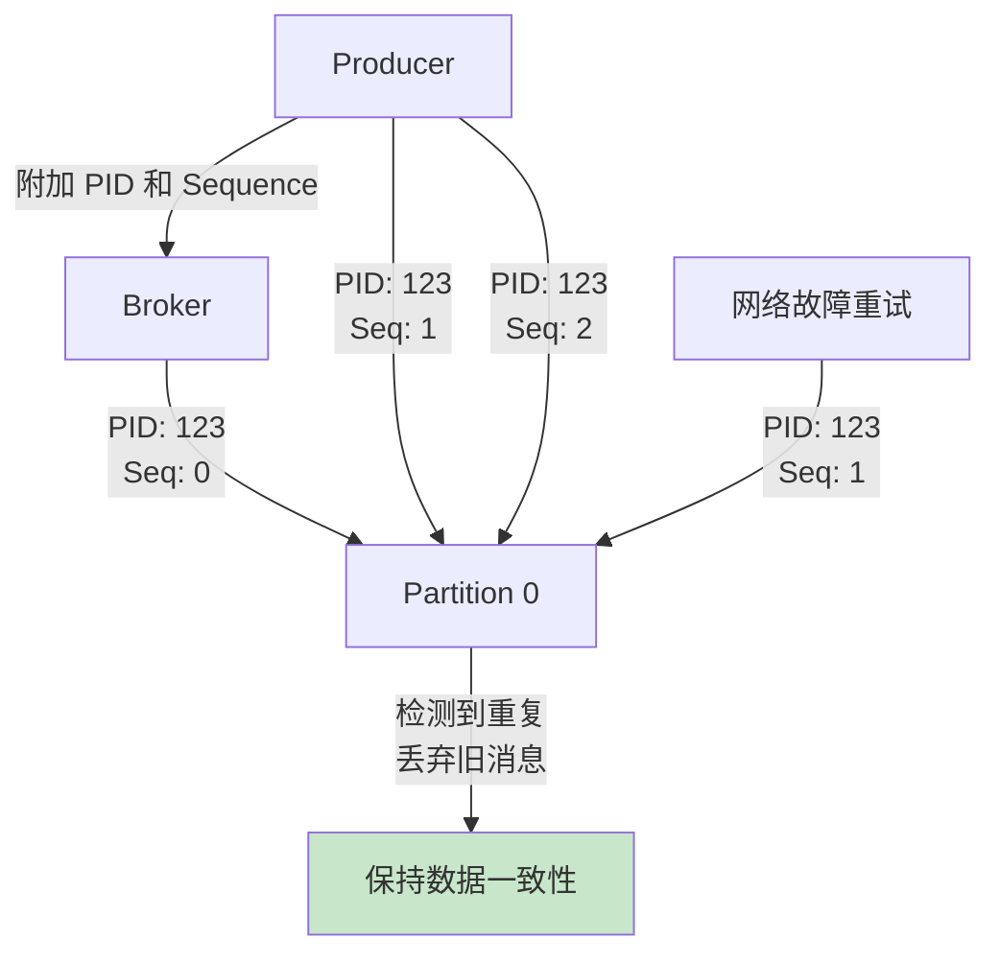
```mermaid
graph TB
    A[Producer] -->|附加 PID 和 Sequence| B[Broker]
    B -->|PID: 123<br/>Seq: 0| C[Partition 0]
    A -->|PID: 123<br/>Seq: 1| C
    A -->|PID: 123<br/>Seq: 2| C

    D[网络故障重试] -->|PID: 123<br/>Seq: 1| C
    C -->|检测到重复<br/>丢弃旧消息| E[保持数据一致性]

    style E fill:#c8e6c9
```

| 配置 | 说明 | 自动配置的值 |
|------|------|-------------|
| `enable.idempotence` | 启用幂等性 | `true` |
| `acks` | 确认级别 | `"all"` |
| `retries` | 重试次数 | `2147483647`（Integer.MAX_VALUE） |
| `max.in.flight.requests.per.connection` | 最大未确认请求数 | `5` |

### 2. 性能相关配置

#### compression.type（压缩算法）

| 算法 | 压缩比 | CPU 开销 | 速度 | 适用场景 |
|-----|-------|---------|------|---------|
| **none** | 1:1 | 最低 | 最快 | 测试、低延迟场景 |
| **gzip** | 3:1 | 高 | 慢 | 带宽受限、存储受限 |
| **snappy** | 2:1 | 低 | 快 | 平衡性能和压缩 |
| **lz4** | 2.5:1 | 低 | 最快 | 高吞吐量场景 |
| **zstd** | 3.5:1 | 中 | 中 | 新项目推荐 |

**压缩效果对比**：

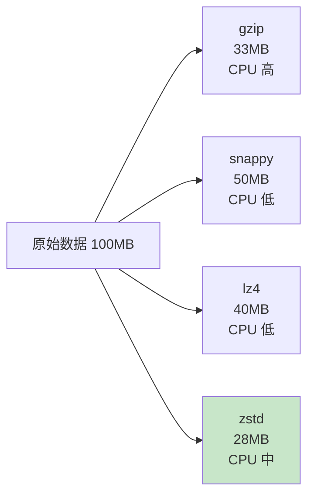
```mermaid
graph LR
    A[原始数据 100MB] --> B1[gzip<br/>33MB<br/>CPU 高]
    A --> B2[snappy<br/>50MB<br/>CPU 低]
    A --> B3[lz4<br/>40MB<br/>CPU 低]
    A --> B4[zstd<br/>28MB<br/>CPU 中]

    style B4 fill:#c8e6c9
```

**使用建议**：

```go
// 推荐配置（生产环境）
p, _ := kafka.NewProducer(&kafka.ConfigMap{
    "bootstrap.servers": "localhost:9092",
    "compression.type":  "zstd",  // 最佳压缩比和性能平衡
    // 或
    "compression.type":  "lz4",   // 最低 CPU 开销
})
```

#### batch.size 和 linger.ms

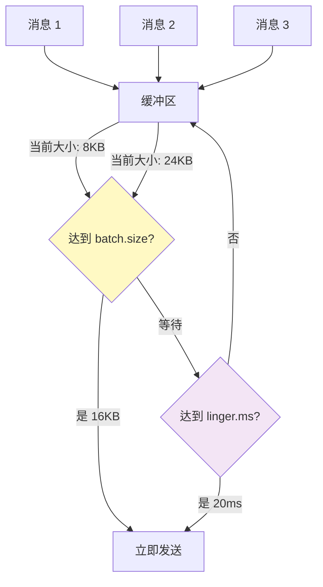
```mermaid
graph TB
    A[消息 1] --> B[缓冲区]
    B -->|当前大小: 8KB| C{达到 batch.size?}

    D[消息 2] --> B
    E[消息 3] --> B
    B -->|当前大小: 24KB| C

    C -->|是 16KB| F[立即发送]
    C -->|等待| G{达到 linger.ms?}

    G -->|是 20ms| F
    G -->|否| B

    style C fill:#fff9c4
    style G fill:#f3e5f5
```

| 参数 | 默认值 | 说明 | 调优建议 |
|------|--------|------|---------|
| `batch.size` | 16384 字节（16KB） | 批量发送大小 | 增加可提高吞吐量，但会增加延迟 |
| `linger.ms` | 0 毫秒 | 等待时间 | 增加可让更多消息累积，提高吞吐量 |

**调优示例**：

```go
// 高吞吐量配置（牺牲延迟）
p, _ := kafka.NewProducer(&kafka.ConfigMap{
    "bootstrap.servers": "localhost:9092",
    "batch.size":        65536,   // 64KB
    "linger.ms":         50,      // 50ms
})

// 低延迟配置（牺牲吞吐量）
p, _ := kafka.NewProducer(&kafka.ConfigMap{
    "bootstrap.servers": "localhost:9092",
    "batch.size":        8192,    // 8KB
    "linger.ms":         0,       // 立即发送
})
```

#### buffer.memory（缓冲区大小）

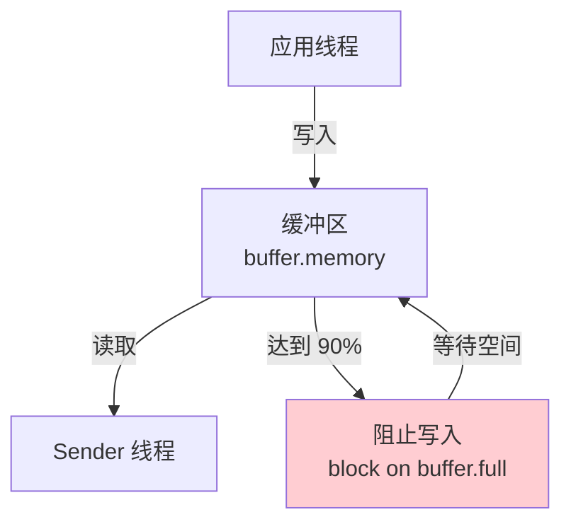
```mermaid
graph TB
    A[应用线程] -->|写入| B[缓冲区<br/>buffer.memory]
    B -->|读取| C[Sender 线程]

    B -->|达到 90%| D[阻止写入<br/>block on buffer.full]
    D -->|等待空间| B

    style D fill:#ffcdd2
```

| 参数 | 默认值 | 说明 |
|------|--------|------|
| `buffer.memory` | 33554432 字节（32MB） | 生产者可用的缓冲区总大小 |

**配置建议**：

```go
// 大缓冲区（高吞吐量场景）
p, _ := kafka.NewProducer(&kafka.ConfigMap{
    "bootstrap.servers": "localhost:9092",
    "buffer.memory":     67108864,  // 64MB
})

// 小缓冲区（内存受限场景）
p, _ := kafka.NewProducer(&kafka.ConfigMap{
    "bootstrap.servers": "localhost:9092",
    "buffer.memory":     16777216,  // 16MB
})
```

### 3. 超时与重试配置

| 参数 | 默认值 | 说明 |
|------|--------|------|
| `request.timeout.ms` | 30000 毫秒（30秒） | 单次请求超时时间 |
| `retries` | 2147483647（启用幂等性时） | 重试次数 |
| `retry.backoff.ms` | 100 毫秒 | 重试间隔 |

```go
// 超时配置示例
p, _ := kafka.NewProducer(&kafka.ConfigMap{
    "bootstrap.servers":    "localhost:9092",
    "request.timeout.ms":   10000,     // 10 秒超时
    "retries":              3,          // 重试 3 次
    "retry.backoff.ms":     200,       // 重试间隔 200ms
})
```

---

## 四、生产者三种发送方式

### 1. 发后即忘（Fire-and-Forget）

**特点**：最快，但不保证消息送达

```go
package main

import (
    "fmt"
    "github.com/confluentinc/confluent-kafka-go/v2/kafka"
)

func main() {
    p, _ := kafka.NewProducer(&kafka.ConfigMap{
        "bootstrap.servers": "localhost:9092",
    })
    defer p.Close()

    topic := "quickstart-events"

    // 发后即忘：不等待确认
    for i := 0; i < 10; i++ {
        err := p.Produce(&kafka.Message{
            TopicPartition: kafka.TopicPartition{
                Topic:     &topic,
                Partition: kafka.PartitionAny,
            },
            Key:   []byte(fmt.Sprintf("key-%d", i)),
            Value: []byte(fmt.Sprintf("Fire-and-Forget message %d", i)),
        }, nil)  // nil 表示不处理发送结果

        if err != nil {
            fmt.Printf("发送失败: %v\n", err)
        }
    }

    // 等待所有消息发送完成
    p.Flush(15 * 1000)
}
```

**使用场景**：

- 日志收集
- 指标上报
- 对可靠性要求不高的场景

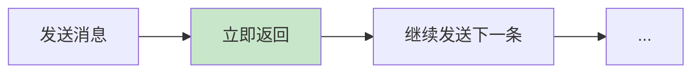
```mermaid
graph LR
    A[发送消息] --> B[立即返回]
    B --> C[继续发送下一条]
    C --> D[...]

    style B fill:#c8e6c9
```

**优缺点**：

| 优点 | 缺点 |
|-----|------|
| ✓ 性能最高 | ✗ 可能丢数据 |
| ✓ 代码简单 | ✗ 无法感知发送失败 |
| ✓ 适合海量低价值数据 | ✗ 无法重试 |

### 2. 同步发送（Synchronous）

**特点**：阻塞等待确认，保证消息送达

```go
package main

import (
    "fmt"
    "github.com/confluentinc/confluent-kafka-go/v2/kafka"
)

func main() {
    p, _ := kafka.NewProducer(&kafka.ConfigMap{
        "bootstrap.servers": "localhost:9092",
    })
    defer p.Close()

    topic := "quickstart-events"

    // 同步发送：等待确认
    for i := 0; i < 10; i++ {
        // 创建 delivery channel
        deliveryChan := make(chan kafka.Event, 1)

        // 发送消息
        err := p.Produce(&kafka.Message{
            TopicPartition: kafka.TopicPartition{
                Topic:     &topic,
                Partition: kafka.PartitionAny,
            },
            Key:   []byte(fmt.Sprintf("key-%d", i)),
            Value: []byte(fmt.Sprintf("Synchronous message %d", i)),
        }, deliveryChan)

        if err != nil {
            fmt.Printf("发送失败: %v\n", err)
            continue
        }

        // 等待发送结果（阻塞）
        event := <-deliveryChan
        msg := event.(*kafka.Message)

        if msg.TopicPartition.Error != nil {
            fmt.Printf("消息 %d 发送失败: %v\n", i, msg.TopicPartition.Error)
            // 可以在这里重试
        } else {
            fmt.Printf("消息 %d 发送成功: Topic=%s, Partition=%d, Offset=%d\n",
                i, *msg.TopicPartition.Topic,
                msg.TopicPartition.Partition,
                msg.TopicPartition.Offset)
        }

        close(deliveryChan)
    }

    p.Flush(15 * 1000)
}
```

**使用场景**：

- 重要业务数据
- 需要立即知道发送结果
- 需要精确的错误处理

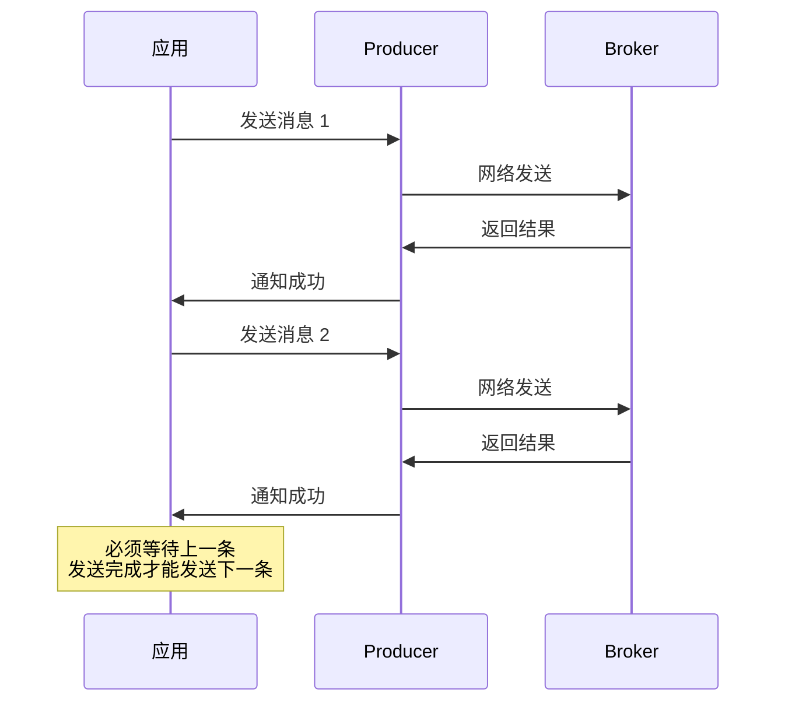
```mermaid
sequenceDiagram
    participant A as 应用
    participant P as Producer
    participant B as Broker

    A->>P: 发送消息 1
    P->>B: 网络发送
    B->>P: 返回结果
    P->>A: 通知成功

    A->>P: 发送消息 2
    P->>B: 网络发送
    B->>P: 返回结果
    P->>A: 通知成功

    Note over A: 必须等待上一条<br/>发送完成才能发送下一条
```

**优缺点**：

| 优点 | 缺点 |
|-----|------|
| ✓ 可靠性高 | ✗ 性能低 |
| ✓ 能精确处理错误 | ✗ 吞吐量受限 |
| ✓ 方便重试 | ✗ 延迟高 |

### 3. 异步发送（Asynchronous）

**特点**：非阻塞发送，通过回调处理结果

```go
package main

import (
    "fmt"
    "github.com/confluentinc/confluent-kafka-go/v2/kafka"
)

func main() {
    p, _ := kafka.NewProducer(&kafka.ConfigMap{
        "bootstrap.servers": "localhost:9092",
    })
    defer p.Close()

    topic := "quickstart-events"

    // 创建共享的 delivery channel
    deliveryChan := make(chan kafka.Event, 10000)

    // 启动后台 goroutine 处理发送结果
    go func() {
        for event := range deliveryChan {
            switch ev := event.(type) {
            case *kafka.Message:
                if ev.TopicPartition.Error != nil {
                    fmt.Printf("发送失败: Key=%s, Error=%v\n",
                        string(ev.Key), ev.TopicPartition.Error)
                    // 可以在这里实现重试逻辑
                } else {
                    fmt.Printf("发送成功: Key=%s, Topic=%s, Partition=%d, Offset=%d\n",
                        string(ev.Key),
                        *ev.TopicPartition.Topic,
                        ev.TopicPartition.Partition,
                        ev.TopicPartition.Offset)
                }
            }
        }
    }()

    // 异步发送：不阻塞
    for i := 0; i < 1000; i++ {
        err := p.Produce(&kafka.Message{
            TopicPartition: kafka.TopicPartition{
                Topic:     &topic,
                Partition: kafka.PartitionAny,
            },
            Key:   []byte(fmt.Sprintf("key-%d", i)),
            Value: []byte(fmt.Sprintf("Asynchronous message %d", i)),
        }, deliveryChan)

        if err != nil {
            fmt.Printf("发送失败: %v\n", err)
        }

        // 可以立即发送下一条，不等待确认
    }

    // 等待所有消息发送完成
    p.Flush(15 * 1000)
    close(deliveryChan)
}
```

**使用场景**：

- 高吞吐量场景
- 需要处理发送结果
- 对延迟有一定容忍度

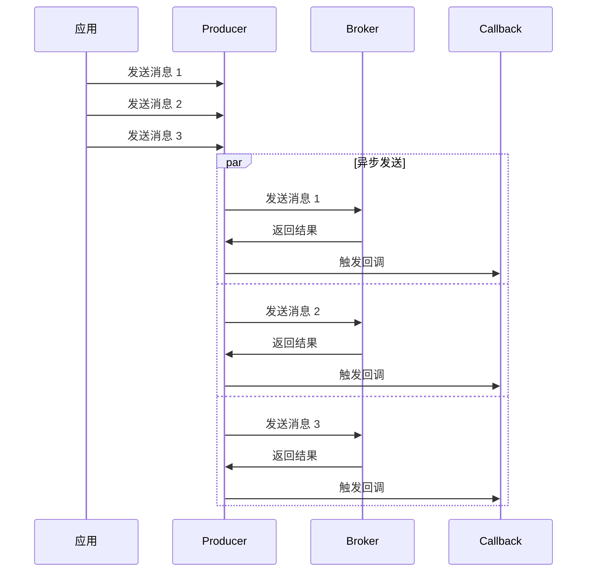
```mermaid
sequenceDiagram
    participant A as 应用
    participant P as Producer
    participant B as Broker
    participant C as Callback

    A->>P: 发送消息 1
    A->>P: 发送消息 2
    A->>P: 发送消息 3

    par 异步发送
        P->>B: 发送消息 1
        B->>P: 返回结果
        P->>C: 触发回调
    and
        P->>B: 发送消息 2
        B->>P: 返回结果
        P->>C: 触发回调
    and
        P->>B: 发送消息 3
        B->>P: 返回结果
        P->>C: 触发回调
    end
```

**优缺点**：

| 优点 | 缺点 |
|-----|------|
| ✓ 高吞吐量 | ✗ 代码复杂 |
| ✓ 非阻塞 | ✗ 需要处理并发 |
| ✓ 可靠性有保障 | ✗ 需要管理回调 |

### 4. 三种方式对比

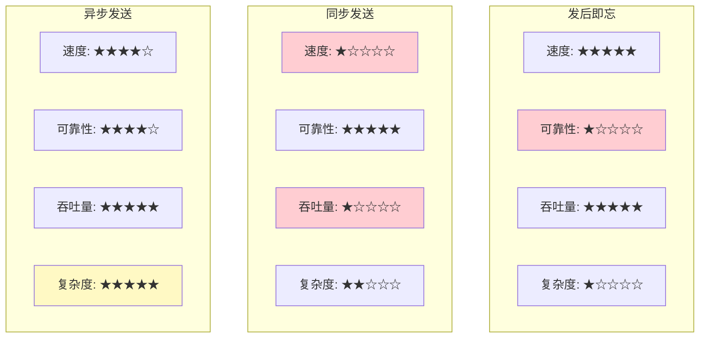
```mermaid
graph TB
    subgraph "发后即忘"
        A1[速度: ★★★★★]
        A2[可靠性: ★☆☆☆☆]
        A3[吞吐量: ★★★★★]
        A4[复杂度: ★☆☆☆☆]
    end

    subgraph "同步发送"
        B1[速度: ★☆☆☆☆]
        B2[可靠性: ★★★★★]
        B3[吞吐量: ★☆☆☆☆]
        B4[复杂度: ★★☆☆☆]
    end

    subgraph "异步发送"
        C1[速度: ★★★★☆]
        C2[可靠性: ★★★★☆]
        C3[吞吐量: ★★★★★]
        C4[复杂度: ★★★★★]
    end

    style A2 fill:#ffcdd2
    style B1 fill:#ffcdd2
    style B3 fill:#ffcdd2
    style C4 fill:#fff9c4
```

| 特性 | 发后即忘 | 同步发送 | 异步发送 |
|------|---------|---------|---------|
| **速度** | 最快 | 最慢 | 快 |
| **可靠性** | 最低 | 最高 | 高 |
| **吞吐量** | 最高 | 最低 | 最高 |
| **复杂度** | 最低 | 中 | 高 |
| **适用场景** | 日志收集 | 重要业务 | 大多数场景 |

**选择建议**：

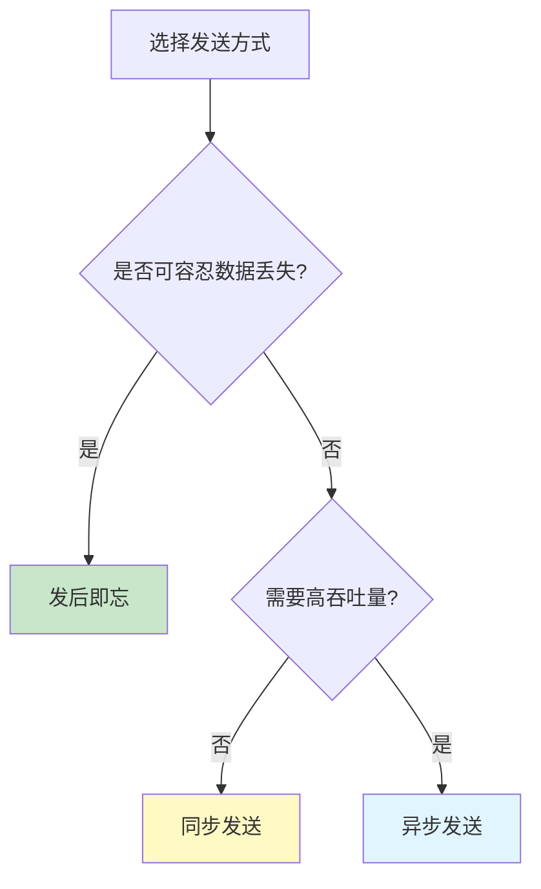
```mermaid
graph TB
    A[选择发送方式] --> B{是否可容忍数据丢失?}

    B -->|是| C[发后即忘]
    B -->|否| D{需要高吞吐量?}

    D -->|否| E[同步发送]
    D -->|是| F[异步发送]

    style C fill:#c8e6c9
    style E fill:#fff9c4
    style F fill:#e1f5fe
```

---

## 五、序列化器详解

### 1. 什么是序列化？

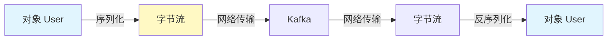
```mermaid
graph LR
    A[对象 User] -->|序列化| B[字节流]
    B -->|网络传输| C[Kafka]
    C -->|网络传输| D[字节流]
    D -->|反序列化| E[对象 User]

    style A fill:#e1f5fe
    style B fill:#fff9c4
    style E fill:#e1f5fe
```

**为什么需要序列化**：

- Kafka 只能存储字节数组
- 需要将对象转换为字节才能发送
- 消费者需要将字节转换回对象

### 2. 常见序列化格式对比

| 格式 | 优点 | 缺点 | 可读性 | 性能 | 压缩率 | 适用场景 |
|-----|------|------|--------|------|--------|---------|
| **String** | 简单 | 仅限文本 | ✓ | ★★★★★ | ☆☆☆☆☆ | 简单文本 |
| **JSON** | 可读、通用 | 冗余大 | ✓ | ★★★☆☆ | ★★☆☆☆ | Web API |
| **Avro** | 高效、支持 Schema | 需要编译 | ✗ | ★★★★☆ | ★★★★☆ | 大数据 |
| **Protobuf** | 高效、紧凑 | 不可读 | ✗ | ★★★★★ | ★★★★☆ | 微服务 |

### 3. JSON 序列化

#### 3.1 基础示例

```go
package main

import (
    "encoding/json"
    "fmt"
    "time"
    "github.com/confluentinc/confluent-kafka-go/v2/kafka"
)

// User 用户实体
type User struct {
    ID        string    `json:"id"`
    Name      string    `json:"name"`
    Email     string    `json:"email"`
    Age       int       `json:"age"`
    CreatedAt time.Time `json:"created_at"`
}

// UserEvent 用户事件
type UserEvent struct {
    EventID   string    `json:"event_id"`
    EventType string    `json:"event_type"`
    UserID    string    `json:"user_id"`
    Timestamp time.Time `json:"timestamp"`
    Payload   User      `json:"payload"`
}

// JSONSerializer JSON 序列化器
type JSONSerializer struct{}

// Serialize 序列化
func (j *JSONSerializer) Serialize(v interface{}) ([]byte, error) {
    return json.Marshal(v)
}

// Deserialize 反序列化
func (j *JSONSerializer) Deserialize(data []byte, v interface{}) error {
    return json.Unmarshal(data, v)
}

func main() {
    p, _ := kafka.NewProducer(&kafka.ConfigMap{
        "bootstrap.servers": "localhost:9092",
    })
    defer p.Close()

    topic := "user-events"
    serializer := &JSONSerializer{}

    // 创建用户事件
    event := UserEvent{
        EventID:   "evt-001",
        EventType: "user.created",
        UserID:    "user-123",
        Timestamp: time.Now(),
        Payload: User{
            ID:        "user-123",
            Name:      "张三",
            Email:     "zhangsan@example.com",
            Age:       25,
            CreatedAt: time.Now(),
        },
    }

    // 序列化
    jsonData, err := serializer.Serialize(event)
    if err != nil {
        panic(err)
    }

    fmt.Printf("序列化后的 JSON: %s\n", string(jsonData))

    // 发送到 Kafka
    deliveryChan := make(chan kafka.Event, 1)
    p.Produce(&kafka.Message{
        TopicPartition: kafka.TopicPartition{
            Topic:     &topic,
            Partition: kafka.PartitionAny,
        },
        Key:   []byte(event.UserID),
        Value: jsonData,
    }, deliveryChan)

    // 等待结果
    event := <-deliveryChan
    msg := event.(*kafka.Message)

    if msg.TopicPartition.Error != nil {
        fmt.Printf("发送失败: %v\n", msg.TopicPartition.Error)
    } else {
        fmt.Printf("发送成功: Partition=%d, Offset=%d\n",
            msg.TopicPartition.Partition,
            msg.TopicPartition.Offset)
    }

    close(deliveryChan)
    p.Flush(15 * 1000)
}
```

#### 3.2 生产级 JSON 序列化器

```go
package serializer

import (
    "bytes"
    "encoding/json"
    "io"
)

// JSONSerializer JSON 序列化器（生产级）
type JSONSerializer struct {
    // 是否缩进输出（用于调试）
    PrettyPrint bool
    // 是否转义 HTML
    EscapeHTML bool
}

// NewJSONSerializer 创建 JSON 序列化器
func NewJSONSerializer() *JSONSerializer {
    return &JSONSerializer{
        PrettyPrint: false,
        EscapeHTML:  true,
    }
}

// Serialize 序列化
func (j *JSONSerializer) Serialize(v interface{}) ([]byte, error) {
    var buf bytes.Buffer

    encoder := json.NewEncoder(&buf)
    encoder.SetEscapeHTML(j.EscapeHTML)

    if j.PrettyPrint {
        encoder.SetIndent("", "  ")
    }

    if err := encoder.Encode(v); err != nil {
        return nil, err
    }

    return buf.Bytes(), nil
}

// Deserialize 反序列化
func (j *JSONSerializer) Deserialize(data []byte, v interface{}) error {
    decoder := json.NewDecoder(bytes.NewReader(data))
    return decoder.Decode(v)
}

// SerializeToString 序列化为字符串
func (j *JSONSerializer) SerializeToString(v interface{}) (string, error) {
    data, err := j.Serialize(v)
    if err != nil {
        return "", err
    }
    return string(data), nil
}

// DeserializeFromString 从字符串反序列化
func (j *JSONSerializer) DeserializeFromString(data string, v interface{}) error {
    return j.Deserialize([]byte(data), v)
}
```

#### 3.3 通用序列化器接口

```go
package serializer

// Serializer 序列化器接口
type Serializer interface {
    Serialize(v interface{}) ([]byte, error)
}

// Deserializer 反序列化器接口
type Deserializer interface {
    Deserialize(data []byte, v interface{}) error
}

// Codec 序列化器和反序列化器组合接口
type Codec interface {
    Serializer
    Deserializer
}

// 各种序列化器实现
var (
    // JSON JSON 序列化器
    JSON Codec = &JSONSerializer{}

    // String 字符串序列化器
    String Codec = &StringSerializer{}

    // Binary 二进制序列化器
    Binary Codec = &BinarySerializer{}
)

// StringSerializer 字符串序列化器
type StringSerializer struct{}

func (s *StringSerializer) Serialize(v interface{}) ([]byte, error) {
    if str, ok := v.(string); ok {
        return []byte(str), nil
    }
    if str, ok := v.(*string); ok {
        return []byte(*str), nil
    }
    return nil, fmt.Errorf("value is not a string: %T", v)
}

func (s *StringSerializer) Deserialize(data []byte, v interface{}) error {
    if ptr, ok := v.(*string); ok {
        *ptr = string(data)
        return nil
    }
    return fmt.Errorf("target is not a *string: %T", v)
}

// BinarySerializer 二进制序列化器
type BinarySerializer struct{}

func (b *BinarySerializer) Serialize(v interface{}) ([]byte, error) {
    if data, ok := v.([]byte); ok {
        return data, nil
    }
    if data, ok := v.(*[]byte); ok {
        return *data, nil
    }
    return nil, fmt.Errorf("value is not []byte: %T", v)
}

func (b *BinarySerializer) Deserialize(data []byte, v interface{}) error {
    if ptr, ok := v.(*[]byte); ok {
        *ptr = data
        return nil
    }
    return fmt.Errorf("target is not *[]byte: %T", v)
}
```

### 4. 序列化格式选择指南

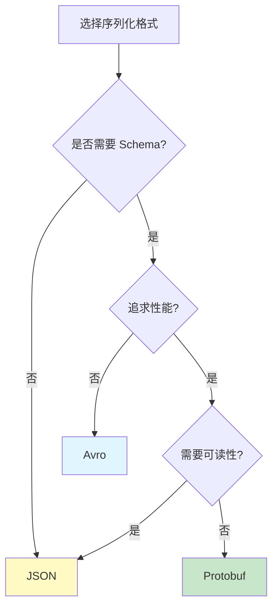
```mermaid
graph TB
    A[选择序列化格式] --> B{是否需要 Schema?}

    B -->|否| C[JSON]
    B -->|是| D{追求性能?}

    D -->|否| E[Avro]
    D -->|是| F{需要可读性?}

    F -->|是| C
    F -->|否| G[Protobuf]

    style C fill:#fff9c4
    style E fill:#e1f5fe
    style G fill:#c8e6c9
```

| 场景 | 推荐格式 | 理由 |
|------|---------|------|
| **Web API** | JSON | 可读性好、通用 |
| **日志收集** | JSON 或 String | 简单、易调试 |
| **微服务** | Protobuf | 高性能、体积小 |
| **大数据** | Avro | Schema 演化支持好 |
| **混合环境** | JSON | 各语言支持最好 |

---

## 六、自定义分区器

### 1. 分区器的作用

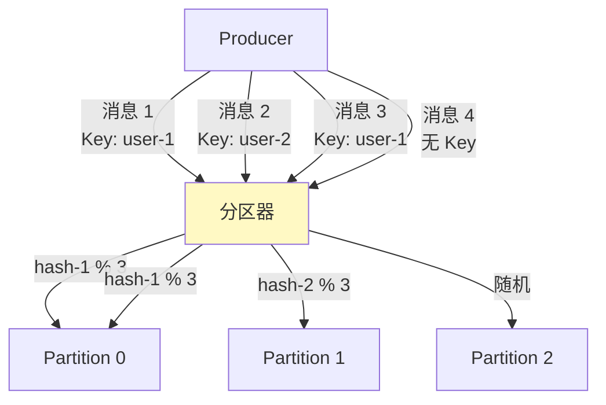
```mermaid
graph TB
    A[Producer] -->|消息 1<br/>Key: user-1| B[分区器]
    A -->|消息 2<br/>Key: user-2| B
    A -->|消息 3<br/>Key: user-1| B
    A -->|消息 4<br/>无 Key| B

    B -->|hash-1 % 3| P0[Partition 0]
    B -->|hash-2 % 3| P1[Partition 1]
    B -->|hash-1 % 3| P0
    B -->|随机| P2[Partition 2]

    style B fill:#fff9c4
```

**为什么需要分区**：

- **并行处理**：多个分区可以并行读写
- **扩展性**：分布式存储到多个 Broker
- **顺序保证**：相同 Key 的消息进入同一分区

### 2. 内置分区器

```go
p, _ := kafka.NewProducer(&kafka.ConfigMap{
    "bootstrap.servers": "localhost:9092",
    "partitioner":       "murmur2",  // 可选值见下表
})
```

| 分区器 | 说明 | 适用场景 |
|-------|------|---------|
| **murmur2** | Java 客户端默认 | 与 Java 互操作 |
| **consistent** | 一致性哈希 | 需要 Key 分布均匀 |
| **consistent_random** | 一致性或随机 | 混合场景 |
| **random** | 随机分区 | 不需要顺序 |
| **fnv1a** | FNV-1a 哈希算法 | 更快的哈希算法 |
| **fnv1a_random** | FNV-1a 或随机 | 性能优先 |

**分区器选择**：

```mermaid
graph TB
    A[选择分区器] --> B{需要与 Java 互操作?}

    B -->|是| C[murmur2]
    B -->|否| D{需要保证顺序?}

    D -->|是| E[consistent<br/>fnv1a]
    D -->|否| F[random]

    style C fill:#fff9c4
    style E fill:#e1f5fe
    style F fill:#c8e6c9
```

### 3. 手动指定分区

```go
package main

import (
    "fmt"
    "github.com/confluentinc/confluent-kafka-go/v2/kafka"
)

func manualPartitionExample() {
    p, _ := kafka.NewProducer(&kafka.ConfigMap{
        "bootstrap.servers": "localhost:9092",
    })
    defer p.Close()

    topic := "manual-partition-topic"

    // 方式1：指定具体分区号
    p.Produce(&kafka.Message{
        TopicPartition: kafka.TopicPartition{
            Topic:     &topic,
            Partition: 0,  // 明确指定分区 0
        },
        Key:   []byte("explicit-key"),
        Value: []byte("This message goes to partition 0"),
    }, nil)

    // 方式2：让 Kafka 自动选择（基于 Key 的哈希）
    p.Produce(&kafka.Message{
        TopicPartition: kafka.TopicPartition{
            Topic:     &topic,
            Partition: kafka.PartitionAny,  // 自动选择
        },
        Key:   []byte("user-123"),  // 相同 Key 总是分配到同一分区
        Value: []byte("User 123 data"),
    }, nil)

    // 方式3：无 Key，随机分区
    p.Produce(&kafka.Message{
        TopicPartition: kafka.TopicPartition{
            Topic:     &topic,
            Partition: kafka.PartitionAny,
        },
        // 无 Key
        Value: []byte("Random partition message"),
    }, nil)

    p.Flush(15 * 1000)
}
```

### 4. 自定义分区策略

**场景示例**：按用户 ID 的哈希值分区

```go
package main

import (
    "fmt"
    "hash/fnv"
    "github.com/confluentinc/confluent-kafka-go/v2/kafka"
)

// CustomPartitioner 自定义分区器
type CustomPartitioner struct {
    partitionCount int32
}

// NewCustomPartitioner 创建自定义分区器
func NewCustomPartitioner(partitionCount int32) *CustomPartitioner {
    return &CustomPartitioner{
        partitionCount: partitionCount,
    }
}

// Partition 计算分区
func (cp *CustomPartitioner) Partition(key []byte) int32 {
    if len(key) == 0 {
        // 无 Key 时使用轮询或其他策略
        return 0
    }

    // 使用 FNV-1a 哈希算法
    h := fnv.New32a()
    h.Write(key)
    hash := h.Sum32()

    // 取模得到分区号
    return int32(hash) % cp.partitionCount
}

func customPartitioningExample() {
    p, _ := kafka.NewProducer(&kafka.ConfigMap{
        "bootstrap.servers": "localhost:9092",
    })
    defer p.Close()

    topic := "custom-partition-topic"
    partitionCount := int32(3)  // 假设 Topic 有 3 个分区

    partitioner := NewCustomPartitioner(partitionCount)

    users := []string{"user-1", "user-2", "user-3", "user-1"}

    for _, userID := range users {
        key := []byte(userID)
        partition := partitioner.Partition(key)

        p.Produce(&kafka.Message{
            TopicPartition: kafka.TopicPartition{
                Topic:     &topic,
                Partition: partition,  // 使用计算出的分区
            },
            Key:   key,
            Value: []byte(fmt.Sprintf("Data for %s", userID)),
        }, nil)

        fmt.Printf("User %s -> Partition %d\n", userID, partition)
    }

    p.Flush(15 * 1000)
}
```

### 5. 分区器选择指南

```mermaid
graph TB
    A[选择分区策略] --> B{有特殊业务需求?}

    B -->|否| C[使用内置分区器<br/>murmur2/consistent]
    B -->|是| D{需求类型?}

    D -->|按属性分组| E[业务属性分区]
    D -->|高性能| F[Sticky Partitioner]
    D -->|精确控制| G[手动指定分区]

    style C fill:#c8e6c9
    style E fill:#fff9c4
    style F fill:#e1f5fe
    style G fill:#f3e5f5
```

| 场景 | 推荐策略 | 理由 |
|------|---------|------|
| **一般消息** | murmur2 | Java 兼容，分布均匀 |
| **无顺序要求** | random | 最大并行度 |
| **按地区/业务** | 自定义业务分区器 | 业务隔离 |
| **高吞吐量** | Sticky | 减少分区切换 |

---

## 七、生产者最佳实践

### 1. 配置最佳实践

```go
package main

import (
    "github.com/confluentinc/confluent-kafka-go/v2/kafka"
)

// 推荐的生产者配置模板

// 1. 高可靠性配置（金融、支付等核心业务）
func HighReliabilityConfig() *kafka.ConfigMap {
    return &kafka.ConfigMap{
        "bootstrap.servers":  "localhost:9092",
        "acks":               "all",                    // 等待所有副本
        "enable.idempotence": true,                    // 启用幂等性
        "retries":            2147483647,               // 无限重试
        "max.in.flight":      5,                        // 最多 5 个未确认请求
        "compression.type":   "zstd",                   // 压缩
    }
}

// 2. 高吞吐量配置（日志收集、监控数据）
func HighThroughputConfig() *kafka.ConfigMap {
    return &kafka.ConfigMap{
        "bootstrap.servers": "localhost:9092",
        "acks":              "1",                       // Leader 确认即可
        "compression.type":  "lz4",                     // 快速压缩
        "batch.size":        65536,                     // 64KB 批量
        "linger.ms":         50,                        // 50ms 等待
        "buffer.memory":     67108864,                  // 64MB 缓冲
    }
}

// 3. 低延迟配置（实时消息）
func LowLatencyConfig() *kafka.ConfigMap {
    return &kafka.ConfigMap{
        "bootstrap.servers": "localhost:9092",
        "acks":              "1",
        "compression.type":  "none",                    // 不压缩
        "batch.size":        8192,                      // 8KB 批量
        "linger.ms":         0,                         // 立即发送
        "buffer.memory":     16777216,                  // 16MB 缓冲
    }
}

// 4. 平衡配置（大多数业务场景）
func BalancedConfig() *kafka.ConfigMap {
    return &kafka.ConfigMap{
        "bootstrap.servers":  "localhost:9092",
        "acks":               "all",
        "enable.idempotence": true,
        "compression.type":   "snappy",                  // 平衡压缩
        "batch.size":         32768,                     // 32KB
        "linger.ms":          10,                        // 10ms
        "retries":            3,                         // 重试 3 次
    }
}
```

### 2. 错误处理最佳实践

```go
package main

import (
    "fmt"
    "log"
    "time"
    "github.com/confluentinc/confluent-kafka-go/v2/kafka"
)

// ProducerWithRetry 带重试的生产者包装器
type ProducerWithRetry struct {
    producer   *kafka.Producer
    maxRetries int
}

// NewProducerWithRetry 创建带重试的生产者
func NewProducerWithRetry(config *kafka.ConfigMap, maxRetries int) (*ProducerWithRetry, error) {
    p, err := kafka.NewProducer(config)
    if err != nil {
        return nil, err
    }

    return &ProducerWithRetry{
        producer:   p,
        maxRetries: maxRetries,
    }, nil
}

// ProduceSync 带重试的同步发送
func (pr *ProducerWithRetry) ProduceSync(msg *kafka.Message) error {
    deliveryChan := make(chan kafka.Event, 1)
    defer close(deliveryChan)

    for attempt := 0; attempt <= pr.maxRetries; attempt++ {
        err := pr.producer.Produce(msg, deliveryChan)
        if err != nil {
            log.Printf("发送失败（尝试 %d/%d）: %v", attempt+1, pr.maxRetries+1, err)
            time.Sleep(time.Duration(attempt+1) * 100 * time.Millisecond)  // 指数退避
            continue
        }

        // 等待结果
        event := <-deliveryChan
        result := event.(*kafka.Message)

        if result.TopicPartition.Error != nil {
            log.Printf("Broker 返回错误（尝试 %d/%d）: %v",
                attempt+1, pr.maxRetries+1, result.TopicPartition.Error)
            time.Sleep(time.Duration(attempt+1) * 100 * time.Millisecond)
            continue
        }

        // 发送成功
        return nil
    }

    return fmt.Errorf("发送失败：超过最大重试次数 %d", pr.maxRetries)
}

// ProduceAsync 带重试的异步发送
func (pr *ProducerWithRetry) ProduceAsync(msg *kafka.Message, callback func(error)) {
    go func() {
        err := pr.ProduceSync(msg)
        if callback != nil {
            callback(err)
        }
    }()
}

func (pr *ProducerWithRetry) Close() {
    pr.producer.Close()
}

// 使用示例
func retryExample() {
    config := &kafka.ConfigMap{
        "bootstrap.servers":  "localhost:9092",
        "acks":               "all",
        "enable.idempotence": true,
    }

    producer, err := NewProducerWithRetry(config, 3)
    if err != nil {
        panic(err)
    }
    defer producer.Close()

    topic := "retry-topic"

    // 同步发送
    err = producer.ProduceSync(&kafka.Message{
        TopicPartition: kafka.TopicPartition{
            Topic:     &topic,
            Partition: kafka.PartitionAny,
        },
        Key:   []byte("retry-key"),
        Value: []byte("Message with retry"),
    })

    if err != nil {
        log.Printf("最终发送失败: %v", err)
        // 可以记录到死信队列或本地文件
    } else {
        log.Println("发送成功")
    }

    // 异步发送
    producer.ProduceAsync(&kafka.Message{
        TopicPartition: kafka.TopicPartition{
            Topic:     &topic,
            Partition: kafka.PartitionAny,
        },
        Key:   []byte("async-retry-key"),
        Value: []byte("Async message with retry"),
    }, func(err error) {
        if err != nil {
            log.Printf("异步发送最终失败: %v", err)
        } else {
            log.Println("异步发送成功")
        }
    })

    producer.producer.Flush(15 * 1000)
}
```

### 3. 优雅关闭

```go
package main

import (
    "log"
    "os"
    "os/signal"
    "syscall"
    "time"
    "github.com/confluentinc/confluent-kafka-go/v2/kafka"
)

// GracefulProducer 优雅关闭的生产者
type GracefulProducer struct {
    producer     *kafka.Producer
    deliveryChan chan kafka.Event
    shutdownChan chan struct{}
    doneChan     chan struct{}
}

// NewGracefulProducer 创建优雅关闭的生产者
func NewGracefulProducer(config *kafka.ConfigMap) (*GracefulProducer, error) {
    p, err := kafka.NewProducer(config)
    if err != nil {
        return nil, err
    }

    gp := &GracefulProducer{
        producer:     p,
        deliveryChan: make(chan kafka.Event, 10000),
        shutdownChan: make(chan struct{}),
        doneChan:     make(chan struct{}),
    }

    // 启动结果处理 goroutine
    go gp.handleDeliveryEvents()

    return gp, nil
}

// handleDeliveryEvents 处理发送结果
func (gp *GracefulProducer) handleDeliveryEvents() {
    for {
        select {
        case event := <-gp.deliveryChan:
            switch ev := event.(type) {
            case *kafka.Message:
                if ev.TopicPartition.Error != nil {
                    log.Printf("消息发送失败: %v", ev.TopicPartition.Error)
                } else {
                    log.Printf("消息发送成功: Topic=%s, Partition=%d, Offset=%d",
                        *ev.TopicPartition.Topic,
                        ev.TopicPartition.Partition,
                        ev.TopicPartition.Offset)
                }
            }
        case <-gp.shutdownChan:
            // 关闭信号
            close(gp.doneChan)
            return
        }
    }
}

// Produce 发送消息
func (gp *GracefulProducer) Produce(topic string, key, value []byte) error {
    return gp.producer.Produce(&kafka.Message{
        TopicPartition: kafka.TopicPartition{
            Topic:     &topic,
            Partition: kafka.PartitionAny,
        },
        Key:   key,
        Value: value,
    }, gp.deliveryChan)
}

// Close 优雅关闭
func (gp *GracefulProducer) Close(timeout time.Duration) error {
    log.Println("开始关闭生产者...")

    // 1. 停止接收新消息（应用层控制）
    close(gp.shutdownChan)

    // 2. 等待所有消息发送完成
    log.Println("等待消息发送完成...")
    remaining := gp.producer.Flush(int(timeout.Milliseconds()))

    if remaining > 0 {
        log.Printf("警告：还有 %d 条消息未发送完成", remaining)
    }

    // 3. 等待结果处理 goroutine 退出
    <-gp.doneChan

    // 4. 关闭生产者
    gp.producer.Close()

    log.Println("生产者已关闭")
    return nil
}

// 使用示例
func gracefulShutdownExample() {
    // 创建生产者
    gp, err := NewGracefulProducer(&kafka.ConfigMap{
        "bootstrap.servers": "localhost:9092",
    })
    if err != nil {
        panic(err)
    }

    // 处理信号
    sigchan := make(chan os.Signal, 1)
    signal.Notify(sigchan, syscall.SIGINT, syscall.SIGTERM)

    // 发送消息
    go func() {
        for i := 0; ; i++ {
            select {
            case <-sigchan:
                return
            default:
                topic := "graceful-topic"
                key := []byte("key-" + string(rune('0'+i%10)))
                value := []byte("Graceful message " + string(rune('0'+i%10)))

                if err := gp.Produce(topic, key, value); err != nil {
                    log.Printf("发送失败: %v", err)
                }

                time.Sleep(100 * time.Millisecond)
            }
        }
    }()

    // 等待退出信号
    <-sigchan
    log.Println("收到退出信号")

    // 优雅关闭（等待最多 30 秒）
    if err := gp.Close(30 * time.Second); err != nil {
        log.Printf("关闭失败: %v", err)
    }
}
```

### 4. 生产环境检查清单

```mermaid
mindmap
  root((生产者<br/>检查清单))
    配置
      acks=all
      enable.idempotence=true
      compression.type
      retries>0
    错误处理
      重试机制
      死信队列
      监控告警
    性能
      batch.size
      linger.ms
      buffer.memory
    监控
      发送成功率
      发送延迟
      吞吐量
      缓冲区使用率
    优雅关闭
      Flush 等待
      信号处理
      资源清理
```

---

## 八、今日总结

### 1. 核心概念回顾

```mermaid
mindmap
  root((Kafka Producer))
    发送方式
      发后即忘
        最快
        可能丢数据
      同步发送
        可靠性高
        性能低
      异步发送
        平衡性能和可靠性
        推荐使用
    配置参数
      可靠性
        acks
        enable.idempotence
      性能
        batch.size
        linger.ms
        compression.type
      超时
        request.timeout.ms
        retries
    序列化
      JSON
        可读性好
        通用
      Avro
        高压缩率
        Schema 支持
      Protobuf
        高性能
        体积小
    分区策略
      内置
        murmur2
        consistent
        random
      自定义
        业务属性
        Sticky
```

### 2. 练习

**基础练习**：

1. 实现三种发送方式（发后即忘、同步、异步）
2. 配置不同的 `acks` 值，观察性能差异
3. 实现 JSON 序列化和反序列化
4. 使用不同分区器发送消息，观察分区分布

**进阶练习**：

1. 实现带重试机制的生产者
2. 添加生产者监控指标
3. 实现自定义分区策略（按地区、优先级等）
4. 实现优雅关闭机制

**挑战练习**：

1. 实现一个生产者连接池
2. 添加消息追踪功能（trace-id）
3. 实现消息压缩和加密
4. 实现性能基准测试

### 3. 下节预告

在 **Day 3**，我们将探索：

- 消费者组与再平衡机制
- 消息位移管理（自动提交 vs 手动提交）
- 消费方式（poll、seek、pause/resume）
- 多线程消费模型

---

## 九、参考资料

- [Apache Kafka 官方文档 - Producer](https://kafka.apache.org/documentation/#producerapi)
- [confluent-kafka-go 文档](https://docs.confluent.io/platform/current/clients/confluent-kafka-go/index.html)
- [Kafka Producer Configuration](https://kafka.apache.org/documentation/#producerconfigs)

> 本文档基于 Kafka 3.5+ 版本和 Go 1.25.3 编写
> 如有问题，欢迎随时提问交流！
