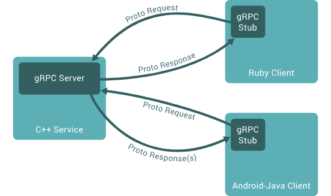
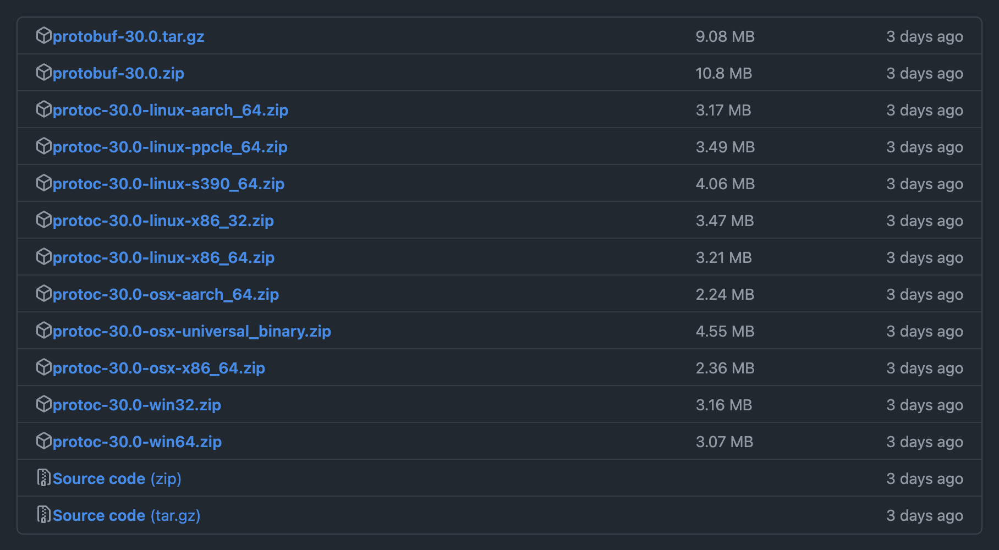
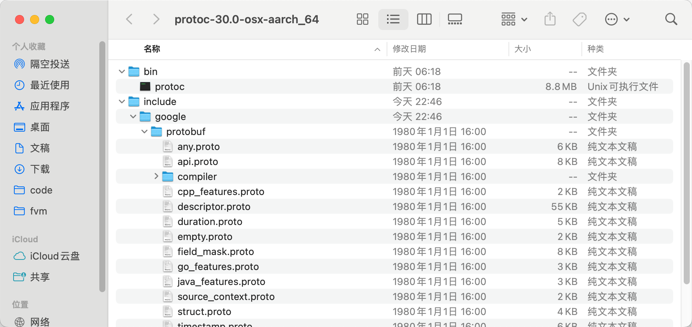
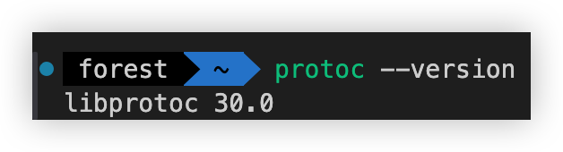
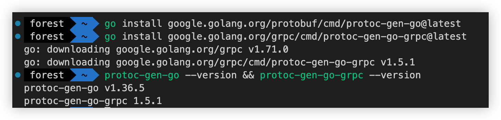
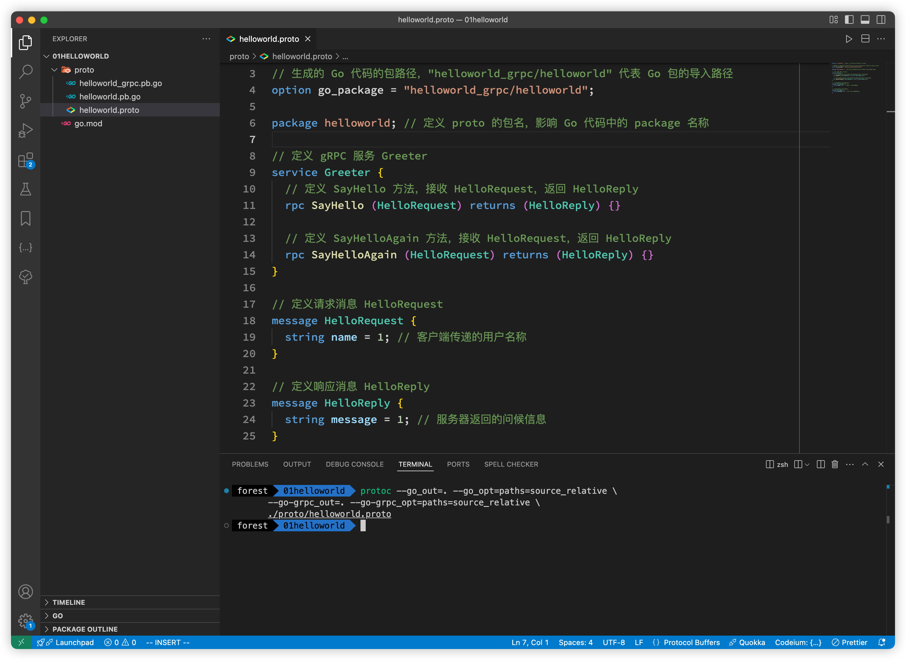
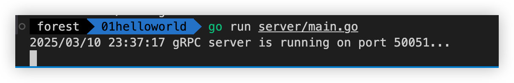
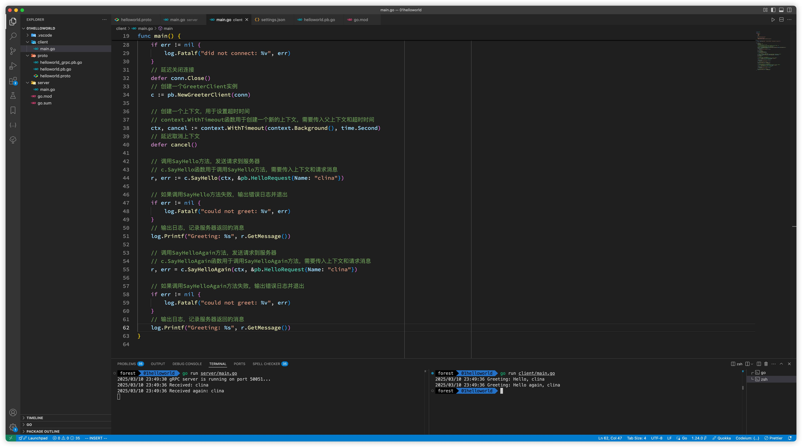

gRPC（全称：gRPC Remote Procedure Call）是由 Google 开发的一个高性能、开源、通用的远程过程调用（RPC）框架，默认采用 Protocol Buffers 数据序列化协议。它的核心特点包括：
- 语言中立：支持多种语言，例如 Go、Java、C、C++、C#、Node.js、PHP、Python、Ruby 等；
- 基于 IDL 定义服务：基于 IDL（Interface Definition Language）文件定义服务，通过 proto3 工具生成指定语言的数据结构、服务端接口以及客户端 Stub。通过这种方式，也可以将服务端和客户端解耦，使客户端和服务端可以并行开发；
- 基于 HTTP/2 协议：通信协议基于标准的 HTTP/2 设计，支持双向流、消息头压缩、单 TCP 的多路复用、服务端推送等特性；
- 支持 Protocol Buffer 序列化：Protocol Buffer 简称 Protobuf，是一种语言无关的高性能序列化框架，可以减少网络传输流量，提高通信效率。另外，Protobuf 语法简单，表达能力强很适合用来进行接口定义。

> 提示：gRPC 的全称不是 golang Remote Procedure Call，而是 google Remote Procedure Call。

gRPC 的由来可以追溯到 Google 内部的 Stubby 系统。Stubby 是 Google 为了解决大规模服务间通信而开发的内部工具。随着公司内部需求的不断扩大和外部开源社区的呼声，Google 将 Stubby 的设计理念和部分实现进行了开源，并进一步发展成了今天的 gRPC。它不仅提供了高效、跨语言的通信解决方案，还在微服务架构和分布式系统中大放异彩。

gRPC 的调用如下图（图片来自官方文档）所示：



上图中的调用流程如下：

1. 客户端通过 gRPC Stub 调用某个远程方法（如 A 方法），并向服务器端发起 RPC 调用。
2. 客户端将请求数据通过 [Protocol Buffers](https://protobuf.dev/)（Protobuf）进行序列化和压缩，形成 Proto Request 并发送给服务器。
3. gRPC 服务器（如图中用 C++ 实现的服务端）接收到请求后，先使用 Protobuf 解码请求体，然后执行相应的业务逻辑（如数据库查询、计算等）。
4. 服务器端将处理结果使用 Protobuf 序列化为 Proto Response，返回给客户端。
5. 客户端接收服务器的响应后，解码响应数据并将结果返回给发起调用的方法（A 方法），唤醒处于等待状态的客户端调用线程，并将最终结果传递给调用方。

这张图表明了 gRPC 的核心特性之一：使用 [Protocol Buffers](https://protobuf.dev/)（图中的 "Proto"）作为接口定义语言，允许不同编程语言编写的客户端（图中是 Ruby 和 Java）能够无缝地与用另一种语言（图中是 C++）编写的服务器通信。箭头表示通信方向，展示了请求和响应的流向。

这是一个典型的跨语言 RPC（远程过程调用）框架的工作方式，gRPC 使开发者能够像调用本地函数一样调用远程服务。

gRPC API 接口通常使用的数据传输格式是 [Protocol Buffers](https://protobuf.dev/)。接下来，我们就一起了解下 [Protocol Buffers](https://protobuf.dev/)。

## Protocol Buffers 介绍

**Protocol Buffers**（简称 *Protobuf*）是由 Google 开发的一种与语言无关、平台无关的高性能数据序列化协议。它在分布式系统和网络通信中应用广泛，常常与 gRPC 搭配使用。其核心特点包括：

1. **高效的序列化与反序列化**  
   Protobuf 使用二进制格式存储和传输数据，体积更小、速度更快，相比于 JSON、XML 等文本格式具有更高的传输和处理效率。

2. **跨语言、跨平台**  
   只需定义好 `.proto` 文件（接口描述文件），就能自动生成多种语言（如 C++、Java、Go、Python 等）的数据结构和序列化代码，从而实现跨语言通信。

3. **向后兼容**  
   Protobuf 提供了一种面向“字段编号”的数据定义方式。在后期对数据结构进行新增字段或修改时，只要遵守一定的兼容规则，就能让旧版和新版服务继续正常通信。

4. **可读性与维护性**  
   虽然 Protobuf 的序列化结果是二进制，但 `.proto` 文件采用类似于接口定义语言（IDL）的方式，便于团队协作与维护。此外，借助 Protobuf 编译器生成的代码，开发者可以免去手写序列化、反序列化逻辑的繁琐工作。

简而言之，Protocol Buffers 提供了一种高效、可扩展、易维护的通信协议定义与序列化方案，被广泛应用在分布式系统、微服务和各种需要跨语言通信的场景中。

在 gRPC 框架中，Protocol Buffers 主要有以下三个作用：

- **定义接口和数据结构**  
  通过 `.proto` 文件，开发者可以明确地定义服务接口、RPC 方法以及消息的数据结构，这为客户端和服务端提供了统一的通信规范。
    ```protoc
    // 定义请求消息，包含所有基本数据类型
    message AllTypesRequest {
        double   field_double  = 1;  // 64位浮点数
        float    field_float   = 2;  // 32位浮点数
        int32    field_int32   = 3;  // 有符号 32位整数
        int64    field_int64   = 4;  // 有符号 64位整数
        uint32   field_uint32  = 5;  // 无符号 32位整数
        uint64   field_uint64  = 6;  // 无符号 64位整数
        sint32   field_sint32  = 7;  // 使用 ZigZag 编码的有符号 32位整数
        sint64   field_sint64  = 8;  // 使用 ZigZag 编码的有符号 64位整数
        fixed32  field_fixed32 = 9;  // 总是占 4 个字节的无符号 32位整数
        fixed64  field_fixed64 = 10; // 总是占 8 个字节的无符号 64位整数
        sfixed32 field_sfixed32= 11; // 总是占 4 个字节的有符号 32位整数
        sfixed64 field_sfixed64= 12; // 总是占 8 个字节的有符号 64位整数
        bool     field_bool    = 13; // 布尔类型
        string   field_string  = 14; // 字符串类型
        bytes    field_bytes   = 15; // 字节序列类型
    }
    ```

    > 后面我会专门针对这些数据类型写一篇文章来介绍，这里只是先做了解！
  
- **高效的序列化与反序列化**  
  Protocol Buffers 将消息数据转换成紧凑的二进制格式进行传输，这不仅降低了数据传输的开销，还大大提高了序列化和反序列化的效率。
    ```protoc
    // 定义一个服务，包含一个方法 ProcessAllTypes
    service DataService {
        // ProcessAllTypes 方法接收一个 AllTypesRequest 消息，并返回一个 AllTypesResponse 消息
        rpc ProcessAllTypes(AllTypesRequest) returns (AllTypesResponse);
    }
    ```
- **跨语言与跨平台支持**  
基于 .proto 文件，可以自动生成多种编程语言（如 C++、Java、Python、Go 等）的代码，实现不同语言和平台之间的无缝通信。后面做演示！

## 环境搭建
简单的了解了基本原理和 Protocol Buffers 之后，接下来就安装环境；

### Protocol 编译器安装

我这里就不一一列举具体的系统或者具体的语言区安装，就以 Go 语言为例，其它语言官方也提供了具体的安装方式 [https://grpc.io/docs/languages/](https://grpc.io/docs/languages/)，或者手动安装，官方地址：



选择对应的系统后，解压文件，将可执行没文件添加到系统的环境变量中：



官方还提供了其他的安装方式：
- Windows 使用 Winget 安装：
  ```sh
  > $ winget install protobuf
  ```
- linux 使用 `apt` 或者 `apt-get` 安装：
  ```sh
  $ apt install -y protobuf-compiler
  ```
- Mac OS 使用 Homebrew 安装：
  ```sh
  $ brew install protobuf
  ```

安装完成之后，使用 `protoc --version` 命令查看是否安装成功：
```sh
$ protoc --version
libprotoc 30.0
```


上面安装了 Protocol Buffer 的编译器，接着就安装 gRPC 相关的 Go 依赖：
```sh
go install google.golang.org/protobuf/cmd/protoc-gen-go@latest
go install google.golang.org/grpc/cmd/protoc-gen-go-grpc@latest
```
检查是否安装成功：
```sh
$ protoc-gen-go --version && protoc-gen-go-grpc --version

```


这两个工具的作用：
- `protoc-gen-go`：用于生成 Go 结构体代码（message 解析）。
- `protoc-gen-go-grpc`：用于生成 gRPC 服务端和客户端代码。

> 如果终端中打印找不到这两命令的话，很可能是没有添加到系统环境变量中，MacOS 中可以使用下面的命令：
> ```sh
> export PATH="$PATH:$(go env GOPATH)/bin"
> ```

## helloworld 开发
上面把环境都搞定了，接下来就先来做一个 helloworld 的示例！

### 定义服务

我们先新建一个 01helloworld 的目录，然后初始化项目：
```sh
$ mkdir 01helloworld && cd 01helloworld && go mod init hellowrold
```
接下来在 01helloworld 目录中创建一个 proto 文件夹，这个文件夹主要是弄来放 `proto` 文件的（有的公司把它放在 api 目录下），然后创建 `helloworld.proto` 文件：
```sh
$ mkdir proto && touch proto/helloworld.proto
```
在 `helloworld.proto` 文件中，定义一个 `HelloWorld` 服务，该服务包含一个 `SayHello` 方法，该方法接受 `HelloRequest` 并返回 `HelloResponse`：
```proto
syntax = "proto3"; // 指定使用 Protocol Buffers v3 语法

// 生成的 Go 代码的包路径，"helloworld_grpc/helloworld" 代表 Go 包的导入路径
option go_package = "helloworld_grpc/helloworld";

package helloworld; // 定义 proto 的包名，影响 Go 代码中的 package 名称

// 定义 gRPC 服务 Greeter
service Greeter {
  // 定义 SayHello 方法，接收 HelloRequest，返回 HelloReply
  rpc SayHello (HelloRequest) returns (HelloReply) {}

  // 定义 SayHelloAgain 方法，接收 HelloRequest，返回 HelloReply
  rpc SayHelloAgain (HelloRequest) returns (HelloReply) {}
}

// 定义请求消息 HelloRequest
message HelloRequest {
  string name = 1; // 客户端传递的用户名称
}

// 定义响应消息 HelloReply
message HelloReply {
  string message = 1; // 服务器返回的问候信息
}
```

代码也有详细的注释，关于语法后面会有详细的介绍！

### 生成 Go 代码

在定义好 `.proto` 文件后，我们需要使用 `protoc` 编译它，生成 gRPC 服务端和客户端的 Go 代码。在 `helloworld.proto` 所在目录执行以下命令，生成 gRPC 代码：
```sh
protoc --go_out=. --go_opt=paths=source_relative \
       --go-grpc_out=. --go-grpc_opt=paths=source_relative \
       ./proto/helloworld.proto
```
> 参数说明：
>
> - `--go_out=.`：生成 Go 结构体代码（message 类型）。
> - `--go-grpc_out=.`：生成 gRPC 服务代码。
> - `proto/helloworld.proto`：指定 `.proto` 文件路径。

执行成功后，`proto/` 目录下会生成两个文件：
```tree
proto/
├── helloworld.pb.go        # 处理消息类型的 Go 代码
└── helloworld_grpc.pb.go   # 处理 gRPC 服务的 Go 代码
```
完整目录如下：


### 实现 gRPC 服务器
到这里，我们已经成功生成了 gRPC Go 代码。下一步，我们将实现 GreeterServer，并启动 gRPC 服务器。

在项目根目录下创建 server 目录，并在其中新建 `main.go` 文件：
```sh
$ mkdir server
$ touch server/main.go
```
然后，编写 `main.go` 代码：
```go
package main

import (
	"context"
	"log"
	"net"

	pb "hellowrold_grpc/proto" // 引入 proto 生成的包

	"google.golang.org/grpc"
)

// 定义 GreeterServer 结构体，实现 pb.GreeterServer 接口
type greeterServer struct {
	pb.UnimplementedGreeterServer // 确保向前兼容
}

// 实现 SayHello 方法
func (s *greeterServer) SayHello(ctx context.Context, req *pb.HelloRequest) (*pb.HelloReply, error) {
	log.Printf("Received: %v", req.GetName())
	return &pb.HelloReply{Message: "Hello, " + req.GetName()}, nil
}

// 实现 SayHelloAgain 方法
func (s *greeterServer) SayHelloAgain(ctx context.Context, req *pb.HelloRequest) (*pb.HelloReply, error) {
	log.Printf("Received again: %v", req.GetName())
	return &pb.HelloReply{Message: "Hello again, " + req.GetName()}, nil
}

func main() {
	// 监听 TCP 端口
	listener, err := net.Listen("tcp", ":50051")
	if err != nil {
		log.Fatalf("Failed to listen: %v", err)
	}

	// 创建 gRPC 服务器
	grpcServer := grpc.NewServer()

	// 注册 Greeter 服务
	pb.RegisterGreeterServer(grpcServer, &greeterServer{})

	log.Println("gRPC server is running on port 50051...")
	if err := grpcServer.Serve(listener); err != nil {
		log.Fatalf("Failed to serve: %v", err)
	}
}
```
- `pb.UnimplementedGreeterServer` 是 `protoc` 自动生成的默认实现，可以确保后续 `proto` 文件升级时不会影响已有代码。
- `SayHello` 方法接收 `HelloRequest`，提取 `name` 字段，并返回 HelloReply，其中包含问候消息。
- `listener, err := net.Listen("tcp", ":50051")` 监听 50051 端口，等待客户端连接。

确保 `protoc` 生成的代码已经编译，并执行以下命令启动服务器：
```sh
go run server/main.go
```
效果如下：



### 实现 gRPC 客户端
我们已经成功启动了 gRPC 服务器，现在我们需要实现一个客户端，来调用 `Greeter` 服务的 `SayHello` 和 `SayHelloAgain` 方法，并获取返回结果。

在项目根目录下创建 client 目录，并在其中新建 `main.go` 文件：
```sh
$ mkdir client
$ touch client/main.go
```
然后，在 `client/main.go` 中编写以下代码：
```go
package main

import (
	"context"
	"flag"
	"log"
	"time"

	pb "hellowrold_grpc/proto"

	"google.golang.org/grpc"
	"google.golang.org/grpc/credentials/insecure"
)

var (
	addr = flag.String("addr", "localhost:50051", "the address to connect to")
)

func main() {
	// 解析命令行参数
	flag.Parse()
	// 创建一个连接到服务器的客户端
	// grpc.NewClient函数用于创建一个新的客户端，需要传入服务器地址和凭证
	// grpc.WithTransportCredentials函数用于设置传输层凭证
	// insecure.NewCredentials函数用于创建不安全的凭证
	conn, err := grpc.NewClient(*addr, grpc.WithTransportCredentials(insecure.NewCredentials()))
	// 如果创建连接失败，输出错误日志并退出
	if err != nil {
		log.Fatalf("did not connect: %v", err)
	}
	// 延迟关闭连接
	defer conn.Close()
	// 创建一个GreeterClient实例
	c := pb.NewGreeterClient(conn)

	// 创建一个上下文，用于设置超时时间
	// context.WithTimeout函数用于创建一个新的上下文，需要传入父上下文和超时时间
	ctx, cancel := context.WithTimeout(context.Background(), time.Second)
	// 延迟取消上下文
	defer cancel()

	// 调用SayHello方法，发送请求到服务器
	// c.SayHello函数用于调用SayHello方法，需要传入上下文和请求消息
	r, err := c.SayHello(ctx, &pb.HelloRequest{Name: "clina"})

	// 如果调用SayHello方法失败，输出错误日志并退出
	if err != nil {
		log.Fatalf("could not greet: %v", err)
	}
	// 输出日志，记录服务器返回的消息
	log.Printf("Greeting: %s", r.GetMessage())

	// 调用SayHelloAgain方法，发送请求到服务器
	// c.SayHelloAgain函数用于调用SayHelloAgain方法，需要传入上下文和请求消息
	r, err = c.SayHelloAgain(ctx, &pb.HelloRequest{Name: "clina"})

	// 如果调用SayHelloAgain方法失败，输出错误日志并退出
	if err != nil {
		log.Fatalf("could not greet: %v", err)
	}
	// 输出日志，记录服务器返回的消息
	log.Printf("Greeting: %s", r.GetMessage())
}
```
上面的代码有详细的注释，这里就不一一解释了！因为上一步我们运行了服务端的服务，运行客户端：
```sh
$ go run client/main.go
```



> 当然也可以使用 [grpcurl](https://github.com/fullstorydev/grpcurl)，使用 `go install` 安装，完整命令：`go install github.com/fullstorydev/grpcurl/cmd/grpcurl@latest`

## 总结

gRPC 是 Google 开源的高性能远程过程调用（RPC）框架，基于 HTTP/2 协议，并使用 Protocol Buffers（Protobuf）作为数据序列化格式。它具备语言无关性，支持多种编程语言，使得跨语言通信变得高效且标准化。gRPC 继承了 Google 内部 Stubby 系统的设计理念，能够在分布式系统和微服务架构中发挥巨大作用。  

在 gRPC 的调用流程中，客户端通过 gRPC Stub 调用远程方法，数据经过 Protobuf 序列化后发送至服务器端。服务器端解码并执行业务逻辑，再通过 Protobuf 序列化响应数据返回给客户端，实现高效的远程调用。  

gRPC 主要依赖 Protocol Buffers 来定义接口和数据结构，提供高效的序列化与反序列化能力，同时支持版本兼容性。Protobuf 采用二进制格式存储数据，相比 JSON 和 XML 具有更小的体积和更高的解析速度。基于 `.proto` 文件，开发者可以自动生成不同语言的代码，实现跨平台和跨语言的无缝通信。  

最后通过这个简单的 `SayHello` 服务，我们初步了解了 gRPC 的开发流程，包括 Protobuf 定义、服务器实现和客户端调用。这为后续深入学习 gRPC 的流式通信、拦截器等高级特性打下了基础。