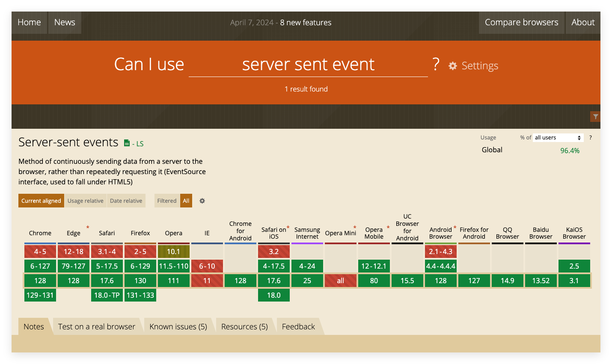
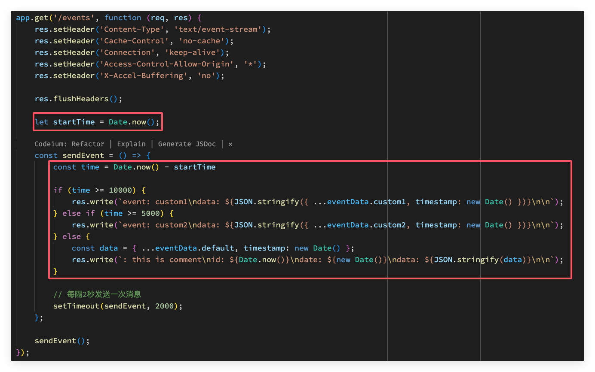
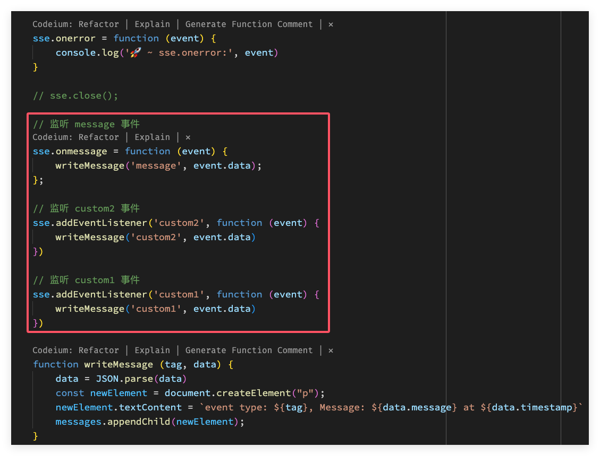

## 简介
在 Web 开发中，实时数据传输的重要性日益增强。无论是股票市场的即时更新、在线聊天应用的实时消息，还是物联网设备的数据流，实时通信都发挥着关键作用。传统的 HTTP 请求-响应模型在处理实时数据时显得不足，而 WebSocket 和 Server-Sent Events（SSE）则是两种常见的解决方案。

### SSE 是什么？
SSE 全称为 Server-sent events , 是一种基于 HTTP 协议的通信技术，允许服务器主动向客户端发送更新。

它是 HTML5 标准的一部分，设计初衷是用来建立一个单向的服务器到客户端连接，使得服务器可以实时地向客户端发送数据。

这种服务端实时向客户端发送数据的传输方式，其实就是流式传输。

### SSE 与 WebSockets 和 HTTP 轮询的区别
| **特性** | **SSE** | **WebSockets** | **HTTP 轮询** |
| -------------- | ---------------------------------------------------- | ------------------------------------------------- | ------------------------------------------------------------ |
| **通信模式** | 单向通信，服务器向客户端推送数据 | 全双工通信，客户端和服务器可以同时发送数据 | 客户端定期发送请求检查服务器数据 |
| **连接管理** | 基于 HTTP 的持久单向连接，支持自动重连和事件 ID 管理 | 独立的 WebSocket 协议，需管理连接的打开和关闭 | 每次轮询都是独立的 HTTP 请求，开销大 |
| **协议和标准** | 基于 HTTP，使用 `text/event-stream` 内容类型推送事件 | 独立的 WebSocket 协议（ws:// 或 wss://） | 使用标准 HTTP 协议，通过反复发送请求轮询 |
| **浏览器支持** | 大多数现代浏览器原生支持，自动处理重连 | 大多数现代浏览器原生支持，需 WebSocket 服务器支持 | 任何支持 HTTP 的浏览器都支持 |
| **应用场景** | 适合单向数据推送场景，如新闻推送、实时通知 | 适合双向实时通信场景，如实时聊天、在线游戏 | 适合实时性要求不高的场景，或不支持 SSE/WebSockets 时的替代方案 |
| **性能和效率** | 持久连接，适用于中等数据量和频率较低场景，比轮询高效 | 双向通信，高频交互下效率更高，但管理更复杂 | 每次请求都是完整的 HTTP 请求，效率最低，开销最大 |


### 适用场景
1. **实时通知和更新**：SSE 非常适合需要服务器向客户端推送实时数据的场景，如新闻推送、体育比分、股票价格更新等。

2. **实时社交媒体通知**：例如在社交平台上，用户收到的新消息提醒、点赞或评论通知，使用 SSE 可以在不刷新页面的情况下，保持数据同步。

3. **日志或进度监控**：SSE 常用于向客户端推送服务器上的实时日志或进程进度更新，特别是在长时间任务的状态更新中（如文件上传、数据处理任务）。

4. **实时仪表盘**：在需要展示实时数据的仪表盘场景下，SSE 可以推送服务器状态、传感器数据、系统健康状况等动态信息。

5. **聊天和消息推送**：虽然 SSE 是单向的，但在一对多的场景下，服务器可以将消息推送给多个客户端用户，如单向的公告消息、实时提醒等。

6. **物联网设备数据更新**：用于物联网场景中，SSE 可以推送来自设备的数据更新，例如传感器数据或环境监控信息。

7. **直播评论**：在视频流或直播平台上，SSE 可以用于推送用户评论或弹幕，使观众能实时看到互动信息。

## SSE 基本原理

SSE 是一种基于 HTTP 协议的服务器推送技术，它通过 HTTP 连接实现服务器向客户端的实时数据推送。SSE 的基本原理如下：

客户端通过 HTTP 连接向服务器发送 SSE 请求。
服务器接收到 SSE 请求后，保持 HTTP 连接不断开，并定期向客户端发送 SSE数据。
客户端接收到 SSE 数据后，可以根据业务需求进行处理。

在 SSE 技术中，服务器和客户端之间的连接是长连接，而不是短连接。这意味着HTTP 连接在发送 SSE 数据后不会立即关闭，而是保持打开状态，直到服务器或客户端主动关闭连接。
SSE 技术使用的是标准的 HTTP 协议，并不需要使用特殊的协议或插件，因此可以在现有的 Web 浏览器中实现。

### SSE 的数据格式
服务器向浏览器发送的 SSE 数据，必须是 UTF-8 编码的文本，具有如下的 HTTP 头信息:
```txt
Content-Type: text/event-stream
Cache-Control: no-cache
Connection: keep-alive
```
`Content-Type` 必须指定 MIME 类型为 `event-steam`
每一次发送的信息，由若干个 message 组成，每个 message之间用 `\n\n` 分隔。每个 message 内部由若干行组成，每一行都是如下格式。
```
[field]: value\n
```
上面的 field 可以取四个值：`data`、`event`、`id`、`retry`

#### data 字段
服务端向客户端推送的数据就放在 data 中，如果数据很长，可以分成多行，每行前面都用 `\n` 结尾，最后一行用 `\n\n` 结尾。比如：
```json
{"message":"Hello World","timestamp":"2024-09-12T22:48:23.599Z"}
```
SSE 的传输格式：
```txt
data: {\n
data: "message":"Hello World",\n
data: "timestamp":"2024-09-12T22:48:23.599Z"\n
data: }\n\n
```

#### id 字段
用于表示数据的，相当于每一条数据的编号。
```txt
id: 100031870159
event: custom
date: Thu Sep 12 2024 17:04:30 GMT+0800 (China Standard Time)
data: {"message":"Hello World","timestamp":"2024-09-12T22:54:30.159Z"}
```

#### event 字段
event 字段表示自定义的事件类型，默认是 `message` 事件。浏览器可以用 `addEventListener` 中监听该事件。
```txt
id: 1000131368488
event: custom
date: Thu Sep 12 2024 16:56:08 GMT+0800 (China Standard Time)
data: {"message":"Hello World","timestamp":"2024-09-12T22:56:08.488Z"}
```
`event: custom` 就是自定义个事件类型，在客户端监听的时候，就直接监听 `custom` 类型。

#### retry 类型
服务器可以用 `retry` 字段，自定义客户端重新发起连接的时间间隔。
```txt
retry: 10000\n  // 10s
```
两种情况会导致浏览器重新发起连接：
- 时间间隔到期。
- 由于网络错误等原因，导致连接出错。


#### `:` 字段
除了上面四个字段外，还有冒号开头的行，表示注释。比如下面：
```
: This is a comment
```
下面是一个例子:
```txt
: this is a comment
id: 1000132214389
event: custom
date: Thu Sep 12 2024 17:10:14 GMT+0800 (China Standard Time)
data: {"message":"Hello World","timestamp":"2024-09-12T22:46:14.389Z"}
```
## SSE 的优势与局限
**优势**：
- SSE 使用 HTTP 协议，现有的服务器软件都支持。 是一个独立协议。

- SSE 属于轻量级，使用简单；WS 协议相对复杂。
- SSE 默认支持断线重连，WebSocket 需要自己实现。
- SSE 一般只用来传送文本，二进制数据需要编码后传送，WS 默认支持传送二进制数据。
- SSE 支持自定义发送的消息类型。

**局限**：
- 服务端单向推送消息，不是全双工可以双向通信。

- 协议不支持二进制传输，需要使用方把现在转成二进制格式。


### SSE 的核心价值

SSE（Server-Sent Events）的核心价值主要体现在以下几个方面：

1. **实时性**: SSE 允许服务器主动向客户端推送数据，而无需客户端不断发起轮询请求。对于需要频繁更新的场景，如通知、数据流更新等，SSE 可以确保客户端实时获取最新数据，提升用户体验。

2. **轻量级和简单实现**: 相比 WebSockets，SSE 更加轻量，基于现有的 HTTP 协议，易于实现，不需要复杂的握手机制和协议处理。只需服务器端推送文本数据，客户端便能轻松接收并处理。

3. **节省资源**: 传统的 HTTP 轮询会频繁发起请求，占用带宽和服务器资源，而 SSE 使用单一的长连接进行数据推送，显著降低了服务器负载和网络资源消耗。

4. **自动重连机制**: SSE 内置了自动重连机制，客户端在连接断开时会自动尝试重新连接，无需额外实现复杂的恢复逻辑。

5. **浏览器支持好**: SSE 是基于 HTTP/1.1 标准的技术，广泛支持各大浏览器，客户端可以轻松通过原生的 `EventSource` API 来实现，与现有的 Web 技术栈兼容性高。

6. **单向推送适用性强**: 对于单向消息推送的场景，如新闻更新、系统通知、实时数据监控等，SSE 非常适合，因为它专注于从服务器向客户端推送数据，而无需复杂的双向通信。

## SSE 的前端实现
EventSource 接口是 web 内容与服务器发送事件通信的接口。

一个 EventSource 实例会对 HTTP 服务器开启一个持久化的连接，以 `text/event-stream` 格式发送事件，此连接会一直保持开启直到通过调用 `EventSource.close()` 关闭。


### 兼容性
从 [can i use](https://caniuse.com/?search=server%20sent%20event) 中可以看出 SSE 的兼容性还是很不错的，除了 IE 和 Opera Mini 外，其他都没问题



在使用的时候也可以通过 in 操作符去检测当前浏览器是否支持 SSE：
```js
if ('EventSource' in window) {
    // ...
}
```

### 创建 SSE 实例
`EventSource()` 构造函数返回一个新建的 `EventSource`，它代表了一个远程资源。
```js
const sse = new EventSource(url);
```
比如：
```js
const sse = new EventSource('http://localhost:3000/events');
```
`url` 可以与当前网址同域，也可以跨域；跨域的时候就要指定第二个参数 `withCredentials` 属性为 `true`。比如：
```js
const sse = new EventSource(url, {withCredentials: true});
```
EventSource 实例的 `readyState` 属性表示当前连接的状态。该属性只读，有三种状态：
- `0(EventSource.CONNECTING)`：表示连接还未建立，或者断线正在重连。
- `1(EventSource.OPEN)`：表示连接已经建立，可以接受数据。
- `2(EventSource.CLOSED)`：表示连接已断，且不会重连。

### 使用 EventSource 监听服务端事件
连接一旦建立，就会触发 `open` 事件，可以在 `onopen` 属性定义回调函数。
```js
sse.onopen = function (event) {
    console.log('🚀 ~ sse.onopen:', event)
}
```
或者使用 `addEventListener` 方法监听：
```js
sse.addEventListener('open', function (event) {
    console.log('🚀 ~ event:', event)
})
```
客户端收到服务器发来的数据，就会触发 `message` 事件，可以在 `onmessage` 属性的回调函数:
```js
sse.onmessage = function (event) {
    const newElement = document.createElement("p");
    const eventObject = JSON.parse(event.data);
    newElement.textContent = `Message: ${eventObject.message} at ${eventObject.timestamp}`
    messages.appendChild(newElement);
};
```

如果发生通信错误（比如连接中断），就会触发 `error` 事件，可以在 `onerror` 属性定义回调函数。
```js
sse.onerror = function (event) {
    console.log('🚀 ~ sse.onerror:', event)
}
```
如果要变比 SSE 连接，可以从 `close` 方法：
```js
sse.close()
```
完整代码如下：
```js
// 服务端代码
import express from 'express';

const app = express();
const PORT = 3000;

app.use(express.static('public'));

app.get('/events', function (req, res) {
    res.setHeader('Content-Type', 'text/event-stream');
    res.setHeader('Cache-Control', 'no-cache');
    res.setHeader('Connection', 'keep-alive');
    res.setHeader('Access-Control-Allow-Origin', '*');
    res.setHeader('X-Accel-Buffering', 'no');

    res.flushHeaders();

    let startTime = Date.now();

    const sendEvent = () => {
        const data = { message: 'Hello World', timestamp: new Date() };
        res.write(`: this is comment\nid: ${Date.now()}\ndate: ${new Date()}\ndata: ${JSON.stringify(data)}\n\n`);

        // 每隔2秒发送一次消息
        setTimeout(sendEvent, 2000);
    };

    sendEvent();
});

app.listen(PORT, () => {
    console.log(`Server running on http://localhost:${PORT}`);
});
```
客户端演示页面的代码：
```html
<!DOCTYPE html>
<html lang="en">
<head>
    <meta charset="UTF-8">
    <title>SSE Example</title>
</head>

<body>
    <h1>Server-Sent Events</h1>
    <div id="messages"></div>

    <script>
        const sse = new EventSource('http://localhost:3000/events');
        const messages = document.getElementById('messages');

        // sse.onopen = function (event) {
        //     console.log('🚀 ~ sse.onopen:', event)
        // }
        sse.addEventListener('open', function (event) {
            console.log('🚀 ~ event:', event)
        })
        sse.onmessage = function (event) {
            const newElement = document.createElement("p");
            const eventObject = JSON.parse(event.data);
            newElement.textContent = `Message: ${eventObject.message} at ${eventObject.timestamp}`
            messages.appendChild(newElement);
        };

        sse.onerror = function (event) {
            console.log('🚀 ~ sse.onerror:', event)
        }

        // sse.close();
    </script>
</body>

</html>
```
### 处理服务端发送的多种事件类型
下面就来模拟多种事件类型，服务端按照时间推送不同的事件类型：`custom1` 和 `custom2`，默认推送的事件类型为 `message`，具体代码如下：
#### 服务端的代码


完整代码如下：

```js
import express from 'express';

const app = express();
const PORT = 3000;

app.use(express.static('public'));

const eventData = {
    custom1: { message: 'this is custom1' },
    custom2: { message: 'this is custom2' },
    default: { message: 'Hello World' }
};

app.get('/events', function (req, res) {
    res.setHeader('Content-Type', 'text/event-stream');
    res.setHeader('Cache-Control', 'no-cache');
    res.setHeader('Connection', 'keep-alive');
    res.setHeader('Access-Control-Allow-Origin', '*');
    res.setHeader('X-Accel-Buffering', 'no');

    res.flushHeaders();

    let startTime = Date.now();

    const sendEvent = () => {
        const time = Date.now() - startTime

        if (time >= 10000) {
            res.write(`event: custom1\ndata: ${JSON.stringify({ ...eventData.custom1, timestamp: new Date() })}\n\n`);
        } else if (time >= 5000) {
            res.write(`event: custom2\ndata: ${JSON.stringify({ ...eventData.custom2, timestamp: new Date() })}\n\n`);
        } else {
            const data = { ...eventData.default, timestamp: new Date() };
            res.write(`: this is comment\nid: ${Date.now()}\ndate: ${new Date()}\ndata: ${JSON.stringify(data)}\n\n`);
        }

        // 每隔2秒发送一次消息
        setTimeout(sendEvent, 2000);
    };

    sendEvent();
});

app.listen(PORT, () => {
    console.log(`Server running on http://localhost:${PORT}`);
});
```

#### 客户端的代码（以浏览器为例）



完整代码如下：

```html
<!DOCTYPE html>
<html lang="en">
<head>
    <meta charset="UTF-8">
    <title>SSE Example</title>
</head>

<body>
    <h1>Server-Sent Events</h1>
    <div id="messages"></div>

    <script>
        const sse = new EventSource('http://localhost:3000/events');
        const messages = document.getElementById('messages');

        // sse.onopen = function (event) {
        //     console.log('🚀 ~ sse.onopen:', event)
        // }
        sse.addEventListener('open', function (event) {
            console.log('🚀 ~ event:', event)
        })

        sse.onerror = function (event) {
            console.log('🚀 ~ sse.onerror:', event)
        }

        // sse.close();

        // 监听 message 事件
        sse.onmessage = function (event) {
            writeMessage('message', event.data);
        };

        // 监听 custom2 事件
        sse.addEventListener('custom2', function (event) {
            writeMessage('custom2', event.data)
        })

        // 监听 custom1 事件
        sse.addEventListener('custom1', function (event) {
            writeMessage('custom1', event.data)
        })

        function writeMessage (tag, data) {
            data = JSON.parse(data)
            const newElement = document.createElement("p");
            newElement.textContent = `event type: ${tag}, Message: ${data.message} at ${data.timestamp}`
            messages.appendChild(newElement);
        }
    </script>
</body>
</html>
```

## 常见问题与解决方案

### 浏览器限制 HTTP1.1 连接上限问题
在主流的edge、chrome、火狐浏览器中，都限制HTTP1.1的连接数上线为6。此限制在 HTTP 规范（RFC2616）中定义。大多数现代浏览器每个域允许六个连接。推荐阅读 [What are Max Parallel HTTP Connections in a Browser?](https://www.geeksforgeeks.org/what-are-max-parallel-http-connections-in-a-browser/)！

意思就是一个浏览器访问相同的域（ip+端口 为一个域）只能开6个，数据浏览器同域并发请求限制，到第7个时开始排队，在这些浏览器中，接收的 SSE 数最多6个。
> 注意，这里是说的是浏览器不是标签页，也就是说，一个浏览器如果开多个标签页，这些标签页的连接总数不能超过6个，第七个就无法连接了。

在一个系统中，如果有多种类型的数据，六个连接数是远不够用的，所以这里提出两个解决办法。
1. 升级 HTTP 协议为 HTTP/2：HTTP/2 协议允许在单个 TCP 连接上进行多路复用，从而避免了 HTTP 1.1 的连接数限制。
2. 服务端开启多个端口：如果一个端口可以有6个 SSE 连接，那么配置10个端口就可以支持60个浏览器连接。前端需要记录当前使用的端口，并在请求路径后附加不同的端口号，当一个端口的连接数达到6个时，切换到下一个端口
3. 使用 ：如果需要更复杂的实时通信，可以考虑使用 WS。
4. 优化现有 SSE 使用：在某些情况下，可能不需要同时打开多个 SSE 连接。通过优化应用逻辑，减少不必要的 SSE 连接，或者在不同的页面或标签页中使用不同的 SSE 连接，可以在不改变技术栈的情况下解决连接限制问题。

### SSE 的跨域问题
跨域是个老生常谈的问题，方案有很多，比如：
- 反向代理
- 在服务器端设置响应头 `Access-Control-Allow-Origin` 来允许特定的外部域访问资源。如果需要支持凭证（如 Cookies），则还需要设置 `Access-Control-Allow-Credentials` 为 `true`。
  ```js
  Access-Control-Allow-Origin: *
  Access-Control-Allow-Credentials: true
  ```
- ...

### 如何处理浏览器不支持 SSE 的情况
#### 使用 Polyfill
在浏览器中检测是否支持：
```js
if('EventSource' in window){
    // support SSE
}
```
在客户端中，如果不支持还有一些第三方的 polyfill：
- [event-source-polyfill](https://github.com/Yaffle/EventSource?spm=5176.28103460.0.0.297c3da2CABnfG)
- [React Native EventSource](https://github.com/binaryminds/react-native-sse)：适配的 react-native 环境的 SSE。
- [flutter_client_sse](https://pub.dev/packages/flutter_client_sse)：适配 Flutter 环境 的 SSE。

#### 提供替代技术
可以使用长轮询或 WebSocket 作为替代方案。长轮询是一种传统的技术，通过定期发送请求来模拟实时通信。WebSocket 则提供了全双工通信能力，可以实现更复杂的实时交互场景。

#### 引导用户升级浏览器
如果可能，可以通过用户界面提示用户其浏览器不支持 SSE，并建议他们升级到支持 SSE 的浏览器版本或者换用浏览器。

## 总结
Server-Sent Events (SSE) 技术，作为实现服务器向客户端推送实时数据的解决方案。SSE 是 HTML5 标准的一部分，通过基于 HTTP 协议的单向数据流传输，使服务器能够实时向客户端发送更新。

相比 WebSocket 和 HTTP 轮询，SSE 更为简单轻量，尤其适用于单向数据推送场景，如新闻更新、实时通知、物联网设备数据等。文章详细介绍了 SSE 的基本原理、数据格式、以及如何在前端通过 EventSource API 实现 SSE，包含了具体的代码示例与步骤。

尽管 SSE 有诸多优势，如与现有 HTTP 兼容、支持断线重连和自定义消息类型等，但它也存在一些局限性，比如不支持双向通信和二进制数据传输。最后还探讨了在实际开发中可能遇到的浏览器连接数限制和跨域问题，并提供了相应的解决方案。
