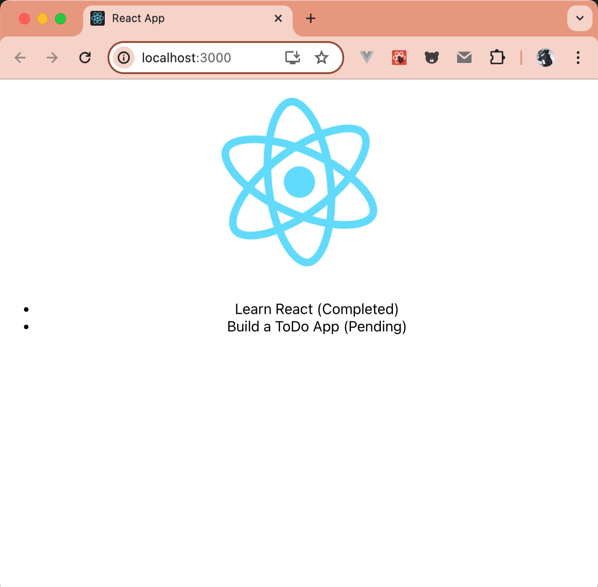

在上一篇文章《[走进 React：打造交互式用户界面的第一步](https://mp.weixin.qq.com/s/s5moMIyYdCSe820C4yWQSw)》中，我们已经对 React 以及其环境搭建有了初步的了解；React是一个极其强大的JavaScript库，专为构建用户界面而生。我们将从 React的基石——JSX 语法开始，探索 React 如何处理事件，然后深入研究 React 的状态管理和生命周期方法。接着我们会进入 React 的一个新领域——Hooks，它为函数组件带来了前所未有的能力。最后，我们会将所学知识实践到一个最小的TODO应用上。

## JSX

### JSX 出现的原因
JSX 出现的主要原因是为了**解决 React 中组件渲染**的问题。在 React 中，用户界面是由组件构造的，而每个组件都可以看作是一个函数。这些组件或函数需要返回一些需要渲染的内容，而这些内容通常是 HTML 元素。

在早期的 JavaScript 中，如果要创建和操作HTML元素，需要使用一些相对较为复杂的 DOM API，这对开发者来说可能并不友好。而 JSX 就是一个 JavaScript 的语法扩展，它使得我们可以在 JavaScript 中直接写HTML（或者说看起来很像HTML）的语法，极大地提高了开发效率，也使得代码更加易读和易维护。

因此，JSX 的出现使得 React 的组件化开发变得更加简单和直观。通过JSX，开发者可以更加专注于组件的逻辑，而不是DOM操作，从而提高开发效率。

React 的一大亮点就是虚拟 DOM：可以在内存中创建虚拟 DOM 元素，由虚拟 DOM 来确保只对界面上真正变化的部分进行实际的 DOM 操作。和真实 DOM 一样，虚拟 DOM 也可以通过 JavaScript 来创建：

```js
const ele = React.createElement('div', null, 'hello, world')
```
虽然通过以上的方式，就可以构建成 DOM 树，但这种代码可读性比较差，于是就有了 JSX 。JSX 是 JavaScript 的语法扩展，使用 JSX ，就可以采用我们熟悉的 HTML 标签形式来创建虚拟 DOM，也可以说 **JSX 是 `React.createElement` 的一个语法糖**。

```html
<!DOCTYPE html>
<html lang="en">

<head>
    <meta charset="UTF-8">
    <meta name="viewport" content="width=device-width, initial-scale=1.0">
    <title>react</title>
</head>

<body>
    <div id="app"></div>
    <script src="https://unpkg.com/@babel/standalone/babel.min.js"></script>
    <script src="https://cdnjs.cloudflare.com/ajax/libs/react/18.3.1/umd/react.development.js"></script>
    <script src="https://cdnjs.cloudflare.com/ajax/libs/react-dom/18.3.1/umd/react-dom.production.min.js"></script>
    <script type="text/babel">
        const container = document.getElementById('app');
        const root = ReactDOM.createRoot(container);
        root.render(<h1>Hello, world</h1>);
    </script>
</body>

</html>
```


### 什么是JSX
**JSX（JavaScript XML），即在 JavaScript 语言里加入类 XML 的语法扩展**。在 React 中，JSX 是一种 JavaScript 的语法扩展。它看起来很像 HTML，允许你在 JavaScript 中直接写 HTML 代码。JSX 能提高代码的可读性，使得你的代码更加直观和易于维护。实际上，**JSX 只是提供了一种创建 React 元素的语法糖**，它最终会被转换到普通的 JavaScript 函数调用和对象。因此，JSX 既是 React 的一个重要特性，也是编写 React 应用的一种推荐方式。有不少初学者对 React 的第一印象就是 JSX 语法，以至于会有这样的误解：
- JSX 就是 React？
- JSX 就是 React 组件？
- JSX 就是另一种 HTML？
- JSX 既能声明视图，又能混入 JS 表达式，那是不是可以把所有逻辑都写在 JSX 里？

总的来说，**React 是一套声明式的、组件化的前端框架**。顾名思义，声明组件是 React 前端开发工作最重要的组成部分。在声明组件的代码中使用了 JSX 语法，JSX 并非 HTML，它也并不代表组件的全部内容。

### 如何使用JSX
- JSX 标签类型
  ```js
  // HTML 类型标签
  const ele = <div>hello, world</div>
  
  // react 组件类型标签
  const component = <HelloWrold />
  ```
  在 JSX 语法中，有两种标签类型：
    - HTML 类型的标签：这种标签名需小写字母开头；
    - 组件类型的标签（在之后的小节会详细介绍组件）：这种标签必须以大写字母开头。

  React 通过标签首字母的大小写来区分渲染的是标签类型。React 中的所有标签，都必须有闭合标签 `/>`

- JSX 中使用 JavaScript 表达式
  在 JSX 中，也可以使用 JavaScript 表达式，只需要使用 `{}` 将表达式包裹起来就行。通常给标签属性传值或通过表达式定义子组件时会用到。例如下面代码：
  ```js
  // 属性传值
  const addUser = {id: 1, name: '添加好友'}
  
  <PanelItem item={addUser} />
  ```
  ```js
  // 通过表达式定义子组件
  const teams = [
    {id: 1, name: '创建高级群'},
    {id: 2, name: '搜索高级群'}
  ]
  
  <ul>
    {teams.map(item => 
        <PanelItem
          item={item}
          key={item.id}/>
    )}
  </ul>
  ```
  > JSX 中使用 JavaScript 表达式时，不能使用多行 JavaScript 语句。

### JSX 的规则
- **只能返回一个根元素**
- **标签必须闭合**
- 自定义 React 组件时，**组件本身采用的变量名或者函数名，需要以大写字母开头**。
- 在 JSX 中编写标签时，HTML 元素名称均为小写字母，**自定义组件首字母务必大写**。
- `props` 属性名称，在 React 中**使用驼峰命名（camelCase），且区分大小写**。

### JSX 元素类型
SX 产生的每个节点都称作 React 元素，它是 React 应用的最小单元；React 元素有四种基本类型：
- React 封装的 DOM 元素，如 `<div></div>`、``等等元素会最终被渲染为真实的 DOM；
- React 组件渲染的元素，如 `<App />`，这部分元素会调用对应组件的渲染方法；
- React Fragment 元素，`<React.Fragment></React.Fragment>` 或者简写成 `<></>`，这一元素没有业务意义，也不会产生额外的 DOM，主要用来将多个子元素分组。
- React 中内置的一些有实际作用的组件：`<Suspense></Suspense>`、`<Profiler></Profiler>`、`<StrictMode></StrictMode>`等，他们不会将其直接渲染在 DOM 中。

### JSX 的属性设置

React 对 DOM 元素的封装实际上是对整个浏览器 DOM 的一次 React 化标准化。例如，HTML 中容易引发混淆的 `readonly="true"`，其W3C标准应为 `readonly="readonly"`，而常被误用的 `readonly="false"` 实际上没有效果。但在 React 的 JSX 中，这就统一为 `readOnly={true}` 或 `readOnly={false}`，这更接近JS的开发习惯。而对于样式中的 `className="container"`，主要是因为 HTML 标签中的 class 是 JS 的保留字，所以需要避免使用。

在 React 组件渲染的元素中，JSX 的 props 应与自定义组件定义中的 props 相对应；如果没有特殊处理，那些没有对应 props 的元素会被忽略。这也是开发 JSX 时常会遇到的一个错误，那就是在组件定义中更改了 props 的属性名，但忘记了更改对应的 JSX 元素中的 props，导致子组件无法获取属性值。对于 Fragment 元素，它是没有 props 的。

### JSX 子元素类型
JSX元素可以定义子元素。这里有一个重要的概念要理解：**并非所有子元素都是子组件，但所有子组件一定都是子元素**。

子元素的类型包括：
- 字符串，最终会被渲染成 HTML 标签里的字符串；
- 另一段 JSX，会嵌套渲染；
- JS 表达式，会在渲染过程中执行，并让返回值参与到渲染过程中；
- 布尔值、`null` 值、`undefined` 值，不会被渲染出来；
- 以上各种类型组成的数组。

- 字符串：最终会被渲染成 HTML 标签里的字符串。例如：
  ```jsx
  <div>Hello World!</div>
  ```
- 另一段JSX：会嵌套渲染。例如：
  ```jsx
  <div><p>Hello World!</p></div>
  ```
- JS 表达式：会在渲染过程中执行，并让返回值参与到渲染过程中。例如：
  ```jsx
  <div>{1+2}</div> // 渲染结果为：3
  ```
- 布尔值、`null` 值、`undefined` 值：这些值在 JSX 中不会被渲染出来。例如：
  ```jsx
  <div>{null}</div> // 不会渲染任何内容
  <div>{undefined}</div> // 不会渲染任何内容
  <div>{false}</div> // 不会渲染任何内容
  ```
- 以上各种类型组成的数组：例如：
  ```jsx
  <div>
    {['Hello', <p>World</p>, 1+2, null, undefined, false]}
  </div>
  ```
  以上代码会渲染出 `"Hello"`，一个包含 `"World"` 的段落元素，以及数字3。`null`、`undefined` 和 `false` 不会被渲染。

### JSX 中的 JS 表达式
在JSX中，我们可以嵌入JavaScript表达式，这些表达式被大括号 `{ }` 包围。这主要在两个方面被应用：
- 作为属性（Props）的值，也就是紧跟在 `=` 覆符号后的属性。
  ```jsx
  let myClass = "my-css-class";
  <div className={myClass}></div>
  ```
  在这个例子中，我们定义了一个变量myClass，并用大括号把它作为className属性的值。
- 作为JSX元素的子元素，比如标签内的文本或者JS表达式结果。
  ```jsx
  let text = "Hello, JSX!";
  <div>{text}</div>
  ```
  在这个例子中，我们定义了一个变量text，并用大括号把它作为div元素的子元素。

JSX是声明性的，因此其内部不应包含命令式的语句，例如 if ... else ...。当你不确定JSX { } 里的代码是否是表达式时，你可以尝试将这部分代码直接赋值给一个JS变量。如果赋值成功，那么它就是一个表达式；如果赋值失败，那么你可以从以下四个方面进行检查：
- 是否有语法错误。
- 是否使用了for...of的声明式变体array.forEach ，这个中招几率比较高。
- 是否没有返回值。
- 是否有返回值，但不符合 props 或者子元素的要求。

有个 props 表达式的特殊用法：[展开语法](https://developer.mozilla.org/zh-CN/docs/Web/JavaScript/Reference/Operators/Spread_syntax)，`<Button {...defaultProps}>` 利用的 JavaScript 中的展开语法把 `defaultProps` 这个对象的所有属性都传给 `Button` 这个组件。

### JSX 中使用注释
如果你尝试在JSX中使用HTML的注释方法，你会发现它无法通过编译。因此，你需要使用 {/* 这是注释 */} 的格式来添加注释。在编译过程中，这种格式的注释会自动被识别为JS注释。
```jsx
const App = () => {
    const handleClick = () => {
        console.log('click');
    };
    return (
        <div>
            {/* 这个是注释 */}
            <button onClick={handleClick}>click me</button>
        </div>
    );
};

export default App;
```

## React 中的组件
在我们已经初步理解了JSX的基础上，接下来我们将探讨什么是组件，以及JSX与React组件的关系是什么。
组件化开发现已经成为前端开发的主流方法，几乎所有的前端框架都包含了组件的概念。在一些框架中，它被称为"Component"，而在其他一些中则被称为"Widget"。然而在React中，组件被视为前端应用的核心。

### 什么是 react 组件
**组件是对视图以及与视图相关的逻辑、数据、交互等的封装**。如果没有组件这层封装，这些代码将有可能四散在各个地方，低内聚，也不一定能低耦合，这种代码往往难写、难读、难维护、难扩展。

React 组件层次结构从一个根部组件开始，一层层加入子组件，最终形成一棵组件树。


这棵树由节点组成，每个节点代表一个组件。例如，App、FancyText、Copyright 等都是树中的节点。

在 React 渲染树中，根节点是应用程序的 根组件。在这种情况下，根组件是 App，它是 React 渲染的第一个组件。树中的每个箭头从父组件指向子组件。

### JSX 与 React 组件的关系
JSX就是React组件的语法糖，它让我们可以使用类似于HTML的语法来定义React组件。在React中，我们通常使用JSX来描述组件的UI结构。当我们编写JSX代码时，实际上我们是在定义React组件的渲染输出。

例如，我们可以定义一个名为"HelloWorld"的React组件，使用JSX来描述它的UI：
```jsx
function HelloWorld() {
  return <h1>Hello, world!</h1>;
}
```
在上述代码中，`<h1>Hello, world!</h1>` 就是 JSX。当 React 渲染这个`HelloWorld` 组件时，它会将 JSX 转换为相应的 HTML，然后将其插入到 DOM 中。

## 组件的类型
组件化开发已经成为前端开发的主流趋势，市面上大部分前端框架都包含组件概念，有些框架里叫 Component，有些叫 Widget。在React框架中，主要有两种类型的组件：类组件和函数组件。**类组件通常用于需要内部状态或生命周期方法的复杂情况，而函数组件则适用于无状态的、更简单的情况**。但是**从React 16.8版本开始，借助React Hooks，函数组件也可以拥有状态和生命周期方法**。
每种组件类型都有其优势和适用场景，理解它们的作用和差异是成为一名高效的开发者的关键

### 类组件
在React中，类组件是一种可以包含状态和生命周期方法的组件类型。类组件是ES6的类，它们继承自 `React.Component` 或 `React.PureComponent`。

要定义一个 React 类组件，你需要扩展内置的 Component 类并定义一个 `render()` 方法。React 会在需要确定屏幕上显示什么内容时调用你的 render 方法。

例如：
```jsx
import { Component } from 'react';

//类组件是由继承与React的Component基类构建
class Greeting extends Component {
    render() {
        return <h1>Greeting, friend! How are you today?</h1>;
    }
}
```
类组件在定义是，同样可以使用属性：
```jsx
import { Component } from 'react';

class Greeting extends Component {
    render() {
        return <h1>Greeting, {this.props.name}!</h1>;
    }
}
```
在类组件中，通过 `this` 对象访问其自身 `props` 属性对象。

通过类组件构造 React 元素时，也可以为其指定属性赋值：
```jsx
function App() {
    return (
        <div className="App">
            <header className="App-header">
                <p>hello world！！！</p>
            </header>
            <Greeting name="Newton" />
        </div>
    );
}
```
完整代码如下（[github 中查看源码](https://github.com/clin211/react-awesome/commit/9c18da7bda840a53e507c1dce1681cfc6f0699b5)）：
```jsx
import { Component } from 'react';
import './App.css';

class Greeting extends Component {
    render() {
        return <h1>Greeting, {this.props.name}!</h1>;
    }
}

function App() {
    return (
        <div className="App">
            <header className="App-header">
                <p>hello world！！！</p>
            </header>
            <Greeting name="Newton" />
        </div>
    );
}

export default App;
```
运行效果如下：


类组件还可以跟踪它们的状态（state），并使用状态更新来触发重新渲染。这使得类组件非常适合用于需要内部状态管理的复杂组件。

### 函数组件
将 UI 拆分成独立的、可复用的代码片段，并对每个代码片段进行单独处理。在 React 中，有两类常用的组件：函数组件（也叫无状态组件）和类组件（也叫 class 组件）；然而，目前 React 官方以及社区的发展趋势，已经开始更多地推荐和支持使用函数组件，而不是类组件。因此，我们接下来的学习和探索，将主要围绕函数组件进行。

React 组件是一段可以使用标签进行扩展 的 JavaScript 函数。如下所示（你可以编辑下面的示例）：
```jsx
function Profile() {
    return (
        
    );
}
```
完整代码如下（[github 中查看源码](https://github.com/clin211/react-awesome/commit/f284ad42b8f3de3cbf2f4f19e933bb6384722cd3)）：
```jsx
import { Component } from 'react';
import './App.css';

class Greeting extends Component {
    render() {
        return <h1>Greeting, {this.props.name}!</h1>;
    }
}

function Profile() {
    return (
        
    );
}

function App() {
    return (
        <div className="App">
            <header className="App-header">
                <p>hello world！！！</p>
            </header>
            <Greeting name="Newton" />
            <Profile />
        </div>
    );
}

export default App;
```

效果图如下：


函数组件在某些方面可以替代类组件，它们的语法更为简洁明了。然而，函数组件面临着两个主要的挑战：

- 缺乏内部状态（state）
- 缺乏生命周期方法

这两个问题在某些情况下可能会限制函数组件的使用。但值得注意的是，自从 React 16.8 引入 Hooks 功能后，函数组件现在也可以拥有状态和生命周期方法，这大大增强了函数组件的功能性和灵活性。

## state 与 props
在上述两个例子中，我们都提到了状态（state）和 props，并且在类组件中我们还使用了 props；那究竟什么是state和props呢？

### props
**React 组件使用 props 相互通信。props 是父组件向子组件传递数据的方式**。无论是函数组件还是类组件，都可以接收 props。props 是只读的，也就是说：**子组件不能修改父组件传递过来的 props**。props 可能会让您想起 HTML 属性，**可以传递任何 JavaScript 值，包括对象、数组和函数**。

#### 将 props 传递给组件
在下面这段代码中，Profile 组件没有向其子组件 Avatar 传递任何参数：
```jsx
function Avatar() {
    return (
        
    );
}

export default function Profile() {
    return <Avatar />;
}
```
类组件写法如下：
```jsx
class Avatar extends Component {
    render() {
        return (
            
        );
    }
}

class Profile extends Component {
    render() {
        return (<Avatar />);
    }
}
```

如果要给 Avatar 组件添加参数，可以经过下面的流程：
1. 将 props 传递给子组件

    可以给 `Avatar` 组件传递两个 props，一个 `person` 和 `size`：
    ```jsx
    export default function Profile() {
        return (
            <Avatar
                person={{ name: 'Lin Lanying', imageId: '1bX5QH6' }}
                size={100}
            />
        );
    }
    ```
    类组件的写法就是：
    ```jsx
    class Profile extends Component {
        render() {
            return <Avatar person={{ name: 'Lin Lanying', imageId: '1bX5QH6' }} />;
        }
    }
    ```
2. 读取子组件内部的 props

    ```jsx
    function Avatar({ person, size }) {
        return (
            
        );
    }
   
    export default function Profile() {
        return (
            <div>
                <Avatar
                    size={100}
                    person={{
                        name: 'Katsuko Saruhashi',
                        imageId: 'YfeOqp2',
                    }}
                />
                <Avatar
                    size={80}
                    person={{
                        name: 'Aklilu Lemma',
                        imageId: 'OKS67lh',
                    }}
                />
                <Avatar
                    size={50}
                    person={{
                        name: 'Lin Lanying',
                        imageId: '1bX5QH6',
                    }}
                />
            </div>
        );
    }
   
    function getImageUrl(person, size = 's') {
        return 'https://i.imgur.com/' + person.imageId + size + '.jpg';
    }
    ```
    类组件的写法：
    ```jsx
    import React, { Component } from 'react';
    class Avatar extends Component {
        render() {
            const { person, size } = this.props;
            return (
                
            );
        }
    }
   
    export default class Profile extends Component {
        render() {
            return (
                <>
                    <Avatar
                        size={100}
                        person={{
                            name: 'Katsuko Saruhashi',
                            imageId: 'YfeOqp2',
                        }}
                    />
                    <Avatar
                        size={80}
                        person={{
                            name: 'Aklilu Lemma',
                            imageId: 'OKS67lh',
                        }}
                    />
                    <Avatar
                        size={50}
                        person={{
                            name: 'Lin Lanying',
                            imageId: '1bX5QH6',
                        }}
                    />
                </>
            );
        }
    }
   
    function getImageUrl(person, size = 's') {
        return 'https://i.imgur.com/' + person.imageId + size + '.jpg';
    }
    ```
    效果图如下：
   
   
    完整代码可访问：[github 中查看源码](https://github.com/clin211/react-awesome/commit/e7df0a7ef6adb9849d9307e203f0ddc8beff8965)，[函数组件的源文件](https://github.com/clin211/react-awesome/commit/e7df0a7ef6adb9849d9307e203f0ddc8beff8965#diff-5b783b9bfb89dcb91609726ee01eae5e6a7c66aba62839bd382e5d5f79a34d57)、[类组件的源文件](https://github.com/clin211/react-awesome/commit/e7df0a7ef6adb9849d9307e203f0ddc8beff8965#diff-0ad684c92858f8c01de1987e72caa21ff4988c01070a24042fb20d38df57b767)。
   
   
    还可以给 prop 指定默认值
    ```jsx
    function Avatar({ person, size = 100 }) {
        // ...
    }
    ```
     如果 <Avatar person={...} /> 渲染时没有 `size` prop，`size` 将被赋值为 100。
   
    默认值仅在缺少 `size` prop 或 `size={undefined}` 时生效。 但是**如果你传递了 `size={null}` 或 `size={0}`，默认值将 不 被使用**。
   
#### 将 JSX 作为子组件传递（组件嵌套）
嵌套浏览器内置标签是很常见的：
```html
<main>
    <header>
        <nav></nav>
    </header>
    <aside>
        <section></section>
    </aside>
    <article>
        <section></section>
    </article>
    <footer></footer>
</main>
```
有时你会希望以相同的方式嵌套自己的组件：
```jsx
<Card>
    <Avatar />
</Card>
```
当您将内容嵌套在 JSX 标签中时，父组件将在名为 `children` 的 props 中接收到该内容。例如，下面的 `Card` 组件将接收一个被设为 `<Avatar />` 的 `children` prop 并将其包裹在 div 中渲染（[github 中查看源码](https://github.com/clin211/react-awesome/commit/65ae22fc2bd6f5c8906e76d1586bbd34bad97ef4)）：
```js
function Card({ children }) {
    return <div className="card">{children}</div>;
}

function Avatar({ person, size }) {
    return (
        
    );
}

export default function Profile() {
    return (
        <Card>
            <Avatar
                size={100}
                person={{
                    name: 'Katsuko Saruhashi',
                    imageId: 'YfeOqp2',
                }}
            />
        </Card>
    );
}

function getImageUrl(person, size = 's') {
    return 'https://i.imgur.com/' + person.imageId + size + '.jpg';
}
```
效果如下图：


### state
在 React 中，state 是组件内部管理和存储数据的一种机制。理解 React 中的 state 非常重要，因为它决定了组件的状态和行为，直接影响到组件的渲染和交互。

state 是一个 JavaScript 对象，用于存储组件的内部数据；每个组件可以有自己的 state，用来描述组件当前的状态。

**作用**：
- 状态管理：通过 state 可以跟踪和管理组件的变化和交互。
- 数据驱动渲染：当 state 发生变化时，React 会重新渲染组件，以反映最新的状态。

**使用场景**：
- 存储和更新组件的动态数据。
- 控制组件的行为和外观。
- 响应用户输入和事件。

### 如何使用 State

#### 初始化 State

- 在类组件中，通过构造函数初始化 state。
  ```jsx
  class MyComponent extends React.Component {
      constructor(props) {
          super(props);
          this.state = {
              count: 0,
              name: 'John',
          };
      }
      // ...
  }
  ```
- 在函数式组件中，使用 useState hook 来初始化 state。
  ```js
  function MyComponent() {
      const [count, setCount] = useState(0);
      const [name, setName] = useState('John');
  
      // ...
  }
  ```
#### 访问 State
- 在类组件中，使用 this.state.propertyName 访问 state 中的属性。
  ```jsx
  render() {
      return <p>Hello, {this.state.name}!</p>;
  }
  ```
- 在函数式组件中，直接使用 state 变量。
  ```jsx
  return <p>Hello, {name}!</p>;
  ```
#### 更新 State
- 在 React 中，不直接修改 state。而是使用 setState 方法来更新 state。
  ```jsx
  this.setState({ count: this.state.count + 1 });
  ```
- 在函数式组件中，使用 useState hook 返回的更新函数。
  ```jsx
  setCount(count + 1);
  ```
#### 异步更新
- `setState` 是异步的，因此 React 可以批量更新状态以提高性能。如果需要基于先前的 state 更新，可以使用函数形式的 `setState`。
  ```jsx
  this.setState(prevState => ({
      count: prevState.count + 1
  }));
  ```
  完整代码如下：
- 类组件
  ```jsx
  class MyComponent extends React.Component {
      constructor(props) {
          super(props);
      }
  
      state = {
          count: 0,
          name: 'John',
      };
      render() {
          return (
              <div>
                  <p>{this.state.count}</p>
                  <p>{this.state.name}</p>
              </div>
          );
      }
  }
  ```
- 函数组件
  ```jsx
  function MyComponent() {
      const [count, setCount] = useState(0);
      const [name, setName] = useState('John');
  
      return (
          <div>
              <p>{count}</p>
              <p>{name}</p>
          </div>
      );
  }
  ```

## 生命周期
通过上面的例子，我们知道 React 会把状态的变更更新到 UI，然后页面显示的内容更新，状态的变更过程必然会经历组件的生命周期。首先要知道所谓**生命周期，就是组件从开始生成到最后消亡的过程， React 通常将组件生命周期分为三个阶段：装载、更新和卸载**，我们怎么能确定组件进入到了哪个阶段呢？通过 React 组件暴露给我们的钩子函数就可以知晓。接下来我们将一起学习 React 组件的生命周期。

**16.3 版本之前**：


**16.3 版本**：

**16.4 及之后**：


通过上面的图片，我们可以看到 getDerivedStateFromProps 在 React v16.4 中有一定的改动，这个函数会在每次 render 之前被调用，也就意味着即使你的 props 没有任何变化，由父组件的 state 的改动导致的 render，这个生命周期依然会被调用，使用的时候需要注意。

根据上面的图片可以看出，在 React v16.4 中，`getDerivedStateFromProps` 方法有了一些改动。现在，这个生命周期方法在每次组件即将渲染之前都会被调用，不再只在接收新 `props` 时触发。这意味着，即使组件的 `props` 没有实际变化，只要父组件的 `state` 发生改变导致重新渲染，这个生命周期方法也会被执行。因此，在使用时需要特别注意这一点。


### 挂载阶段

挂载阶段组件被创建，然后组件实例插入到 DOM 中，完成组件的第一次渲染，该过程只会发生一次，在此阶段会依次调用以下这些方法：

- `constructor`
- `getDerivedStateFromProps`
- `render`
- `componentDidMount`

#### constructor
组件的构造函数是第一个被执行的部分。如果我们显式定义了构造函数，就必须在其中调用 `super(props)`，这样才能确保在构造函数内部正确获取到 `this`。这涉及到了 ES6 类的继承机制，详细内容可以参考阮一峰的[《ECMAScript 6 入门》](https://es6.ruanyifeng.com/#docs/class-extends)。

在构造函数里一般会做两件事：
- 初始化组件的 `state`
- 给事件处理方法绑定 `this`
```jsx
constructor(props) {
    super(props);
    // 不要在构造函数中调用 setState，可以直接给 state 设置初始值
    this.state = { counter: 0 };
    this.handleClick = this.handleClick.bind(this);
}
```

#### getDerivedStateFromProps
这是一个静态方法，因此不能在其内部使用 `this`。它接收两个参数：
- `props` 接收到的新属性
- `state` 当前组件的状态对象

该方法应返回一个对象，用于更新当前的状态对象；如果不需要更新，则返回 `null`。这个方法会在组件挂载时或者接收到新的 `props`、或调用了 `setState` 和 `forceUpdate` 时被调用。例如，当我们接收到新的属性并希望更新状态时，可以在此方法内进行处理。
```jsx
// 当 props.counter 变化时，赋值给 state
class App extends React.Component {
    constructor(props) {
        super(props);
        this.state = {
            counter: 0,
        };
    }
    static getDerivedStateFromProps(props, state) {
        // 如果 props.counter 变化了，那么就返回新的 state
        if (props.counter !== state.counter) {
            return {
                counter: props.counter,
            };
        }
        return null;
    }

    handleClick = () => {
        this.setState({
            count: this.state.count + 1,
        });
    };

    render() {
        return (
            <div>
                <p>Count: {count}</p>
                <button onClick={this.handleClick}>Increment</button>
            </div>
        );
    }
}
```
现在我们可以显式传入 `counter`，但出现了一个小问题：如果我们希望通过点击事件来增加 `state.counter` 的值，会发现它始终保持着 `props` 传入的初始值，没有发生任何变化。这是因为在 React 16.4 及更高版本中，`setState` 和 `forceUpdate` 也会触发 `getDerivedStateFromProps` 生命周期方法。因此，当组件内部的状态发生变化时，会再次调用该方法，并将状态值重置为 `props` 的值。为了解决这个问题，我们需要在 `state` 中添加一个额外的字段来记录之前的 `props` 值。
```jsx
import React from 'react';

export default class GetDerivedStateFromProps extends React.Component {
    constructor(props) {
        super(props);
        this.state = {
            // 增加一个 preCounter 来记录之前的 props 传来的值
            preCounter: 0,
            counter: 0,
        };
    }
    static getDerivedStateFromProps(props, state) {
        // 如果 props.counter 变化了，那么就返回新的 state
        if (props.counter !== state.preCounter) {
            return {
                counter: props.counter,
                preCounter: props.preCounter,
            };
        }
        return null;
    }

    handleClick = () => {
        this.setState({
            count: this.state.count + 1,
        });
    };

    render() {
        return (
            <div>
                <p>Count: {count}</p>
                <button onClick={this.handleClick}>Increment</button>
            </div>
        );
    }
}
```
效果如下：


上面示例完整代码请访问 github 的 getDerivedStateFromProps 实践 [github lifecycle](https://github.com/clin211/react-awesome/commit/8215e2944038bc2e4b040c089f0f10789be11daf)

#### render

React 中最核心的方法是 `render` 方法。一个 React 组件必须包含 `render` 方法，它根据组件的状态 `state` 和属性 `props` 来决定返回什么内容，从而渲染组件到页面上。

在 `render` 方法中，通常会返回以下类型中的一个：

- **React 元素**：包括原生的 DOM 元素或者其他 React 组件。
- **数组和 Fragment**（片段）：可以返回多个元素作为一个整体。
- **Portals**（插槽）：可以将子元素渲染到不同的 DOM 子树中。
- **字符串和数字**：会被渲染成 DOM 中的文本节点。
- **布尔值或** `null`：表示不渲染任何内容。

例如：

```jsx
import React, { Component } from 'react';

class MyComponent extends Component {
  constructor(props) {
    super(props);
    this.state = {
      count: 0
    };
  }

  render() {
    const { count } = this.state;
    return (
      <div>
        <p>Count: {count}</p>
        <button onClick={() => this.setState({ count: count + 1 })}>increment</button>
      </div>
    );
  }
}

export default MyComponent;
```
#### componentDidMount

在组件挂载后调用 `componentDidMount` 方法时，我们可以获取到 DOM 节点并进行操作，例如对 canvas、svg 进行绘制，或者发起服务器请求等操作。

然而，需要注意的是，**在 `componentDidMount` 中调用 `setState` 会触发一次额外的渲染过程，导致多一次 `render` 方法的执行**。尽管这次渲染是在浏览器刷新屏幕前进行的，用户通常不会察觉到，但在开发过程中，应尽量避免这种做法以避免潜在的性能问题。为了优化性能，我们应该尽早在 `constructor` 中初始化组件的 `state` 对象，而不是在 `componentDidMount` 中进行状态的初始化操作。

在组件挂载之后，将计数数字变为10。
```jsx
import React from 'react';

export default class ComponentDidMount extends React.Component {
    constructor(props) {
        super(props);
        this.state = {
            counter: 0,
        };
    }
    componentDidMount() {
        this.setState({
            counter: 10,
        });
    }
    render() {
        return <div className="counter">counter值: {this.state.counter}</div>;
    }
}
```

可以看到 counter 的值变为了 10：


### 更新阶段

当组件的 props 改变了，或者组件内部调用了 setState 或 forceUpdate 方法，都会触发更新和重新渲染的过程。在这个阶段，React 组件会按照以下顺序依次调用这些方法：
- `static getDerivedStateFromProps(nextProps, prevState)`: 当 props 发生变化时调用，用于根据新的 props 更新组件的状态。这个静态方法返回一个对象来更新状态，或者返回 `null` 表示不需要更新状态。

- `shouldComponentUpdate(nextProps, nextState)`: 在重新渲染之前调用，用于判断是否需要重新渲染组件。默认返回 `true`，可以根据新的 props 和 state 来进行优化判断，避免不必要的渲染。

- `render()`: 根据最新的 props 和 state 返回需要渲染的 React 元素、数组、Fragment、Portals、字符串、数字或 `null`。

- `getSnapshotBeforeUpdate(prevProps, prevState)`: 在最终渲染之前调用，用于获取更新前的 DOM 状态。它的返回值将作为 `componentDidUpdate` 方法的第三个参数传递给后者，常用于处理 DOM 更新前后的差异。

- `componentDidUpdate(prevProps, prevState, snapshot)`: 在组件更新完成后调用，可以执行与更新后的 DOM 交互的操作。通常用于处理网络请求、手动操作 DOM 或者更新状态的逻辑。

这些方法协同工作，确保 React 组件能够响应外部变化，并及时更新用户界面。

#### getDerivedStateFromProps
这个方法在挂载阶段已经说过了，这里不再赘述，记住在更新阶段，**无论接收到新的 props，还是调用了 `setState` 或者 `forceUpdate`，这个方法都会被触发**。

#### shouldComponentUpdate
```jsx
shouldComponentUpdate(nextProps, nextState)
```
在讲这个生命周期函数之前，我们先来探讨两个问题：
1. setState 函数在任何情况下都会导致组件重新渲染吗？例如下面这种情况：
  ```js
  this.setState({number: this.state.number})
  ```
2. 如果没有调用 setState，props 值也没有变化，是不是组件就不会重新渲染？

我们先探讨上面两个问题：

第一个问题：**当 setState 被调用时，React 会更新组件的状态并重新渲染组件。setState 会合并新的状态对象到当前状态，然后触发 render 方法。** 这是 React 的默认行为，用于确保组件反映最新的状态和 props。

当然也有特殊情况，**如果在 setState 中更新的状态与当前状态相同，React 可能会跳过重新渲染。** 在这种情况下，setState 被调用了，但是状态对象 { number: this.state.number } 与之前的状态相同。React 进行状态合并后，发现新的状态和之前的状态没有变化，默认情况下，React 会优化跳过 render 调用，避免不必要的渲染。这种优化有助于提升性能，避免不必要的计算和 DOM 操作。

第二个问题：**如果是父组件重新渲染时，不管传入的 props 有没有变化，都会引起子组件的重新渲染**。那么有没有什么方法解决在这两个场景下不让组件重新渲染进而提升性能呢？

React 通过以下机制来优化和控制组件的重新渲染：
- **浅比较（Shallow Compare）**：

  React 在内部会对新的状态和旧的状态进行浅比较。只有当比较结果不同时，React 才会决定更新组件。因此，如果传递给 setState 的对象和当前状态对象是相同的，React 就会跳过渲染。

- **shouldComponentUpdate 方法**：

  在类组件中，你可以通过覆盖 `shouldComponentUpdate` 方法来自定义渲染行为。,这个生命周期函数是用来提升速度的，它是在重新渲染组件开始前触发的，默认返回 `true`，我们可以比较 `this.props` 和 `nextProps` ，`this.state` 和 `nextState` 值是否变化，来确认返回 `true` 或者 `false`。当返回 `false` 时，组件的更新过程停止，后续的 `render`、`componentDidUpdate` 也不会被调用。
  ```jsx
  import React, { Component } from 'react';

  class ShallowCompare extends Component {
      constructor(props) {
          super(props);
          this.state = {
              number: 1,
          };
      }

      updateNumber = () => {
          this.setState({ number: this.state.number }, () => {
              console.log('updated state:', this.state);
          });
      };

      componentDidMount() {
          console.log('updated number');
      }

      shouldComponentUpdate(nextProps, nextState) {
          // 仅当 state 中的 number 改变时才重新渲染组件
          return nextState.number !== this.state.number;
      }

      render() {
          console.log('render called');
          return (
              <div>
                  <p>Number: {this.state.number}</p>
                  <button onClick={this.updateNumber}>Update Number</button>
              </div>
          );
      }
  }

  export default ShallowCompare;
  ```
  上面代码中，每次执行 `render` 和 `componentDidMount` 中都打印了一句调试代码，但是从执行结果来看，每次setState 执行了，但是 `render` 和 `componentDidMount` 中的打印都没有执行，效果如下图：
  

- **React.PureComponent**：

  React 提供了 `PureComponent`，它是 `Component` 的一个替代品，并且自动实现了 `shouldComponentUpdate`，对 `props` 和 `state` 进行浅比较。如果你的组件只依赖于简单的状态和 `props`，这可以减少渲染次数，提高性能。
  ```jsx
  import React from 'react';
  
  class PureComponent extends React.PureComponent {
      constructor(props) {
          super(props);
          this.state = {
              number: 1,
          };
      }
  
      updateNumber = () => {
          this.setState({ number: this.state.number }, () =>
              console.log('set stated number')
          );
      };
  
      render() {
          console.log('render called');
          return (
              <div>
                  <p>Number: {this.state.number}</p>
                  <button onClick={this.updateNumber}>Update Number</button>
              </div>
          );
      }
  }
  
  export default PureComponent;
  ```
  同样是在 `setState` 和 `render` 中打印了调试代码，然后点击按钮后，每次都执行了 `setState`，但是 `render` 却没有重新渲染，效果图如下：
  


- **函数组件和 React.memo**
  对于函数组件，React 提供了 `React.memo` 来进行类似 `PureComponent` 的优化。`React.memo` 可以避免函数组件在接收到相同的 props 时重新渲染：
  ```jsx
  import React from 'react';
  
  const Memo = React.memo(() => {
      const [number, setNumber] = React.useState(1);
  
      const updateNumber = () => {
          setNumber(prevNumber => prevNumber); // 不会触发重新渲染
      };
  
      console.log('render called');
      return (
          <div>
              <p>Number: {number}</p>
              <button onClick={updateNumber}>Update Number</button>
          </div>
      );
  });
  
  export default Memo;
  ```
  上面代码中用到了 Hooks，后面的内容会介绍到。

#### render
同样更新阶段也会触发该方法，挂载阶段已经介绍过，不再重复介绍。

#### getSnapshotBeforeUpdate
```jsx
getSnapshotBeforeUpdate(prevProps, prevState)
```
这个方法在 `render` 之后，`componentDidUpdate` 之前调用，有两个参数 `prevProps` 和 `prevState`，表示更新之前的 `props` 和 `state`，这个函数必须要和 `componentDidUpdate` 一起使用，并且要有一个返回值，默认是 `null`，这个返回值作为第三个参数传给 `componentDidUpdate`。

**典型用途**

**生命周期 `getSnapshotBeforeUpdate` 通常用于需要在 DOM 更新前获取一些信息的场景，特别是当你需要在更新前后对比某些状态时**。常见的场景包括：

- 保持滚动位置：在更新内容之前获取当前的滚动位置，确保内容更新后可以恢复到合适的滚动位置。
- 动画同步：在组件更新前获取动画的状态或某些元素的位置，以便在 `componentDidUpdate` 中对它们进行调整。
- 测量或计算：需要在 DOM 更新前测量某些元素的尺寸、位置等，以便在 `componentDidUpdate` 中根据这些信息做进一步处理。

以下是一个使用 `getSnapshotBeforeUpdate` 来保持滚动位置的简单示例：
```jsx
import React, { Component } from 'react';

class GetSnapshotBeforeUpdate extends Component {
    constructor(props) {
        super(props);
        // 创建一个引用来访问 DOM 元素
        this.chatContainerRef = React.createRef();
        this.state = {
            // 初始状态为空消息列表
            messages: [],
        };
    }

    // 假设消息通过某些外部操作或 props 添加到组件中
    componentDidUpdate(prevProps, prevState, snapshot) {
        if (snapshot !== null) {
            // 使用快照值恢复滚动位置
            this.chatContainerRef.current.scrollTop =
                this.chatContainerRef.current.scrollHeight - snapshot;
        }
    }

    getSnapshotBeforeUpdate(prevProps, prevState) {
        // 只有在消息有变化时才获取快照
        if (prevState.messages.length < this.state.messages.length) {
            const chatContainer = this.chatContainerRef.current;
            // 计算从底部开始的滚动位置
            return chatContainer.scrollHeight - chatContainer.scrollTop;
        }
        return null; // 如果没有新的消息，返回 null
    }

    render() {
        return (
            <div
                ref={this.chatContainerRef}
                style={{ height: '300px', overflowY: 'auto' }}>
                {this.state.messages.map((msg, index) => (
                    <div key={index}>{msg}</div>
                ))}
            </div>
        );
    }
}

export default GetSnapshotBeforeUpdate;
```
上面的代码就实现了在消息列表更新时，保持聊天窗口的滚动位置的功能。

#### componentDidUpdate

```jsx
componentDidUpdate(prevProps, prevState, snapshot)
```
**生命周期 `componentDidUpdate` 方法在 `getSnapshotBeforeUpdate` 方法之后被调用，它接收三个参数：更新前的 `props`、更新前的 `state`，以及 `getSnapshotBeforeUpdate` 的返回值**。上面已经详细介绍过这几个参数，这里不再赘述。

> 在这个方法中我们可以操作 DOM，发起 http 请求，也可以 setState 更新状态，但注意这里使用 setState 要有条件，不然就会陷入死循环。

### 卸载阶段

在 React 的卸载阶段（Unmounting Phase），只有一个生命周期函数：`componentWillUnmount`。这个函数在组件即将从 DOM 中移除之前调用。在这一阶段，你可以执行一些必要的清理操作，以确保组件被正确地释放，并防止内存泄漏和其他潜在问题。

#### 典型用法
- 清除定时器
  
  如果组件中使用了 `setTimeout` 或 `setInterval`，你需要在 `componentWillUnmount` 中清除这些定时器，以防止在组件卸载后它们继续运行，导致潜在的资源浪费或试图访问已被卸载的组件。
  ```jsx
  componentWillUnmount() {
      if (this.timerID) {
          clearTimeout(this.timerID);
      }
  }
  ```

- 取消未完成的网络请求

  在组件卸载之前取消未完成的网络请求，避免在组件已经卸载后试图更新组件状态或访问组件数据。通常，你可以通过在请求中使用一个标志或取消令牌来实现这一点。
  ```jsx
  componentWillUnmount() {
      if (this.networkRequest) {
          this.networkRequest.abort(); // 假设我们有一个可以中止的请求
      }
  }
  ```

- 移除事件监听器

  如果组件在 `componentDidMount` 或其他地方添加了事件监听器（如窗口的 resize 事件或自定义的事件），你需要在 `componentWillUnmount` 中移除这些监听器，以防止在组件卸载后事件处理函数仍然被调用。
  
  ```jsx
  componentWillUnmount() {
      window.removeEventListener('resize', this.handleResize);
  }
  ```

- 清理资源和对象

  如果组件中使用了某些资源或创建了需要手动清理的对象（如 WebSocket 连接、文件资源等），在 componentWillUnmount 中释放这些资源是一个好习惯。
  ```jsx
  componentWillUnmount() {
      if (this.websocket) {
          this.websocket.close(); // 关闭 WebSocket 连接
      }
  }
  ```

生命周期所演示的代码都可以在 github 上找到。[传送门](https://github.com/clin211/react-awesome/commit/53c077de4fc4fb0acda602a97b4672f3dff88ab4)


## 事件处理
在 React 中，事件处理是组件与用户交互的重要方式。React 的事件处理与传统的 DOM 事件处理有所不同，它采用了自己的合成事件（SyntheticEvent）系统。这个系统使得事件处理在不同浏览器中具有一致的行为，并提供了更好的性能和便捷性。

### React 事件处理的特点

#### 使用驼峰式命名
在 React 中，事件属性使用驼峰式命名，而不是全小写。前面的示例中也用到过，例如，`onClick` 而不是 `onclick`，`onMouseEnter` 而不是 `onmouseenter`。

```jsx
<button onClick={this.handleClick}>Update Number</button>
```

#### 传递函数而非字符串
在传统的 HTML 中，你可以将 JavaScript 代码作为字符串传递给事件属性。而**在 React 中，你需要传递一个函数引用，而不是直接的代码字符串**。

传统 HTML 写法：
```html
<button onclick="alert('Button clicked')">Click Me</button>
```
在 React 中的写法：
```jsx
<button onClick={() => alert('Button clicked')}>Click Me</button>
```

#### 合成事件系统

React 使用合成事件系统来封装原生事件对象，这个系统提供了跨浏览器的兼容性和更好的性能。合成事件将原生事件包装在统一的接口中，使得事件处理函数在所有浏览器上表现一致。

```jsx
handleClick = (event) => {
    // 合成事件对象
    console.log(event);
    // 原生事件对象
    console.log(event.nativeEvent);
}
```

### 绑定事件处理函数

#### 绑定类方法

在类组件中，事件处理函数通常需要绑定 `this` 以确保在回调中 `this` 指向正确的组件实例。你可以在构造函数中使用 `.bind` 方法来绑定，或者使用箭头函数来自动绑定。
```jsx
class MyComponent extends React.Component {
    constructor(props) {
        super(props);
        this.handleClick = this.handleClick.bind(this);
    }

    handleClick() {
        console.log('Button clicked');
    }

    render() {
        return <button onClick={this.handleClick}>Click Me</button>;
    }
}

// 使用箭头函数自动绑定
class MyComponent1 extends React.Component {
    handleClick = () => {
        console.log('Button clicked');
    };

    render() {
        return <button onClick={this.handleClick}>Click Me</button>;
    }
}
```
#### 函数组件中的事件处理
在函数组件中，可以直接在 JSX 中定义事件处理函数，通常通过箭头函数或外部定义的函数来处理事件。

```jsx
const MyComponent = () => {
    const handleClick = () => {
        console.log('Button clicked');
    };

    return <button onClick={handleClick}>Click Me</button>;
};
```
#### 事件对象（SyntheticEvent）
React 的合成事件 `SyntheticEvent` 是一个跨浏览器的包装对象，拥有与原生事件相同的接口，但对事件进行了统一的处理。`SyntheticEvent` 会在事件处理函数执行完之后被回收（即事件池机制），所以你不能异步访问事件对象，除非通过 `event.persist()` 方法保留事件对象。
```jsx
const handleClick = event => {
    console.log(event.type); // 'click'
    event.persist(); // 保留事件对象
    setTimeout(() => {
        console.log(event.type); // 'click' (正常访问)
    }, 1000);
};
```
#### 传递参数给事件处理函数
有时候，你可能需要在事件处理函数中使用额外的参数。你可以使用箭头函数或 `.bind` 方法来传递额外参数。
```jsx
class MyComponent extends React.Component {
    handleClick = (id, event) => {
        console.log('Button clicked with id:', id);
        console.log('Event:', event.type);
    };

    render() {
        const id = 1;
        return (
            <button onClick={event => this.handleClick(id, event)}>
                Click Me
            </button>
        );
    }
}
```

#### 停止事件传播和默认行为
与原生 DOM 事件类似，你可以在合成事件中调用 `stopPropagation` 和 `preventDefault` 来阻止事件传播和默认行为。
```jsx
class MyComponent extends React.Component {
    handleClick = (id, event) => {
        event.stopPropagation(); // 阻止事件冒泡
        event.preventDefault(); // 阻止默认行为
        console.log('Button clicked with id:', id);
        console.log('Event:', event.type);
    };

    render() {
        const id = 1;
        return (
            <button onClick={event => this.handleClick(id, event)}>
                Click Me
            </button>
        );
    }
}
```

#### 事件委托机制
React 的合成事件系统在幕后使用了事件委托机制，即在组件树的顶层根节点（如 document）上添加一个全局事件监听器，所有的事件都会在此捕获。这种机制减少了事件监听器的数量，从而提升性能。


## 条件渲染和列表渲染

在 React 中，条件渲染和列表渲染是构建动态和复杂 UI 的核心概念。它们分别允许你根据应用的状态或数据来灵活地渲染组件或元素。

### 条件渲染
**条件渲染是指在满足特定条件时才渲染某些组件或元素**。在 React 中，可以使用 JavaScript 中的条件语句或逻辑运算符来实现条件渲染。

#### 常见的条件渲染方法
- 使用 `if` 语句，在 `render` 方法或函数组件中，你可以使用 if 语句来决定渲染的内容:

  ```jsx
  class Greeting extends React.Component {
      render() {
          const isLoggedIn = this.props.isLoggedIn;
          if (isLoggedIn) {
              return <h1>Welcome back!</h1>;
          } else {
              return <h1>Please sign up.</h1>;
          }
      }
  }
  ```
  
- 使用三元运算符，三元运算符是条件渲染的简洁方式，适用于根据条件渲染简单的内容。
  ```jsx
  const Greeting = props => {
      return (
          <div>
              {props.isLoggedIn ? (
                  <h1>Welcome back!</h1>
              ) : (
                  <h1>Please sign up.</h1>
              )}
          </div>
      );
  };
  ```

- 使用逻辑与 (`&&`) 运算符；如果你只想在某个条件为 `true` 时渲染一些元素，可以使用逻辑与运算符。条件为 `true` 时渲染后面的元素，为 `false` 时不渲染任何内容。
  ```jsx
  const Notification = props => {
      return (
          <div>
              {props.hasNotifications && <p>You have new notifications.</p>}
          </div>
      );
  };
  ```
- 使用 `switch` 语句；`switch` 语句可以用于多个条件分支的复杂渲染逻辑。
  ```jsx
  class Greeting extends React.Component {
      render() {
          const userRole = this.props.userRole;
          switch (userRole) {
              case 'admin':
                  return <h1>Admin Dashboard</h1>;
              case 'user':
                  return <h1>User Dashboard</h1>;
              default:
                  return <h1>Welcome, Guest!</h1>;
          }
      }
  }
  ```
  
### 列表渲染
列表渲染是指根据数组的数据，动态地生成一组组件或元素。React 提供了 `map` 方法来便捷地实现列表渲染。

#### 列表渲染的基本使用
- **使用 map 方法渲染列表**；通过 `map` 方法遍历数组，并返回一个由元素或组件组成的数组。
  ```jsx
  const NumberList = props => {
      const numbers = props.numbers;
      return (
          <ul>
              {numbers.map(number => (
                  <li key={number.toString()}>{number}</li>
              ))}
          </ul>
      );
  };
  ```
- **使用 `key` 属性**；在列表渲染中，React 需要 `key` 属性来唯一标识每一个列表项，以便高效地更新或重新排序列表项。`key` 通常是列表项的唯一 ID 或数组中的索引。
  ```jsx
  const TodoList = props => {
      const todos = props.todos;
      return (
          <ul>
              {todos.map((todo, index) => (
                  <li key={todo.id}>{todo.text}</li>
              ))}
          </ul>
      );
  };
  ```
  > 使用数组的索引作为 `key` 是可以的，但只在列表项的顺序不会改变的情况下使用，或者当列表项是静态的，不会被重新排序或筛选。
  
- **嵌套列表渲染**；当你需要渲染多层嵌套的列表时，可以递归地调用渲染函数。
```jsx
const NestedList = props => {
    const categories = props.categories;
    return (
        <ul>
            {categories.map(category => (
                <li key={category.id}>
                    {category.name}
                    {category.subcategories && (
                        <NestedList categories={category.subcategories} />
                    )}
                </li>
            ))}
        </ul>
    );
};
```

结合条件渲染和列表渲染，可以处理更复杂的 UI 逻辑。

例如，显示一个任务列表，如果没有任务，则显示一条消息；代码如下（[完整代码](https://github.com/clin211/react-awesome/commit/561b1ed7a27d70127ff05138526a4a18114d5788)）：
```jsx
const TodoApp = props => {
    const todos = [
        { id: 1, text: 'Learn React', completed: true },
        { id: 2, text: 'Build a ToDo App', completed: false },
    ];

    // 在没有 TODO 数据的时候显示
    // if (todos.length === 0) {
    //     return <p>No tasks available.</p>;
    // }

    return (
        <ul>
            {todos.map(todo => (
                <li key={todo.id}>
                    {todo.text} {todo.completed ? '(Completed)' : '(Pending)'}
                </li>
            ))}
        </ul>
    );
};

export default TodoApp;
```
效果如下图：


## 总结
首先介绍了 JSX 的重要性和背景，它简化了在 JavaScript 中构建 UI 的过程。接着，我们深入探讨了 React 组件的核心概念：类组件和函数组件。类组件通过 ES6 类定义，具有状态管理和生命周期方法；函数组件更简洁，适合于无状态或纯展示组件。

随后，我们详细讨论了组件中的 state 和 props，state 用于管理组件内部的动态数据，而 props 用于在组件之间传递数据。然后，我们探索了 React 组件生命周期的不同阶段：挂载、更新和卸载阶段，以及各生命周期方法的用途和应用场景。

在事件处理方面，我们解释了 React 的合成事件系统，介绍了如何处理事件对象、阻止事件冒泡和默认行为，以及利用事件委托提升性能。最后，我们重点讨论了 React 中的渲染技术：条件渲染和列表渲染。条件渲染允许根据条件动态选择渲染内容，而列表渲染则通过 map 方法动态生成列表元素。

这些核心概念和技术使得开发者能够利用 React 构建灵活、高效的用户界面，处理复杂的应用逻辑和交互需求。

「❤️关注+点赞+收藏+评论+转发❤️」，原创不易，分享不易，谢谢你这么好看还为我点赞点在看！