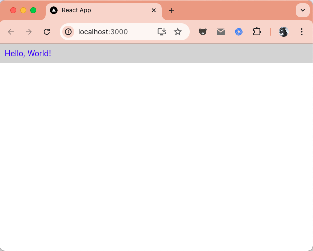
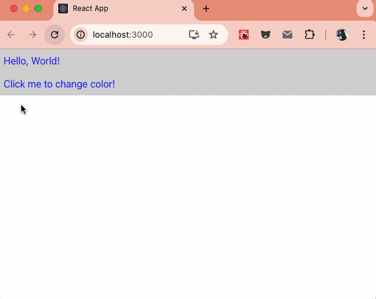
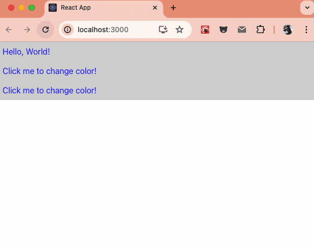
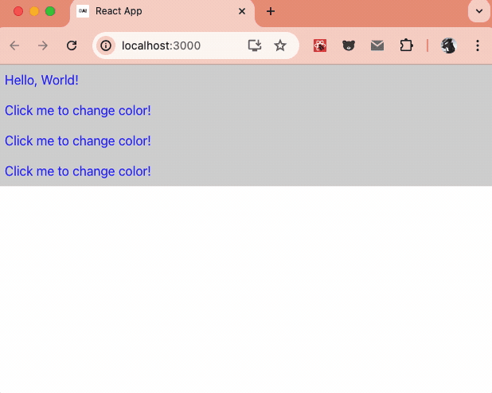
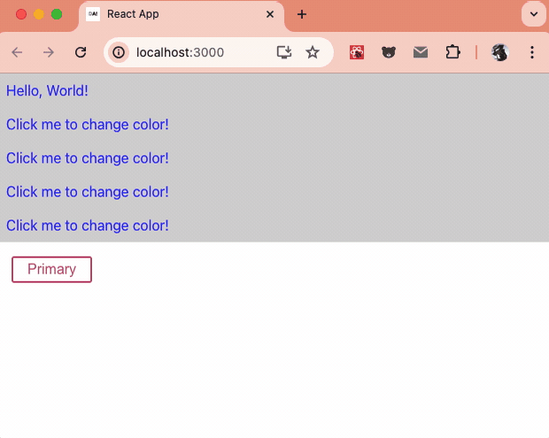
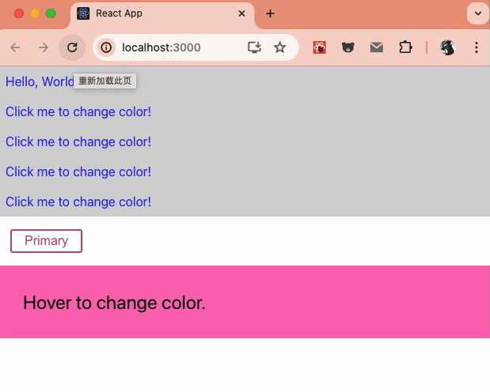
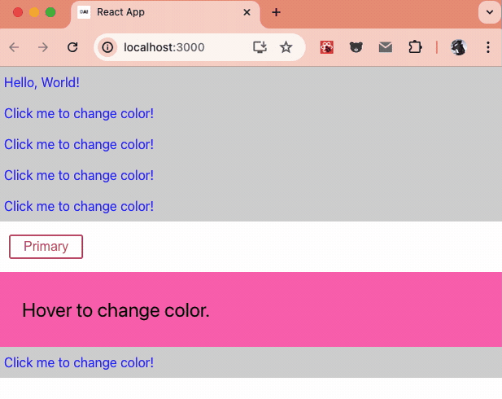

在React以其声明式编程范式和组件化架构，成为了构建用户界面的首选技术之一。然而，随着项目规模的扩大和设计需求的多样化，如何高效地管理 CSS 样式成为了每个React开发者都需要面对的挑战。

本文将从一下三个方面进行介绍，探讨如何在 React 中应用和管理样式，包括**内联样式、CSS 类、CSS Modules 和 CSS-in-JS 技术**，提升界面美观和开发效率。

## 常见的样式方案

在 React 中，组件样式指的是如何为每个独立的组件定义和管理视觉表现。组件样式的设计和应用是 React 开发中的关键部分，它决定了应用的外观和用户体验。

### 内联样式 (Inline Styles)

在 React 中，内联样式是一种直接在元素上定义 CSS 样式的方式，类似于在 HTML 中使用 `style` 属性。不同的是，**在 React 中，内联样式是通过一个 JavaScript 对象来定义的，而不是传统的 CSS 字符串**。这使得内联样式在 React 中具有更强的动态性和灵活性。

#### 基本语法

在 React 中，内联样式通过元素的 `style` 属性来设置，该属性接受一个 JavaScript 对象。对象的键是 CSS 属性名（使用驼峰命名法），值是对应的样式值；如下：

```jsx
import React from 'react'

function InlineStyles() {
    const divStyle = {
        color: 'blue',
        backgroundColor: 'lightgray',
        padding: '10px'
    }

    return <div style={divStyle}>Hello, World!</div>
}

export default InlineStyles
```

在这个例子中，`divStyle` 是一个包含样式属性的 JavaScript 对象，并通过 `style` 属性应用到 `div` 元素上。

效果如下：



#### 样式属性的命名

在 React 的内联样式中，CSS 属性名使用驼峰命名法（camelCase），而不是传统的 CSS 短横命名法（kebab-case）。例如：

- `background-color` 在 React 中写成 `backgroundColor`
- `font-size` 写成 `fontSize`
- `margin-top` 写成 `marginTop`

#### 动态样式

内联样式可以非常方便地实现动态样式。你可以根据组件的状态或属性来动态地改变样式。

```jsx
import React, { useState } from 'react'

function DynamicStyles() {
    const [isActive, setIsActive] = useState(false)

    const handleClick = () => {
        setIsActive(!isActive)
    }

    const divStyle = {
        color: isActive ? 'red' : 'blue',
        backgroundColor: 'lightgray',
        padding: '10px',
        cursor: 'pointer',
        userSelect: 'none'
    }

    return (
        <div style={divStyle} onClick={handleClick}>
            Click me to change color!
        </div>
    )
}

export default DynamicStyles
```

在这个例子中，当点击 `div` 元素时会切换其文本颜色。效果图如下：



#### 样式合并

React允许将多个样式对象合并为一个，这在需要应用多个条件样式时非常有用：

```jsx
const baseStyle = { padding: '10px', margin: '5px' }
const activeStyle = { backgroundColor: 'green' }

// 合并样式
const finalStyle = { ...baseStyle, ...activeStyle }

// ...
;<div style={finalStyle} />
```

**内联样式的优缺点**:

优点:

- 局部作用域：内联样式只作用于当前的元素，不会影响其他元素，避免了样式冲突。
- 动态性：可以很方便地根据组件的状态或属性来动态设置样式。
- 简洁：对于简单的样式，可以减少代码量和文件数量。

缺点:

- 可维护性：当样式变得复杂时，内联样式会使得组件代码变得难以维护。
- 复用性差：内联样式无法复用，相同的样式需要在多个地方重复定义。
- 缺少伪类和伪元素支持：内联样式无法直接使用 CSS 伪类和伪元素（如 :hover, ::after）。
- 性能差：联样式对象包含大量的属性或者嵌套的对象，这可能会使得样式对象的创建和合并更加耗时。

### CSS 类 (CSS Classes)

与内联样式相比，使用 CSS 类样式可以使代码更清晰、可维护性更高。

#### 使用 CSS 类样式的基本方法

- 创建 CSS 文件

    首先，你需要创建一个 CSS 文件，并在其中定义你的 CSS 类。例如，创建一个 common.css 文件：

    ```css
    /* common.css */
    .container {
        color: blue;
        background-color: lightgray;
        padding: 10px;
    }

    .active {
        color: red;
    }
    ```

- 在 React 组件中引入 CSS 文件
  在你的 React 组件中，使用 import 语句引入刚刚创建的 CSS 文件：

    ```jsx
    import { useState } from 'react'
    import '../assets/styles/common.css'

    function ClassStyles() {
        const [isActive, setIsActive] = useState(false)

        const handleClick = () => {
            setIsActive(!isActive)
        }

        return (
            <div className={`container ${isActive ? 'active' : ''}`} onClick={handleClick}>
                Click me to change color!
            </div>
        )
    }

    export default ClassStyles
    ```

    在这个示例中，我们使用[模板字符串（template literals）](https://developer.mozilla.org/zh-CN/docs/Web/JavaScript/Reference/Template_literals)来动态添加或移除 CSS 类。效果如下：

    

#### 动态添加或移除 CSS 类

可以使用条件渲染的方法动态添加或移除 CSS 类。例如，使用三元运算符或条件运算符：

```jsx
<div className={`container ${isActive ? 'active' : ''}`} onClick={handleClick}>
    Click me to change color!
</div>
```

或者，使用 [classnames](https://github.com/JedWatson/classnames)、[clsx](https://github.com/lukeed/clsx) 库来处理复杂的类名逻辑，下面用 classnames 做个演示：

```jsx
import { useState } from 'react'
import classNames from 'classnames'

function ClassnamesStyles() {
    const [isActive, setIsActive] = useState(false)

    const handleClick = () => {
        setIsActive(!isActive)
    }

    return (
        <div className={classNames('container', { active: isActive })} onClick={handleClick}>
            Click me to change color!
        </div>
    )
}

export default ClassnamesStyles
```

然后在 App.jsx 中引入 ClassnamesStyles 组件；在这个示例中，classnames 库使得根据条件判断类名的处理更加简洁和易读。效果如下：



### CSS Modules

为了避免全局样式冲突，React 推荐使用 CSS 模块（CSS Modules），它允许你将 CSS 类名限定在本地作用域内。

- 创建 CSS 模块文件
  首先，创建一个 CSS 模块文件，例如 page.module.css：

    ```css
    /* page.module.css */
    .container {
        color: blue;
        background-color: lightgray;
        padding: 10px;
    }

    .active {
        color: red;
    }
    ```

- 在 React 组件中引入和使用 CSS 模块

    ```jsx
    import { useState } from 'react'
    import styles from '../assets/styles/page.module.css'

    function CssModuleStyles() {
        const [isActive, setIsActive] = useState(false)

        const handleClick = () => {
            setIsActive(!isActive)
        }

        return (
            <div className={`${styles.container} ${isActive ? styles.active : ''}`} onClick={handleClick}>
                Click me to change color!
            </div>
        )
    }

    export default CssModuleStyles
    ```

    在这个示例中，CSS 类名是通过 styles 对象来引用的，这样可以确保类名在本地作用域内不发生冲突。

**优缺点对比**

优点:

- 可维护性高：样式定义集中在一个地方，使得代码更清晰易读。
- 复用性好：相同的样式可以在多个组件中复用。
- 避免冲突：使用 CSS 模块可以避免全局命名冲突。

缺点:

- 动态性较差：相比于内联样式，动态设置样式略显不便。
- 额外的构建步骤：需要引入和配置 CSS 文件，增加了项目的构建复杂度。

### Styled Components 和 CSS-in-JS

在 React 中，Styled Components 和 CSS-in-JS 是用于管理和应用样式的现代解决方案。它们旨在使样式更加模块化、可复用和动态化。

#### Styled Components

[Styled Components](https://styled-components.com/docs) 是一个流行的 CSS-in-JS 库，它使用 ES6 的模板字符串语法来定义组件级别的样式。通过使用 Styled Components，你可以将组件的样式与其逻辑紧密结合，使得样式更加模块化和可维护。

- [安装 styled-components](https://styled-components.com/docs/basics#installation) 库

    ```sh
    npm install styled-components
    ```

- 使用示例

以下是如何在 React 中使用 Styled Components：

```jsx
import { useState } from 'react'
import styled from 'styled-components'

// 定义一个带有样式的容器组件
const Container = styled.div`
    /* 根据 props.isActive 设置颜色 */
    color: ${(props) => (props.isActive ? 'red' : 'blue')};
    background-color: lightgray;
    padding: 10px;
    cursor: pointer;
    transition: color 0.3s;
`

const Button = styled.button`
    /* 根据 props.primary 设置按钮样式 */
    background: ${(props) => (props.$primary ? '#BF4F74' : 'white')};
    color: ${(props) => (props.$primary ? 'white' : '#BF4F74')};
    font-size: 1em;
    margin: 1em;
    padding: 0.25em 1em;
    border: 2px solid #bf4f74;
    border-radius: 3px;
`

function StyledComponentsStyles() {
    const [isActive, setIsActive] = useState(false)

    const handleClick = () => {
        setIsActive(!isActive)
    }

    return (
        <main>
            <Container isActive={isActive}>Click me to change color!</Container>
            <Button onClick={handleClick} $primary={isActive}>
                Primary
            </Button>
        </main>
    )
}

export default StyledComponentsStyles
```

效果如下：



#### CSS-in-JS

CSS-in-JS 是一种将 CSS 样式直接写在 JavaScript 文件中的技术。Styled Components 是 CSS-in-JS 的实现之一，但还有其他库和方法可以实现 CSS-in-JS，例如 emotion、styled-jsx 等。

**优点**

- 模块化：每个组件的样式都与组件本身紧密结合，避免了样式冲突。
- 动态样式：可以方便地根据组件的状态或属性来动态调整样式。
- 可维护性：将组件的样式和逻辑放在一起，使得代码更加内聚和可维护。
- 自动前缀：自动添加浏览器前缀，使得样式兼容更多浏览器。

**缺点**

- 性能：在某些情况下，CSS-in-JS 可能会对性能产生影响，因为样式是在运行时生成的。
- 学习曲线：需要学习新的库和语法，可能增加项目的复杂性。

**其他 CSS-in-JS 库**

- Emotion
  [Emotion](https://emotion.sh/docs/introduction) 是另一个流行的 CSS-in-JS 库，具有强大的动态样式和高性能的特点。

1. 安装 Emotion

```sh
npm install @emotion/react
```

1. 使用示例

> 在使用 emotion 方案的 jsx 文件开头加入一行 `/** @jsxImportSource @emotion/react **/` 的 JSX Pragma（编译指示），告诉 JS 编译器使用 @emotion/react 包来替代 React 原生的jsx 运行时。

```jsx
/* @jsxImportSource @emotion/react */
import React from 'react'
import { css } from '@emotion/react'

const color = 'white'

function EmotionStyles() {
    return (
        <div
            css={css`
                padding: 32px;
                font-size: 16px;
                background-color: hotpink;
                font-size: 24px;
                border-radius: 4px;
                &:hover {
                    color: ${color};
                }
            `}
        >
            Hover to change color.
        </div>
    )
}

export default EmotionStyles
```

效果如下：



emotion 也支持了 style-components 的方案，不过要安装一下依赖：`npm i @emotion/styled`，使用示例如下：

```jsx
/* @jsxImportSource @emotion/react */
import { useState } from 'react'
import styled from '@emotion/styled'

const Container = styled.div`
    color: ${(props) => (props.isActive ? 'red' : 'blue')};
    background-color: lightgray;
    padding: 10px;
    cursor: pointer;
    transition: color 0.3s;
`

function EmotionStyledStyles() {
    const [isActive, setIsActive] = useState(false)

    const handleClick = () => {
        setIsActive(!isActive)
    }

    return (
        <Container isActive={isActive} onClick={handleClick}>
            Click me to change color!
        </Container>
    )
}

export default EmotionStyledStyles
```

效果如下：



Styled Components 和 CSS-in-JS 是现代 React 开发中非常流行的样式解决方案。它们提供了模块化、动态化和高可维护性的样式管理方式。根据项目需求选择合适的方案，可以显著提高开发效率和代码质量。

## 总结

在 React 项目中，有许多不同的样式管理工具和库可供选择。以下是一些常见的选择：

- CSS-in-JS：Styled Components, Emotion
- [Utility-First CSS](https://heydonworks.com/article/what-is-utility-first-css/) 框架：Tailwind CSS、unocss
- 组件库：Bootstrap (react-bootstrap), Ant Design, Material-UI等
- CSS 预处理器：Sass、less
- CSS 模块：CSS Modules

选择合适的样式管理工具取决于你的项目需求、团队的熟悉度以及具体的使用场景。

上面的代码均可以在 clin211/react-awesome 中找到，[传送门](https://github.com/clin211/react-awesome/tree/style-form)。
