在开发过程中，调试无疑是我们解决疑难杂症的手段之一，但调试不仅仅是在解决 Bug 的时候才能应用的技能，当拿到一个新的项目时，我们也可以通过调试的方法，去快速了解代码、熟悉业务。

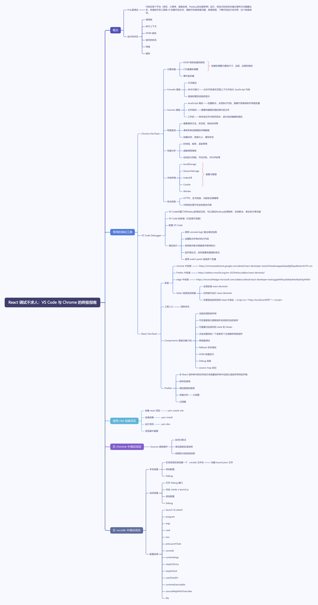

> **本文工具及代码环境**：
> 1. Visual Studio Code Version: *1.92.1*
> 2. Node.js version：*v20.10.0*
> 3. Yarn version：*v4.4.0*
> 4. React version：*v18.3.1*

下面就是本文要涉及的几个方面：
- 调试的概念
- 常用的调试工具
- 使用 vite 创建一个 react 项目
- 在 Chrome 中调试 react 项目
- 在 VS Code 中调试 react 项目


## 概念

什么是调试呢？**调试就是代码在某个平台（网页、小程序、桌面应用、Node.js后台服务等）运行，把运行时的状态（调用栈、执行上下文、DOM结构、组件状态、网络、缓存等）通过某种方式暴露出来，传递给开发工具做 UI 的展示和交互，辅助开发者排查问题、梳理流程、了解代码运行状态等**，这个就是调试。

在前端开发中，调试是日常任务的一部分。例如，使用 Chrome DevTools 进行网页调试，我们可以查看和编辑 DOM 元素，监控网络请求，设置 JavaScript 代码的断点，以及利用 Performance 工具来分析页面性能。这些都是针对网页层面的调试手段。

对于服务器端或后端逻辑的调试，VSCode Debugger 提供了强大的支持。它允许我们同时对多个进程的代码进行调试，无论是理解代码逻辑还是追踪问题，VSCode Debugger 都是 Node.js 开发者的得力助手。

对于使用现代 JavaScript 框架（Vue/React）的开发者来说，特定的调试工具是必不可少的。例如，通过 React DevTools 和 Vue DevTools 这类Chrome插件，我们可以深入调试 React 和 Vue 组件。另外，独立的 React DevTools 也常用于调试 React Native 应用，这些工具帮助我们优化组件逻辑和性能。

## 常用的调试工具

前端开发中常用的调试工具非常多，涵盖了从浏览器内置工具到代码编辑器插件，再到网络抓包和模拟数据等多个方面；下面就以最主要的 Chrome DevTools、VS Code Debugger 和 React DevTools 为侧重点。

### Chrome DevTools

[Chrome DevTools](https://chromeextensionsdocs.appspot.com/docs/devtools/) 是一套直接内置于 Google Chrome 浏览器中的 Web 开发人员工具。Chrome DevTools（简称DevTools）是一组网页制作和调试的工具，内嵌于 Google Chrome 浏览器中。DevTools使开发者更加深入的了解浏览器内部以及他们编写的应用。通过使用 DevTools，可以更加高效的定位页面布局问题，设置 JavaScript 断点并且更好的理解代码优化。

> 注意: 如果你是一个web开发者并且希望获取最新版本的DevTools，你可以使用 Google Chrome Canary.


打开 DevTools 的方式有很多种，因为不同的用户希望快速访问 DevTools UI 的不同部分。

要使用 DOM 或 CSS，请右键单击页面上的元素并选择“检查”以跳转到“元素”面板。或者按 Command+ Option+ C(Mac) 或 Control+ Shift+ C(Windows、Linux、ChromeOS)。
要查看记录的消息或运行 JavaScript，请按 Command+ Option+ J（Mac）或 Control+ Shift+ J（Windows、Linux、ChromeOS）直接跳转到控制台面板。

#### 访问 DevTools

访问DevTools，首先用 Chrome 打开一个 web 页面或 web 应用，也可以通过下面的方式：

- 在浏览器窗口的右上方选择 Chrome 菜单, 然后选择 `更多工具 > 开发者工具`。
  

- 在页面上任意元素上右键，然后选择审查元素。
  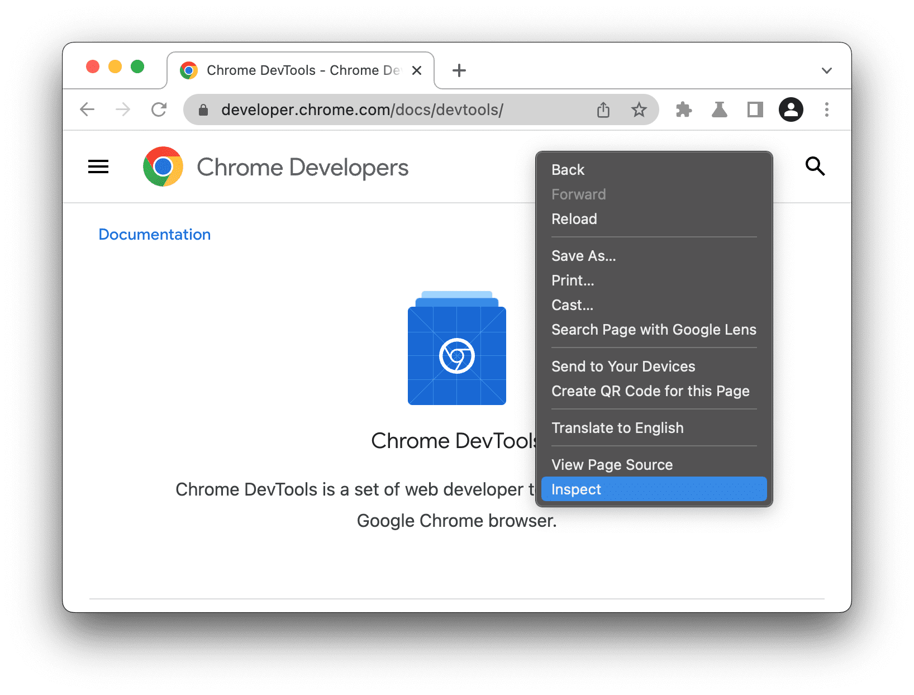


DevTools 窗口会在 Chrome 浏览器的底部（默认是在底部）打开。

下面是一些有用的快捷键来快速的打开DevTools:

- 使用 `Ctrl + Shift + I` (Mac 上为 `Cmd+Opt+I`)打开 DevTools。
- 使用 `Ctrl + Shift + J` (Mac 上为 `Cmd+Opt+J`)打开 DevTools 中的控制台。
- 使用 `Ctrl + Shift + C` (Mac 上为 `Cmd+Shift+C`)打开 DevTools 的审查元素模式。

为了日常工作，学习[快捷键](https://developer.chrome.com/docs/devtools/)将帮助你节省更多的时间。

#### DevTools 窗口
DevTools 在窗口顶部的工具栏对不同的任务功能进行分组。在每个工具栏选项卡和对应的操作面板中，你可以处理某项特殊的任务，例如 DOM 元素，资源和源码。

DevTools 目前主要包括以下八个主要功能组：
- Device Mode：模拟移动设备。
  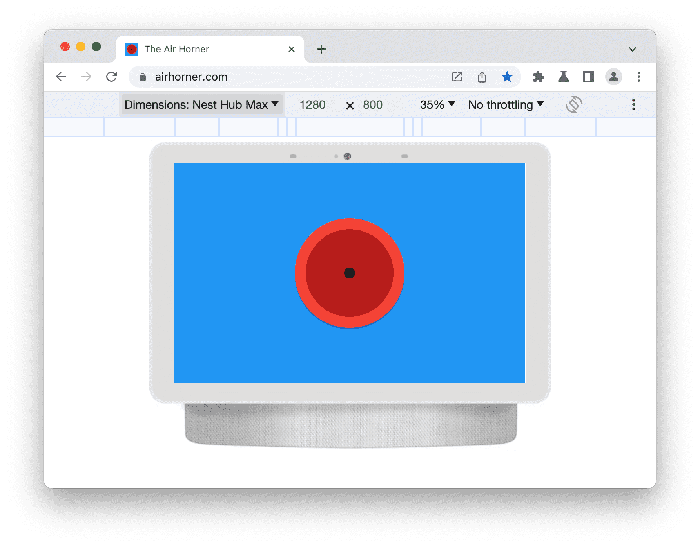
- Elements：查看和更改 DOM 和 CSS。
  - 开始查看和更改 DOM
  - 开始查看和更改 CSS
  - 修改 CSS
  - 修改 DOM
  - 查找无效、被替换、无效和其他 CSS 的 CSS
  - 发掘潜在的 CSS 改进
  - 模拟浅色/深色主题、对比度和其他 CSS 媒体功能
  - 查找未使用的 CSS
  - 检查动画
  
  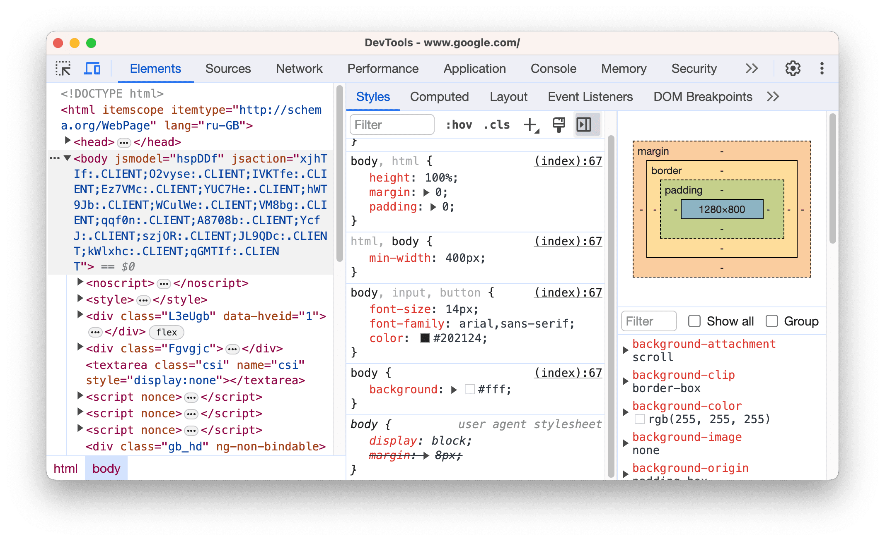
- Console：通过控制台查看消息并运行 JavaScript。
  - 开始使用控制台
  - 控制台实用程序 API 参考文档
  - Console API 参考文档
  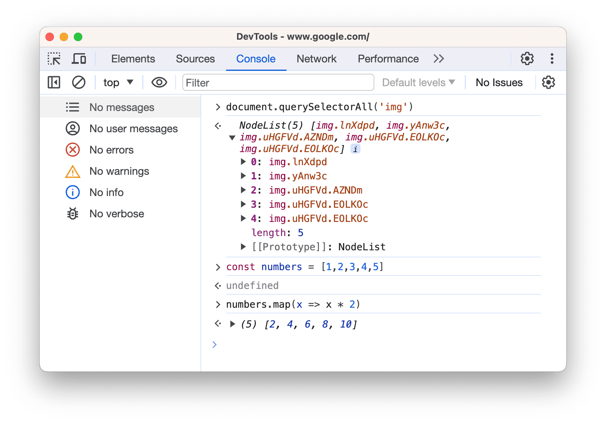
- Sources：调试 JavaScript，在页面重新加载时保留在开发者工具中所做的更改，保存和运行 JavaScript 代码段，并将在开发者工具中所做的更改保存到本地源代码中。
  - 开始调试 JavaScript
  - 使用断点暂停代码
  - 在工作区中编辑和保存文件
  - 运行 JavaScript 代码段
  - JavaScript 调试参考文档
  - 在本地替换 Web 内容和 HTTP 响应标头
  
  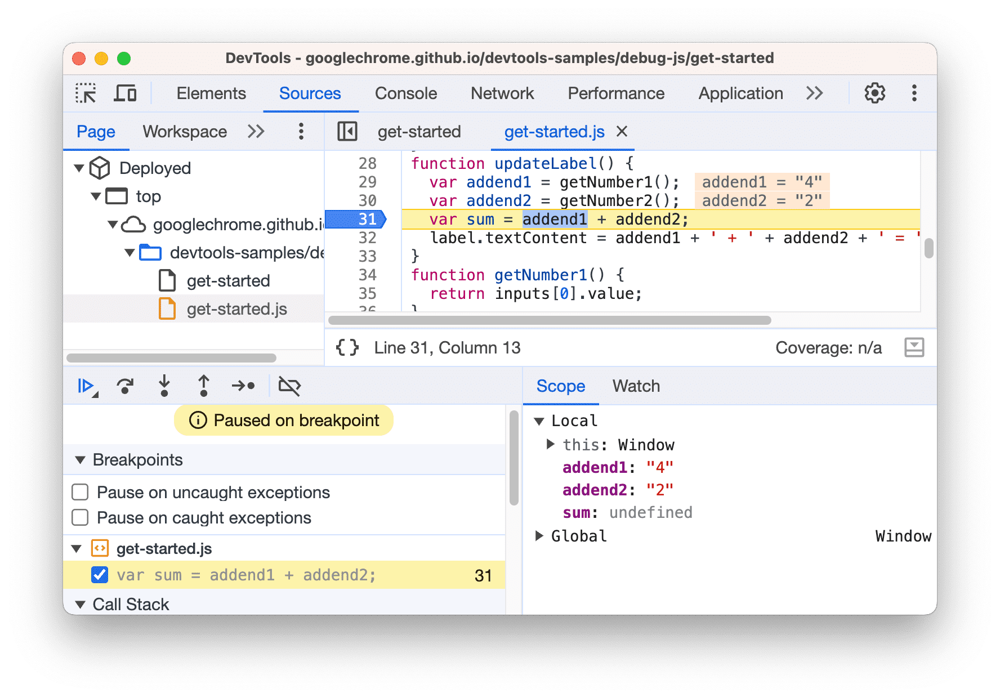
- Network：查看和调试网络活动。
  - 检查网络活动
  - 网络功能参考
  - 查看网页资源
  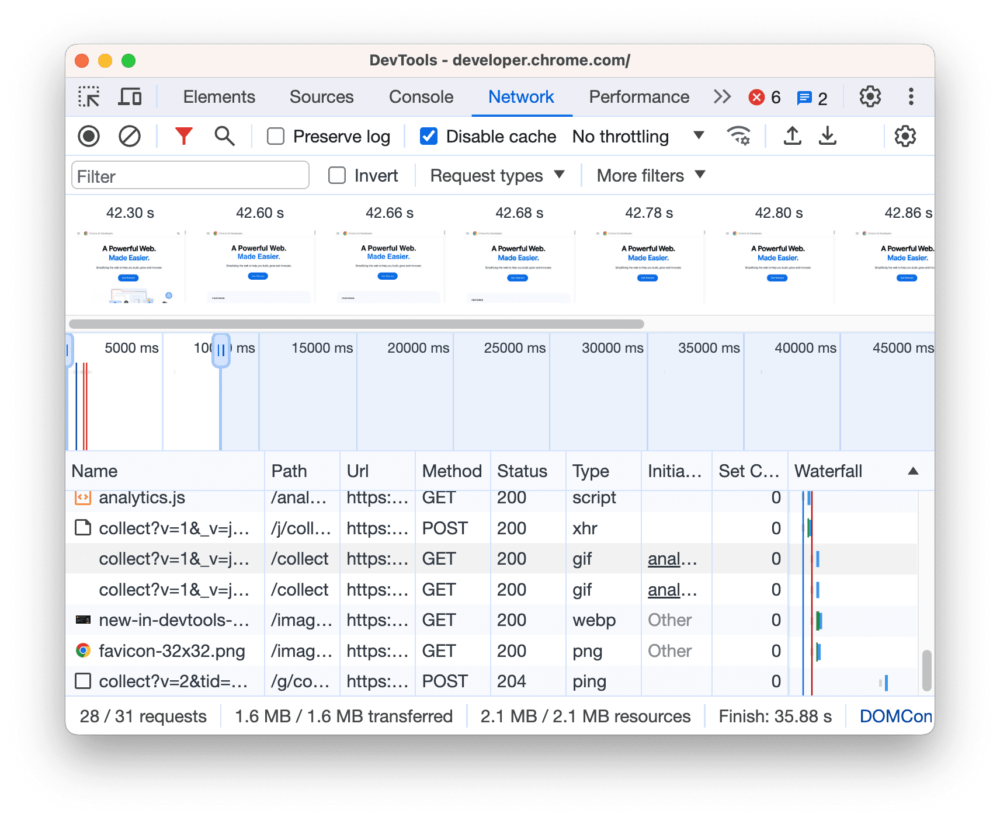
- Recorder：录制、重放和衡量用户流。
  - 录制、重放和衡量用户流
  - 使用扩展程序自定义“录音机”应用
  - 录音机功能参考
  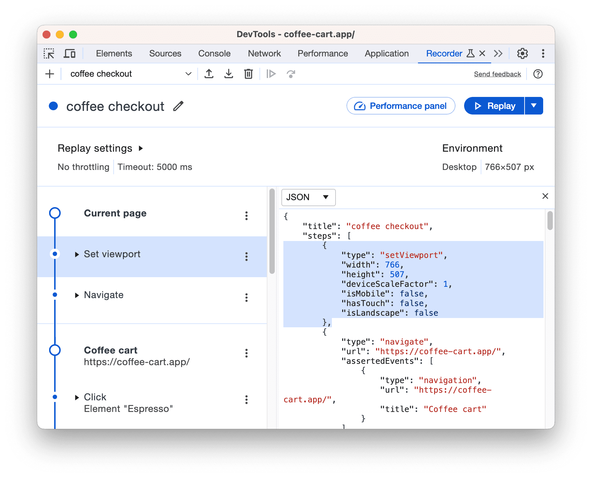
- Performance：找到提高加载和运行时性能的方法。
  - 优化网站速度
  - 分析运行时性能
  - 性能功能参考
  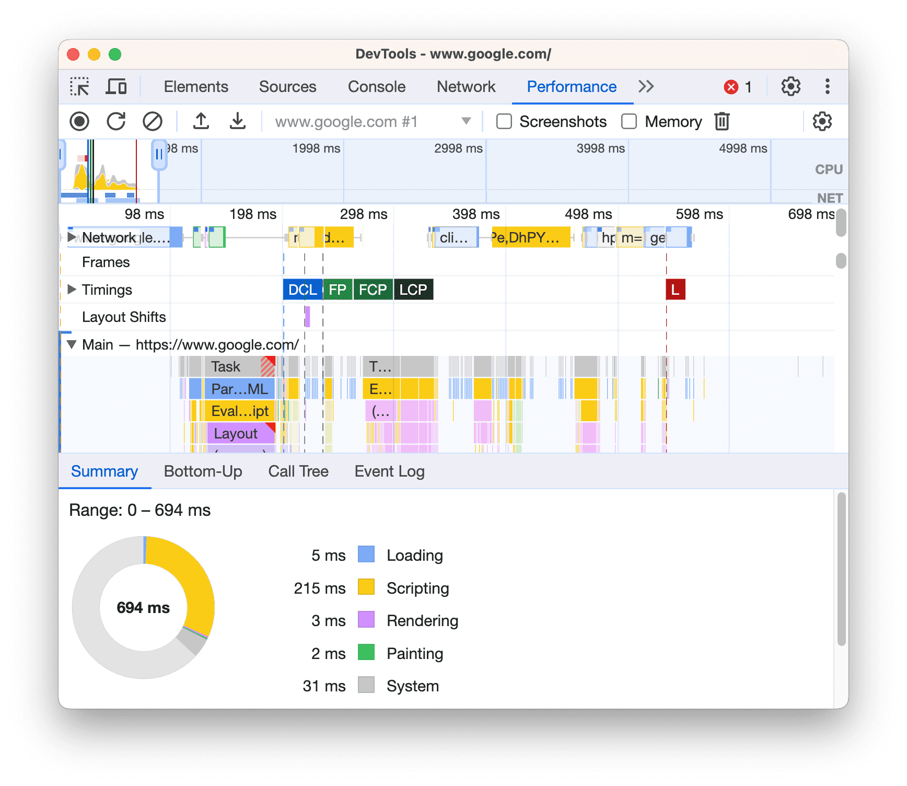
- Memory：查找并修复影响页面性能的内存问题，例如内存泄漏。
  - 解决内存问题
  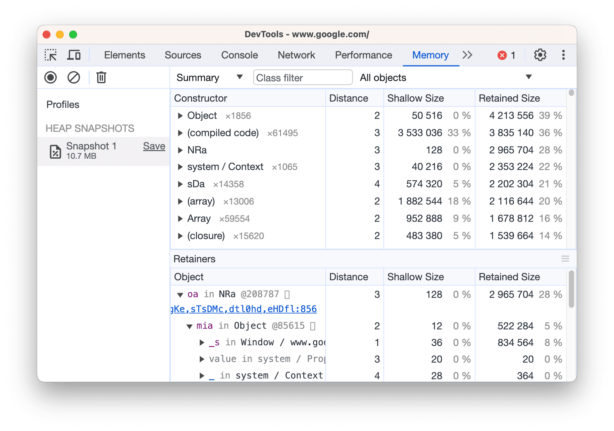
- Application：检查已加载的所有资源，包括 IndexedDB 或 Web SQL 数据库、本地和会话存储、Cookie、应用缓存、图片、字体和样式表。
  - 调试渐进式 Web 应用
  - 查看和修改本地存储空间
  - 查看、添加、修改和删除 Cookie
  - 查看源试用信息
  
- Security：调试混合内容问题、证书问题等。
  - 了解安全问题
  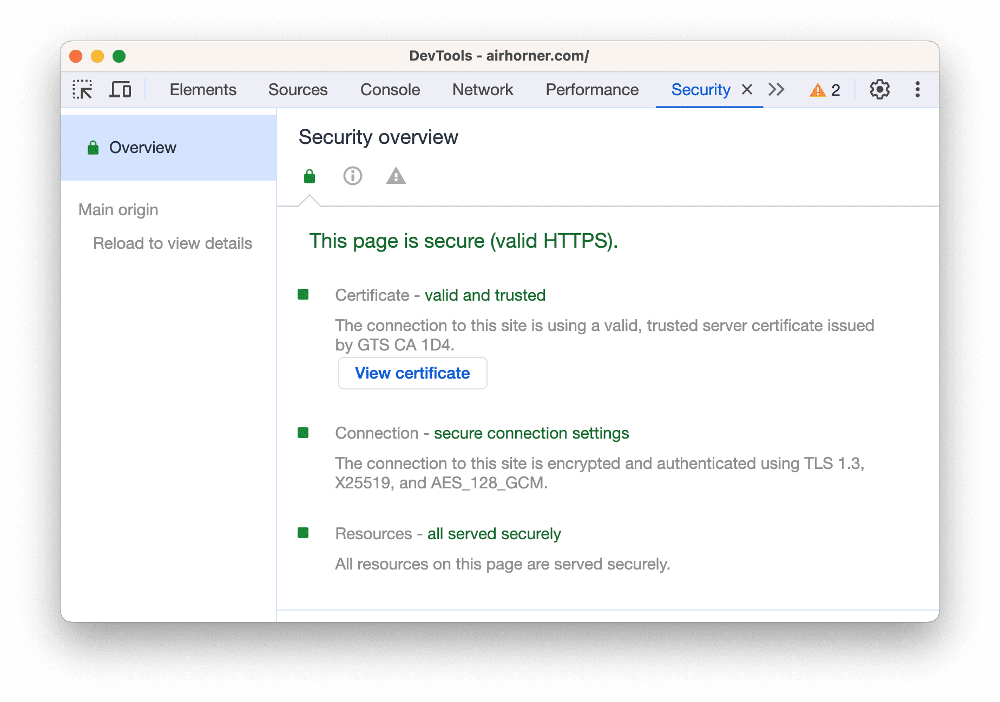

你可以通过 `Ctrl+[` 和 `Ctrl+]` 快捷键在不同面板之间进行切换。

还有更多使用技巧可以查看官方文档。

#### source 面板

使用 Chrome 开发者工具 Sources 面板可以执行以下操作：
- 查看文件。
- 修改 CSS 和 JavaScript。
- 创建和保存 JavaScript 代码段，以便在任何网页上运行。代码段类似于小书签。
- 调试 JavaScript。
- 设置工作区，以便将您在开发者工具中所做的更改保存到文件系统的代码中。

面板包含三个部分：

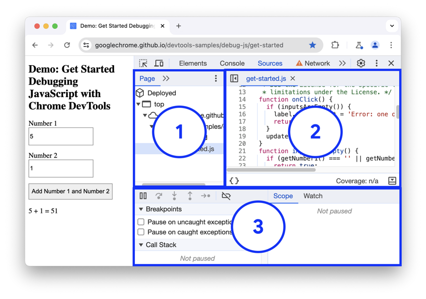
1. 包含文件树的页面标签页。此处列出了页面请求的每个文件。
2. 代码编辑器部分。在 Page 标签页中选择文件后，该文件的内容会显示在此处。
3. Debugger 部分。用于检查网页 JavaScript 的各种工具。

如果开发者工具窗口较宽，默认情况下，Debugger 位于代码编辑器的右侧。在这种情况下，Scope 和 Watch 标签页会将 Breakpoints、Call stack 和其他作为可收起的部分联接。如下图：

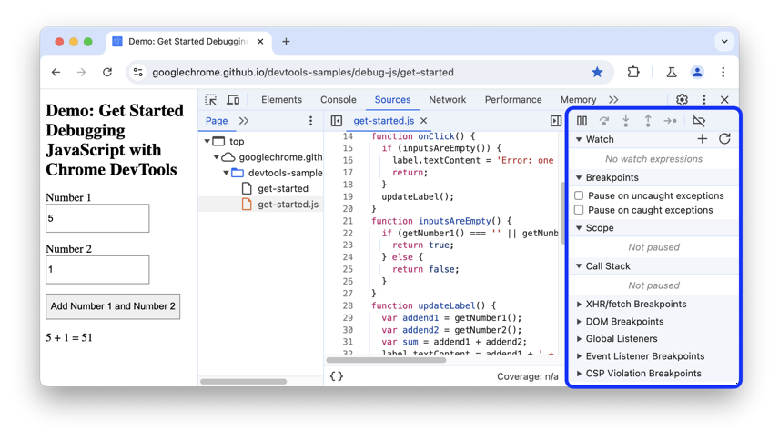

更多信息可以查看 [Chrome 开发者文档](https://developer.chrome.com/docs/devtools/javascript?hl=zh-cn)！


### VS Code Debugger
VS Code，全称为 Visual Studio Code，是由微软开发的一款免费且开源的代码编辑器。自从2015年发布以来，VS Code 凭借其高效、轻量和强大的功能迅速赢得了广大开发者的青睐。以下是 VS Code 流行的一些主要原因：
- **跨平台支持**：VS Code 可以运行在 Windows、macOS 和 Linux 上，满足不同操作系统用户的需求。
- **丰富的扩展库**：VS Code 提供了一个强大的扩展市场，用户可以根据需要安装插件来支持不同的编程语言和开发工具。
- **内置 Git 支持**：VS Code 内置了 Git 支持，方便开发者进行版本控制和代码管理。
- **高度可定制**：用户可以通过配置文件自定义 VS Code 的界面和功能，以适应个人的开发习惯。
- **强大的调试功能**：VS Code 内置了强大的调试工具，支持多种编程语言，使得调试变得更加高效和便捷。

VS Code 内置的调试工具称为 VS Code Debugger，它为开发者提供了一个强大且易用的调试环境。以下是 VS Code Debugger 的主要功能：
- **断点管理**：允许开发者在代码中设置断点和条件断点，以便在特定位置暂停程序的执行。
- **变量查看**：在调试过程中，开发者可以实时查看和评估变量的值，帮助定位问题。
- **调用栈**：显示当前执行的调用栈，帮助开发者了解程序的执行路径。
- **控制调试流程**：提供单步执行、继续运行、跳过和恢复等控制功能，使调试过程更加灵活。
- **调试控制台**：开发者可以在调试控制台中输入表达式和命令，直接与正在运行的程序进行交互。
- **多语言支持**：VS Code Debugger 支持多种编程语言，包括 JavaScript、Python、Java、C++ 等。

#### 下载 VS Code（如果已经安装可以忽略此步骤）
VS Code 是免费的，[官网下载地址](https://code.visualstudio.com/download)

#### 配置 VS Code
- **安装扩展**：打开 VS Code 后，您可以通过左侧边栏的扩展（Extensions）图标，搜索并安装所需的语言支持和工具扩展。推荐掘金社区一篇文章[《2024 最新最全 VS Code 插件推荐！》](https://juejin.cn/post/7384765023343394827?searchId=2024081310285119742C3CE35A13B7C5D0)
- **设置同步**：登录您的 GitHub 或 Microsoft 账户，可以将您的设置同步到云端，在不同设备之间共享。
- **个性化配置**：通过点击右下角的齿轮图标（设置），您可以根据个人习惯自定义 VS Code 的界面和功能。

先对 VS Code 有个大致了解，下面会具体实操调试技巧！

### 使用 Vite 创建 React 项目
- 使用 yarn 创建 项目
  ```sh
  $ yarn create vite
  ```
  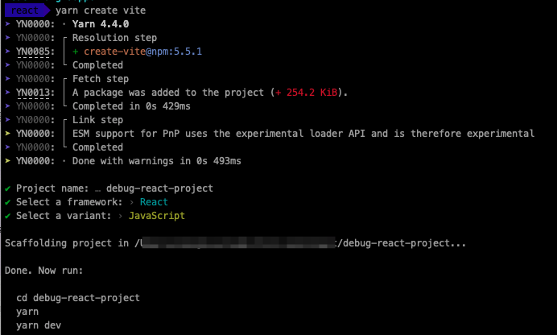

- 用 vscode 打开项目，并安装依赖
  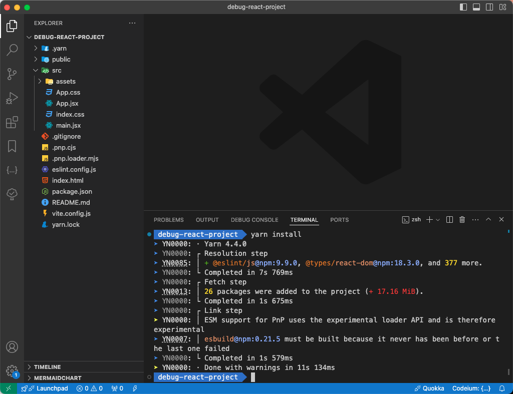
  
- 使用命令 `yarn dev` 运行项目并在浏览器中访问

  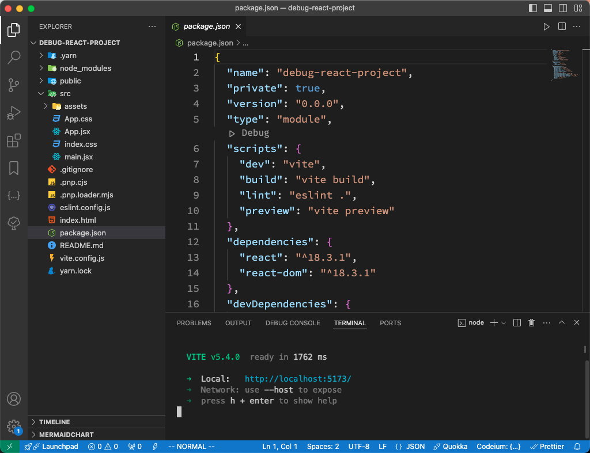
  
  运行效果：
  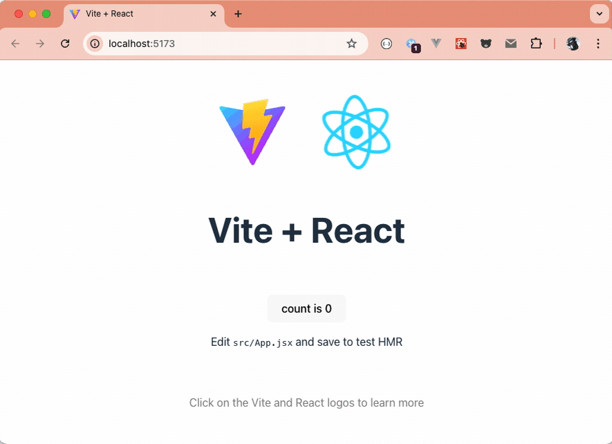

以上代码可以在 [clin211/react-awesome/tree/debug-react-project](https://github.com/clin211/react-awesome/tree/debug-react-project) 中获取到！

### React DevTools
在web端的 react 项目里， React DevTools 是作为浏览器的插件引入进来， chrome 中可以在扩展程序里面添加；可以通过以下方式安装：
> 打开 chrome 网上商店可能需要科学上网，firefox 和 microsoft edge 不需要科学上网也可正常安装插件，使用上并无区别。

- [chrome](https://chromewebstore.google.com/detail/react-developer-tools/fmkadmapgofadopljbjfkapdkoienihi?hl=en) 中安装：右上角三个点 -> 扩展程序 -> 访问 chrome 应用商店 -> 然后搜索 **React DevTools** -> 安装，如下图：
  
  
- [Firefox](https://addons.mozilla.org/en-US/firefox/addon/react-devtools/) 中安装：打开菜单 -> Web开发者 -> 获取更多工具 -> 搜索 **React Developer Tools** -> 安装。

- [Microsoft Edge](https://microsoftedge.microsoft.com/addons/detail/react-developer-tools/gpphkfbcpidddadnkolkpfckpihlkkil) 中安装：打开右上角三个点 -> 扩展 -> 扩展管理 -> 搜索 **React Developer Tools** -> 安装。

> Safari 或其他浏览器:
> - 全局安装: `npm i -g react-devtools`
> - 在终端中运行 `react-devtools`
> - 在要调试的网页的 head 中添加  `<script src="http://localhost:8097"></script>`

#### **工具入口**
如果检测到当前web是 react 项目，右上角的工具小图标（地址栏右侧）会发生改变，分别对应着：
<ul>
  <li style="display:flex;align-items:center;justify-content:flex-start;text-align:left"><p style="flex:1;margin-left:8px;">debug版本 的 react 项目，正在 coding。</p></li>
  <li style="display:flex;align-items:center;justify-content:flex-start;"><p style="flex:1;margin-left:8px">生产版本的 react，说明已经打包发布了。</p></li>
  <li style="display:flex;align-items:center;justify-content:flex-start;"><p style="flex:1;margin-left:8px">表示当前依赖的 react 版本比较老，一般会在 react15 以及更早的版本出现。</p></li>
  <li style="display:flex;align-items:center;justify-content:flex-start;"><p style="flex:1;margin-left:8px">Web中并没有检测到有 react 的依赖。</p></li>
</ul>


chrome 中右键点击检查，打开调试器，然后发现在调试器的 tab 栏末尾有最后两栏比较特殊的tab，分别是 ⚛️Components 和 ⚛️Profiler，这两个就是 react devtools 的功能入口了，下面会来介绍各自的功能。


#### **Components 面板功能说明**

在 Components 面板中，我们可以看到组件的结构以及相应的数据。

下面我们一个例子看看，DOM 结构如下：
```jsx
import { useState } from 'react'
import classNames from 'classnames';
import reactLogo from './assets/react.svg'
import viteLogo from '/vite.svg'
import './App.css'

function App () {
  return (
    <>
      <div>
        <Logo href="https://vitejs.dev" src={viteLogo} alt="Vite logo" />
        <Logo href="https://react.dev" src={reactLogo} className="react" alt="React logo" />
      </div>
      <h1>Vite + React</h1>
      <Counter />
      <p className="read-the-docs">
        Click on the Vite and React logos to learn more
      </p>
    </>
  )
}

function Logo (props) {
  return <a href={props.href} target="_blank">
    
  </a>
}

function Counter () {
  const [count, setCount] = useState(0)
  return <div className="card">
    <button onClick={() => setCount((count) => count + 1)}>
      count is {count}
    </button>
    <p>
      Edit <code>src/App.jsx</code> and save to test HMR
    </p>
  </div>
}

export default App
```
这段代码中，`<App/>` 组件中有两个 `<Logo />` 组件和一个 `<Counter />` 组件，我们看看浏览器中 Components 面板有啥变化，如下图：


还可以看到组件中的 `props`，如 `<Logo />` 组件中的 props：
```jsx
function Logo(props) {
  return <a href={props.href} target="_blank">
    
  </a>
}
```
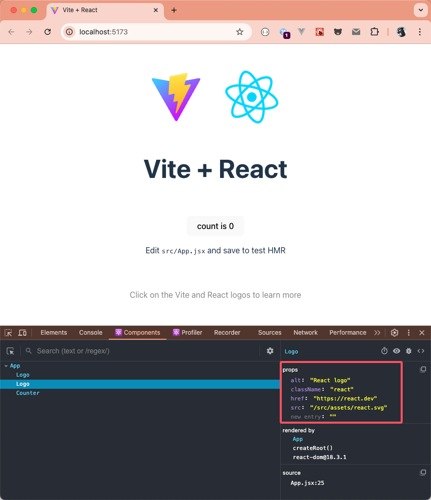


当然也能看到相关 Hooks，比如 Counter 组件中的 state count：
```jsx
function Counter() {
  const [count, setCount] = useState(0)
  return <div className="card">
    <button onClick={() => setCount((count) => count + 1)}>
      count is {count}
    </button>
    <p>
      Edit <code>src/App.jsx</code> and save to test HMR
    </p>
  </div>
}
```


在项目中用了一些 [react-router](https://reactrouter.com/en/main) ， [redux](https://redux.js.org/) 等工具后，虚拟 Dom 树可能会受到一些侵入，比如 Dom 树中多了一些 Conext.Consumer 的结构，这些是 context 的语法，不管这些结构，双击目标组件就可以展开当前组件下的所有子组件，这种方式有个弊端就是在组件层级很深的情况下，一层一层的找，效率太低了，当然 React Devtools 开发者也想到了，那就是 Components 中的**过滤器**！


使用过滤器可以轻松过滤掉一些不想要展示 Dom ，点开 setting 小图标的下拉框里，有一栏是组件的设置，然后找到 "Hide components where"，在这里可以添加过滤器，从而进行过滤的设置，下面列出了各个配置代表什么含义。

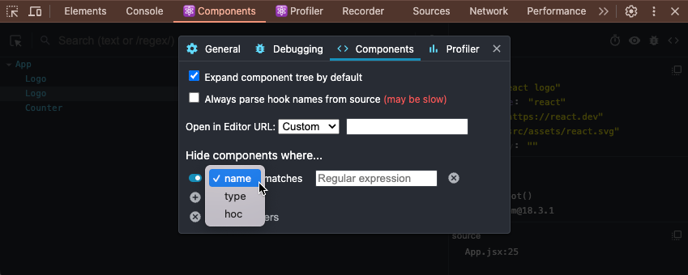

下拉框选择过滤类型：
| 名称       | 含义                             |
| ---------- | -------------------------------- |
| `locatio`n | router 路由匹配的组件            |
| `name`     | 组价名                           |
| `type`     | 各种组件类型细分（参考下面表格） |
| `hoc`      | 高阶组件                         |

> `location`（集成 react-router 之后才会有） 和 `name` 都是进行正则匹配的。

如果过滤类型选择 `type` 的话，匹配模式就有9种，如下：

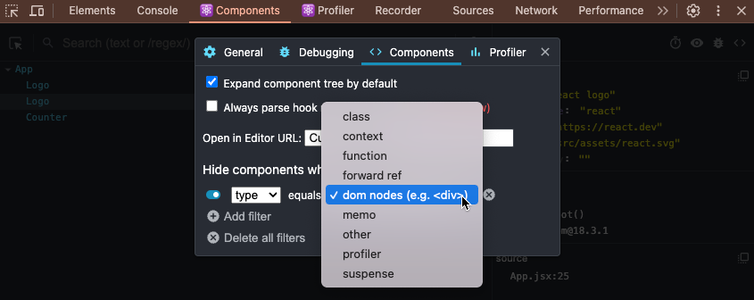

| 名称          | 含义                             |
| ------------- | -------------------------------- |
| `class`       | 继承 `React.Component`的类组件   |
| `context`     | 共享上下文 `context`             |
| `function`    | 函数式组件                       |
| `forward ref` | 函数式组件传递`ref`的            |
| `dom nodes`   | 浏览器支持的 html 元素，div,h1,p |
| `memo`        | 函数式组件做props优化的          |
| `other`       | 其他                             |
| `profiler`    | 测量性能的                       |
| `suspense`    | 懒加载根组件                     |

#### **单组件调试**

当我们找到目标组件后，双击目标组件，右侧就会出现(从上往下)工具栏、`props`、`hooks`、`rendered by`、`source`
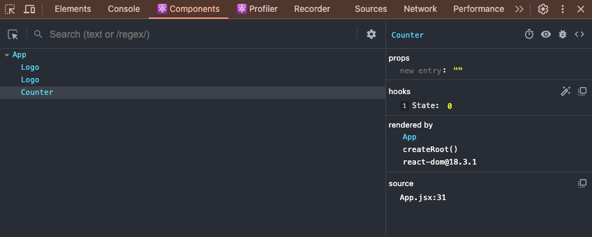

我们重点来看看第一行出现的那些 icon 分别是些什么(从左往右)：


#### **显示懒加载的 fallback 状态**

第一个**显示懒加载的 fallback 状态**，看起来像一个“闹钟”的按钮，实际上与 `<Suspense />` 相关，当 `<Suspense />` 组件的 `children` 还没加载出来的时候，有一个过渡的 loading 效果，点击按钮，就会显示 `fallback` 属性里的 `ReactNode`，用来预览加载效果还是不错的。比如在代码中添加 `<Suspense />` 组件后效果调试如下：
```jsx
function App () {

  return (
    <Suspense fallback={<div>Loading...</div>}>
      <div>
        <Logo href="https://vitejs.dev" src={viteLogo} alt="Vite logo" />
        <Logo href="https://react.dev" src={reactLogo} className="react" alt="React logo" />
      </div>
      <h1>Vite + React</h1>
      <Counter />
      <p className="read-the-docs">
        Click on the Vite and React logos to learn more
      </p>
    </Suspense>
  )
}
```
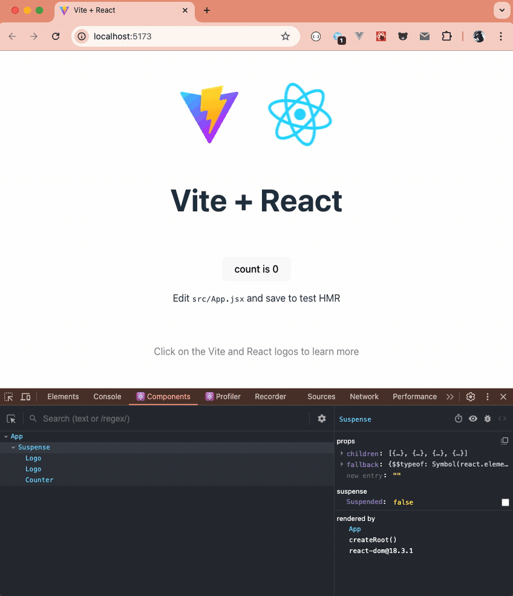

小图标高亮就说明处于 loading 的状态调试。这里演示用的 loading 的文字，也可以写成骨架屏的方式，体验可能更佳！

#### **检查组件的真实 Dom**

在 React 中写的 JSX 代码渲染出来的组件树其实都不是真实的 DOM 树，*所有调试样式、修改文案、直接操作 DOM 的需求，还是需要回到 chrome devtools 的 Element 面板进行调试* ，这里仍然会面临 DOM 层级很深的情况，可以通过“小箭头”直接在页面上点击你要调试的 DOM。如下：

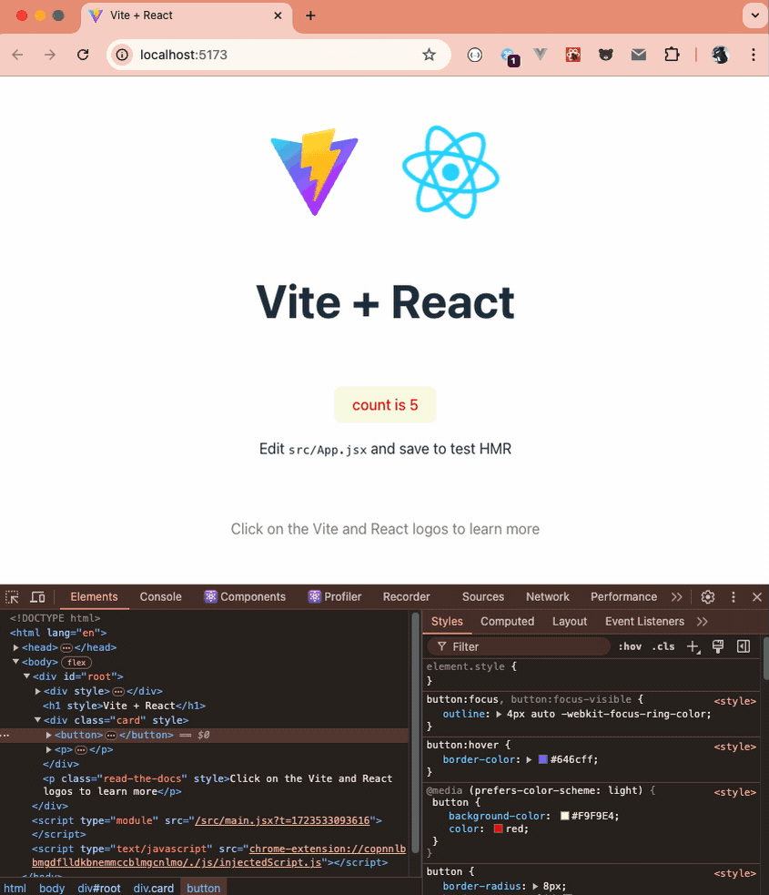

上面图中这种也是调试真是 DOM 的一种方式，还有就一种方式就是 Components 中工具栏的第二个**小眼睛**的按钮，点击它之后，它会直接切到 element 面板下且聚焦在对应的 DOM 上，如下：

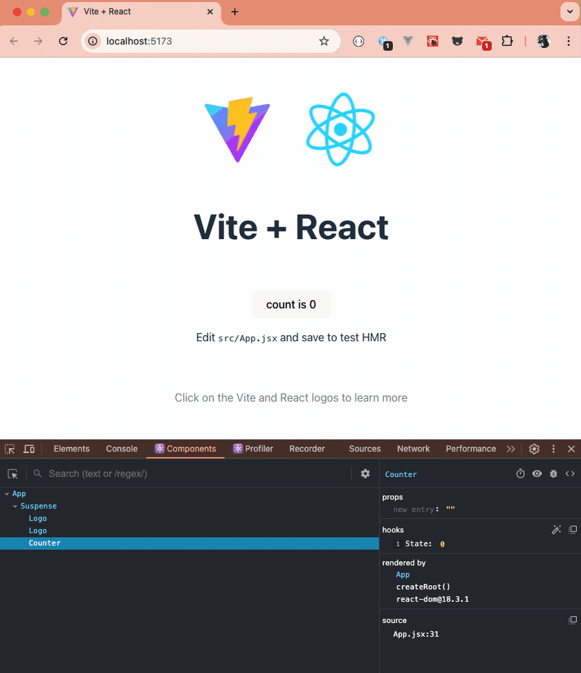

#### **Debug 信息**

也就是第三个“小虫子”的图标，在最开始用的时候会挺懵逼的，点了以后好像没有什么作用，然后悬停一会会有一段文字：log this component data to the console（将组件数据记录在console中）；然后切换到 chrome devtools 的 console 就能发现端倪了，这里出现了和 `<Counter />` 相关的组件信息：
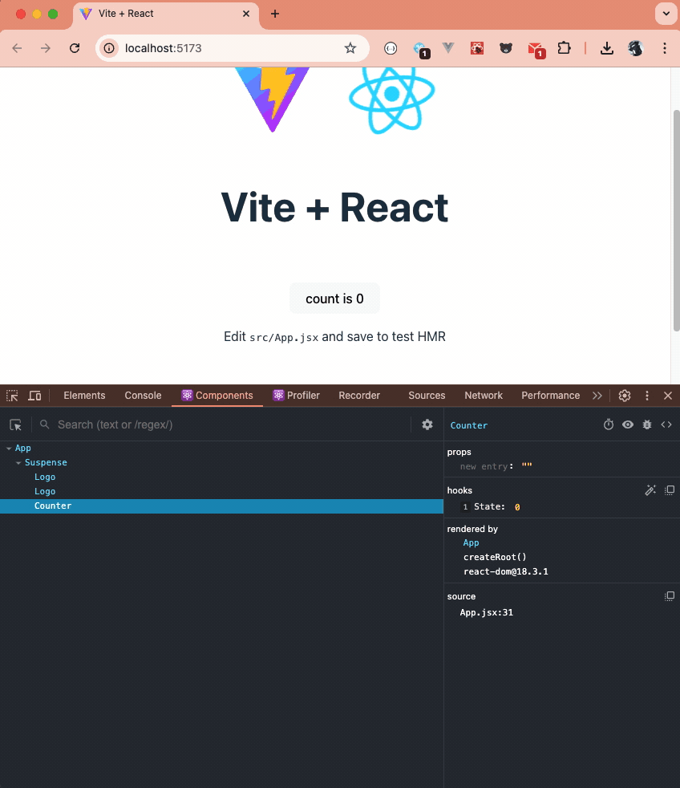

打印的信息如下：
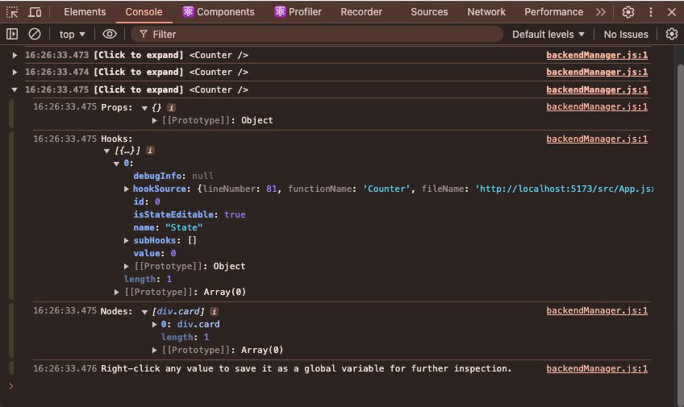

#### **定位 Source-map 信息**
最后一个按钮很熟悉，平时都会在一些组件库文档中的代码案例中看到，比如 mui 等UI组件库，用来作为展开代码的调试入口， react devtools 的功能也是类似，这里是定位该组件对应的 Source 文件，这里我就切换到了 `<Counter />` 组件对应的 App.jsx 文件中，在开发环境中配置好 source-map ，定位组件就能直接显示源码。
```js
/** @type {import('vite').UserConfig} */
import { defineConfig } from 'vite'
import react from '@vitejs/plugin-react'
// https://vitejs.dev/config/
export default defineConfig({
  plugins: [react()],
  build: {
    sourcemap: true
  },
})
```


这个 source 面板的功能就非常强大了，可以打断点、单步调试、调用栈、查看上下文对象等等，这一块的内容在下面的内容中介绍！

#### **性能问题追踪** 
还有一个 ⚛️profiler 是什么东西呢，可能刚开始接触 React 的同学可能不太了解，在 react 的官方文档中有介绍一个 [Profiler API](https://zh-hans.react.dev/reference/react/Profiler) ，能添加在 React 树中的任何地方来测量树中这部分渲染所带来的开销，用法：
```jsx
<Profiler id="App" onRender={onRender}>
    <App />
</Profiler>
```
- `id`：字符串，用于标识正在测量的 UI 部分。
- `onRender`：`onRender` 回调函数，当包裹的组件树更新时，React 都会调用它。它接收有关渲染内容和所花费时间的信息。
  ```js
  function onRender(
    id, // 发生提交的 Profiler 树的 “id”
  phase, // "mount" （如果组件树刚加载） 或者 "update" （如果它重渲染了）之一
  actualDuration, // 本次更新 committed 花费的渲染时间
  baseDuration, // 估计不使用 memoization 的情况下渲染整颗子树需要的时间
  startTime, // 本次更新中 React 开始渲染的时间
  commitTime, // 本次更新中 React committed 的时间
  interactions // 属于本次更新的 interactions 的集合
  ) {
    // 对渲染时间进行汇总或记录...
  }
  ```
> 进行性能分析会增加一些额外的开销，因此 在默认情况下，它**在生产环境中是被禁用的**。如果要启用生产环境下的性能分析，你需要启用一个 特殊的带有性能分析功能的生产构建。

虽然在项目中调试比较灵活，但是对项目有一定的代码侵入，甚至会有一些性能的损耗，所以当遇到使用全局 profiler 的场景的话，可以优先尝试一下用 React devtools 的 profiler 功能。

下面为了测试 profiler 功能，新增一个 `<List />` 组件中增加了一万条数据来显示，看下具体的耗时如何：
```jsx
function List () {
  return <div>
    {Array.from({ length: 10000 }).map((_, index) => <p key={index}>{index}</p>)}
  </div>
}
```


这里是一个典型的性能分析火焰图，展示的是当前这个页面中，各个组件的耗时情况，**如果是有耗时比较长的异常组件，横向柱状图会显示成黄色，甚至更严重的红色**。从实际效果来看，`<List />` 组件的耗能更高。

在 profiler 的系统设置中，还能打开组件何时渲染的开关，以及隐藏固定渲染时间以下的组件；

比如，我们把低于 16ms 的组件就在火焰图中隐藏渲染；设置如下：


分析性能：


这里 "Why did this render" 就说明了 `<List />` 组件是第一次渲染，渲染了171.6毫秒


## 在 Chrome 中调试 React 项目
有了上面的基础，接下来我们看看在 Chrome 中如何调试 React 项目，首先要将项目运行起来，然后打开 Chrome DevTools，在 Sources 面板找到 `src/main.jsx`，打上个断点（就是对应文件的代码行的地方，鼠标左击就添加一个断点）：


添加断点之后，刷新页面就可以进入调试流程了，如下图：


代码会在断点处断住，右边会显示当前  watch 监听变量，breakpoints 断点，scope 作用域，call stack 调用栈。还可以给请求和 DOM 打断点。


下图箭头所指的这行按钮就是控制执行行为的（[Chrome 详细说明](https://developer.chrome.com/docs/devtools/javascript/breakpoints?hl=zh-cn)）：


从左往右分别是：
- 恢复执行
- 下一个函数调用
- 进入函数调用
- 跳出函数调用
- 执行下一行
- 让断点失效

知道了这些调试方法后，就可以很方便的调试了，下面来看看我们平时用的最多的 IDE 工具 VS Code 如何调试？

## 在 VS Code 中调试 React 项目
React 项目归根到底也是 JS，调试网页的 JS，除了 Chrome DevTools 外，还有一种更好用的调试方式——VSCode Debugger。

### 创建调试文件
创建调试文件分为**自动创建**和**手动创建**。

用 VSCode 打开项目目录，在项目的根目录创建 `.vscode/launch.json` 文件：


> **自动创建：**  
> 打开 Debug 窗口，然后点击 create a launch.josn，如下图：
>
> 
> 点击右下角的 Add Configuration... 按钮，

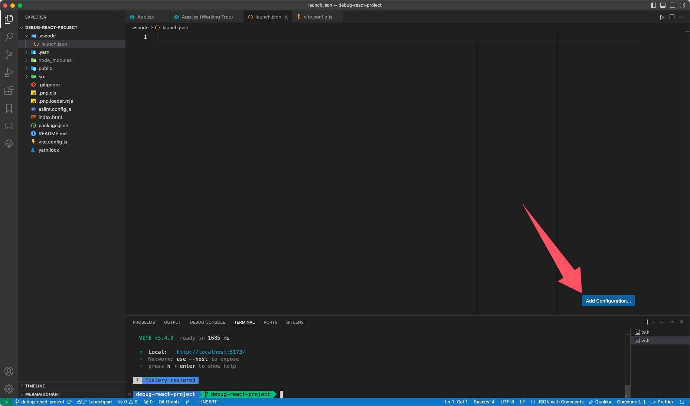

点击后，选择 `Chrome: Launch`，文件中就会出现一段 json 配置：

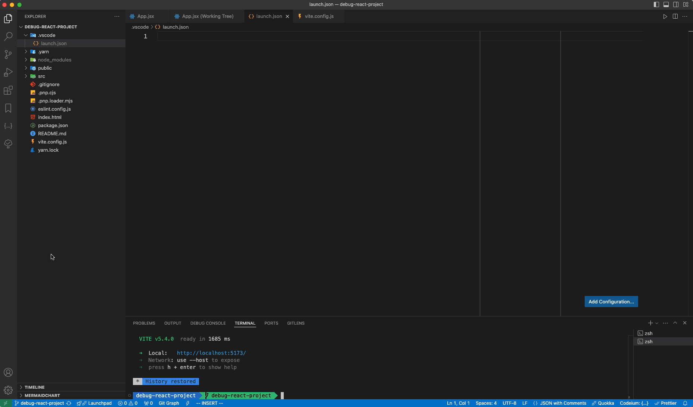

把访问的 url 改为开发服务器启动的地址：


然后进入 Debug 窗口，点击启动：


点击按钮之后，你会发现它启动了浏览器，并打开了配置中的 url：


VS Code 中还会有一排控制执行的按钮：


上面的控制按钮分别对应恢复执行、单步执行、进入函数调用、跳出函数调用，这个和 Chrome DevTools 一样的；还多了刷新和停止的按钮。

在代码打个断点，然后点击右边第二个按钮刷新，代码会执行到断点处断住，本地和全局作用域的变量，调用栈等都会展示在左边；浏览器也会刷新。


下面是各个功能的介绍：


看起来和 Chrome DevTools 里调试差不多，在 VSCode Debugger 里调试有啥好处呢？

好处就是不用切换工具，之前是调试在 Chrome DevTools，写代码在 VSCode，而现在写代码和调试都可以在 VSCode 里，无需在 Chrome DevTools 和 VSCode 之间切换。这种集成化的环境让开发者能够边写代码边调试，从而提高开发效率。

相比于 Chrome DevTools 的异常断点的设置，VS Code 表现形式略有不同，如下图：


    

### 配置说明

#### **launch 和 attach**

无论自动创建还是手动创建，都会选择 launch 还是 attach 模式！


先引入一段配置，它们只是 request 的配置不同，然后 `attach` 模式有 `port`，`launch` 模式有 `url`：
```json
{
    "configurations": [
        {
            "name": "Attach to Chrome",
            "port": 9222,
            "request": "attach",
            "type": "chrome",
            "webRoot": "${workspaceFolder}"
        },
        {
            "name": "Launch Chrome",
            "request": "launch",
            "type": "chrome",
            "url": "http://localhost:5173",
            "webRoot": "${workspaceFolder}"
        }
    ]
}
```
- Launch（启动）模式

  当你使用 `launch` 模式进行调试时，VS Code 将直接启动并控制你想要调试的应用程序。

  也就是 VS Code 会作为应用程序的启动器，它会在内部创建一个进程来运行你的代码，并且这个进程会受到调试器的监控。

  当你在代码中设置了断点，程序在运行到这些断点时会暂停，等待你进行调试操作，比如单步执行、查看变量值等。

- Attach（附加）模式

  相比之下，attach 模式允许你将调试器连接到一个已经运行的外部进程。

  比如，我们在调试 Node.js 项目时，有时候也会用 Chrome 浏览器的调试界面来调试。这通常用于调试那些不能由 VS Code 直接启动的程序，或者你想在程序运行到某个特定状态时才开始调试的情况。
  
  在 `attach` 模式下，你需要先手动启动你的应用程序，然后配置调试器去连接到该应用程序的进程ID或监听的端口。
  
  一旦连接成功，你就可以像在 `launch` 模式下那样设置断点和进行调试。


#### **常用常量**

- `${workspaceRoot}`：VS Code 当前打开的文件夹

- `${file}`：当前打开的文件
- `${relativeFile}`：相对于 `workspaceRoot` 的相对路径
- `${fileBasenameNoExtension}`：当前文件的文件名，不带后缀，也即 `launch`
- `${fileBasename}`： 当前打开文件的文件名
- `${fileDirname}`： 所在的文件夹，是绝对路径
- `${fileDirname}`：文件所在的文件夹路径
- `${lineNumber}`：当前文件光标所在的行号
- `${fileExtname}`：当前打开文件的拓展名，如.json
- `${cwd}`： 启动时任务运行程序的当前工作目录
- `${workspaceFolder}`：表示当前workspace文件夹路径
- `${workspaceRootFolderName}`：表示workspace的文件夹名
- `${env:PATH}`：系统中的环境变量

#### **下面是 `launch` 和 `attach` 类型共有的属性**

- `protocol`：设置调试协议

- `auto`： 尝试自动检测目标运行时使用的协议
- `inspector` 新的V8调试器协议，解决遗留版本的多数问题，`node versions >= 6.3 and Electron versions >= 1.7.4`
`legacy`： 原始的v8调试器协议，`node versions < v8.0 and Electron versions < 1.7.4`.
- `port`：调试使用的端口
- `address` ：TCP/IP 地址，用于远程调试
- `localRoot`： 远程调试时映射的本地地址
- `remoteRoot`： 远程调试时的远程目录地址
- `sourceMaps`： 默认为 `true`
- `outFiles` ：当 `map` 文件不在 js 文件同目录时用于指定 `sourceMaps` 的位置
- `restart` ：自动重启调试
- `timeout`： 配置自动附加的超时时间
- `stopOnEntry`： 自动断点到第一行代码处
- `smartStep`： 自动跳过未映射到源代码的代码
- `skipFiles`：`[]String`指定跳过单步调试的代码
- `trace`： 启用诊断输出
- `userDataDir`： 是保存用户数据的地方，比如你的浏览记录、cookies、插件、书签、网站的数据等等
- `sourceMapPathOverrides`：对 sourcemap 到的文件路径做一次映射，映射到 VSCode work
- `space` 下的文件，这样调试的文件就可以修改了
- `file`：可以直接指定某个文件，然后启动调试

#### 以下是特定于类型 launch(启动)的配置属性：

- `program`： 指定调试入口文件地址

- `args` ： `[]String` 传递给程序的参数,可在 `process.argv` 拿到
- `cwd` ：指定程序启动调试的目录 ,当 vscode启动目录不是项目根目录，并且调试 `npm script` 时非常有用
- `runtimeExecutable`： 设置运行时可执行文件路径，默认是 node 可以是其他的执行程序，如 npm、nodemon；如果是浏览器的话，可以是 stable，也就是稳定的 Google Chrome，或者 canary，也就是每日构建版的 Google Chrome Canary，还可以是 custom，然后用 CHROME_PATH 环境变量指定浏览器的地址。
- `runtimeArgs`： 传递给运行时可执行文件的参数。
- `runtimeVersion`： 设置运行时可执行程序的版本，如果使用 nvm，可以切换 node.js 版本。
- `env`： 添加额外的环境变量。
- `envFile`： 文件加载环境变量。
- `console`： 配置终端可以是外部终端或者内部集成终端，默认值 `internalConsole`。


## 总结
本文涵盖了从基础概念到具体实践的 React 调试全过程。文章分为五个部分：

1. 介绍了什么是调试以及调试过程中我们应该关心那些东西。

2. 常用的提示工具，深入探讨了多种调试工具和技巧，特别是在 Chrome DevTools 和 React DevTools 两部分有比较深入的探索，让我们再开发过程中能够快速定位问题并进行有效调试。

3. 使用 vite 创建项目，详细介绍了如何使用 vite 这一现代前端构建工具快速搭建 React 项目，为调试工作提供了一个高效的开发环境。

4. 在 Chrome 中调试项目，展示了如何利用 Chrome DevTools 的强大功能。

5. 在 VS Code 中调试项目，重点介绍了 VS Code 的 Debugger 功能，包括设置断点、单步执行、监视变量等，在编码环境中直接进行调试。

通过这五个部分的系统性学习，不仅能够理解 React 调试的基础知识，还能掌握在 VS Code 和 Chrome 中进行高效调试的实用技能。虽然文章是以 React 作为项目的支撑点，但是换成 Vue 也大相径庭！

如果以上内容对你有帮助欢迎大家点赞、收藏、关注！