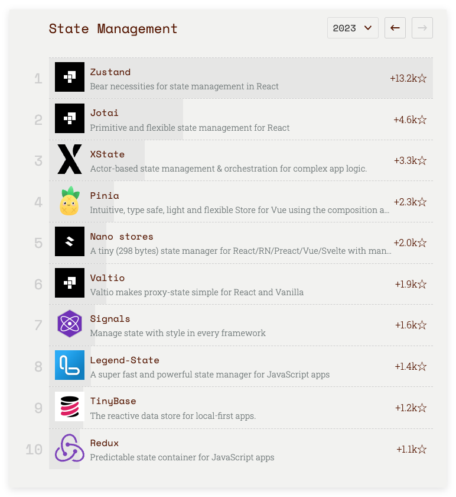

React 状态管理是指处理和更新 React 组件状态的过程。它涉及创建、更新和跨不同组件共享数据，以确保用户界面 (UI) 保持一致且响应迅速。

组件的状态是可以根据用户交互或其他因素而变化的动态方面。有效的状态管理对于构建能够有效处理用户交互和数据变化的复杂 React 应用程序至关重要。

## 什么是状态？

“状态” 是指描述某一时刻应用程序的全部数据，而状态管理则是指在应用中维护和更新状态的方法和工具。而根据使用范围和管理方式，状态又可以大致划分为三类。

- **局部状态**：这是指那些***仅在单个组件内使用和维护的状态***。在函数式组件中，使用 `useState` 或 `useReducer` 钩子来创建和管理这些状态。在类式组件中，则使用 `this.state` 和 `this.setState` 方法。局部状态一般用于控制组件的内部行为，如用户输入、表单控制等。
- **全局状态**：当***状态需要在多个组件间共享***时，我们使用全局状态。这些状态不属于某一个特定的组件，而是整个应用的共享资源。为了管理全局状态，React 提供了 Context API，但通常我们会选择更专业的库，如 React Redux、Zustand、Jotai 等，它们提供了更强大的功能和更好的开发体验。
- **服务器状态**：这种状态涉及到与服务器的交互。服务器状态是从服务器获取的数据，并在前端应用中展示和管理。例如，当你从 API 获取数据并在 UI 中展示时，就在处理服务器状态。管理服务器状态的流行库包括 Tanstack Query、SWR、Apollo Client 等，它们提供数据获取、缓存、更新等功能，简化了与后端数据交互的复杂性。

## 主流的状态管理库

截止今日(2024-09-04)各主流库的 [trends](https://npmtrends.com/jotai-vs-mobx-vs-react-query-vs-recoil-vs-redux-vs-swr-vs-valtio-vs-xstate-vs-zustand) 数据如下：


| 名称                                                     | star数 | 最新版本 | 创建时间 | 最近更新时间 |
| -------------------------------------------------------- | ------ | -------- | -------- | ------------ |
| [Redux](https://github.com/reduxjs/redux)                | 60.7k  | v5.0.1   | 2012     | 2023-11-24   |
| [Zustand](https://github.com/pmndrs/zustand)             | 45.6k  | V4.5.5   | 2017     | 2024-08-16   |
| [MobX](https://github.com/mobxjs/mobx)                   | 27.4k  | v6.13.1  | 2016     | 2024-07-18   |
| [XState](https://github.com/statelyai/xstate)            | 26.8k  | v2.2.1   | 2017     | 2024-08-20   |
| [Recoil](https://github.com/facebookexperimental/Recoil) | 19.5k  | v0.7.7   | 2020     | 2023-04-12   |
| [Jotai](https://github.com/pmndrs/jotai)                 | 18.1k  | v2.9.3   | 2021     | 2024-08-18   |
| [Valtio](https://github.com/pmndrs/valtio)               | 8.8k   | v1.13.2  | 2021     | 2024-03-02   |
| [react-query](https://github.com/TanStack/query)         | 41.4k  | v5.52.0  | 2019     | 2024-08-21   |
| [swr](https://github.com/vercel/swr)                     | 30.1k  | v2.2.5   | 2019     | 2024-02-16   |

从上面的图中可以看到，可以看到 react-redux 无论 star 数还是流行度都遥遥领先，其次就是 Zustand。虽然 redux 作为老牌的状态管理库仍被用在大量项目中，但他的 Stars 上升排名仅仅只能排到第十位，而且其由于较高的上手难度以及较为繁琐的配置和模板代码，被很多人所诟病。下图就是2023年过去一年状态管理库 star 数的上升情况（https://risingstars.js.org/2023/en#section-statemanagement）:



## Redux

redux 是一个比较老牌的一个 JavaScript 应用的状态管理库，常与 React 一起使用，它**提供的模式和工具使你更容易理解应用程序中的状态何时、何地、为什么以及如何更新，以及当这些更改发生时你的应用程序逻辑将如何表现**。

> Redux 也可以不和 React 组合使用的（通常一起使用）。

### 什么时候应该用 Redux 

Redux 可帮助你处理共享状态的管理，但与其他工具一样，它也有学习和维护成本。这是短期和长期生产力之间的权衡。

Redux 在以下情景中更有用：

- 在应用的大量地方，都存在大量的状态。
- 应用状态会随着时间的推移而频繁更新。
- 更新该状态的逻辑可能很复杂。
- 中型和大型代码量的应用，很多人协同开发。

### Redux 的关键概念

1. **Store**：应用程序的单一状态源，保存整个应用的状态。
2. **Actions**：描述应用程序中发生了什么的普通 JavaScript 对象。它们必须包含一个 `type` 属性，还可以包含其他数据。
3. **Reducers**：纯函数，接收当前状态和一个 actions 作为参数，并返回一个新的状态。它们决定在响应 actions 时状态如何变化。
4. **Dispatch**：用于将 actions 发送到存储的方法。当一个 actions 被触发时，存储会运行 reducer 来更新状态。
5. **Selectors**：用于从存储中检索特定状态的函数，使访问和计算派生数据变得更加容易。

下面来看一个例子：

```html
<!DOCTYPE html>
<html>

<head>
    <title>Redux basic example</title>
</head>

<body>
    <div>
        <p>
            Clicked: <span id="value">0</span> times
            <button id="increment">+</button>
            <button id="decrement">-</button>
            <button id="incrementIfOdd">Increment if odd</button>
            <button id="incrementAsync">Increment async</button>
        </p>
    </div>
    <script type="module">
        import { createStore } from "https://unpkg.com/redux@latest/dist/redux.browser.mjs";
        // 定义初始状态值
        const initialState = {
            value: 0
        };

        const types = {
            INCREMENT: "counter/incremented",
            DECREMENT: "counter/decremented"
        };

        // 创建一个“reducer”函数
        function counterReducer (state = initialState, action) {
            // 根据 action 的类型来更新状态
            switch (action.type) {
                case types.INCREMENT:
                    return { ...state, value: state.value + 1 };
                case types.DECREMENT:
                    return { ...state, value: state.value - 1 };
                default:
                    // 没有匹配上的 action.type，返回原始 state
                    return state;
            }
        }

        // 通过 createStore 方法创建一个新的 Redux store，使用 counterReducer 进行更新逻辑
        const store = createStore(counterReducer);

        const valueEl = document.getElementById("value");

        // 每当存储的状态发生变化时，更新 UI，读取最新的存储状态并显示新数据
        function render () {
            const state = store.getState();
            valueEl.innerHTML = state.value.toString();
        }

        // 用初始数据更新 UI
        render();

        // 数据变化时触发render
        store.subscribe(render);

        document
            .getElementById("increment")
            .addEventListener("click", function () {
                store.dispatch({ type: types.INCREMENT });
            });

        document
            .getElementById("decrement")
            .addEventListener("click", function () {
                store.dispatch({ type: types.DECREMENT });
            });

        document
            .getElementById("incrementIfOdd")
            .addEventListener("click", function () {
                // 当 store 中的状态是奇数时，dispatch 一个 INCREMENT 事件
                if (store.getState().value % 2 !== 0) {
                    store.dispatch({ type: types.INCREMENT });
                }
            });

        document
            .getElementById("incrementAsync")
            .addEventListener("click", function () {
                // 模拟异步逻辑
                setTimeout(function () {
                    store.dispatch({ type: types.INCREMENT });
                }, 1000);
            });
    </script>
</body>

</html>
```

因为 Redux 是一个无任何依赖的独立的 js 库，所以我这个示例里只用了一个 script 标签去加载 Redux 库，用了基础的 JS、HTML 去写 UI。但在实际开发中，Redux 通常是通过[ npm 包的方式引入](https://cn.redux.js.org/introduction/installation)的，UI 通常是通过像 [React](https://reactjs.org/) 这类的库去创建的。

### 数据流

可以使用一张 gif 图来图解 Redux 应用中的数据流。它描绘了：

- actions 会在用户交互如点击时被 dispatch
- store 通过执行 reducer 方法计算出一个新的 state
- UI 读取最新的 state 来展示最新的值


### 单向数据流

从上面的计数器例子可以看出：

- 状态描述应用程序在特定时间点的状况
- UI 根据该状态进行渲染
- 当发生某些事情时（例如用户单击 Increment/decrement 按钮），状态将根据发生的事情进行更新
- UI 根据新状态重新渲染


## redux 在 react 中的使用

#### 使用 Vite 创建一个 React 项目

```sh
$ npx create-vite
```


然后进入 vite-react-redux 项目目录安装依赖，项目结构如下：

```js
.
├── public
│   └── vite.svg
├── src
│   ├── App.css
│   ├── App.jsx
│   ├── assets
│   │   └── react.svg
│   ├── index.css
│   └── main.jsx
├── .gitignore
├── eslint.config.js
├── index.html
├── package-lock.json
├── package.json
├── README.md
└── vite.config.js
```

使用命令 `npm run  dev` 启动项目：


启动后效果如下图：


在 React 中使用 redux，官方建议安装两个扩展库：

1. `Redux Toolkit（RTK）`：官方推荐编写Redux逻辑的方式，是一套**工具**的集合集，简化书写方式
2. `React-Redux` ：用来 链接 Redux 和 React 组件的**中间件**；[React Redux](https://link.juejin.cn/?target=https%3A%2F%2Fgithub.com%2Freduxjs%2Freact-redux) 是 Redux 的官方 React UI 绑定层。它允许 React 组件从 Redux 存储中读取数据，并将操作调度到存储以更新状态。

安装这两个扩展库：

```sh
$ npm install @reduxjs/toolkit react-redux
```

> 我这里安装完成之后所对应的版本是：
>
> ```js
> "dependencies": {
>     "@reduxjs/toolkit": "^2.2.7",
>     "react": "^18.3.1",
>     "react-dom": "^18.3.1",
>     "react-redux": "^9.1.2"
> }
> ```

下面就来看看这两个插件的具体使用场景和常用的方法。

### react-redux

Redux 本身是一个独立的库，可以与任何 UI 层或框架一起使用，包括 React、Angular、Vue、Ember 和 vanilla JS。虽然 Redux 和 React 通常一起使用，但它们彼此独立。

`React-Redux` 将所有组件分成两大类：

1. UI 组件：负责呈现页面（React侧）。
2. 容器组件：负责管理数据和业务逻辑（Redux侧）。

> Redux 和 React-Redux 的区别是什么？ 
>
> Redux 是基础的状态管理库，而 React-Redux 是针对 React 的库，用于简化 Redux 在 React 应用中的使用。

#### `Provider`

`Provider`是 React-Redux 中的一个高阶组件，它的作用是将 Redux 的 store 传递给整个 React 应用程序，使得所有的组件都能够访问到 Redux 的状态。通过`Provider`，我们可以在 React 应用的任何地方使用 Redux 的状态和派发动作。

使用 `Provider` 的主要好处是，在整个应用程序中，任何一个组件都可以通过 `connect` 函数或者 `useSelector` 钩子来访问 Redux store 中的状态，而不需要手动地将 store 传递给每一个组件。这样做的好处有：

1. **简化代码**: 不需要在每一个组件中手动传递 store，通过 `Provider`，store 可以在整个应用程序中自动地传递给需要的组件。
2. **避免 prop drilling**: 避免了在组件层级结构中进行多层次的 prop 传递，提高了代码的可维护性和可读性。
3. **一致性**: 所有的组件都使用相同的 Redux store，保证了应用程序中状态的一致性。

```jsx
import React from 'react'
import ReactDOM from 'react-dom'
import { Provider } from 'react-redux'

import { App } from './App'
import store from './store/store'

const root = ReactDOM.createRoot(document.getElementById('root'))
root.render(
  <Provider store={store}>
    <App />
  </Provider>,
)
```

在上面的示例中，我们将 Redux store 通过 Provider 传递给了根组件 `<App />`，这样在整个应用程序中的任何地方，我们都可以使用 React-Redux 提供的 hooks 或者高阶组件来访问 Redux 的状态，以及派发 Redux 的动作。

#### 如何“消费” store 中的数据

react-redux 提供了两种 “消费”方式，一种 Hooks，另一种 connect；它们各有优缺点，下面是它们的对比：

**useSelector**

- **功能**：`useSelector` 是一个 React Hook，用于从 Redux store 中选择并获取状态。
- **语法**：使用简单，直接在函数组件中调用。
- **组件类型**：只能在函数组件中使用。
- **性能**：通过引用相等性检查，自动优化组件更新，避免不必要的重新渲染。
- **易用性**：更直观，适合使用函数组件和 Hooks 的现代 React 开发。

```jsx
import { useSelector } from 'react-redux';

const MyComponent = () => {
    const myData = useSelector((state) => state.myReducer.myData);
	return <div>{myData}</div>;
};
```

**connect**

- **功能**：`connect` 是一个高阶组件（Higher-Order Component），用于将 Redux store 的数据和 dispatch 函数传递给 React 组件。
- **语法**：需要通过包装组件来使用，较为繁琐。
- **组件类型**：可以在类组件和函数组件中使用。
- **性能**：通过 `mapStateToProps` 和 `mapDispatchToProps` 进行优化，但可能会在某些场景下造成额外的复杂性。
- **易用性**：对于初学者来说，理解起来可能稍微复杂，尤其是在嵌套的组件中。

```jsx
import { connect } from 'react-redux';

const MyComponent = ({ myData }) => {
	return <div>{myData}</div>;
};

const mapStateToProps = (state) => ({
	myData: state.myReducer.myData,
});

export default connect(mapStateToProps)(MyComponent);
```

> 小结一下：
>
> - **使用场景**：如果你在使用函数组件，并且喜欢使用 Hooks，`useSelector` 是更好的选择。如果你在使用类组件，或者需要更复杂的连接逻辑，`connect` 可能更合适。
> - **简洁性**：`useSelector` 提供了更简洁的语法，适合现代 React 开发，而 `connect` 则在一些复杂情况下提供了更强的灵活性。

上面对比了 useSelector 和 connect 两个方法，下面我们就详细看看这两！

#### useSelector 钩子函数

`useSelector` 是 `react-redux` 提供的一个 React Hook，用于从 Redux Store 中获取状态数据。使用方式也比较简单，在函数组件中：

```jsx
import { useSelector } from "react-redux";

function App() {
	const {count} = useSelector((state) => state.counter)
	return <div>{count}</div>
}

export default App;
```

当 Redux Store 中的状态发生变化时，使用 `useSelector` 的组件会自动重新渲染。这是通过引用相等性检查（shallow equality check）实现的，只有当选择的数据发生变化时，组件才会更新。

#### useSelector 最佳实践

```jsx
// BAD: 返回整个状态就意味着组件会不必要地重新渲染
const { count, user } = useSelector((state) => state)

// GOOD: 只获取需要的数据
const count = useSelector((state) => state.count.value)
const user = useSelector((state) => state.auth.currentUser)
```

#### `connect` 方法

`connect` 是 React-Redux 提供的一个函数，用于将 React 组件与 Redux store 连接起来。这个函数可以传四个参数：

```ts
function connect<
  TStateProps = {},
  TDispatchProps = {},
  TOwnProps = {},
  TMergedProps = {},
  State = unknown,
>(
  mapStateToProps?: MapStateToPropsParam<TStateProps, TOwnProps, State>,
  mapDispatchToProps?: MapDispatchToPropsParam<TDispatchProps, TOwnProps>,
  mergeProps?: MergeProps<TStateProps, TDispatchProps, TOwnProps, TMergedProps>,
  options: ConnectOptions<unknown, unknown, unknown, unknown> = {},
): unknown 
```

- `mapStateToProps`：将 Redux Store 中的状态映射到组件的 props。

  ```js
  const mapStateToProps = state => {
    return {
      count: state.count,
    }
  }
  ```

- `mapDispatchToProps`：将 action creators 映射到组件的 props 中的回调函数。

  ```js
  const mapDispatchToProps = {
    increment,
    decrement,
  }
  ```

完整示例如下：

```jsx
import React from 'react';
import { connect } from 'react-redux';
import { increment, decrement } from './actions';

function App ({ count, increment, decrement }) {
    return (
        <div>
            <button onClick={increment}> + </button>
            <p>{count}</p>
            <button onClick={decrement}> - </button>
        </div>
    )
}

const mapStateToProps = state => {
    return {
        count: state.count,
    }
}

const mapDispatchToProps = {
    increment,
    decrement,
}

// 使用 connect 函数连接组件和 Redux store
export default connect(mapStateToProps, mapDispatchToProps)(App)

```

在上面的示例中，我们通过 `connect` 函数把 Redux Store 和组件连接起来。我们使用 `mapStateToProps` 函数将 Redux store 中的 `count` 状态映射到 App 组件的 `count props` 中，同时使用 `mapDispatchToProps` 对象将 `increment` 和 `decrement` 的 action creators 映射到组件的 `increment` 和 `decrement` props 中的回调函数。

上面知道了如何“消费” Store 中的数据，下面我们看看如何在 React 组件中修改 Store 的值。

#### 如何修改 store 中的数据

这里仍然区分函数组件和类组件，如果在类组件中，可以使用上面 connect 的方式去修改，下面我们重点来看看函数组件中应该怎么去修改？

没错，就是 `useDispatch` 钩子函数，useDispatch` 是 `react-redux` 提供的一个 React Hook，用于在函数组件中获取 Redux store 的 `dispatch` 函数。允许你发送（dispatch）actions，以更新 Redux store 的状态。比如：

```js
const inc = () => dispatch(increment())
```

`useDispatch` 通常与 `useSelector` 一起使用，使得组件能够同时访问状态和更新状态。但只能在函数组件中使用，不能在类组件中使用。

```jsx
import { useDispatch, useSelector } from "react-redux"
import { increment, decrement } from "./store/reducers/counter"

function UseDispatch () {
    const { count } = useSelector((state) => state.counter)
    // 使用useDispatch()函数
    const dispatch = useDispatch()
    return (
        <div>
            {/* 加 */}
            <button onClick={() => dispatch(increment())}> + </button>
            {count}
            {/* 减 */}
            <button onClick={() => dispatch(decrement())}> - </button>
        </div>
    )
}

export default UseDispatch
```

在这个示例中，使用 `useDispatch` 钩子函数获取了 Redux store 的 `dispatch` 函数，并将其赋值给 `dispatch` 变量。随后，我们可以在组件中使用 `dispatch` 函数来派发 Redux actions，例如在按钮的点击事件处理函数中派发 `increment` 和 `decrement` actions。

#### 在 redux 中处理异步 action


### Redux Toolkit（RTK）

通俗点讲，Redux Toolkit 旨在简化 Redux 开发，解决配置复杂、依赖过多和模板代码冗长等问题。接下来我们看看 RTK 中有哪些方法?该怎么用?

#### `configureStore`

`configureStore` 函数是用于创建 Redux Store 的一个方法；它接受一个包含 reducer 函数和其他配置选项的对象，并返回一个 Redux Store 实例。

```ts

interface ConfigureStoreOptions<
  S = any,
  A extends Action = UnknownAction,
  M extends Tuple<Middlewares<S>> = Tuple<Middlewares<S>>
  E extends Tuple<Enhancers> = Tuple<Enhancers>,
  P = S
> {
  reducer: Reducer<S, A, P> | ReducersMapObject<S, A, P>
  middleware?: ((getDefaultMiddleware: CurriedGetDefaultMiddleware<S>) => M) | M
  devTools?: boolean | DevToolsOptions
  preloadedState?: P
  enhancers?: (getDefaultEnhancers: GetDefaultEnhancers<M>) => E | E
}

function configureStore<
  S = any,
  A extends Action = UnknownAction,
  M extends Tuple<Middlewares<S>> = Tuple<Middlewares<S>>
  E extends Tuple<Enhancers> = Tuple<Enhancers>,
  P = S
>(options: ConfigureStoreOptions<S, A, M, E, P>): EnhancedStore<S, A, M, E>
```

##### 参数

> 上面的代码中其实也有详细的注释，我这里还是简单的说明一下

- reducer：一个或多个 reducer 纯函数，用于处理来自 action creators 的动作并更新状态。
- middleware：中间件，是一个数组。
- devTools：是否启用 Redux DevTools，默认是 true，也可以在这里配置。
- preloadedState：初始状态跟 Redux 的 createStore 相同。
- enhancers：用于定制增强器数组的回调函数。

##### 返回值

```ts
export type EnhancedStore<
  S = any,
  A extends Action = UnknownAction,
  E extends Enhancers = Enhancers,
> = ExtractStoreExtensions<E> &
  Store<S, A, UnknownIfNonSpecific<ExtractStateExtensions<E>>>
    
    
interface Store<S = any, A extends Action = UnknownAction, StateExt extends unknown = unknown> {
    dispatch: Dispatch<A>;
    getState(): S & StateExt;
    subscribe(listener: ListenerCallback): Unsubscribe;
    replaceReducer(nextReducer: Reducer<S, A>): void;
    [Symbol.observable](): Observable<S & StateExt>;
}
```

- getState：用于获取当前状态。
- dispatch：用于派发一个动作去触发状态的更新操作。
- subscribe：用于添加一个状态变化的监听器，当状态发生变化时会被调用。
- replaceReducer：替换当前的 reducer。

```js
import { configureStore } from '@reduxjs/toolkit'
import rootReducer from './reducers';

const store = configureStore({ reducer: rootReducer });

export default store;
```

上面这段代码的就使用 Redux Toolkit 的 `configureStore` 函数创建一个 Redux Store 实例，并导出该 Store，以便在整个应用中进行状态管理。

#### `createSlice`

`createSlice` 函数的作用是创建一个 Redux 的 slice。它接受一个包含 reducer 函数、slice 名称和初始状态的配置对象，并返回一个包含 reducer 和 action creators 的对象。

```ts
function createSlice({
    name: string,
    initialState: State,
    reducers: Record<string, ReducerFunction | ReducerAndPrepareObject>,
    extraReducers?: (builder: ActionReducerMapBuilder<State>) => void,
    reducerPath?: string,
    selectors?: Record<string, (sliceState: State, ...args: any[]) => any>,
})
```

##### 参数

- name：当前 slice 的名称。
- initialState：当前 slice 的初始值。
- reducers：是一个对象，包含一组同步的 reducer 函数，用于状态更新的方法。

##### 返回值

```ts
{
    name: string,
    reducer: ReducerFunction,
    actions: Record<string, ActionCreator>,
    caseReducers: Record<string, CaseReducer>.
    getInitialState: () => State,
    reducerPath: string,
    selectSlice: Selector;
    selectors: Record<string, Selector>,
    getSelectors: (selectState: (rootState: RootState) => State) => Record<string, Selector>
    injectInto: (injectable: Injectable, config?: InjectConfig & { reducerPath?: string }) => InjectedSlice
}
```

- `name`：slice 的名称。
- `reducer`：一个 reducer 函数，用于处理来自 action creators 的动作并更新状态。
- `actions`：一组 action creators，用于创建派发给 reducer 的动作。`selectors`：

## 实操

同样以上面 Redux 中的计数器为例，使用 redux-toolkit 改写如下：

1. 创建 store 和 slice。
2. 在不同组件中改变 count 的值，上面例子中有四种：Increment、decrement、incrementIfOdd 和 incrementAsync，这里除了最后一个异步操作不模拟之外，对另外三个进行改写。
3. 在 React 应用的入口文件中配置 react-redux 的 Provider。

### 创建 store

在项目的 src 目录下创建一个 store 目录，然后再创建一个 store.js 文件，然后在 store 目录中创建 reducers/counter.js，起文件中的内容如下：

```js
// src/store/reducers/counter.js
import { createSlice } from '@reduxjs/toolkit';

// 定义初始状态
const initialState = {
    count: 0,
};

// 创建一个 Redux slice
const counterSlice = createSlice({
    name: 'counter',
    initialState,
    reducers: {
        increment (state) {
            state.count += 1;
        },
        decrement (state) {
            state.count -= 1;
        },
        incrementIfOdd (state) {
            if (state.count % 2 !== 0) {
                state.count += 1;
            }
        },
    },
});

// 导出action creators
export const { increment, decrement, incrementIfOdd, incrementAsync } = counterSlice.actions;
// 导出reducer
export default counterSlice.reducer;
```

```js
// src/store/store.js
import { configureStore } from '@reduxjs/toolkit';
import counter from './reducers/counter';

// 创建 Redux store
const store = configureStore({
    reducer: {
        counter
    },
});

export default store

```

### 在项目的根目录中引入 Provider

```jsx
// src/main.jsx
import { createRoot } from 'react-dom/client'
import { Provider } from "react-redux";

import App from './App.jsx'
import './index.css'
import store from './store/store'

createRoot(document.getElementById('root')).render(
  <Provider store={store}>
    <App />
  </Provider>,
)
```

### 对上面的三种方法分别封装组件

> 在实际开发场景中，基本上不会这么干，我这里只是为了演示效果！

在 src 目录下创建 `components.jsx` 文件，然后分别封装三个组件，内容如下：

```jsx
import { useDispatch } from 'react-redux'
import { decrement, increment, incrementIfOdd } from './store/reducers/counter'

export const Increment = () => {
    const dispatch = useDispatch()
    return (
        <button onClick={() => dispatch(increment())}>Increment</button>
    )
}


export const Decrement = () => {
    const dispatch = useDispatch()
    return (
        <button onClick={() => dispatch(decrement())}>Decrement</button>
    )
}

export const IncrementIfOdd = () => {
    const dispatch = useDispatch()
    return (
        <button onClick={() => dispatch(incrementIfOdd())}>Increment if odd</button>
    )
}
```

### 在App 组件中引入上面三个组件

```jsx
// src/App.jsx
import { useSelector } from 'react-redux'
// ...
import { Decrement, Increment, IncrementIfOdd } from './Components'

function App () {
  const counter = useSelector(state => state.counter)
  return (
    <>
      {
      	// ...其他 UI
      }
      <Increment />
      <Decrement />
      <IncrementIfOdd />
    </>
  )
}

export default App
```

