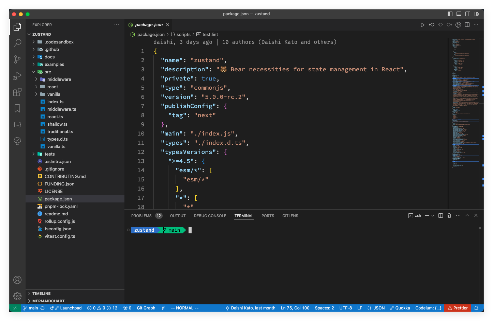
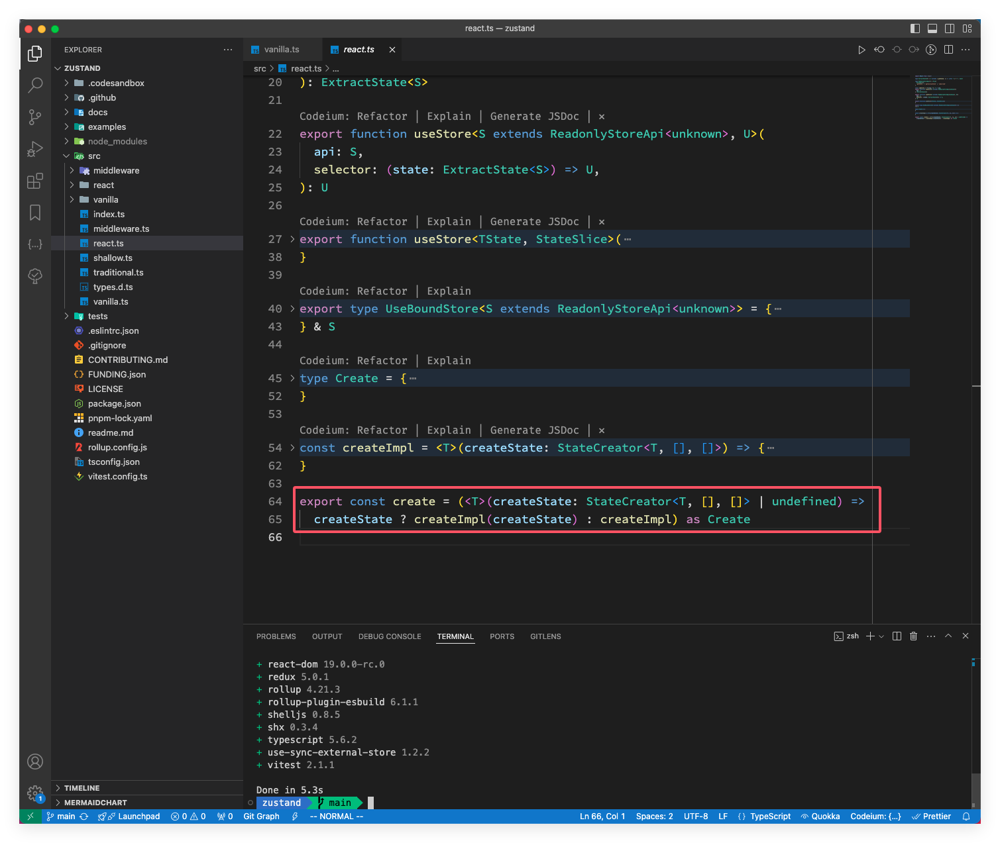

在上一篇文章中深入的学习了 zustand 的概念及在 React 中的使用，接下来我们看看他的源码！

> 我从官方仓库 fork 了一份最新的代码（v5.0.0-rc.2）版本，可以访问 [https://github.com/clin211/zustand](https://github.com/clin211/zustand) 查看，本文也是基于这个版本进行学习！
>
> 环境要求:
>
> - Node.js   >=12.20.0
> - TypeScript   >=4.5
> - pnpm 虽然没有版本要求，为了达到与下文一样的效果，可以跟我保持一致，使用 v8.12.1

## 目录分析



从上面的图中，我们可以看到以下主要的文件和目录：

- `src/`：源代码目录
  - `middleware/`:
    - `combine.ts:` 实现了将多个 store 组合在一起的中间件。
    - `devtools.ts`: 实现了与 Redux DevTools 进行交互的中间件。
    - `immer.ts`: 支持 immer 库的中间件，用于不可变数据结构。
    - `persist.ts`: 实现了持久化 store 的中间件。
    - `redux.ts`: 模拟 Redux 风格的中间件。
    - `subscribeWithSelector.ts`: 支持选择订阅和响应的中间件。
  - `react/`:
    - `shallow.ts`: 实现 react 相关的浅比较函数，用于优化组件渲染。
  - `vanilla/`:
    - `shallow.ts`: 实现原生状态管理版本的浅比较函数。
  - `index.ts`: Zustand 的主要入口文件，会汇总和输出所有核心功能。
  - `middleware.ts`: 汇总和重导出中间件。
  - `react.ts`: 实现了 Zustand 与 React 的绑定，导出有关 React 接口和 `create`等 。
  - `shallow.ts`: 提供浅比较功能，通常用于比较状态变化以优化性能。
  - `traditional.ts`: 提供了传统的状态管理模式，适用于不使用 hooks 的场景。
  - `types.d.ts`: TypeScript 类型声明文件，定义了 Zustand 中使用的类型。
  - `vanilla.ts`: 实现了 Zustand 的核心功能，不依赖于 React。这使得 Zustand 可以在其他环境（如 React Native）中使用。

- `docs/`：介绍文档
- `examples/`：示例代码
- `tests/`：单元测试代码
- `package.json`：项目配置文件

通常前端库的核心逻辑都在 src 目录下，入口文件一般也是 `index.js/ts`，zustand 也不例外，上图就是 zustand 的源码，从目录结构可以看出 src 下有 vanilla、react、middleware 三个目录，什么是 vanilla 呢？**vanilla 就是可以不结合任何框架（例如 React、Vue 等等）来单独使用的**，我们就称其为 vanilla，我们可以在许多库的源码中看到 vanilla 文件或者文件夹，比如 jotai、valtio 等，这些包含了最基础的 JavaScript 实现，而我们平时在 React 使用的，是这些基础的实现 + Hooks。react 目录就是适配的 react 框架，middleware 就是中间件。

## 源码解读

上面我们对项目结构有大致的认识，接下来就一步步揭开 zustand 的神秘面纱；先从入口文件（index.ts）看，它导出了 vanilla.ts 和 react.ts 两个文件:

```ts
export * from './vanilla.ts'
export * from './react.ts'
```

上一篇文章主要就是在 react 中的使用，源码我们依然从 react 的视角入手！

> vs code 看源码的小技巧：
>
> - 要操作光标所在**文件**中的所有代码块：
>   - 折叠所有 `Command+K+0`
>   - 展开所有 `Command+K+J`
> - 仅仅操作光标所**代码块**内的代码：
>   - 折叠 `Command+Option+[`
>   - 展开 `Command+Option+]`

### create

先看 `react.ts`， 这个文件的代码量也不大，不到 70 行，将代码折叠起来后，代码结构也一目了然，基本上也能看到导出了哪些函数/方法、类型；其中就有一个我们比较熟悉的 `create` 方法：

```ts
export const create = (<T>(createState: StateCreator<T, [], []> | undefined) =>
  createState ? createImpl(createState) : createImpl) as Create
```



这个方法就是用来创建一个 store 的，在使用 `create` 方法的时候，如果有 `createState` 参数，就调用 `createImpl` 方法，否则就返回 `createImp` 方法。`createState` 是一个回调函数，里面包含我们定义的状态和更改函数。

```ts
export type StateCreator<
  T,
  Mis extends [StoreMutatorIdentifier, unknown][] = [],
  Mos extends [StoreMutatorIdentifier, unknown][] = [],
  U = T,
> = ((
  setState: Get<Mutate<StoreApi<T>, Mis>, 'setState', never>,
  getState: Get<Mutate<StoreApi<T>, Mis>, 'getState', never>,
  store: Mutate<StoreApi<T>, Mis>,
) => U) & { $$storeMutators?: Mos }
```

通过定义可以看到回调函数第一个参数是 setState， 第二个参数是 getState，第三个参数是 store。

### createImpl

`createImpl` 里面主要调用了 两个函数 `createStore` 和 `useStore`

```ts
const createImpl = <T>(createState: StateCreator<T, [], []>) => {
  const api = createStore(createState)

  const useBoundStore: any = (selector?: any) => useStore(api, selector)

  Object.assign(useBoundStore, api)

  return useBoundStore
}
```

代码也很简洁，调用 `createStore` 和 `useStore` 两个方法，分别返回一个 api 和 一个 `useBoundStore` 的对象，然后使用`` Object.assign` 方法合并两个对象，最后返回 `useBoundStore`。接下来我们分别 看看 `createStore` 和 `useStore`分别做了哪些操作。

### createStore

在 createImpl 中调用的 `createStore` 在 vanilla  中，源码如下：

```ts
export const createStore = ((createState) =>
  createState ? createStoreImpl(createState) : createStoreImpl) as CreateStore
```

如果有 `createState` 参数，就调用 `createStoreImpl` 方法，否则就调用 `createStoreImpl` 方法；下面看看 `createStoreImpl` 方法的具体实现：

```ts
const createStoreImpl: CreateStoreImpl = (createState) => {
  type TState = ReturnType<typeof createState>
  type Listener = (state: TState, prevState: TState) => void
  let state: TState
  // 存储所有的监听器函数(订阅者)
  const listeners: Set<Listener> = new Set()

  const setState: StoreApi<TState>['setState'] = (partial, replace) => {
    // 参数如果是函数，那么就是一个函数，这个函数需要接收当前的 state 并返回一个新的 state，否则就赋值
    // https://github.com/microsoft/TypeScript/issues/37663#issuecomment-759728342
    const nextState =
      typeof partial === 'function'
        ? (partial as (state: TState) => TState)(state)
        : partial

    // 通过 Object.is 对新state和旧state 进行比较，如果不相等则更新
    if (!Object.is(nextState, state)) {
      const previousState = state

      // 如果 replace 为 true，则直接赋值，否则合并后一个新对象
      state =
        (replace ?? (typeof nextState !== 'object' || nextState === null))
          ? (nextState as TState)
          : Object.assign({}, state, nextState)

      // 遍历所有的订阅者，通知订阅者
      listeners.forEach((listener) => listener(state, previousState))
    }
  }

  // 获取当前的 state
  const getState: StoreApi<TState>['getState'] = () => state

  // 获取初始的 state
  const getInitialState: StoreApi<TState>['getInitialState'] = () =>
    initialState

  // 添加订阅者到订阅者集合里面，同时返回对应销毁函数
  const subscribe: StoreApi<TState>['subscribe'] = (listener) => {
    listeners.add(listener)
    // Unsubscribe
    return () => listeners.delete(listener)
  }

  // 所有处理函数以对象的形式暴露出去
  const api = { setState, getState, getInitialState, subscribe }
  const initialState = (state = createState(setState, getState, api))
  return api as any
}
```

这个代码也不多，一共 37（不含注释） 行代码；基本上都对源码做了注解，其中要特别说明的是 `setState` 方法，可能有小伙伴觉得 `setState` 方法中 `(replace ?? (typeof nextState !== 'object' || nextState === null)) ? (nextState as TState) : Object.assign({}, state, nextState)` 这块的逻辑有点复杂，其实分开来看一下子就能搞明白：

- 如果 `replace` 存在，就直接赋值 `nextState`，否则就执行 `??` 的判断。
- `nextState` 不是对象或者 `nextState` 是 `null`，也直接赋值 `nextState`。
- 如果上面两种情况都不是，那就直接将 `state` 和 `nextState` 合并到一个空对象中，然后赋值给 `state`。

### useStore

上面我们完整的解析了 `createStore` 方法，下面我们就来看看 `useStore` 的实现！

```ts
const identity = <T>(arg: T): T => arg
export function useStore<S extends ReadonlyStoreApi<unknown>>(
  api: S,
): ExtractState<S>

export function useStore<S extends ReadonlyStoreApi<unknown>, U>(
  api: S,
  selector: (state: ExtractState<S>) => U,
): U
```

useStore 使用了 TypeScript 的重载功能来支持不同的用法，第一种使用方法也是最简单的，传入一个 api 参数，只获取当前状态。第二种方法是传入一个 `api` 和一个 `selecter`。接下来我们看看具体实现：

```ts
export function useStore<TState, StateSlice>(
  api: ReadonlyStoreApi<TState>,
  selector: (state: TState) => StateSlice = identity as any,
) {
  const slice = React.useSyncExternalStore(
    api.subscribe,
    () => selector(api.getState()),
    () => selector(api.getInitialState()),
  )
  React.useDebugValue(slice)
  return slice
}
```

这段代码的核心逻辑就是 React 中 [`useSyncExternalStore`](https://zh-hans.react.dev/reference/react/useSyncExternalStore) 这个 Hook，用来定义外部 store 的，store 变化以后会触发 re-render；在 zustand v4.5.5 版本中还是用的 [use-sync-external-store](https://github.com/facebook/react/blob/main/packages/use-sync-external-store/README.md) 中的 [`useSyncExternalStoreWithSelector`](https://github.com/facebook/react/blob/main/packages/use-sync-external-store/shim/with-selector/index.js)，借用这个完成外部存储的订阅，然后把订阅的数据返回。

> `zustand`的核心代码如此简洁，一大原因就是使用了`useSyncExternalStoreWithSelector`，这个是`react`官方出的`use-sync-external-store/shim/with-selector`包，之所以出这个包，是因为`react`在提出[useSyncExternalStore](https://react.dev/reference/react/useSyncExternalStore#usage)这个 hook 后，在`react v18`版本做了重新实现，有破坏性更新。为了兼容性考虑出了这个包。

最后我们看下 createImpl 到底返回了什么：

```ts
const createImpl = <T>(createState: StateCreator<T, [], []>) => {
  const api = createStore(createState)

  const useBoundStore: any = (selector?: any) => useStore(api, selector)

  Object.assign(useBoundStore, api)

  return useBoundStore
}
```

通过上面的分析我们知道 `api` 是关于 `state` 的操作，`useBoundStore` 是订阅的数据回调函数，最后合并后，`useBoundStore` 这个函数上面挂载了 `api` 的方法。

### useShallow

在上篇文章中我们用过这个方法，上篇文章的使用场景是避免重新渲染；你需要订阅存储中的一个计算状态时，推荐的方式是使用一个 `selector`，这个计算选择器会在输出发生变化时导致重新渲染，判断变化的方式是使用 `Object.is`。在 React 中，就是 vanilla 的实现＋ React Hook 的实现，它的源码实现代码量也不多：

```ts
import React from 'react'
import { shallow } from '../vanilla/shallow.ts'

export function useShallow<S, U>(selector: (state: S) => U): (state: S) => U {
  // 缓存上一次的值
  const prev = React.useRef<U>()
  return (state) => {
    const next = selector(state)
    // 使用 vanilla 中的 shallow 比较是否要更新
    return shallow(prev.current, next)
      ? (prev.current as U)
      : (prev.current = next)
  }
}
```

我们看看 vanilla 中的 shallow 的实现：

```ts
const isIterable = (obj: object): obj is Iterable<unknown> =>
  Symbol.iterator in obj

const compareMapLike = (
  iterableA: Iterable<[unknown, unknown]>,
  iterableB: Iterable<[unknown, unknown]>,
) => {
  const mapA = iterableA instanceof Map ? iterableA : new Map(iterableA)
  const mapB = iterableB instanceof Map ? iterableB : new Map(iterableB)
  if (mapA.size !== mapB.size) return false
  for (const [key, value] of mapA) {
    if (!Object.is(value, mapB.get(key))) {
      return false
    }
  }
  return true
}

export function shallow<T>(objA: T, objB: T): boolean {
  // 浅比较是否相等
  if (Object.is(objA, objB)) {
    return true
  }
  // 做引用类型的判断
  if (
    typeof objA !== 'object' ||
    objA === null ||
    typeof objB !== 'object' ||
    objB === null
  ) {
    return false
  }

  // 两个对象是否是可迭代的
  if (isIterable(objA) && isIterable(objB)) {
    const iteratorA = objA[Symbol.iterator]()
    const iteratorB = objB[Symbol.iterator]()
    let nextA = iteratorA.next()
    let nextB = iteratorB.next()

    // 两个都是数组且长度都为 2
    if (
      Array.isArray(nextA.value) &&
      Array.isArray(nextB.value) &&
      nextA.value.length === 2 &&
      nextB.value.length === 2
    ) {
      // Map 比较
      return compareMapLike(
        objA as Iterable<[unknown, unknown]>,
        objB as Iterable<[unknown, unknown]>,
      )
    }
    // 逐个比较两个可迭代对象中的元素
    while (!nextA.done && !nextB.done) {
      if (!Object.is(nextA.value, nextB.value)) {
        return false
      }
      nextA = iteratorA.next()
      nextB = iteratorB.next()
    }
    return !!nextA.done && !!nextB.done
  }

  // 对比两个对象的键的长度
  const keysA = Object.keys(objA)
  if (keysA.length !== Object.keys(objB).length) {
    return false
  }

  // 对比两个对象的每个键的值
  for (const keyA of keysA) {
    if (
      !Object.hasOwn(objB, keyA as string) ||
      !Object.is(objA[keyA as keyof T], objB[keyA as keyof T])
    ) {
      return false
    }
  }
  return true
}
```

这个代码实现也比较简单，就不做过多的解释，代码中也有一些注释！

### 中间件


