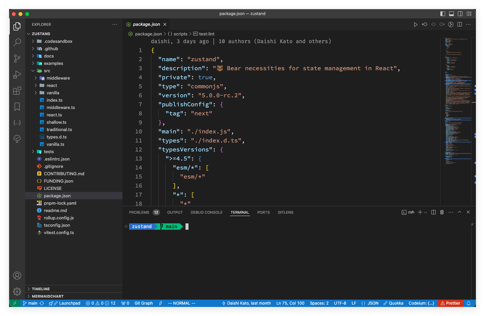
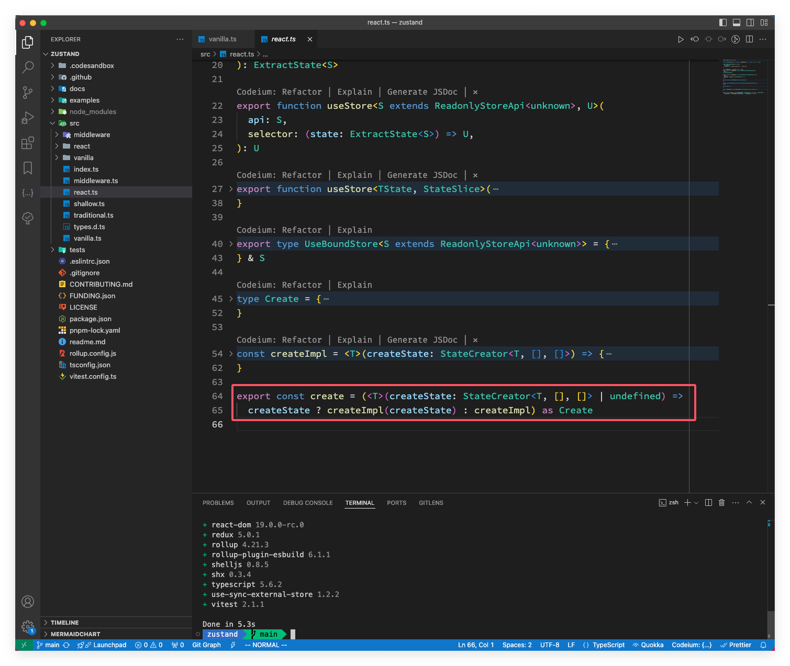
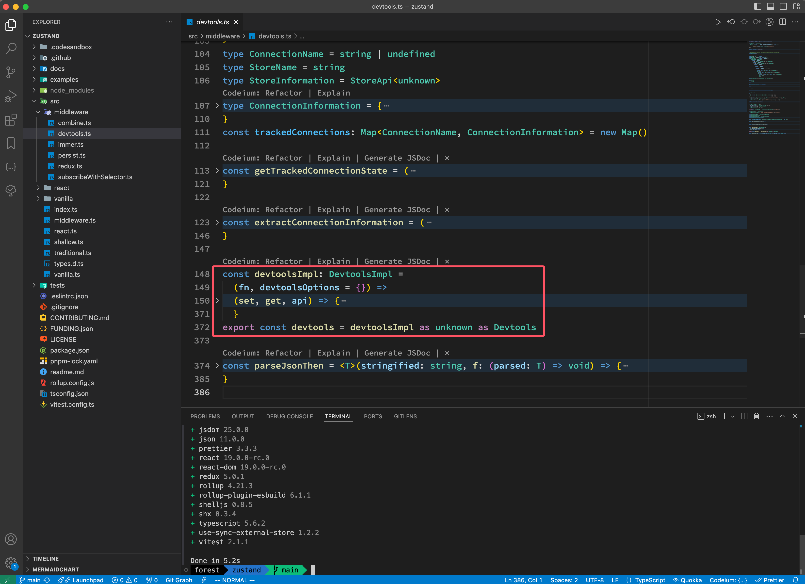
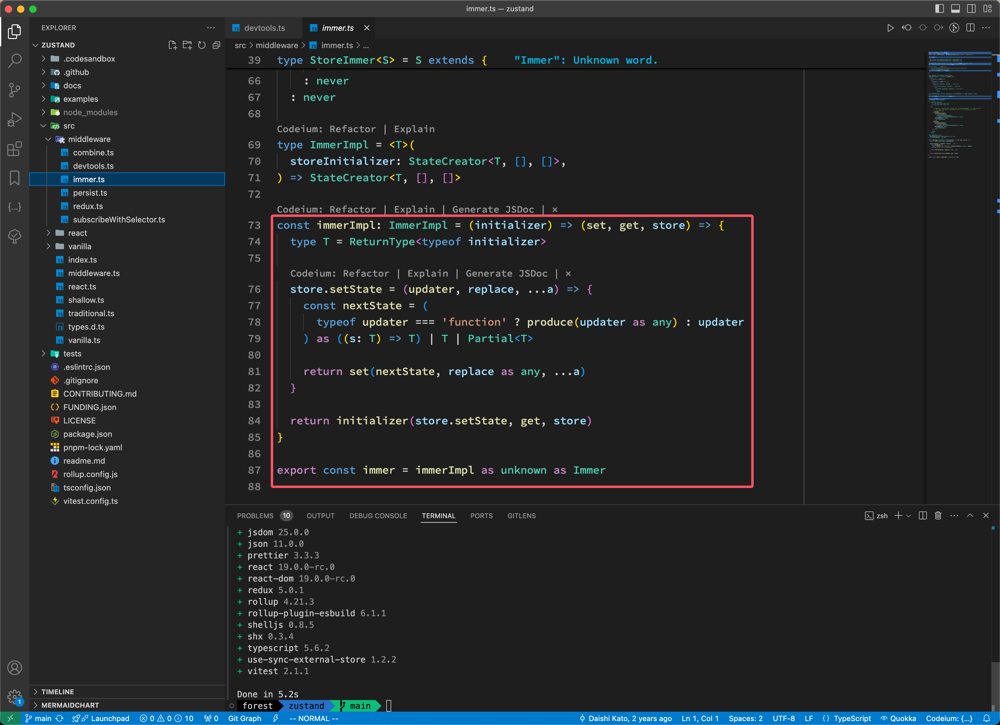

在上一篇文章中深入的学习了 zustand 的概念及在 React 中的使用，接下来我们看看他的源码！

> 我从官方仓库 fork 了一份最新的代码（v5.0.0-rc.2）版本，可以访问 [https://github.com/clin211/zustand](https://github.com/clin211/zustand) 查看，本文也是基于这个版本进行学习！
>
> 环境要求:
>
> - Node.js   >=12.20.0
> - TypeScript   >=4.5
> - pnpm 虽然没有版本要求，为了达到与下文一样的效果，可以跟我保持一致，使用 v8.12.1

## 目录分析



从上面的图中，我们可以看到以下主要的文件和目录：

- `src/`：源代码目录
  - `middleware/`:
    - `combine.ts:` 实现了将多个 store 组合在一起的中间件。
    - `devtools.ts`: 实现了与 Redux DevTools 进行交互的中间件。
    - `immer.ts`: 支持 immer 库的中间件，用于不可变数据结构。
    - `persist.ts`: 实现了持久化 store 的中间件。
    - `redux.ts`: 模拟 Redux 风格的中间件。
    - `subscribeWithSelector.ts`: 支持选择订阅和响应的中间件。
  - `react/`:
    - `shallow.ts`: 实现 react 相关的浅比较函数，用于优化组件渲染。
  - `vanilla/`:
    - `shallow.ts`: 实现原生状态管理版本的浅比较函数。
  - `index.ts`: Zustand 的主要入口文件，会汇总和输出所有核心功能。
  - `middleware.ts`: 汇总和重导出中间件。
  - `react.ts`: 实现了 Zustand 与 React 的绑定，导出有关 React 接口和 `create`等 。
  - `shallow.ts`: 提供浅比较功能，通常用于比较状态变化以优化性能。
  - `traditional.ts`: 提供了传统的状态管理模式，适用于不使用 hooks 的场景。
  - `types.d.ts`: TypeScript 类型声明文件，定义了 Zustand 中使用的类型。
  - `vanilla.ts`: 实现了 Zustand 的核心功能，不依赖于 React。这使得 Zustand 可以在其他环境（如 React Native）中使用。

- `docs/`：介绍文档
- `examples/`：示例代码
- `tests/`：单元测试代码
- `package.json`：项目配置文件

通常前端库的核心逻辑都在 src 目录下，入口文件一般也是 `index.js/ts`，zustand 也不例外，上图就是 zustand 的源码，从目录结构可以看出 src 下有 vanilla、react、middleware 三个目录，什么是 vanilla 呢？**vanilla 就是可以不结合任何框架（例如 React、Vue 等等）来单独使用的**，我们就称其为 vanilla，我们可以在许多库的源码中看到 vanilla 文件或者文件夹，比如 jotai、valtio 等，这些包含了最基础的 JavaScript 实现，而我们平时在 React 使用的，是这些基础的实现 + Hooks。react 目录就是适配的 react 框架，middleware 就是中间件。

## 源码解读

上面我们对项目结构有大致的认识，接下来就一步步揭开 zustand 的神秘面纱；先从入口文件（index.ts）看，它导出了 vanilla.ts 和 react.ts 两个文件:

```ts
export * from './vanilla.ts'
export * from './react.ts'
```

上一篇文章主要就是在 react 中的使用，源码我们依然从 react 的视角入手！

> vs code 看源码的小技巧：
>
> - 要操作光标所在**文件**中的所有代码块：
>   - 折叠所有 `Command+K+0`
>   - 展开所有 `Command+K+J`
> - 仅仅操作光标所**代码块**内的代码：
>   - 折叠 `Command+Option+[`
>   - 展开 `Command+Option+]`

### create

先看 `react.ts`， 这个文件的代码量也不大，不到 70 行，将代码折叠起来后，代码结构也一目了然，基本上也能看到导出了哪些函数/方法、类型；其中就有一个我们比较熟悉的 `create` 方法：

```ts
export const create = (<T>(createState: StateCreator<T, [], []> | undefined) =>
  createState ? createImpl(createState) : createImpl) as Create
```



这个方法就是用来创建一个 store 的，在使用 `create` 方法的时候，如果有 `createState` 参数，就调用 `createImpl` 方法，否则就返回 `createImp` 方法。`createState` 是一个回调函数，里面包含我们定义的状态和更改函数。

```ts
export type StateCreator<
  T,
  Mis extends [StoreMutatorIdentifier, unknown][] = [],
  Mos extends [StoreMutatorIdentifier, unknown][] = [],
  U = T,
> = ((
  setState: Get<Mutate<StoreApi<T>, Mis>, 'setState', never>,
  getState: Get<Mutate<StoreApi<T>, Mis>, 'getState', never>,
  store: Mutate<StoreApi<T>, Mis>,
) => U) & { $$storeMutators?: Mos }
```

通过定义可以看到回调函数第一个参数是 setState， 第二个参数是 getState，第三个参数是 store。

### createImpl

`createImpl` 里面主要调用了 两个函数 `createStore` 和 `useStore`

```ts
const createImpl = <T>(createState: StateCreator<T, [], []>) => {
  const api = createStore(createState)

  const useBoundStore: any = (selector?: any) => useStore(api, selector)

  Object.assign(useBoundStore, api)

  return useBoundStore
}
```

代码也很简洁，调用 `createStore` 和 `useStore` 两个方法，分别返回一个 api 和 一个 `useBoundStore` 的对象，然后使用`` Object.assign` 方法合并两个对象，最后返回 `useBoundStore`。接下来我们分别 看看 `createStore` 和 `useStore`分别做了哪些操作。

### createStore

在 createImpl 中调用的 `createStore` 在 vanilla  中，源码如下：

```ts
export const createStore = ((createState) =>
  createState ? createStoreImpl(createState) : createStoreImpl) as CreateStore
```

如果有 `createState` 参数，就调用 `createStoreImpl` 方法，否则就调用 `createStoreImpl` 方法；下面看看 `createStoreImpl` 方法的具体实现：

```ts
const createStoreImpl: CreateStoreImpl = (createState) => {
  type TState = ReturnType<typeof createState>
  type Listener = (state: TState, prevState: TState) => void
  let state: TState
  // 存储所有的监听器函数(订阅者)
  const listeners: Set<Listener> = new Set()

  const setState: StoreApi<TState>['setState'] = (partial, replace) => {
    // 参数如果是函数，那么就是一个函数，这个函数需要接收当前的 state 并返回一个新的 state，否则就赋值
    // https://github.com/microsoft/TypeScript/issues/37663#issuecomment-759728342
    const nextState =
      typeof partial === 'function'
        ? (partial as (state: TState) => TState)(state)
        : partial

    // 通过 Object.is 对新state和旧state 进行比较，如果不相等则更新
    if (!Object.is(nextState, state)) {
      const previousState = state

      // 如果 replace 为 true，则直接赋值，否则合并后一个新对象
      state =
        (replace ?? (typeof nextState !== 'object' || nextState === null))
          ? (nextState as TState)
          : Object.assign({}, state, nextState)

      // 遍历所有的订阅者，通知订阅者
      listeners.forEach((listener) => listener(state, previousState))
    }
  }

  // 获取当前的 state
  const getState: StoreApi<TState>['getState'] = () => state

  // 获取初始的 state
  const getInitialState: StoreApi<TState>['getInitialState'] = () =>
    initialState

  // 添加订阅者到订阅者集合里面，同时返回对应销毁函数
  const subscribe: StoreApi<TState>['subscribe'] = (listener) => {
    listeners.add(listener)
    // Unsubscribe
    return () => listeners.delete(listener)
  }

  // 所有处理函数以对象的形式暴露出去
  const api = { setState, getState, getInitialState, subscribe }
  const initialState = (state = createState(setState, getState, api))
  return api as any
}
```

这个代码也不多，一共 37（不含注释） 行代码；基本上都对源码做了注解，其中要特别说明的是 `setState` 方法，可能有小伙伴觉得 `setState` 方法中 `(replace ?? (typeof nextState !== 'object' || nextState === null)) ? (nextState as TState) : Object.assign({}, state, nextState)` 这块的逻辑有点复杂，其实分开来看一下子就能搞明白：

- 如果 `replace` 存在，就直接赋值 `nextState`，否则就执行 `??` 的判断。
- `nextState` 不是对象或者 `nextState` 是 `null`，也直接赋值 `nextState`。
- 如果上面两种情况都不是，那就直接将 `state` 和 `nextState` 合并到一个空对象中，然后赋值给 `state`。

### useStore

上面我们完整的解析了 `createStore` 方法，下面我们就来看看 `useStore` 的实现！

```ts
const identity = <T>(arg: T): T => arg
export function useStore<S extends ReadonlyStoreApi<unknown>>(
  api: S,
): ExtractState<S>

export function useStore<S extends ReadonlyStoreApi<unknown>, U>(
  api: S,
  selector: (state: ExtractState<S>) => U,
): U
```

`useStore` 使用了 TypeScript 的重载功能来支持不同的用法，第一种使用方法也是最简单的，传入一个 `api` 参数，只获取当前状态。第二种方法是传入一个 `api` 和一个 `selecter`。接下来我们看看具体实现：

```ts
export function useStore<TState, StateSlice>(
  api: ReadonlyStoreApi<TState>,
  selector: (state: TState) => StateSlice = identity as any,
) {
  const slice = React.useSyncExternalStore(
    api.subscribe,
    () => selector(api.getState()),
    () => selector(api.getInitialState()),
  )
  React.useDebugValue(slice)
  return slice
}
```

这段代码的核心逻辑就是 React 中 [`useSyncExternalStore`](https://zh-hans.react.dev/reference/react/useSyncExternalStore) 这个 Hook，用来定义外部 store 的，store 变化以后会触发 re-render；在 zustand v4.5.5 版本中还是用的 [use-sync-external-store](https://github.com/facebook/react/blob/main/packages/use-sync-external-store/README.md) 中的 [`useSyncExternalStoreWithSelector`](https://github.com/facebook/react/blob/main/packages/use-sync-external-store/shim/with-selector/index.js)，借用这个完成外部存储的订阅，然后把订阅的数据返回。

> `zustand`的核心代码如此简洁，一大原因就是使用了`useSyncExternalStoreWithSelector`，这个是`react`官方出的`use-sync-external-store/shim/with-selector`包，之所以出这个包，是因为`react`在提出[useSyncExternalStore](https://react.dev/reference/react/useSyncExternalStore#usage)这个 hook 后，在`react v18`版本做了重新实现，有破坏性更新。为了兼容性考虑出了这个包。

最后我们看下 `createImpl` 到底返回了什么：

```ts
const createImpl = <T>(createState: StateCreator<T, [], []>) => {
  const api = createStore(createState)

  const useBoundStore: any = (selector?: any) => useStore(api, selector)

  Object.assign(useBoundStore, api)

  return useBoundStore
}
```

通过上面的分析我们知道 `api` 是关于 `state` 的操作，`useBoundStore` 是订阅的数据回调函数，最后合并后，`useBoundStore` 这个函数上面挂载了 `api` 的方法。

### useShallow

在上篇文章中我们用过这个方法，上篇文章的使用场景是避免重新渲染；你需要订阅存储中的一个计算状态时，推荐的方式是使用一个 `selector`，这个计算选择器会在输出发生变化时导致重新渲染，判断变化的方式是使用 `Object.is`。在 React 中，就是 vanilla 的实现＋ React Hook 的实现，它的源码实现代码量也不多：

```ts
import React from 'react'
import { shallow } from '../vanilla/shallow.ts'

export function useShallow<S, U>(selector: (state: S) => U): (state: S) => U {
  // 缓存上一次的值
  const prev = React.useRef<U>()
  return (state) => {
    const next = selector(state)
    // 使用 vanilla 中的 shallow 比较是否要更新
    return shallow(prev.current, next)
      ? (prev.current as U)
      : (prev.current = next)
  }
}
```

我们看看 vanilla 中的 `shallow` 的实现：

```ts
const isIterable = (obj: object): obj is Iterable<unknown> =>
  Symbol.iterator in obj

// Map 对比
const compareMapLike = (
  iterableA: Iterable<[unknown, unknown]>,
  iterableB: Iterable<[unknown, unknown]>,
) => {
    // 是 Map 就直接返回，如果不是就 new 一个
  const mapA = iterableA instanceof Map ? iterableA : new Map(iterableA)
  const mapB = iterableB instanceof Map ? iterableB : new Map(iterableB)
  
  // 如果 size 不一样就直接返回 false
  if (mapA.size !== mapB.size) return false
    
  // 逐项对比
  for (const [key, value] of mapA) {
    if (!Object.is(value, mapB.get(key))) {
      return false
    }
  }
  return true
}

export function shallow<T>(objA: T, objB: T): boolean {
  // 浅比较是否相等
  if (Object.is(objA, objB)) {
    return true
  }
  // 做引用类型的判断
  if (
    typeof objA !== 'object' ||
    objA === null ||
    typeof objB !== 'object' ||
    objB === null
  ) {
    return false
  }

  // 两个对象是否是可迭代的
  if (isIterable(objA) && isIterable(objB)) {
    const iteratorA = objA[Symbol.iterator]()
    const iteratorB = objB[Symbol.iterator]()
    let nextA = iteratorA.next()
    let nextB = iteratorB.next()

    // 两个都是数组且长度都为 2
    if (
      Array.isArray(nextA.value) &&
      Array.isArray(nextB.value) &&
      nextA.value.length === 2 &&
      nextB.value.length === 2
    ) {
      // Map 比较
      return compareMapLike(
        objA as Iterable<[unknown, unknown]>,
        objB as Iterable<[unknown, unknown]>,
      )
    }
    // 逐个比较两个可迭代对象中的元素
    while (!nextA.done && !nextB.done) {
      if (!Object.is(nextA.value, nextB.value)) {
        return false
      }
      nextA = iteratorA.next()
      nextB = iteratorB.next()
    }
    return !!nextA.done && !!nextB.done
  }

  // 对比两个对象的键的长度
  const keysA = Object.keys(objA)
  if (keysA.length !== Object.keys(objB).length) {
    return false
  }

  // 对比两个对象的每个键的值
  for (const keyA of keysA) {
    if (
      !Object.hasOwn(objB, keyA as string) ||
      !Object.is(objA[keyA as keyof T], objB[keyA as keyof T])
    ) {
      return false
    }
  }
  return true
}
```

这个代码实现也比较简单，就不做过多的解释，代码中也有一些注释！

### 中间件

#### combine

`combine` 将多个 store 组合在一起，适用于复杂状态管理。主要功能是合并两个状态对象。它将初始状态对象 `initialState` 和通过 `create` 函数生成的状态对象合并到一起。返回一个新的状态创建函数，这个新的状态创建函数会将初始状态和附加状态合并为一个状态对象。

```ts
import type { StateCreator, StoreMutatorIdentifier } from '../vanilla.ts'

type Write<T, U> = Omit<T, keyof U> & U

type Combine = <
  T extends object,
  U extends object,
  Mps extends [StoreMutatorIdentifier, unknown][] = [],
  Mcs extends [StoreMutatorIdentifier, unknown][] = [],
>(
  initialState: T,
  additionalStateCreator: StateCreator<T, Mps, Mcs, U>,
) => StateCreator<Write<T, U>, Mps, Mcs>

// 返回一个新函数，这个新函数接收可变参数（...a）
export const combine: Combine =
  (initialState, create) =>
  (...a) =>
    Object.assign({}, initialState, (create as any)(...a))
```


#### devtools

提供与 Redux DevTools 进行交互的功能，便于调试状态变化。`devtools` 中间件允许开发者通过 Redux DevTools 工具监控状态变化和调试。核心实现是对 `setState` 方法进行包装，并在每次状态更新时向 Redux DevTools 发送状态变化的通知。



这一部分代码尝试在浏览器中获取 Redux DevTools 扩展，如果未安装则会输出警告信息。：

```ts
let extensionConnector:
  | (typeof window)['__REDUX_DEVTOOLS_EXTENSION__']
  | false
try {
  extensionConnector =
    (enabled ?? import.meta.env?.MODE !== 'production') &&
    window.__REDUX_DEVTOOLS_EXTENSION__
} catch {
  // ignored
}
```

包装的核心逻辑是这块：

```ts
// 控制是否需要记录状态的变化
let isRecording = true

// 将 api.setState 替换成一个新的函数并被强制转换为 any 类型。
;(api.setState as any) = ((state, replace, nameOrAction: Action) => {
    
  // 调用原始的 set 函数
  const r = set(state, replace as any)
  
  // 如果不进行任何额外的操作，直接返回 r
  if (!isRecording) return r
    
  // 根据 nameOrAction 参数来生成一个 action 对象且包含 type 属性
  const action: { type: string } =
    nameOrAction === undefined
      ? { type: anonymousActionType || 'anonymous' }
      : typeof nameOrAction === 'string'
        ? { type: nameOrAction }
        : nameOrAction
  
  // 如果 store 为 undefined 则通过 connection.send 发送 action 和当前状态并返回 set 后的对象
  if (store === undefined) {
    connection?.send(action, get())
    return r
  }
  
  // 如果 store 不为 undefined，则发送一个带有 store 信息的 action，将 action.type 更新为 ${store}/${action.type}
  connection?.send(
    {
      ...action,
      type: `${store}/${action.type}`,
    },
    {
      ...getTrackedConnectionState(options.name),
      [store]: api.getState(),
    },
  )
  return r
}) as NamedSet<S>
```

这段代码的作用是在 `setState` 调用时，记录状态的变化并通过 `connection` 发送到外部。它提供了对 `state` 更改的拦截，并根据 `isRecording` 和 `store` 的状态决定是否发送记录。

通过 `action` 和 `store` 的组合，它能够为每个状态更改分配唯一的标识符，确保在多 store 的环境下区分不同的状态。

```ts
;(
  connection as unknown as {
    // FIXME https://github.com/reduxjs/redux-devtools/issues/1097
    subscribe: (
      listener: (message: Message) => void,
    ) => (() => void) | undefined
  }
).subscribe((message: any) => {
  // 根据不同的 type 类型进行处理
  switch (message.type) {
    case 'ACTION':
      // 如果 payload 不是字符串就打印错误信息并终止继续执行
      if (typeof message.payload !== 'string') {
        console.error(
          '[zustand devtools middleware] Unsupported action format',
        )
        return
      }
      // 解析 json 格式的 payload
      return parseJsonThen<{ type: unknown; state?: PartialState }>(
        message.payload,
        (action) => {
          if (action.type === '__setState') {
            if (store === undefined) {
              setStateFromDevtools(action.state as PartialState)
              return
            }
            // 如果有多个属性则直接打印错误信息
            if (Object.keys(action.state as S).length !== 1) {
              console.error(
                `
                [zustand devtools middleware] Unsupported __setState action format.
                When using 'store' option in devtools(), the 'state' should have only one key, which is a value of 'store' that was passed in devtools(),
                and value of this only key should be a state object. Example: { "type": "__setState", "state": { "abc123Store": { "foo": "bar" } } }
                `,
              )
            }
            // 从 action.state 中获取 store
            const stateFromDevtools = (action.state as S)[store]
            
            // 如果没有值就直接返回
            if (
              stateFromDevtools === undefined ||
              stateFromDevtools === null
            ) {
              return
            }
              
            // 如果当前状态与 DevTools 中的状态不同，直接更新应用状态
            if (
              JSON.stringify(api.getState()) !==
              JSON.stringify(stateFromDevtools)
            ) {
              setStateFromDevtools(stateFromDevtools)
            }
            return
          }

          // 如果 dispatchFromDevtools 不存在，则直接返回
          if (!(api as any).dispatchFromDevtools) return
          if (typeof (api as any).dispatch !== 'function') return
            
          // 调用 dispatch 执行 action
          ;(api as any).dispatch(action)
        },
      )

    case 'DISPATCH':
      switch (message.payload.type) {
        // 重置
        case 'RESET':
          setStateFromDevtools(initialState as S)
          if (store === undefined) {
            return connection?.init(api.getState())
          }
          return connection?.init(getTrackedConnectionState(options.name))
		// 提交
        case 'COMMIT':
          if (store === undefined) {
            connection?.init(api.getState())
            return
          }
          return connection?.init(getTrackedConnectionState(options.name))
		// 回滚
        case 'ROLLBACK':
          return parseJsonThen<S>(message.state, (state) => {
            if (store === undefined) {
              setStateFromDevtools(state)
              connection?.init(api.getState())
              return
            }
            setStateFromDevtools(state[store] as S)
            connection?.init(getTrackedConnectionState(options.name))
          })
		// 跳转到指定的状态或操作
        case 'JUMP_TO_STATE':
        case 'JUMP_TO_ACTION':
          return parseJsonThen<S>(message.state, (state) => {
            if (store === undefined) {
              setStateFromDevtools(state)
              return
            }
            if (
              JSON.stringify(api.getState()) !==
              JSON.stringify(state[store])
            ) {
              setStateFromDevtools(state[store] as S)
            }
          })

        // 导入 state
        case 'IMPORT_STATE': {
          const { nextLiftedState } = message.payload
          const lastComputedState =
            nextLiftedState.computedStates.slice(-1)[0]?.state
          if (!lastComputedState) return
          if (store === undefined) {
            setStateFromDevtools(lastComputedState)
          } else {
            setStateFromDevtools(lastComputedState[store])
          }
          connection?.send(
            null as any, // FIXME no-any
            nextLiftedState,
          )
          return
        }
		// 暂停或继续记录状态更改
        case 'PAUSE_RECORDING':
          return (isRecording = !isRecording)
      }
      return
  }
})
```

该代码片段订阅了 Redux DevTools 的消息，并相应地更新 Zustand 的状态。当 DevTools 发送 `RESET`、`COMMIT`、`ROLLBACK` 等命令时，对应的处理逻辑也会同步更新 Zustand 的状态。

#### immer

`immer` 中间件允许我们使用 Immer 库来管理不可变状态。`immer` 接受一个状态创建函数，并在内部通过 `produce` 函数生成不可变的新状态。



使用也很方便：

```ts
import { produce } from 'immer'

const useStore = create(immer((set) => ({
  count: 0,
  increment: () => set(produce((state) => {
    state.count += 1;
  })),
})));
```

#### persist

它将 store 的状态保存在本地存储中（如 `localStorage`），并在应用重新加载时恢复状态。这persist` 中间件的核心在于，它通过包装 `setState` 方法，将状态变化同步到本地存储中。当应用重新加载时，它会从本地存储中恢复状态，并更新到 store 中。

```ts
// ...

const persistImpl: PersistImpl = (config, baseOptions) => (set, get, api) => {
  // 实现逻辑
}

type PersistImpl = <T>(
  storeInitializer: StateCreator<T, [], []>,
  options: PersistOptions<T, T>,
) => StateCreator<T, [], []>

// ...
export const persist = persistImpl as unknown as Persist
```

> 代码太多了，就不一一贴出来了，可以访问 [src/middleware/persist.ts](https://github.com/clin211/zustand/blob/main/src/middleware/persist.ts)查看源码！

上面可以看到 `persist` 其实就是 `persistImpl`，它通过 `api.setState` 进行包装，当状态发生变化时会将其存储到持久化存储中。主要流程如下：

- **初始化持久化选项**：将用户传入的 `PersistOptions` 和默认的选项合并。
- **重写 `setState`**：它会拦截 `zustand` 的 `setState` 方法，在状态更新后调用 `setItem` 将更新后的状态持久化到存储中。
- **初始化状态 `hydrate`**：调用 `hydrate` 函数，从存储中获取已保存的状态，如果有保存的状态，则合并存储的状态与当前状态。如果版本不匹配且有 `migrate` 函数，则进行状态迁移。
- **注册生命周期回调**：包括 `onHydrate` 和 `onFinishHydration`，分别在状态开始和结束持久化时触发。

还定义了用于存储管理的接口。通过实现这些接口，可以自定义各种存储解决方案（如 `localStorage`、`sessionStorage` 或其他异步存储）。

```ts
export interface StateStorage {
  getItem: (name: string) => string | null | Promise<string | null>
  setItem: (name: string, value: string) => unknown | Promise<unknown>
  removeItem: (name: string) => unknown | Promise<unknown>
}

export type StorageValue<S> = {
  state: S
  version?: number
}
```

从 `PersistOptions` 中可以看出，持久化的配置项，定义了持久化的存储位置默认是 `localStorage`

```ts
export interface PersistOptions<S, PersistedState = S> {
  /** Name of the storage (must be unique) */
  name: string
  /**
   * Use a custom persist storage.
   *
   * Combining `createJSONStorage` helps creating a persist storage
   * with JSON.parse and JSON.stringify.
   *
   * @default createJSONStorage(() => localStorage)
   */
  storage?: PersistStorage<PersistedState> | undefined
  /**
   * Filter the persisted value.
   *
   * @params state The state's value
   */
  partialize?: (state: S) => PersistedState
  /**
   * A function returning another (optional) function.
   * The main function will be called before the state rehydration.
   * The returned function will be called after the state rehydration or when an error occurred.
   */
  onRehydrateStorage?: (
    state: S,
  ) => ((state?: S, error?: unknown) => void) | void
  /**
   * If the stored state's version mismatch the one specified here, the storage will not be used.
   * This is useful when adding a breaking change to your store.
   */
  version?: number
  /**
   * A function to perform persisted state migration.
   * This function will be called when persisted state versions mismatch with the one specified here.
   */
  migrate?: (
    persistedState: unknown,
    version: number,
  ) => PersistedState | Promise<PersistedState>
  /**
   * A function to perform custom hydration merges when combining the stored state with the current one.
   * By default, this function does a shallow merge.
   */
  merge?: (persistedState: unknown, currentState: S) => S

  /**
   * An optional boolean that will prevent the persist middleware from triggering hydration on initialization,
   * This allows you to call `rehydrate()` at a specific point in your apps rendering life-cycle.
   *
   * This is useful in SSR application.
   *
   * @default false
   */
  skipHydration?: boolean
}
```

`PersistOptions` 接口用于配置 `zustand` 状态持久化中间件的行为，允许开发者控制状态如何存储、过滤、迁移和合并。核心选项包括存储名称（`name`），自定义存储方式（`storage`，如 `localStorage`），通过 `partialize` 过滤需要持久化的状态，及在状态恢复（`rehydration`）前后的回调（`onRehydrateStorage`）。此外，`version` 用于控制状态版本，当版本不匹配时可通过 `migrate` 函数处理旧状态，`merge` 用于自定义存储状态与当前状态的合并方式，`skipHydration` 则可防止应用初始化时自动恢复状态。

使用示例如下：

```ts
import { persist } from 'zustand/middleware'

const useStore = create(
  persist(
    (set) => ({
      user: null,
      login: (user) => set({ user }),
      logout: () => set({ user: null }),
    }),
    {
      name: 'user-storage', // 存储的 key
      partialize: (state) => ({ user: state.user }), // 只持久化 user 字段
      version: 1, // 状态的版本控制
      migrate: (persistedState, version) => {
        // 当版本号不匹配时执行的迁移逻辑
        if (version === 0) {
          return { user: persistedState.user }
        }
        return persistedState
      },
    }
  )
)
```

#### redux

redux 中间件能够让 Zustand 模仿 Redux 风格的状态管理，提供类似的 `dispatch` 和 `reducer` 的支持，让开发者能够以 Redux 的方式去管理和更新状态，其核心在于通过 `dispatch` 方式将 `action` 传递给 `reducer`，并更具 `reducer` 的返回值更新状态；这样就可以将 Redux 的设计模式融入 Zustand 状态管理中。

```ts
type Write<T, U> = Omit<T, keyof U> & U

// 定义一个 Redux 动作对象，包含一个 type 属性
type Action = { type: string }


type StoreRedux<A> = {
  dispatch: (a: A) => A
  dispatchFromDevtools: true // 是否支持从 Redux DevTools 分发 action
}

type ReduxState<A> = {
  dispatch: StoreRedux<A>['dispatch']
}

type WithRedux<S, A> = Write<S, StoreRedux<A>>

type Redux = <
  T,
  A extends Action,
  Cms extends [StoreMutatorIdentifier, unknown][] = [],
>(
  reducer: (state: T, action: A) => T,
  initialState: T,
) => StateCreator<Write<T, ReduxState<A>>, Cms, [['zustand/redux', A]]>
```
`StoreRedux` 和 `ReduxState` 类型定义了状态扩展的方法，允许在 Zustand 中使用 `dispatch` 方法来分发动作。接下来看看 redux 中间件是怎么实现的：
```ts
type ReduxImpl = <T, A extends Action>(
  reducer: (state: T, action: A) => T, // 根据 action 更新状态
  initialState: T, // 初始状态
) => StateCreator<T & ReduxState<A>, [], []>

const reduxImpl: ReduxImpl = (reducer, initial) => (set, _get, api) => {
  type S = typeof initial
  type A = Parameters<typeof reducer>[1]
  // 定义 dispatch 方法
  ;(api as any).dispatch = (action: A) => {
    ;(set as NamedSet<S>)((state: S) => reducer(state, action), false, action)
    return action
  }
  // 支持 Redux DevTools 的调试
  ;(api as any).dispatchFromDevtools = true

  return { dispatch: (...a) => (api as any).dispatch(...a), ...initial }
}
export const redux = reduxImpl as unknown as Redux
```

使用起来也比较简单，下面是个简单的示例：
```ts
import create from 'zustand';
import { redux } from 'zustand/middleware';

// 定义 reducer 函数
const reducer = (state, action) => {
  switch (action.type) {
    case 'INCREMENT':
      return { count: state.count + 1 };
    case 'DECREMENT':
      return { count: state.count - 1 };
    default:
      return state;
  }
};

// 创建 store
const useStore = create(redux(reducer, { count: 0 }));

function Counter() {
  // 获取当前状态和 dispatch 方法
  const count = useStore((state) => state.count);
  const dispatch = useStore((state) => state.dispatch);

  return (
    <div>
      <span>{count} </span>
      {/* 点击按钮就派发 Increment 和 decrement 去更新状态 */}
      < button onClick={() => dispatch({ type: 'INCREMENT' })}> Increment </button>
      < button onClick={() => dispatch({ type: 'DECREMENT' })}> Decrement </button>
    </div>
  );
}
```
#### subscribeWithSelector

subscribeWithSelector 是 zustand 的一个中间件，它允许开发者订阅 store 中特定的状态片段，而不是整个状态。这种方式可以提高性能，因为只有当选择的状态发生变化时，才会触发回调函数。它还支持在组件外部监听状态变化，并允许使用自定义比较函数。通过 subscribeWithSelector，开发者可以更好地优化应用性能，提高响应速度，并在处理复杂状态逻辑时获得更大的灵活性。

扩展后的 subscribe 方法，提供两种订阅方式：
- 一种是订阅整个状态的变化。
- 另一种是通过选择器订阅状态子集的变化。
```ts
type StoreSubscribeWithSelector<T> = {
  subscribe: {
    (listener: (selectedState: T, previousSelectedState: T) => void): () => void
    <U>(
      selector: (state: T) => U,
      listener: (selectedState: U, previousSelectedState: U) => void,
      options?: {
        equalityFn?: (a: U, b: U) => boolean
        fireImmediately?: boolean
      },
    ): () => void
  }
}
```
这段代码实现了 `subscribeWithSelector` 中间件的核心逻辑。让我们逐步解析：
```ts
type SubscribeWithSelectorImpl = <T extends object>(
  storeInitializer: StateCreator<T, [], []>,
) => StateCreator<T, [], []>

// 接收一个 store 初始化函数 fn，并返回一个新的 store 创建函数
const subscribeWithSelectorImpl: SubscribeWithSelectorImpl =
  (fn) => (set, get, api) => {
    type S = ReturnType<typeof fn>
    type Listener = (state: S, previousState: S) => void
    // 暂存原来的 subscribe
    const origSubscribe = api.subscribe as (listener: Listener) => () => void
    // 在原来 subscribe 的基础上扩展
    api.subscribe = ((selector: any, optListener: any, options: any) => {
      let listener: Listener = selector // 如果没有选择器，直接使用传入的监听器
      if (optListener) {
        // 比较选择器返回的新旧值，默认是 Object.is 方法
        const equalityFn = options?.equalityFn || Object.is
        let currentSlice = selector(api.getState())
        listener = (state) => {
          const nextSlice = selector(state)
          // 值有变化，则调用监听器
          if (!equalityFn(currentSlice, nextSlice)) {
            const previousSlice = currentSlice
            optListener((currentSlice = nextSlice), previousSlice)
          }
        }
        // 如果设置了 fireImmediately 选项，立即触发一次监听器
        if (options?.fireImmediately) {
          optListener(currentSlice, currentSlice)
        }
      }
      // 调用原始的 subscribe 方法来注册这个新创建的监听器并返回
      return origSubscribe(listener)
    }) as any
    // 调用原始的 store 初始化函数 fn，并返回初始状态
    const initialState = fn(set, get, api)
    return initialState
  }
export const subscribeWithSelector =
  subscribeWithSelectorImpl as unknown as SubscribeWithSelector
```
这个实现允许用户订阅 store 的特定部分（通过选择器），并且只有当选择的部分发生变化时才触发监听器，从而提高了性能和灵活性。

这个使用示例也比较简单：
```ts
import create from 'zustand';
import { subscribeWithSelector } from 'zustand/middleware';

const useStore = create(subscribeWithSelector((set) => ({
  count: 0,
  text: "",
  increment: () => set((state) => ({ count: state.count + 1 })),
  setText: (text) => set({ text }), // 修改 text
})));

function Counter() {
  const count = useStore((state) => state.count);
  const increment = useStore((state) => state.increment);

  return (
    <div>
      <span>{count}</span>
      <button onClick={increment}>Increment</button>
    </div>
  );
}

function TextInput() {
  const text = useStore((state) => state.text);
  const setText = useStore((state) => state.setText);

  return (
    <input
      value={text}
      onChange={(e) => setText(e.target.value)}
    />
  );
}
```

这段代码展示了使用 Zustand 和 `subscribeWithSelector` 中间件创建和使用一个状态管理 store 的基本方法。两个 React 组件 `Counter` 和 `TextInput` 分别演示了如何使用这个 store。`Counter` 组件显示计数并提供增加按钮，而 `TextInput` 组件允许用户输入和修改文本。

## 总结

Zustand 是一个轻量、灵活、高效的状态管理库。它提供了简单易用的 API，无外部依赖，与 React 深度集成，支持中间件扩展，性能优化出色，并支持渐进式增强。通过对其核心 API 和中间件的深入研究，我们可以看到 zustand 在保持简单性的同时，提供了灵活、高效的状态管理解决方案。

源码中也有不少技巧和设计理念是值得我们学习和借鉴的；比如：
- 使用 `shallow` 做比对，避免不必要的渲染。
- 通过中间件机制增加了状态管理库的灵活性和可扩展性。
- 通过 `selector` 订阅状态的特定 stateSlice，从而减少不必要的渲染，提高性能。
- 状态管理与组件逻辑分离，每个 store 专注于管理其自身的状态和逻辑。
- 核心功能不依赖于第三方库，减少了外部依赖的复杂性。