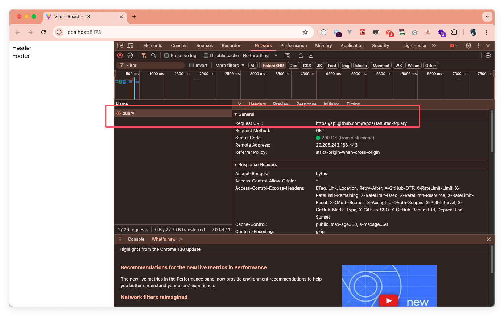

[React-Query](https://tanstack.com/query/latest) 是一个用于在 web 应用中获取、缓存、同步和更新服务器状态的库。它简化了数据获取过程，使开发者能够专注于业务逻辑，而无需处理繁琐的状态管理。它自动管理请求状态，包括加载、错误处理和数据缓存，极大提高了开发效率。内置的缓存机制不仅减少了网络请求，还提升了应用性能和用户体验。还支持复杂用例，如分页和实时数据获取。另外，它能与现代框架（如 React 和 Vue）及其他状态管理库（如 Redux 和 Zustand）无缝集成，增强了灵活性。

React-Query 通过使用查询键来标识不同接口返回的数据，而查询函数就是我们请求后端接口的函数。React-Query 中的查询是对异步数据源的声明性依赖，它与唯一键绑定。查询可以与任何基于 Promise 的方法一起使用（包括 GET 和 POST 方法）来从服务器获取数据。

## 1. 什么是 TanStack Query？

### 背景

按照官方的说法：大多数核心的 Web 框架缺乏统一的方式来获取或更新数据；在此背景下，就有了 React Query 的雏形。

### 主要功能和特点

React Query 是用来管理接口请求的，包括增删改查所有类型的接口。管理的内容包括响应数据和请求状态，可以让你少些很多样板代码。

#### 功能

- 数据获取和缓存：自动管理异步数据的获取和缓存，减少不必要的请求。
- 实时数据更新：支持实时数据更新，通过轮询或 WebSocket 等机制获取最新数据。
- 自动重新获取：当网络恢复或窗口重新获得焦点时，自动重新获取数据。
- 分页和无限加载：支持分页和无限滚动，简化处理大数据集的过程。
- 请求重试：在请求失败时自动重试，增加请求的成功率。
- 错误处理：提供简单的错误处理机制，便于捕获和处理请求错误。
- 查询和变更的分离：明确区分数据获取（查询）和数据变更（变更），使代码更清晰。
- 灵活的查询：支持复杂的查询参数，可以轻松管理不同的数据请求。
- DevTools：提供开发者工具，便于调试和监控数据状态。
- ……

#### 特点

开箱即用、无需配置。

### 与 React Query 的关系

React Query 是 v4 以前的叫法，从 v4 起就叫 TanStack Query。之所以改名字，是因为这个团队这套方案推广到除 React 之外的其他框架中去。到目前（2024年10月）最新的 v5 版本已经支持 React、Vue、Angular、Solid、Svelte 5 大框架。


## 快速入门

TanStack Query 官方也提供了一个使用 react-query 获取 React Query GitHub 统计信息的简单示例；可以[在 StackBlitz 中打开](https://stackblitz.com/github/TanStack/query/tree/main/examples/react/simple)。核心代码如下：

```jsx
import React from 'react'
import ReactDOM from 'react-dom/client'
import {
  QueryClient,
  QueryClientProvider,
  useQuery,
} from '@tanstack/react-query'
import { ReactQueryDevtools } from '@tanstack/react-query-devtools'

// 创建实例
const queryClient = new QueryClient()

export default function App() {
  return (
    <QueryClientProvider client={queryClient}>
      <ReactQueryDevtools />
      <Example />
    </QueryClientProvider>
  )
}

function Example() {
  // 发请求
  const { isPending, error, data, isFetching } = useQuery({
    queryKey: ['repoData'],
    queryFn: async () => {
      const response = await fetch(
        'https://api.github.com/repos/TanStack/query',
      )
      return await response.json()
    },
  })

  // 处理请求正在加载中的状态
  if (isPending) return 'Loading...'

  // 处理请求出错的状态
  if (error) return 'An error has occurred: ' + error.message

  return (
    <div>
      <h1>{data.full_name}</h1>
      <p>{data.description}</p>
      <strong>👀 {data.subscribers_count}</strong>{' '}
      <strong>✨ {data.stargazers_count}</strong>{' '}
      <strong>🍴 {data.forks_count}</strong>
      <div>{isFetching ? 'Updating...' : ''}</div>
    </div>
  )
}

const rootElement = document.getElementById('root') as HTMLElement
ReactDOM.createRoot(rootElement).render(<App />)
```

### 状态查询

```ts
const { status, fetchStatus, isPending, isSuccess, error, data, isError, isFetching, isPaused } = useQuery({
    queryKey: ['repoData'],
    queryFn: async () => {
        const response = await fetch('https://api.github.com/repos/TanStack/query')
        return await response.json()
    }
})
console.log('status', status, 'fetchStatus', fetchStatus, 'isPending', isPending, 'isSuccess', isSuccess, 'error', error, 'data', data, 'isError', isError, 'isFetching', isFetching)
```

可以从上面这段代码中看到在不同阶段，这些状态描述了请求的不同状态；它们分别如下：

- `isPending === true` 或者 `status === 'pending'`时，表示还在等待请求中，没有数据。
- `isSuccess === true` 或者 `status === 'success'`时，表示请求成功并且数据是可用状态。
- `isError === true` 或者 `status === 'error'` 时，表示请求出错了。
- `isFetching === true` 或者 `fetchStatus === 'fetching'` 时，表示正在请求数据中。
- `isPaused === true` 或者 `fetchStatus === 'paused'` 时，表示请求暂停中。
- `fetchStatus === 'idle'` 时，表示当前没有任何请求，处于空闲中。
- `data` 表示返回的数据。
- `error` 表示请求失败时对应的错误对象。

在上面的代码中，我们能看到有 `status` 和 `fetchStatus` 两个值来标识请求相关的状态，它两有啥关系（区别）呢？

在[官方文档](https://tanstack.com/query/latest/docs/framework/react/guides/queries#fetchstatus)中也可以到，`fetchStatus` 有三种状态：

- `fetching` 正在获取数据。
- `paused` 被迫暂停中。
- `idle` 没有任何数据处理。

而 status 也有三种状态：

- `pending` 此时还没有任何数据。
- `error` 数据处理遇到错误。
- `success` 成功处理数据并且数据可用。

它们的区别：

- `status` 用来描述是否请求到了数据。
- `fetchStatus` 用来描述 `queryFn` 是否正在执行中。

### 查询去重

这个概念就好理解，比如在一个页面的两个组件中，都请求了同一个接口，正常情况下会向服务端发起两个请求，而在 TanStack Query 中，会通过这两次请求的 `queryKey` 进行去重，通常涉及到确保查询结果中的数据是唯一的，避免重复的 `queryKey`。这在处理从服务器获取的数据时非常重要，因为重复的数据可能会导致不必要的重复渲染和错误。代码实操一下:

- Header 组件：

    ```jsx
    import { useQuery } from '@tanstack/react-query'

    const Header = () => {
        // 发请求
        const { isPending, error, data, isFetching } = useQuery({
            queryKey: ['repoData'],
            queryFn: async () => {
                const response = await fetch('https://api.github.com/repos/TanStack/query')
                return await response.json()
            }
        })
        console.log('', isPending, error, data, isFetching)
        return <div>Header</div>
    }

    export default Header
    ```

- Footer 组件

    ```jsx
    import { useQuery } from '@tanstack/react-query'

    const Footer = () => {
        // 发请求
        const { isPending, error, data, isFetching } = useQuery({
            queryKey: ['repoData'],
            queryFn: async () => {
                const response = await fetch('https://api.github.com/repos/TanStack/query')
                return await response.json()
            }
        })
        console.log('', isPending, error, data, isFetching)
        return <div>Footer</div>
    }

    export default Footer
    ```

将上面两个组件整个到一个组件中，然后在浏览器中看看实际的请求效果：

```jsx
import Header from './Header'
import Footer from './Footer'

const Main = () => {
    return (
        <div>
            <Header />
            <Footer />
        </div>
    )
}

export default Main
```



在 TanStack Query `中，queryKey` 是用于唯一标识查询的关键参数。它可以是一个简单的数组，包含常量值，也可以是一个更复杂的结构，包含动态参数。`queryKey` 的主要作用是帮助 TanStack Query 确定何时重新获取数据、缓存数据以及更新状态。

以下是一些关于 queryKey 的要点：

- **简单查询键**：最简单的形式是一个包含常量值的数组。例如：

    ```js
    useQuery({ queryKey: ['todos'], ... })
    ```

- **动态查询键**：可以包含动态参数，例如：

    ```js
    useQuery({ queryKey: ['todos', { status, page }], ... })
    ```

- **查询键的唯一性**：`queryKey` 的顺序和内容都会影响查询的唯一性。相同的 `queryKey` 会被视为相同的查询，只有在 `queryKey` 不同的情况下，TanStack Query 才会重新获取数据。

- **对象的顺序无关**：在 `queryKey` 中，如果使用对象作为参数，键的顺序不影响查询的唯一性。例如以下会被视为相同的查询：

    ```js
    useQuery({ queryKey: ['todos', { status, page }], ... })
    useQuery({ queryKey: ['todos', { page, status }], ... })
    useQuery({ queryKey: ['todos', { page, status, other: undefined }], ... })
    ```

- **数组项的顺序相关**：如果 `queryKey` 是由数组组成，数组项的顺序是重要的。例如以下会被视为不同的查询：

    ```js
    useQuery({ queryKey: ['todos', status, page], ... })
    useQuery({ queryKey: ['todos', page, status], ... })
    useQuery({ queryKey: ['todos', undefined, page, status], ...})
    ```

    通过合理使用 `queryKey`，可以有效地管理查询的状态和数据缓存，确保应用程序的性能和响应速度。

## 数据缓存与更新

在 TanStack Query 缓存中是通过 `queryKey` 来映射对应的 `query` 的，但是我们知道 `queryKey` 这个数组中即使每个元素都相同，数组也不相同。

### 数据缓存机制

TanStack Query 通过一个全局缓存对象来存储所有的 `Query` 对象，通过 `queryKey` 来映射对应的 `Query` 对象。当然这个 `queryKey` 要满足唯一性；比较容易想到的一种方式就是通过 [JSON.stringify](https://developer.mozilla.org/zh-CN/docs/Web/JavaScript/Reference/Global_Objects/JSON/stringify) 来将数据序列化，然后对比序列化后的字符串。比如：

```js
const arr1 = ['x', 'y', { key: 'value1' }]
const arr2 = ['x', 'y', { key: 'value1' }]
JSON.stringify(arr1) === JSON.stringify(arr2) // true
```

虽然这个方法这行，但是......在 JavaScript 中对象中的键是有顺序的，并不是按照插入顺序来 `JSON.stringify`，就会导致两个对象内容相同，序列化之后的结果不同。比如：

```js
const obj1 = { name: 'Alice', age: 24 }
const obj2 = { age: 24, name: 'Alice' }

JSON.stringify(obj1) // '{"name":"Alice","age":24}'
JSON.stringify(obj2) // '{"age":24,"name":"Alice"}'
JSON.stringify(obj1) === JSON.stringify(obj2) // false
```

在上面的例子中，尽管 `obj1` 和 `obj2` 具有相同的键和值，但它们的序列化后的结果不同。既然是对象属性的顺序，那我们就可以在序列化之前对独享属性进行排序，达到一个稳定的字符串结果，好在 JSON.stringify 提供了第二个参数参数，这个参数是一个函数，在序列化过程中，被序列化的值的每个属性都会经过该函数进行转换和处理。

### 如何手动更新缓存

### 使用 queryClient.invalidateQueries 方法

### 默认配置

```js
- `staleTiem`：重新获取数据的时间间隔，默认为 0
- `cacheTime`：数据缓存时间，默认 5 分钟
- `retry`：失败重试次数，默认 3 次；
- `refetchOnWindowFocus`：窗口重新获得焦点时重新获取数据，默认为 `false`
- `refetechOnReconnect`：网络重新链接
- `refetchOnMount`：实例重新挂载时重新拉取请求
- `enabled`：如果为 `false`，`useQuery` 不会触发，需要使用其返回的 `refetch` 来触发操作
```

## 6. 处理分页和无限滚动

实现分页查询
实现无限滚动
示例代码

## 7. 订阅与实时数据

如何使用 WebSocket 或其他实时数据源
示例代码

## 8. 结合其他状态管理库

在 Redux 或 Zustand 中使用 TanStack Query
示例代码

## 9. 性能优化

使用 staleTime 和 cacheTime 来优化性能
如何避免不必要的请求

## 10. 常见问题

TanStack Query 的常见误区
常见错误及其解决方法
